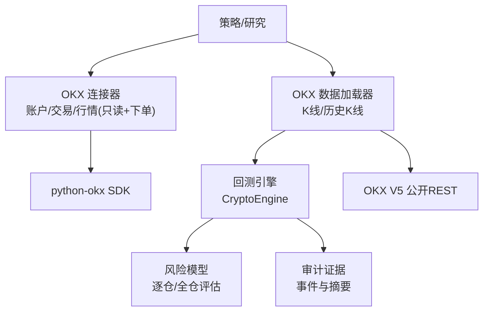
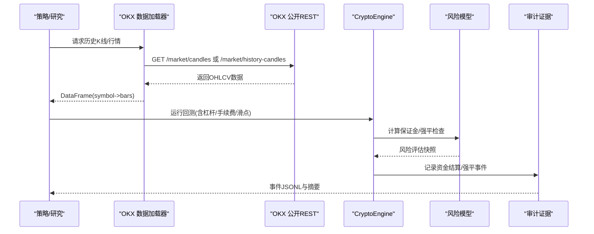
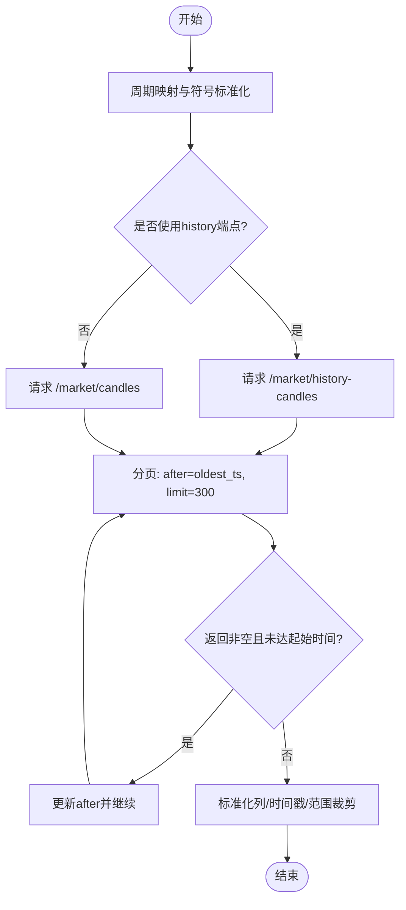
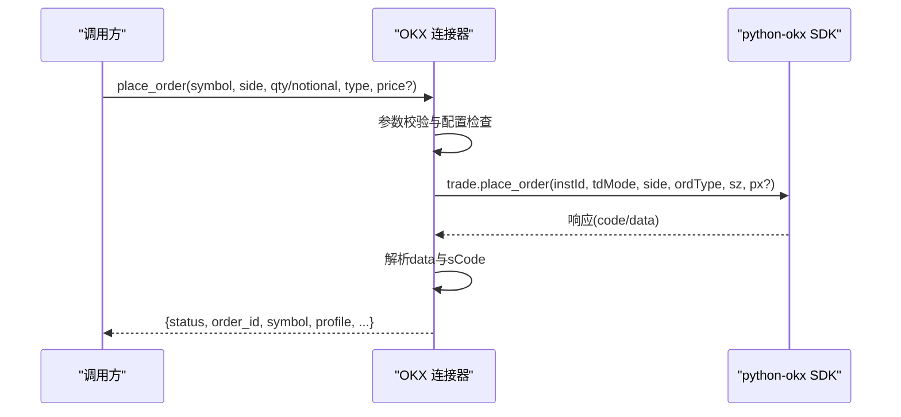
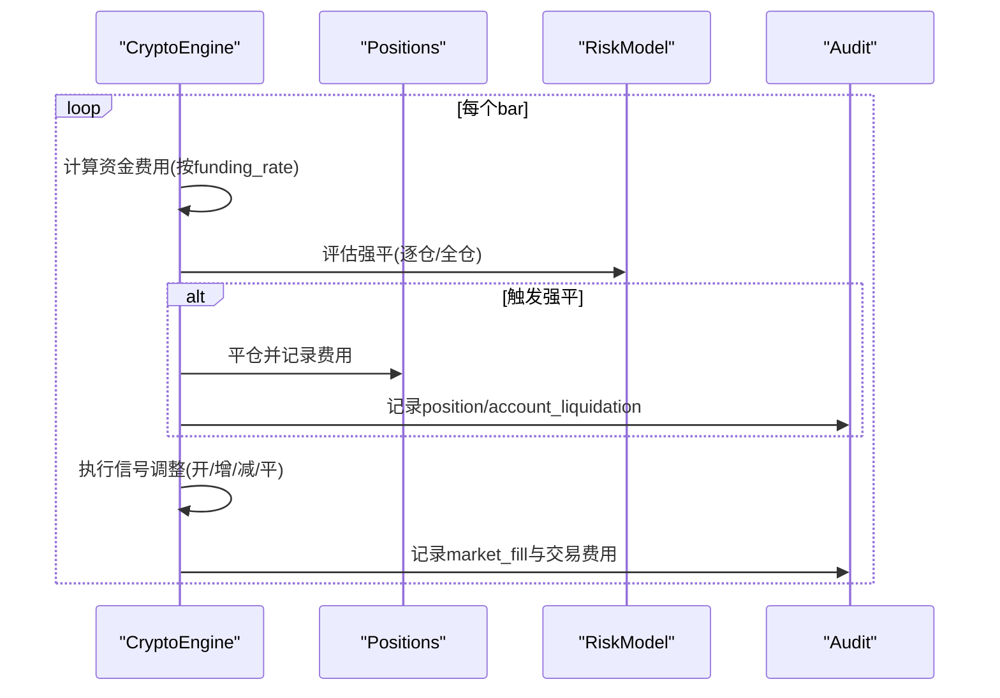
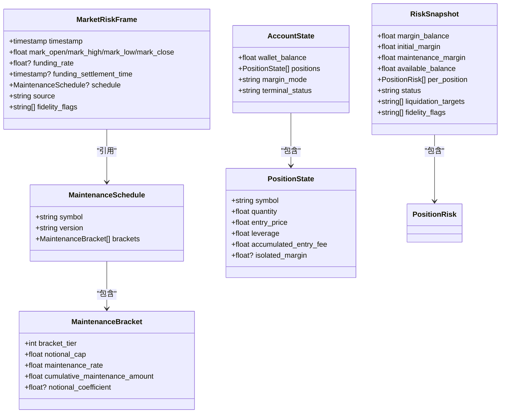
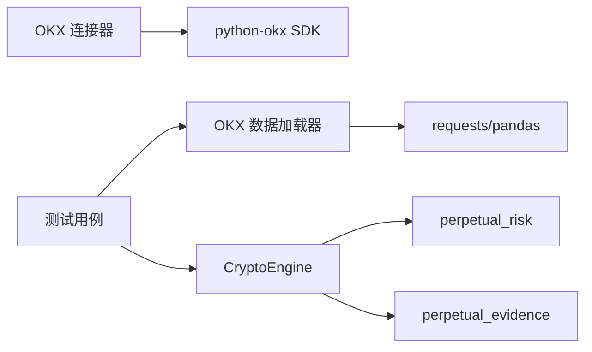

# OKX 加密货币

<cite>
**本文引用的文件**
- [agent/backtest/loaders/okx.py](file://agent/backtest/loaders/okx.py)
- [agent/src/trading/connectors/okx/sdk.py](file://agent/src/trading/connectors/okx/sdk.py)
- [agent/backtest/engines/crypto.py](file://agent/backtest/engines/crypto.py)
- [agent/backtest/perpetual_risk.py](file://agent/backtest/perpetual_risk.py)
- [agent/backtest/perpetual_evidence.py](file://agent/backtest/perpetual_evidence.py)
- [agent/src/skills/okx-market/SKILL.md](file://agent/src/skills/okx-market/SKILL.md)
- [agent/src/skills/crypto-derivatives/SKILL.md](file://agent/src/skills/crypto-derivatives/SKILL.md)
- [agent/src/skills/perp-funding-basis/SKILL.md](file://agent/src/skills/perp-funding-basis/SKILL.md)
- [agent/tests/test_okx_loader_bounded.py](file://agent/tests/test_okx_loader_bounded.py)
- [agent/tests/test_crypto_engine.py](file://agent/tests/test_crypto_engine.py)
</cite>

## 目录
1. [简介](#简介)
2. [项目结构](#项目结构)
3. [核心组件](#核心组件)
4. [架构总览](#架构总览)
5. [详细组件分析](#详细组件分析)
6. [依赖关系分析](#依赖关系分析)
7. [性能与限制](#性能与限制)
8. [故障排查指南](#故障排查指南)
9. [结论](#结论)
10. [附录](#附录)

## 简介
本文件面向在 Vibe-Trading 项目中集成 OKX 加密货币交易平台的工程与实践，覆盖现货、合约（永续/交割）、期权与借贷相关的数据接入、策略回测与风控要点。重点包括：
- 市场数据获取：通过公开 REST API 获取行情、K线、资金费率、持仓量等；
- 订单与账户读取：基于 python-okx SDK 的只读接口与下单封装；
- 频率限制与安全：代理支持、超时与预算控制、重试与错误处理；
- 策略与风险管理：资金费率套利、期限结构交易、期权波动率策略及强平风控；
- 应用案例：数字货币投资、量化交易与机构级加密资产管理。

## 项目结构
围绕 OKX 的关键代码分布在以下模块：
- 数据加载层：OKX K线历史与近期数据拉取、分页、缓存与双端点回退；
- 连接器层：OKX 账户、交易、行情的只读访问与下单封装；
- 回测引擎层：加密货币永续合约回测、资金费用结算、强平检查；
- 风险模型层：保证金阶梯、逐仓/全仓风险评估与快照；
- 审计证据层：严格事件日志与摘要输出；
- 技能文档：OKX 市场数据接口清单、衍生品策略与资金费率交易框架。

**图表来源**
- [agent/src/trading/connectors/okx/sdk.py:1-17](file://agent/src/trading/connectors/okx/sdk.py#L1-L17)
- [agent/backtest/loaders/okx.py:1-20](file://agent/backtest/loaders/okx.py#L1-L20)
- [agent/backtest/engines/crypto.py:1-10](file://agent/backtest/engines/crypto.py#L1-L10)
- [agent/backtest/perpetual_risk.py:1-13](file://agent/backtest/perpetual_risk.py#L1-L13)
- [agent/backtest/perpetual_evidence.py:1-14](file://agent/backtest/perpetual_evidence.py#L1-L14)

**章节来源**
- [agent/backtest/loaders/okx.py:1-20](file://agent/backtest/loaders/okx.py#L1-L20)
- [agent/src/trading/connectors/okx/sdk.py:1-17](file://agent/src/trading/connectors/okx/sdk.py#L1-L17)
- [agent/backtest/engines/crypto.py:1-10](file://agent/backtest/engines/crypto.py#L1-L10)

## 核心组件
- OKX 数据加载器：提供 OHLCV 历史与近期数据拉取，支持代理、超时、预算与重试，自动选择 history-candles 或 candles 端点；
- OKX 连接器：基于 python-okx SDK 的账户余额、持仓、挂单查询与现货下单封装，支持纸模拟/实盘切换与 UID 校验；
- 加密货币回测引擎：永续合约回测，内置资金费率结算、滑点与手续费、强平检查与逐仓/全仓模式；
- 风险模型：维护保证金阶梯、逐仓与全仓风险评估、强平目标识别与审计快照；
- 审计证据：记录资金结算、强平、交易等事件，生成可追溯的 JSONL 与摘要。

**章节来源**
- [agent/backtest/loaders/okx.py:101-208](file://agent/backtest/loaders/okx.py#L101-L208)
- [agent/src/trading/connectors/okx/sdk.py:186-245](file://agent/src/trading/connectors/okx/sdk.py#L186-L245)
- [agent/backtest/engines/crypto.py:41-84](file://agent/backtest/engines/crypto.py#L41-L84)
- [agent/backtest/perpetual_risk.py:170-179](file://agent/backtest/perpetual_risk.py#L170-L179)
- [agent/backtest/perpetual_evidence.py:17-65](file://agent/backtest/perpetual_evidence.py#L17-L65)

## 架构总览
系统以“数据加载 + 连接器 + 回测引擎 + 风险模型 + 审计证据”的分层架构组织，策略与研究在上层调用这些能力完成回测与实盘对接。

**图表来源**
- [agent/backtest/loaders/okx.py:220-373](file://agent/backtest/loaders/okx.py#L220-L373)
- [agent/backtest/engines/crypto.py:243-347](file://agent/backtest/engines/crypto.py#L243-L347)
- [agent/backtest/perpetual_risk.py:357-418](file://agent/backtest/perpetual_risk.py#L357-L418)
- [agent/backtest/perpetual_evidence.py:68-85](file://agent/backtest/perpetual_evidence.py#L68-L85)

## 详细组件分析

### OKX 数据加载器（K线与历史）
- 功能要点：
  - 支持 1m/5m/15m/30m/1H/4H/1D 等周期映射；
  - 优先使用 history-candles 获取深历史，否则回退到 candles；
  - 分页拉取，按 after 时间戳滚动，设置最大页数与墙钟预算；
  - 代理配置从环境变量注入，兼容 CCXT 风格；
  - 对 HTTP 429/5xx 与业务 code != "0" 进行重试与报错；
  - 结果标准化为 open/high/low/close/volume，并过滤未确认K线。
- 关键流程：
  - is_available：短探针验证可用性；
  - fetch：参数校验、周期映射、时间戳转换、分页拉取、合并与裁剪；
  - _paginate：循环请求、重试、去重、列对齐、时间索引与范围裁剪。

**图表来源**
- [agent/backtest/loaders/okx.py:131-208](file://agent/backtest/loaders/okx.py#L131-L208)
- [agent/backtest/loaders/okx.py:220-373](file://agent/backtest/loaders/okx.py#L220-L373)

**章节来源**
- [agent/backtest/loaders/okx.py:34-69](file://agent/backtest/loaders/okx.py#L34-L69)
- [agent/backtest/loaders/okx.py:80-99](file://agent/backtest/loaders/okx.py#L80-L99)
- [agent/backtest/loaders/okx.py:109-129](file://agent/backtest/loaders/okx.py#L109-L129)
- [agent/backtest/loaders/okx.py:131-208](file://agent/backtest/loaders/okx.py#L131-L208)
- [agent/backtest/loaders/okx.py:220-373](file://agent/backtest/loaders/okx.py#L220-L373)

### OKX 连接器（账户/交易/行情与下单）
- 功能要点：
  - 配置文件 okx.json，支持 paper/live-readonly/live 三种 profile；
  - check_status 健康检查与可选 UID 校验；
  - 只读接口：get_account_snapshot、get_positions、get_open_orders、get_quote、get_historical_bars；
  - 下单接口：place_order（现货 cash 模式），cancel_order；
  - 安全与健壮性：签名漂移失败关闭、响应字段防御性提取、版本兼容 safe_call。
- 关键流程：
  - build_config/load_config/save_config：配置解析与持久化；
  - get_*：构造客户端并调用 SDK，统一包装状态与上下文；
  - place_order：参数校验、构建 tdMode="cash" 请求、直接调用 SDK 避免静默降级；
  - _order_result：sCode 校验与错误信息透传。

**图表来源**
- [agent/src/trading/connectors/okx/sdk.py:357-465](file://agent/src/trading/connectors/okx/sdk.py#L357-L465)
- [agent/src/trading/connectors/okx/sdk.py:530-560](file://agent/src/trading/connectors/okx/sdk.py#L530-L560)
- [agent/src/trading/connectors/okx/sdk.py:583-601](file://agent/src/trading/connectors/okx/sdk.py#L583-L601)

**章节来源**
- [agent/src/trading/connectors/okx/sdk.py:51-127](file://agent/src/trading/connectors/okx/sdk.py#L51-L127)
- [agent/src/trading/connectors/okx/sdk.py:138-174](file://agent/src/trading/connectors/okx/sdk.py#L138-L174)
- [agent/src/trading/connectors/okx/sdk.py:186-245](file://agent/src/trading/connectors/okx/sdk.py#L186-L245)
- [agent/src/trading/connectors/okx/sdk.py:248-349](file://agent/src/trading/connectors/okx/sdk.py#L248-L349)
- [agent/src/trading/connectors/okx/sdk.py:357-513](file://agent/src/trading/connectors/okx/sdk.py#L357-L513)
- [agent/src/trading/connectors/okx/sdk.py:575-601](file://agent/src/trading/connectors/okx/sdk.py#L575-L601)
- [agent/src/trading/connectors/okx/sdk.py:658-783](file://agent/src/trading/connectors/okx/sdk.py#L658-L783)

### 加密货币回测引擎（永续合约）
- 功能要点：
  - 24/7 交易、Maker/Taker 手续费分离、滑点模型；
  - 每 8 小时资金费率结算（固定或数据驱动）；
  - 强平检查：逐仓与全仓两种模式，维护保证金阶梯；
  - 严格模式：要求高频数据与标记价格，记录完整事件与审计。
- 关键流程：
  - before_rebalance_bar：构建风险帧、应用资金结算、强平检查；
  - after_rebalance_bar：再次评估极端价格下的强平；
  - on_bar：逐条K线扣费与强平触发；
  - _execute_open/increase/partial_reduction/close：订单执行与事件记录。

**图表来源**
- [agent/backtest/engines/crypto.py:243-347](file://agent/backtest/engines/crypto.py#L243-L347)
- [agent/backtest/engines/crypto.py:349-383](file://agent/backtest/engines/crypto.py#L349-L383)
- [agent/backtest/engines/crypto.py:601-615](file://agent/backtest/engines/crypto.py#L601-L615)

**章节来源**
- [agent/backtest/engines/crypto.py:41-84](file://agent/backtest/engines/crypto.py#L41-L84)
- [agent/backtest/engines/crypto.py:96-140](file://agent/backtest/engines/crypto.py#L96-L140)
- [agent/backtest/engines/crypto.py:141-197](file://agent/backtest/engines/crypto.py#L141-L197)
- [agent/backtest/engines/crypto.py:243-347](file://agent/backtest/engines/crypto.py#L243-L347)
- [agent/backtest/engines/crypto.py:349-383](file://agent/backtest/engines/crypto.py#L349-L383)
- [agent/backtest/engines/crypto.py:446-554](file://agent/backtest/engines/crypto.py#L446-L554)
- [agent/backtest/engines/crypto.py:555-615](file://agent/backtest/engines/crypto.py#L555-L615)

### 风险模型（保证金与强平）
- 功能要点：
  - MaintenanceBracket/MaintenanceSchedule：维护保证金阶梯与版本校验；
  - PositionState/AccountState/MarketRiskFrame：位置、账户与市场风险输入；
  - evaluate_isolated/CrossMarginRiskModel：逐仓与全仓评估，识别强平目标；
  - RiskSnapshot：包含保证金余额、初始/维持保证金、可用余额与状态。
- 关键逻辑：
  - maintenance_margin：根据名义价值落入对应阶梯计算维持保证金；
  - _position_risks：计算未实现盈亏、初始保证金与维持保证金；
  - evaluate_isolated：逐仓模式下逐头寸检查 margin_balance <= maintenance_margin；
  - CrossMarginRiskModel：全仓模式下账户整体 margin_balance <= maintenance 或负余额即强平。

**图表来源**
- [agent/backtest/perpetual_risk.py:42-129](file://agent/backtest/perpetual_risk.py#L42-L129)
- [agent/backtest/perpetual_risk.py:132-179](file://agent/backtest/perpetual_risk.py#L132-L179)
- [agent/backtest/perpetual_risk.py:194-272](file://agent/backtest/perpetual_risk.py#L194-L272)
- [agent/backtest/perpetual_risk.py:357-418](file://agent/backtest/perpetual_risk.py#L357-L418)

**章节来源**
- [agent/backtest/perpetual_risk.py:181-192](file://agent/backtest/perpetual_risk.py#L181-L192)
- [agent/backtest/perpetual_risk.py:274-333](file://agent/backtest/perpetual_risk.py#L274-L333)
- [agent/backtest/perpetual_risk.py:357-418](file://agent/backtest/perpetual_risk.py#L357-L418)

### 审计证据（事件与摘要）
- 功能要点：
  - 记录资金结算、强平、交易等事件，保证不可变追加；
  - 生成 JSONL 事件文件与汇总摘要，便于审计与复盘；
  - 包含维护保证金版本、市场风险来源与保真标志。
- 关键流程：
  - build_perpetual_summary：统计资金结算次数与金额、强平事件与费用、交易费用等；
  - write_perpetual_evidence：写入 artifacts 目录的事件与摘要。

**章节来源**
- [agent/backtest/perpetual_evidence.py:17-65](file://agent/backtest/perpetual_evidence.py#L17-L65)
- [agent/backtest/perpetual_evidence.py:68-85](file://agent/backtest/perpetual_evidence.py#L68-L85)

## 依赖关系分析
- 数据加载器依赖 requests.Session 与 pandas，支持代理与重试；
- 连接器依赖 optional python-okx SDK，按需导入并提供 fallback；
- 回测引擎依赖风险模型与审计证据，组合完成永续合约回测；
- 测试用例覆盖边界条件：网络异常、环境配置、周期映射、强平等。

**图表来源**
- [agent/backtest/loaders/okx.py:24-31](file://agent/backtest/loaders/okx.py#L24-L31)
- [agent/src/trading/connectors/okx/sdk.py:575-601](file://agent/src/trading/connectors/okx/sdk.py#L575-L601)
- [agent/backtest/engines/crypto.py:18-38](file://agent/backtest/engines/crypto.py#L18-L38)
- [agent/tests/test_okx_loader_bounded.py:1-216](file://agent/tests/test_okx_loader_bounded.py#L1-L216)
- [agent/tests/test_crypto_engine.py:381-412](file://agent/tests/test_crypto_engine.py#L381-L412)

**章节来源**
- [agent/backtest/loaders/okx.py:24-31](file://agent/backtest/loaders/okx.py#L24-L31)
- [agent/src/trading/connectors/okx/sdk.py:575-601](file://agent/src/trading/connectors/okx/sdk.py#L575-L601)
- [agent/backtest/engines/crypto.py:18-38](file://agent/backtest/engines/crypto.py#L18-L38)
- [agent/tests/test_okx_loader_bounded.py:1-216](file://agent/tests/test_okx_loader_bounded.py#L1-L216)
- [agent/tests/test_crypto_engine.py:381-412](file://agent/tests/test_crypto_engine.py#L381-L412)

## 性能与限制
- 数据拉取：
  - 分页上限与墙钟预算防止长时间阻塞；
  - 历史端点优先用于长跨度回测，近期端点用于短期数据；
  - 代理与环境变量支持提升网络稳定性。
- 回测性能：
  - 严格模式需要更高频数据与更严格的输入校验；
  - 逐仓/全仓模式影响风险评估复杂度；
  - 事件记录与摘要写入可能带来 I/O 开销。
- 限制说明：
  - 公开API无认证但存在速率限制；
  - 连接器为只读为主，下单需额外权限与风控；
  - 强平精度受数据分辨率限制（如1H仅作为边界）。

[本节为通用指导，不直接分析具体文件]

## 故障排查指南
- 数据加载问题：
  - 检查 is_available 探针与代理配置；
  - 关注 HTTP 429/5xx 与业务 code != "0" 的重试与报错；
  - 验证周期映射与符号大小写。
- 连接器问题：
  - 检查 okx.json 配置完整性与 profile 选择；
  - 使用 check_status 诊断 SDK 安装与账户身份；
  - 下单失败时查看 sCode 与错误消息。
- 回测与强平：
  - 确认维护保证金版本一致性与数据完整性；
  - 检查资金费率与结算时间戳配对；
  - 观察强平事件与账户状态变化。

**章节来源**
- [agent/backtest/loaders/okx.py:109-129](file://agent/backtest/loaders/okx.py#L109-L129)
- [agent/backtest/loaders/okx.py:291-315](file://agent/backtest/loaders/okx.py#L291-L315)
- [agent/src/trading/connectors/okx/sdk.py:186-245](file://agent/src/trading/connectors/okx/sdk.py#L186-L245)
- [agent/src/trading/connectors/okx/sdk.py:530-560](file://agent/src/trading/connectors/okx/sdk.py#L530-L560)
- [agent/backtest/engines/crypto.py:141-197](file://agent/backtest/engines/crypto.py#L141-L197)
- [agent/backtest/perpetual_risk.py:247-272](file://agent/backtest/perpetual_risk.py#L247-L272)

## 结论
本项目提供了完整的 OKX 加密货币集成方案：从公开市场数据拉取、账户与交易只读访问，到永续合约回测与严格风控，再到审计证据输出。结合技能文档中的资金费率套利、期限结构与期权策略，可在数字货币投资、量化交易与机构级资产管理中落地实践。建议在生产环境中强化频率限制、代理与监控告警，并在策略上线前充分回测与压力测试。

[本节为总结，不直接分析具体文件]

## 附录

### OKX 市场数据接口概览（来自技能文档）
- 现货行情：单个行情、批量行情、K线数据、最近成交、产品列表、深度数据；
- 合约行情：资金费率、历史资金费率、标记价格、持仓量、限价；
- 指数行情：指数行情、指数K线。

**章节来源**
- [agent/src/skills/okx-market/SKILL.md:56-73](file://agent/src/skills/okx-market/SKILL.md#L56-L73)

### 衍生品策略与资金管理（来自技能文档）
- 永续资金费率套利：正/反向收益捕获、年化换算与风险控制；
- 期限结构交易：Contango/Backwardation 交易思路；
- 期权策略：波动率微笑、Greeks、常见组合与风险管理。

**章节来源**
- [agent/src/skills/crypto-derivatives/SKILL.md:13-48](file://agent/src/skills/crypto-derivatives/SKILL.md#L13-L48)
- [agent/src/skills/crypto-derivatives/SKILL.md:123-271](file://agent/src/skills/crypto-derivatives/SKILL.md#L123-L271)
- [agent/src/skills/perp-funding-basis/SKILL.md:14-37](file://agent/src/skills/perp-funding-basis/SKILL.md#L14-L37)
- [agent/src/skills/perp-funding-basis/SKILL.md:97-150](file://agent/src/skills/perp-funding-basis/SKILL.md#L97-L150)
- [agent/src/skills/perp-funding-basis/SKILL.md:152-212](file://agent/src/skills/perp-funding-basis/SKILL.md#L152-L212)