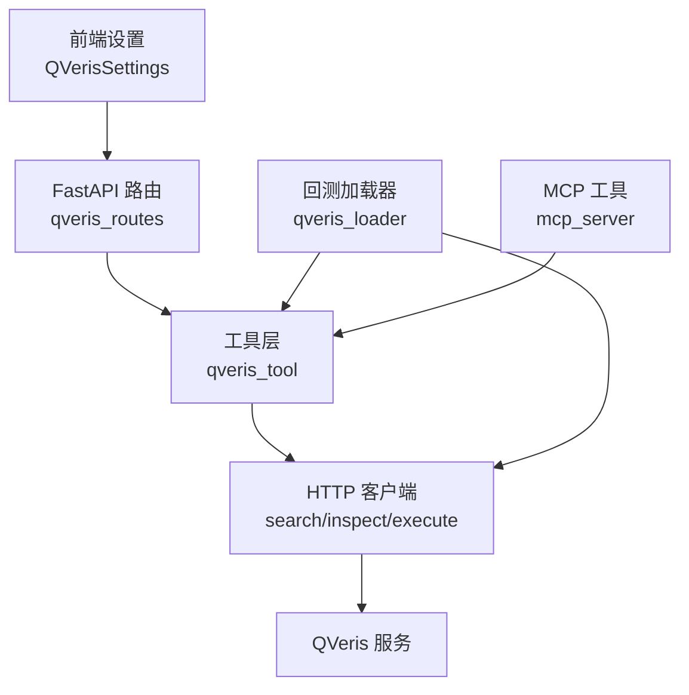
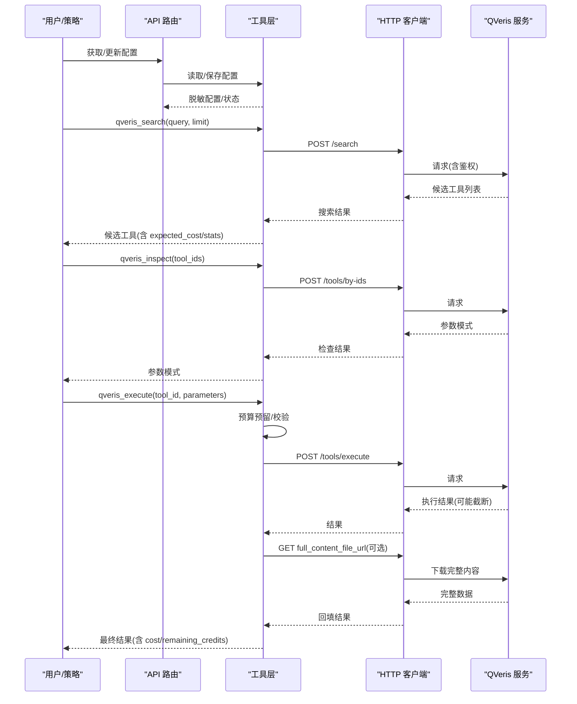
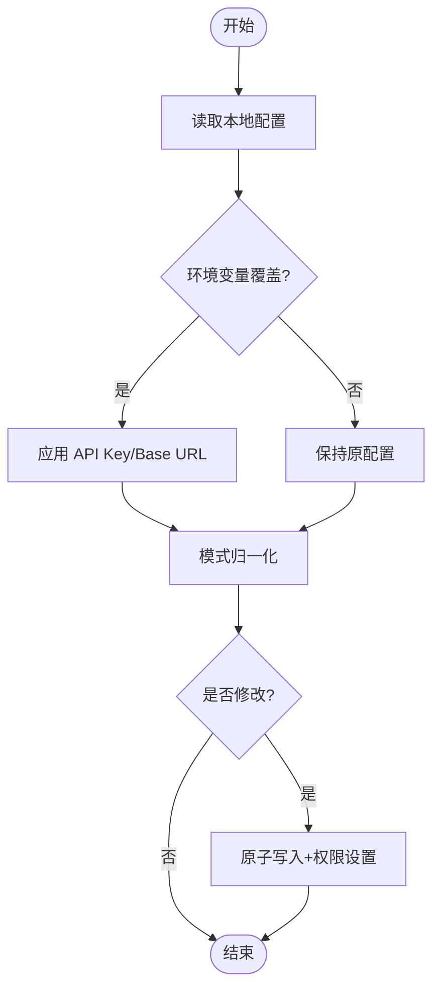
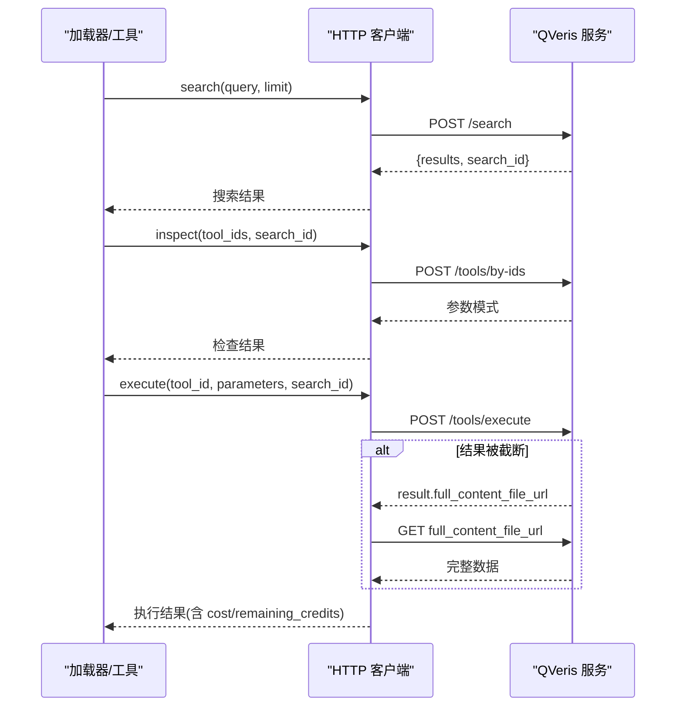
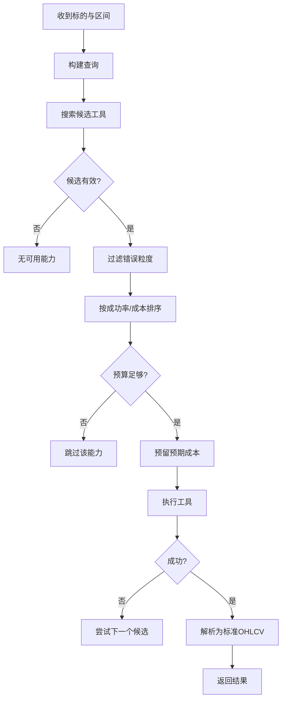
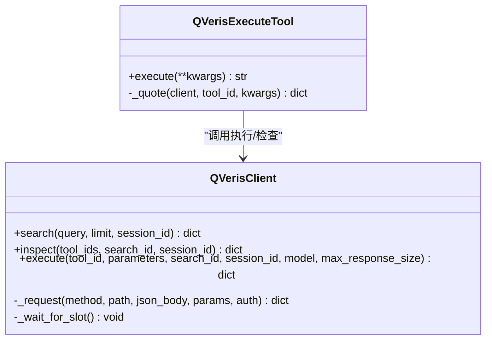
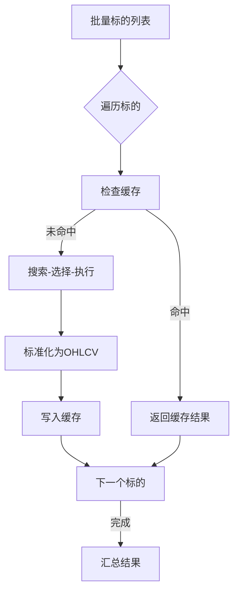
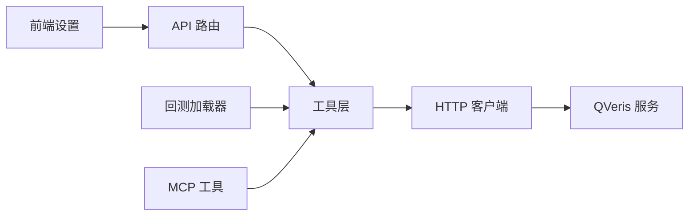

# QVeris 量化研究平台

<cite>
**本文引用的文件**
- [agent/src/api/qveris_routes.py](file://agent/src/api/qveris_routes.py)
- [agent/src/tools/qveris_tool.py](file://agent/src/tools/qveris_tool.py)
- [agent/backtest/loaders/qveris_loader.py](file://agent/backtest/loaders/qveris_loader.py)
- [agent/mcp_server.py](file://agent/mcp_server.py)
- [agent/src/skills/qveris/SKILL.md](file://agent/src/skills/qveris/SKILL.md)
- [agent/src/skills/qveris/references/rest-api.md](file://agent/src/skills/qveris/references/rest-api.md)
- [agent/backtest/loaders/base.py](file://agent/backtest/loaders/base.py)
- [frontend/src/components/settings/QVerisSettings.tsx](file://frontend/src/components/settings/QVerisSettings.tsx)
</cite>

## 目录
1. [简介](#简介)
2. [项目结构](#项目结构)
3. [核心组件](#核心组件)
4. [架构总览](#架构总览)
5. [详细组件分析](#详细组件分析)
6. [依赖关系分析](#依赖关系分析)
7. [性能与优化](#性能与优化)
8. [故障排查指南](#故障排查指南)
9. [结论](#结论)
10. [附录](#附录)

## 简介
QVeris 在本项目中作为“付费能力路由器”，为量化研究提供自然语言查询、工具执行与结果处理的一体化能力。它通过搜索发现可用工具、检查参数模式，再在预算与速率限制约束下执行调用，并将返回的 OHLCV/指标/基本面等数据标准化后接入回测与策略流程。其设计强调：
- 安全认证：API Key 与模式开关控制访问；配置持久化且权限受控。
- 预算控制：按会话维度预留与扣减信用额度，防止超支。
- 速率限制：对 429 响应进行退避重试，尊重 Retry-After。
- 成本优化：基于期望成本与成功率选择工具，优先低成本高成功率的候选。
- 批量与缓存：批量拉取时逐标的失败隔离、结果缓存与截断结果回填。

## 项目结构
围绕 QVeris 的关键代码分布在以下位置：
- API 路由：设置读取/更新、状态查询（鉴权、脱敏）。
- 工具层：搜索、检查、执行三类工具，统一客户端封装与预算门控。
- 回测加载器：面向 OHLCV 的显式启用加载器，内置搜索-选择-执行-解析流水线。
- MCP 工具：对外暴露 qveris_search / qveris_inspect / qveris_execute。
- 技能文档：工作流、计费与模式说明。
- 前端设置：模式切换与预算输入。

图表来源
- [agent/src/api/qveris_routes.py:139-177](file://agent/src/api/qveris_routes.py#L139-L177)
- [agent/src/tools/qveris_tool.py:202-353](file://agent/src/tools/qveris_tool.py#L202-L353)
- [agent/backtest/loaders/qveris_loader.py:147-248](file://agent/backtest/loaders/qveris_loader.py#L147-L248)
- [agent/mcp_server.py:2024-2115](file://agent/mcp_server.py#L2024-L2115)

章节来源
- [agent/src/api/qveris_routes.py:1-232](file://agent/src/api/qveris_routes.py#L1-L232)
- [agent/src/tools/qveris_tool.py:1-665](file://agent/src/tools/qveris_tool.py#L1-L665)
- [agent/backtest/loaders/qveris_loader.py:1-685](file://agent/backtest/loaders/qveris_loader.py#L1-L685)
- [agent/mcp_server.py:2024-2115](file://agent/mcp_server.py#L2024-L2115)

## 核心组件
- 配置管理
  - 配置文件路径与默认值、环境变量覆盖、模式归一化、密钥掩码、原子写入与权限控制。
- API 路由
  - 获取/更新配置（读需鉴权、写需设置写权限）、状态查询（可用性、剩余额度、最近使用事件）。
- 工具层
  - 搜索（免费发现）、检查（免费参数校验）、执行（付费，预算门控、截断结果回填、用量统计）。
- 回测加载器
  - 显式启用、按标的循环、搜索-选择-执行-解析、预算与速率限制、缓存与批量容错。
- MCP 工具
  - 将搜索/检查/执行暴露给外部系统，支持 session_id/search_id 关联。
- 前端设置
  - 模式切换（free/paid）与每会话预算输入。

章节来源
- [agent/src/tools/qveris_tool.py:38-147](file://agent/src/tools/qveris_tool.py#L38-L147)
- [agent/src/api/qveris_routes.py:31-107](file://agent/src/api/qveris_routes.py#L31-L107)
- [agent/backtest/loaders/qveris_loader.py:63-119](file://agent/backtest/loaders/qveris_loader.py#L63-L119)
- [agent/mcp_server.py:2024-2115](file://agent/mcp_server.py#L2024-L2115)
- [frontend/src/components/settings/QVerisSettings.tsx:270-302](file://frontend/src/components/settings/QVerisSettings.tsx#L270-L302)

## 架构总览
QVeris 的工作流分为三层：
- 发现层：通过自然语言查询搜索可用能力，返回候选工具及其预期成本与成功率。
- 检查层：获取工具完整参数模式，确保后续执行参数正确。
- 执行层：在预算门控与速率限制保护下执行，并回填截断结果、记录用量。

图表来源
- [agent/src/tools/qveris_tool.py:293-353](file://agent/src/tools/qveris_tool.py#L293-L353)
- [agent/src/tools/qveris_tool.py:563-665](file://agent/src/tools/qveris_tool.py#L563-L665)
- [agent/backtest/loaders/qveris_loader.py:335-381](file://agent/backtest/loaders/qveris_loader.py#L335-L381)

## 详细组件分析

### 配置管理与认证
- 配置读取与覆盖：从本地 JSON 读取，并允许环境变量覆盖 API Key 与 Base URL。
- 模式归一化：将 legacy 模式映射到 free/paid。
- 安全存储：原子写入临时文件后替换，设置 0600 权限。
- 鉴权：API 路由通过 FastAPI 依赖注入实现读/写鉴权；工具层在未配置或未开启 paid 模式时拒绝调用。

图表来源
- [agent/src/tools/qveris_tool.py:49-119](file://agent/src/tools/qveris_tool.py#L49-L119)
- [agent/src/api/qveris_routes.py:149-177](file://agent/src/api/qveris_routes.py#L149-L177)

章节来源
- [agent/src/tools/qveris_tool.py:38-147](file://agent/src/tools/qveris_tool.py#L38-L147)
- [agent/src/api/qveris_routes.py:73-107](file://agent/src/api/qveris_routes.py#L73-L107)

### 自然语言查询与工具执行
- 搜索：POST /search，返回候选工具及预期成本、成功率等元信息。
- 检查：POST /tools/by-ids，返回完整参数模式与示例。
- 执行：POST /tools/execute，支持 max_response_size 截断，若存在 full_content_file_url 则自动下载回填。
- 速率限制：遇到 429 时读取 Retry-After 并等待重试，最多重试次数可配。
- 用量历史：GET /auth/usage/history/v2，用于审计与展示。

图表来源
- [agent/src/tools/qveris_tool.py:293-353](file://agent/src/tools/qveris_tool.py#L293-L353)
- [agent/backtest/loaders/qveris_loader.py:160-202](file://agent/backtest/loaders/qveris_loader.py#L160-L202)

章节来源
- [agent/src/tools/qveris_tool.py:202-353](file://agent/src/tools/qveris_tool.py#L202-L353)
- [agent/backtest/loaders/qveris_loader.py:147-248](file://agent/backtest/loaders/qveris_loader.py#L147-L248)
- [agent/src/skills/qveris/references/rest-api.md:190-216](file://agent/src/skills/qveris/references/rest-api.md#L190-L216)

### 搜索能力选择算法与成本优化
- 查询构造：根据标的与时间粒度生成自然语言查询。
- 候选过滤：排除不匹配粒度的能力（如分钟级 vs 日线），保留 OHLCV 相关描述。
- 排序规则：优先成功率高的，其次期望成本低，最后以 tool_id/name 稳定排序。
- 预算控制：在执行前预留预期成本，实际成本大于预期时补扣；超过会话预算则跳过。
- 批量容错：单个标的失败不影响其他标的；结果经标准化后输出标准 OHLCV 列。

图表来源
- [agent/backtest/loaders/qveris_loader.py:387-458](file://agent/backtest/loaders/qveris_loader.py#L387-L458)
- [agent/backtest/loaders/qveris_loader.py:471-554](file://agent/backtest/loaders/qveris_loader.py#L471-L554)
- [agent/backtest/loaders/qveris_loader.py:556-580](file://agent/backtest/loaders/qveris_loader.py#L556-L580)

章节来源
- [agent/backtest/loaders/qveris_loader.py:335-381](file://agent/backtest/loaders/qveris_loader.py#L335-L381)
- [agent/backtest/loaders/qveris_loader.py:387-580](file://agent/backtest/loaders/qveris_loader.py#L387-L580)

### 预算控制与速率限制
- 会话预算：每个 session_id 维护已花费与预留额度；执行前校验并预留，成功后结算，失败释放预留。
- 并发安全：使用线程锁保护预算变量，避免竞态。
- 速率限制：最小请求间隔（默认 0.5s），遇 429 读取 Retry-After 并等待重试，最多重试次数可配。
- 环境控制：可通过环境变量调整最小间隔，避免触发限流。

图表来源
- [agent/src/tools/qveris_tool.py:202-353](file://agent/src/tools/qveris_tool.py#L202-L353)
- [agent/src/tools/qveris_tool.py:472-665](file://agent/src/tools/qveris_tool.py#L472-L665)

章节来源
- [agent/src/tools/qveris_tool.py:231-274](file://agent/src/tools/qveris_tool.py#L231-L274)
- [agent/src/tools/qveris_tool.py:563-665](file://agent/src/tools/qveris_tool.py#L563-L665)
- [agent/backtest/loaders/qveris_loader.py:217-258](file://agent/backtest/loaders/qveris_loader.py#L217-L258)

### 高频数据处理、批量查询与缓存
- 批量拉取：对多个标的循环 fetch，单标失败不影响整体；结果字典按 symbol 聚合。
- 缓存机制：使用通用缓存装饰器避免重复网络请求。
- 结果标准化：多形态 provider 返回统一为 open/high/low/close/volume，并按日期索引排序与裁剪。
- 截断回填：当返回包含 full_content_file_url 时自动下载完整结果，保证大数据集完整性。

图表来源
- [agent/backtest/loaders/qveris_loader.py:276-333](file://agent/backtest/loaders/qveris_loader.py#L276-L333)
- [agent/backtest/loaders/qveris_loader.py:556-580](file://agent/backtest/loaders/qveris_loader.py#L556-L580)
- [agent/backtest/loaders/base.py:181-215](file://agent/backtest/loaders/base.py#L181-L215)

章节来源
- [agent/backtest/loaders/qveris_loader.py:276-333](file://agent/backtest/loaders/qveris_loader.py#L276-L333)
- [agent/backtest/loaders/qveris_loader.py:556-580](file://agent/backtest/loaders/qveris_loader.py#L556-L580)
- [agent/backtest/loaders/base.py:181-215](file://agent/backtest/loaders/base.py#L181-L215)

### 复杂量化场景应用案例与调优技巧
- 选项 Greeks 与波动率曲面：通过 qveris_search 定位期权链与希腊字母工具，qveris_inspect 确认参数，qveris_execute 执行并回填完整结果。
- 宏观与基本面：搜索宏观序列或财务报表工具，结合预算控制分批拉取，避免单次超支。
- 跨市场覆盖：利用 QVeris 的多资产覆盖能力补充免费源不足，如中国/A股/港股/全球权益与期货。
- 调优建议：
  - 合理设置 min_interval_seconds 与 max_429_retries，平衡吞吐与稳定性。
  - 使用 session_id/search_id 关联调用，便于审计与对账。
  - 在批量拉取中优先低成本高成功率工具，减少无效调用。
  - 对大结果集启用截断与回填，降低内存占用同时保证完整性。

章节来源
- [agent/src/skills/qveris/SKILL.md:19-80](file://agent/src/skills/qveris/SKILL.md#L19-L80)
- [agent/src/tools/qveris_tool.py:293-353](file://agent/src/tools/qveris_tool.py#L293-L353)
- [agent/backtest/loaders/qveris_loader.py:387-458](file://agent/backtest/loaders/qveris_loader.py#L387-L458)

## 依赖关系分析
- API 路由依赖工具层的配置读写与状态查询。
- 工具层依赖 HTTP 客户端与配置模块，提供搜索/检查/执行能力。
- 回测加载器依赖工具层与通用缓存/重试机制，实现 OHLCV 拉取。
- MCP 工具桥接外部系统与工具层，支持 session_id/search_id 关联。
- 前端设置通过 API 路由更新配置，影响工具层行为。

图表来源
- [agent/src/api/qveris_routes.py:139-177](file://agent/src/api/qveris_routes.py#L139-L177)
- [agent/src/tools/qveris_tool.py:202-353](file://agent/src/tools/qveris_tool.py#L202-L353)
- [agent/backtest/loaders/qveris_loader.py:276-333](file://agent/backtest/loaders/qveris_loader.py#L276-L333)
- [agent/mcp_server.py:2024-2115](file://agent/mcp_server.py#L2024-L2115)
- [frontend/src/components/settings/QVerisSettings.tsx:270-302](file://frontend/src/components/settings/QVerisSettings.tsx#L270-L302)

章节来源
- [agent/src/api/qveris_routes.py:139-177](file://agent/src/api/qveris_routes.py#L139-L177)
- [agent/src/tools/qveris_tool.py:202-353](file://agent/src/tools/qveris_tool.py#L202-L353)
- [agent/backtest/loaders/qveris_loader.py:276-333](file://agent/backtest/loaders/qveris_loader.py#L276-L333)
- [agent/mcp_server.py:2024-2115](file://agent/mcp_server.py#L2024-L2115)
- [frontend/src/components/settings/QVerisSettings.tsx:270-302](file://frontend/src/components/settings/QVerisSettings.tsx#L270-L302)

## 性能与优化
- 速率限制与重试：最小请求间隔与 429 重试策略，避免触发限流并提升成功率。
- 预算门控：执行前预留预期成本，失败释放预留，避免超额消费。
- 批量与缓存：批量拉取时单标失败隔离，结果缓存减少重复请求。
- 结果回填：截断结果自动下载完整内容，保证大数据集完整性。
- 选择算法：按成功率与期望成本排序，优先高效低成本工具。

[本节为通用指导，无需特定文件引用]

## 故障排查指南
- 未配置或未启用 paid 模式：工具返回不可用提示，需设置 API Key 并切换到 paid 模式。
- 预算超限：执行被拒绝，返回 budget_exceeded；需提高预算或减少调用。
- 429 限流：客户端会读取 Retry-After 并等待重试；若频繁出现，调整最小间隔或降低并发。
- 参数错误：通过 qveris_inspect 检查参数模式，修正后再执行。
- 结果为空或失败：检查 provider 错误与 reason_code，必要时更换工具或调整参数。

章节来源
- [agent/src/tools/qveris_tool.py:154-175](file://agent/src/tools/qveris_tool.py#L154-L175)
- [agent/src/tools/qveris_tool.py:563-665](file://agent/src/tools/qveris_tool.py#L563-L665)
- [agent/src/skills/qveris/references/rest-api.md:190-216](file://agent/src/skills/qveris/references/rest-api.md#L190-L216)

## 结论
QVeris 在本项目中提供了强大的付费能力路由，结合自然语言查询、工具检查与执行、预算与速率限制控制，以及批量与缓存优化，能够支撑复杂的量化研究场景。通过合理的配置、选择算法与调优策略，可以在保证成本可控的前提下，高效获取高质量数据与指标。

[本节为总结性内容，无需特定文件引用]

## 附录
- 工作流参考：搜索-检查-执行的三步法，以及选择能力的最佳实践。
- 计费与模式：free/paid 模式差异，discover/inspect 免费，execute 付费。
- 速率限制合同：搜索与执行的限额与 429 处理规范。

章节来源
- [agent/src/skills/qveris/SKILL.md:19-80](file://agent/src/skills/qveris/SKILL.md#L19-L80)
- [agent/src/skills/qveris/references/rest-api.md:190-216](file://agent/src/skills/qveris/references/rest-api.md#L190-L216)