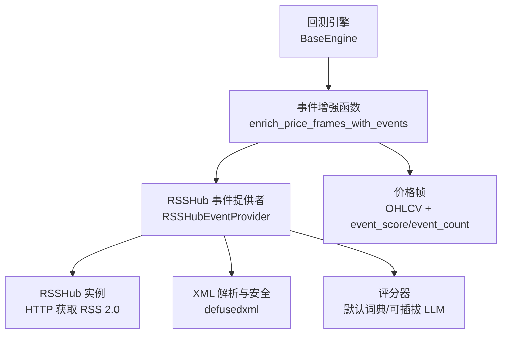
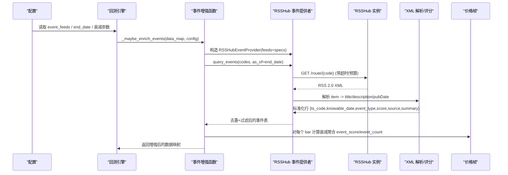
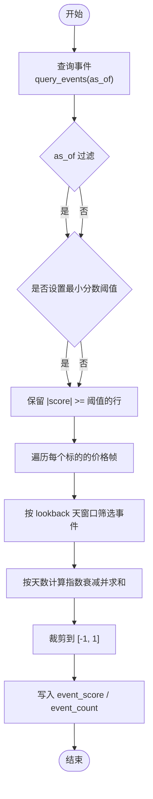
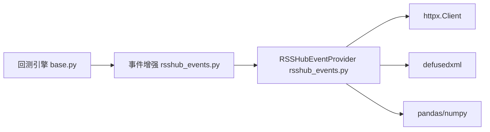

# RSSHub 事件流

<cite>
**本文引用的文件**
- [rsshub_events.py](file://agent/backtest/loaders/rsshub_events.py)
- [base.py](file://agent/backtest/engines/base.py)
- [SKILL.md](file://agent/src/skills/event-driven/SKILL.md)
- [test_rsshub_events_provider.py](file://agent/tests/test_rsshub_events_provider.py)
- [test_rsshub_events_lookahead.py](file://agent/tests/test_rsshup_events_lookahead.py)
</cite>

## 目录
1. [简介](#简介)
2. [项目结构](#项目结构)
3. [核心组件](#核心组件)
4. [架构总览](#架构总览)
5. [详细组件分析](#详细组件分析)
6. [依赖关系分析](#依赖关系分析)
7. [性能与可靠性](#性能与可靠性)
8. [故障排查指南](#故障排查指南)
9. [结论](#结论)
10. [附录：配置与使用示例](#附录配置与使用示例)

## 简介
本文件面向在回测与实盘中集成 RSSHub 事件流的工程实践，围绕“事件订阅、实时推送（通过外部 RSSHub 实例）、消息处理机制”展开，覆盖事件源配置、过滤规则、去重策略、错误处理、持久化存储、索引构建与查询优化，并给出事件驱动策略的触发条件、响应逻辑和执行流程。同时提供新闻监控、舆情分析和市场事件捕捉的应用案例说明。

## 项目结构
RSSHub 事件流在本仓库中作为“事件数据层”嵌入到回测引擎的事件增强管线中，核心由以下部分组成：
- 事件提供者：从自托管 RSSHub 实例拉取 RSS 2.0 数据，标准化为统一事件表结构，并保证“点-in-time”安全（无未来信息泄露）。
- 引擎集成：在回测引擎启动时解析配置，构造事件提供者，将事件信号以衰减聚合的方式注入价格帧，供后续信号生成使用。
- 技能规范：定义事件 CSV 的字段与语义，确保事件数据与策略逻辑解耦。

图表来源
- [base.py:348-371](file://agent/backtest/engines/base.py#L348-L371)
- [rsshub_events.py:288-400](file://agent/backtest/loaders/rsshub_events.py#L288-L400)
- [rsshub_events.py:449-484](file://agent/backtest/loaders/rsshub_events.py#L449-L484)
- [rsshub_events.py:501-568](file://agent/backtest/loaders/rsshub_events.py#L501-L568)

章节来源
- [base.py:348-371](file://agent/backtest/engines/base.py#L348-L371)
- [rsshub_events.py:288-400](file://agent/backtest/loaders/rsshub_events.py#L288-L400)
- [rsshub_events.py:449-484](file://agent/backtest/loaders/rsshub_events.py#L449-L484)
- [rsshub_events.py:501-568](file://agent/backtest/loaders/rsshub_events.py#L501-L568)

## 核心组件
- FeedSpec：描述一个 RSSHub 路由模板、事件类型和代码格式风格，支持按标的或全市场维度订阅。
- RSSHubEventProvider：负责连接 RSSHub、拉取 XML、解析 item、计算 knowable_date、评分、去重与点-in-time 过滤。
- enrich_price_frames_with_events：将事件序列按时间窗口与指数衰减聚合为每个 bar 的 event_score 与 event_count，并附加到价格帧。
- 引擎集成 _maybe_enrich_events：读取配置中的 event_feeds，构造 Provider 并执行增强；若不可用则抛出明确错误。

章节来源
- [rsshub_events.py:107-179](file://agent/backtest/loaders/rsshub_events.py#L107-L179)
- [rsshub_events.py:288-400](file://agent/backtest/loaders/rsshub_events.py#L288-L400)
- [rsshub_events.py:501-568](file://agent/backtest/loaders/rsshub_events.py#L501-L568)
- [base.py:348-371](file://agent/backtest/engines/base.py#L348-L371)

## 架构总览
下图展示从配置到事件增强的完整调用链，强调“点-in-time”约束与衰减聚合。

图表来源
- [base.py:348-371](file://agent/backtest/engines/base.py#L348-L371)
- [rsshub_events.py:343-400](file://agent/backtest/loaders/rsshub_events.py#L343-L400)
- [rsshub_events.py:402-447](file://agent/backtest/loaders/rsshub_events.py#L402-L447)
- [rsshub_events.py:449-484](file://agent/backtest/loaders/rsshub_events.py#L449-L484)
- [rsshub_events.py:501-568](file://agent/backtest/loaders/rsshub_events.py#L501-L568)

## 详细组件分析

### 事件源配置与订阅
- 配置入口：engine 配置中的 event_feeds 列表，每项包含 name、route_template、event_type，可选 code_style。
- 路由模板：支持含 {code} 的按标的路由与不含 {code} 的全市场路由；code_style 支持 raw、bare、exchange_prefix，用于适配不同 RSSHub 路由对代码格式的要求。
- 环境变量：
  - RSSHUB_BASE_URL：RSSHub 根地址（必填且需有效）
  - RSSHUB_TIMEOUT_S：单次请求超时秒数（默认 15）
  - RSSHUB_FETCH_BUDGET_S：整体抓取预算秒数（默认 60），用于限制一次查询的总耗时
- 可用性检查：is_available() 会拒绝占位符 URL，避免静默失败。

章节来源
- [base.py:340-371](file://agent/backtest/engines/base.py#L340-L371)
- [rsshub_events.py:40-50](file://agent/backtest/loaders/rsshub_events.py#L40-L50)
- [rsshub_events.py:77-104](file://agent/backtest/loaders/rsshub_events.py#L77-L104)
- [rsshub_events.py:107-179](file://agent/backtest/loaders/rsshub_events.py#L107-L179)
- [rsshub_events.py:324-341](file://agent/backtest/loaders/rsshub_events.py#L324-L341)

### 事件数据模型与评分
- 标准列：ts_code、knowable_date、event_type、score、source、summary。
- knowable_date：基于 pubDate 与收盘截止小时（默认 16 点）计算，超过截止时间的发布视为下一个交易日可获知，防止未来信息泄露。
- 评分：
  - 默认词典评分器：统计正负词频，输出 [-1, 1] 的确定性分数。
  - 可插拔 scorer：支持传入自定义评分函数（例如 LLM judge），保持数据层与评分逻辑解耦。
- 去重：按 ts_code、knowable_date、event_type、summary 去重，避免重复事件影响聚合。

章节来源
- [rsshub_events.py:52-62](file://agent/backtest/loaders/rsshub_events.py#L52-L62)
- [rsshub_events.py:239-261](file://agent/backtest/loaders/rsshub_events.py#L239-L261)
- [rsshub_events.py:264-285](file://agent/backtest/loaders/rsshub_events.py#L264-L285)
- [rsshub_events.py:343-400](file://agent/backtest/loaders/rsshub_events.py#L343-L400)
- [SKILL.md:21-51](file://agent/src/skills/event-driven/SKILL.md#L21-L51)

### 事件增强与衰减聚合
- 输入：价格帧映射 data_map{code: DataFrame}，以及 Provider。
- 过程：
  - 查询事件并按 as_of 过滤（仅保留 knowable_date <= as_of 的事件）。
  - 可选最小绝对分数阈值过滤低强度事件。
  - 对每个 bar 计算过去 lookback 天内事件的指数衰减求和，得到 event_score，并记录 event_count。
  - 结果：为每个价格帧新增 event_score、event_count 两列。
- 输出：新的数据映射，不修改原帧。

图表来源
- [rsshub_events.py:501-568](file://agent/backtest/loaders/rsshub_events.py#L501-L568)

章节来源
- [rsshub_events.py:501-568](file://agent/backtest/loaders/rsshub_events.py#L501-L568)

### 错误处理与健壮性
- 网络与超时：
  - 单次请求超时由 RSSHUB_TIMEOUT_S 控制。
  - 整体抓取预算由 RSSHUB_FETCH_BUDGET_S 控制，超出预算直接放弃该次抓取并记录警告。
- 全部失败告警：如果所有配置的 feed 均无法获取数据，将抛出 EventProviderError，避免“静默零分”误导策略。
- XML 安全：使用 defusedxml 解析，抵御 XXE/实体膨胀攻击。
- 空结果：可达但无 item 的 feed 不会报错，返回空事件表。
- 未知 feed：访问未注册的 feed 名称会抛 UnknownFeedError。

章节来源
- [rsshub_events.py:402-447](file://agent/backtest/loaders/rsshub_events.py#L402-L447)
- [rsshub_events.py:343-400](file://agent/backtest/loaders/rsshub_events.py#L343-L400)
- [test_rsshub_events_provider.py:121-133](file://agent/tests/test_rsshub_events_provider.py#L121-L133)
- [test_rsshub_events_provider.py:223-233](file://agent/tests/test_rsshub_events_provider.py#L223-L233)

### 点-in-time 安全与无前瞻保证
- 发布后收盘截止小时规则：pubDate 晚于默认 16 点的条目，knowable_date 自动顺延至下一日。
- 过滤：query_events 严格以 as_of 过滤，确保 no-look-ahead。
- 增强阶段：即使 Provider 忽略 as_of，增强函数仍会在每 bar 处进行窗口掩码，保证未来事件不会污染历史 bar。

章节来源
- [rsshub_events.py:264-285](file://agent/backtest/loaders/rsshub_events.py#L264-L285)
- [rsshub_events.py:343-400](file://agent/backtest/loaders/rsshub_events.py#L343-L400)
- [test_rsshup_events_lookahead.py:53-77](file://agent/tests/test_rsshup_events_lookahead.py#L53-L77)

### 与回测引擎的集成
- 配置项：
  - event_feeds：事件源列表（name、route_template、event_type、可选 code_style）
  - end_date：用作 as_of 的时间边界
  - event_decay_lambda：衰减系数
  - event_lookback：事件回溯窗口（天）
- 集成流程：_maybe_enrich_events 解析配置、构造 Provider、调用增强函数；若不可用或异常，抛出 RuntimeError 提示配置缺失或增强失败。

章节来源
- [base.py:340-371](file://agent/backtest/engines/base.py#L340-L371)

## 依赖关系分析
- 模块耦合：
  - BaseEngine 依赖 rsshub_events 提供的 Provider 与增强函数。
  - Provider 依赖 httpx（延迟导入）、defusedxml、pandas/numpy。
  - 测试通过注入 FakeClient 隔离网络依赖，验证行为。
- 外部依赖：
  - RSSHub 实例：提供 RSS 2.0 数据源。
  - 环境变量：RSSHUB_BASE_URL、RSSHUB_TIMEOUT_S、RSSHUB_FETCH_BUDGET_S。

图表来源
- [base.py:348-371](file://agent/backtest/engines/base.py#L348-L371)
- [rsshub_events.py:288-447](file://agent/backtest/loaders/rsshub_events.py#L288-L447)

章节来源
- [base.py:348-371](file://agent/backtest/engines/base.py#L348-L371)
- [rsshub_events.py:288-447](file://agent/backtest/loaders/rsshub_events.py#L288-L447)

## 性能与可靠性
- 抓取预算与重试：
  - 使用 retry_with_budget 包装抓取，结合 wall-clock deadline，避免长时间阻塞。
  - 超时与预算均可通过环境变量调整，便于生产环境调优。
- 解析与聚合复杂度：
  - XML 解析 O(N items)。
  - 增强阶段对每个 bar 进行窗口筛选与衰减求和，最坏 O(B × E)，B 为 bar 数，E 为事件数；可通过 lookback 与 min_abs_score 降低 E。
- 内存与序列化：
  - 事件表为紧凑 pandas DataFrame；增强阶段复制帧并追加两列，避免破坏原始数据。
- 鲁棒性：
  - 防御恶意 XML。
  - 全部失败时显式报错，避免静默降级。
  - 空 feed 合法返回，不影响运行。

[本节为通用性能讨论，不直接分析具体文件]

## 故障排查指南
- 现象：运行时提示未配置 RSSHub 基础 URL
  - 原因：RSSHUB_BASE_URL 为空或占位符
  - 处理：设置有效的 RSSHub 根地址
- 现象：所有 feed 抓取失败
  - 原因：RSSHub 不可达或路由不存在
  - 处理：检查网络连通性与路由模板；确认 base_url 与 route_template 正确
- 现象：事件分数始终为 0
  - 可能原因：feed 可达但无 item；或评分器未匹配关键词
  - 处理：检查 RSS 内容；替换或自定义 scorer
- 现象：未来事件影响历史 bar
  - 原因：配置或实现问题
  - 处理：确认 as_of 传递正确；查看增强函数的窗口掩码逻辑
- 现象：解析异常或崩溃
  - 原因：非标准 RSS 或恶意 XML
  - 处理：确认 feed 合规；系统已使用 defusedxml 防护

章节来源
- [base.py:348-371](file://agent/backtest/engines/base.py#L348-L371)
- [rsshub_events.py:324-400](file://agent/backtest/loaders/rsshub_events.py#L324-L400)
- [rsshub_events.py:449-484](file://agent/backtest/loaders/rsshub_events.py#L449-L484)
- [test_rsshup_events_lookahead.py:53-77](file://agent/tests/test_rsshup_events_lookahead.py#L53-L77)

## 结论
本方案通过 RSSHub 事件提供者与回测引擎的事件增强管线，实现了“事件订阅—标准化—评分—衰减聚合—注入信号”的端到端流程。其核心优势包括：
- 严格的点-in-time 安全，杜绝未来信息泄露
- 可插拔评分器，兼容词典与 LLM 等策略
- 明确的错误处理与健壮性保障
- 与回测引擎无缝集成，支持灵活配置与扩展

## 附录：配置与使用示例
- 必要环境变量
  - RSSHUB_BASE_URL：RSSHub 实例根地址
  - RSSHUB_TIMEOUT_S：单次请求超时（秒）
  - RSSHUB_FETCH_BUDGET_S：抓取预算（秒）
- 引擎配置 key
  - event_feeds：数组，每项包含 name、route_template、event_type、可选 code_style
  - end_date：用作 as_of 的时间边界
  - event_decay_lambda：衰减系数
  - event_lookback：事件回溯窗口（天）
- 典型用法
  - 在回测配置中声明 event_feeds，并确保 RSSHub 实例可访问
  - 运行回测时，引擎会自动完成事件拉取、评分、聚合与注入
  - 如需自定义评分，可在调用处传入 scorer 函数

章节来源
- [base.py:340-371](file://agent/backtest/engines/base.py#L340-L371)
- [rsshub_events.py:40-50](file://agent/backtest/loaders/rsshub_events.py#L40-L50)
- [rsshub_events.py:107-179](file://agent/backtest/loaders/rsshub_events.py#L107-L179)
- [SKILL.md:125-133](file://agent/src/skills/event-driven/SKILL.md#L125-L133)