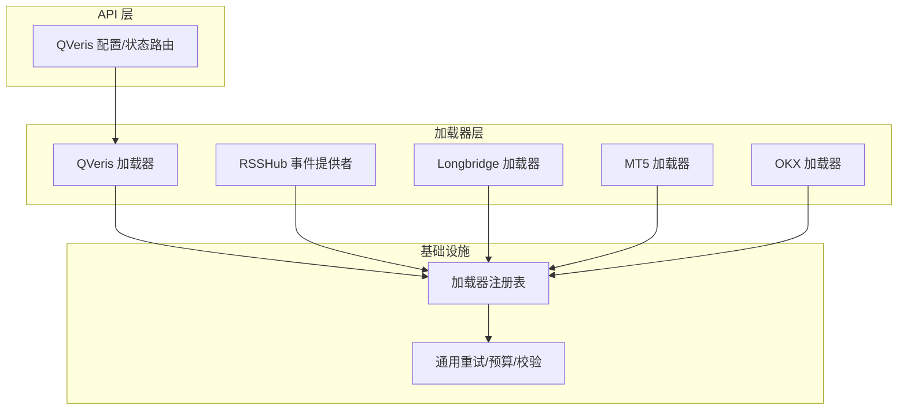
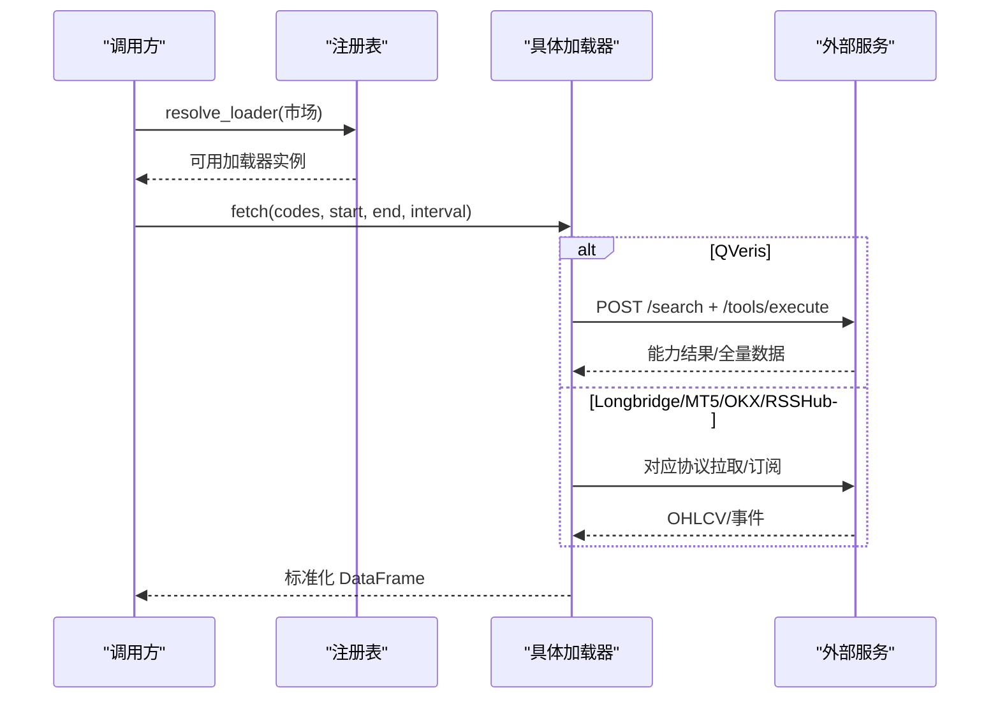
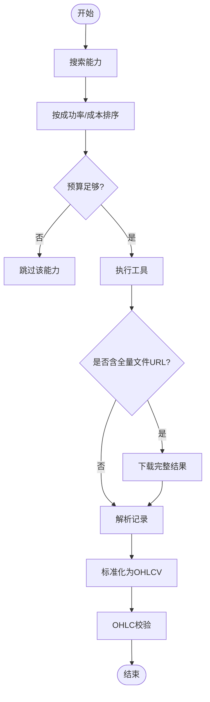
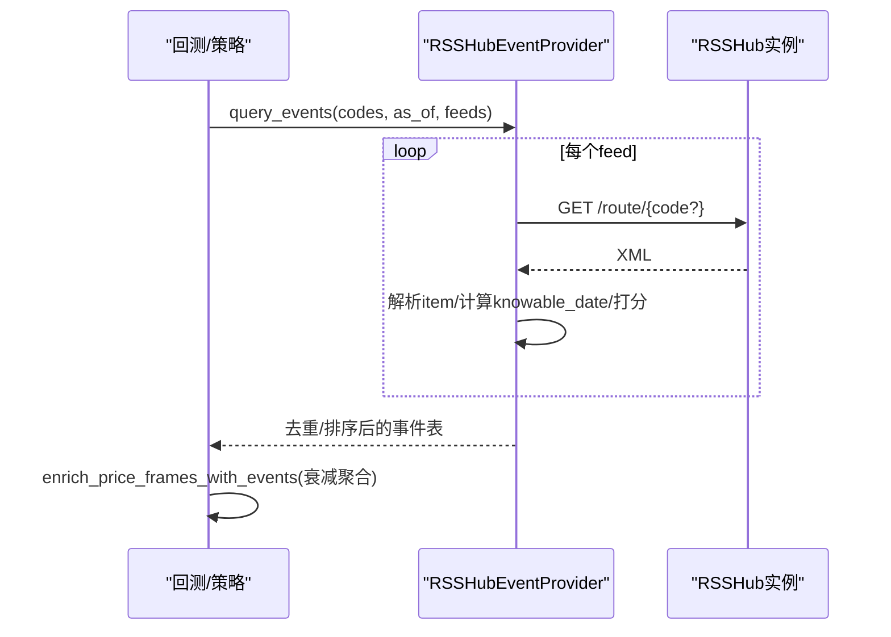
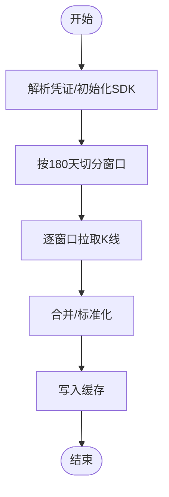
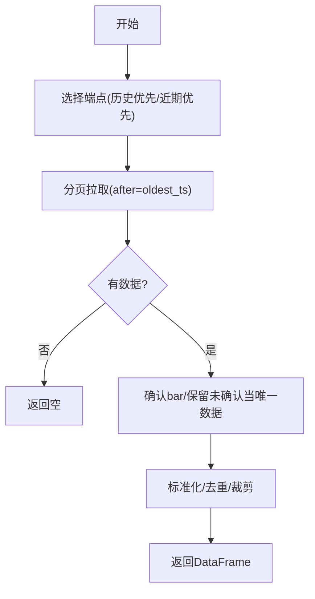
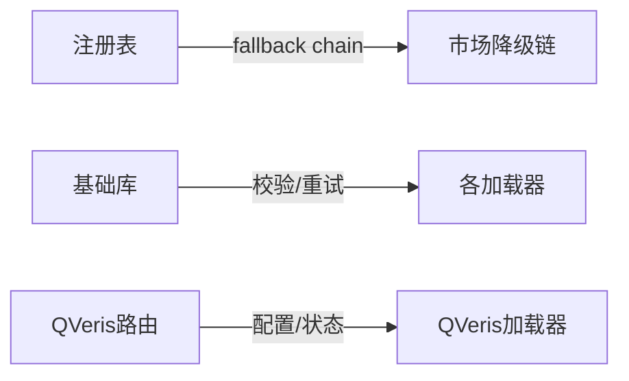

# 专业数据源

<cite>
**本文引用的文件**
- [qveris_loader.py](file://agent/backtest/loaders/qveris_loader.py)
- [rsshub_events.py](file://agent/backtest/loaders/rsshub_events.py)
- [longbridge.py](file://agent/backtest/loaders/longbridge.py)
- [mt5_loader.py](file://agent/backtest/loaders/mt5_loader.py)
- [okx.py](file://agent/backtest/loaders/okx.py)
- [registry.py](file://agent/backtest/loaders/registry.py)
- [base.py](file://agent/backtest/loaders/base.py)
- [qveris_routes.py](file://agent/src/api/qveris_routes.py)
</cite>

## 目录
1. [简介](#简介)
2. [项目结构](#项目结构)
3. [核心组件](#核心组件)
4. [架构总览](#架构总览)
5. [详细组件分析](#详细组件分析)
6. [依赖关系分析](#依赖关系分析)
7. [性能考量](#性能考量)
8. [故障排查指南](#故障排查指南)
9. [结论](#结论)
10. [附录](#附录)

## 简介
本文件面向 Vibe-Trading 的专业数据源集成，覆盖 QVeris 量化研究平台、RSSHub 事件流、Longbridge 港美股、MT5 外汇期货与 OKX 加密货币等数据源。文档重点说明：
- 各数据源的高级能力（如 QVeris 的付费路由与预算控制、RSSHub 的事件驱动与点-in-time 安全、Longbridge 的分页窗口拉取、MT5 本地终端直连、OKX 历史深度拉取）
- 实时数据推送与批量数据处理能力（以加载器为主，结合事件聚合）
- 认证机制、权限控制与速率限制处理
- 高频数据处理、实时信号生成与事件驱动策略的实现思路
- 复杂交易场景中的应用案例与性能优化技巧

## 项目结构
专业数据源统一通过“加载器”抽象接入回测与工具链，注册到全局注册表并按市场类型组织降级链；QVeris 额外提供 API 路由用于配置与状态查询。



图表来源
- [registry.py:136-155](file://agent/backtest/loaders/registry.py#L136-L155)
- [base.py:122-200](file://agent/backtest/loaders/base.py#L122-L200)
- [qveris_routes.py:139-232](file://agent/src/api/qveris_routes.py#L139-L232)

章节来源
- [registry.py:1-249](file://agent/backtest/loaders/registry.py#L1-L249)
- [base.py:1-200](file://agent/backtest/loaders/base.py#L1-L200)

## 核心组件
- QVeris 加载器：付费能力路由，按能力搜索与执行，支持预算配额与最小请求间隔，返回标准化 OHLCV。
- RSSHub 事件提供者：订阅自托管 RSSHub 新闻/公告/情绪流，按事件分类打分并注入价格序列，保证点-in-time 安全。
- Longbridge 加载器：港美股 OHLCV，自动将宽日期范围切分为多窗口以避免单接口限制。
- MT5 加载器：连接本地 MetaTrader 5 终端获取外汇/贵金属历史，支持 broker 符号解析与时间对齐。
- OKX 加载器：加密货币 K 线，公共 REST，自动选择近期或历史端点，分页拉取并做业务错误重试。

章节来源
- [qveris_loader.py:1-685](file://agent/backtest/loaders/qveris_loader.py#L1-L685)
- [rsshub_events.py:1-569](file://agent/backtest/loaders/rsshub_events.py#L1-L569)
- [longbridge.py:1-412](file://agent/backtest/loaders/longbridge.py#L1-L412)
- [mt5_loader.py:1-251](file://agent/backtest/loaders/mt5_loader.py#L1-L251)
- [okx.py:1-373](file://agent/backtest/loaders/okx.py#L1-L373)

## 架构总览
所有加载器实现统一的 fetch(codes, start_date, end_date, interval, fields) 契约，并通过注册表按市场类型选择可用源。QVeris 作为显式 key-gated 源不参与自动降级链；其他网络源在不可用时按市场降级链尝试。



图表来源
- [registry.py:158-193](file://agent/backtest/loaders/registry.py#L158-L193)
- [qveris_loader.py:260-381](file://agent/backtest/loaders/qveris_loader.py#L260-L381)
- [longbridge.py:255-412](file://agent/backtest/loaders/longbridge.py#L255-L412)
- [mt5_loader.py:186-251](file://agent/backtest/loaders/mt5_loader.py#L186-L251)
- [okx.py:131-208](file://agent/backtest/loaders/okx.py#L131-L208)
- [rsshub_events.py:343-400](file://agent/backtest/loaders/rsshub_events.py#L343-L400)

## 详细组件分析

### QVeris 量化研究平台
- 能力发现与执行：通过自然语言搜索匹配能力，再执行工具参数化拉取；支持 full_content_file_url 下载完整结果。
- 预算与节流：会话级信用预算、最小请求间隔、429 重试与 Retry-After 解析。
- 数据标准化：将不同 provider 的响应映射为标准 OHLCV 列，过滤无效行并校验 OHLC 不变性。
- 认证与权限：需要启用 paid 模式与有效 API Key；可通过 API 路由查看配置与状态。



图表来源
- [qveris_loader.py:387-553](file://agent/backtest/loaders/qveris_loader.py#L387-L553)
- [qveris_loader.py:556-685](file://agent/backtest/loaders/qveris_loader.py#L556-L685)
- [qveris_loader.py:147-258](file://agent/backtest/loaders/qveris_loader.py#L147-L258)

章节来源
- [qveris_loader.py:1-685](file://agent/backtest/loaders/qveris_loader.py#L1-L685)
- [qveris_routes.py:139-232](file://agent/src/api/qveris_routes.py#L139-L232)

### RSSHub 事件流（事件驱动策略）
- 订阅与解析：从自托管 RSSHub 拉取 XML，使用 defusedxml 安全解析，提取标题、摘要、发布时间。
- 点-in-time 安全：根据收盘截止时间将发布后内容归入下一个交易日，确保回溯无未来信息泄露。
- 评分与聚合：默认词典评分，可替换为任意打分函数；对价格序列按时间窗口指数衰减聚合事件分数。
- 配置：FeedSpec 声明 route_template、event_type、code_style；支持 per-symbol 与市场级 feed。



图表来源
- [rsshub_events.py:288-400](file://agent/backtest/loaders/rsshub_events.py#L288-L400)
- [rsshub_events.py:449-569](file://agent/backtest/loaders/rsshub_events.py#L449-L569)

章节来源
- [rsshub_events.py:1-569](file://agent/backtest/loaders/rsshub_events.py#L1-L569)

### Longbridge 港美股
- 认证：需 AppKey/AppSecret/AccessToken；初始化失败会抛出明确错误。
- 区间拆分：单接口约 1000 根 K 线限制，自动拆分为连续 180 天窗口，最多 20 个窗口。
- 标准化：统一时区为 UTC 无时区时间戳，填充缺失成交量，校验 OHLC。
- 缓存：命中缓存则无需网络；否则建立 SDK 上下文拉取并写回缓存。



图表来源
- [longbridge.py:135-197](file://agent/backtest/loaders/longbridge.py#L135-L197)
- [longbridge.py:255-412](file://agent/backtest/loaders/longbridge.py#L255-L412)

章节来源
- [longbridge.py:1-412](file://agent/backtest/loaders/longbridge.py#L1-L412)

### MT5 外汇期货
- 终端直连：进程内仅初始化一次，缓存 attach 结果；读取共享配置文件。
- 符号解析：优先精确匹配，其次 base 名称，最后通配符最短匹配（如 Exness 后缀）。
- 时间处理：UTC 时间对齐，tick_volume 作为成交量代理，按日边界裁剪。
- 可用性：未安装 SDK 或未登录终端时标记不可用，走降级链。

```mermaid
classDiagram
class DataLoader {
+name="mt5"
+markets={"forex"}
+is_available() bool
+fetch(codes,start,end,interval) dict
-_fetch_one(code,start,end,timeframe) DataFrame?
}
class MT5 {
+initialize(...)
+symbols_get(group)
+copy_rates_range(symbol,tf,from,to)
}
DataLoader --> MT5 : "调用"
```

图表来源
- [mt5_loader.py:79-147](file://agent/backtest/loaders/mt5_loader.py#L79-L147)
- [mt5_loader.py:170-251](file://agent/backtest/loaders/mt5_loader.py#L170-L251)

章节来源
- [mt5_loader.py:1-251](file://agent/backtest/loaders/mt5_loader.py#L1-L251)

### OKX 加密货币
- 端点选择：近期数据用 /market/candles，历史深度用 /market/history-candles；按起始日期决定首选端点。
- 分页与预算：每页最大 300 条，按分钟/小时/日设置最大页数；整体请求受预算与超时保护。
- 错误处理：HTTP 429/5xx 与业务 code!=0 均触发重试；非 JSON 响应抛异常。
- 标准化：保留绝对 UTC 时间戳，去重并裁剪到请求区间。



图表来源
- [okx.py:109-126](file://agent/backtest/loaders/okx.py#L109-L126)
- [okx.py:220-373](file://agent/backtest/loaders/okx.py#L220-L373)

章节来源
- [okx.py:1-373](file://agent/backtest/loaders/okx.py#L1-L373)

## 依赖关系分析
- 注册表维护市场到加载器的降级链；QVeris 被标记为不自动降级，避免误用付费通道。
- 基础库提供日期校验、OHLC 校验、预算检查与重试封装，供各加载器复用。
- QVeris 通过 API 路由暴露配置与状态，便于 Web UI 管理。



图表来源
- [registry.py:136-155](file://agent/backtest/loaders/registry.py#L136-L155)
- [registry.py:196-249](file://agent/backtest/loaders/registry.py#L196-L249)
- [base.py:31-119](file://agent/backtest/loaders/base.py#L31-L119)
- [qveris_routes.py:139-232](file://agent/src/api/qveris_routes.py#L139-L232)

章节来源
- [registry.py:1-249](file://agent/backtest/loaders/registry.py#L1-L249)
- [base.py:1-200](file://agent/backtest/loaders/base.py#L1-L200)

## 性能考量
- 批量拉取与缓存：各加载器均使用缓存键（source/symbol/timeframe/start/end），命中即返回，减少重复网络开销。
- 分页与窗口：Longbridge 按 180 天窗口拆分；OKX 按 bar 粒度限制页数；MT5 受终端“最大K线数”限制。
- 重试与预算：统一使用 retry_with_budget 与 check_budget，防止慢请求拖垮批处理。
- 节流与配额：QVeris 支持最小请求间隔与会话信用预算；RSSHub 支持超时与预算。
- 数据质量：统一进行 OHLC 校验，剔除结构性异常 K 线，保障下游指标稳定。

[本节为通用指导，不直接分析具体文件]

## 故障排查指南
- QVeris
  - 现象：无法拉取或返回空
  - 排查：检查是否启用 paid 模式与 API Key；查看状态路由中的 remaining_credits 与最近事件；确认最小请求间隔与预算是否耗尽
  - 参考路径
    - [qveris_loader.py:260-381](file://agent/backtest/loaders/qveris_loader.py#L260-L381)
    - [qveris_routes.py:180-232](file://agent/src/api/qveris_routes.py#L180-L232)
- RSSHub
  - 现象：事件为空或报错
  - 排查：确认 base_url 可达、路由存在；若全部失败将抛出事件提供者错误；检查 close_cutoff_hour 与 as_of 是否导致过滤过多
  - 参考路径
    - [rsshub_events.py:343-400](file://agent/backtest/loaders/rsshub_events.py#L343-L400)
    - [rsshub_events.py:402-447](file://agent/backtest/loaders/rsshub_events.py#L402-L447)
- Longbridge
  - 现象：凭证错误或初始化失败
  - 排查：确认三个凭证字段齐全且正确；检查 SDK 是否安装；宽日期范围是否超过窗口上限
  - 参考路径
    - [longbridge.py:211-253](file://agent/backtest/loaders/longbridge.py#L211-L253)
    - [longbridge.py:334-360](file://agent/backtest/loaders/longbridge.py#L334-L360)
- MT5
  - 现象：找不到符号或拉不到数据
  - 排查：确认终端已登录；检查 mt5.json；确认 broker 是否提供该符号；核对时间范围与终端最大K线数
  - 参考路径
    - [mt5_loader.py:79-147](file://agent/backtest/loaders/mt5_loader.py#L79-L147)
    - [mt5_loader.py:229-251](file://agent/backtest/loaders/mt5_loader.py#L229-L251)
- OKX
  - 现象：频繁 429/5xx 或业务码非 0
  - 排查：检查代理环境变量；降低并发或增大预算；确认 instId/bar 格式；关注历史端点优先策略
  - 参考路径
    - [okx.py:72-99](file://agent/backtest/loaders/okx.py#L72-L99)
    - [okx.py:267-323](file://agent/backtest/loaders/okx.py#L267-L323)

章节来源
- [qveris_loader.py:260-381](file://agent/backtest/loaders/qveris_loader.py#L260-L381)
- [rsshub_events.py:343-400](file://agent/backtest/loaders/rsshub_events.py#L343-L400)
- [longbridge.py:211-360](file://agent/backtest/loaders/longbridge.py#L211-L360)
- [mt5_loader.py:79-147](file://agent/backtest/loaders/mt5_loader.py#L79-L147)
- [okx.py:72-99](file://agent/backtest/loaders/okx.py#L72-L99)
- [okx.py:267-323](file://agent/backtest/loaders/okx.py#L267-L323)

## 结论
Vibe-Trading 的专业数据源通过统一加载器接口与注册表机制，实现了跨市场、可降级、可观测的数据接入。QVeris 提供付费能力路由与预算控制；RSSHub 提供事件驱动的实时信号；Longbridge、MT5、OKX 分别覆盖港美股、外汇期货与加密货币的高频与历史数据。结合缓存、重试、预算与 OHLC 校验，可在复杂交易场景中稳定运行并持续优化性能。

[本节为总结性内容，不直接分析具体文件]

## 附录
- 高级用法建议
  - 事件驱动策略：使用 RSSHub 事件聚合为 event_score 与 event_count，结合指数衰减窗口生成短期信号。
  - 高频回测：优先使用 OKX 历史端点与分钟级 bar；注意分页与预算；必要时切换至 CCXT/Binance。
  - 外汇期货：利用 MT5 本地终端获取真实流动性与合约细节；注意符号后缀与时间对齐。
  - 港美股：Longbridge 适合长周期日线与周线；分钟线需注意窗口拆分与缓存命中率。
  - QVeris：合理设置预算与最小请求间隔，避免突发流量触发限流；通过状态路由监控剩余额度与最近调用。

[本节为通用指导，不直接分析具体文件]