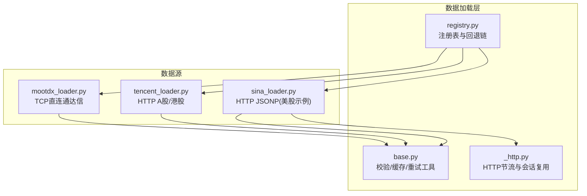
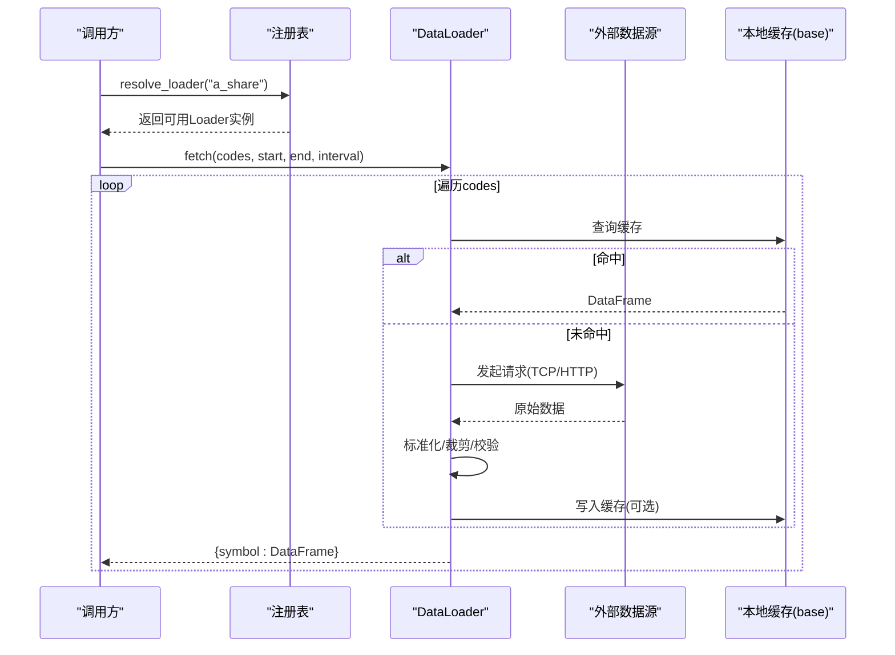
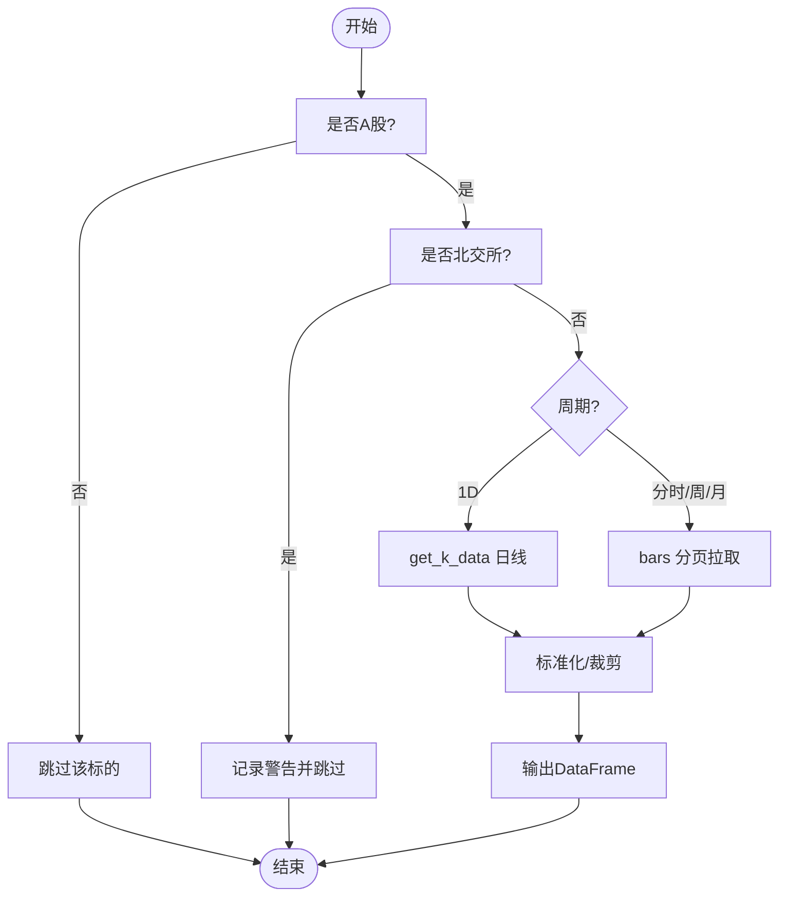
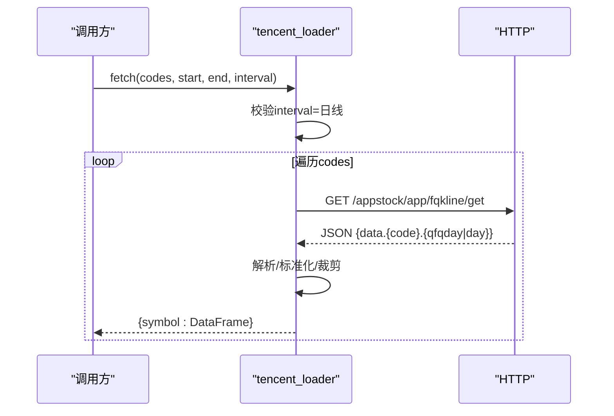
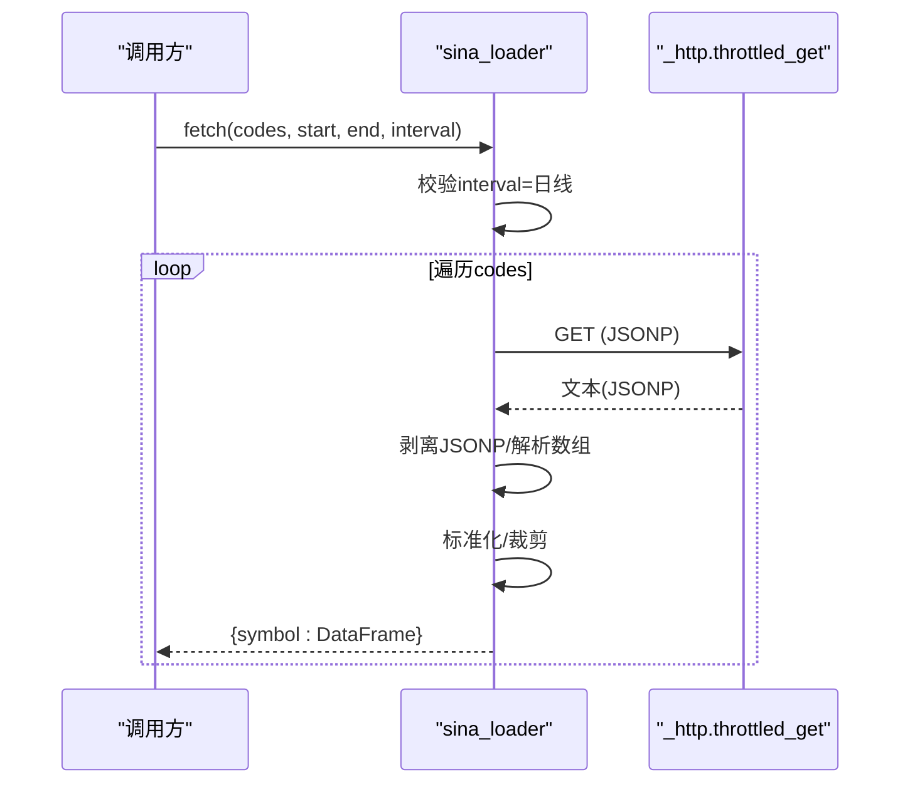
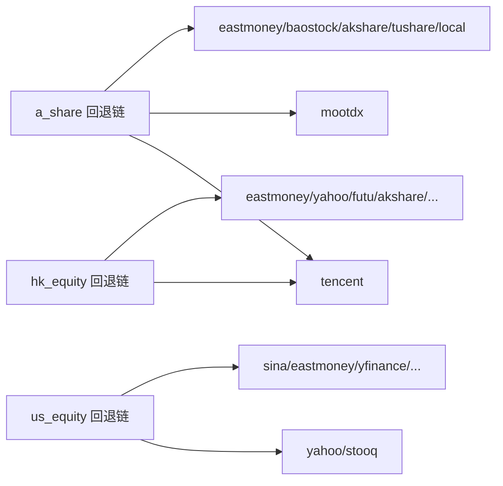

# 中国A股市场数据源

<cite>
**本文引用的文件**
- [mootdx_loader.py](file://agent/backtest/loaders/mootdx_loader.py)
- [sina_loader.py](file://agent/backtest/loaders/sina_loader.py)
- [tencent_loader.py](file://agent/backtest/loaders/tencent_loader.py)
- [base.py](file://agent/backtest/loaders/base.py)
- [_http.py](file://agent/backtest/loaders/_http.py)
- [registry.py](file://agent/backtest/loaders/registry.py)
- [test_mootdx_loader.py](file://agent/tests/test_mootdx_loader.py)
- [test_sina_loader.py](file://agent/tests/test_sina_loader.py)
- [test_tencent_loader.py](file://agent/tests/test_tencent_loader.py)
</cite>

## 目录
1. [简介](#简介)
2. [项目结构](#项目结构)
3. [核心组件](#核心组件)
4. [架构总览](#架构总览)
5. [详细组件分析](#详细组件分析)
6. [依赖关系分析](#依赖关系分析)
7. [性能与配置](#性能与配置)
8. [故障恢复与回退](#故障恢复与回退)
9. [常见问题排查](#常见问题排查)
10. [结论](#结论)

## 简介
本文件面向 Vibe-Trading 在中国 A 股市场的数据接入，重点说明 MooTDX、新浪财经和腾讯财经三个数据源的集成实现与技术特点：
- MooTDX：通过 TCP 直连通达信协议获取 A 股 OHLCV，不受 HTTP 爬取限流影响；支持日线和分钟级分时（分页拉取），对北交所标的进行专门识别与跳过。
- 新浪财经：基于 HTTP JSONP 的免费接口，按 IP 限速，统一走共享节流器；当前实现为美股日线示例，但展示了 HTTP 限制处理模式。
- 腾讯财经：免费 HTTP API，覆盖 A 股与港股，返回前复权或日线数组，适配标准 OHLCV 框架。

同时，文档给出 A 股交易规则在数据层的应用建议（涨跌停、停牌过滤、复权因子）、不同数据源的配置方法、性能对比与故障恢复策略，并提供代码路径指引以便快速定位实现细节。

## 项目结构
与 A 股数据源相关的核心模块位于 backtest/loaders 下，采用“每个数据源一个 Loader”的插件式结构，并通过注册表统一管理市场级别的回退链。

图表来源
- [registry.py:136-155](file://agent/backtest/loaders/registry.py#L136-L155)
- [base.py:243-439](file://agent/backtest/loaders/base.py#L243-L439)
- [_http.py:120-152](file://agent/backtest/loaders/_http.py#L120-L152)

章节来源
- [registry.py:1-249](file://agent/backtest/loaders/registry.py#L1-L249)
- [base.py:1-645](file://agent/backtest/loaders/base.py#L1-L645)
- [_http.py:1-180](file://agent/backtest/loaders/_http.py#L1-L180)

## 核心组件
- DataLoader 协议与通用能力
  - 统一的 fetch(codes, start_date, end_date, interval, fields) 接口，输出 symbol -> DataFrame(trade_date, open, high, low, close, volume)。
  - 日期范围校验、OHLC 结构校验、本地 Parquet 缓存、重试预算等通用能力集中在 base.py。
- 注册表与回退链
  - registry.py 维护各市场的回退顺序，例如 a_share 优先 tencent、mootdx，再依次尝试其他源。
- HTTP 节流
  - _http.py 提供 per-host 最小间隔与连接池复用，避免触发 IP 封禁。

章节来源
- [base.py:31-119](file://agent/backtest/loaders/base.py#L31-L119)
- [base.py:243-439](file://agent/backtest/loaders/base.py#L243-L439)
- [registry.py:136-155](file://agent/backtest/loaders/registry.py#L136-L155)
- [_http.py:46-152](file://agent/backtest/loaders/_http.py#L46-L152)

## 架构总览
数据请求从上层调用进入具体 Loader，Loader 负责：
- 标的识别与过滤（如仅 A 股）
- 数据源特定请求（TCP/HTTP）
- 响应解析与标准化（统一 OHLCV 列名与时序索引）
- 窗口裁剪与空结果处理
- 异常日志与继续遍历（批量失败不中断）

图表来源
- [registry.py:158-193](file://agent/backtest/loaders/registry.py#L158-L193)
- [base.py:401-439](file://agent/backtest/loaders/base.py#L401-L439)
- [mootdx_loader.py:91-148](file://agent/backtest/loaders/mootdx_loader.py#L91-L148)
- [tencent_loader.py:50-85](file://agent/backtest/loaders/tencent_loader.py#L50-L85)
- [sina_loader.py:137-181](file://agent/backtest/loaders/sina_loader.py#L137-L181)

## 详细组件分析

### MooTDX 数据源（A 股 OHLCV，TCP 直连通达信）
技术特点
- 使用 mootdx 库以 TCP 直连通达信服务器，无需鉴权，不受 HTTP 爬取限流影响。
- 支持 A 股日线与分钟级分时（1m/5m/15m/30m/1H），周月线通过 bars 分页回溯历史。
- 自动识别沪/深/京标的，对北交所标的进行专门识别并跳过（上游不支持）。

关键流程
- 日线：直接调用 get_k_data(code, start_date, end_date)，标准化为 OHLCV。
- 分时/周/月：通过 bars(symbol, frequency, start, offset) 分页拉取，直到覆盖起始日期或达到最大页数上限。
- 标准化：统一列名、时间索引、数值类型转换，并按区间裁剪。

图表来源
- [mootdx_loader.py:47-64](file://agent/backtest/loaders/mootdx_loader.py#L47-L64)
- [mootdx_loader.py:150-202](file://agent/backtest/loaders/mootdx_loader.py#L150-L202)
- [mootdx_loader.py:204-252](file://agent/backtest/loaders/mootdx_loader.py#L204-L252)

A 股交易规则处理建议
- 涨跌停限制：建议在引擎层根据交易所规则与当日昨收价计算涨跌停价，并在信号生成或风控门中应用；数据层保持原始价格，不做静默修改。
- 停牌股票过滤：若某日无成交或数据缺失，可在回测引擎侧将当日剔除或视为不可交易；数据层已做 NaN 清理与结构校验。
- 复权因子计算：MooTDX 返回不复权行情；如需复权，可结合第三方复权因子（如 Tushare/Eastmoney）在数据后处理阶段计算前/后复权序列。

章节来源
- [mootdx_loader.py:1-253](file://agent/backtest/loaders/mootdx_loader.py#L1-L253)
- [test_mootdx_loader.py:1-243](file://agent/tests/test_mootdx_loader.py#L1-L243)

### 腾讯财经数据源（A 股/港股，HTTP）
技术特点
- 免费 HTTP API，无需鉴权；覆盖 A 股（SH/SZ）与港股（HK）。
- 返回前复权或日线数组；港股代码需零填充至 5 位。
- 仅支持日线（interval 非日线将被拒绝并返回空）。

关键流程
- 构造 URL：拼接 tencent_code、day、起止日期、qfq 参数。
- 发送请求：设置 User-Agent 与 Referer，读取 JSON 并解析 kline 数组。
- 标准化：映射到 OHLCV 列，设置 trade_date 索引，丢弃无效行。

图表来源
- [tencent_loader.py:27-33](file://agent/backtest/loaders/tencent_loader.py#L27-L33)
- [tencent_loader.py:50-85](file://agent/backtest/loaders/tencent_loader.py#L50-L85)
- [tencent_loader.py:87-159](file://agent/backtest/loaders/tencent_loader.py#L87-L159)

章节来源
- [tencent_loader.py:1-159](file://agent/backtest/loaders/tencent_loader.py#L1-L159)
- [test_tencent_loader.py:1-120](file://agent/tests/test_tencent_loader.py#L1-L120)

### 新浪财经数据源（HTTP JSONP，美股日线示例）
技术特点
- 通过 JSONP 接口获取 K 线数据，需剥离外层包裹并解析数组。
- 所有请求经 throttled_get 进行 per-host 节流，避免 IP 封禁。
- 当前实现为美股日线示例，展示 HTTP 限制处理模式与数据清洗流程。

关键流程
- 符号映射：内部 TICKER.US -> 裸 ticker。
- 请求与解析：throttled_get 获取 JSONP，正则提取数组，转为 DataFrame。
- 窗口裁剪：按起止日期筛选，丢弃无效行。

图表来源
- [sina_loader.py:30-41](file://agent/backtest/loaders/sina_loader.py#L30-L41)
- [sina_loader.py:122-181](file://agent/backtest/loaders/sina_loader.py#L122-L181)
- [sina_loader.py:183-201](file://agent/backtest/loaders/sina_loader.py#L183-L201)
- [_http.py:120-152](file://agent/backtest/loaders/_http.py#L120-L152)

章节来源
- [sina_loader.py:1-201](file://agent/backtest/loaders/sina_loader.py#L1-L201)
- [test_sina_loader.py:1-225](file://agent/tests/test_sina_loader.py#L1-L225)

## 依赖关系分析
- 数据源与通用能力的解耦
  - 各 Loader 仅关注自身协议与数据格式，通用校验、缓存、重试由 base.py 提供。
  - HTTP 类 Loader 通过 _http.py 统一节流与会话复用。
- 回退链与市场选择
  - registry.py 定义 a_share/us_equity/hk_equity 等市场的回退顺序，确保在网络波动时自动切换。

图表来源
- [registry.py:136-155](file://agent/backtest/loaders/registry.py#L136-L155)

章节来源
- [registry.py:1-249](file://agent/backtest/loaders/registry.py#L1-L249)

## 性能与配置
- 性能特征
  - MooTDX：TCP 直连，低延迟、高吞吐，适合长历史与高频分时拉取；分页上限保护避免长时间阻塞。
  - 腾讯财经：HTTP 轻量，适合日线批量；注意并发与超时。
  - 新浪财经：JSONP 解析开销较小，但受 IP 限速；通过节流器控制频率。
- 配置要点
  - 本地缓存：可通过环境变量启用 loader 本地缓存，减少重复网络请求（base.py 中的缓存开关与根路径）。
  - 最小间隔：通过环境变量调整各源的请求间隔（_http.py 的 resolve_min_interval）。
  - 回退链：根据网络状况与可用性调整 registry.py 中的顺序（默认已优化）。

章节来源
- [base.py:243-439](file://agent/backtest/loaders/base.py#L243-L439)
- [_http.py:106-118](file://agent/backtest/loaders/_http.py#L106-L118)
- [registry.py:136-155](file://agent/backtest/loaders/registry.py#L136-L155)

## 故障恢复与回退
- 单标的失败不中断批量：各 Loader 在循环中对单个 code 捕获异常并记录日志，继续处理其余标的。
- 网络异常与限流：HTTP 类 Loader 通过 throttled_get 与重试预算（base.py 的 retry_with_budget）处理瞬态错误。
- 回退链：当指定源不可用时，按市场回退链自动切换到下一个可用源（registry.py）。
- 北交所特殊处理：MooTDX 上游不支持 BJ 数据，检测到 BJ 标的会记录警告并跳过，避免静默空结果。

章节来源
- [mootdx_loader.py:124-148](file://agent/backtest/loaders/mootdx_loader.py#L124-L148)
- [base.py:184-236](file://agent/backtest/loaders/base.py#L184-L236)
- [registry.py:158-193](file://agent/backtest/loaders/registry.py#L158-L193)

## 常见问题排查
- 无法导入 mootdx：is_available() 返回 False，回退链将尝试其他源；检查依赖安装。
- 北交所标的为空：MooTDX 不支持 BJ，日志包含“北交所”提示；改用 akshare/tushare。
- 非日线请求被拒绝：腾讯仅支持日线，传入分钟/小时将返回空；确认 interval。
- HTTP 4xx/5xx：新浪/腾讯请求失败会被记录并跳过该标的；检查网络与 Referer/User-Agent。
- 数据质量：OHLC 结构校验会丢弃异常行；若出现大量 NaN，检查上游数据与清洗逻辑。

章节来源
- [test_mootdx_loader.py:178-191](file://agent/tests/test_mootdx_loader.py#L178-L191)
- [test_tencent_loader.py:56-88](file://agent/tests/test_tencent_loader.py#L56-L88)
- [test_sina_loader.py:176-197](file://agent/tests/test_sina_loader.py#L176-L197)
- [base.py:50-119](file://agent/backtest/loaders/base.py#L50-L119)

## 结论
- MooTDX 凭借 TCP 直连通达信的优势，适合 A 股长历史与高频分时的高效获取；对北交所标的有明确跳过与告警机制。
- 腾讯财经提供稳定的 A 股/港股日线数据，易于集成且无需鉴权；需注意仅支持日线。
- 新浪财经展示了 HTTP JSONP 的处理范式与节流策略，适用于美股日线示例，可作为 HTTP 数据源参考。
- 通过注册表与回退链，系统能在多源之间自动切换，提升鲁棒性；配合本地缓存与重试预算，兼顾性能与稳定性。
- A 股交易规则（涨跌停、停牌、复权）建议在引擎与后处理层实现，数据层保持原始与标准化，确保可追溯与可验证。