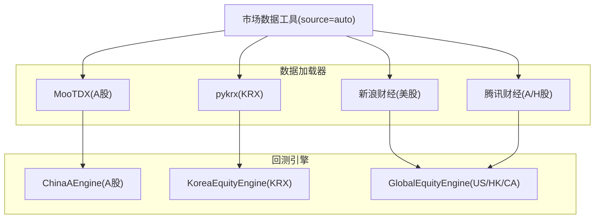
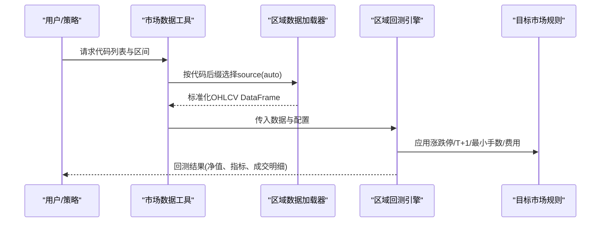
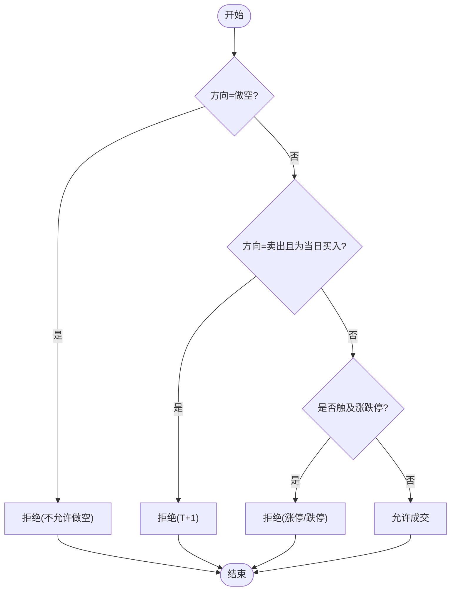
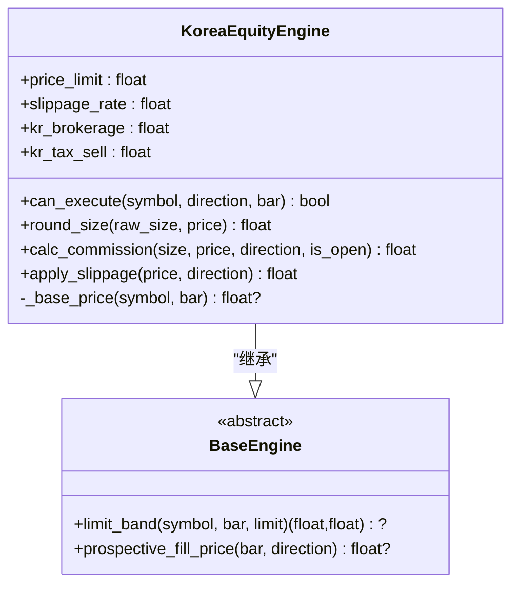
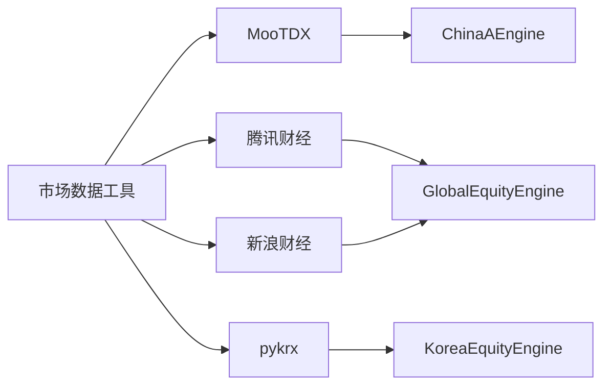

# 区域数据源

<cite>
**本文引用的文件**
- [china_a.py](file://agent/backtest/engines/china_a.py)
- [korea_equity.py](file://agent/backtest/engines/korea_equity.py)
- [mootdx_loader.py](file://agent/backtest/loaders/mootdx_loader.py)
- [sina_loader.py](file://agent/backtest/loaders/sina_loader.py)
- [tencent_loader.py](file://agent/backtest/loaders/tencent_loader.py)
- [pykrx_loader.py](file://agent/backtest/loaders/pykrx_loader.py)
- [cn_adjust.py](file://agent/backtest/loaders/cn_adjust.py)
- [global_equity.py](file://agent/backtest/engines/global_equity.py)
- [market_data_tool.py](file://agent/src/tools/market_data_tool.py)
</cite>

## 目录
1. [简介](#简介)
2. [项目结构](#项目结构)
3. [核心组件](#核心组件)
4. [架构总览](#架构总览)
5. [详细组件分析](#详细组件分析)
6. [依赖关系分析](#依赖关系分析)
7. [性能与回测注意事项](#性能与回测注意事项)
8. [故障排查指南](#故障排查指南)
9. [结论](#结论)
10. [附录：跨区域对比与组合构建](#附录跨区域对比与组合构建)

## 简介
本文件面向 Vibe-Trading 的区域数据源集成，聚焦中国 A 股市场（MooTDX、新浪财经、腾讯财经）、韩国股市（KRX）及其他区域市场的特殊处理方式。内容涵盖：
- 各区域市场的交易规则差异（T+1/T+0、涨跌停/限制幅度、最小交易单位、做空限制等）
- 数据格式差异与本地化适配（列名、复权方式、时间序列索引、符号约定）
- 复权因子处理、停牌股票过滤、涨跌停限制的实现要点
- 区域市场特有的技术指标计算与回测注意事项
- 跨区域数据对比分析与投资组合构建方法

## 项目结构
围绕“数据加载器 + 回测引擎”的解耦设计：
- 数据加载器：按区域提供 OHLCV 数据，统一输出标准列（open/high/low/close/volume），并处理来源特有格式与复权。
- 回测引擎：按区域实现交易规则（涨跌停、T+1、最小手数、佣金税费、滑点、价格网格）。
- 工具层：自动路由 source="auto"，根据代码后缀识别市场并选择合适的数据源。

图表来源
- [mootdx_loader.py:66-148](file://agent/backtest/loaders/mootdx_loader.py#L66-L148)
- [sina_loader.py:122-201](file://agent/backtest/loaders/sina_loader.py#L122-L201)
- [tencent_loader.py:35-159](file://agent/backtest/loaders/tencent_loader.py#L35-L159)
- [pykrx_loader.py:76-194](file://agent/backtest/loaders/pykrx_loader.py#L76-L194)
- [china_a.py:20-93](file://agent/backtest/engines/china_a.py#L20-L93)
- [korea_equity.py:139-317](file://agent/backtest/engines/korea_equity.py#L139-L317)
- [global_equity.py:1-45](file://agent/backtest/engines/global_equity.py#L1-L45)
- [market_data_tool.py:51-79](file://agent/src/tools/market_data_tool.py#L51-L79)

章节来源
- [mootdx_loader.py:66-148](file://agent/backtest/loaders/mootdx_loader.py#L66-L148)
- [sina_loader.py:122-201](file://agent/backtest/loaders/sina_loader.py#L122-L201)
- [tencent_loader.py:35-159](file://agent/backtest/loaders/tencent_loader.py#L35-L159)
- [pykrx_loader.py:76-194](file://agent/backtest/loaders/pykrx_loader.py#L76-L194)
- [china_a.py:20-93](file://agent/backtest/engines/china_a.py#L20-L93)
- [korea_equity.py:139-317](file://agent/backtest/engines/korea_equity.py#L139-L317)
- [global_equity.py:1-45](file://agent/backtest/engines/global_equity.py#L1-L45)
- [market_data_tool.py:51-79](file://agent/src/tools/market_data_tool.py#L51-L79)

## 核心组件
- 中国 A 股回测引擎：实现 T+1、涨跌停（主板±10%、创业板/科创板±20%、ST±5%、北交所±30%简化）、100 手最小买入、佣金最低额、印花税单边卖出、过户费等。
- 韩国 KRX 回测引擎：实现 ±30% 日涨跌幅限制、基于 KRX 报价单位的精确价格网格、仅做多、买卖侧费用（券商佣金 + 卖出证券交易税）。
- 数据加载器：
  - MooTDX：通过 TCP 直连通达信服务器获取 A 股 OHLCV，支持多周期，分页拉取历史。
  - 新浪财经：免费 HTTP JSONP 接口获取美股日线。
  - 腾讯财经：免费 HTTP 接口获取 A/H 股日线，默认前复权。
  - pykrx：免费无鉴权获取 KRX 日线，默认使用 Naver 提供的复权数据。
- 复权因子处理：针对 Tushare 原始未复权价格，使用前复权因子校正，避免除权日造成的收益失真。

章节来源
- [china_a.py:20-93](file://agent/backtest/engines/china_a.py#L20-L93)
- [korea_equity.py:139-317](file://agent/backtest/engines/korea_equity.py#L139-L317)
- [mootdx_loader.py:66-148](file://agent/backtest/loaders/mootdx_loader.py#L66-L148)
- [sina_loader.py:122-201](file://agent/backtest/loaders/sina_loader.py#L122-L201)
- [tencent_loader.py:35-159](file://agent/backtest/loaders/tencent_loader.py#L35-L159)
- [pykrx_loader.py:76-194](file://agent/backtest/loaders/pykrx_loader.py#L76-L194)
- [cn_adjust.py:27-78](file://agent/backtest/loaders/cn_adjust.py#L27-L78)

## 架构总览
区域数据流从“数据加载器”到“回测引擎”，再到“策略信号与执行”。不同区域在数据格式、复权方式、交易规则上存在差异，需分别适配。

图表来源
- [market_data_tool.py:51-79](file://agent/src/tools/market_data_tool.py#L51-L79)
- [mootdx_loader.py:66-148](file://agent/backtest/loaders/mootdx_loader.py#L66-L148)
- [sina_loader.py:122-201](file://agent/backtest/loaders/sina_loader.py#L122-L201)
- [tencent_loader.py:35-159](file://agent/backtest/loaders/tencent_loader.py#L35-L159)
- [pykrx_loader.py:76-194](file://agent/backtest/loaders/pykrx_loader.py#L76-L194)
- [china_a.py:20-93](file://agent/backtest/engines/china_a.py#L20-L93)
- [korea_equity.py:139-317](file://agent/backtest/engines/korea_equity.py#L139-L317)

## 详细组件分析

### 中国 A 股市场（MooTDX、新浪财经、腾讯财经）
- 交易规则
  - T+1：当日买入不可当日卖出；卖出时若为当日买入则拒绝。
  - 涨跌停：主板 ±10%，创业板/科创板 ±20%，ST ±5%，北交所简化为 ±30%。
  - 最小买入单位：100 股；卖单可零碎。
  - 费用：佣金双边（最低 ¥5）、印花税卖出单边、过户费双边。
- 数据格式与本地化
  - MooTDX：返回 open/high/low/close/volume，索引为 trade_date；支持分钟/小时/日等多周期，分页拉取历史。
  - 腾讯财经：默认前复权（qfqday/day），返回日期字符串与数值列，标准化为 trade_date 索引。
  - 新浪财经：主要用于美股日线，A 股场景可通过其他加载器。
- 复权因子处理
  - 对 Tushare 原始未复权价格，使用前复权因子校正，避免除权日造成收益失真。
- 停牌与涨跌停
  - 涨跌停在执行时检查：以开盘价加滑点作为拟成交价，比较是否触及涨跌停带；触及则拒绝成交。
  - 停牌过滤：若数据缺失或价格为非正数，回测引擎会跳过该标的或拒绝成交。

图表来源
- [china_a.py:40-93](file://agent/backtest/engines/china_a.py#L40-L93)
- [china_a.py:115-193](file://agent/backtest/engines/china_a.py#L115-L193)

章节来源
- [china_a.py:20-93](file://agent/backtest/engines/china_a.py#L20-L93)
- [china_a.py:115-193](file://agent/backtest/engines/china_a.py#L115-L193)
- [mootdx_loader.py:66-148](file://agent/backtest/loaders/mootdx_loader.py#L66-L148)
- [tencent_loader.py:35-159](file://agent/backtest/loaders/tencent_loader.py#L35-L159)
- [cn_adjust.py:27-78](file://agent/backtest/loaders/cn_adjust.py#L27-L78)

### 韩国股市（KRX）
- 交易规则
  - 仅做多：构造时拒绝 allow_short，因为 KRX 做空头寸受限于借券与上涨规则，日线无法准确建模。
  - 涨跌幅：±30% 日限制，基于基准价（前一交易日收盘或 pre_close）与 KRX 报价单位进行精确计算。
  - 最小单位：1 股。
  - 费用：双边券商佣金 + 卖出证券交易税（当前默认 0.20%）。
- 数据格式与本地化
  - pykrx：返回日期索引与韩文列名，映射为标准 open/high/low/close/volume；默认使用 Naver 提供的复权数据。
  - 报价单位：依据价格区间确定 tick 大小，确保价格落在有效网格上。
- 涨跌停与价格网格
  - 涨跌停计算遵循 KRX 规定：先按基准价 tick 截断涨跌幅金额，再分别加减到基准价，并对结果再次按各自价格区间的 tick 截断。
  - 拟成交价 = 开盘价 + 滑点，若触及涨跌停则拒绝成交。

图表来源
- [korea_equity.py:139-317](file://agent/backtest/engines/korea_equity.py#L139-L317)
- [korea_equity.py:61-137](file://agent/backtest/engines/korea_equity.py#L61-L137)

章节来源
- [korea_equity.py:139-317](file://agent/backtest/engines/korea_equity.py#L139-L317)
- [pykrx_loader.py:76-194](file://agent/backtest/loaders/pykrx_loader.py#L76-L194)

### 其他区域市场（美股、港股、全球权益）
- 美股
  - 通过新浪财经加载器获取日线 OHLCV；T+0、可做空、无佣金（零售）、小数股、低滑点。
- 港股
  - 通过腾讯财经加载器获取日线；T+0、可做空、印花税双边 + 附加费、整手（简化为 100 股）、较高滑点。
- 全球权益引擎
  - 统一处理 US/HK/Canada 的规则差异（手续费、印花税、最小单位、价格网格）。

章节来源
- [sina_loader.py:122-201](file://agent/backtest/loaders/sina_loader.py#L122-L201)
- [tencent_loader.py:35-159](file://agent/backtest/loaders/tencent_loader.py#L35-L159)
- [global_equity.py:1-45](file://agent/backtest/engines/global_equity.py#L1-L45)

## 依赖关系分析
- 数据加载器依赖：
  - MooTDX：需要 mootdx 包；TCP 直连通达信，无 IP 封禁。
  - 腾讯财经：HTTP 接口，无需鉴权。
  - 新浪财经：HTTP JSONP，无需鉴权。
  - pykrx：需要 pykrx 包；内部自带 HTTP 会话，使用 HostThrottle 控制频率。
- 回测引擎依赖：
  - ChinaAEngine：依赖基础引擎的涨跌停带与拟成交价计算。
  - KoreaEquityEngine：依赖 KRX 报价单位表与价格网格函数。
- 工具层路由：
  - market_data_tool 根据代码后缀自动选择数据源（如 .SH/.SZ/.HK/.US/.KS/.KQ）。

图表来源
- [mootdx_loader.py:66-148](file://agent/backtest/loaders/mootdx_loader.py#L66-L148)
- [tencent_loader.py:35-159](file://agent/backtest/loaders/tencent_loader.py#L35-L159)
- [sina_loader.py:122-201](file://agent/backtest/loaders/sina_loader.py#L122-L201)
- [pykrx_loader.py:76-194](file://agent/backtest/loaders/pykrx_loader.py#L76-L194)
- [china_a.py:20-93](file://agent/backtest/engines/china_a.py#L20-L93)
- [korea_equity.py:139-317](file://agent/backtest/engines/korea_equity.py#L139-L317)
- [global_equity.py:1-45](file://agent/backtest/engines/global_equity.py#L1-L45)
- [market_data_tool.py:51-79](file://agent/src/tools/market_data_tool.py#L51-L79)

章节来源
- [mootdx_loader.py:66-148](file://agent/backtest/loaders/mootdx_loader.py#L66-L148)
- [tencent_loader.py:35-159](file://agent/backtest/loaders/tencent_loader.py#L35-L159)
- [sina_loader.py:122-201](file://agent/backtest/loaders/sina_loader.py#L122-L201)
- [pykrx_loader.py:76-194](file://agent/backtest/loaders/pykrx_loader.py#L76-L194)
- [china_a.py:20-93](file://agent/backtest/engines/china_a.py#L20-L93)
- [korea_equity.py:139-317](file://agent/backtest/engines/korea_equity.py#L139-L317)
- [global_equity.py:1-45](file://agent/backtest/engines/global_equity.py#L1-L45)
- [market_data_tool.py:51-79](file://agent/src/tools/market_data_tool.py#L51-L79)

## 性能与回测注意事项
- 数据源频率与缓存
  - MooTDX 支持多周期，分页拉取历史，注意最大页数限制以避免长时间请求。
  - pykrx 每日 API，建议间隔至少 1 秒，使用 HostThrottle 控制并发。
  - 新浪财经与腾讯财经为 HTTP 接口，注意速率限制与重试。
- 复权与收益失真
  - 对 Tushare 原始未复权价格使用前复权因子校正，避免除权日造成的系统性负偏差。
- 涨跌停与价格网格
  - A 股与 KRX 均在执行时检查涨跌停，避免未来信息泄露；KRX 使用精确报价单位，确保价格合法。
- 费用与滑点
  - A 股：佣金最低额、印花税单边、过户费双边；KRX：券商佣金 + 卖出税；美股/港股：印花税与附加费。
- 技术指标计算
  - 建议使用标准化 OHLCV 与复权后的价格序列；对于 A 股与 KRX，考虑涨跌停导致的连续缺口与波动压缩。
- 回测验证
  - 确保 equity.csv 与 metrics.csv 完整；trade_count > 0；首笔交易不过晚；资金利用率合理；结束时不持有仓位。

[本节为通用指导，不直接分析具体文件]

## 故障排查指南
- 数据为空或缺失
  - MooTDX：北交所代码不支持，日志警告并跳过；分页不足时抛出异常。
  - pykrx：非日线区间被拒绝；无数据时返回空字典。
  - 腾讯财经：非 A/H 代码返回 None；非日线区间警告并返回空。
  - 新浪财经：非美股代码返回 None；JSONP 解析失败抛错。
- 涨跌停与价格问题
  - 若拟成交价触及涨跌停带，执行被拒绝；检查 pre_close 或前收盘价可用性。
  - KRX 若无基准价，将记录警告并跳过涨跌停检查。
- 复权因子缺失
  - 若因子缺失或无效，前复权调整返回 None，调用方应剔除该标的。

章节来源
- [mootdx_loader.py:124-148](file://agent/backtest/loaders/mootdx_loader.py#L124-L148)
- [pykrx_loader.py:118-144](file://agent/backtest/loaders/pykrx_loader.py#L118-L144)
- [tencent_loader.py:62-85](file://agent/backtest/loaders/tencent_loader.py#L62-L85)
- [sina_loader.py:161-181](file://agent/backtest/loaders/sina_loader.py#L161-L181)
- [korea_equity.py:205-228](file://agent/backtest/engines/korea_equity.py#L205-L228)
- [cn_adjust.py:54-78](file://agent/backtest/loaders/cn_adjust.py#L54-L78)

## 结论
Vibe-Trading 的区域数据源集成通过“数据加载器 + 回测引擎”的解耦架构，实现了对中国 A 股、韩国 KRX 以及其他区域市场的差异化适配。关键要点包括：
- 严格的市场规则建模（T+1、涨跌停、最小单位、费用）
- 标准化的数据格式与复权处理
- 精确的价格网格与涨跌停检查
- 可靠的加载器容错与速率控制
这些能力为跨区域数据对比与投资组合构建提供了坚实基础。

[本节为总结性内容，不直接分析具体文件]

## 附录：跨区域对比与组合构建
- 数据对齐
  - 统一使用标准化 OHLCV 与 trade_date 索引；对不同市场采用各自的复权方式（A 股前复权、KRX Naver 复权、美股/港股按来源）。
- 指标计算
  - 收益率序列需基于复权价格；考虑涨跌停导致的极端值与跳空；对 A 股与 KRX 使用市场特定的涨跌停过滤。
- 组合优化
  - 使用内置优化器（等波动率、风险平价、均值方差、最大分散化、换手率感知）；注意跨币种池隔离（复合引擎按结算货币拆分运行）。
- 归因分析
  - 使用 Brinson-Fachler 分解评估配置、选股与交互效应；权重总和需一致以保证恒等式成立。

章节来源
- [global_equity.py:1-45](file://agent/backtest/engines/global_equity.py#L1-L45)
- [cn_adjust.py:27-78](file://agent/backtest/loaders/cn_adjust.py#L27-L78)
- [korea_equity.py:139-317](file://agent/backtest/engines/korea_equity.py#L139-L317)
- [mootdx_loader.py:66-148](file://agent/backtest/loaders/mootdx_loader.py#L66-L148)
- [tencent_loader.py:35-159](file://agent/backtest/loaders/tencent_loader.py#L35-L159)
- [sina_loader.py:122-201](file://agent/backtest/loaders/sina_loader.py#L122-L201)
- [pykrx_loader.py:76-194](file://agent/backtest/loaders/pykrx_loader.py#L76-L194)