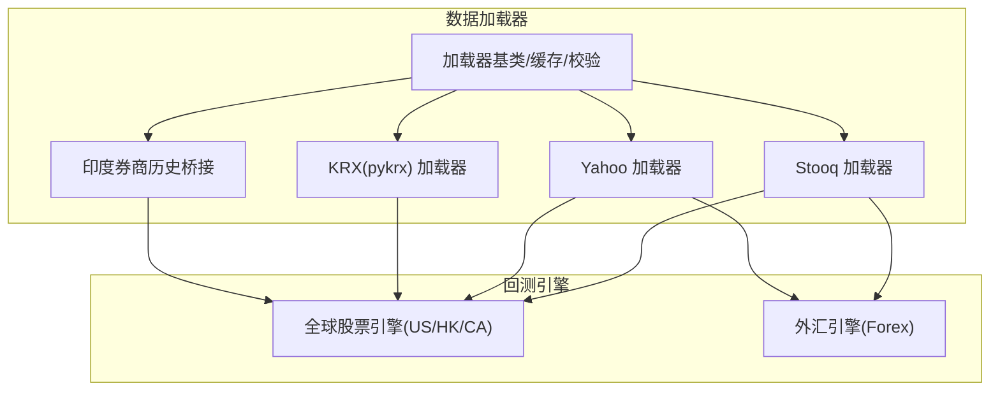
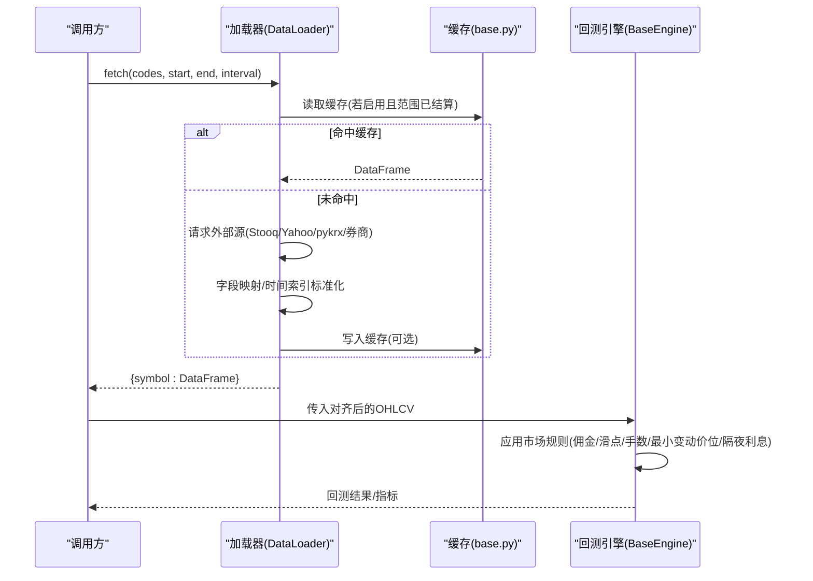
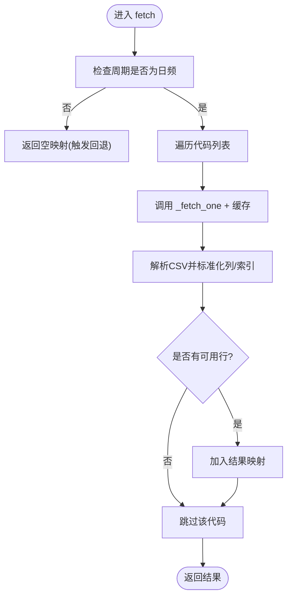
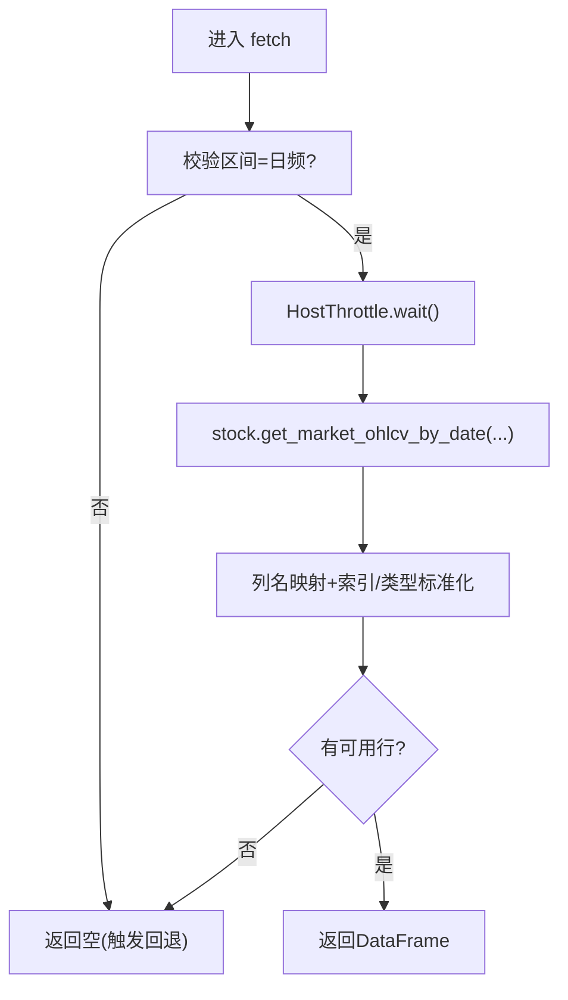
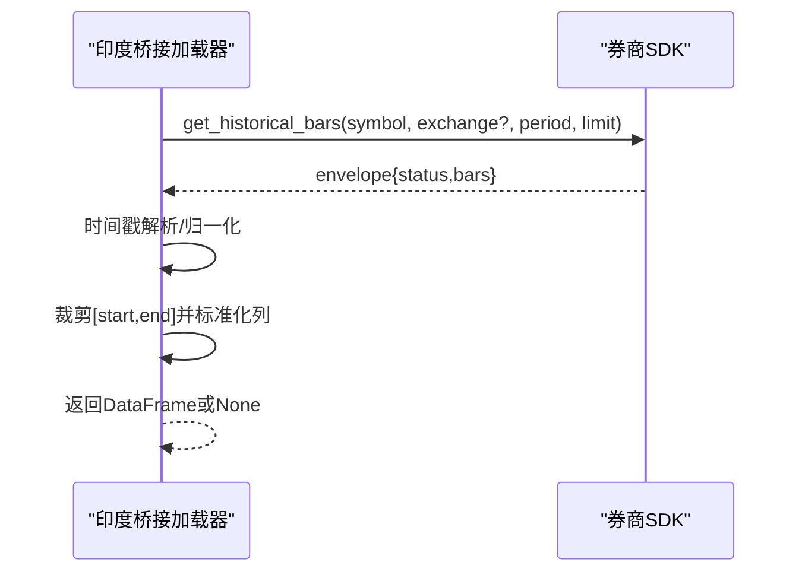
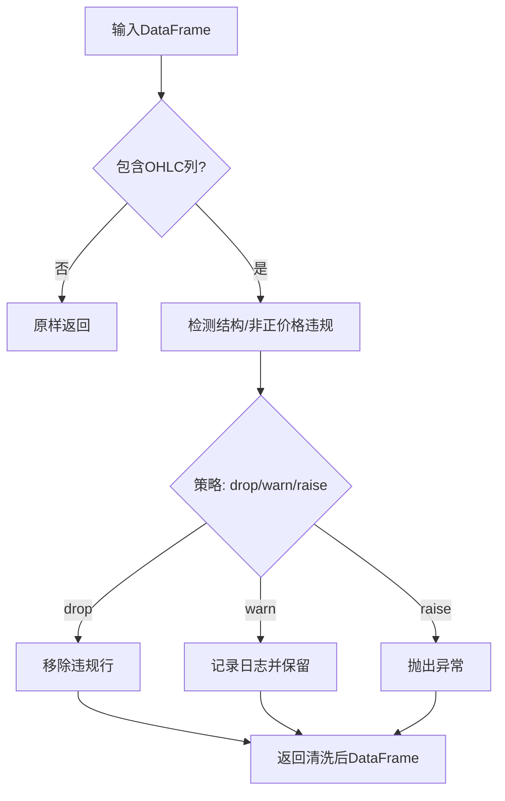
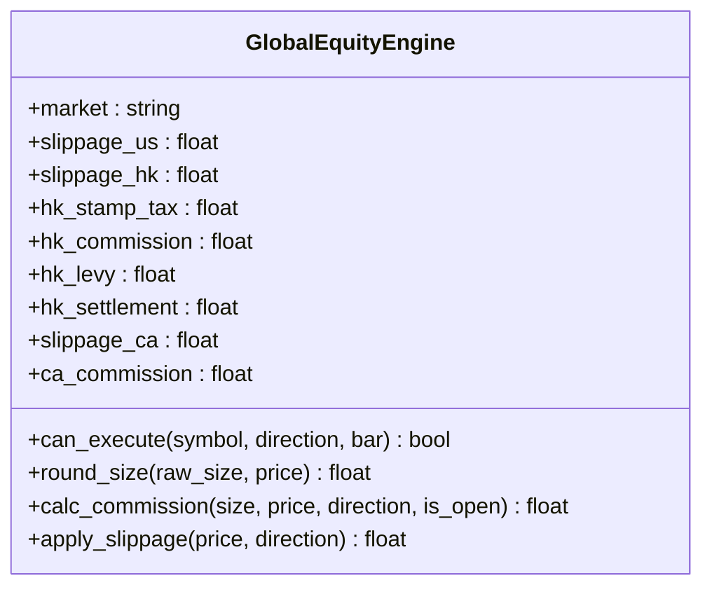
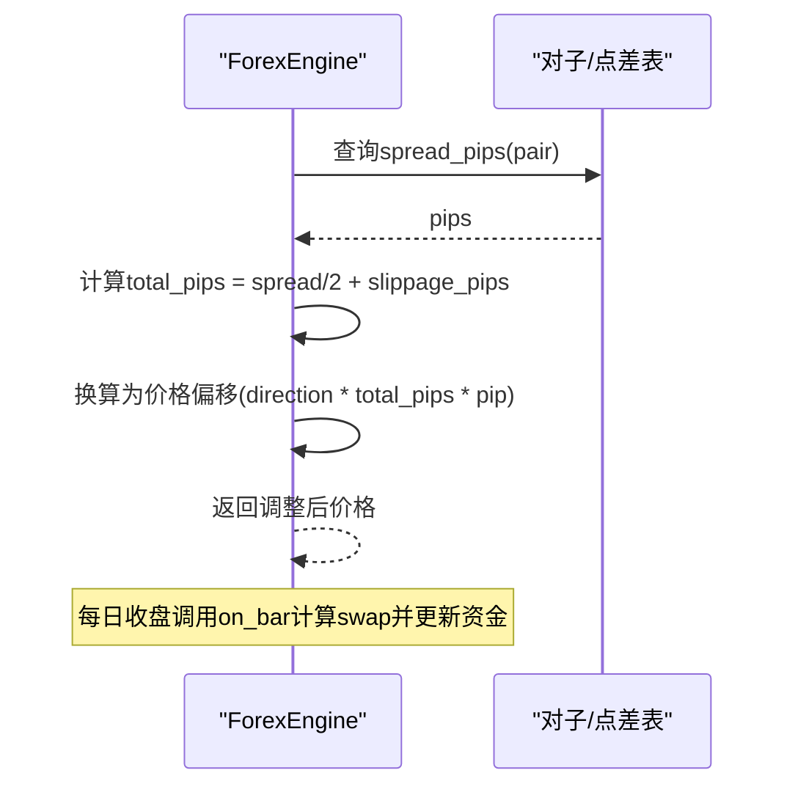
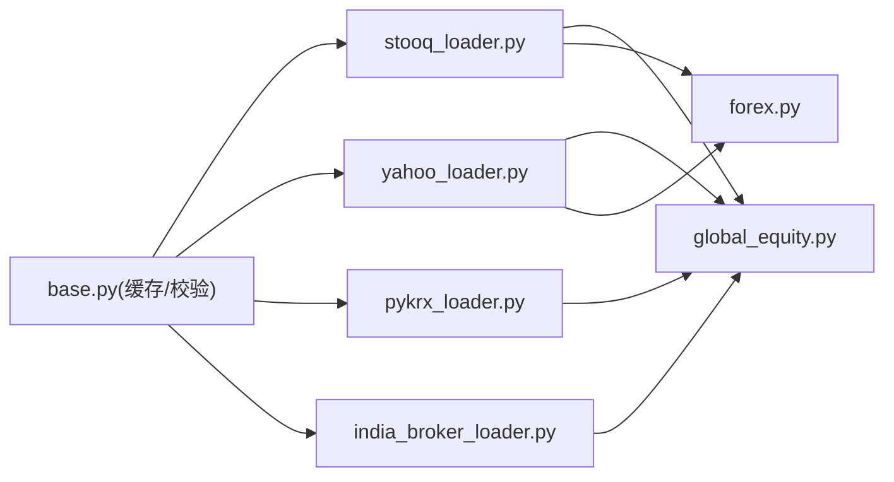

# 国际区域市场数据源

<cite>
**本文引用的文件**
- [stooq_loader.py](file://agent/backtest/loaders/stooq_loader.py)
- [yahoo_loader.py](file://agent/backtest/loaders/yahoo_loader.py)
- [pykrx_loader.py](file://agent/backtest/loaders/pykrx_loader.py)
- [india_broker_loader.py](file://agent/backtest/loaders/india_broker_loader.py)
- [base.py](file://agent/backtest/loaders/base.py)
- [global_equity.py](file://agent/backtest/engines/global_equity.py)
- [forex.py](file://agent/backtest/engines/forex.py)
</cite>

## 目录
1. [简介](#简介)
2. [项目结构](#项目结构)
3. [核心组件](#核心组件)
4. [架构总览](#架构总览)
5. [详细组件分析](#详细组件分析)
6. [依赖关系分析](#依赖关系分析)
7. [性能考虑](#性能考虑)
8. [故障排查指南](#故障排查指南)
9. [结论](#结论)
10. [附录](#附录)

## 简介
本文件面向 Vibe-Trading 的国际区域市场数据源，重点说明 Stooq、Yahoo Finance、KRX（韩国交易所）以及印度券商历史数据桥接的集成实现与多市场支持。文档覆盖不同国家/地区市场的特殊处理：时区与交易日历对齐、货币与汇率相关成本建模、交易规则差异（涨跌停、最小变动价位、手数/碎股）、数据格式标准化与本地化适配；并给出多市场投资组合构建、跨区域资产配置方法、汇率风险管理、跨境交易成本计算与税务考量、数据质量验证、异常值检测与缺失数据填充策略，以及国际化部署最佳实践与性能优化建议。

## 项目结构
围绕“数据加载器 + 回测引擎”的分层设计：
- 数据加载器：按市场/来源提供统一的 OHLCV 接口，负责协议适配、字段映射、时间索引规范化、限流与缓存。
- 回测引擎：封装各市场交易规则（佣金、滑点、手数/碎股、价格最小变动单位、隔夜利息等），在统一执行循环中运行策略。



图表来源
- [stooq_loader.py:74-162](file://agent/backtest/loaders/stooq_loader.py#L74-L162)
- [yahoo_loader.py:173-270](file://agent/backtest/loaders/yahoo_loader.py#L173-L270)
- [pykrx_loader.py:76-164](file://agent/backtest/loaders/pykrx_loader.py#L76-L164)
- [india_broker_loader.py:118-194](file://agent/backtest/loaders/india_broker_loader.py#L118-L194)
- [base.py:240-439](file://agent/backtest/loaders/base.py#L240-L439)
- [global_equity.py:33-124](file://agent/backtest/engines/global_equity.py#L33-L124)
- [forex.py:56-137](file://agent/backtest/engines/forex.py#L56-L137)

章节来源
- [stooq_loader.py:1-199](file://agent/backtest/loaders/stooq_loader.py#L1-L199)
- [yahoo_loader.py:1-271](file://agent/backtest/loaders/yahoo_loader.py#L1-L271)
- [pykrx_loader.py:1-194](file://agent/backtest/loaders/pykrx_loader.py#L1-L194)
- [india_broker_loader.py:1-195](file://agent/backtest/loaders/india_broker_loader.py#L1-L195)
- [base.py:1-645](file://agent/backtest/loaders/base.py#L1-L645)
- [global_equity.py:1-124](file://agent/backtest/engines/global_equity.py#L1-L124)
- [forex.py:1-137](file://agent/backtest/engines/forex.py#L1-L137)

## 核心组件
- 统一加载器协议与缓存
  - 所有加载器实现统一接口：name/markets/requires_auth/is_available/fetch，返回 {symbol: DataFrame(trade_date, open, high, low, close, volume)}。
  - 可选本地 Parquet 缓存，基于内容寻址键（source/symbol/timeframe/start/end/fields），仅对已结算日期范围写入，避免“进行中”行被固化。
  - 提供 OHLC 不变量校验工具，可配置是否允许非正价格（如欧洲电力负价）。
- 多市场加载器
  - Stooq：免费 US 股票 EOD CSV，无鉴权，严格日频，失败不中断批次。
  - Yahoo：覆盖 US/HK/India/Korea/Canada 及期货/外汇后缀，统一区间映射与日内/日频时间索引归一化。
  - KRX：通过 pykrx 获取 KOSPI/KOSDAQ 日线，列名本地化到标准字段，显式使用复权数据。
  - 印度券商桥接：优先 Shoonya，其次 Dhan，将历史 K 线转换为标准帧并按窗口裁剪。
- 多市场回测引擎
  - 全球股票引擎：US/HK/CA 差异化手续费、滑点、手数/碎股、加拿大最小变动价位网格。
  - 外汇引擎：点差/滑点、标准手、隔夜利息、杠杆与合约乘数。

章节来源
- [base.py:27-119](file://agent/backtest/loaders/base.py#L27-L119)
- [base.py:240-439](file://agent/backtest/loaders/base.py#L240-L439)
- [stooq_loader.py:74-162](file://agent/backtest/loaders/stooq_loader.py#L74-L162)
- [yahoo_loader.py:173-270](file://agent/backtest/loaders/yahoo_loader.py#L173-L270)
- [pykrx_loader.py:76-164](file://agent/backtest/loaders/pykrx_loader.py#L76-L164)
- [india_broker_loader.py:118-194](file://agent/backtest/loaders/india_broker_loader.py#L118-L194)
- [global_equity.py:33-124](file://agent/backtest/engines/global_equity.py#L33-L124)
- [forex.py:56-137](file://agent/backtest/engines/forex.py#L56-L137)

## 架构总览
下图展示从加载器到引擎的数据流与规则应用路径。



图表来源
- [base.py:401-439](file://agent/backtest/loaders/base.py#L401-L439)
- [stooq_loader.py:89-162](file://agent/backtest/loaders/stooq_loader.py#L89-L162)
- [yahoo_loader.py:191-270](file://agent/backtest/loaders/yahoo_loader.py#L191-L270)
- [pykrx_loader.py:92-164](file://agent/backtest/loaders/pykrx_loader.py#L92-L164)
- [india_broker_loader.py:134-194](file://agent/backtest/loaders/india_broker_loader.py#L134-L194)
- [global_equity.py:65-124](file://agent/backtest/engines/global_equity.py#L65-L124)
- [forex.py:76-137](file://agent/backtest/engines/forex.py#L76-L137)

## 详细组件分析

### Stooq 加载器（美国股票 EOD）
- 功能要点
  - 免费、无需鉴权的 HTTP CSV 下载，按主机桶限速。
  - 仅支持日频；其他周期直接返回空以触发回退链。
  - 未知符号或空窗返回“N/D”，解析为无数据，不中断批次。
  - 输出列标准化为 open/high/low/close/volume，索引为 trade_date。
- 关键流程
  - 参数校验 → 周期检查 → 逐个代码请求 → 缓存包装 → CSV 解析 → 去重/排序 → 数值转换。



图表来源
- [stooq_loader.py:89-162](file://agent/backtest/loaders/stooq_loader.py#L89-L162)
- [stooq_loader.py:165-199](file://agent/backtest/loaders/stooq_loader.py#L165-L199)

章节来源
- [stooq_loader.py:1-199](file://agent/backtest/loaders/stooq_loader.py#L1-L199)

### Yahoo 加载器（全球股票/期货/外汇）
- 功能要点
  - 覆盖 US/HK/India/Korea/Canada 及 Yahoo 自有期货/外汇后缀。
  - 统一区间映射（1D/1H/4H→1h/1W/1M），日内/日频时间索引归一化。
  - 通过公共图表端点拉取，过程级限速与会话复用。
- 关键流程
  - 符号支持判断 → 区间映射 → 时间窗口计算 → 拉取 → 构造 DataFrame → 裁剪至闭区间 → 标准化。

```mermaid
sequenceDiagram
participant L as "Yahoo 加载器"
participant H as "HTTP客户端"
L->>L : 校验符号/区间映射
L->>H : get_chart(code, interval, period1, period2)
H-->>L : rows[{trade_date(epoch), OHLCV}]
L->>L : 转DatetimeIndex(日内保留真实时间; 日频归一到午夜)
L->>L : 裁剪[start,end]并标准化列
L-->>L : 返回DataFrame或None
```

图表来源
- [yahoo_loader.py:44-73](file://agent/backtest/loaders/yahoo_loader.py#L44-L73)
- [yahoo_loader.py:125-170](file://agent/backtest/loaders/yahoo_loader.py#L125-L170)
- [yahoo_loader.py:191-270](file://agent/backtest/loaders/yahoo_loader.py#L191-L270)

章节来源
- [yahoo_loader.py:1-271](file://agent/backtest/loaders/yahoo_loader.py#L1-L271)

### KRX 加载器（韩国 KOSPI/KOSDAQ）
- 功能要点
  - 通过 pykrx 获取日线，显式使用复权数据（Naver 后端调整）。
  - 韩文列名映射为标准字段；每日请求间隔默认≥1s，走共享 HostThrottle。
  - 仅支持日频；其他周期拒绝并返回空以触发回退。
- 关键流程
  - 可用性检查 → 周期校验 → 限流等待 → 拉取 → 列名映射 → 索引/类型标准化。



图表来源
- [pykrx_loader.py:76-164](file://agent/backtest/loaders/pykrx_loader.py#L76-L164)
- [pykrx_loader.py:167-194](file://agent/backtest/loaders/pykrx_loader.py#L167-L194)

章节来源
- [pykrx_loader.py:1-194](file://agent/backtest/loaders/pykrx_loader.py#L1-L194)

### 印度券商历史桥接（Shoonya/Dhan）
- 功能要点
  - 优先 Shoonya，其次 Dhan；仅在 SDK 可用且已配置时可用。
  - 将历史 K 线转换为标准帧，按业务日数量估算 limit 并裁剪至目标窗口。
  - 兼容两种 API 签名（exchange 参数存在与否）。
- 关键流程
  - 解析基础代码与交易所 → 选择 period → 拉取 bars → 时间戳归一化 → 裁剪 → 标准化。



图表来源
- [india_broker_loader.py:50-86](file://agent/backtest/loaders/india_broker_loader.py#L50-L86)
- [india_broker_loader.py:89-115](file://agent/backtest/loaders/india_broker_loader.py#L89-L115)
- [india_broker_loader.py:134-194](file://agent/backtest/loaders/india_broker_loader.py#L134-L194)

章节来源
- [india_broker_loader.py:1-195](file://agent/backtest/loaders/india_broker_loader.py#L1-L195)

### 加载器基类与数据质量
- 数据质量与校验
  - validate_ohlc：强制高/低与开/收的合理关系，可配置是否允许非正价格（例如欧洲电力负价场景）。
  - 批量失败隔离：任一代码失败不影响整体批次。
- 本地缓存
  - 基于内容哈希的 key，仅对已结算日期范围落盘；读写失败均不阻断主流程。
  - 元数据记录索引列名/类型，保证往返一致性。



图表来源
- [base.py:50-119](file://agent/backtest/loaders/base.py#L50-L119)

章节来源
- [base.py:1-645](file://agent/backtest/loaders/base.py#L1-L645)

### 全球股票引擎（US/HK/CA）
- 市场规则差异
  - US：零佣金、碎股、低滑点。
  - HK：印花税、附加费、结算费、整手（简化为100股）与更高滑点。
  - CA：整手、官方最小变动价位网格（$0.005/$0.01），佣金由配置驱动。
- 执行要点
  - round_size：按市场进行手数/碎股舍入。
  - calc_commission：按市场累加费用项。
  - apply_slippage：按市场滑点与价格网格修正成交价。



图表来源
- [global_equity.py:33-124](file://agent/backtest/engines/global_equity.py#L33-L124)

章节来源
- [global_equity.py:1-124](file://agent/backtest/engines/global_equity.py#L1-L124)

### 外汇引擎（Forex）
- 市场规则
  - 24x5 交易、点差替代显式佣金、标准手 100,000 基础货币单位、隔夜利息。
  - 点差按对子预设或全局覆盖，额外滑点以 pip 为单位叠加。
- 执行要点
  - apply_slippage_for_symbol：根据对子确定 pip 大小，叠加半点差与滑点。
  - on_bar：在每个交易日末计算并计入隔夜利息。



图表来源
- [forex.py:23-37](file://agent/backtest/engines/forex.py#L23-L37)
- [forex.py:98-132](file://agent/backtest/engines/forex.py#L98-L132)

章节来源
- [forex.py:1-137](file://agent/backtest/engines/forex.py#L1-L137)

## 依赖关系分析
- 加载器之间相互独立，通过统一协议接入回测框架；共享 base.py 的缓存与校验能力。
- 引擎与加载器解耦：引擎只消费标准化的 OHLCV 与信号，不关心数据来源。
- 外部依赖
  - Stooq：HTTP CSV 端点，受 IP 限速。
  - Yahoo：公共图表端点，需进程级限速与会话复用。
  - pykrx：韩国交易所数据，自带 HTTP 会话，需模块内节流。
  - 印度券商 SDK：Shoonya/Dhan，按需导入，不可用时自动降级。



图表来源
- [base.py:240-439](file://agent/backtest/loaders/base.py#L240-L439)
- [stooq_loader.py:74-162](file://agent/backtest/loaders/stooq_loader.py#L74-L162)
- [yahoo_loader.py:173-270](file://agent/backtest/loaders/yahoo_loader.py#L173-L270)
- [pykrx_loader.py:76-164](file://agent/backtest/loaders/pykrx_loader.py#L76-L164)
- [india_broker_loader.py:118-194](file://agent/backtest/loaders/india_broker_loader.py#L118-L194)
- [global_equity.py:33-124](file://agent/backtest/engines/global_equity.py#L33-L124)
- [forex.py:56-137](file://agent/backtest/engines/forex.py#L56-L137)

章节来源
- [base.py:1-645](file://agent/backtest/loaders/base.py#L1-L645)
- [stooq_loader.py:1-199](file://agent/backtest/loaders/stooq_loader.py#L1-L199)
- [yahoo_loader.py:1-271](file://agent/backtest/loaders/yahoo_loader.py#L1-L271)
- [pykrx_loader.py:1-194](file://agent/backtest/loaders/pykrx_loader.py#L1-L194)
- [india_broker_loader.py:1-195](file://agent/backtest/loaders/india_broker_loader.py#L1-L195)
- [global_equity.py:1-124](file://agent/backtest/engines/global_equity.py#L1-L124)
- [forex.py:1-137](file://agent/backtest/engines/forex.py#L1-L137)

## 性能考虑
- 网络与限流
  - Stooq/Yahoo：通过共享 HTTP 客户端与主机桶限速，避免 IP 封禁。
  - pykrx：模块内 HostThrottle，默认≥1s 间隔。
  - 印度券商：按窗口估算 limit，减少不必要请求。
- 缓存
  - 启用本地 Parquet 缓存，仅对已结算日期范围落盘，显著降低重复拉取开销。
  - 读写失败不阻塞主流程，具备容错性。
- 数据处理
  - 统一时间索引与列名，减少后续对齐成本。
  - 批量失败隔离，单代码异常不影响整体吞吐。
- 引擎侧
  - 全球股票引擎针对加拿大市场的最小变动价位网格进行价格修正，避免无效成交。
  - 外汇引擎按对子设置点差，避免过度滑点假设。

[本节为通用性能建议，不直接分析具体文件]

## 故障排查指南
- 常见错误与定位
  - 日期范围非法：validate_date_range 会抛出 ValueError，检查起止日期格式与顺序。
  - 区间不被支持：Stooq/pykrx/印度桥接对非日频直接返回空，应检查 interval 参数。
  - 无数据或“N/D”：Stooq 未知符号或空窗返回 None，属于正常分支，不会中断批次。
  - 数据质量：validate_ohlc 可配置 drop/warn/raise，用于识别高/低/开/收不一致或非正价格。
- 缓存问题
  - 若怀疑缓存导致旧数据，确认 end_date 是否已结算；未结算范围不会写入缓存。
  - 缓存读/写失败均会被忽略并回退到在线拉取。
- 限流与超时
  - 外部源可能因限速/网络抖动失败，建议使用重试预算与退避（base.py 提供通用工具）。
  - 印度桥接兼容两种 API 签名，遇到 TypeError 会尝试另一种签名。

章节来源
- [base.py:31-47](file://agent/backtest/loaders/base.py#L31-L47)
- [base.py:50-119](file://agent/backtest/loaders/base.py#L50-L119)
- [base.py:163-236](file://agent/backtest/loaders/base.py#L163-L236)
- [base.py:328-439](file://agent/backtest/loaders/base.py#L328-L439)
- [stooq_loader.py:117-143](file://agent/backtest/loaders/stooq_loader.py#L117-L143)
- [pykrx_loader.py:118-144](file://agent/backtest/loaders/pykrx_loader.py#L118-L144)
- [india_broker_loader.py:153-187](file://agent/backtest/loaders/india_broker_loader.py#L153-L187)

## 结论
本项目通过统一的加载器协议与回测引擎，实现了 Stooq、Yahoo、KRX 与印度券商历史数据的跨市场整合。各加载器负责数据格式标准化、时间索引对齐与本地化适配；引擎则封装各国/地区的交易规则与成本模型。结合内容寻址缓存、批量失败隔离与数据质量校验，系统在稳定性与性能上具备良好表现。对于国际化部署，建议遵循本文的最佳实践与性能优化建议，确保在多市场环境下的一致性与可靠性。

[本节为总结性内容，不直接分析具体文件]

## 附录

### 多市场投资组合构建与跨区域资产配置
- 数据对齐
  - 使用统一 trade_date 索引与 ffill 限制，处理不同市场的休市与停牌差异。
- 权重与约束
  - 在统一日期索引上计算收益矩阵，结合风险平价/均值方差等优化器生成目标权重。
- 成本与流动性
  - 针对不同市场应用相应滑点、佣金与最小变动价位修正，确保回测贴近实盘。

[本节为概念性指导，不直接分析具体文件]

### 汇率风险管理、跨境交易成本与税务
- 汇率风险
  - 外汇对子采用点差与滑点建模；多币种组合需关注交叉对的报价与结算货币。
- 跨境成本
  - 港股印花税与附加费、加拿大最小变动价位网格、美股碎股与低滑点均在引擎中体现。
- 税务
  - 不同市场对资本利得税、预扣税与结算费用的处理差异应在策略层面显式建模。

[本节为概念性指导，不直接分析具体文件]

### 数据质量验证、异常值检测与缺失数据填充
- 验证
  - 使用 validate_ohlc 强制结构一致性与价格合理性；可按市场允许负价。
- 异常值
  - 对极端跳空或异常波动进行标记与剔除，避免污染因子与指标。
- 缺失填充
  - 使用 ffill 限制以避免长停牌导致的信号失真；跨市场适当放宽限制。

[本节为概念性指导，不直接分析具体文件]

### 国际化部署最佳实践与性能优化
- 部署
  - 明确各市场数据源的可用性开关与优先级；对可选依赖（如 pykrx、券商 SDK）做优雅降级。
- 性能
  - 启用本地缓存；合理设置最小请求间隔；批量拉取时控制并发与超时预算。
- 可观测性
  - 记录各来源命中率、失败率与延迟；对异常数据集中告警。

[本节为概念性指导，不直接分析具体文件]