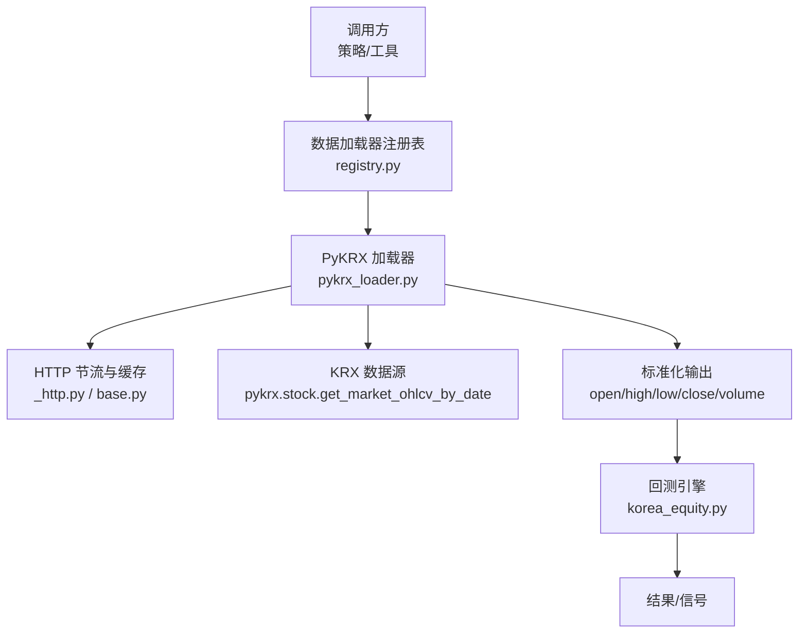
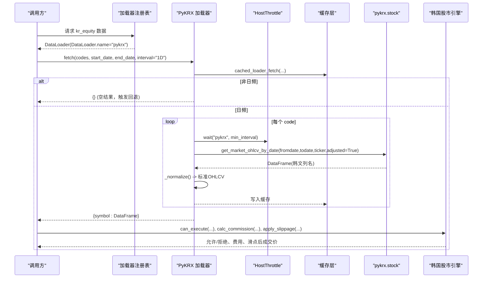
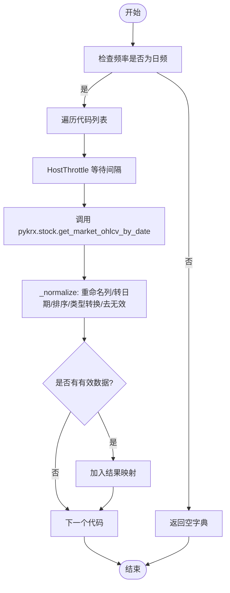
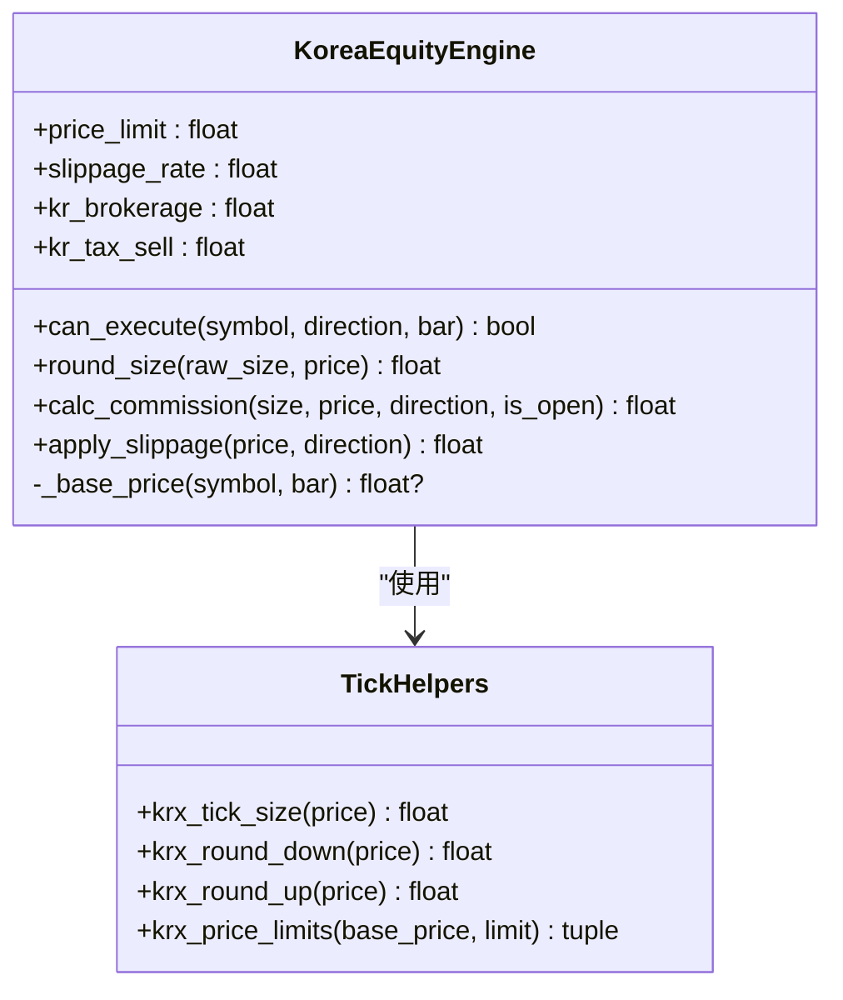
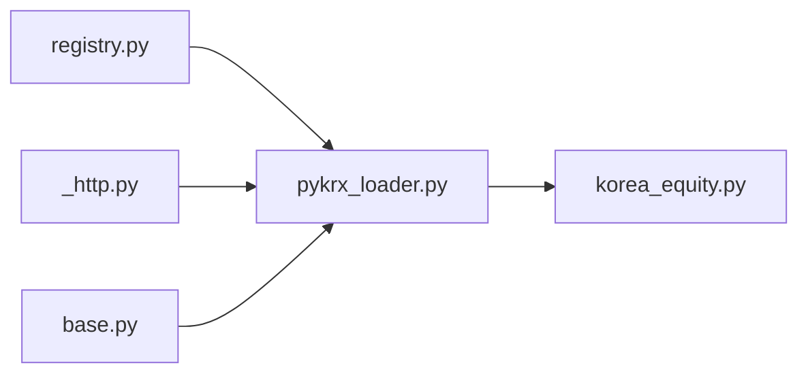

# 韩国股市数据源

<cite>
**本文引用的文件**
- [pykrx_loader.py](file://agent/backtest/loaders/pykrx_loader.py)
- [korea_equity.py](file://agent/backtest/engines/korea_equity.py)
- [base.py](file://agent/backtest/loaders/base.py)
- [_http.py](file://agent/backtest/loaders/_http.py)
- [registry.py](file://agent/backtest/loaders/registry.py)
- [test_pykrx_loader.py](file://agent/tests/test_pykrx_loader.py)
- [test_korea_equity_engine.py](file://agent/tests/test_korea_equity_engine.py)
- [market_data_tool.py](file://agent/src/tools/market_data_tool.py)
</cite>

## 目录
1. [简介](#简介)
2. [项目结构](#项目结构)
3. [核心组件](#核心组件)
4. [架构总览](#架构总览)
5. [详细组件分析](#详细组件分析)
6. [依赖关系分析](#依赖关系分析)
7. [性能考量](#性能考量)
8. [故障排查指南](#故障排查指南)
9. [结论](#结论)
10. [附录](#附录)

## 简介
本文件面向 Vibe-Trading 的韩国股市数据源，聚焦 PyKRX 库的集成实现与韩国交易所（KRX）数据获取。内容涵盖：
- 韩元计价、交易时间差异、市场休市规则等韩国市场的特殊性
- 数据格式转换：日期格式、股票代码规范、价格单位处理
- KOSPI 与 KOSDAQ 的区别与选择逻辑
- 历史数据下载、实时数据获取与批量数据处理方法
- 常见错误处理：网络连接超时、数据缺失、API 限流等
- 性能优化建议与最佳实践

## 项目结构
围绕韩国股市的数据链路主要由两部分构成：
- 数据加载器：通过 PyKRX 拉取 KRX 日频 OHLCV 数据，并进行标准化
- 回测引擎：封装韩国市场的交易规则（涨跌停、最小变动价位、手续费、滑点等）

图表来源
- [registry.py](file://agent/backtest/loaders/registry.py)
- [pykrx_loader.py:76-144](file://agent/backtest/loaders/pykrx_loader.py#L76-L144)
- [_http.py](file://agent/backtest/loaders/_http.py)
- [base.py:31-48](file://agent/backtest/loaders/base.py#L31-L48)
- [korea_equity.py:139-174](file://agent/backtest/engines/korea_equity.py#L139-L174)

章节来源
- [pykrx_loader.py:1-30](file://agent/backtest/loaders/pykrx_loader.py#L1-L30)
- [korea_equity.py:1-48](file://agent/backtest/engines/korea_equity.py#L1-L48)

## 核心组件
- PyKRX 加载器（DataLoader）
  - 支持市场：kr_equity
  - 仅支持日频（1D/d/day/daily），其他周期直接返回空以让上层回退到其他数据源
  - 自动将 Yahoo 风格代码（如 005930.KS、247540.KQ）映射为 pykrx 所需的 6 位纯数字代码
  - 使用 HostThrottle 控制请求间隔，默认至少 1 秒，避免对上游造成压力
  - 数据规范化：将韩文列名转换为 open/high/low/close/volume，并排序、类型转换、去无效行
- 韩国股市回测引擎（KoreaEquityEngine）
  - 仅做多（拒绝做空），因为 KRX 融券受限于借券与上涨规则，日线级别无法准确建模
  - 涨跌停：±30% 基于基准价（通常为前收盘价），按 KRX 报价单位进行截断与对齐
  - 最小变动价位（Tick）：统一表格适用于 KOSPI/KOSDAQ/KONEX，不同价格区间对应不同 tick
  - 成本栈：双边佣金 + 卖出侧证券交易税；可配置
  - 滑点：按方向向上/向下对齐到有效 tick，避免落在无效价位
  - 手数：1 股为单位

章节来源
- [pykrx_loader.py:76-144](file://agent/backtest/loaders/pykrx_loader.py#L76-L144)
- [pykrx_loader.py:167-194](file://agent/backtest/loaders/pykrx_loader.py#L167-L194)
- [korea_equity.py:61-136](file://agent/backtest/engines/korea_equity.py#L61-L136)
- [korea_equity.py:139-174](file://agent/backtest/engines/korea_equity.py#L139-L174)
- [korea_equity.py:175-228](file://agent/backtest/engines/korea_equity.py#L175-L228)
- [korea_equity.py:269-317](file://agent/backtest/engines/korea_equity.py#L269-L317)

## 架构总览
下图展示从调用方到 KRX 数据源再到回测引擎的完整流程，包括节流、缓存、标准化与执行规则校验。

图表来源
- [pykrx_loader.py:92-164](file://agent/backtest/loaders/pykrx_loader.py#L92-L164)
- [pykrx_loader.py:167-194](file://agent/backtest/loaders/pykrx_loader.py#L167-L194)
- [korea_equity.py:175-228](file://agent/backtest/engines/korea_equity.py#L175-L228)
- [korea_equity.py:269-317](file://agent/backtest/engines/korea_equity.py#L269-L317)

## 详细组件分析

### PyKRX 加载器（数据获取与标准化）
- 符号映射
  - 输入采用 Yahoo 风格后缀（.KS/.KQ），内部剥离后缀得到 6 位纯数字代码
  - 大小写与空白会被清理
- 频率限制
  - 仅接受日频（1D/d/day/daily），其他频率返回空字典，以便上层回退链选择其他数据源
  - 使用 HostThrottle 保证每次请求之间至少间隔指定秒数（默认 1 秒），可通过环境变量覆盖
- 数据获取
  - 调用 pykrx.stock.get_market_ohlcv_by_date，传入起止日期（YYYYMMDD）、6 位代码与 adjusted=True
  - 注意：adjusted=True 走的是 Naver 提供的复权路径，并非原始 KRX 打印值，文档中明确标注数据来源属性
- 数据标准化
  - 将韩文列名（시가/고가/저가/종가/거래량）映射为标准列（open/high/low/close/volume）
  - 索引转为 datetime 并命名为 trade_date，按时间升序排序
  - 数值列强制转换为 float，去除无效行（NaN 或价格全空）
  - 若最终无可用数据则返回 None，不会中断批量请求

图表来源
- [pykrx_loader.py:118-164](file://agent/backtest/loaders/pykrx_loader.py#L118-L164)
- [pykrx_loader.py:167-194](file://agent/backtest/loaders/pykrx_loader.py#L167-L194)

章节来源
- [pykrx_loader.py:66-73](file://agent/backtest/loaders/pykrx_loader.py#L66-L73)
- [pykrx_loader.py:92-144](file://agent/backtest/loaders/pykrx_loader.py#L92-L144)
- [pykrx_loader.py:146-164](file://agent/backtest/loaders/pykrx_loader.py#L146-L164)
- [pykrx_loader.py:167-194](file://agent/backtest/loaders/pykrx_loader.py#L167-L194)

### 韩国股市回测引擎（交易规则与成本）
- 只做多：构造时若 allow_short 为真则抛出异常，防止在日线级别错误模拟融券与上涨规则
- 涨跌停模型
  - 基准价优先来自 bar 中的 pre_close，否则从引擎维护的 close 面板取前一交易日收盘价
  - 涨跌停幅度 ±30%，按 KRX 报价单位进行截断与对齐，确保上下限均为有效 tick
  - 买入成交价为当前 bar 的 open 加上滑点；若触及上限则拒绝买入
  - 卖出成交价为当前 bar 的 open 减去滑点；若触及下限则拒绝卖出
- 最小变动价位（Tick）
  - 统一表格适用于 KOSPI/KOSDAQ/KONEX，不同价格区间对应不同 tick
  - 提供向下截断与向上对齐函数，确保所有价格均落在有效网格上
- 成本栈
  - 双边佣金（默认 0.015%）
  - 卖出侧证券交易税（默认 0.20%），可根据市场调整（例如 KONEX 名称可使用 0.10%）
- 滑点处理
  - 买入向上对齐到下一有效 tick，卖出向下对齐到上一有效 tick
  - 保证滑点后的价格仍为合法 KRW 价格且不低于最小 tick

图表来源
- [korea_equity.py:61-136](file://agent/backtest/engines/korea_equity.py#L61-L136)
- [korea_equity.py:139-174](file://agent/backtest/engines/korea_equity.py#L139-L174)
- [korea_equity.py:175-228](file://agent/backtest/engines/korea_equity.py#L175-L228)
- [korea_equity.py:269-317](file://agent/backtest/engines/korea_equity.py#L269-L317)

章节来源
- [korea_equity.py:139-174](file://agent/backtest/engines/korea_equity.py#L139-L174)
- [korea_equity.py:175-228](file://agent/backtest/engines/korea_equity.py#L175-L228)
- [korea_equity.py:230-268](file://agent/backtest/engines/korea_equity.py#L230-L268)
- [korea_equity.py:269-317](file://agent/backtest/engines/korea_equity.py#L269-L317)

### 数据格式转换与规范
- 日期格式
  - 输入：YYYY-MM-DD（起始与结束）
  - 传递给 pykrx：YYYYMMDD
  - 输出索引：datetime，命名为 trade_date，升序排列
- 股票代码规范
  - 输入：Yahoo 风格（如 005930.KS、247540.KQ）
  - 内部：剥离后缀得到 6 位纯数字代码
  - 市场识别：.KS 表示 KOSPI，.KQ 表示 KOSDAQ；加载器不区分市场，统一用 6 位代码
- 价格单位与网格
  - 价格单位为韩元（KRW），整数为主，存在粗粒度 tick
  - 所有价格需对齐到 KRX 报价单位网格，避免非法价位
- 字段映射
  - 韩文列名 → 标准列名：open/high/low/close/volume
  - 额外列（如涨跌幅）会被丢弃

章节来源
- [pykrx_loader.py:45-52](file://agent/backtest/loaders/pykrx_loader.py#L45-L52)
- [pykrx_loader.py:66-68](file://agent/backtest/loaders/pykrx_loader.py#L66-L68)
- [pykrx_loader.py:155-164](file://agent/backtest/loaders/pykrx_loader.py#L155-L164)
- [pykrx_loader.py:167-194](file://agent/backtest/loaders/pykrx_loader.py#L167-L194)
- [korea_equity.py:61-136](file://agent/backtest/engines/korea_equity.py#L61-L136)

### KOSPI 与 KOSDAQ 的区别与选择逻辑
- 区别
  - 代码后缀不同：.KS 为 KOSPI，.KQ 为 KOSDAQ
  - 交易规则与税费在不同时期可能不同，但自 2023-01-25 起报价单位表格已统一
- 选择逻辑
  - 加载器不区分市场，统一使用 6 位代码拉取数据
  - 回测引擎统一应用 KRX 规则（涨跌停、tick、成本栈）
  - 如需针对特定市场调整税费，可在引擎配置中通过 kr_tax_sell 参数设置（例如 KONEX 名称使用 0.10%）

章节来源
- [korea_equity.py:22-41](file://agent/backtest/engines/korea_equity.py#L22-L41)
- [pykrx_loader.py:15-23](file://agent/backtest/loaders/pykrx_loader.py#L15-L23)

### 历史数据下载、实时数据获取与批量处理
- 历史数据下载
  - 使用 DataLoader.fetch 传入 codes、start_date、end_date 与 interval="1D"
  - 支持批量 codes，单个失败不影响整体
  - 数据经缓存层存储，重复请求可直接命中
- 实时数据获取
  - 当前加载器仅提供日频 EOD 数据；实时分钟级数据需依赖其他数据源或连接器
  - 若请求非日频，加载器返回空字典，由上层回退链选择其他数据源
- 批量处理
  - 循环遍历 codes，逐个请求并缓存结果
  - 使用 HostThrottle 控制请求间隔，避免对上游造成压力

章节来源
- [pykrx_loader.py:92-144](file://agent/backtest/loaders/pykrx_loader.py#L92-L144)
- [pykrx_loader.py:146-164](file://agent/backtest/loaders/pykrx_loader.py#L146-L164)
- [base.py:31-48](file://agent/backtest/loaders/base.py#L31-L48)

## 依赖关系分析
- 加载器依赖
  - registry：注册 DataLoader，暴露 name 与 markets
  - _http：HostThrottle 用于跨进程/线程安全的请求间隔控制
  - base：日期范围校验、重试与预算工具、OHLC 校验
- 引擎依赖
  - base engine：通用回测框架接口
  - 数学工具：tick 计算、涨跌停计算、滑点与成本计算

图表来源
- [registry.py](file://agent/backtest/loaders/registry.py)
- [pykrx_loader.py:34-43](file://agent/backtest/loaders/pykrx_loader.py#L34-L43)
- [korea_equity.py:50-58](file://agent/backtest/engines/korea_equity.py#L50-L58)

章节来源
- [pykrx_loader.py:34-43](file://agent/backtest/loaders/pykrx_loader.py#L34-L43)
- [korea_equity.py:50-58](file://agent/backtest/engines/korea_equity.py#L50-L58)

## 性能考量
- 请求节流
  - 默认每请求间隔至少 1 秒，可通过环境变量 VIBE_TRADING_PYKRX_MIN_INTERVAL 调整
  - 使用 HostThrottle 保证并发安全，避免全局时间戳竞态
- 缓存
  - 使用 cached_loader_fetch 减少重复请求
  - 合理设置 start_date/end_date 范围，避免过大窗口导致多次网络往返
- 数据标准化
  - 批量转换与类型转换在本地完成，尽量降低后续处理开销
- 回测效率
  - 仅在需要时启用涨跌停检查；若无 pre_close 且无 prior close panel，会记录一次警告并跳过检查
  - 滑点与 tick 对齐计算简单高效，适合大规模回测

章节来源
- [pykrx_loader.py:25-30](file://agent/backtest/loaders/pykrx_loader.py#L25-L30)
- [pykrx_loader.py:58-63](file://agent/backtest/loaders/pykrx_loader.py#L58-L63)
- [korea_equity.py:205-216](file://agent/backtest/engines/korea_equity.py#L205-L216)

## 故障排查指南
- 网络连接超时
  - 使用 base 的重试与预算工具，设置合理的 deadline 与 backoff
  - 若频繁超时，考虑增大请求间隔或切换数据源
- 数据缺失
  - 若 pykrx 返回空或无效数据，加载器会跳过该 symbol 并继续处理其他代码
  - 检查日期范围是否覆盖交易时段，确认代码是否存在于 KRX
- API 限流
  - 遵守 pykrx 建议的请求间隔（≥1 秒），必要时调大环境变量
  - 观察 HostThrottle 的等待记录，确认是否被限流
- 涨跌停误判
  - 确认 pre_close 或 prior close panel 可用；否则涨跌停检查会降级并记录警告
  - 检查滑点设置是否导致成交价越过涨跌停边界
- 成本计算偏差
  - 核对 kr_brokerage 与 kr_tax_sell 是否符合当前政策（尤其是 KOSPI/KOSDAQ/KONEX 的差异）

章节来源
- [base.py:163-200](file://agent/backtest/loaders/base.py#L163-L200)
- [pykrx_loader.py:128-144](file://agent/backtest/loaders/pykrx_loader.py#L128-L144)
- [korea_equity.py:205-216](file://agent/backtest/engines/korea_equity.py#L205-L216)
- [korea_equity.py:273-296](file://agent/backtest/engines/korea_equity.py#L273-L296)

## 结论
Vibe-Trading 的韩国股市数据源通过 PyKRX 加载器与韩国股市回测引擎实现了端到端的日频数据获取与交易规则建模。其特点包括：
- 严格遵循 KRX 报价单位与涨跌停规则，确保回测结果的合理性
- 数据标准化与缓存机制提升性能与稳定性
- 灵活的节流与重试策略应对网络波动与 API 限流
- 明确的成本栈与滑点模型贴近真实交易环境

建议在生产环境中：
- 监控请求间隔与失败率，适时调整节流参数
- 定期核验税费与报价单位变化，保持回测准确性
- 结合其他数据源构建回退链，提高鲁棒性

## 附录
- 常用环境变量
  - VIBE_TRADING_PYKRX_MIN_INTERVAL：设置 PyKRX 请求最小间隔（秒）
- 工具入口
  - market_data_tool 支持 source=pykrx，用于拉取韩国 KRX 日频数据；当 pykrx 不可用时会自动回退至 yahoo/yfinance

章节来源
- [pykrx_loader.py:25-30](file://agent/backtest/loaders/pykrx_loader.py#L25-L30)
- [market_data_tool.py:51-79](file://agent/src/tools/market_data_tool.py#L51-L79)