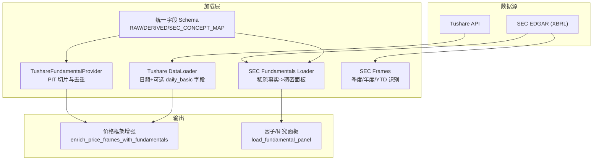
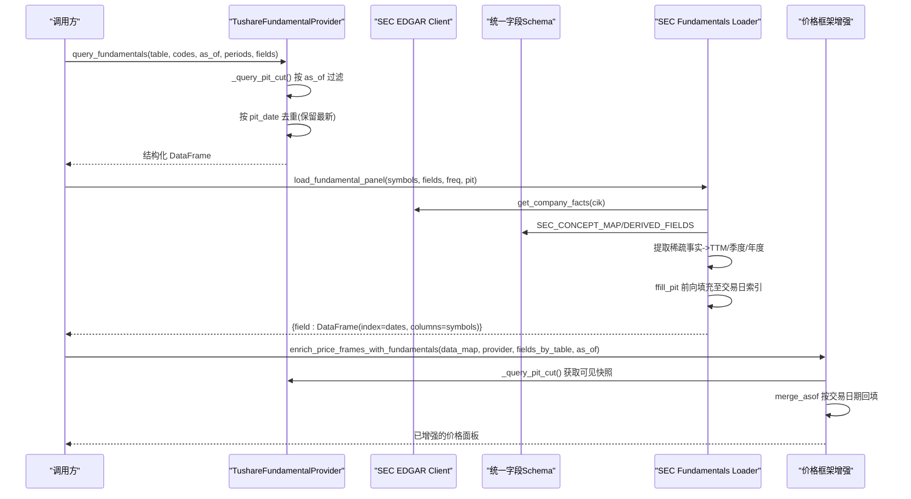
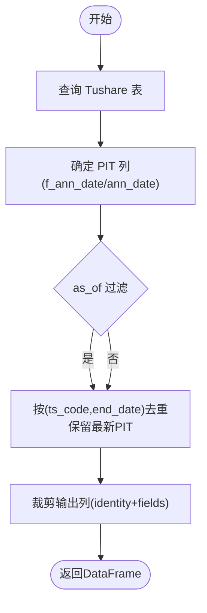
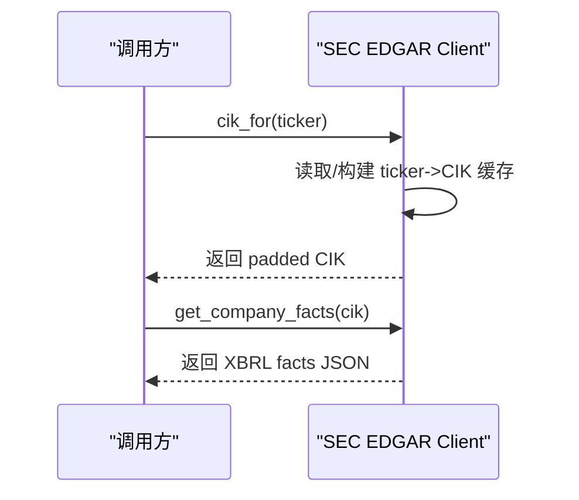
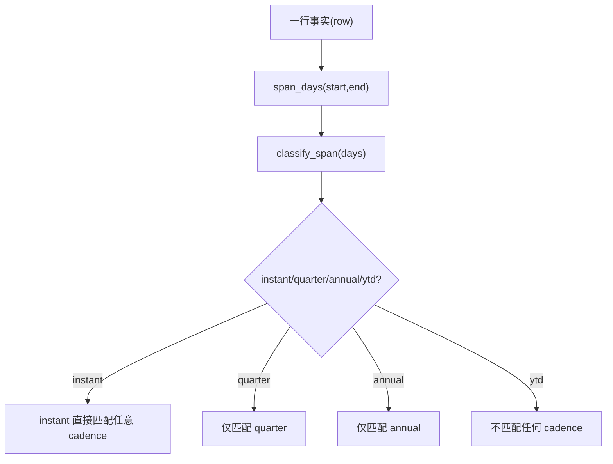
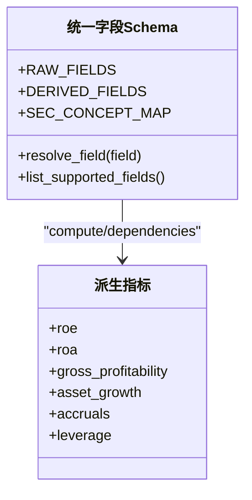
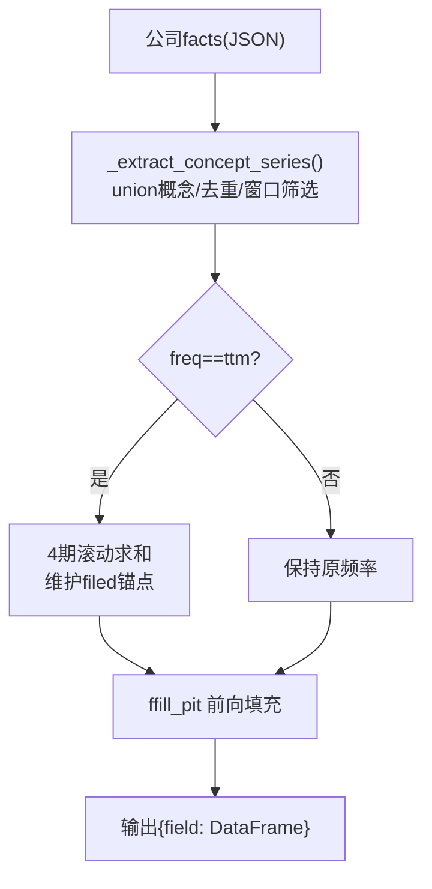
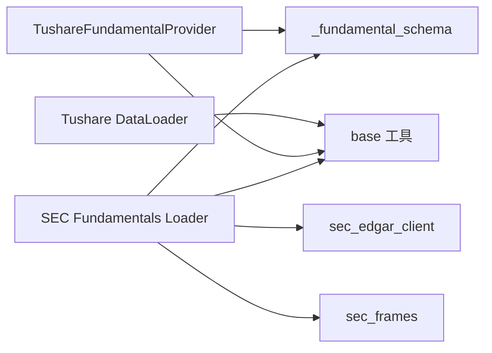

# 基本面数据源

<cite>
**本文引用的文件**
- [tushare_fundamentals.py](file://agent/backtest/loaders/tushare_fundamentals.py)
- [sec_edgar_client.py](file://agent/backtest/loaders/sec_edgar_client.py)
- [sec_frames.py](file://agent/backtest/loaders/sec_frames.py)
- [_fundamental_schema.py](file://agent/backtest/loaders/_fundamental_schema.py)
- [fundamentals_loader.py](file://agent/backtest/loaders/fundamentals_loader.py)
- [tushare.py](file://agent/backtest/loaders/tushare.py)
- [base.py](file://agent/backtest/loaders/base.py)
- [financial_rigor_tool.py](file://agent/src/tools/financial_rigor_tool.py)
</cite>

## 目录
1. [简介](#简介)
2. [项目结构](#项目结构)
3. [核心组件](#核心组件)
4. [架构总览](#架构总览)
5. [详细组件分析](#详细组件分析)
6. [依赖关系分析](#依赖关系分析)
7. [性能考虑](#性能考虑)
8. [故障排查指南](#故障排查指南)
9. [结论](#结论)
10. [附录](#附录)

## 简介
本文件面向 Vibe-Trading 的“基本面数据源集成”，聚焦以下目标：
- 财务报表数据、公司信息、SEC 文件的获取与处理机制
- Tushare 基本面数据接入、SEC EDGAR XBRL 解析与统一的基本面数据模型
- 财务指标计算、数据标准化与质量验证流程
- 财报季数据处理、异常值检测与缺失值填充策略
- 常见应用场景与最佳实践

## 项目结构
本项目在 backtest/loaders 下提供多源数据加载能力，其中与基本面相关的关键模块包括：
- SEC EDGAR 客户端与周期帧选择：sec_edgar_client.py、sec_frames.py
- 统一字段与派生指标定义：_fundamental_schema.py
- SEC 基本面面板构建：fundamentals_loader.py
- Tushare 基础行情与可选日度基本字段：tushare.py
- Tushare 专用 PIT 安全基本面表查询：tushare_fundamentals.py
- 通用校验、重试与缓存：base.py
- 精确算术与一致性校验工具：financial_rigor_tool.py

图表来源
- [tushare_fundamentals.py:110-179](file://agent/backtest/loaders/tushare_fundamentals.py#L110-L179)
- [sec_edgar_client.py:166-227](file://agent/backtest/loaders/sec_edgar_client.py#L166-L227)
- [sec_frames.py:42-129](file://agent/backtest/loaders/sec_frames.py#L42-L129)
- [_fundamental_schema.py:28-193](file://agent/backtest/loaders/_fundamental_schema.py#L28-L193)
- [fundamentals_loader.py:47-131](file://agent/backtest/loaders/fundamentals_loader.py#L47-L131)
- [tushare.py:139-202](file://agent/backtest/loaders/tushare.py#L139-L202)

章节来源
- [tushare_fundamentals.py:110-179](file://agent/backtest/loaders/tushare_fundamentals.py#L110-L179)
- [sec_edgar_client.py:166-227](file://agent/backtest/loaders/sec_edgar_client.py#L166-L227)
- [sec_frames.py:42-129](file://agent/backtest/loaders/sec_frames.py#L42-L129)
- [_fundamental_schema.py:28-193](file://agent/backtest/loaders/_fundamental_schema.py#L28-L193)
- [fundamentals_loader.py:47-131](file://agent/backtest/loaders/fundamentals_loader.py#L47-L131)
- [tushare.py:139-202](file://agent/backtest/loaders/tushare.py#L139-L202)

## 核心组件
- TushareFundamentalProvider：按 PIT（披露/生效日期）切分并去重，保证回测中不引入未来信息；支持 balancesheet、cashflow、fina_indicator、income 等表。
- SEC EDGAR Client：ticker->CIK 映射、submissions、companyfacts 拉取，带 UA 合规与节流。
- SEC Frames：基于 start/end 跨度识别 instant/quarter/annual/ytd，避免 YTD 与同 end 的真实季度混淆。
- 统一字段 Schema：RAW_FIELDS、DERIVED_FIELDS、SEC_CONCEPT_MAP，将不同来源统一到一致字段名与派生公式。
- SEC Fundamentals Loader：将稀疏 XBRL 事实转为按交易日对齐的稠密面板，支持 annual/quarterly/ttm，PIT-safe 前向填充。
- Tushare DataLoader：A 股/港股/指数/ETF 日频 OHLCV，并可合并 daily_basic 基本字段。
- base 工具：日期范围校验、OHLC 不变量校验、重试/预算、本地 Parquet 缓存。
- Financial Rigor Tool：精确小数校验（PE/PB/ROE/市值/贝诺福定律等），用于数据质量把关。

章节来源
- [tushare_fundamentals.py:110-179](file://agent/backtest/loaders/tushare_fundamentals.py#L110-L179)
- [sec_edgar_client.py:166-227](file://agent/backtest/loaders/sec_edgar_client.py#L166-L227)
- [sec_frames.py:42-129](file://agent/backtest/loaders/sec_frames.py#L42-L129)
- [_fundamental_schema.py:28-193](file://agent/backtest/loaders/_fundamental_schema.py#L28-L193)
- [fundamentals_loader.py:196-277](file://agent/backtest/loaders/fundamentals_loader.py#L196-L277)
- [tushare.py:139-202](file://agent/backtest/loaders/tushare.py#L139-L202)
- [base.py:31-119](file://agent/backtest/loaders/base.py#L31-L119)
- [financial_rigor_tool.py:143-200](file://agent/src/tools/financial_rigor_tool.py#L143-L200)

## 架构总览
下图展示从原始数据到统一面板与价格增强的端到端流程，强调 PIT 安全与跨源统一。

图表来源
- [tushare_fundamentals.py:136-179](file://agent/backtest/loaders/tushare_fundamentals.py#L136-L179)
- [tushare_fundamentals.py:264-379](file://agent/backtest/loaders/tushare_fundamentals.py#L264-L379)
- [sec_edgar_client.py:166-227](file://agent/backtest/loaders/sec_edgar_client.py#L166-L227)
- [fundamentals_loader.py:47-131](file://agent/backtest/loaders/fundamentals_loader.py#L47-L131)
- [fundamentals_loader.py:196-277](file://agent/backtest/loaders/fundamentals_loader.py#L196-L277)

## 详细组件分析

### Tushare 基本面数据（PIT 安全）
- 能力要点
  - 支持 balancesheet、cashflow、fina_indicator、income 四张表，每张表声明 point_in_time_column（优先 f_ann_date，否则 ann_date）。
  - query_fundamentals 在 as_of 之前进行可见性裁剪，并按 (ts_code, end_date) 去重，保留有效 PIT 日期最晚的一行（重述后覆盖）。
  - enrich_price_frames_with_fundamentals 将基本面快照以 table_field 前缀附加到每日价格框架，使用 merge_asof 实现按交易日向后回填，且对旧期重述不会导致回溯到更早报告期。
- 关键流程
  - 构造 PIT 列：优先 f_ann_date，若为空则回退 ann_date。
  - 排序与去重：稳定排序 + drop_duplicates(keep='last') 确保重述覆盖。
  - 输出列控制：identity 列 + 用户指定 fields。
- 适用场景
  - A 股/港股/指数等的日频回测中，需要按公告/生效时间逐步可见的财务指标（如 ROE、毛利率、EPS 等）。

图表来源
- [tushare_fundamentals.py:136-179](file://agent/backtest/loaders/tushare_fundamentals.py#L136-L179)
- [tushare_fundamentals.py:181-230](file://agent/backtest/loaders/tushare_fundamentals.py#L181-L230)

章节来源
- [tushare_fundamentals.py:110-179](file://agent/backtest/loaders/tushare_fundamentals.py#L110-L179)
- [tushare_fundamentals.py:264-379](file://agent/backtest/loaders/tushare_fundamentals.py#L264-L379)

### SEC EDGAR 公司信息与文件
- 能力要点
  - ticker->CIK 映射缓存（进程级），支持 AAPL.US 等后缀剥离。
  - submissions 与 companyfacts 拉取，强制 User-Agent 合规，按 host 桶限速（默认最小间隔 0.12s）。
  - CIK 规范化为 10 位零填充字符串。
- 适用场景
  - 美股公司基本面 XBRL 事实抽取、财报季筛选、TTM 滚动聚合。

图表来源
- [sec_edgar_client.py:118-163](file://agent/backtest/loaders/sec_edgar_client.py#L118-L163)
- [sec_edgar_client.py:166-227](file://agent/backtest/loaders/sec_edgar_client.py#L166-L227)

章节来源
- [sec_edgar_client.py:1-235](file://agent/backtest/loaders/sec_edgar_client.py#L1-L235)

### SEC 财报季识别与周期帧
- 能力要点
  - 通过 start/end 计算跨度天数，区分 instant/quarter/annual/ytd。
  - frame_key 以 (start, end) 作为唯一标识，避免 YTD 与真实季度在同一 end 冲突。
  - matches_cadence 按 period 过滤出合适的观测。
- 适用场景
  - 从 companyfacts 中精准挑选季度或年度报表，避免重复/错误聚合。

图表来源
- [sec_frames.py:42-129](file://agent/backtest/loaders/sec_frames.py#L42-L129)

章节来源
- [sec_frames.py:1-129](file://agent/backtest/loaders/sec_frames.py#L1-L129)

### 统一基本面数据模型（RAW/DERIVED/SEC_CONCEPT_MAP）
- RAW_FIELDS：定义标准字段及其所属报表（IS/BS/CF/cover），部分字段有 compute 依赖（如 gross_profit = revenue - cogs）。
- DERIVED_FIELDS：派生指标（roe、roa、gross_profitability、asset_growth、accruals、leverage），通过 safe_divide 避免除零。
- SEC_CONCEPT_MAP：将统一字段映射到多个 US-GAAP 概念别名，按优先级 union 取值，保持 PIT 安全。
- 适用场景
  - 跨公司、跨报表的统一口径；便于因子计算与横向比较。

图表来源
- [_fundamental_schema.py:28-193](file://agent/backtest/loaders/_fundamental_schema.py#L28-L193)

章节来源
- [_fundamental_schema.py:1-227](file://agent/backtest/loaders/_fundamental_schema.py#L1-L227)

### SEC 基本面面板构建（TTM/季度/年度）
- 能力要点
  - _extract_concept_series：按概念别名集合 union 提取稀疏事实，按 period_end/filed/value 组织，支持 PIT 去重（first/last）。
  - 流量型概念（收入、利润、现金流、capex）需先按 (start,end) 去重，再根据季度/年度窗口筛选；缺失 Q4 时由 FY 合成。
  - ttm 模式：对流量型概念做 4 期滚动求和，并维护 filed 锚点以保证 PIT 安全。
  - ffill_pit：按 filed 日期前向填充到目标交易日索引，形成稠密面板。
  - load_fundamental_panel：汇总 raw/derived 字段，递归计算派生指标，输出 {field: DataFrame(index=dates, columns=symbols)}。
- 适用场景
  - 美股公司基本面面板，支撑因子计算、估值分析与回测增强。

图表来源
- [fundamentals_loader.py:47-131](file://agent/backtest/loaders/fundamentals_loader.py#L47-L131)
- [fundamentals_loader.py:169-193](file://agent/backtest/loaders/fundamentals_loader.py#L169-L193)
- [fundamentals_loader.py:196-277](file://agent/backtest/loaders/fundamentals_loader.py#L196-L277)

章节来源
- [fundamentals_loader.py:1-501](file://agent/backtest/loaders/fundamentals_loader.py#L1-L501)

### Tushare 日频与可选基本字段
- 能力要点
  - DataLoader.fetch 支持 1D/分钟级别，自动识别 A 股/港股/指数/ETF，并进行复权（qfq）。
  - 日频可合并 daily_basic 字段（如换手率、市盈率等），但非股票标的跳过。
  - 内置限流重试：识别 Tushare 配额拒绝关键词，按 5s/20s/40s 退避。
- 适用场景
  - A 股/港股/指数的日频回测，叠加基本字段做横截面筛选或因子构建。

章节来源
- [tushare.py:1-383](file://agent/backtest/loaders/tushare.py#L1-L383)

### 数据质量与校验
- OHLC 不变量校验：base.validate_ohlc 检查 high/low 与 open/close 的区间关系及正数约束，支持 drop/warn/raise 策略。
- 精确算术校验：financial_rigor_tool.verify_market_cap / verify_valuation 使用 Decimal 精确计算，给出 pass/warn/fail 判定。
- 贝诺福定律检验：financial_rigor_tool.benford_check 用于大样本数值造假检测（需≥50 样本）。
- 适用场景
  - 数据入库前后的一致性校验、异常值筛查、幻觉指标拦截。

章节来源
- [base.py:31-119](file://agent/backtest/loaders/base.py#L31-L119)
- [financial_rigor_tool.py:143-200](file://agent/src/tools/financial_rigor_tool.py#L143-L200)
- [financial_rigor_tool.py:442-572](file://agent/src/tools/financial_rigor_tool.py#L442-L572)

## 依赖关系分析
- 低耦合高内聚：各 loader 通过统一 schema 解耦具体数据源差异；SEC 与 Tushare 各自封装，互不干扰。
- 外部依赖
  - Tushare：需配置 token，受接口配额限制，具备重试退避。
  - SEC EDGAR：公共 JSON/XBRL 接口，需遵守 UA 与速率限制。
- 内部依赖
  - fundamentals_loader 依赖 sec_edgar_client 与 sec_frames。
  - tushare_fundamentals 独立于 SEC 分支，服务于 A 股/港股等 PIT 安全增强。
  - 所有 loader 共享 base 中的缓存与校验工具。

图表来源
- [tushare_fundamentals.py:110-179](file://agent/backtest/loaders/tushare_fundamentals.py#L110-L179)
- [fundamentals_loader.py:196-277](file://agent/backtest/loaders/fundamentals_loader.py#L196-L277)
- [sec_edgar_client.py:166-227](file://agent/backtest/loaders/sec_edgar_client.py#L166-L227)
- [sec_frames.py:42-129](file://agent/backtest/loaders/sec_frames.py#L42-L129)
- [base.py:243-439](file://agent/backtest/loaders/base.py#L243-L439)

章节来源
- [tushare_fundamentals.py:110-179](file://agent/backtest/loaders/tushare_fundamentals.py#L110-L179)
- [fundamentals_loader.py:196-277](file://agent/backtest/loaders/fundamentals_loader.py#L196-L277)
- [sec_edgar_client.py:166-227](file://agent/backtest/loaders/sec_edgar_client.py#L166-L227)
- [sec_frames.py:42-129](file://agent/backtest/loaders/sec_frames.py#L42-L129)
- [base.py:243-439](file://agent/backtest/loaders/base.py#L243-L439)

## 性能考虑
- SEC 请求节流：默认最小间隔 0.12s，可通过环境变量调整；ticker->CIK 映射进程级缓存，避免重复网络开销。
- Tushare 配额保护：识别配额拒绝关键词，采用 5s/20s/40s 退避重试，避免长时间阻塞。
- 本地缓存：loader_cache_enabled 开启后，按内容哈希存储 parquet，命中即读，减少重复拉取。
- 计算优化：TTM 滚动聚合仅在流量型概念上执行；季度合成避免重复计算；派生指标按需计算。

[本节为通用性能建议，无需特定文件引用]

## 故障排查指南
- 常见问题
  - Tushare Token 未配置或占位符：is_available 会返回不可用；请设置真实 token。
  - SEC 无 CIK：当所有 symbol 均无法解析 CIK 时会抛出明确错误；请确认美股 ticker 格式。
  - 数据缺失：SEC 概念未命中或公司未报告该概念，会记录警告并返回 NaN；可在 Schema 中扩展别名。
  - 配额限制：Tushare 触发每分钟/每天访问限制，会自动退避重试；若仍失败，降低并发或延后重试。
  - 价格异常：OHLC 不变量校验会丢弃或告警异常 K 线；必要时切换策略为 warn/raise 定位问题。
- 建议步骤
  - 先用 financial_rigor_tool 对关键指标（市值、PE/PB/ROE）做精确校验。
  - 使用 SEC frames 确认季度/年度选择是否正确，避免 YTD 混入。
  - 检查 PIT 切片是否合理（as_of 与 filed 日期），避免未来信息泄露。
  - 启用本地缓存并观察命中率，定位热点 symbol 与字段。

章节来源
- [tushare.py:18-80](file://agent/backtest/loaders/tushare.py#L18-L80)
- [sec_edgar_client.py:166-227](file://agent/backtest/loaders/sec_edgar_client.py#L166-L227)
- [fundamentals_loader.py:386-416](file://agent/backtest/loaders/fundamentals_loader.py#L386-L416)
- [base.py:31-119](file://agent/backtest/loaders/base.py#L31-L119)
- [financial_rigor_tool.py:143-200](file://agent/src/tools/financial_rigor_tool.py#L143-L200)

## 结论
- 本项目提供了面向多市场、多源的基本面数据集成方案：Tushare 侧重 A 股/港股 PIT 安全增强，SEC EDGAR 提供美股 XBRL 标准化面板。
- 通过统一字段 Schema 与派生指标，实现了跨源可比的数据模型；TTM/季度/年度灵活切换，满足因子研究与回测需求。
- 数据质量贯穿始终：OHLC 不变量校验、精确算术校验、贝诺福定律检测，保障结果可信。
- 建议在工程中结合本地缓存、节流与 PIT 安全策略，最大化效率与稳健性。

[本节为总结性内容，无需特定文件引用]

## 附录
- 常用工作流
  - 美股基本面面板：symbols -> SEC CIK -> companyfacts -> 统一字段 -> 派生指标 -> 因子/回测
  - A 股/港股日频增强：daily OHLCV -> daily_basic 字段或 TushareFundamentalProvider -> 价格框架增强
  - 质量把关：财务指标 -> financial_rigor_tool 校验 -> 异常值标记/剔除
- 最佳实践
  - 始终使用 PIT 安全函数（as_of/filed）避免未来信息泄露
  - 对流量型概念使用 TTMs 或季度合成，避免 YTD 重复计数
  - 对关键指标进行精确算术校验，防止浮点误差与幻觉
  - 利用本地缓存与节流，平衡速度与稳定性

[本节为补充说明，无需特定文件引用]