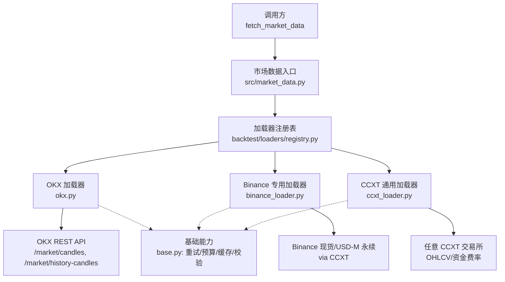
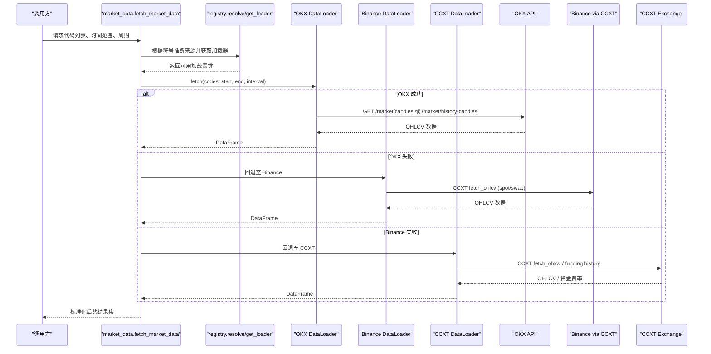
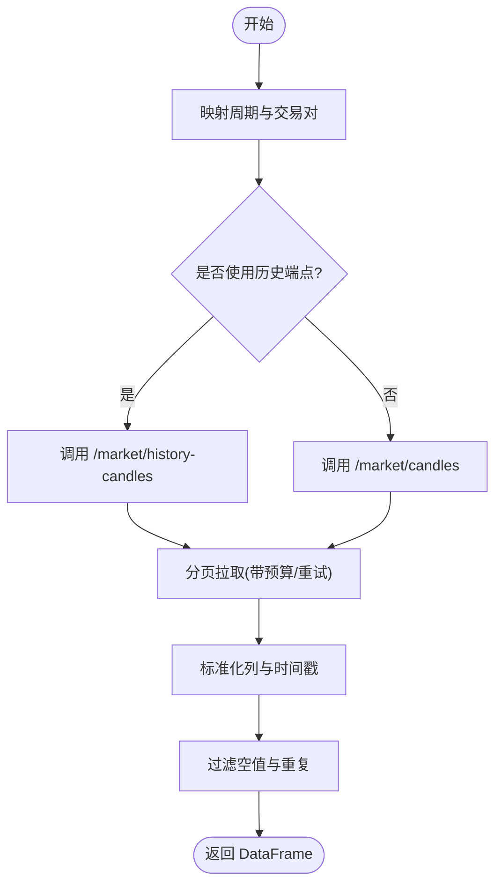
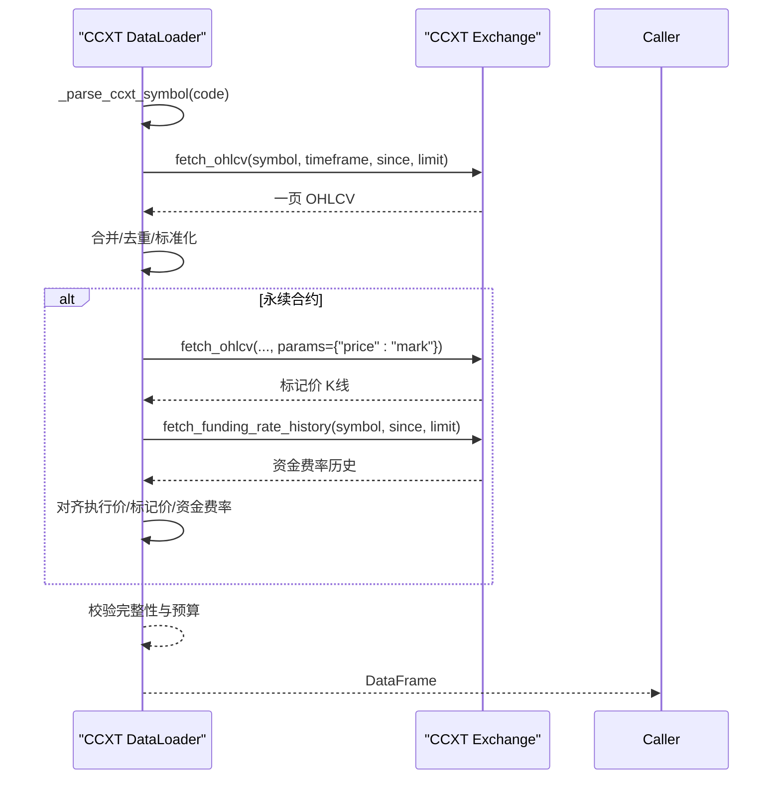
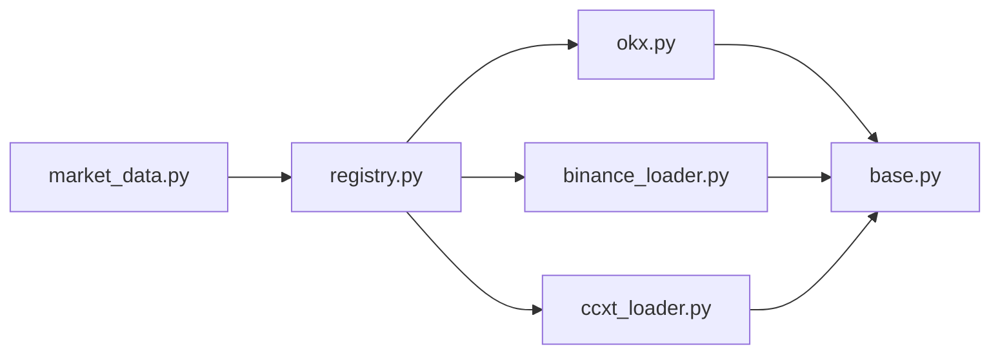

# 加密货币数据源

<cite>
**本文引用的文件**
- [agent/backtest/loaders/ccxt_loader.py](file://agent/backtest/loaders/ccxt_loader.py)
- [agent/backtest/loaders/binance_loader.py](file://agent/backtest/loaders/binance_loader.py)
- [agent/backtest/loaders/okx.py](file://agent/backtest/loaders/okx.py)
- [agent/backtest/loaders/base.py](file://agent/backtest/loaders/base.py)
- [agent/backtest/loaders/registry.py](file://agent/backtest/loaders/registry.py)
- [agent/src/market_data.py](file://agent/src/market_data.py)
- [agent/tests/test_binance_fallback.py](file://agent/tests/test_binance_fallback.py)
- [agent/tests/test_ccxt_loader_bounded.py](file://agent/tests/test_ccxt_loader_bounded.py)
- [agent/tests/test_okx_loader_bounded.py](file://agent/tests/test_okx_loader_bounded.py)
</cite>

## 目录
1. [简介](#简介)
2. [项目结构](#项目结构)
3. [核心组件](#核心组件)
4. [架构总览](#架构总览)
5. [详细组件分析](#详细组件分析)
6. [依赖关系分析](#依赖关系分析)
7. [性能与限流](#性能与限流)
8. [故障排查指南](#故障排查指南)
9. [结论](#结论)
10. [附录：多交易所聚合最佳实践](#附录多交易所聚合最佳实践)

## 简介
本文件面向 Vibe-Trading 的加密货币数据源，系统性说明 Binance、CCXT、OKX 等交易所的数据集成方式，覆盖 API 协议差异、交易对命名规范、K线数据格式与深度数据结构（如永续合约资金费率）、24小时连续交易的时区处理与数据标准化、API 限流与重试、连接失败时的故障转移策略，以及多交易所数据聚合的最佳实践（价格对齐、成交量归一化、流动性分析）。

## 项目结构
本项目将加密货币数据源抽象为“加载器（Loader）”模块，统一通过注册表与回退链进行调度。关键路径如下：
- 加载器实现：ccxt_loader、binance_loader、okx
- 通用能力：base（重试、预算、缓存、校验）
- 路由与回退：registry（市场级回退链）
- 上层入口：market_data（自动选择来源、聚合结果）



图表来源
- [agent/src/market_data.py:97-223](file://agent/src/market_data.py#L97-L223)
- [agent/backtest/loaders/registry.py:136-155](file://agent/backtest/loaders/registry.py#L136-L155)
- [agent/backtest/loaders/okx.py:101-208](file://agent/backtest/loaders/okx.py#L101-L208)
- [agent/backtest/loaders/binance_loader.py:23-44](file://agent/backtest/loaders/binance_loader.py#L23-L44)
- [agent/backtest/loaders/ccxt_loader.py:184-308](file://agent/backtest/loaders/ccxt_loader.py#L184-L308)
- [agent/backtest/loaders/base.py:163-236](file://agent/backtest/loaders/base.py#L163-L236)

章节来源
- [agent/src/market_data.py:97-223](file://agent/src/market_data.py#L97-L223)
- [agent/backtest/loaders/registry.py:136-155](file://agent/backtest/loaders/registry.py#L136-L155)

## 核心组件
- OKX 加载器：直接调用 OKX V5 公开 REST 接口，支持近期 K线与历史 K线双端点回退，内置代理、超时与预算控制。
- Binance 专用加载器：基于 CCXT 访问 Binance 现货或 USD-M 永续，作为 OKX 不可用时的首选回退。
- CCXT 通用加载器：通过 CCXT 拉取 OHLCV 与永续合约资金费率，提供符号解析、分页抓取、预算与重试。
- 基础能力：统一的日期校验、OHLC 不变量校验、重试与预算控制、本地 Parquet 缓存。
- 注册表与回退链：按市场类型维护有序回退链；加密市场默认顺序为 OKX → Binance → CCXT → yfinance → local。
- 市场数据入口：根据符号自动推断来源，并在失败时沿回退链尝试，最终输出标准化的 DataFrame。

章节来源
- [agent/backtest/loaders/okx.py:101-208](file://agent/backtest/loaders/okx.py#L101-L208)
- [agent/backtest/loaders/binance_loader.py:23-44](file://agent/backtest/loaders/binance_loader.py#L23-L44)
- [agent/backtest/loaders/ccxt_loader.py:184-308](file://agent/backtest/loaders/ccxt_loader.py#L184-L308)
- [agent/backtest/loaders/base.py:31-119](file://agent/backtest/loaders/base.py#L31-L119)
- [agent/backtest/loaders/registry.py:136-155](file://agent/backtest/loaders/registry.py#L136-L155)
- [agent/src/market_data.py:97-223](file://agent/src/market_data.py#L97-L223)

## 架构总览
下图展示从高层入口到具体交易所接口的调用流程，包括回退链与重试机制。



图表来源
- [agent/src/market_data.py:97-223](file://agent/src/market_data.py#L97-L223)
- [agent/backtest/loaders/registry.py:136-155](file://agent/backtest/loaders/registry.py#L136-L155)
- [agent/backtest/loaders/okx.py:220-265](file://agent/backtest/loaders/okx.py#L220-L265)
- [agent/backtest/loaders/binance_loader.py:31-44](file://agent/backtest/loaders/binance_loader.py#L31-L44)
- [agent/backtest/loaders/ccxt_loader.py:226-308](file://agent/backtest/loaders/ccxt_loader.py#L226-L308)

## 详细组件分析

### OKX 加载器
- 协议与端点：使用 OKX V5 公开 REST，优先尝试 /market/history-candles（适合长历史），否则回退到 /market/candles（近期数据）。
- 交易对命名：内部将传入的 code 中的 "/" 替换为 "-" 并大写，例如 BTC-USDT。
- K线字段：标准化为 open/high/low/close/volume，时间戳转为无时区的 UTC 索引。
- 可用性探测：is_available() 会发起一次轻量探针请求验证连通性与业务码。
- 限流与重试：对 429/5xx 等临时错误进行重试，整体受 wall-clock 预算限制。
- 代理支持：读取系统代理环境变量配置 requests.Session。



图表来源
- [agent/backtest/loaders/okx.py:131-208](file://agent/backtest/loaders/okx.py#L131-L208)
- [agent/backtest/loaders/okx.py:220-265](file://agent/backtest/loaders/okx.py#L220-L265)
- [agent/backtest/loaders/okx.py:267-373](file://agent/backtest/loaders/okx.py#L267-L373)

章节来源
- [agent/backtest/loaders/okx.py:101-208](file://agent/backtest/loaders/okx.py#L101-L208)
- [agent/backtest/loaders/okx.py:220-265](file://agent/backtest/loaders/okx.py#L220-L265)
- [agent/backtest/loaders/okx.py:267-373](file://agent/backtest/loaders/okx.py#L267-L373)

### Binance 专用加载器
- 协议：通过 CCXT 访问 Binance 现货或 USD-M 永续（binanceusdm），无需 API Key 即可拉取公共行情。
- 交易对：继承 CCXT 符号解析，支持 spot 与 swap 两种 instrument_type。
- 配置：启用 rate limit、设置超时毫秒数，支持代理。
- 回退定位：在 crypto 回退链中位于 OKX 之后，作为稳定替代。

```mermaid
classDiagram
class BinanceDataLoader {
+name = "binance"
+markets = {"crypto"}
+requires_auth = False
+_get_exchange(instrument_type) exchange
}
class CcxtDataLoader {
+fetch(...)
+_fetch_one(...)
+_fetch_perpetual(...)
}
BinanceDataLoader --|> CcxtDataLoader : "继承"
```

图表来源
- [agent/backtest/loaders/binance_loader.py:23-44](file://agent/backtest/loaders/binance_loader.py#L23-L44)
- [agent/backtest/loaders/ccxt_loader.py:184-308](file://agent/backtest/loaders/ccxt_loader.py#L184-L308)

章节来源
- [agent/backtest/loaders/binance_loader.py:23-44](file://agent/backtest/loaders/binance_loader.py#L23-L44)

### CCXT 通用加载器
- 符号解析：支持 BASE-USDT-PERP 永续符号与 spot 符号转换，区分 instrument_type。
- 数据拉取：分页拉取 OHLCV，支持参数扩展（如 mark price），并对网络异常进行重试。
- 永续合约：同时拉取执行价与标记价 K线，合并后附加资金费率与结算时间，确保资金费率在固定时段完整。
- 预算与重试：每个页面请求受 wall-clock 预算约束，仅对声明的瞬态异常重试，避免挂起。
- 完整性检查：若达到页上限但仍未覆盖请求区间，抛出错误提示不完整历史。



图表来源
- [agent/backtest/loaders/ccxt_loader.py:60-70](file://agent/backtest/loaders/ccxt_loader.py#L60-L70)
- [agent/backtest/loaders/ccxt_loader.py:226-308](file://agent/backtest/loaders/ccxt_loader.py#L226-L308)
- [agent/backtest/loaders/ccxt_loader.py:310-372](file://agent/backtest/loaders/ccxt_loader.py#L310-L372)
- [agent/backtest/loaders/ccxt_loader.py:374-424](file://agent/backtest/loaders/ccxt_loader.py#L374-L424)
- [agent/backtest/loaders/ccxt_loader.py:426-501](file://agent/backtest/loaders/ccxt_loader.py#L426-L501)

章节来源
- [agent/backtest/loaders/ccxt_loader.py:60-70](file://agent/backtest/loaders/ccxt_loader.py#L60-L70)
- [agent/backtest/loaders/ccxt_loader.py:226-308](file://agent/backtest/loaders/ccxt_loader.py#L226-L308)
- [agent/backtest/loaders/ccxt_loader.py:310-372](file://agent/backtest/loaders/ccxt_loader.py#L310-L372)
- [agent/backtest/loaders/ccxt_loader.py:374-424](file://agent/backtest/loaders/ccxt_loader.py#L374-L424)
- [agent/backtest/loaders/ccxt_loader.py:426-501](file://agent/backtest/loaders/ccxt_loader.py#L426-L501)

### 基础能力（重试、预算、缓存、校验）
- 重试与预算：retry_with_budget 对声明的瞬态异常进行有限次重试，结合 check_budget 在每页之间检查墙钟预算，防止长时间挂起。
- 缓存：可选的本地 Parquet 缓存，键由 source/symbol/timeframe/start/end/fields 生成，仅对已结算区间写入。
- 校验：validate_ohlc 强制 OHLC 不变量（高低价合理、非正价格拒绝），保障下游指标计算安全。

章节来源
- [agent/backtest/loaders/base.py:163-236](file://agent/backtest/loaders/base.py#L163-L236)
- [agent/backtest/loaders/base.py:243-439](file://agent/backtest/loaders/base.py#L243-L439)
- [agent/backtest/loaders/base.py:50-119](file://agent/backtest/loaders/base.py#L50-L119)

### 注册表与回退链
- 市场级回退链：crypto 默认顺序为 okx → binance → ccxt → yfinance → local。
- 自动选择：market_data.detect_source 根据符号模式匹配首选来源（如 BTC-USDT 走 OKX，BTC/USDT 走 CCXT）。
- 回退逻辑：当首选来源不可用或拉取失败时，按回退链依次尝试，最多尝试次数可配置。

章节来源
- [agent/backtest/loaders/registry.py:136-155](file://agent/backtest/loaders/registry.py#L136-L155)
- [agent/src/market_data.py:16-56](file://agent/src/market_data.py#L16-L56)
- [agent/src/market_data.py:97-223](file://agent/src/market_data.py#L97-L223)

## 依赖关系分析
- market_data 依赖 registry 进行加载器选择与回退。
- 各加载器共享 base 的重试/预算/缓存/校验能力。
- OKX 加载器独立于 CCXT，直接 HTTP 请求；Binance 专用加载器与 CCXT 通用加载器均依赖 CCXT 库。
- 测试用例覆盖了回退链行为、重试与预算边界条件。



图表来源
- [agent/src/market_data.py:97-223](file://agent/src/market_data.py#L97-L223)
- [agent/backtest/loaders/registry.py:136-155](file://agent/backtest/loaders/registry.py#L136-L155)
- [agent/backtest/loaders/okx.py:101-208](file://agent/backtest/loaders/okx.py#L101-L208)
- [agent/backtest/loaders/binance_loader.py:23-44](file://agent/backtest/loaders/binance_loader.py#L23-L44)
- [agent/backtest/loaders/ccxt_loader.py:184-308](file://agent/backtest/loaders/ccxt_loader.py#L184-L308)
- [agent/backtest/loaders/base.py:163-236](file://agent/backtest/loaders/base.py#L163-L236)

章节来源
- [agent/src/market_data.py:97-223](file://agent/src/market_data.py#L97-L223)
- [agent/backtest/loaders/registry.py:136-155](file://agent/backtest/loaders/registry.py#L136-L155)

## 性能与限流
- 超时与预算：
  - CCXT：可通过 CCXT_TIMEOUT_MS 与 CCXT_FETCH_BUDGET_S 控制单请求超时与整体预算。
  - OKX：可通过 OKX_TIMEOUT_S 与 OKX_FETCH_BUDGET_S 控制。
- 重试策略：
  - CCXT：对 ccxt.NetworkError 等瞬态异常重试，最大重试次数由 base 默认值控制。
  - OKX：对 429/5xx 等临时错误重试，同样受预算限制。
- 分页与完整性：
  - CCXT：每页 limit=1000，若达到页上限仍无法覆盖请求区间，会报错提示不完整历史。
  - OKX：按 bar 粒度分页，分钟级允许更多页数，日级较少页数。
- 代理支持：
  - CCXT：通过 _ccxt_proxy_config 读取系统代理变量。
  - OKX：通过 _okx_proxy_config 与 requests.Session 注入代理。
- 缓存：
  - 可选本地 Parquet 缓存，键包含 source/symbol/timeframe/date range/fields，仅对已结算区间写入，读失败不影响主流程。

章节来源
- [agent/backtest/loaders/ccxt_loader.py:50-57](file://agent/backtest/loaders/ccxt_loader.py#L50-L57)
- [agent/backtest/loaders/ccxt_loader.py:426-501](file://agent/backtest/loaders/ccxt_loader.py#L426-L501)
- [agent/backtest/loaders/okx.py:67-90](file://agent/backtest/loaders/okx.py#L67-L90)
- [agent/backtest/loaders/okx.py:267-373](file://agent/backtest/loaders/okx.py#L267-L373)
- [agent/backtest/loaders/base.py:163-236](file://agent/backtest/loaders/base.py#L163-L236)
- [agent/backtest/loaders/base.py:243-439](file://agent/backtest/loaders/base.py#L243-L439)

## 故障排查指南
- 现象：请求长时间挂起
  - 原因：未设置超时或预算导致网络异常无限等待。
  - 解决：设置 CCXT_TIMEOUT_MS/CCXT_FETCH_BUDGET_S 或 OKX_TIMEOUT_S/OKX_FETCH_BUDGET_S，确保预算生效。
- 现象：数据不完整
  - 原因：达到页上限但仍无法覆盖请求区间。
  - 解决：缩小时间范围、降低频率或调整 limit；检查交易所侧数据可用性。
- 现象：OKX 返回空或业务码非零
  - 原因：端点不可用或业务错误。
  - 解决：优先使用 history-candles；检查代理与网络；查看日志中的业务码与消息。
- 现象：永续合约资金费率缺失
  - 原因：结算时间点缺失或时间戳抖动。
  - 解决：确认资金费率历史拉取正常；注意时间戳四舍五入对齐；必要时补充外部维护保证金档位数据。
- 现象：回退链未生效
  - 原因：显式指定了不可回退的来源（如 local）或环境未安装依赖。
  - 解决：检查 detect_source 规则与回退链配置；确保依赖库安装正确。

章节来源
- [agent/tests/test_ccxt_loader_bounded.py:55-90](file://agent/tests/test_ccxt_loader_bounded.py#L55-L90)
- [agent/tests/test_okx_loader_bounded.py:64-110](file://agent/tests/test_okx_loader_bounded.py#L64-L110)
- [agent/backtest/loaders/ccxt_loader.py:310-372](file://agent/backtest/loaders/ccxt_loader.py#L310-L372)
- [agent/backtest/loaders/okx.py:220-265](file://agent/backtest/loaders/okx.py#L220-L265)

## 结论
Vibe-Trading 的加密货币数据源通过分层设计实现了高可用的数据接入：以 OKX 为首选，Binance 与 CCXT 为回退；统一的重试与预算机制避免网络波动导致的长时间阻塞；标准化的 K线字段与时区处理便于跨交易所聚合；永续合约的资金费率与标记价整合满足衍生品分析需求。配合本地缓存与严格的数据校验，系统在稳定性与性能上具备良好表现。

## 附录：多交易所聚合最佳实践
- 价格对齐
  - 使用统一的 trade_date 索引（UTC 无时区），确保不同来源的时间戳对齐。
  - 对于永续合约，合并执行价与标记价 K线，保证同一时间点的价格一致性。
- 成交量归一化
  - 将各交易所的 vol/volume 字段统一为 volume，去除单位差异；必要时按报价货币换算。
- 流动性分析
  - 利用多交易所的成交量与价差（执行价与标记价差）评估流动性；结合资金费率观察市场情绪。
- 数据质量
  - 使用 validate_ohlc 剔除结构性无效 K线；对缺失资金费率进行插值或标记。
- 容错与回退
  - 遵循回退链顺序，优先使用更稳定的公开端点；在失败时快速切换至备选来源。
- 性能优化
  - 合理设置预算与重试次数；对历史数据启用本地缓存；减少不必要的大范围拉取。

[本节为概念性指导，不直接分析具体文件]