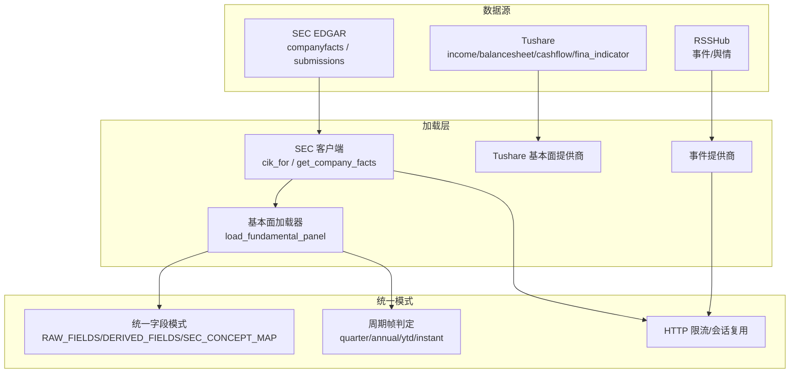
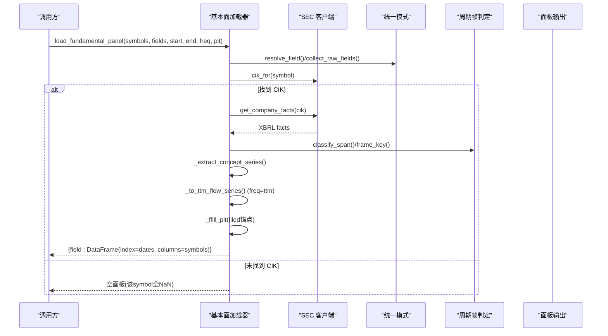
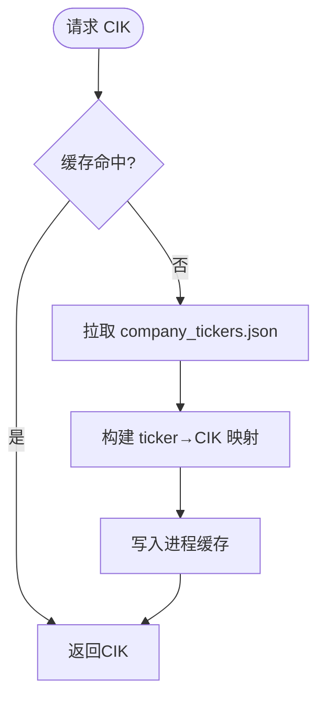
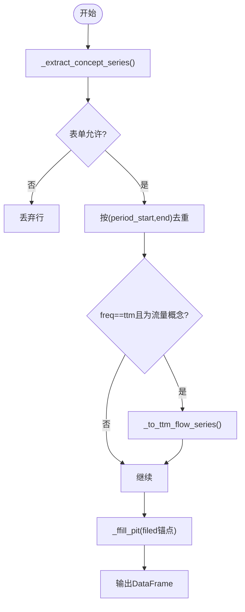
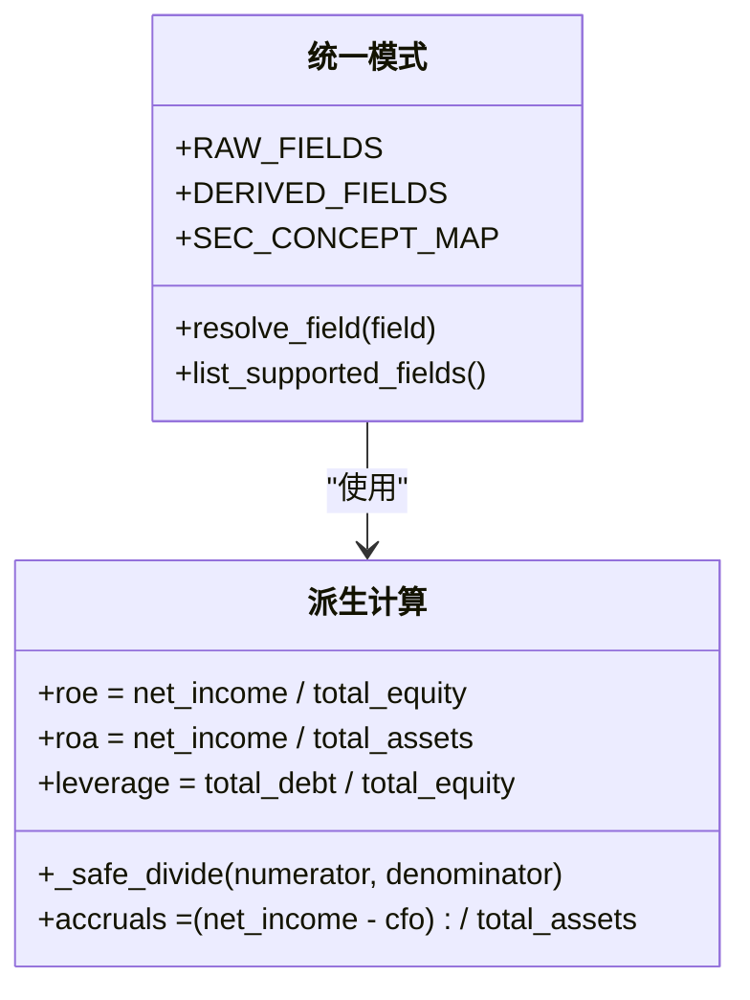
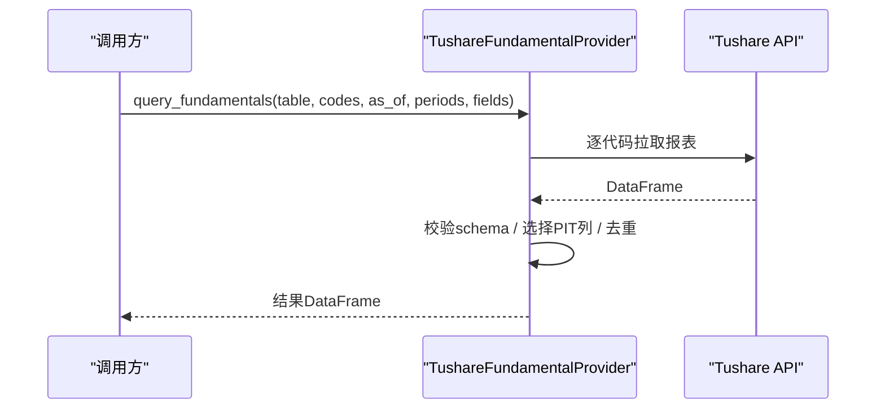
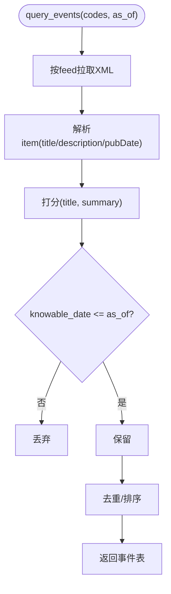
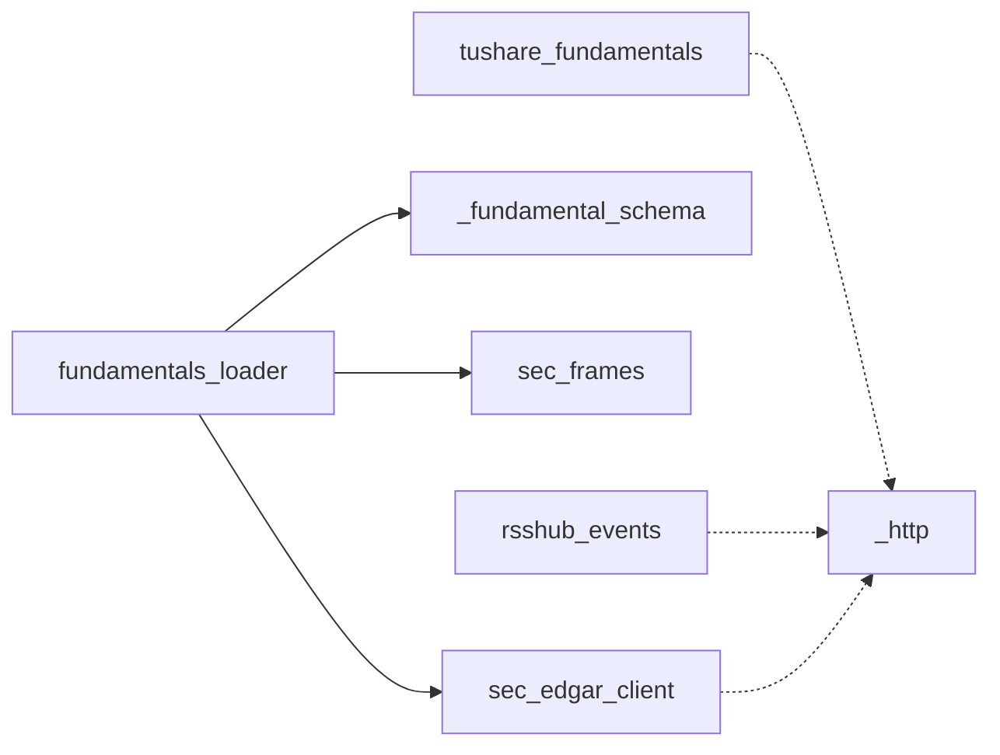

# 基本面数据源

<cite>
**本文引用的文件**
- [sec_edgar_client.py](file://agent/backtest/loaders/sec_edgar_client.py)
- [fundamentals_loader.py](file://agent/backtest/loaders/fundamentals_loader.py)
- [_fundamental_schema.py](file://agent/backtest/loaders/_fundamental_schema.py)
- [sec_frames.py](file://agent/backtest/loaders/sec_frames.py)
- [tushare_fundamentals.py](file://agent/backtest/loaders/tushare_fundamentals.py)
- [rsshub_events.py](file://agent/backtest/loaders/rsshub_events.py)
- [_http.py](file://agent/backtest/loaders/_http.py)
- [test_fundamentals_pit.py](file://agent/tests/test_fundamentals_pit.py)
- [test_tushare_fundamentals_provider.py](file://agent/tests/test_tushare_fundamentals_provider.py)
</cite>

## 目录
1. [简介](#简介)
2. [项目结构](#项目结构)
3. [核心组件](#核心组件)
4. [架构总览](#架构总览)
5. [详细组件分析](#详细组件分析)
6. [依赖关系分析](#依赖关系分析)
7. [性能考虑](#性能考虑)
8. [故障排查指南](#故障排查指南)
9. [结论](#结论)
10. [附录](#附录)

## 简介
本文件为 Vibe-Trading 的基本面数据源提供系统化文档，覆盖 SEC EDGAR、Tushare 基本面接口与事件/舆情数据源的集成方式；阐述财务报表（资产负债表、利润表、现金流量表）的标准化处理流程；说明公司事件（财报发布、高管变动、重大公告）的获取与点时安全（Point-in-Time, PIT）处理；给出财务比率、估值指标与基本面因子的构建方法；并提供数据质量验证、缺失值处理与历史数据回溯的技术方案。

## 项目结构
本项目将基本面数据源按“数据提供者 + 加载器 + 统一模式”组织：
- SEC EDGAR 客户端负责与 SEC 公开 API 交互（CIK 映射、提交索引、XBRL 公司事实）。
- 基本面加载器将稀疏 XBRL 事实转换为按日对齐的面板数据，并支持 TTM/季度/年度频率与 PIT 约束。
- 统一模式模块定义字段语义、SEC 概念别名映射与派生字段计算。
- Tushare 基本面提供商封装中国 A 股三大报表及指标查询，提供 PIT 裁剪与去重。
- RSSHub 事件提供商拉取新闻/公告/情绪信号，生成可交易的事件分数列。
- HTTP 工具提供按主机桶限流与连接复用，避免触发第三方速率限制。

**图示来源**
- [sec_edgar_client.py:1-235](file://agent/backtest/loaders/sec_edgar_client.py#L1-L235)
- [fundamentals_loader.py:1-501](file://agent/backtest/loaders/fundamentals_loader.py#L1-L501)
- [_fundamental_schema.py:1-227](file://agent/backtest/loaders/_fundamental_schema.py#L1-L227)
- [sec_frames.py:1-129](file://agent/backtest/loaders/sec_frames.py#L1-L129)
- [tushare_fundamentals.py:1-380](file://agent/backtest/loaders/tushare_fundamentals.py#L1-L380)
- [rsshub_events.py:1-569](file://agent/backtest/loaders/rsshub_events.py#L1-L569)
- [_http.py:1-180](file://agent/backtest/loaders/_http.py#L1-L180)

**章节来源**
- [sec_edgar_client.py:1-235](file://agent/backtest/loaders/sec_edgar_client.py#L1-L235)
- [fundamentals_loader.py:1-501](file://agent/backtest/loaders/fundamentals_loader.py#L1-L501)
- [_fundamental_schema.py:1-227](file://agent/backtest/loaders/_fundamental_schema.py#L1-L227)
- [sec_frames.py:1-129](file://agent/backtest/loaders/sec_frames.py#L1-L129)
- [tushare_fundamentals.py:1-380](file://agent/backtest/loaders/tushare_fundamentals.py#L1-L380)
- [rsshub_events.py:1-569](file://agent/backtest/loaders/rsshub_events.py#L1-L569)
- [_http.py:1-180](file://agent/backtest/loaders/_http.py#L1-L180)

## 核心组件
- SEC EDGAR 客户端：提供 ticker→CIK 映射缓存、提交索引与公司事实 JSON 拉取，遵守 SEC 访问策略（UA、限速）。
- 基本面加载器：将 XBRL 事实抽取为稀疏序列，按频率（TTM/季度/年度）聚合，基于 filed 日期前向填充，输出按日面板。
- 统一模式：定义 RAW_FIELDS（原始字段）、DERIVED_FIELDS（派生字段）与 SEC_CONCEPT_MAP（SEC 概念别名），实现跨发行人的口径一致。
- Tushare 基本面提供商：封装 income、balancesheet、cashflow、fina_indicator 等表的 PIT 查询与去重，支持价格框增强。
- 事件提供商：从 RSSHub 拉取事件，使用词法打分或自定义打分函数，生成 event_score/event_count 并注入价格框。
- HTTP 工具：按主机桶限流、随机抖动、会话复用，降低被限速风险。

**章节来源**
- [sec_edgar_client.py:1-235](file://agent/backtest/loaders/sec_edgar_client.py#L1-L235)
- [fundamentals_loader.py:1-501](file://agent/backtest/loaders/fundamentals_loader.py#L1-L501)
- [_fundamental_schema.py:1-227](file://agent/backtest/loaders/_fundamental_schema.py#L1-L227)
- [tushare_fundamentals.py:1-380](file://agent/backtest/loaders/tushare_fundamentals.py#L1-L380)
- [rsshub_events.py:1-569](file://agent/backtest/loaders/rsshub_events.py#L1-L569)
- [_http.py:1-180](file://agent/backtest/loaders/_http.py#L1-L180)

## 架构总览
下图展示从数据源到最终面板/增强的端到端流程，强调 PIT 安全与标准化。

**图示来源**
- [fundamentals_loader.py:196-277](file://agent/backtest/loaders/fundamentals_loader.py#L196-L277)
- [sec_edgar_client.py:166-227](file://agent/backtest/loaders/sec_edgar_client.py#L166-L227)
- [_fundamental_schema.py:196-227](file://agent/backtest/loaders/_fundamental_schema.py#L196-L227)
- [sec_frames.py:42-129](file://agent/backtest/loaders/sec_frames.py#L42-L129)

## 详细组件分析

### SEC EDGAR 客户端
- 功能要点：
  - 进程级 ticker→CIK 映射缓存，支持 .US 后缀剥离与分拆类符号（如 BRK-B）转换。
  - 通过 throttled_get_json 以“sec”主机桶限速，默认最小间隔不低于 0.12s，附带合规 UA。
  - 提供 get_submissions/get_company_facts 直接返回 JSON，供上层 loader 解析。
- 关键路径：
  - cik_for → _ticker_map → _sec_get_json → 缓存
  - get_company_facts → _sec_get_json → 返回 facts

**图示来源**
- [sec_edgar_client.py:118-163](file://agent/backtest/loaders/sec_edgar_client.py#L118-L163)
- [sec_edgar_client.py:166-195](file://agent/backtest/loaders/sec_edgar_client.py#L166-L195)
- [sec_edgar_client.py:198-227](file://agent/backtest/loaders/sec_edgar_client.py#L198-L227)
- [_http.py:120-180](file://agent/backtest/loaders/_http.py#L120-L180)

**章节来源**
- [sec_edgar_client.py:1-235](file://agent/backtest/loaders/sec_edgar_client.py#L1-L235)
- [_http.py:1-180](file://agent/backtest/loaders/_http.py#L1-L180)

### 基本面加载器（SEC）
- 功能要点：
  - 从 XBRL facts 抽取指定概念的稀疏序列，过滤表单类型（10-K/10-Q），按 period_start/end 区分季度/年度/YTD。
  - 支持 TTM 滚动求和（仅对流量概念），并以 filed 日期作为可见性锚点进行前向填充。
  - 输出按日面板，支持 PIT（保留每期最早 filed）与研究模式（保留最新 filed）。
- 关键算法：
  - _extract_concept_series：抽取、去重、TTM 聚合
  - _quarterly_flow_frames：用 10-K 合成 Q4
  - _ffill_pit：以 filed 为锚点前填至目标日期索引

**图示来源**
- [fundamentals_loader.py:47-131](file://agent/backtest/loaders/fundamentals_loader.py#L47-L131)
- [fundamentals_loader.py:134-166](file://agent/backtest/loaders/fundamentals_loader.py#L134-L166)
- [fundamentals_loader.py:169-193](file://agent/backtest/loaders/fundamentals_loader.py#L169-L193)
- [sec_frames.py:42-129](file://agent/backtest/loaders/sec_frames.py#L42-L129)

**章节来源**
- [fundamentals_loader.py:1-501](file://agent/backtest/loaders/fundamentals_loader.py#L1-L501)
- [sec_frames.py:1-129](file://agent/backtest/loaders/sec_frames.py#L1-L129)

### 统一模式（字段与派生）
- 原始字段：revenue、cogs、gross_profit、operating_income、net_income、total_assets、total_equity、total_debt、cash、shares_diluted、cfo、capex。
- 派生字段：roe、roa、gross_profitability、asset_growth、accruals、leverage。
- SEC 概念映射：每个字段对应一组 us-gaap 概念别名，优先顺序保证新准则兼容（如收入概念）。
- 安全除法：_safe_divide 在分母为零时返回 NaN，避免除零错误。

**图示来源**
- [_fundamental_schema.py:22-26](file://agent/backtest/loaders/_fundamental_schema.py#L22-L26)
- [_fundamental_schema.py:28-79](file://agent/backtest/loaders/_fundamental_schema.py#L28-L79)
- [_fundamental_schema.py:86-153](file://agent/backtest/loaders/_fundamental_schema.py#L86-L153)
- [_fundamental_schema.py:156-189](file://agent/backtest/loaders/_fundamental_schema.py#L156-L189)
- [_fundamental_schema.py:196-227](file://agent/backtest/loaders/_fundamental_schema.py#L196-L227)

**章节来源**
- [_fundamental_schema.py:1-227](file://agent/backtest/loaders/_fundamental_schema.py#L1-L227)

### Tushare 基本面提供商
- 能力：
  - 暴露 supported tables：balancesheet、cashflow、fina_indicator、income。
  - query_fundamentals：按 as_of 进行 PIT 裁剪，优先使用 f_ann_date，否则回退 ann_date；同(end_date)去重保留最新有效 PIT。
  - enrich_price_frames_with_fundamentals：将基本面快照以 table_字段 前缀附加到价格框，按交易日向后合并，遵循 PIT 可见性。
- 数据质量：
  - 校验必需列（ts_code、end_date、ann_date/f_ann_date），缺失则抛出 SchemaValidationError。
  - 未知表抛出 UnknownTableError。

**图示来源**
- [tushare_fundamentals.py:110-179](file://agent/backtest/loaders/tushare_fundamentals.py#L110-L179)
- [tushare_fundamentals.py:181-251](file://agent/backtest/loaders/tushare_fundamentals.py#L181-L251)
- [tushare_fundamentals.py:264-380](file://agent/backtest/loaders/tushare_fundamentals.py#L264-L380)

**章节来源**
- [tushare_fundamentals.py:1-380](file://agent/backtest/loaders/tushare_fundamentals.py#L1-L380)
- [test_tushare_fundamentals_provider.py:1-200](file://agent/tests/test_tushare_fundamentals_provider.py#L1-L200)

### 事件/舆情数据（RSSHub）
- 能力：
  - 配置 feed 路由（按标的或市场级），按 knowable_date 做 PIT 过滤。
  - 默认词法打分（正负词频归一化），支持自定义打分函数。
  - enrich_price_frames_with_events：按 lookback 窗口指数衰减聚合事件分数，输出 event_score/event_count。
- 鲁棒性：
  - 使用 defusedxml 防 XXE；失败/不可达会记录警告并在全部失败时抛错。

**图示来源**
- [rsshub_events.py:288-400](file://agent/backtest/loaders/rsshub_events.py#L288-L400)
- [rsshub_events.py:449-484](file://agent/backtest/loaders/rsshub_events.py#L449-L484)
- [rsshub_events.py:501-569](file://agent/backtest/loaders/rsshub_events.py#L501-L569)

**章节来源**
- [rsshub_events.py:1-569](file://agent/backtest/loaders/rsshub_events.py#L1-L569)

## 依赖关系分析
- 模块耦合：
  - fundamentals_loader 依赖 sec_edgar_client、_fundamental_schema、sec_frames。
  - tushare_fundamentals 独立于 SEC 体系，面向中国 A 股。
  - rsshub_events 独立于财务报表，提供事件维度。
  - 所有外部 HTTP 调用经 _http 限流与会话复用。
- 潜在循环：无直接循环导入；按需 import（如 schema 在运行时加载）。
- 外部依赖：
  - SEC：company_tickers.json、submissions、companyfacts。
  - Tushare：pro_api 各表接口。
  - RSSHub：自定义实例与路由。

**图示来源**
- [fundamentals_loader.py:1-501](file://agent/backtest/loaders/fundamentals_loader.py#L1-L501)
- [sec_edgar_client.py:1-235](file://agent/backtest/loaders/sec_edgar_client.py#L1-L235)
- [_fundamental_schema.py:1-227](file://agent/backtest/loaders/_fundamental_schema.py#L1-L227)
- [sec_frames.py:1-129](file://agent/backtest/loaders/sec_frames.py#L1-L129)
- [tushare_fundamentals.py:1-380](file://agent/backtest/loaders/tushare_fundamentals.py#L1-L380)
- [rsshub_events.py:1-569](file://agent/backtest/loaders/rsshub_events.py#L1-L569)
- [_http.py:1-180](file://agent/backtest/loaders/_http.py#L1-L180)

**章节来源**
- [fundamentals_loader.py:1-501](file://agent/backtest/loaders/fundamentals_loader.py#L1-L501)
- [sec_edgar_client.py:1-235](file://agent/backtest/loaders/sec_edgar_client.py#L1-L235)
- [_fundamental_schema.py:1-227](file://agent/backtest/loaders/_fundamental_schema.py#L1-L227)
- [sec_frames.py:1-129](file://agent/backtest/loaders/sec_frames.py#L1-L129)
- [tushare_fundamentals.py:1-380](file://agent/backtest/loaders/tushare_fundamentals.py#L1-L380)
- [rsshub_events.py:1-569](file://agent/backtest/loaders/rsshub_events.py#L1-L569)
- [_http.py:1-180](file://agent/backtest/loaders/_http.py#L1-L180)

## 性能考虑
- 限速与并发：
  - SEC 客户端使用“sec”主机桶最小间隔（≥0.12s）+ 随机抖动，避免瞬时突发。
  - 通用 HTTP 工具按 host_key 限流，进程内共享 requests.Session，减少握手开销。
- 缓存与去重：
  - ticker→CIK 映射进程级缓存；基本面面板按 symbol/timeframe/fields 缓存。
  - Tushare 同(end_date)按有效 PIT 去重，避免重复更新。
- 计算优化：
  - TTM 仅对流量概念滚动求和；季度合成 Q4 减少缺失。
  - 事件评分默认词法打分，轻量且可替换为 LLM 打分。

[本节为通用指导，不直接分析具体文件]

## 故障排查指南
- SEC 相关：
  - 若某 symbol 无法解析 CIK，将记录警告并返回空面板；确保传入美国股票代码（可带 .US）。
  - 若 XBRL 概念未命中，将记录缺失告警；检查 _fundamental_schema 中的 SEC_CONCEPT_MAP 是否覆盖。
- Tushare 相关：
  - 未知表抛出 UnknownTableError；缺少必需列抛出 SchemaValidationError。
  - 确认环境变量 TUSHARE_TOKEN 已正确设置。
- 事件相关：
  - 若所有 RSSHub 拉取失败，将抛出异常；检查 base_url、路由与网络可达性。
  - 事件打分低于阈值将被过滤；调整 min_abs_score 或更换打分函数。

**章节来源**
- [fundamentals_loader.py:386-416](file://agent/backtest/loaders/fundamentals_loader.py#L386-L416)
- [fundamentals_loader.py:459-492](file://agent/backtest/loaders/fundamentals_loader.py#L459-L492)
- [tushare_fundamentals.py:125-135](file://agent/backtest/loaders/tushare_fundamentals.py#L125-L135)
- [tushare_fundamentals.py:232-236](file://agent/backtest/loaders/tushare_fundamentals.py#L232-L236)
- [rsshub_events.py:324-341](file://agent/backtest/loaders/rsshub_events.py#L324-L341)
- [rsshub_events.py:383-391](file://agent/backtest/loaders/rsshub_events.py#L383-L391)

## 结论
Vibe-Trading 的基本面数据源以 SEC EDGAR 与 Tushare 为核心，辅以 RSSHub 事件数据，形成“多源采集—统一模式—PIT 安全—面板输出”的完整链路。通过严格的周期帧判定、TTM 聚合、filed 锚点前填与 PIT 裁剪，确保回测与实盘的一致性；统一的字段与派生规则使因子构建与估值指标生成具备可扩展性与可比性。配合 HTTP 限流与缓存机制，系统在稳定性与性能上达到生产可用水平。

[本节为总结，不直接分析具体文件]

## 附录

### 财务报表标准化映射（摘要）
- 利润表：revenue、cogs、gross_profit、operating_income、net_income
- 资产负债表：total_assets、total_equity、total_debt、cash
- 现金流量表：cfo、capex
- 派生指标：roe、roa、gross_profitability、asset_growth、accruals、leverage

**章节来源**
- [_fundamental_schema.py:28-79](file://agent/backtest/loaders/_fundamental_schema.py#L28-L79)
- [_fundamental_schema.py:156-189](file://agent/backtest/loaders/_fundamental_schema.py#L156-L189)

### 数据质量与回溯
- 数据质量：
  - SEC：概念别名覆盖度监控（缺失日志）；表单类型过滤（10-K/10-Q）。
  - Tushare：必需列校验；未知表拒绝。
- 缺失值处理：
  - SEC：以 filed 为锚点前向填充；TTM 需至少 4 个观测。
  - Tushare：同(end_date)去重后按 PIT 可见性合并。
- 历史回溯：
  - 所有数据均受 as_of 控制，确保回测中不会发生未来信息泄露。

**章节来源**
- [fundamentals_loader.py:169-193](file://agent/backtest/loaders/fundamentals_loader.py#L169-L193)
- [fundamentals_loader.py:292-300](file://agent/backtest/loaders/fundamentals_loader.py#L292-L300)
- [tushare_fundamentals.py:145-179](file://agent/backtest/loaders/tushare_fundamentals.py#L145-L179)
- [test_fundamentals_pit.py:71-101](file://agent/tests/test_fundamentals_pit.py#L71-L101)
- [test_fundamentals_pit.py:104-145](file://agent/tests/test_fundamentals_pit.py#L104-L145)
- [test_fundamentals_pit.py:147-176](file://agent/tests/test_fundamentals_pit.py#L147-L176)
- [test_tushare_fundamentals_provider.py:73-92](file://agent/tests/test_tushare_fundamentals_provider.py#L73-L92)
- [test_tushare_fundamentals_provider.py:148-196](file://agent/tests/test_tushare_fundamentals_provider.py#L148-L196)