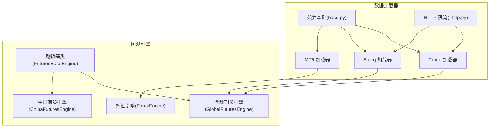
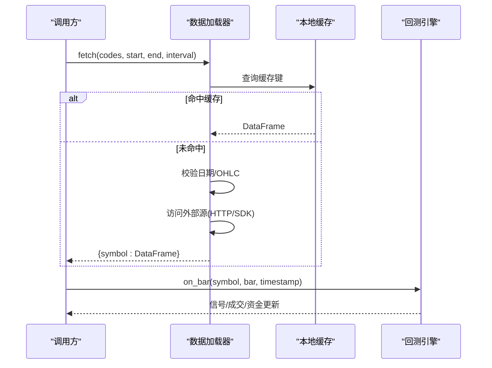
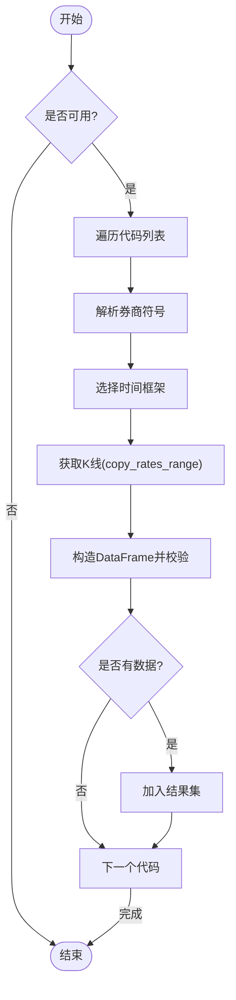
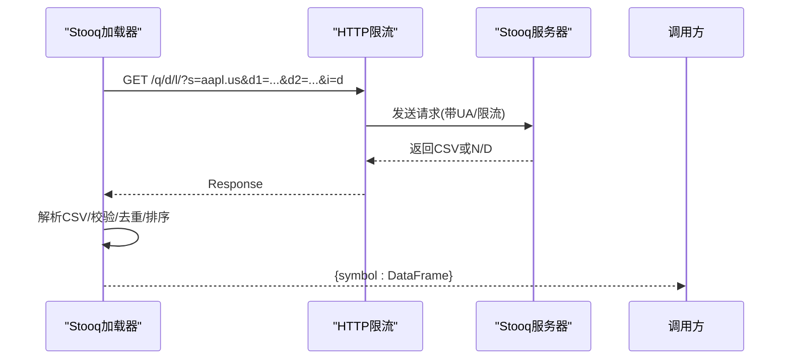
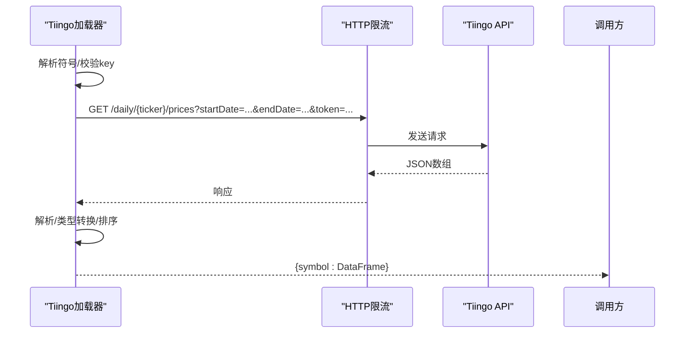
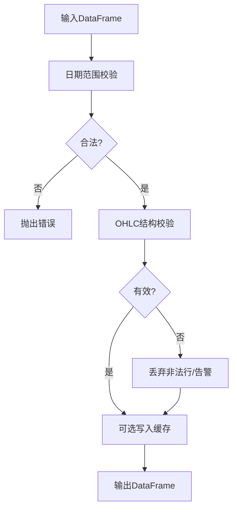
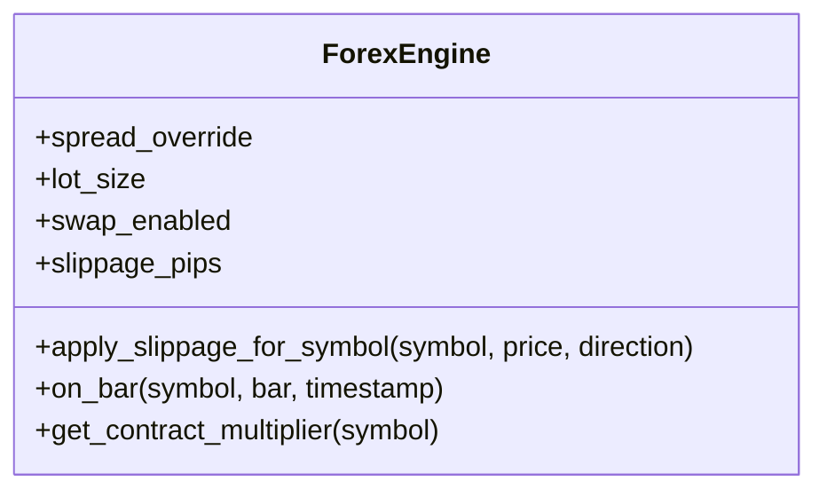
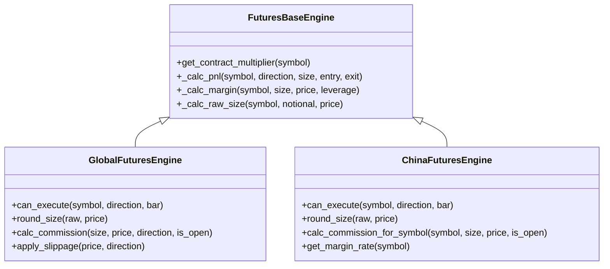
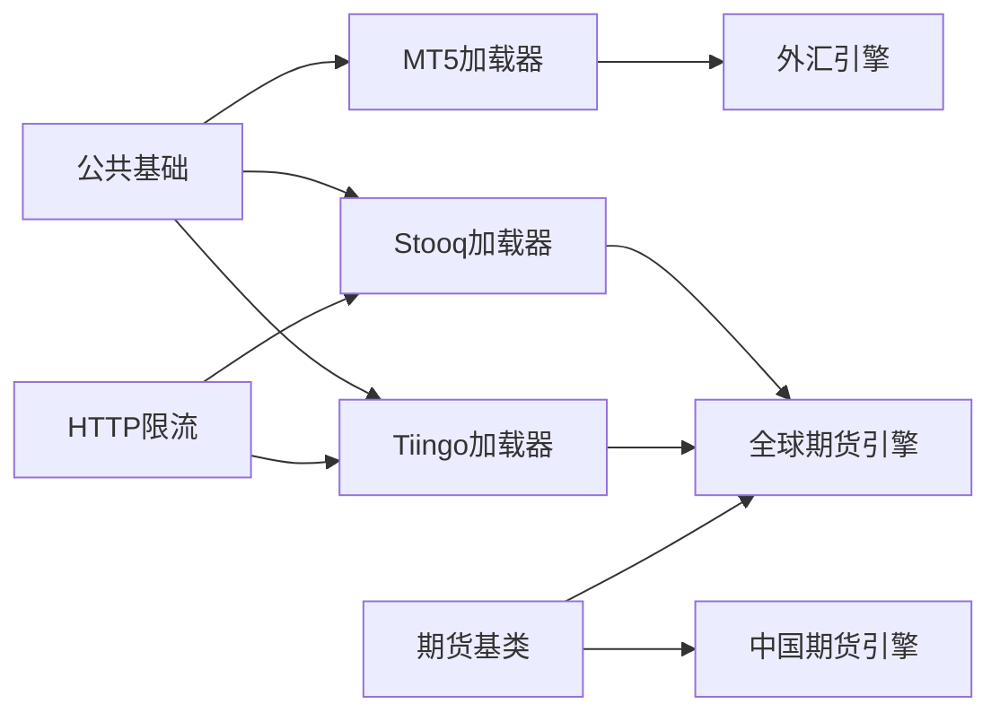

# 外汇期货数据源

<cite>
**本文引用的文件**
- [mt5_loader.py](file://agent/backtest/loaders/mt5_loader.py)
- [stooq_loader.py](file://agent/backtest/loaders/stooq_loader.py)
- [tiingo_loader.py](file://agent/backtest/loaders/tiingo_loader.py)
- [base.py](file://agent/backtest/loaders/base.py)
- [_http.py](file://agent/backtest/loaders/_http.py)
- [forex.py](file://agent/backtest/engines/forex.py)
- [futures_base.py](file://agent/backtest/engines/futures_base.py)
- [global_futures.py](file://agent/backtest/engines/global_futures.py)
- [china_futures.py](file://agent/backtest/engines/china_futures.py)
- [README_zh.md](file://README_zh.md)
</cite>

## 目录
1. [简介](#简介)
2. [项目结构](#项目结构)
3. [核心组件](#核心组件)
4. [架构总览](#架构总览)
5. [详细组件分析](#详细组件分析)
6. [依赖关系分析](#依赖关系分析)
7. [性能与高吞吐优化](#性能与高吞吐优化)
8. [故障排查指南](#故障排查指南)
9. [结论](#结论)
10. [附录](#附录)

## 简介
本文件面向 Vibe-Trading 的外汇与期货市场数据源，聚焦 MetaTrader 5（MT5）、Stooq、Tiingo 三类数据源的集成实现，并覆盖外汇货币对与期货合约的数据结构、报价惯例与合约规格；阐述外汇市场的点差、隔夜利息与杠杆交易支持；说明期货合约生命周期管理（到期、换月、保证金）；给出数据质量验证方法（异常值检测、完整性检查）；并提供高频数据处理优化与实时行情订阅的实现思路。

## 项目结构
围绕“数据加载器 + 回测引擎”的分层设计：
- 数据加载器层：按市场/来源提供 OHLCV 历史数据，统一输出 trade_date 索引的 DataFrame（open/high/low/close/volume）。
- 公共基础能力：日期校验、OHLC 合法性校验、本地缓存、HTTP 限流与重试预算等。
- 回测引擎层：针对外汇（ForexEngine）与期货（ChinaFuturesEngine、GlobalFuturesEngine）实现各自的市场规则、滑点、佣金、合约乘数与保证金计算。

图表来源
- [mt5_loader.py:170-251](file://agent/backtest/loaders/mt5_loader.py#L170-L251)
- [stooq_loader.py:74-163](file://agent/backtest/loaders/stooq_loader.py#L74-L163)
- [tiingo_loader.py:133-246](file://agent/backtest/loaders/tiingo_loader.py#L133-L246)
- [base.py:31-119](file://agent/backtest/loaders/base.py#L31-L119)
- [_http.py:120-180](file://agent/backtest/loaders/_http.py#L120-L180)
- [forex.py:56-137](file://agent/backtest/engines/forex.py#L56-L137)
- [futures_base.py:19-57](file://agent/backtest/engines/futures_base.py#L19-L57)
- [global_futures.py:130-223](file://agent/backtest/engines/global_futures.py#L130-L223)
- [china_futures.py:131-255](file://agent/backtest/engines/china_futures.py#L131-L255)

章节来源
- [README_zh.md:338-359](file://README_zh.md#L338-L359)

## 核心组件
- MT5 加载器：从本地 MT5 终端拉取外汇/贵金属历史 K 线，支持分钟到日线周期，自动解析券商符号后缀，使用 tick_volume 作为成交量代理，严格 UTC 时间处理。
- Stooq 加载器：免费美股日频 CSV 下载，通过共享 HTTP 限流模块控制请求间隔，返回标准化 OHLCV 帧。
- Tiingo 加载器：基于 API Key 的美股日频 JSON 接口，带键配置校验与限流，返回标准化 OHLCV 帧。
- 公共基础：日期范围校验、OHLC 结构性校验（high<low、非正价格等）、可选本地 Parquet 缓存、重试预算与超时控制。
- 外汇引擎：点差模型（按货币对 pip 换算）、滑点、标准手、隔夜利息（swap）、杠杆与 PnL 计算。
- 期货引擎：合约乘数、保证金、涨跌停限制、手续费；中国期货与全球期货分别维护产品映射与参数表。

章节来源
- [mt5_loader.py:170-251](file://agent/backtest/loaders/mt5_loader.py#L170-L251)
- [stooq_loader.py:74-163](file://agent/backtest/loaders/stooq_loader.py#L74-L163)
- [tiingo_loader.py:133-246](file://agent/backtest/loaders/tiingo_loader.py#L133-L246)
- [base.py:31-119](file://agent/backtest/loaders/base.py#L31-L119)
- [forex.py:56-137](file://agent/backtest/engines/forex.py#L56-L137)
- [futures_base.py:19-57](file://agent/backtest/engines/futures_base.py#L19-L57)
- [global_futures.py:130-223](file://agent/backtest/engines/global_futures.py#L130-L223)
- [china_futures.py:131-255](file://agent/backtest/engines/china_futures.py#L131-L255)

## 架构总览
数据流从“加载器”产出标准化的 OHLCV 帧，进入“回测引擎”进行策略模拟。外汇与期货在引擎层分别实现点差/隔夜利息与合约乘数/保证金等差异。

图表来源
- [base.py:306-439](file://agent/backtest/loaders/base.py#L306-L439)
- [mt5_loader.py:186-251](file://agent/backtest/loaders/mt5_loader.py#L186-L251)
- [stooq_loader.py:89-163](file://agent/backtest/loaders/stooq_loader.py#L89-L163)
- [tiingo_loader.py:149-246](file://agent/backtest/loaders/tiingo_loader.py#L149-L246)
- [forex.py:124-137](file://agent/backtest/engines/forex.py#L124-L137)

## 详细组件分析

### MT5 外汇数据加载器
- 功能要点
  - 仅支持 forex/metals，需 Windows 与已登录 MT5 终端。
  - 周期映射：1m/5m/15m/30m/1H/4H/1D/1W/1M。
  - 券商符号解析：优先精确匹配，其次 base* 模糊匹配，选择最短名称（如 EURUSDm）。
  - 时间处理：UTC 时区感知，避免本地时区偏移导致窗口错位。
  - 成交量：多数经纪商 real_volume=0，采用 tick_volume 作为代理。
  - 结果过滤：仅保留 open/high/low/close/volume，执行 OHLC 校验。
- 关键流程
  - is_available：导入 SDK 并初始化终端（进程级缓存）。
  - fetch：循环 codes，逐个调用 _fetch_one，失败不中断批次。
  - _fetch_one：解析 broker symbol -> 选择 timeframe -> copy_rates_range -> 转 DataFrame。

图表来源
- [mt5_loader.py:79-147](file://agent/backtest/loaders/mt5_loader.py#L79-L147)
- [mt5_loader.py:186-251](file://agent/backtest/loaders/mt5_loader.py#L186-L251)

章节来源
- [mt5_loader.py:1-251](file://agent/backtest/loaders/mt5_loader.py#L1-L251)

### Stooq 美股日频数据加载器
- 功能要点
  - 免费 CSV 端点，无认证，按 host 限流。
  - 仅支持日频（1D），其他周期直接拒绝。
  - 字段映射：Open/High/Low/Close/Volume -> open/high/low/close/volume。
  - 空响应或 N/D 视为无数据，跳过该标的。
- 关键流程
  - map_symbol：小写化并保留 .US 后缀。
  - throttled_get：按 host_key 限流，复用 Session。
  - _parse_csv：清洗列名、时间戳、数值类型，丢弃无效行。

图表来源
- [stooq_loader.py:57-72](file://agent/backtest/loaders/stooq_loader.py#L57-L72)
- [stooq_loader.py:89-163](file://agent/backtest/loaders/stooq_loader.py#L89-L163)
- [_http.py:120-180](file://agent/backtest/loaders/_http.py#L120-L180)

章节来源
- [stooq_loader.py:1-199](file://agent/backtest/loaders/stooq_loader.py#L1-L199)
- [_http.py:1-180](file://agent/backtest/loaders/_http.py#L1-L180)

### Tiingo 美股日频数据加载器
- 功能要点
  - 需要 TIINGO_API_KEY，环境变量读取并做占位符过滤。
  - 仅支持日频（1D），其他周期直接拒绝。
  - 符号转换：去除 .US，拒绝含分隔符或非字母数字的符号。
  - 响应解析：ISO 时间归一化，统一 float64，volume 填充 0。
- 关键流程
  - _resolve_key：从配置读取 key，空/占位则不可用。
  - throttled_get_json：限流+JSON解码。
  - _rows_to_frame：构建 DataFrame，索引为 trade_date，排序并校验。

图表来源
- [tiingo_loader.py:46-80](file://agent/backtest/loaders/tiingo_loader.py#L46-L80)
- [tiingo_loader.py:149-246](file://agent/backtest/loaders/tiingo_loader.py#L149-L246)
- [_http.py:155-180](file://agent/backtest/loaders/_http.py#L155-L180)

章节来源
- [tiingo_loader.py:1-246](file://agent/backtest/loaders/tiingo_loader.py#L1-L246)

### 数据质量验证与完整性检查
- 日期范围校验：start <= end，否则抛出 ValueError。
- OHLC 结构性校验：强制 high>=low、high/low 包围 open/close；默认拒绝非正价格，可配置允许负价但拒绝零价。
- 批量清洗：loader 边界集中丢弃脏 bar，确保下游回测指标稳定。
- 本地缓存：对已结算区间写入 parquet，读失败降级至在线源。

图表来源
- [base.py:31-119](file://agent/backtest/loaders/base.py#L31-L119)
- [base.py:343-439](file://agent/backtest/loaders/base.py#L343-L439)

章节来源
- [base.py:31-119](file://agent/backtest/loaders/base.py#L31-L119)
- [base.py:343-439](file://agent/backtest/loaders/base.py#L343-L439)

### 外汇市场特殊处理：点差、隔夜利息与杠杆
- 点差与滑点：按货币对的 pip 值（JPY 为 0.01，其余 0.0001）计算半点差 + 额外滑点，买入加、卖出减。
- 隔夜利息（Swap）：每日收盘时根据持仓与手数计算 swap，影响资金曲线。
- 杠杆：默认 100:1，可配置；PnL 与保证金计算考虑杠杆。
- 标准手：100,000 基础货币单位。

图表来源
- [forex.py:56-137](file://agent/backtest/engines/forex.py#L56-L137)

章节来源
- [forex.py:1-137](file://agent/backtest/engines/forex.py#L1-L137)

### 期货合约生命周期管理：到期、换月与保证金
- 合约乘数：不同产品有固定乘数（如 ES=50、CL=1000、GC=100），用于 PnL、保证金与头寸规模计算。
- 保证金：基于乘数与价格，结合杠杆计算；中国期货与全球期货分别维护保证金率与手续费表。
- 涨跌停：按产品限制（指数类百分比、商品类固定美元或百分比近似），执行时拦截越界委托。
- 到期与换月：当前引擎假设连续近月数据，未内建到期/换月逻辑；需在数据层提供连续序列或在策略层处理。

图表来源
- [futures_base.py:19-57](file://agent/backtest/engines/futures_base.py#L19-L57)
- [global_futures.py:130-223](file://agent/backtest/engines/global_futures.py#L130-L223)
- [china_futures.py:131-255](file://agent/backtest/engines/china_futures.py#L131-L255)

章节来源
- [futures_base.py:1-57](file://agent/backtest/engines/futures_base.py#L1-L57)
- [global_futures.py:1-223](file://agent/backtest/engines/global_futures.py#L1-L223)
- [china_futures.py:1-255](file://agent/backtest/engines/china_futures.py#L1-L255)

### 数据结构与报价惯例
- 统一输出：trade_date 索引，列 open/high/low/close/volume，升序排列。
- 外汇报价：主流货币对 pip=0.0001，JPY 对 pip=0.01；点差以 pips 为单位换算。
- 期货乘数：每点价值由产品决定，影响盈亏与保证金。
- 成交量：MT5 使用 tick_volume；Stooq/Tiingo 使用原始 volume。

章节来源
- [mt5_loader.py:150-167](file://agent/backtest/loaders/mt5_loader.py#L150-L167)
- [stooq_loader.py:41-49](file://agent/backtest/loaders/stooq_loader.py#L41-L49)
- [tiingo_loader.py:82-130](file://agent/backtest/loaders/tiingo_loader.py#L82-L130)
- [forex.py:23-54](file://agent/backtest/engines/forex.py#L23-L54)
- [global_futures.py:23-48](file://agent/backtest/engines/global_futures.py#L23-L48)
- [china_futures.py:23-48](file://agent/backtest/engines/china_futures.py#L23-L48)

## 依赖关系分析
- 加载器依赖
  - MT5：依赖本地 MT5 SDK，进程级初始化缓存，符号解析 memo。
  - Stooq/Tiingo：依赖共享 HTTP 限流模块，按 host 桶限流与 Session 复用。
  - 公共基础：日期校验、OHLC 校验、本地缓存、重试预算。
- 引擎依赖
  - 外汇引擎：依赖 pip 换算、点差表与 swap 计算。
  - 期货引擎：依赖产品乘数表、保证金率、涨跌停限制与手续费表。

图表来源
- [mt5_loader.py:170-251](file://agent/backtest/loaders/mt5_loader.py#L170-L251)
- [stooq_loader.py:74-163](file://agent/backtest/loaders/stooq_loader.py#L74-L163)
- [tiingo_loader.py:133-246](file://agent/backtest/loaders/tiingo_loader.py#L133-L246)
- [base.py:31-119](file://agent/backtest/loaders/base.py#L31-L119)
- [_http.py:120-180](file://agent/backtest/loaders/_http.py#L120-L180)
- [forex.py:56-137](file://agent/backtest/engines/forex.py#L56-L137)
- [futures_base.py:19-57](file://agent/backtest/engines/futures_base.py#L19-L57)
- [global_futures.py:130-223](file://agent/backtest/engines/global_futures.py#L130-L223)
- [china_futures.py:131-255](file://agent/backtest/engines/china_futures.py#L131-L255)

章节来源
- [base.py:31-119](file://agent/backtest/loaders/base.py#L31-L119)
- [_http.py:1-180](file://agent/backtest/loaders/_http.py#L1-L180)

## 性能与高吞吐优化
- 本地缓存：对已结算区间使用 parquet 缓存，命中即跳过网络与 SDK 连接；读写失败不影响主流程。
- HTTP 限流：按 host 桶最小间隔 + 随机抖动，避免并发同步；Session 复用降低握手开销。
- 重试预算：对瞬态异常使用 bounded retry，超时报错，保护整体运行时间。
- 高频数据建议
  - 使用 MT5 分钟级数据（1m/5m/15m），注意终端“最大K线数”限制。
  - 批量拉取时分片日期窗口，避免单次过大请求。
  - 对 Stooq/Tiingo 设置环境变量提高最小间隔，应对 IP 限流。
  - 使用缓存减少重复下载；对当日区间不缓存（最后一根仍在形成）。

章节来源
- [base.py:243-439](file://agent/backtest/loaders/base.py#L243-L439)
- [_http.py:46-118](file://agent/backtest/loaders/_http.py#L46-L118)
- [mt5_loader.py:15-18](file://agent/backtest/loaders/mt5_loader.py#L15-L18)
- [stooq_loader.py:38-55](file://agent/backtest/loaders/stooq_loader.py#L38-L55)
- [tiingo_loader.py:31-40](file://agent/backtest/loaders/tiingo_loader.py#L31-L40)

## 故障排查指南
- 常见问题
  - MT5 不可用：未安装 SDK、未登录终端、Windows 平台缺失；is_available 返回 False，将走 fallback。
  - 符号未找到：券商未提供该符号或后缀不匹配；日志警告并跳过。
  - Stooq/Tiingo 限流：返回空或错误；通过限流与重试缓解；必要时增大最小间隔。
  - OHLC 脏数据：high<low、非正价格；被集中丢弃或告警。
- 定位步骤
  - 检查 is_available 与日志警告。
  - 确认日期范围与周期是否受支持。
  - 查看本地缓存是否存在且可读。
  - 调整限流参数与环境变量。

章节来源
- [mt5_loader.py:79-147](file://agent/backtest/loaders/mt5_loader.py#L79-L147)
- [stooq_loader.py:117-163](file://agent/backtest/loaders/stooq_loader.py#L117-L163)
- [tiingo_loader.py:149-246](file://agent/backtest/loaders/tiingo_loader.py#L149-L246)
- [base.py:31-119](file://agent/backtest/loaders/base.py#L31-L119)

## 结论
Vibe-Trading 在外汇与期货数据源上提供了稳健的加载器与引擎组合：MT5 提供本地终端的高保真外汇/贵金属历史；Stooq/Tiingo 覆盖美股日频；公共基础保障数据质量与性能；外汇与期货引擎分别实现点差/隔夜利息与合约乘数/保证金等市场特性。通过本地缓存、HTTP 限流与重试预算，系统在稳定性与吞吐方面具备良好表现。对于高频与实时需求，建议在数据层分片拉取并结合缓存，同时通过连接器接入实时行情。

## 附录
- 实时行情订阅
  - loader 层专注历史 OHLCV；实时 ticks/深度请通过连接器（加密货币：okx/binance/ccxt；股票：futu/tiger）获取。
- 参考信息
  - 数据源与智能降级链：包含 mt5、stooq、tiingo 等在内的多源路由与优先级。

章节来源
- [README_zh.md:338-359](file://README_zh.md#L338-L359)