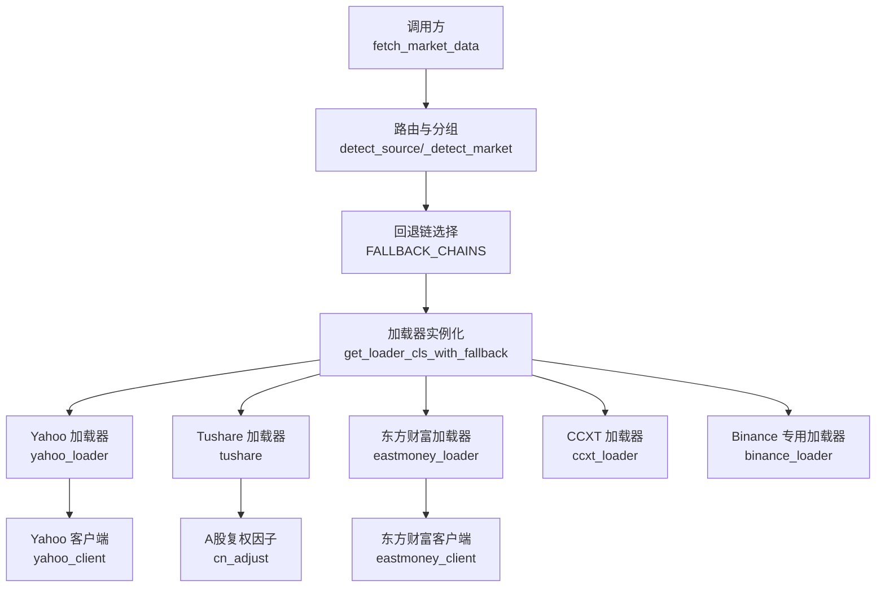
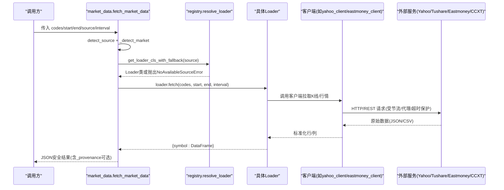
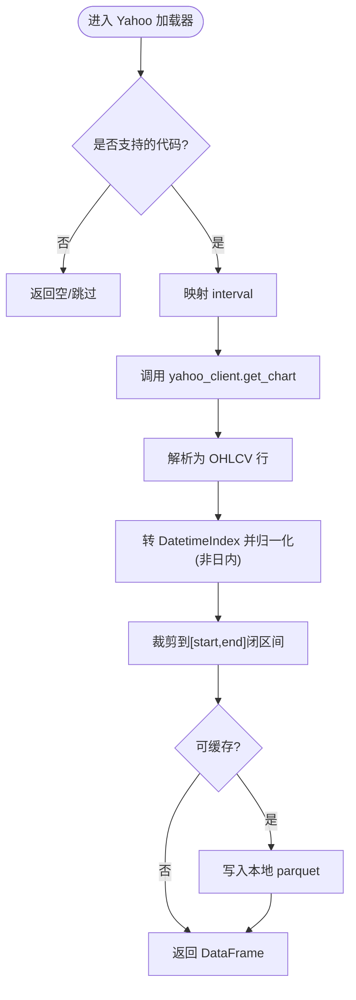
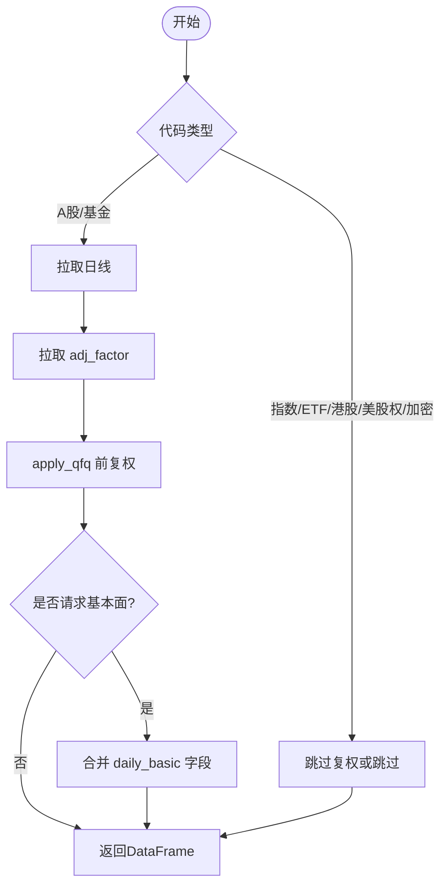
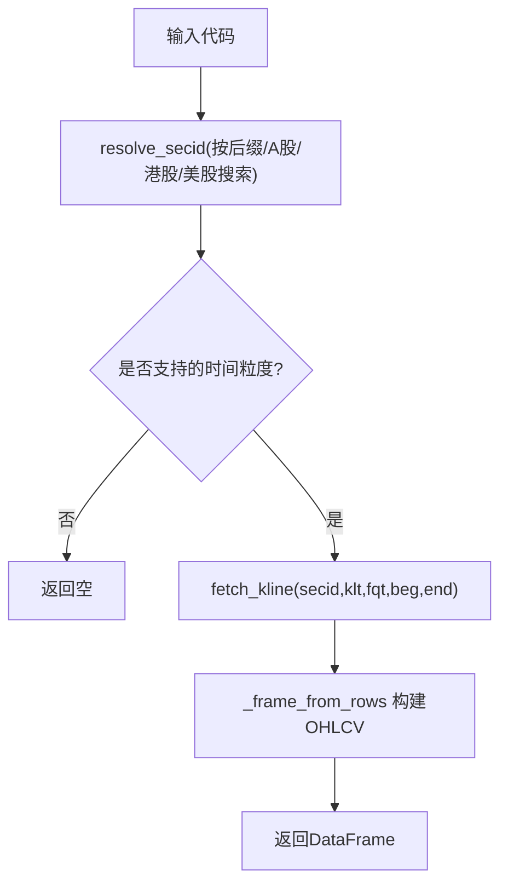
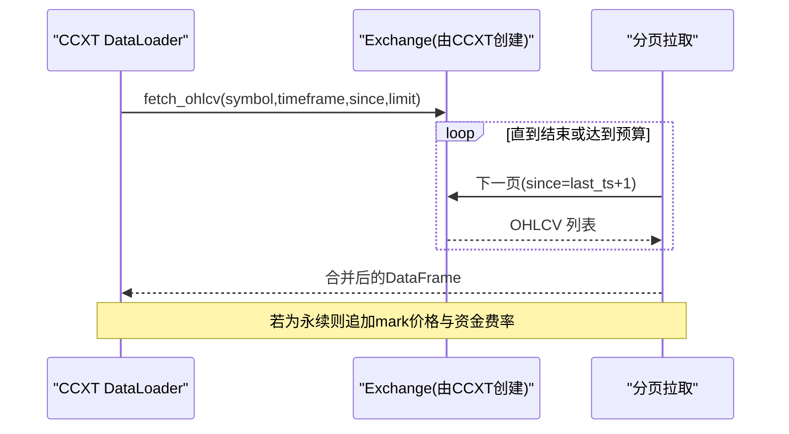
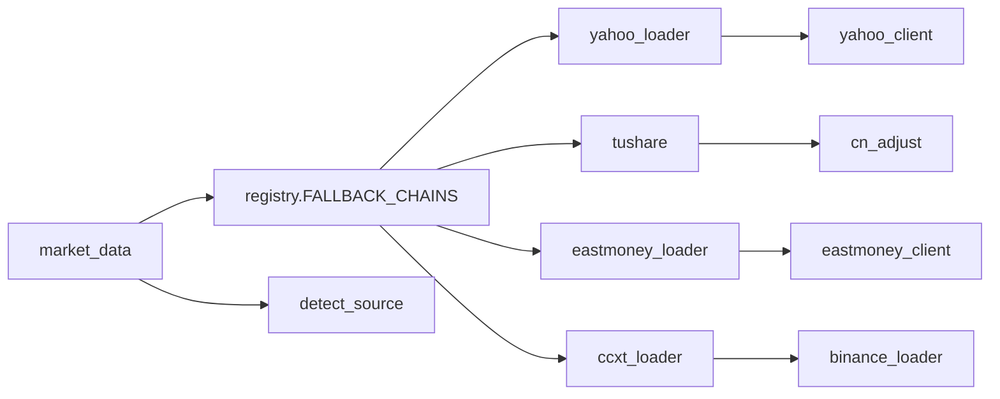

# 市场数据源

<cite>
**本文引用的文件**
- [agent/backtest/loaders/registry.py](file://agent/backtest/loaders/registry.py)
- [agent/backtest/loaders/base.py](file://agent/backtest/loaders/base.py)
- [agent/src/market_data.py](file://agent/src/market_data.py)
- [agent/backtest/loaders/yahoo_loader.py](file://agent/backtest/loaders/yahoo_loader.py)
- [agent/backtest/loaders/yahoo_client.py](file://agent/backtest/loaders/yahoo_client.py)
- [agent/backtest/loaders/tushare.py](file://agent/backtest/loaders/tushare.py)
- [agent/backtest/loaders/eastmoney_loader.py](file://agent/backtest/loaders/eastmoney_loader.py)
- [agent/backtest/loaders/eastmoney_client.py](file://agent/backtest/loaders/eastmoney_client.py)
- [agent/backtest/loaders/ccxt_loader.py](file://agent/backtest/loaders/ccxt_loader.py)
- [agent/backtest/loaders/binance_loader.py](file://agent/backtest/loaders/binance_loader.py)
- [agent/backtest/loaders/cn_adjust.py](file://agent/backtest/loaders/cn_adjust.py)
- [agent/src/config/env_schema.py](file://agent/src/config/env_schema.py)
</cite>

## 目录
1. [简介](#简介)
2. [项目结构](#项目结构)
3. [核心组件](#核心组件)
4. [架构总览](#架构总览)
5. [详细组件分析](#详细组件分析)
6. [依赖关系分析](#依赖关系分析)
7. [性能考虑](#性能考虑)
8. [故障排查指南](#故障排查指南)
9. [结论](#结论)
10. [附录](#附录)

## 简介
本文件为 Vibe-Trading 的市场数据源集成提供综合文档，覆盖 Yahoo Finance、Tushare、Binance、CCXT、东方财富等主流数据源的接入方式、API 特性与配置项；说明各数据源的数据格式差异、时区处理与复权因子计算；描述数据获取策略、频率限制与错误恢复机制；并给出多市场同步的最佳实践（一致性保证与增量更新）、常见问题诊断方法与性能调优技巧。

## 项目结构
Vibe-Trading 将“数据源加载器”抽象为统一接口，并通过注册表与回退链实现跨市场的自动选择与容错。关键路径：
- 统一入口与路由：market_data.fetch_market_data
- 加载器注册与回退：loaders.registry
- 通用能力：重试/预算/缓存/校验：loaders.base
- 具体数据源：yahoo_loader、tushare、eastmoney_loader、ccxt_loader、binance_loader
- 客户端层：yahoo_client、eastmoney_client
- 复权因子：cn_adjust
- 配置中心：env_schema（环境变量与默认值）

图表来源
- [agent/src/market_data.py:97-223](file://agent/src/market_data.py#L97-L223)
- [agent/backtest/loaders/registry.py:136-193](file://agent/backtest/loaders/registry.py#L136-L193)
- [agent/backtest/loaders/yahoo_loader.py:173-271](file://agent/backtest/loaders/yahoo_loader.py#L173-L271)
- [agent/backtest/loaders/tushare.py:116-202](file://agent/backtest/loaders/tushare.py#L116-L202)
- [agent/backtest/loaders/eastmoney_loader.py:51-143](file://agent/backtest/loaders/eastmoney_loader.py#L51-L143)
- [agent/backtest/loaders/ccxt_loader.py:184-308](file://agent/backtest/loaders/ccxt_loader.py#L184-L308)
- [agent/backtest/loaders/binance_loader.py:23-44](file://agent/backtest/loaders/binance_loader.py#L23-L44)

章节来源
- [agent/src/market_data.py:16-63](file://agent/src/market_data.py#L16-L63)
- [agent/backtest/loaders/registry.py:23-155](file://agent/backtest/loaders/registry.py#L23-L155)

## 核心组件
- DataLoaderProtocol：定义统一的 fetch 接口与元信息（name/markets/requires_auth），所有数据源必须实现 is_available 与 fetch。
- 注册表与回退链：按市场类型维护有序的回退顺序，优先使用对 IP 封禁更友好的公开端点，再降级到密钥型 REST。
- 通用工具：日期校验、OHLC 不变量校验、带预算的重试、本地 Parquet 缓存、JSON 安全序列化。
- 市场路由：根据符号后缀与模式匹配推断首选数据源，并在不可用时沿回退链尝试。

章节来源
- [agent/backtest/loaders/base.py:27-119](file://agent/backtest/loaders/base.py#L27-L119)
- [agent/backtest/loaders/base.py:163-236](file://agent/backtest/loaders/base.py#L163-L236)
- [agent/backtest/loaders/base.py:243-439](file://agent/backtest/loaders/base.py#L243-L439)
- [agent/backtest/loaders/registry.py:136-193](file://agent/backtest/loaders/registry.py#L136-L193)
- [agent/src/market_data.py:16-63](file://agent/src/market_data.py#L16-L63)

## 架构总览
下图展示从请求到数据返回的端到端流程，包括自动路由、回退链、加载器执行与客户端访问。

图表来源
- [agent/src/market_data.py:97-223](file://agent/src/market_data.py#L97-L223)
- [agent/backtest/loaders/registry.py:158-193](file://agent/backtest/loaders/registry.py#L158-L193)
- [agent/backtest/loaders/yahoo_client.py:156-205](file://agent/backtest/loaders/yahoo_client.py#L156-L205)
- [agent/backtest/loaders/eastmoney_client.py:269-324](file://agent/backtest/loaders/eastmoney_client.py#L269-L324)
- [agent/backtest/loaders/ccxt_loader.py:426-501](file://agent/backtest/loaders/ccxt_loader.py#L426-L501)

## 详细组件分析

### Yahoo Finance（yahoo_loader + yahoo_client）
- 适用市场：美股、港股、印度、加拿大、期货/外汇后缀约定
- 认证：无需认证，通过共享节流会话降低 IP 限流风险
- 时间粒度映射：1D/1H/4H→1h/1W/1M 等；分钟/小时保持真实时间戳，日及以上归一至午夜
- 时区处理：交易时间为 UTC 秒级时间戳，转为无时区 DatetimeIndex；非日内区间归一化对齐
- 数据格式：open/high/low/close/volume，缺失字段补齐或丢弃无效条
- 客户端特性：v8 chart 端点；quoteSummary/options 需要 cookie+crumb 握手，401 自动刷新并重试一次
- 缓存：支持 opt-in 本地 parquet 缓存，键包含 source/symbol/timeframe/date range/fields

图表来源
- [agent/backtest/loaders/yahoo_loader.py:44-73](file://agent/backtest/loaders/yahoo_loader.py#L44-L73)
- [agent/backtest/loaders/yahoo_loader.py:125-170](file://agent/backtest/loaders/yahoo_loader.py#L125-L170)
- [agent/backtest/loaders/yahoo_client.py:156-205](file://agent/backtest/loaders/yahoo_client.py#L156-L205)
- [agent/backtest/loaders/base.py:301-439](file://agent/backtest/loaders/base.py#L301-L439)

章节来源
- [agent/backtest/loaders/yahoo_loader.py:173-271](file://agent/backtest/loaders/yahoo_loader.py#L173-L271)
- [agent/backtest/loaders/yahoo_client.py:71-93](file://agent/backtest/loaders/yahoo_client.py#L71-L93)
- [agent/backtest/loaders/yahoo_client.py:95-153](file://agent/backtest/loaders/yahoo_client.py#L95-L153)

### Tushare（A股/港股/基金/指数）
- 适用市场：A股、港股、期货、基金；分钟级需积分门槛
- 认证：需要 TUSHARE_TOKEN
- 数据格式：daily/fund_daily/index_daily/hk_daily；分钟级 stk_mins
- 复权因子：A股/基金使用前复权（qfq），指数与港股不调整
- 频率限制：识别配额拒绝关键词，采用固定间隔重试（约65秒内完成三次）
- 基本面字段：可按 fields 合并 daily_basic 指标（仅股票）

图表来源
- [agent/backtest/loaders/tushare.py:204-265](file://agent/backtest/loaders/tushare.py#L204-L265)
- [agent/backtest/loaders/cn_adjust.py:27-78](file://agent/backtest/loaders/cn_adjust.py#L27-L78)
- [agent/backtest/loaders/tushare.py:51-79](file://agent/backtest/loaders/tushare.py#L51-L79)

章节来源
- [agent/backtest/loaders/tushare.py:116-202](file://agent/backtest/loaders/tushare.py#L116-L202)
- [agent/backtest/loaders/tushare.py:322-382](file://agent/backtest/loaders/tushare.py#L322-L382)
- [agent/backtest/loaders/cn_adjust.py:1-78](file://agent/backtest/loaders/cn_adjust.py#L1-L78)

### 东方财富（Eastmoney）
- 适用市场：A股、港股、美股（通过搜索发现市场前缀并缓存）
- 认证：无需认证，但严格 IP 限流，统一走节流客户端
- 数据格式：push2his kline；secid 地址方案（A股/港股/美股）
- 时间粒度：1D/1W/1M/1m/5m/15m/30m/1H/60m
- 复权：fqt=1 表示前复权（客户端参数）

图表来源
- [agent/backtest/loaders/eastmoney_client.py:208-236](file://agent/backtest/loaders/eastmoney_client.py#L208-L236)
- [agent/backtest/loaders/eastmoney_client.py:269-324](file://agent/backtest/loaders/eastmoney_client.py#L269-L324)
- [agent/backtest/loaders/eastmoney_loader.py:112-143](file://agent/backtest/loaders/eastmoney_loader.py#L112-L143)

章节来源
- [agent/backtest/loaders/eastmoney_loader.py:51-143](file://agent/backtest/loaders/eastmoney_loader.py#L51-L143)
- [agent/backtest/loaders/eastmoney_client.py:1-325](file://agent/backtest/loaders/eastmoney_client.py#L1-L325)

### CCXT（加密货币通用）
- 适用市场：加密货币现货与合约（USD-M 永续）
- 认证：公共数据无需 API Key；合约保证金档位需外部 artifact
- 数据格式：OHLCV；永续额外包含 mark price、资金费率、结算时间
- 分页与预算：每页 limit=1000，设置 CCXT_TIMEOUT_MS 与 CCXT_FETCH_BUDGET_S 控制超时与总预算
- 代理：支持 ALL_PROXY/HTTP_PROXY/HTTPS_PROXY
- 符号解析：BASE-USDT-PERP → swap；否则 spot

图表来源
- [agent/backtest/loaders/ccxt_loader.py:226-308](file://agent/backtest/loaders/ccxt_loader.py#L226-L308)
- [agent/backtest/loaders/ccxt_loader.py:426-501](file://agent/backtest/loaders/ccxt_loader.py#L426-L501)
- [agent/backtest/loaders/ccxt_loader.py:310-372](file://agent/backtest/loaders/ccxt_loader.py#L310-L372)

章节来源
- [agent/backtest/loaders/ccxt_loader.py:184-308](file://agent/backtest/loaders/ccxt_loader.py#L184-L308)
- [agent/backtest/loaders/ccxt_loader.py:374-424](file://agent/backtest/loaders/ccxt_loader.py#L374-L424)

### Binance（专用 CCXT 封装）
- 作用：在加密回退链中作为独立源与 OKX 并列，避免被单一源耗尽
- 行为：强制使用 binance/binanceusdm，继承 CCXT 的速率限制与代理配置

章节来源
- [agent/backtest/loaders/binance_loader.py:1-45](file://agent/backtest/loaders/binance_loader.py#L1-L45)

### 数据格式与时区处理要点
- 统一输出：trade_date 索引 + open/high/low/close/volume 数值列
- Yahoo：UTC 秒级时间戳转无时区；非日内归一至午夜对齐
- Eastmoney：字符串日期转 datetime；支持 fqt 前复权
- Tushare：A股/基金使用前复权；指数/港股不调整；分钟级无复权
- CCXT：毫秒时间戳转 datetime；永续附加 mark/funding 列

章节来源
- [agent/backtest/loaders/yahoo_loader.py:125-170](file://agent/backtest/loaders/yahoo_loader.py#L125-L170)
- [agent/backtest/loaders/eastmoney_loader.py:145-177](file://agent/backtest/loaders/eastmoney_loader.py#L145-L177)
- [agent/backtest/loaders/tushare.py:204-265](file://agent/backtest/loaders/tushare.py#L204-L265)
- [agent/backtest/loaders/ccxt_loader.py:426-501](file://agent/backtest/loaders/ccxt_loader.py#L426-L501)

## 依赖关系分析
- 路由依赖：market_data.detect_source 决定首选源；_detect_market 决定回退链
- 回退链：按市场类型排序，优先低封禁风险源（如腾讯/Yahoo/Eastmoney），再落到密钥型（Tushare/Finnhub/AlphaVantage/Tiingo/FMP）
- 加载器耦合：Binance 复用 CCXT；Yahoo/Eastmoney 各自客户端；Tushare 依赖 cn_adjust
- 配置依赖：DataConfig 集中管理各类 Token/超时/预算/代理开关

图表来源
- [agent/src/market_data.py:16-63](file://agent/src/market_data.py#L16-L63)
- [agent/backtest/loaders/registry.py:136-155](file://agent/backtest/loaders/registry.py#L136-L155)
- [agent/backtest/loaders/binance_loader.py:23-44](file://agent/backtest/loaders/binance_loader.py#L23-L44)

章节来源
- [agent/backtest/loaders/registry.py:136-193](file://agent/backtest/loaders/registry.py#L136-L193)
- [agent/src/config/env_schema.py:153-198](file://agent/src/config/env_schema.py#L153-L198)

## 性能考虑
- 节流与限速
  - Yahoo/Eastmoney：进程级最小间隔与共享会话，避免 IP 封禁
  - CCXT：enableRateLimit=True，超时与预算控制
  - Tushare：配额拒绝识别与退避重试
- 预算与重试
  - retry_with_budget：基于单调时钟的硬截止与指数退避，仅对声明的瞬时异常重试
  - check_budget：分页间快速失败，防止长尾挂起
- 本地缓存
  - 基于内容寻址的 parquet 缓存，仅对已收盘区间生效；读写失败不影响主流程
- 批量与采样
  - cap_rows：对返回记录进行步长采样，控制工具负载
- 代理与网络
  - CCXT 支持系统代理变量；Yahoo/Eastmoney 通过共享客户端统一处理

章节来源
- [agent/backtest/loaders/base.py:163-236](file://agent/backtest/loaders/base.py#L163-L236)
- [agent/backtest/loaders/base.py:243-439](file://agent/backtest/loaders/base.py#L243-L439)
- [agent/backtest/loaders/ccxt_loader.py:50-57](file://agent/backtest/loaders/ccxt_loader.py#L50-L57)
- [agent/backtest/loaders/yahoo_client.py:44-68](file://agent/backtest/loaders/yahoo_client.py#L44-L68)
- [agent/backtest/loaders/eastmoney_client.py:32-40](file://agent/backtest/loaders/eastmoney_client.py#L32-L40)
- [agent/src/market_data.py:66-84](file://agent/src/market_data.py#L66-L84)

## 故障排查指南
- 无可用数据源
  - 现象：NoAvailableSourceError
  - 排查：检查市场回退链、凭据（如 TUSHARE_TOKEN）、网络与代理
- 配额/限频
  - Tushare：出现“每分钟/每天/抽取/频率”等关键字即触发退避重试
  - Yahoo/Eastmoney：观察日志中的节流提示，适当增大最小间隔
- 401 未授权（Yahoo）
  - 现象：quoteSummary/options 返回 401
  - 处理：客户端自动刷新 crumb/cookies 并重试一次
- 历史不完整（CCXT）
  - 现象：请求范围大于实际返回且命中页上限
  - 处理：扩大预算或缩小时间窗；检查交易所可用性
- 复权因子缺失（Tushare）
  - 现象：adj_factor 为空或不可用
  - 处理：该标的将被丢弃，避免在污染价格上回测
- 本地缓存问题
  - 现象：读取失败或损坏
  - 处理：忽略并回退到在线拉取；检查缓存根目录权限与磁盘空间

章节来源
- [agent/backtest/loaders/tushare.py:18-48](file://agent/backtest/loaders/tushare.py#L18-L48)
- [agent/backtest/loaders/yahoo_client.py:95-153](file://agent/backtest/loaders/yahoo_client.py#L95-L153)
- [agent/backtest/loaders/ccxt_loader.py:493-501](file://agent/backtest/loaders/ccxt_loader.py#L493-L501)
- [agent/backtest/loaders/base.py:475-533](file://agent/backtest/loaders/base.py#L475-L533)

## 结论
Vibe-Trading 通过统一的数据加载协议、注册表与回退链，实现了跨市场、跨数据源的稳健集成。Yahoo、东方财富、Tushare、CCXT/Binance 各有侧重：前者适合公开免费数据与高并发场景，后者提供丰富的加密资产与合约数据。结合节流、预算、重试与本地缓存，系统在稳定性与性能之间取得平衡。建议在生产环境开启缓存、合理设置预算与间隔，并根据市场特征选择合适的回退顺序。

## 附录

### 配置项速查（数据相关）
- TUSHARE_TOKEN：Tushare 令牌
- CCXT_EXCHANGE：CCXT 交易所标识（默认 binance）
- CCXT_TIMEOUT_MS / CCXT_FETCH_BUDGET_S：CCXT 超时与总预算
- VIBE_TRADING_DATA_CACHE / VIBE_TRADING_DATA_CACHE_ROOT：是否启用与缓存根路径
- VIBE_TRADING_YAHOO_MIN_INTERVAL / VIBE_TRADING_EASTMONEY_MIN_INTERVAL：Yahoo/东方财富最小请求间隔
- FINNHUB_API_KEY / ALPHAVANTAGE_API_KEY / TIINGO_API_KEY / FMP_API_KEY：其他密钥型数据源

章节来源
- [agent/src/config/env_schema.py:153-198](file://agent/src/config/env_schema.py#L153-L198)

### 多市场同步最佳实践
- 一致性保证
  - 统一输出 schema（trade_date + OHLCV），必要时做 OHLC 不变量校验
  - 对跨源合并场景，使用同一时间基准（如午夜对齐）与去重策略
- 增量更新
  - 以 end_date 为边界，仅拉取新增区间；利用本地缓存避免重复下载
  - 对活跃标的（当日）不缓存，避免钉住未完成 K 线
- 回退策略
  - 明确首选源与同市场回退链；对 local/qveris 等本地源禁止静默降级到网络源
- 监控与可观测性
  - 开启 _provenance 记录实际使用的源与是否发生回退
  - 统计 _unresolved 集合，定位无法解析的符号

章节来源
- [agent/src/market_data.py:198-223](file://agent/src/market_data.py#L198-L223)
- [agent/backtest/loaders/base.py:328-439](file://agent/backtest/loaders/base.py#L328-L439)
- [agent/backtest/loaders/registry.py:117-124](file://agent/backtest/loaders/registry.py#L117-L124)