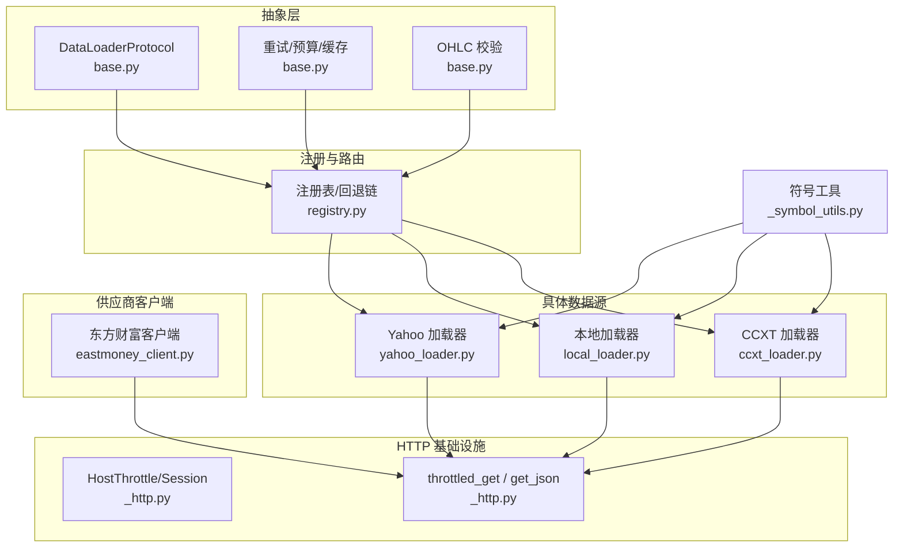
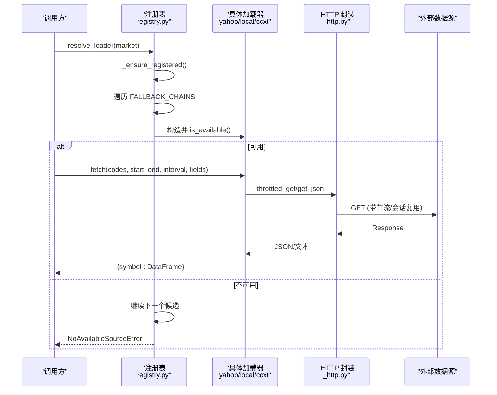
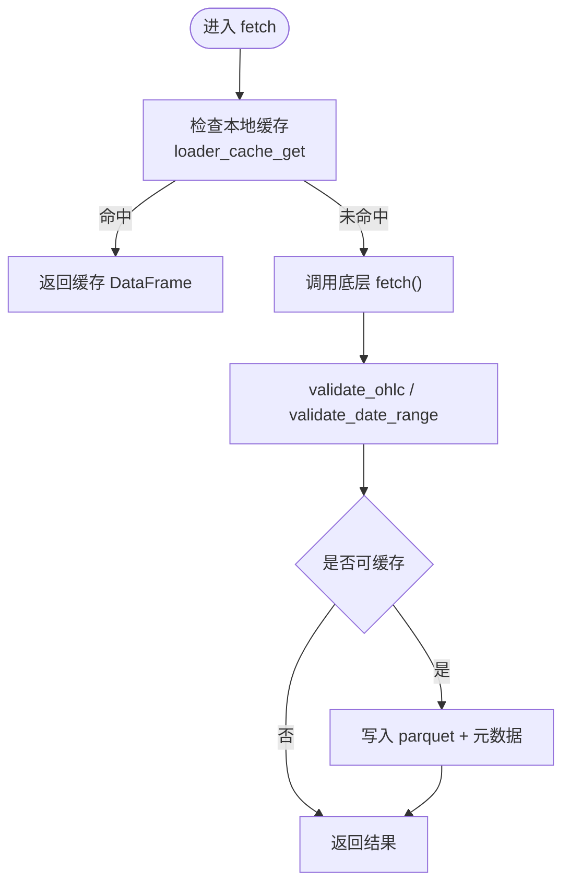
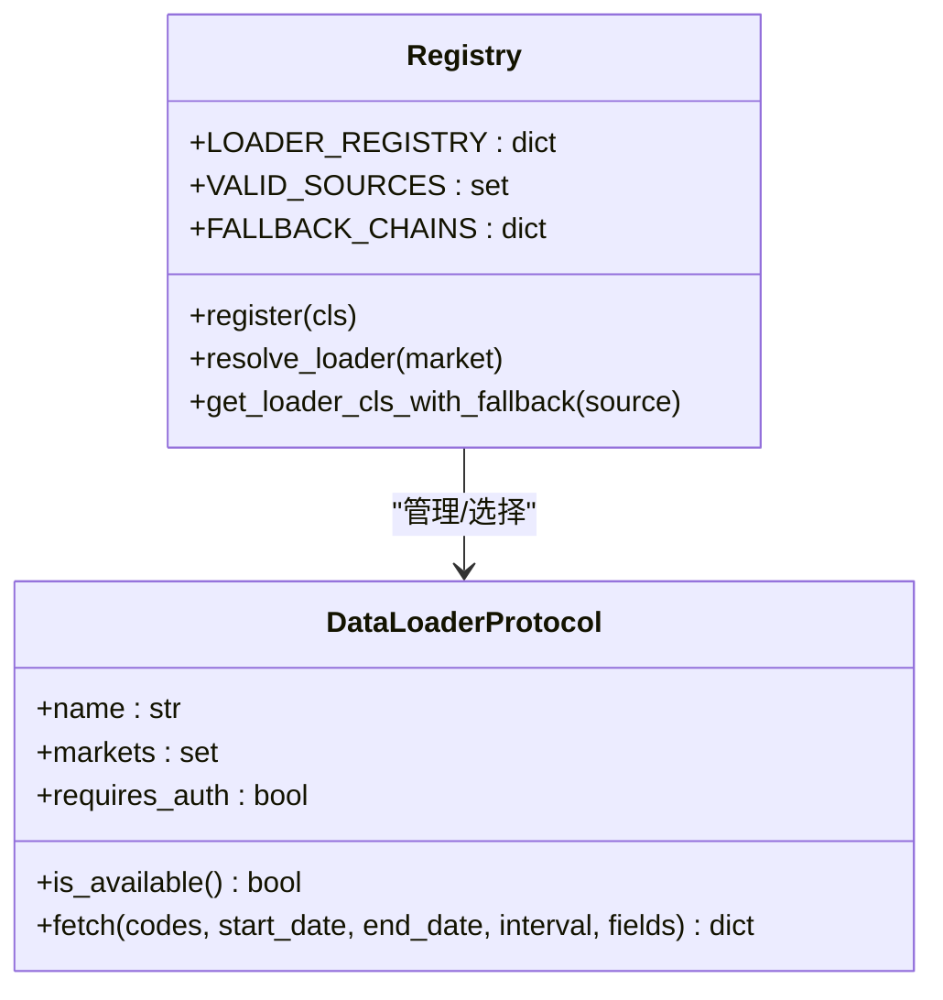
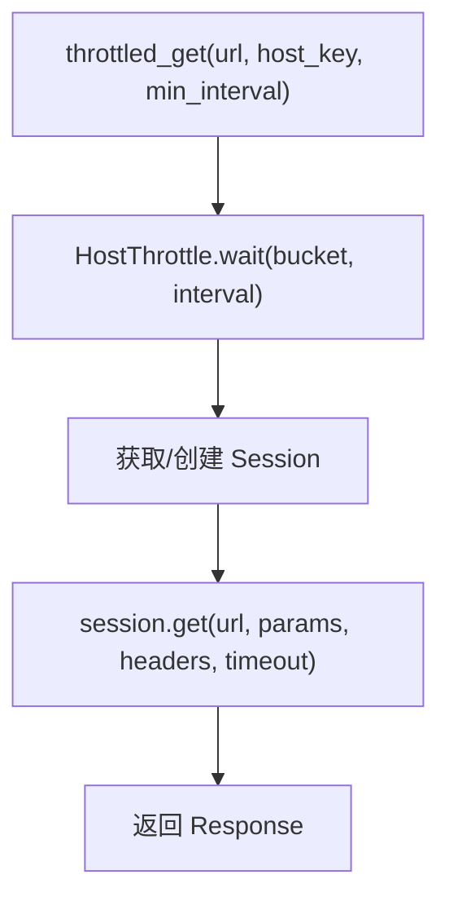
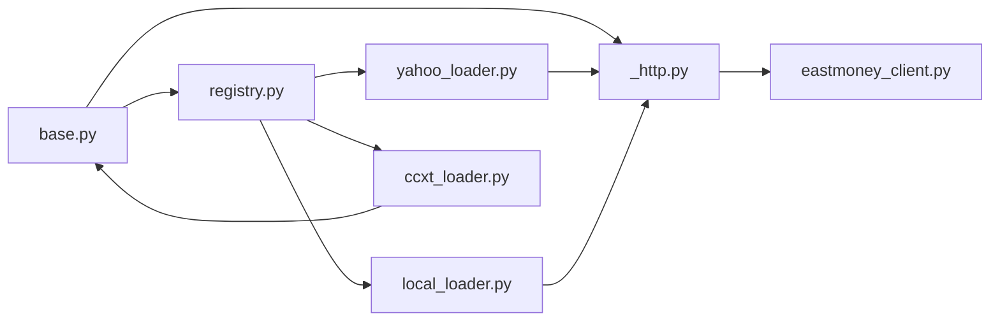

# 数据源架构设计

<cite>
**本文引用的文件**
- [base.py](file://agent/backtest/loaders/base.py)
- [registry.py](file://agent/backtest/loaders/registry.py)
- [_http.py](file://agent/backtest/loaders/_http.py)
- [_symbol_utils.py](file://agent/backtest/loaders/_symbol_utils.py)
- [yahoo_loader.py](file://agent/backtest/loaders/yahoo_loader.py)
- [local_loader.py](file://agent/backtest/loaders/local_loader.py)
- [ccxt_loader.py](file://agent/backtest/loaders/ccxt_loader.py)
- [eastmoney_client.py](file://agent/backtest/loaders/eastmoney_client.py)
</cite>

## 目录
1. [简介](#简介)
2. [项目结构](#项目结构)
3. [核心组件](#核心组件)
4. [架构总览](#架构总览)
5. [详细组件分析](#详细组件分析)
6. [依赖关系分析](#依赖关系分析)
7. [性能考虑](#性能考虑)
8. [故障诊断与监控](#故障诊断与监控)
9. [结论](#结论)
10. [附录：自定义数据源开发指南](#附录自定义数据源开发指南)

## 简介
本技术文档面向 Vibe-Trading 的数据源架构，聚焦于数据加载器的抽象层设计、注册机制与统一接口规范；说明 HTTP 请求封装、符号工具函数与通用数据处理组件的实现原理；阐述数据源的插件化架构（动态加载、版本管理与依赖解析）；提供自定义数据源的开发指南（接口定义、数据转换与错误处理模式）；并总结性能优化策略（连接池管理、请求合并与缓存机制）以及健康检查、监控指标与故障诊断工具的使用。

## 项目结构
数据源子系统位于 agent/backtest/loaders 目录下，采用“协议 + 注册表 + 具体实现”的分层组织方式：
- 抽象协议与通用能力：base.py 定义了 DataLoaderProtocol、重试/预算控制、OHLC 校验、本地缓存等。
- 注册与回退链：registry.py 维护全局注册表、市场级回退链与自动发现机制。
- HTTP 基础设施：_http.py 提供按主机桶的节流、会话复用与 JSON 获取。
- 符号工具：_symbol_utils.py 提供 ETF/LOF 前缀识别等通用符号判断。
- 具体数据源：如 yahoo_loader.py、local_loader.py、ccxt_loader.py 等，各自实现统一 fetch 接口。
- 第三方客户端：如 eastmoney_client.py，封装特定供应商的 HTTP 调用与字段映射。

图表来源
- [base.py:1-645](file://agent/backtest/loaders/base.py#L1-L645)
- [registry.py:1-249](file://agent/backtest/loaders/registry.py#L1-L249)
- [_http.py:1-180](file://agent/backtest/loaders/_http.py#L1-L180)
- [_symbol_utils.py:1-21](file://agent/backtest/loaders/_symbol_utils.py#L1-L21)
- [yahoo_loader.py:1-200](file://agent/backtest/loaders/yahoo_loader.py#L1-L200)
- [local_loader.py:1-200](file://agent/backtest/loaders/local_loader.py#L1-L200)
- [ccxt_loader.py:1-200](file://agent/backtest/loaders/ccxt_loader.py#L1-L200)
- [eastmoney_client.py:1-200](file://agent/backtest/loaders/eastmoney_client.py#L1-L200)

章节来源
- [base.py:1-645](file://agent/backtest/loaders/base.py#L1-L645)
- [registry.py:1-249](file://agent/backtest/loaders/registry.py#L1-L249)
- [_http.py:1-180](file://agent/backtest/loaders/_http.py#L1-L180)
- [_symbol_utils.py:1-21](file://agent/backtest/loaders/_symbol_utils.py#L1-L21)

## 核心组件
- 数据加载器协议与统一接口
  - DataLoaderProtocol 定义了 name、markets、requires_auth 属性及 is_available()、fetch(codes, start_date, end_date, interval, fields) 方法，所有数据源必须遵循该契约。
  - fetch 返回 {symbol: DataFrame}，DataFrame 包含 trade_date 索引与 OHLCV 列，保证跨源一致性。
- 注册机制与回退链
  - registry.py 通过 @register 装饰器将各加载器类注册到全局 LOADER_REGISTRY。
  - _ensure_registered() 在首次使用时懒加载所有已知 loader 模块，避免启动时强依赖缺失库。
  - FALLBACK_CHAINS 为每个市场类型定义有序的回退顺序，resolve_loader() 会遍历链并返回首个可用的加载器实例。
  - get_loader_cls_with_fallback() 支持按指定 source 查找，并在不可用时尝试同市场回退；对 local/qveris 等特殊源禁止静默降级。
- HTTP 请求封装
  - _http.py 提供 HostThrottle 按 host_key 进行最小间隔控制，避免触发 IP 限流；进程内 requests.Session 复用减少握手开销。
  - throttled_get/throttled_get_json 统一封装 GET 请求，合并默认 User-Agent，支持超时与参数透传。
- 符号工具函数
  - _symbol_utils.py 提供交易所上市 ETF/LOF 前缀识别，辅助不同加载器做符号适配与路由。
- 通用数据处理组件
  - base.py 提供 validate_date_range、validate_ohlc 等数据质量校验；提供 retry_with_budget/check_budget 用于带预算的重试；提供本地 parquet 缓存读写与 key 生成，支持内容寻址与元数据恢复。

章节来源
- [base.py:27-119](file://agent/backtest/loaders/base.py#L27-L119)
- [base.py:163-236](file://agent/backtest/loaders/base.py#L163-L236)
- [base.py:243-439](file://agent/backtest/loaders/base.py#L243-L439)
- [registry.py:23-155](file://agent/backtest/loaders/registry.py#L23-L155)
- [registry.py:158-249](file://agent/backtest/loaders/registry.py#L158-L249)
- [_http.py:46-152](file://agent/backtest/loaders/_http.py#L46-L152)
- [_symbol_utils.py:9-21](file://agent/backtest/loaders/_symbol_utils.py#L9-L21)

## 架构总览
下图展示了从上层调用到具体数据源的完整流程，包括注册发现、回退选择、HTTP 节流与数据标准化。

图表来源
- [registry.py:71-193](file://agent/backtest/loaders/registry.py#L71-L193)
- [_http.py:120-152](file://agent/backtest/loaders/_http.py#L120-L152)
- [yahoo_loader.py:173-200](file://agent/backtest/loaders/yahoo_loader.py#L173-L200)
- [local_loader.py:129-200](file://agent/backtest/loaders/local_loader.py#L129-L200)
- [ccxt_loader.py:184-200](file://agent/backtest/loaders/ccxt_loader.py#L184-L200)

## 详细组件分析

### 抽象层与通用能力（base.py）
- 统一协议
  - DataLoaderProtocol 强制 name/markets/requires_auth/is_available/fetch 契约，确保多源一致接入。
- 数据质量校验
  - validate_date_range 校验起止日期合法性。
  - validate_ohlc 执行结构性与正负价格约束，支持 drop/warn/raise 策略，保障下游引擎稳定性。
- 重试与预算
  - check_budget/retry_with_budget 以 wall-clock 截止时间与指数退避实现有限重试，避免无限挂起。
- 本地缓存
  - 基于内容寻址的 key（source/symbol/timeframe/start/end/fields），使用 parquet 存储与 duckdb 读取，附带元数据恢复 index dtype 与列名。
  - cached_loader_fetch 提供“命中即返回，否则 fetch 并写入”的便捷封装。

图表来源
- [base.py:343-439](file://agent/backtest/loaders/base.py#L343-L439)
- [base.py:31-119](file://agent/backtest/loaders/base.py#L31-L119)

章节来源
- [base.py:27-119](file://agent/backtest/loaders/base.py#L27-L119)
- [base.py:163-236](file://agent/backtest/loaders/base.py#L163-L236)
- [base.py:243-439](file://agent/backtest/loaders/base.py#L243-L439)

### 注册与回退机制（registry.py）
- 动态加载
  - _ensure_registered() 在首次访问时导入所有已知 loader 模块，触发 @register 装饰器完成注册；失败被静默忽略，保证健壮性。
- 回退链
  - 针对 a_share/us_equity/hk_equity/crypto 等市场定义优先级链，优先选择轻量/低封禁风险源，再逐步降级至付费或受限源。
- 解析与降级
  - resolve_loader() 遍历链，构造实例并调用 is_available()，返回首个可用者。
  - get_loader_cls_with_fallback() 支持按 source 精确匹配，必要时在同市场内回退；对 local/qveris 明确禁止静默网络降级。

图表来源
- [registry.py:23-155](file://agent/backtest/loaders/registry.py#L23-L155)
- [registry.py:158-249](file://agent/backtest/loaders/registry.py#L158-L249)
- [base.py:618-645](file://agent/backtest/loaders/base.py#L618-L645)

章节来源
- [registry.py:23-155](file://agent/backtest/loaders/registry.py#L23-L155)
- [registry.py:158-249](file://agent/backtest/loaders/registry.py#L158-L249)

### HTTP 请求封装（_http.py）
- 主机级节流
  - HostThrottle 维护每个 bucket 的最后触发时间，计算下次允许触发的时间并加入随机抖动，避免并发同步风暴。
- 会话复用
  - 按 host_key 缓存 requests.Session，复用 TCP/TLS 连接，降低握手成本。
- 统一接口
  - throttled_get/throttled_get_json 提供最小化的 GET 封装，合并默认 UA，支持超时与参数透传。

图表来源
- [_http.py:46-152](file://agent/backtest/loaders/_http.py#L46-L152)

章节来源
- [_http.py:1-180](file://agent/backtest/loaders/_http.py#L1-180)

### 符号工具（_symbol_utils.py）
- 提供交易所上市 ETF/LOF 前缀识别逻辑，便于加载器在符号层面做差异化处理（例如 A 股 ETF 代码段）。

章节来源
- [_symbol_utils.py:1-21](file://agent/backtest/loaders/_symbol_utils.py#L1-L21)

### Yahoo 数据源（yahoo_loader.py）
- 特点：免费、无需认证，直接 HTTP 访问 Yahoo 图表端点，覆盖 US/HK/印度/韩国/加拿大等权益资产。
- 区间映射：将项目区间（1D/1H/4H/1W/1M）映射到 Yahoo 兼容字符串；分钟/小时粒度保留真实时间戳，日及以上归一化为午夜对齐。
- 数据清洗：构建 DataFrame 后裁剪到请求窗口，填充缺失列，数值转换与去空行。

章节来源
- [yahoo_loader.py:1-200](file://agent/backtest/loaders/yahoo_loader.py#L1-L200)

### 本地数据源（local_loader.py）
- 配置驱动：从 ~/.vibe-trading/data-bridge/config.yaml 读取 CSV/Parquet/DuckDB 数据源映射。
- 列映射与日期解析：支持自定义列名与日期格式，统一转换为 UTC 无时区 DatetimeIndex。
- 重采样：根据目标区间对数据进行降采样聚合（OHLCV 标准聚合），无法上采样时发出警告并返回原数据。
- 数据校验：调用 validate_ohlc 保证 OHLC 结构正确。

章节来源
- [local_loader.py:1-200](file://agent/backtest/loaders/local_loader.py#L1-L200)

### CCXT 数据源（ccxt_loader.py）
- 特点：通过 CCXT 统一接入 100+ 加密货币交易所，默认 Binance，支持代理与环境变量配置。
- 安全与稳定：限制单次请求超时与整体预算，结合 base.py 的重试/预算机制防止长时间挂起。
- 合约与现货：解析永续合约符号（如 BTC-USDT-PERP）并区分 spot/swap 类型。

章节来源
- [ccxt_loader.py:1-200](file://agent/backtest/loaders/ccxt_loader.py#L1-L200)

### 东方财富客户端（eastmoney_client.py）
- 特点：封装东方财富 push2his kline 与 suggest 搜索，通过 _http.py 的节流与会话复用避免 IP 封禁。
- secid 解析：A 股/港股/美股等不同市场的 secid 规则与缓存策略，提升重复查询效率。
- JSONP 兼容：对可能包裹 JSONP 的响应体进行安全剥离。

章节来源
- [eastmoney_client.py:1-200](file://agent/backtest/loaders/eastmoney_client.py#L1-L200)

## 依赖关系分析
- 耦合度
  - 加载器仅依赖 base 协议与 _http 基础设施，保持低耦合；通过 registry 解耦选择逻辑。
- 间接依赖
  - 部分加载器依赖第三方库（如 ccxt、yfinance），通过 is_available() 与 try/import 保护，避免启动失败。
- 循环依赖
  - 当前分层清晰，未见循环导入；注册表仅在首次使用时导入各模块。

图表来源
- [base.py:1-645](file://agent/backtest/loaders/base.py#L1-L645)
- [registry.py:1-249](file://agent/backtest/loaders/registry.py#L1-L249)
- [_http.py:1-180](file://agent/backtest/loaders/_http.py#L1-L180)
- [yahoo_loader.py:1-200](file://agent/backtest/loaders/yahoo_loader.py#L1-L200)
- [local_loader.py:1-200](file://agent/backtest/loaders/local_loader.py#L1-L200)
- [ccxt_loader.py:1-200](file://agent/backtest/loaders/ccxt_loader.py#L1-L200)
- [eastmoney_client.py:1-200](file://agent/backtest/loaders/eastmoney_client.py#L1-L200)

章节来源
- [registry.py:71-115](file://agent/backtest/loaders/registry.py#L71-L115)
- [ccxt_loader.py:184-200](file://agent/backtest/loaders/ccxt_loader.py#L184-L200)

## 性能考虑
- 连接池与会话复用
  - _http.py 按 host_key 复用 requests.Session，减少 TCP/TLS 握手与证书验证开销。
- 请求节流与抖动
  - HostThrottle 保证同一 host 的最小间隔，加入随机抖动避免并发同步；可通过环境变量调整最小间隔。
- 重试与预算
  - retry_with_budget 结合 check_budget 实现有限重试与硬截止，避免长尾延迟影响整体吞吐。
- 本地缓存
  - 基于 parquet 的内容寻址缓存，命中即返回；写路径原子替换，读路径异常降级；仅对已结算区间缓存。
- 数据标准化与重采样
  - local_loader 对本地文件进行重采样以满足目标区间，避免上层多次 resample 造成重复计算。

[本节为通用性能建议，不直接分析具体文件]

## 故障诊断与监控
- 健康检查
  - 各加载器实现 is_available()，注册表据此判定可用性；对于依赖外部库的加载器（如 ccxt），在构造或初始化阶段捕获异常并视为不可用。
- 日志与告警
  - 关键路径均记录日志：注册失败、构造失败、缓存读写失败、OHLC 校验失败、节流等待等，便于定位问题。
- 常见错误与处理
  - NoAvailableSourceError：当某市场所有候选不可用时抛出，需检查网络与 API Token。
  - TimeoutError：重试耗尽或预算超时时抛出，需检查网络状况或增大预算。
  - 数据质量问题：validate_ohlc 会丢弃或拒绝非法 OHLC 行，建议在数据入库前调用。
- 监控指标建议
  - 请求耗时分布、节流等待时长、缓存命中率、重试次数、失败率（按源与市场维度）。
  - 可通过日志聚合系统采集上述指标，设置阈值告警。

章节来源
- [registry.py:158-249](file://agent/backtest/loaders/registry.py#L158-L249)
- [base.py:163-236](file://agent/backtest/loaders/base.py#L163-L236)
- [base.py:343-439](file://agent/backtest/loaders/base.py#L343-L439)

## 结论
Vibe-Trading 的数据源架构通过清晰的协议抽象、健壮的注册与回退机制、统一的 HTTP 封装与通用的数据处理能力，实现了高内聚、低耦合的可插拔数据源体系。其设计兼顾了易用性与鲁棒性：既支持免费公共源快速接入，也兼容付费与本地数据；通过节流、重试、缓存等手段保障性能与稳定性；并通过严格的数据校验与完善的日志体系支撑运维与排障。

[本节为总结性内容，不直接分析具体文件]

## 附录：自定义数据源开发指南
- 接口定义
  - 新建一个 Python 模块，实现 DataLoader 类，继承 DataLoaderProtocol（或直接满足协议要求）。
  - 必须声明 name、markets、requires_auth，并实现 is_available() 与 fetch()。
  - fetch() 返回 {symbol: DataFrame}，DataFrame 包含 trade_date 索引与 open/high/low/close/volume 列。
- 数据转换
  - 使用 base.validate_date_range 与 base.validate_ohlc 进行输入输出校验。
  - 如需本地文件读取，参考 local_loader 的列映射与日期解析逻辑。
  - 如需 HTTP 请求，使用 _http.throttled_get 或 throttled_get_json，合理设置 host_key 与 min_interval。
- 错误处理模式
  - 对外部不稳定调用使用 base.retry_with_budget 与 check_budget，限定最大重试次数与截止时间。
  - 对不可恢复的错误直接抛出，交由上层统一处理；对可恢复的网络错误纳入重试。
- 注册与回退
  - 使用 @register 装饰器将加载器类注册到全局注册表。
  - 若希望参与市场级回退，需在 markets 中声明所属市场；注册表会自动将其纳入对应回退链。
- 版本管理与依赖
  - 若依赖可选第三方库，请在 is_available() 中进行存在性检查，避免启动失败。
  - 对配置或数据格式变更，可在缓存 key 或元数据中加入版本号，确保向后兼容。
- 示例路径
  - 参考 yahoo_loader.py、local_loader.py、ccxt_loader.py 的具体实现，了解如何组合基础能力完成数据获取与标准化。

章节来源
- [base.py:618-645](file://agent/backtest/loaders/base.py#L618-L645)
- [registry.py:62-68](file://agent/backtest/loaders/registry.py#L62-L68)
- [yahoo_loader.py:173-200](file://agent/backtest/loaders/yahoo_loader.py#L173-L200)
- [local_loader.py:129-200](file://agent/backtest/loaders/local_loader.py#L129-L200)
- [ccxt_loader.py:184-200](file://agent/backtest/loaders/ccxt_loader.py#L184-L200)