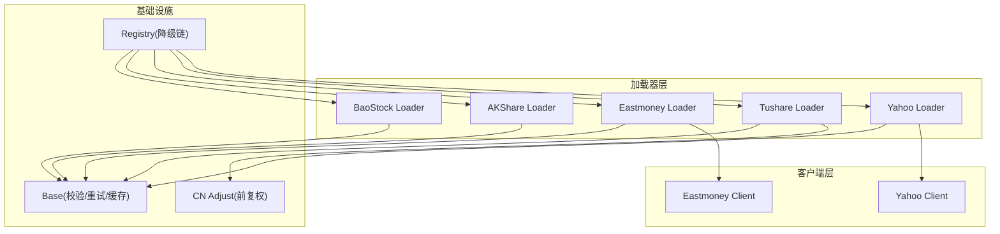
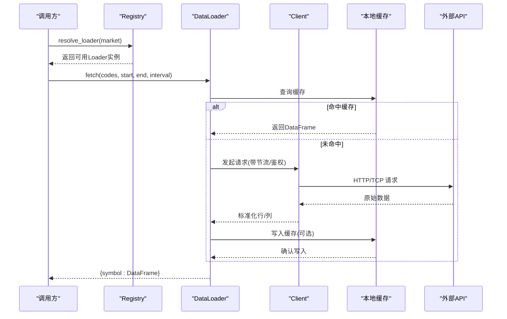
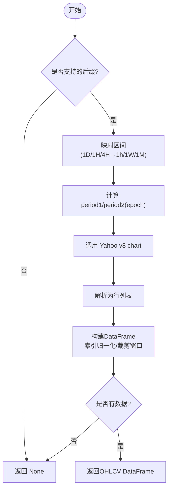
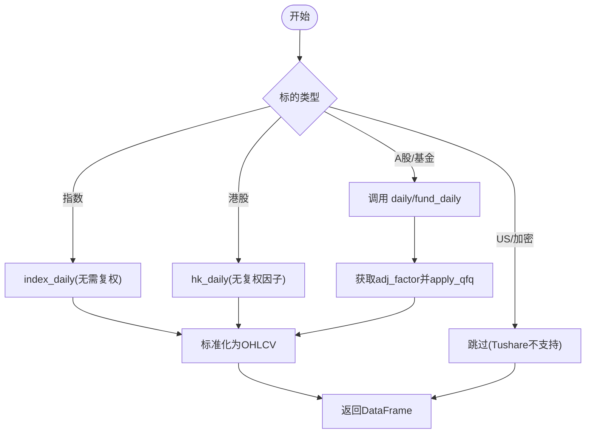
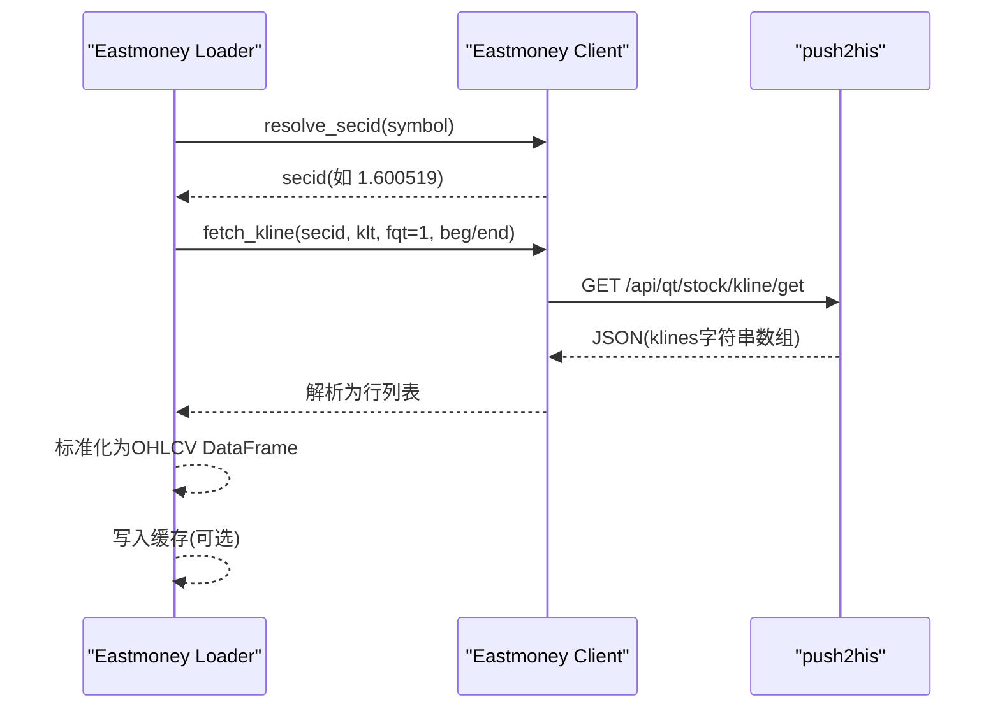
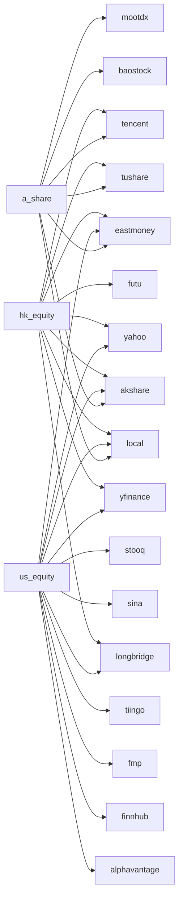

# 股票市场数据源

<cite>
**本文引用的文件**
- [agent/backtest/loaders/yahoo_loader.py](file://agent/backtest/loaders/yahoo_loader.py)
- [agent/backtest/loaders/yahoo_client.py](file://agent/backtest/loaders/yahoo_client.py)
- [agent/backtest/loaders/tushare.py](file://agent/backtest/loaders/tushare.py)
- [agent/backtest/loaders/eastmoney_loader.py](file://agent/backtest/loaders/eastmoney_loader.py)
- [agent/backtest/loaders/eastmoney_client.py](file://agent/backtest/loaders/eastmoney_client.py)
- [agent/backtest/loaders/akshare_loader.py](file://agent/backtest/loaders/akshare_loader.py)
- [agent/backtest/loaders/baostock_loader.py](file://agent/backtest/loaders/baostock_loader.py)
- [agent/backtest/loaders/cn_adjust.py](file://agent/backtest/loaders/cn_adjust.py)
- [agent/backtest/loaders/base.py](file://agent/backtest/loaders/base.py)
- [agent/backtest/loaders/registry.py](file://agent/backtest/loaders/registry.py)
</cite>

## 目录
1. [简介](#简介)
2. [项目结构](#项目结构)
3. [核心组件](#核心组件)
4. [架构总览](#架构总览)
5. [详细组件分析](#详细组件分析)
6. [依赖关系分析](#依赖关系分析)
7. [性能与并发优化](#性能与并发优化)
8. [故障排查指南](#故障排查指南)
9. [结论](#结论)
10. [附录：多市场同步最佳实践](#附录：多市场同步最佳实践)

## 简介
本文件面向 Vibe-Trading 的股票市场数据源集成，覆盖 Yahoo Finance、Tushare、东方财富、AKShare、BaoStock 等主流数据源的实现细节。重点说明各数据源的认证方式、数据格式差异、时区处理、复权因子计算逻辑；并给出获取策略、频率限制、错误恢复机制；以及 A 股、美股、港股等多市场数据同步的最佳实践（一致性保证与增量更新）。最后提供常见问题诊断方法与性能调优建议（连接池、缓存、并发控制）。

## 项目结构
数据源以“加载器（Loader）+ 客户端（Client）”的层次组织：
- Loader：负责将外部数据源映射为统一的 OHLCV DataFrame（trade_date 索引 + open/high/low/close/volume），并封装日期校验、缓存、重试等通用逻辑。
- Client：封装特定数据源的 HTTP/TCP 协议、鉴权、符号解析、节流等底层细节。
- Registry：维护市场到数据源的降级链（fallback chain），自动选择可用数据源。
- Base：提供统一的数据验证、重试预算、本地 Parquet 缓存等基础设施。

图表来源
- [agent/backtest/loaders/yahoo_loader.py:173-271](file://agent/backtest/loaders/yahoo_loader.py#L173-L271)
- [agent/backtest/loaders/yahoo_client.py:156-205](file://agent/backtest/loaders/yahoo_client.py#L156-L205)
- [agent/backtest/loaders/tushare.py:116-202](file://agent/backtest/loaders/tushare.py#L116-L202)
- [agent/backtest/loaders/eastmoney_loader.py:51-143](file://agent/backtest/loaders/eastmoney_loader.py#L51-L143)
- [agent/backtest/loaders/eastmoney_client.py:208-325](file://agent/backtest/loaders/eastmoney_client.py#L208-L325)
- [agent/backtest/loaders/akshare_loader.py:74-157](file://agent/backtest/loaders/akshare_loader.py#L74-L157)
- [agent/backtest/loaders/baostock_loader.py:32-108](file://agent/backtest/loaders/baostock_loader.py#L32-L108)
- [agent/backtest/loaders/cn_adjust.py:27-78](file://agent/backtest/loaders/cn_adjust.py#L27-L78)
- [agent/backtest/loaders/base.py:31-119](file://agent/backtest/loaders/base.py#L31-L119)
- [agent/backtest/loaders/registry.py:136-155](file://agent/backtest/loaders/registry.py#L136-L155)

章节来源
- [agent/backtest/loaders/registry.py:136-155](file://agent/backtest/loaders/registry.py#L136-L155)
- [agent/backtest/loaders/base.py:31-119](file://agent/backtest/loaders/base.py#L31-L119)

## 核心组件
- 统一接口与校验
  - DataLoaderProtocol：定义 name/markets/requires_auth/is_available/fetch 的统一契约。
  - validate_date_range：确保起止日期合法且顺序正确。
  - validate_ohlc：对 OHLC 不变量进行校验（高低于低、价格非正等），保障下游回测稳定性。
- 重试与预算
  - retry_with_budget：基于单调时钟的超时预算与指数退避，仅对声明的瞬时异常重试。
- 本地缓存
  - cached_loader_fetch/loader_cache_*：按 source/symbol/timeframe/date range 生成内容寻址键，落盘为 Parquet，避免重复拉取。
- 市场降级链
  - FALLBACK_CHAINS：按市场类型定义数据源优先级，优先使用轻量、免认证的公共接口，再回退到 key-gated 或付费源。

章节来源
- [agent/backtest/loaders/base.py:122-236](file://agent/backtest/loaders/base.py#L122-L236)
- [agent/backtest/loaders/base.py:243-439](file://agent/backtest/loaders/base.py#L243-L439)
- [agent/backtest/loaders/registry.py:136-155](file://agent/backtest/loaders/registry.py#L136-L155)

## 架构总览
下图展示从调用方到具体数据源的请求路径，包括符号路由、客户端节流、数据标准化与缓存。

图表来源
- [agent/backtest/loaders/registry.py:158-193](file://agent/backtest/loaders/registry.py#L158-L193)
- [agent/backtest/loaders/base.py:401-439](file://agent/backtest/loaders/base.py#L401-L439)
- [agent/backtest/loaders/yahoo_client.py:156-205](file://agent/backtest/loaders/yahoo_client.py#L156-L205)
- [agent/backtest/loaders/eastmoney_client.py:269-325](file://agent/backtest/loaders/eastmoney_client.py#L269-L325)

## 详细组件分析

### Yahoo Finance（yahoo_loader + yahoo_client）
- 认证方式：无认证，直接访问公开 v8 chart 端点；quoteSummary/options 需要 cookie+crumb，由客户端自动握手并在 401 时刷新。
- 数据格式：返回 epoch 秒时间戳与 OHLCV 数组；Loader 将其转为 tz-naive 的 DatetimeIndex，日级时间归一化至午夜，分钟/小时级保留真实时间戳。
- 时区处理：UTC 时间戳转本地无时区索引，日级对齐 midnight，避免跨时区合并问题。
- 频率限制：通过共享 host_key 的最小间隔门控与会话复用，避免 IP 限流。
- 错误恢复：单只失败不影响批量；日志记录并跳过。
- 适用市场：美股、港股、印度、韩国、加拿大等（后缀识别）。

图表来源
- [agent/backtest/loaders/yahoo_loader.py:44-106](file://agent/backtest/loaders/yahoo_loader.py#L44-L106)
- [agent/backtest/loaders/yahoo_loader.py:125-170](file://agent/backtest/loaders/yahoo_loader.py#L125-L170)
- [agent/backtest/loaders/yahoo_loader.py:240-271](file://agent/backtest/loaders/yahoo_loader.py#L240-L271)
- [agent/backtest/loaders/yahoo_client.py:71-92](file://agent/backtest/loaders/yahoo_client.py#L71-L92)
- [agent/backtest/loaders/yahoo_client.py:156-205](file://agent/backtest/loaders/yahoo_client.py#L156-L205)

章节来源
- [agent/backtest/loaders/yahoo_loader.py:173-271](file://agent/backtest/loaders/yahoo_loader.py#L173-L271)
- [agent/backtest/loaders/yahoo_client.py:95-153](file://agent/backtest/loaders/yahoo_client.py#L95-L153)
- [agent/backtest/loaders/yahoo_client.py:253-308](file://agent/backtest/loaders/yahoo_client.py#L253-L308)

### Tushare（tushare.py + cn_adjust.py）
- 认证方式：需要 TUSHARE_TOKEN；初始化 pro_api。
- 数据格式：A 股/基金/指数/港股日线；分钟线需更高权限；字段名含 vol → volume。
- 复权因子：日线默认返回未复权价，需调用 adj_factor/fund_adj 并通过 apply_qfq 做前复权；若因子不可用则丢弃该标的，避免跨除权日的收益失真。
- 频率限制：针对每分钟/每天配额拒绝，内置关键词识别与退避重试（5s/20s/40s）。
- 错误恢复：单只失败不影响整体；分钟线不支持 ETF/指数/HK/US/crypto 会跳过。
- 适用市场：A 股、港股、期货、基金（部分分钟线受限）。

图表来源
- [agent/backtest/loaders/tushare.py:116-202](file://agent/backtest/loaders/tushare.py#L116-L202)
- [agent/backtest/loaders/tushare.py:204-265](file://agent/backtest/loaders/tushare.py#L204-L265)
- [agent/backtest/loaders/tushare.py:322-383](file://agent/backtest/loaders/tushare.py#L322-L383)
- [agent/backtest/loaders/cn_adjust.py:27-78](file://agent/backtest/loaders/cn_adjust.py#L27-L78)

章节来源
- [agent/backtest/loaders/tushare.py:116-202](file://agent/backtest/loaders/tushare.py#L116-L202)
- [agent/backtest/loaders/cn_adjust.py:27-78](file://agent/backtest/loaders/cn_adjust.py#L27-L78)

### 东方财富（eastmoney_loader + eastmoney_client）
- 认证方式：无认证，免费 push2his 接口；严格 IP 限速，通过共享 host_key 节流。
- 数据格式：secid 标识（如 1.600519 / 116.00700 / 105.AAPL）；klt 周期码映射；fqt=1 表示前复权。
- 符号解析：A 股 SH/SZ/BJ 映射到 1./0.；港股五位数补零；美股通过搜索接口发现市场前缀并缓存。
- 错误恢复：单只失败不影响批量；不支持的区间直接跳过。
- 适用市场：A 股、港股、美股。

图表来源
- [agent/backtest/loaders/eastmoney_loader.py:51-143](file://agent/backtest/loaders/eastmoney_loader.py#L51-L143)
- [agent/backtest/loaders/eastmoney_client.py:208-325](file://agent/backtest/loaders/eastmoney_client.py#L208-L325)

章节来源
- [agent/backtest/loaders/eastmoney_loader.py:51-143](file://agent/backtest/loaders/eastmoney_loader.py#L51-L143)
- [agent/backtest/loaders/eastmoney_client.py:105-205](file://agent/backtest/loaders/eastmoney_client.py#L105-L205)

### AKShare（akshare_loader.py）
- 认证方式：无认证，完全免费聚合器。
- 数据格式：A 股/美股/港股/ETF/外汇；中文/英文列名兼容；外汇无成交量，合成 0。
- 区间限制：美股/港股/ETF/外汇仅支持日线；A 股支持 daily/weekly/monthly。
- 错误恢复：单只失败不影响批量；外汇通过 forex_hist_em 获取。
- 适用市场：A 股、美股、港股、期货、基金、宏观、外汇。

章节来源
- [agent/backtest/loaders/akshare_loader.py:74-157](file://agent/backtest/loaders/akshare_loader.py#L74-L157)
- [agent/backtest/loaders/akshare_loader.py:158-292](file://agent/backtest/loaders/akshare_loader.py#L158-L292)

### BaoStock（baostock_loader.py）
- 认证方式：无认证，TCP 协议（绕过 CDN IP 封禁）。
- 数据格式：A 股日线；支持 sh.601398 与 601398.SH 两种形式；前复权 adjustflag="2"。
- 区间限制：仅日线；其他区间会被拒绝。
- 错误恢复：登录失败或查询失败记录日志并跳过。
- 适用市场：A 股。

章节来源
- [agent/backtest/loaders/baostock_loader.py:32-108](file://agent/backtest/loaders/baostock_loader.py#L32-L108)
- [agent/backtest/loaders/baostock_loader.py:110-164](file://agent/backtest/loaders/baostock_loader.py#L110-L164)

## 依赖关系分析
- 市场到数据源的降级链（FALLBACK_CHAINS）：
  - a_share: tencent → mootdx → eastmoney → baostock → akshare → tushare → local
  - us_equity: yahoo → stooq → sina → eastmoney → yfinance → tiingo → fmp → finnhub → alphavantage → longbridge → akshare → local
  - hk_equity: tencent → eastmoney → yahoo → futu → akshare → yfinance → tushare → longbridge → local
  - 其他市场类似，优先无认证公共接口，再回退 key-gated 或付费源。
- 加载器注册：所有 loader 通过 @register 装饰器注入全局 LOADER_REGISTRY；resolve_loader 按市场遍历降级链，首个 is_available() 为真即返回。

图表来源
- [agent/backtest/loaders/registry.py:136-155](file://agent/backtest/loaders/registry.py#L136-L155)

章节来源
- [agent/backtest/loaders/registry.py:136-155](file://agent/backtest/loaders/registry.py#L136-L155)

## 性能与并发优化
- 连接与会话
  - Yahoo/Eastmoney 通过共享 host_key 与最小间隔门控复用会话，降低握手开销与触发限流概率。
  - BaoStock 使用 TCP 直连，规避 HTTP CDN 封禁。
- 缓存策略
  - 启用 VIBE_TRADING_DATA_CACHE=true 后，按 content-addressed 键存储 Parquet，避免重复拉取历史数据；end_date 必须已结算才缓存。
  - 读写失败均不中断主流程，自动回退到在线获取。
- 重试与预算
  - 通用 retry_with_budget 提供超时预算与指数退避；Tushare 针对配额拒绝自定义退避序列。
- 并发优化建议
  - 批量拉取时利用 per-symbol 循环与缓存命中减少网络调用。
  - 合理设置环境变量调整最小间隔（如 VIBE_TRADING_YAHOO_MIN_INTERVAL、VIBE_TRADING_EASTMONEY_MIN_INTERVAL）。
  - 对分钟级数据谨慎并发，避免触发更严格的速率限制。

章节来源
- [agent/backtest/loaders/base.py:122-236](file://agent/backtest/loaders/base.py#L122-L236)
- [agent/backtest/loaders/base.py:243-439](file://agent/backtest/loaders/base.py#L243-L439)
- [agent/backtest/loaders/yahoo_client.py:66-69](file://agent/backtest/loaders/yahoo_client.py#L66-L69)
- [agent/backtest/loaders/eastmoney_client.py:76-79](file://agent/backtest/loaders/eastmoney_client.py#L76-L79)

## 故障排查指南
- 常见错误与定位
  - 日期范围无效或倒序：validate_date_range 抛出 ValueError，检查传入日期格式与顺序。
  - OHLC 异常：validate_ohlc 检测 high<low、价格非正等，必要时采用 drop/warn/raise 策略。
  - 数据源不可用：NoAvailableSourceError 提示尝试过的数据源，检查网络与 Token 配置。
  - Yahoo 401：quoteSummary/options 需要 crumb，客户端会自动刷新一次；若仍失败，检查网络与 UA/Cookie。
  - Tushare 配额限制：识别“每分钟/每天/抽取/访问该接口/频率/rate limit/too many requests”，执行退避重试。
  - Eastmoney 美国代码解析失败：search 接口未找到匹配，检查 ticker 拼写与网络。
- 日志与调试
  - 各 Loader 在失败时记录警告日志，包含 symbol 与错误信息，便于快速定位。
  - 启用本地缓存可显著减少重复请求，便于对比线上与离线结果。

章节来源
- [agent/backtest/loaders/base.py:31-119](file://agent/backtest/loaders/base.py#L31-L119)
- [agent/backtest/loaders/tushare.py:18-35](file://agent/backtest/loaders/tushare.py#L18-L35)
- [agent/backtest/loaders/yahoo_client.py:253-308](file://agent/backtest/loaders/yahoo_client.py#L253-L308)
- [agent/backtest/loaders/eastmoney_client.py:179-205](file://agent/backtest/loaders/eastmoney_client.py#L179-L205)

## 结论
Vibe-Trading 的数据源层通过统一的 Loader 接口、健壮的校验与缓存、灵活的降级链与节流策略，实现了多市场、多数据源的稳定接入。Yahoo 适合全球权益与外汇，Tushare 提供 A 股深度与基本面扩展，东方财富覆盖 A/HK/US 且免费高效，AKShare 作为免费聚合补充广泛资产类别，BaoStock 以 TCP 直连规避封禁。结合本地缓存与重试预算，可在保证一致性的同时提升吞吐与鲁棒性。

## 附录：多市场同步最佳实践
- 数据一致性保证
  - 统一 OHLCV 规范：所有 Loader 输出 trade_date 索引与 open/high/low/close/volume 列，便于跨源对齐。
  - 时区对齐：Yahoo 日级时间归一化至午夜；分钟级保留真实时间戳，避免跨时区错位。
  - 复权一致：A 股优先使用前复权（Tushare 通过 apply_qfq；Eastmoney 通过 fqt=1；BaoStock adjustflag="2"；AKShare 使用 qfq），确保收益可比。
- 增量更新策略
  - 使用 end_date 为已结算日方可缓存；当日数据不缓存，避免钉住未完成 K 线。
  - 按 market 维度维护 last_update_time，仅拉取新增区间；结合缓存命中减少重复请求。
  - 对分钟级数据，建议分时段增量拉取，避免单次过大窗口导致限流。
- 多市场调度建议
  - A 股：优先 tencent/mootdx/eastmoney/baostock，其次 akshare/tushare。
  - 美股：优先 yahoo/stooq/eastmoney/yfinance，再回退 tiingo/fmp/finnhub/alphavantage。
  - 港股：优先 tencent/eastmoney/yahoo/futu，再回退 akshare/yfinance/tushare。
  - 外汇/期货/基金：优先 akshare/tushare/local。
- 性能调优清单
  - 设置合适的最小间隔（Yahoo/Eastmoney），避免触发 IP 限流。
  - 开启本地缓存，减少重复拉取。
  - 批量拉取时分片与并行度控制，避免瞬时峰值。
  - 监控日志中的配额拒绝与 401 次数，动态调整并发与间隔。