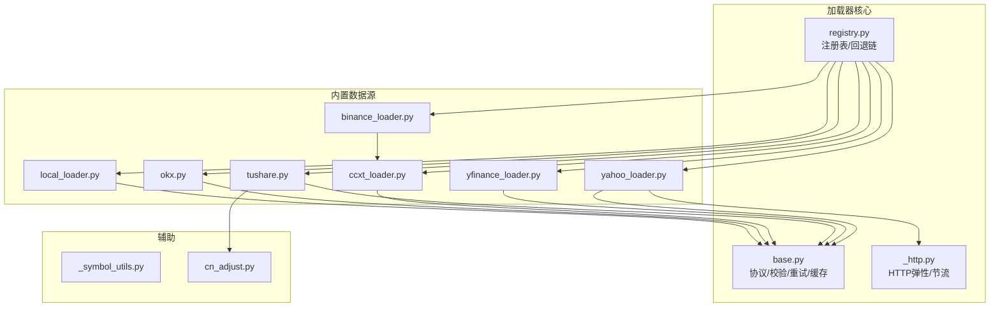
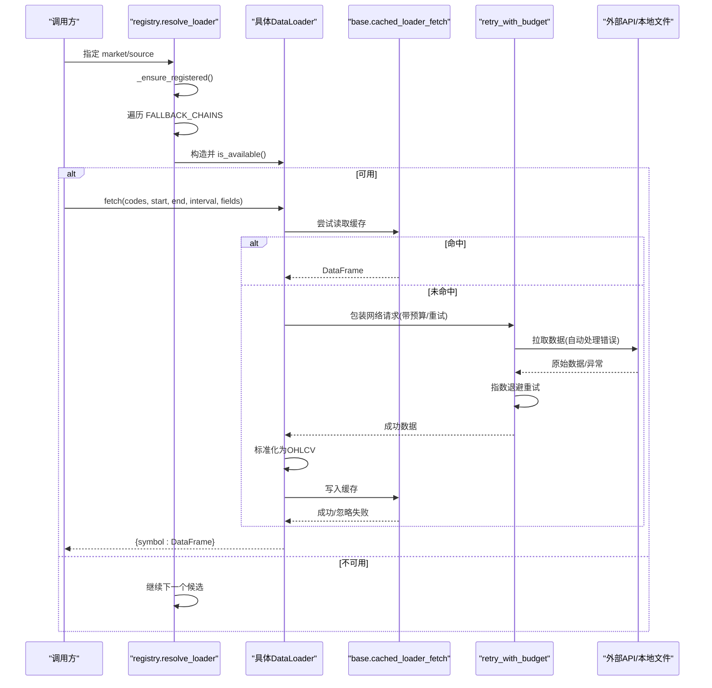
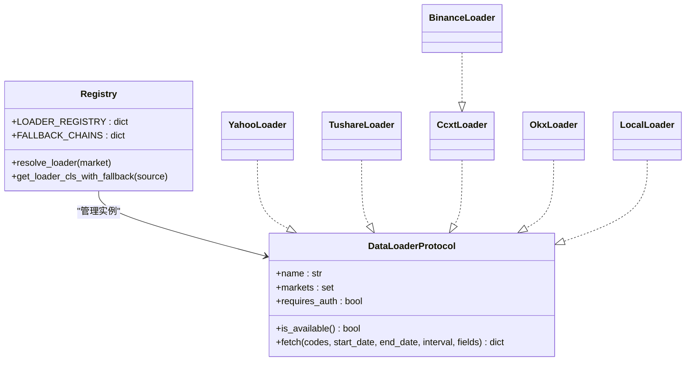
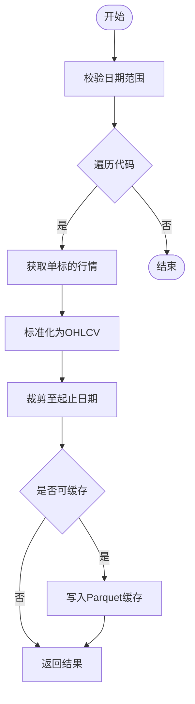
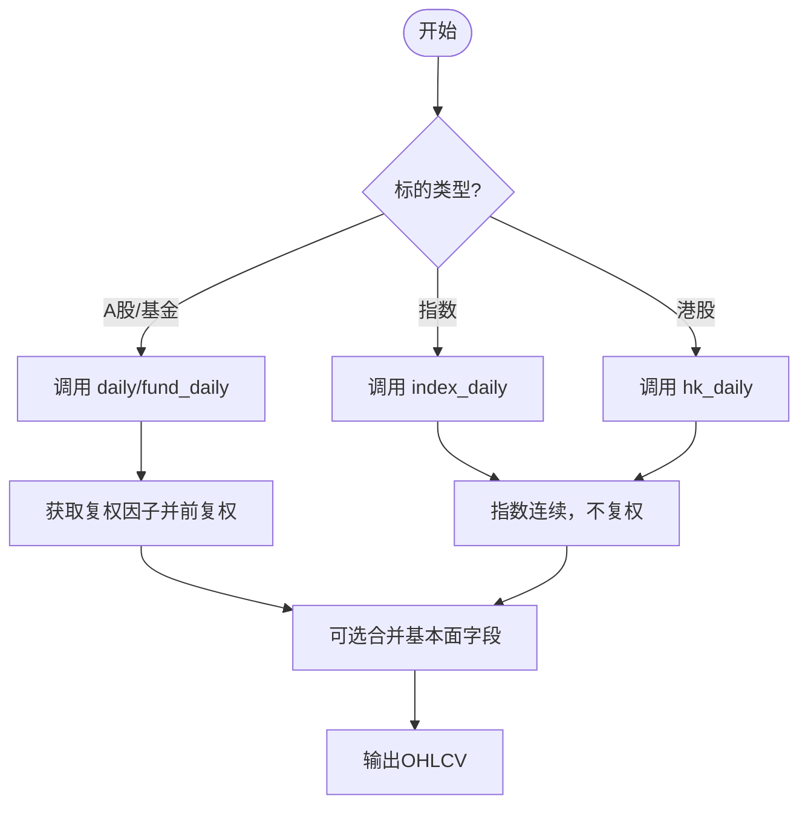
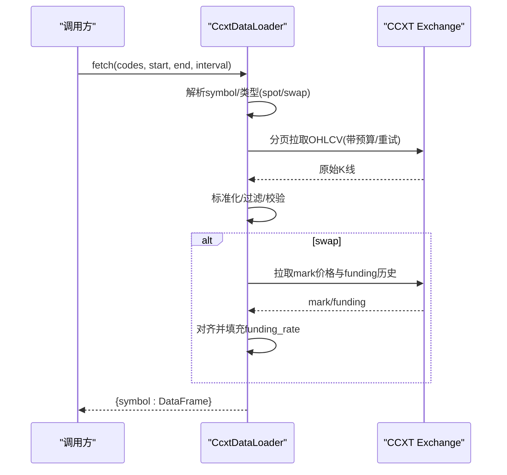
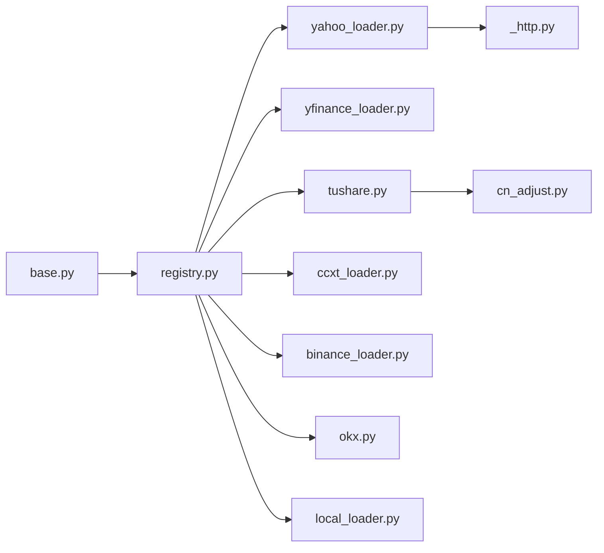

# 数据源集成

<cite>
**本文引用的文件**
- [base.py](file://agent/backtest/loaders/base.py)
- [registry.py](file://agent/backtest/loaders/registry.py)
- [yahoo_loader.py](file://agent/backtest/loaders/yahoo_loader.py)
- [yfinance_loader.py](file://agent/backtest/loaders/yfinance_loader.py)
- [tushare.py](file://agent/backtest/loaders/tushare.py)
- [ccxt_loader.py](file://agent/backtest/loaders/ccxt_loader.py)
- [binance_loader.py](file://agent/backtest/loaders/binance_loader.py)
- [okx.py](file://agent/backtest/loaders/okx.py)
- [local_loader.py](file://agent/backtest/loaders/local_loader.py)
- [_symbol_utils.py](file://agent/backtest/loaders/_symbol_utils.py)
- [cn_adjust.py](file://agent/backtest/loaders/cn_adjust.py)
- [_http.py](file://agent/backtest/loaders/_http.py)
</cite>

## 更新摘要
**所做更改**
- 增强了HTTP请求弹性的详细说明，包括内置重试逻辑
- 更新了连接错误、超时和协议错误的处理机制
- 添加了统一的预算管理和指数退避策略
- 完善了故障排查指南中的网络问题解决方案

## 目录
1. [简介](#简介)
2. [项目结构](#项目结构)
3. [核心组件](#核心组件)
4. [架构总览](#架构总览)
5. [详细组件分析](#详细组件分析)
6. [依赖关系分析](#依赖关系分析)
7. [性能与缓存](#性能与缓存)
8. [故障排查指南](#故障排查指南)
9. [结论](#结论)
10. [附录：自定义数据源开发指南](#附录自定义数据源开发指南)

## 简介
本文件面向 Vibe-Trading 的"统一数据加载器"体系，系统性说明数据源注册机制、适配器模式实现、内置数据源（Yahoo Finance、Tushare、Binance、OKX、CCXT、yfinance、本地文件等）的集成方式、数据格式转换与错误处理策略，并解释数据缓存、重试逻辑与性能优化技术。**最新更新**：增强了HTTP请求弹性，内置重试逻辑可自动处理连接错误、超时和协议错误，确保市场数据获取的稳定性。文末提供自定义数据源开发指南与多市场最佳实践。

## 项目结构
数据加载子系统位于 agent/backtest/loaders 目录，采用"协议 + 注册表 + 具体适配器"的分层设计：
- base.py：定义 DataLoaderProtocol 协议、通用校验、重试/预算工具、本地 Parquet 缓存。
- registry.py：集中注册所有 loader 模块，维护按市场的回退链（fallback chains）。
- 各 loader 文件：实现 Yahoo、yfinance、Tushare、CCXT/Binance、OKX、Local 等具体数据源适配。
- 辅助模块：符号类型识别（_symbol_utils）、A股复权（cn_adjust）、HTTP客户端（_http）等。

**图表来源**
- [registry.py:1-249](file://agent/backtest/loaders/registry.py#L1-L249)
- [base.py:1-645](file://agent/backtest/loaders/base.py#L1-L645)
- [_http.py:1-224](file://agent/backtest/loaders/_http.py#L1-L224)

章节来源
- [registry.py:1-249](file://agent/backtest/loaders/registry.py#L1-L249)
- [base.py:1-645](file://agent/backtest/loaders/base.py#L1-L645)

## 核心组件
- DataLoaderProtocol：统一接口，要求 name/markets/requires_auth/is_available/fetch。
- 校验与清洗：validate_date_range、validate_ohlc 保证日期区间合法与 OHLC 不变量。
- **增强的重试与预算**：retry_with_budget/check_budget 以 wall-clock 预算和指数退避保护外部 API，自动处理连接错误、超时和协议错误。
- 本地缓存：loader_cache_* 系列函数基于内容寻址键（source/symbol/timeframe/date range/fields）将 DataFrame 持久化为 Parquet，命中则跳过网络请求。
- **HTTP弹性客户端**：throttled_get/throttled_get_json 提供带节流和重试的HTTP请求，支持连接重置、超时和协议错误的自动恢复。

**更新** 增强了重试机制，现在可以自动处理各种网络异常情况，包括连接错误、超时和协议错误。

章节来源
- [base.py:27-119](file://agent/backtest/loaders/base.py#L27-L119)
- [base.py:163-236](file://agent/backtest/loaders/base.py#L163-L236)
- [base.py:243-439](file://agent/backtest/loaders/base.py#L243-L439)
- [_http.py:127-196](file://agent/backtest/loaders/_http.py#L127-L196)

## 架构总览
系统通过"按市场类型的回退链"自动选择可用数据源；每个 loader 仅关注自身协议实现与数据归一化。**新增**：所有网络请求都经过增强的弹性处理，确保在网络不稳定时的可靠性。

**图表来源**
- [registry.py:158-193](file://agent/backtest/loaders/registry.py#L158-L193)
- [base.py:401-439](file://agent/backtest/loaders/base.py#L401-L439)
- [base.py:184-236](file://agent/backtest/loaders/base.py#L184-L236)

## 详细组件分析

### 统一协议与注册机制
- 协议：所有 loader 必须实现 DataLoaderProtocol，确保 fetch 返回 {symbol: DataFrame}，索引为 trade_date，列包含 open/high/low/close/volume。
- 注册：使用 @register 装饰器将类名映射到全局 LOADER_REGISTRY；registry._ensure_registered 会按需导入所有已知 loader 模块，避免空注册表。
- 回退链：按市场类型定义优先级顺序，例如 a_share、us_equity、crypto 等；当首选不可用时自动降级。

**图表来源**
- [base.py:618-645](file://agent/backtest/loaders/base.py#L618-L645)
- [registry.py:23-155](file://agent/backtest/loaders/registry.py#L23-L155)

章节来源
- [registry.py:62-115](file://agent/backtest/loaders/registry.py#L62-L115)
- [registry.py:158-249](file://agent/backtest/loaders/registry.py#L158-L249)

### Yahoo Finance（直接 HTTP）
- 特点：无需认证，直接访问公开图表端点；支持 US/HK/印度/韩国/加拿大股票及期货/外汇后缀。
- 时间粒度：日/周/月以及分钟/小时级；日内与日级时间戳对齐策略不同（日级归一到午夜）。
- 数据流：codes -> 校验 -> 逐个 symbol 调用 cached_loader_fetch -> yahoo_client.get_chart -> 构建 OHLCV 帧 -> 过滤窗口 -> 返回。
- **增强弹性**：通过共享HTTP客户端获得连接错误和超时的自动重试能力。

**图表来源**
- [yahoo_loader.py:173-271](file://agent/backtest/loaders/yahoo_loader.py#L173-L271)
- [base.py:401-439](file://agent/backtest/loaders/base.py#L401-L439)

章节来源
- [yahoo_loader.py:1-271](file://agent/backtest/loaders/yahoo_loader.py#L1-L271)

### yfinance（Yahoo 封装）
- 特点：通过 yfinance 批量下载，支持多市场；内部对多指标列进行展平与重命名。
- 特殊处理：4H 间隔由 1h 重采样得到；支持 crypto 符号转换（如 BTC-USDT -> BTC-USD）。
- 数据流：分组去重 -> 批量下载 -> 逐 symbol 提取 -> 标准化 -> 缓存 -> 合并结果。

章节来源
- [yfinance_loader.py:1-342](file://agent/backtest/loaders/yfinance_loader.py#L1-L342)

### Tushare（A股/港股/期货/基金）
- 特点：需要 Token；支持日频与分钟频；ETF/指数/港股/美股/加密货币有分支处理。
- 复权：使用 cn_adjust.apply_qfq 对 A 股/基金进行前复权，避免除权导致的收益失真。
- 限流：针对 Tushare 每分钟配额拒绝，采用特定标记识别并退避重试。
- **增强弹性**：内置配额限制检测，自动识别"每分钟/每天/频率"相关错误并进行智能重试。

**图表来源**
- [tushare.py:116-383](file://agent/backtest/loaders/tushare.py#L116-L383)
- [cn_adjust.py:27-78](file://agent/backtest/loaders/cn_adjust.py#L27-L78)

章节来源
- [tushare.py:1-383](file://agent/backtest/loaders/tushare.py#L1-L383)
- [cn_adjust.py:1-78](file://agent/backtest/loaders/cn_adjust.py#L1-L78)

### CCXT（统一加密交易所）
- 特点：通过 CCXT 连接 100+ 交易所；默认 Binance；支持 spot 与 USD-M 永续合约。
- 安全与健壮性：每页请求受超时与预算限制；网络异常走 retry_with_budget；分页拉取带截止检查。
- 永续合约：对齐交易价格与标记价格 K 线，补充资金费率序列；保证金档位通过外部 artifact 注入并严格校验。
- **增强弹性**：使用 ccxt.NetworkError 作为瞬态异常，自动处理连接中断、DDoS保护和交易所不可用等情况。

**图表来源**
- [ccxt_loader.py:184-502](file://agent/backtest/loaders/ccxt_loader.py#L184-L502)

章节来源
- [ccxt_loader.py:1-502](file://agent/backtest/loaders/ccxt_loader.py#L1-L502)

### Binance（专用 CCXT 包装）
- 特点：固定使用 ccxt.binance 或 ccxt.binanceusdm；继承 CCXT 能力，便于在 crypto 回退链中与 OKX 并列。

章节来源
- [binance_loader.py:1-45](file://agent/backtest/loaders/binance_loader.py#L1-L45)

### OKX（现货K线）
- 特点：直连 OKX V5 公开 REST；近期与历史端点智能切换；代理配置与超时可控；业务码非 0 时抛出异常供重试。
- 数据流：按 bar 粒度分页拉取 -> 保留已确认K线 -> 标准化 -> 过滤 -> 缓存。
- **增强弹性**：自动处理HTTP 429/5xx状态码和业务错误，支持代理配置和超时控制。

章节来源
- [okx.py:1-373](file://agent/backtest/loaders/okx.py#L1-L373)

### 本地数据源（CSV/Parquet/DuckDB）
- 特点：从用户配置文件读取数据源映射；支持列名映射、日期格式、DuckDB SQL 查询；可按需重采样到目标间隔。
- 可用性：存在 config.yaml 且 sources 列表非空即视为可用；不会静默回退到网络源。

章节来源
- [local_loader.py:1-354](file://agent/backtest/loaders/local_loader.py#L1-L354)

## 依赖关系分析
- 耦合度：loader 之间通过 registry 解耦；base 提供共享能力；具体 loader 仅依赖各自第三方库（yfinance、tushare、ccxt、requests 等）。
- 外部依赖：
  - Yahoo/yfinance：公开金融数据。
  - Tushare：需 Token，具备配额限制。
  - CCXT/Binance/OKX：加密交易所公开数据。
  - 本地文件：CSV/Parquet/DuckDB。
- 潜在循环：无循环依赖；registry 仅负责导入与查找。

**图表来源**
- [registry.py:83-115](file://agent/backtest/loaders/registry.py#L83-L115)
- [base.py:618-645](file://agent/backtest/loaders/base.py#L618-L645)

章节来源
- [registry.py:83-115](file://agent/backtest/loaders/registry.py#L83-L115)

## 性能与缓存
- 本地缓存：基于内容地址的 Parquet 缓存，键包含 source/symbol/timeframe/start/end/fields；仅对已结算日期范围生效；读写失败不中断主流程。
- **增强的重试与预算**：
  - 通用：retry_with_budget/check_budget 提供 wall-clock 预算与指数退避，适用于 flaky 网络。
  - Tushare：针对配额拒绝的特殊识别与等待。
  - CCXT/OKX：HTTP 超时、分页上限、预算内重试。
  - HTTP客户端：throttled_get 提供连接重置、超时和协议错误的自动重试。
- 批量与分片：yfinance 支持批量下载；CCXT/OKX 分页拉取；Yahoo 单标的一次请求。
- 数据清洗：validate_ohlc 剔除结构性无效 K 线，避免下游 NaN/inf 污染。

**更新** 新增了HTTP客户端的弹性处理能力，可以自动处理连接重置、超时和协议错误，提高了整体系统的稳定性。

章节来源
- [base.py:163-236](file://agent/backtest/loaders/base.py#L163-L236)
- [base.py:243-439](file://agent/backtest/loaders/base.py#L243-L439)
- [ccxt_loader.py:50-57](file://agent/backtest/loaders/ccxt_loader.py#L50-L57)
- [okx.py:67-69](file://agent/backtest/loaders/okx.py#L67-L69)
- [tushare.py:18-35](file://agent/backtest/loaders/tushare.py#L18-L35)
- [_http.py:47-50](file://agent/backtest/loaders/_http.py#L47-L50)

## 故障排查指南
- 无可用数据源：当某市场所有候选均不可用时，会抛出 NoAvailableSourceError；检查网络、Token、代理与环境变量。
- 配额限制：Tushare 出现"每分钟/每天/频率"相关错误时，会自动退避重试；若频繁触发，请降低并发或延长间隔。
- 时间范围问题：validate_date_range 会拒绝非法区间；确保 start <= end。
- OHLC 异常：validate_ohlc 会丢弃 high < low 或非正价格等无效行；若策略严格，可调整 allow_nonpositive_prices。
- 缓存失效：若缓存元数据损坏或版本不匹配，会回退到在线获取；检查缓存目录权限与磁盘空间。
- **网络连接问题**：
  - 连接错误：系统会自动重试连接重置和连接中断错误
  - 超时问题：通过环境变量配置超时时间（CCXT_TIMEOUT_MS、OKX_TIMEOUT_S）
  - 协议错误：自动处理HTTP协议错误和DNS解析失败
  - 代理配置：支持 ALL_PROXY、HTTP_PROXY、HTTPS_PROXY 环境变量
- **预算耗尽**：如果网络请求超过配置的预算时间，会抛出 TimeoutError；可通过环境变量调整预算限制。

**更新** 新增了网络连接问题的详细排查指南，包括连接错误、超时和协议错误的处理方法。

章节来源
- [registry.py:158-193](file://agent/backtest/loaders/registry.py#L158-L193)
- [tushare.py:38-79](file://agent/backtest/loaders/tushare.py#L38-L79)
- [base.py:31-119](file://agent/backtest/loaders/base.py#L31-L119)
- [base.py:243-439](file://agent/backtest/loaders/base.py#L243-L439)
- [ccxt_loader.py:73-92](file://agent/backtest/loaders/ccxt_loader.py#L73-L92)
- [okx.py:72-98](file://agent/backtest/loaders/okx.py#L72-L98)
- [_http.py:165-196](file://agent/backtest/loaders/_http.py#L165-L196)

## 结论
Vibe-Trading 的数据加载器体系通过统一的协议、注册表与回退链，实现了跨市场、跨供应商的稳定数据接入。**最新增强**：内置的HTTP请求弹性机制能够自动处理连接错误、超时和协议错误，显著提升了系统在弱网环境下的可靠性。内置数据源覆盖 A 股、港股、美股、加密资产与本地文件，配合强化的重试/预算与本地缓存，大幅提高了鲁棒性与性能。遵循本文档的规范与最佳实践，可快速扩展新的数据源并保持与现有生态一致的行为。

## 附录：自定义数据源开发指南

### 接口规范
- 实现 DataLoaderProtocol：
  - name/markets/requires_auth：声明标识与市场归属。
  - is_available：检测凭据/网络/依赖是否就绪。
  - fetch：输入 codes/start/end/interval/fields，返回 {symbol: DataFrame}，DataFrame 索引为 trade_date，列包含 open/high/low/close/volume。
- 使用 @register 装饰器完成自注册。

章节来源
- [base.py:618-645](file://agent/backtest/loaders/base.py#L618-L645)
- [registry.py:62-68](file://agent/backtest/loaders/registry.py#L62-L68)

### 数据验证与清洗
- 使用 validate_date_range 校验起止日期。
- 使用 validate_ohlc 清理无效 K 线，必要时设置 allow_nonpositive_prices。
- 对数值列进行 to_numeric(errors="coerce") 并 dropna。

章节来源
- [base.py:31-119](file://agent/backtest/loaders/base.py#L31-L119)

### **增强的缓存与重试**
- 使用 cached_loader_fetch 包裹 fetch 逻辑，自动命中/写入本地 Parquet 缓存。
- 对外部 API 调用使用 retry_with_budget 与 check_budget，限定 transient 异常与超时预算。
- **HTTP弹性**：对于直接HTTP请求，可使用 throttled_get/throttled_get_json 获得连接错误、超时和协议错误的自动重试能力。

**更新** 新增了HTTP弹性客户端的使用指导，开发者可以直接利用内置的HTTP弹性功能。

章节来源
- [base.py:163-236](file://agent/backtest/loaders/base.py#L163-L236)
- [base.py:401-439](file://agent/backtest/loaders/base.py#L401-L439)
- [_http.py:127-196](file://agent/backtest/loaders/_http.py#L127-L196)

### 测试方法
- 单元测试要点：
  - 覆盖 is_available 的真/假路径。
  - 覆盖 fetch 的边界条件：空 codes、非法日期、无数据返回、部分失败。
  - 验证输出 DataFrame 的索引与列是否符合约定。
  - **模拟网络异常**：测试连接错误、超时和协议错误的重试行为。
  - 验证缓存命中与写入（启用/禁用场景）。
- 建议借助 fixtures 构造最小数据集与 mock 外部依赖。

**更新** 新增了网络异常测试的指导，确保自定义数据源能正确处理各种网络异常情况。

### 多市场最佳实践
- 优先使用回退链中更稳定、低速率限制的源；必要时在 is_available 中做轻量探测。
- 对不同市场的时间粒度差异进行对齐（如日级统一到午夜，分钟级保持原时间戳）。
- 对可能缺失的列（如 volume）进行默认值填充，保证下游一致性。
- 对关键业务字段（如复权因子、资金费率）进行完整性校验，缺失时采取保守策略（丢弃标的或报错）。
- **网络弹性最佳实践**：
  - 合理设置超时时间和预算限制
  - 区分瞬态错误和永久错误
  - 使用指数退避策略避免雪崩效应
  - 配置适当的代理和网络参数

[本节为通用指导，不直接引用具体文件]