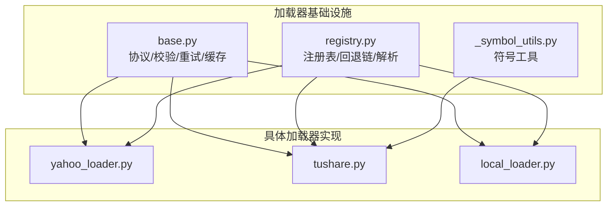
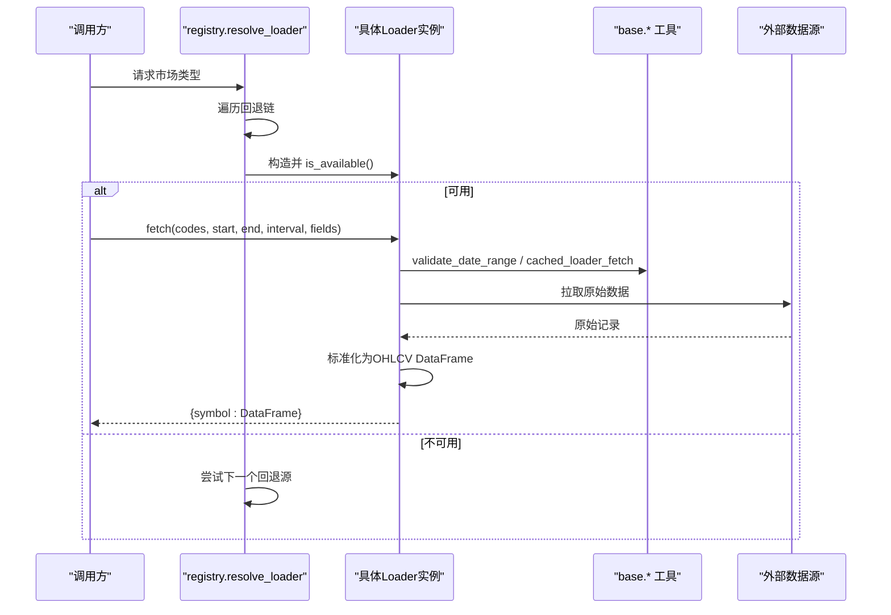
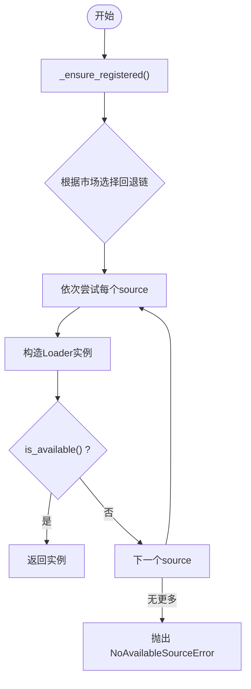
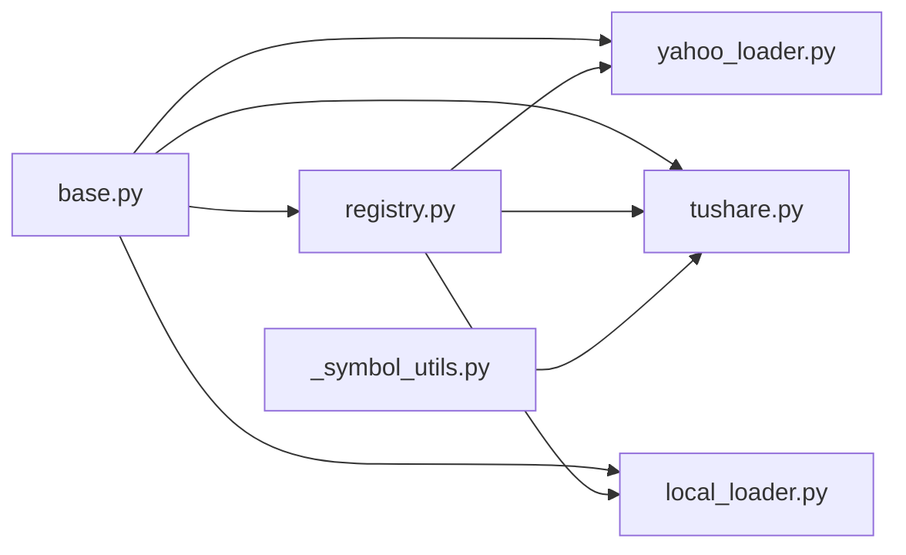

# 统一加载器架构

<cite>
**本文引用的文件**
- [base.py](file://agent/backtest/loaders/base.py)
- [registry.py](file://agent/backtest/loaders/registry.py)
- [_symbol_utils.py](file://agent/backtest/loaders/_symbol_utils.py)
- [yahoo_loader.py](file://agent/backtest/loaders/yahoo_loader.py)
- [tushare.py](file://agent/backtest/loaders/tushare.py)
- [local_loader.py](file://agent/backtest/loaders/local_loader.py)
- [test_loader_retry_helpers.py](file://agent/tests/test_loader_retry_helpers.py)
- [test_registry.py](file://agent/tests/test_registry.py)
</cite>

## 目录
1. [简介](#简介)
2. [项目结构](#项目结构)
3. [核心组件](#核心组件)
4. [架构总览](#架构总览)
5. [详细组件分析](#详细组件分析)
6. [依赖关系分析](#依赖关系分析)
7. [性能考量](#性能考量)
8. [故障排查指南](#故障排查指南)
9. [结论](#结论)
10. [附录：自定义数据源开发指南](#附录自定义数据源开发指南)

## 简介
本文件为 Vibe-Trading 的统一数据加载器架构提供系统化文档。重点覆盖：
- BaseLoader 抽象基类（实际以 Protocol 与共享工具实现）的设计模式、数据源注册机制与符号工具函数
- 数据加载器的生命周期管理、错误处理策略与性能优化技术
- 统一的数据接口规范，包括 OHLCV 数据结构、时间序列处理与元数据管理
- 自定义数据源开发指南：接口实现、数据验证与测试方法
- 数据缓存策略、重试逻辑与并发处理的实践建议

## 项目结构
统一加载器位于 agent/backtest/loaders 目录，采用“协议 + 注册表 + 多实现”的分层组织：
- base.py：定义 DataLoaderProtocol 协议、校验工具、重试与预算控制、本地缓存等通用能力
- registry.py：维护全局注册表、市场级回退链、自动解析与不可降级约束
- _symbol_utils.py：交易所代码识别（如 ETF/LOF 前缀）
- 各 loader 实现：遵循统一接口，封装不同数据源的获取与标准化流程
- tests：对重试、缓存、注册与回退链的单元测试

图表来源
- [base.py:618-645](file://agent/backtest/loaders/base.py#L618-L645)
- [registry.py:23-59](file://agent/backtest/loaders/registry.py#L23-L59)
- [_symbol_utils.py:9-21](file://agent/backtest/loaders/_symbol_utils.py#L9-L21)
- [yahoo_loader.py:173-185](file://agent/backtest/loaders/yahoo_loader.py#L173-L185)
- [tushare.py:116-128](file://agent/backtest/loaders/tushare.py#L116-L128)
- [local_loader.py:1-43](file://agent/backtest/loaders/local_loader.py#L1-L43)

章节来源
- [base.py:1-645](file://agent/backtest/loaders/base.py#L1-L645)
- [registry.py:1-249](file://agent/backtest/loaders/registry.py#L1-L249)
- [_symbol_utils.py:1-21](file://agent/backtest/loaders/_symbol_utils.py#L1-L21)

## 核心组件
- DataLoaderProtocol：统一接口，要求 name、markets、requires_auth、is_available()、fetch(codes, start_date, end_date, interval, fields) -> dict[symbol: DataFrame]
- 校验工具：validate_date_range、validate_ohlc，确保日期区间合法与 OHLC 不变量一致
- 重试与预算：check_budget、retry_with_budget，基于单调时钟与指数退避的有限重试
- 本地缓存：loader_cache_* 系列函数，基于内容寻址键与 Parquet 存储，支持元数据持久化与并发安全写入
- 注册表与回退链：@register 装饰器、FALLBACK_CHAINS、resolve_loader、get_loader_cls_with_fallback

章节来源
- [base.py:31-119](file://agent/backtest/loaders/base.py#L31-L119)
- [base.py:163-236](file://agent/backtest/loaders/base.py#L163-L236)
- [base.py:243-439](file://agent/backtest/loaders/base.py#L243-L439)
- [registry.py:62-115](file://agent/backtest/loaders/registry.py#L62-L115)
- [registry.py:136-193](file://agent/backtest/loaders/registry.py#L136-L193)
- [registry.py:196-249](file://agent/backtest/loaders/registry.py#L196-L249)

## 架构总览
统一加载器通过“协议 + 注册表 + 回退链”解耦上层调用与底层数据源：
- 上层仅依赖 DataLoaderProtocol 与 resolve_loader/get_loader_cls_with_fallback
- 每个 Loader 实现 is_available 与 fetch，并在模块导入时通过 @register 自注册
- 按市场类型选择回退链，优先选择稳定、低限流风险的数据源；必要时降级到备选源
- 所有 Loader 输出统一的 OHLCV DataFrame 结构，便于后续回测引擎消费

图表来源
- [registry.py:158-193](file://agent/backtest/loaders/registry.py#L158-L193)
- [base.py:31-119](file://agent/backtest/loaders/base.py#L31-L119)
- [base.py:401-439](file://agent/backtest/loaders/base.py#L401-L439)
- [yahoo_loader.py:191-200](file://agent/backtest/loaders/yahoo_loader.py#L191-L200)

## 详细组件分析

### BaseLoader 抽象基类（Protocol）与统一接口
- 接口契约：name/markets/requires_auth/is_available/fetch
- 输入：codes（列表）、start_date/end_date（YYYY-MM-DD）、interval（如 1D/1H/5m）、fields（可选扩展字段）
- 输出：{symbol: DataFrame}，DataFrame 索引为 trade_date，列包含 open/high/low/close/volume 等
- 设计要点：
  - 使用 Protocol 而非继承，避免强耦合，便于静态检查
  - 将校验、重试、缓存等横切关注点下沉到 base，Loader 专注领域逻辑

章节来源
- [base.py:618-645](file://agent/backtest/loaders/base.py#L618-L645)

### 数据源注册机制与回退链
- 注册：@register 装饰器将 Loader 类加入全局 LOADER_REGISTRY
- 懒加载：_ensure_registered 在首次使用时导入所有已知 loader 模块，失败静默跳过
- 回退链：FALLBACK_CHAINS 按市场类型定义优先级，考虑 IP 封禁风险与数据质量
- 解析：
  - resolve_loader(market)：返回第一个可用的 Loader 实例
  - get_loader_cls_with_fallback(source)：按 source 或同市场回退获取 Loader 类
  - 特殊约束：local/qveris 不允许静默降级到网络源，避免掩盖配置问题

图表来源
- [registry.py:71-115](file://agent/backtest/loaders/registry.py#L71-L115)
- [registry.py:136-193](file://agent/backtest/loaders/registry.py#L136-L193)
- [registry.py:196-249](file://agent/backtest/loaders/registry.py#L196-L249)

章节来源
- [registry.py:1-249](file://agent/backtest/loaders/registry.py#L1-L249)

### 符号工具函数
- _is_etf_listed：识别 A 股上市 ETF/LOF 代码（SH/SZ 后缀与特定前缀）
- 用途：在特定 Loader（如 tushare）中用于区分指数与普通股票，从而走不同拉取路径

章节来源
- [_symbol_utils.py:9-21](file://agent/backtest/loaders/_symbol_utils.py#L9-L21)
- [tushare.py:88-97](file://agent/backtest/loaders/tushare.py#L88-L97)

### 统一数据接口规范
- OHLCV 数据结构：
  - 索引：trade_date（DatetimeIndex，日频通常归一化至午夜）
  - 列：open/high/low/close/volume（缺失列默认填充或置零）
- 时间序列处理：
  - 日内频率保留真实时间戳；日及以上频率归一化到午夜，保证跨源对齐
  - 区间裁剪：按 inclusive 窗口裁剪结果
- 元数据管理：
  - 本地缓存写入时保存 index_columns/index_names/columns_name/index_dtypes 等元信息，读取时恢复

章节来源
- [yahoo_loader.py:125-170](file://agent/backtest/loaders/yahoo_loader.py#L125-L170)
- [base.py:574-595](file://agent/backtest/loaders/base.py#L574-L595)

### 生命周期管理与错误处理
- 生命周期：
  - 构造：按需实例化，部分 Loader 在 __init__ 中初始化 SDK（可能因缺凭据抛错）
  - 可用性检测：is_available 快速判断是否可服务
  - 拉取：fetch 负责数据获取、标准化与返回
- 错误处理：
  - 日期与 OHLC 校验：validate_date_range、validate_ohlc
  - 重试与预算：retry_with_budget/check_budget，限定最大重试次数与超时截止
  - 特定源限流：如 tushare 的每分钟配额拒绝，通过消息匹配与退避等待处理
  - 不可降级约束：local/qveris 显式不可静默降级，避免掩盖配置问题

章节来源
- [base.py:31-119](file://agent/backtest/loaders/base.py#L31-L119)
- [base.py:163-236](file://agent/backtest/loaders/base.py#L163-L236)
- [tushare.py:18-49](file://agent/backtest/loaders/tushare.py#L18-L49)
- [registry.py:117-124](file://agent/backtest/loaders/registry.py#L117-L124)

### 性能优化技术
- 本地缓存：
  - 内容寻址键：source/symbol/timeframe/start/end/fields 哈希
  - 落盘格式：Parquet + JSON 元数据，使用 DuckDB 读写
  - 原子写入：临时文件 + os.replace，避免并发竞争
  - 范围有效性：仅对已结算日期（end_date < today）缓存，避免钉住未闭合K线
- 重试与退避：
  - 指数退避与剩余预算保护，防止长时间阻塞
- 时间序列对齐：
  - 日频归一化午夜索引，减少跨源合并时的偏移问题

章节来源
- [base.py:243-439](file://agent/backtest/loaders/base.py#L243-L439)
- [base.py:475-595](file://agent/backtest/loaders/base.py#L475-L595)
- [yahoo_loader.py:125-170](file://agent/backtest/loaders/yahoo_loader.py#L125-L170)

## 依赖关系分析
- 组件耦合：
  - 所有 Loader 依赖 base 提供的协议、校验、重试与缓存
  - registry 依赖 base 的异常类型与全局注册表
  - 具体 Loader 之间相互独立，通过统一接口协作
- 外部依赖：
  - pandas、duckdb（缓存读写）、yaml（local_loader 配置）
  - 各 Loader 内部依赖其对应数据源 SDK 或 HTTP 客户端

图表来源
- [base.py:618-645](file://agent/backtest/loaders/base.py#L618-L645)
- [registry.py:23-59](file://agent/backtest/loaders/registry.py#L23-L59)
- [_symbol_utils.py:9-21](file://agent/backtest/loaders/_symbol_utils.py#L9-L21)

章节来源
- [registry.py:1-249](file://agent/backtest/loaders/registry.py#L1-L249)
- [base.py:1-645](file://agent/backtest/loaders/base.py#L1-L645)

## 性能考量
- 缓存命中率：合理设置 timeframe 与 fields，避免过度细粒度导致缓存碎片
- 并发写入：缓存写入使用唯一临时文件名与原子替换，避免竞态
- 重试策略：针对瞬态错误（网络抖动、限流）进行有限重试，避免无限循环
- 时间对齐：统一午夜索引，降低后续计算与合并成本
- 内存占用：批量拉取后及时 dropna/astype，减少冗余内存

[本节为通用指导，不直接分析具体文件]

## 故障排查指南
- 无可用数据源：
  - 现象：抛出 NoAvailableSourceError
  - 排查：检查市场回退链、各 Loader 的 is_available 条件（如 token、网络、本地配置）
- 缓存异常：
  - 现象：读取失败或元数据损坏
  - 行为：非致命，自动回退到在线源；查看日志定位具体原因
- 重试耗尽：
  - 现象：TimeoutError，提示 attempt(s) 与 label
  - 排查：确认 transient 异常类别、backoff 配置与 deadline 设置
- 本地数据不一致：
  - 现象：interval 无法上采样或列名不匹配
  - 行为：警告并返回原数据；检查 local_loader 配置与列映射

章节来源
- [registry.py:158-193](file://agent/backtest/loaders/registry.py#L158-L193)
- [base.py:475-595](file://agent/backtest/loaders/base.py#L475-L595)
- [test_loader_retry_helpers.py:74-166](file://agent/tests/test_loader_retry_helpers.py#L74-L166)

## 结论
统一加载器架构通过清晰的协议、健壮的注册与回退机制、完善的校验与重试、以及高效的本地缓存，实现了跨数据源的一致性与鲁棒性。该设计使上层业务无需关心底层数据源差异，同时为扩展新数据源提供了最小侵入的接入方式。

[本节为总结性内容，不直接分析具体文件]

## 附录：自定义数据源开发指南

### 接口实现
- 新建 Loader 类，实现 DataLoaderProtocol：
  - name/markets/requires_auth
  - is_available：检查凭据、网络或本地配置
  - fetch：接收 codes、start_date、end_date、interval、fields，返回 {symbol: DataFrame}
- 使用 @register 装饰器完成自注册

章节来源
- [registry.py:62-68](file://agent/backtest/loaders/registry.py#L62-L68)
- [base.py:618-645](file://agent/backtest/loaders/base.py#L618-L645)

### 数据验证
- 日期区间：调用 validate_date_range
- OHLC 不变量：调用 validate_ohlc，可选择 drop/warn/raise 策略
- 时间对齐：日频归一化午夜索引，日内保留真实时间戳

章节来源
- [base.py:31-119](file://agent/backtest/loaders/base.py#L31-L119)
- [yahoo_loader.py:125-170](file://agent/backtest/loaders/yahoo_loader.py#L125-L170)

### 重试与预算
- 使用 retry_with_budget 包装易失败的 API 调用，声明 transient 异常类型
- 使用 check_budget 在分页或多次请求间检查截止时间，避免超预算运行

章节来源
- [base.py:163-236](file://agent/backtest/loaders/base.py#L163-L236)
- [test_loader_retry_helpers.py:74-166](file://agent/tests/test_loader_retry_helpers.py#L74-L166)

### 缓存集成
- 使用 cached_loader_fetch 包裹单 symbol 拉取逻辑，自动命中/写入本地缓存
- 注意：仅对已结算日期范围缓存，避免钉住未闭合 K 线

章节来源
- [base.py:401-439](file://agent/backtest/loaders/base.py#L401-L439)

### 测试方法
- 单元测试：
  - 验证 is_available 在不同环境下的行为
  - 验证 fetch 输出的 DataFrame 结构与数据类型
  - 验证重试与预算逻辑（参考 test_loader_retry_helpers）
  - 验证注册与回退链（参考 test_registry）
- 集成测试：
  - 结合真实数据源或 Mock，端到端验证回退链与错误恢复

章节来源
- [test_loader_retry_helpers.py:1-200](file://agent/tests/test_loader_retry_helpers.py#L1-L200)
- [test_registry.py:1-200](file://agent/tests/test_registry.py#L1-L200)