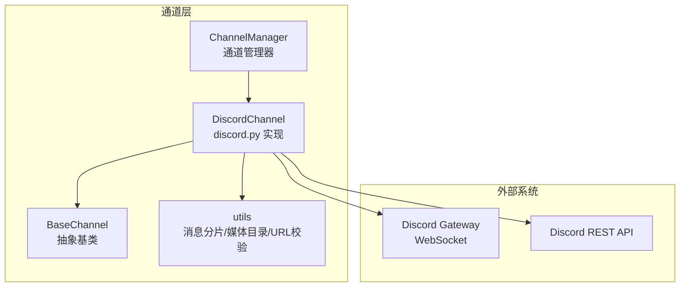
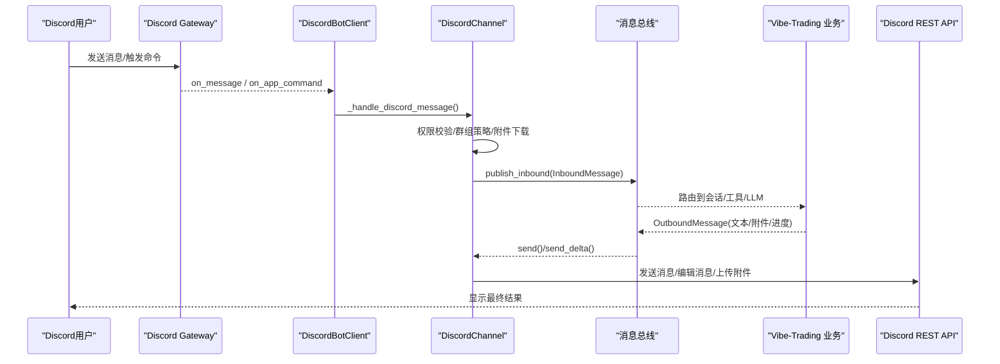
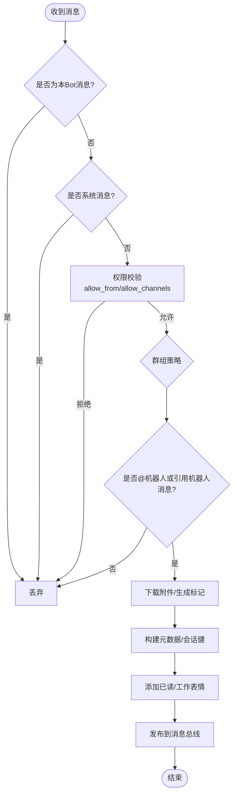
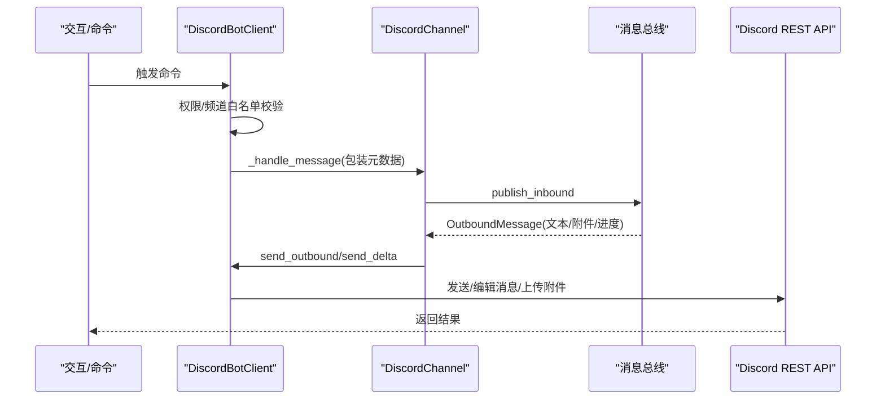
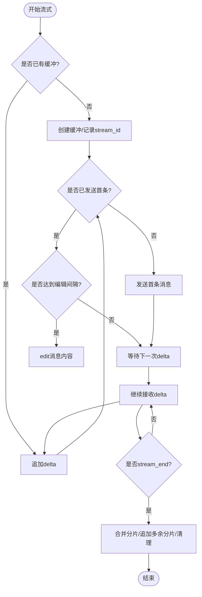
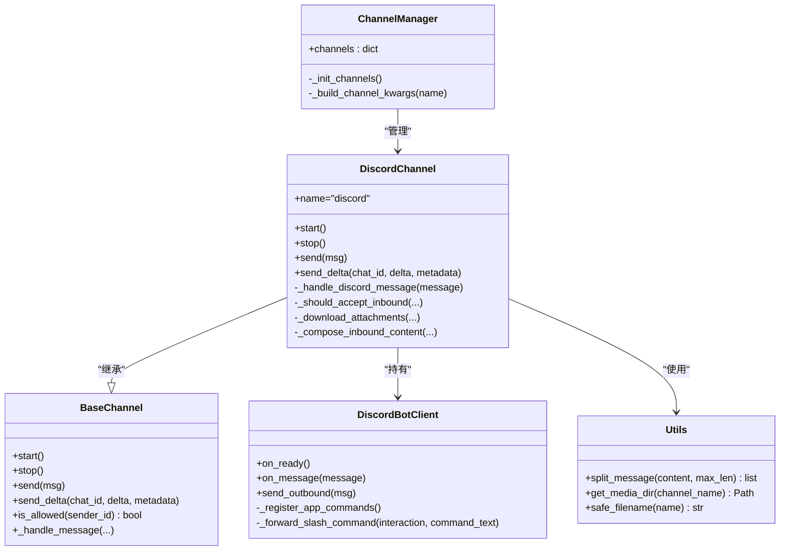

# Discord渠道实现

<cite>
**本文引用的文件**
- [discord.py](file://agent/src/channels/discord.py)
- [base.py](file://agent/src/channels/base.py)
- [utils.py](file://agent/src/channels/utils.py)
- [manager.py](file://agent/src/channels/manager.py)
- [env_schema.py](file://agent/src/config/env_schema.py)
</cite>

## 目录
1. [简介](#简介)
2. [项目结构](#项目结构)
3. [核心组件](#核心组件)
4. [架构总览](#架构总览)
5. [详细组件分析](#详细组件分析)
6. [依赖关系分析](#依赖关系分析)
7. [性能与速率限制](#性能与速率限制)
8. [故障排查指南](#故障排查指南)
9. [结论](#结论)
10. [附录：配置与环境变量](#附录：配置与环境变量)

## 简介
本章节面向希望在 Vibe-Trading 中集成 Discord 渠道的开发者与运维人员，系统性说明从应用创建、Token 配置、Gateway 连接到消息收发、权限控制、事件监听、命令处理、流式输出、错误处理与连接恢复等全链路实现。文档基于仓库中的实际代码进行分析与归纳，确保可落地、可操作。

## 项目结构
Discord 渠道位于 channels 层，通过统一的 BaseChannel 接口接入消息总线；其具体实现使用 discord.py 客户端进行 Gateway 连接与事件分发；同时借助 utils 提供消息分片、附件安全与媒体目录管理；由 ChannelManager 负责通道发现、初始化与启停编排。

图表来源
- [discord.py:339-447](file://agent/src/channels/discord.py#L339-L447)
- [base.py:22-123](file://agent/src/channels/base.py#L22-L123)
- [manager.py:36-137](file://agent/src/channels/manager.py#L36-L137)
- [utils.py:16-89](file://agent/src/channels/utils.py#L16-L89)

章节来源
- [discord.py:339-447](file://agent/src/channels/discord.py#L339-L447)
- [base.py:22-123](file://agent/src/channels/base.py#L22-L123)
- [manager.py:36-137](file://agent/src/channels/manager.py#L36-L137)
- [utils.py:16-89](file://agent/src/channels/utils.py#L16-L89)

## 核心组件
- DiscordConfig：Discord 渠道的配置模型，包含启用开关、Bot Token、允许用户列表、允许频道列表、Intents、群组策略、表情反馈、流式输出开关、代理等。
- DiscordBotClient：继承自 discord.Client，封装事件回调、应用命令注册、出站消息发送、附件发送、回复上下文构建、流式编辑等。
- DiscordChannel：实现 BaseChannel 抽象接口，负责启动/停止、入站消息处理、权限过滤、附件下载、会话键生成、流式增量输出、打字指示器与反应清理等。
- ChannelManager：统一发现并加载通道，解析配置，设置全局布尔覆盖项，维护通道状态。
- BaseChannel：定义通道通用能力（登录、启动/停止、发送、流式发送、推理流、权限判断、入站消息转发到总线）。
- utils：提供消息分片、安全文件名、媒体目录、URL 目标校验等工具。

章节来源
- [discord.py:50-66](file://agent/src/channels/discord.py#L50-L66)
- [discord.py:70-337](file://agent/src/channels/discord.py#L70-L337)
- [discord.py:339-819](file://agent/src/channels/discord.py#L339-L819)
- [base.py:22-123](file://agent/src/channels/base.py#L22-L123)
- [manager.py:36-137](file://agent/src/channels/manager.py#L36-L137)
- [utils.py:16-89](file://agent/src/channels/utils.py#L16-L89)

## 架构总览
下图展示从 Discord 用户消息到 Vibe-Trading 内部处理，再到 Discord 回写的完整流程，包括权限校验、附件处理、流式输出与命令路由。

图表来源
- [discord.py:95-106](file://agent/src/channels/discord.py#L95-L106)
- [discord.py:147-231](file://agent/src/channels/discord.py#L147-L231)
- [discord.py:246-337](file://agent/src/channels/discord.py#L246-L337)
- [discord.py:454-530](file://agent/src/channels/discord.py#L454-L530)
- [base.py:179-227](file://agent/src/channels/base.py#L179-L227)

## 详细组件分析

### DiscordChannel：入站消息与权限控制
- 入站消息入口为 on_message 回调，内部调用 _handle_discord_message，完成：
  - 自身消息回环防护（忽略本 Bot 发出的消息）
  - 系统消息过滤
  - 用户与频道权限校验（allow_from、allow_channels）
  - 群组策略（mention/open）
  - 附件下载与安全命名，组合为入站内容
  - 元数据构建（message_id、guild_id、reply_to、thread 上下文）
  - 立即添加“已读”表情，延迟添加“工作中”表情
  - 调用 _handle_message 将消息推送到消息总线
- 会话键：当消息来自线程时，根据父频道ID与线程ID构造 session_key，保证上下文隔离。

图表来源
- [discord.py:532-595](file://agent/src/channels/discord.py#L532-L595)
- [discord.py:645-662](file://agent/src/channels/discord.py#L645-L662)
- [discord.py:664-696](file://agent/src/channels/discord.py#L664-L696)
- [discord.py:704-757](file://agent/src/channels/discord.py#L704-L757)

章节来源
- [discord.py:532-595](file://agent/src/channels/discord.py#L532-L595)
- [discord.py:645-662](file://agent/src/channels/discord.py#L645-L662)
- [discord.py:664-696](file://agent/src/channels/discord.py#L664-L696)
- [discord.py:704-757](file://agent/src/channels/discord.py#L704-L757)

### DiscordBotClient：应用命令与出站消息
- 应用命令：在 on_ready 时同步命令树，注册内置命令（new、stop、restart、status、history、model、help），并将命令转发到 _forward_slash_command，执行权限与频道白名单检查后，包装元数据并交由 Channel 处理。
- 出站消息：send_outbound 支持文本分片、附件发送、回复上下文（reference + allowed_mentions）、失败附件的回退提示文本。
- 流式输出：send_delta 按 stream_id 聚合增量文本，首次发送后以固定间隔 edit 消息，结束时合并多余分片并清理状态。

图表来源
- [discord.py:86-94](file://agent/src/channels/discord.py#L86-L94)
- [discord.py:147-231](file://agent/src/channels/discord.py#L147-L231)
- [discord.py:246-337](file://agent/src/channels/discord.py#L246-L337)
- [discord.py:473-530](file://agent/src/channels/discord.py#L473-L530)

章节来源
- [discord.py:86-94](file://agent/src/channels/discord.py#L86-L94)
- [discord.py:147-231](file://agent/src/channels/discord.py#L147-L231)
- [discord.py:246-337](file://agent/src/channels/discord.py#L246-L337)
- [discord.py:473-530](file://agent/src/channels/discord.py#L473-L530)

### 流式输出与编辑策略
- 流式缓冲：_StreamBuf 按 chat_id 与可选 stream_id 维护累积文本、消息对象、最后编辑时间。
- 增量更新：send_delta 首次发送后，每隔固定间隔（_STREAM_EDIT_INTERVAL）edit 一次，避免频繁请求。
- 结束收尾：stream_end 时合并多余分片，必要时追加新消息，清理缓冲区与打字指示器、表情。

图表来源
- [discord.py:40-48](file://agent/src/channels/discord.py#L40-L48)
- [discord.py:473-530](file://agent/src/channels/discord.py#L473-L530)
- [discord.py:619-643](file://agent/src/channels/discord.py#L619-L643)

章节来源
- [discord.py:40-48](file://agent/src/channels/discord.py#L40-L48)
- [discord.py:473-530](file://agent/src/channels/discord.py#L473-L530)
- [discord.py:619-643](file://agent/src/channels/discord.py#L619-L643)

### 权限系统与角色/频道访问控制
- 用户级：allow_from 支持通配符或精确匹配；未授权用户在 DM 中将收到配对码引导。
- 频道级：allow_channels 为空表示全部允许；否则仅响应在白名单内的频道（含线程与其父频道）。
- 群组策略：group_policy 支持 mention（仅被 @ 或引用机器人消息时响应）与 open（全部响应）。
- 会话键：线程场景下使用 parent_channel_id 与 thread_id 构造 session_key，确保上下文隔离。

章节来源
- [base.py:165-227](file://agent/src/channels/base.py#L165-L227)
- [discord.py:133-145](file://agent/src/channels/discord.py#L133-L145)
- [discord.py:557-563](file://agent/src/channels/discord.py#L557-L563)
- [discord.py:645-662](file://agent/src/channels/discord.py#L645-L662)
- [discord.py:718-757](file://agent/src/channels/discord.py#L718-L757)

### 消息格式转换与交互元素
- 普通消息：自动按 Discord 字符上限分片发送。
- 嵌入消息：当前实现未直接构造 Embed，可通过富文本与附件替代；如需嵌入，可在扩展层增加构建逻辑。
- 附件：支持下载与发送，超过大小限制会记录失败标记；发送失败会在文本中回退提示。
- 按钮/交互：当前未实现自定义按钮；可通过应用命令与回复上下文实现交互。
- 引用与提及：出站消息支持 reference 与 AllowedMentions(replied_user=False)。

章节来源
- [discord.py:246-337](file://agent/src/channels/discord.py#L246-L337)
- [discord.py:664-696](file://agent/src/channels/discord.py#L664-L696)
- [utils.py:53-89](file://agent/src/channels/utils.py#L53-L89)

### 事件监听机制
- on_message：入站消息统一入口，完成权限、群组策略、附件、元数据与表情处理。
- on_thread_delete/on_thread_update：维护已知频道缓存，归档线程会被遗忘。
- on_ready：记录 Bot 用户 ID，同步应用命令树。

章节来源
- [discord.py:86-106](file://agent/src/channels/discord.py#L86-L106)
- [discord.py:532-595](file://agent/src/channels/discord.py#L532-L595)

### 命令处理与响应流程
- 内置命令：/new、/stop、/restart、/status、/history、/model、/help。
- 命令路由：统一转发到 _forward_slash_command，执行权限与频道白名单检查，包装元数据（interaction_id、guild_id、is_slash_command、parent_channel_id、context_chat_id、thread_id），再交由 Channel 处理。
- 错误处理：app_commands.error 捕获命令异常并记录日志。

章节来源
- [discord.py:192-245](file://agent/src/channels/discord.py#L192-L245)
- [discord.py:147-190](file://agent/src/channels/discord.py#L147-L190)

## 依赖关系分析
- DiscordChannel 依赖 BaseChannel 提供的通用能力（权限、入站消息转发、流式接口）。
- DiscordBotClient 依赖 discord.py 的 Client、app_commands、REST API。
- ChannelManager 负责通道发现与生命周期管理，注入全局布尔覆盖项。
- utils 提供跨通道复用的工具函数。

图表来源
- [base.py:22-123](file://agent/src/channels/base.py#L22-L123)
- [discord.py:339-819](file://agent/src/channels/discord.py#L339-L819)
- [discord.py:70-337](file://agent/src/channels/discord.py#L70-L337)
- [manager.py:36-137](file://agent/src/channels/manager.py#L36-L137)
- [utils.py:16-89](file://agent/src/channels/utils.py#L16-L89)

章节来源
- [base.py:22-123](file://agent/src/channels/base.py#L22-L123)
- [discord.py:339-819](file://agent/src/channels/discord.py#L339-L819)
- [manager.py:36-137](file://agent/src/channels/manager.py#L36-L137)
- [utils.py:16-89](file://agent/src/channels/utils.py#L16-L89)

## 性能与速率限制
- 消息分片：按 Discord 字符上限（默认 2000）分片发送，优先在换行或空格处切分，避免破坏代码块缩进。
- 流式编辑节流：edit 间隔固定（_STREAM_EDIT_INTERVAL），降低频繁编辑带来的速率压力。
- 附件大小限制：单附件最大 20MB，超限则跳过并记录失败标记。
- 打字指示器：周期性 typing 任务，超时或取消后及时清理。
- 重试策略：ChannelManager 对出站消息发送采用指数退避（1s、2s、4s）。

章节来源
- [utils.py:53-89](file://agent/src/channels/utils.py#L53-L89)
- [discord.py:35-37](file://agent/src/channels/discord.py#L35-L37)
- [discord.py:473-530](file://agent/src/channels/discord.py#L473-L530)
- [discord.py:759-784](file://agent/src/channels/discord.py#L759-L784)
- [manager.py:26-27](file://agent/src/channels/manager.py#L26-L27)

## 故障排查指南
- 无法启动：检查是否安装 discord 依赖、是否配置 token；若未配置 token，将记录错误并跳过启动。
- 命令不同步：on_ready 中同步命令树，若失败会记录警告。
- 频道不可用：尝试 fetch_channel 失败时会记录警告并跳过发送。
- 附件失败：大小超限或下载失败会记录警告并在文本中回退提示。
- 权限拒绝：未授权用户将被拒绝或在 DM 中收到配对码。
- 群组策略不响应：确认 group_policy 与 @ 机器人/引用机器人消息是否正确。
- 流式编辑失败：edit 失败会记录警告，需检查网络与速率限制。
- 连接关闭：stop/reset 会关闭 client、清理任务与状态。

章节来源
- [discord.py:394-447](file://agent/src/channels/discord.py#L394-L447)
- [discord.py:86-94](file://agent/src/channels/discord.py#L86-L94)
- [discord.py:246-337](file://agent/src/channels/discord.py#L246-L337)
- [discord.py:601-617](file://agent/src/channels/discord.py#L601-L617)
- [discord.py:664-696](file://agent/src/channels/discord.py#L664-L696)
- [base.py:165-227](file://agent/src/channels/base.py#L165-L227)
- [discord.py:807-819](file://agent/src/channels/discord.py#L807-L819)

## 结论
该 Discord 渠道实现了完整的入站/出站消息处理、权限与群组策略控制、应用命令、流式输出与附件支持，并通过 ChannelManager 统一管理生命周期。结合 utils 的分片与媒体目录管理，满足大多数 Discord 集成场景。对于更丰富的交互（如按钮、嵌入），可在现有基础上扩展。

## 附录：配置与环境变量
- Discord 渠道配置（DiscordConfig）
  - enabled：是否启用
  - token：Bot Token
  - allow_from：允许的用户 ID 列表（支持通配符）
  - allow_channels：允许的频道 ID 列表（空表示全部）
  - intents：网关意图值
  - group_policy：群组策略（mention/open）
  - read_receipt_emoji：已读表情
  - working_emoji：工作中表情
  - working_emoji_delay：工作中表情延迟秒数
  - streaming：是否启用流式输出
  - proxy/proxy_username/proxy_password：代理与认证

- 环境变量（EnvConfig）
  - 集中定义了 LLM、数据源、API、Swarm、Agent 调优、路径、OCR、记忆系统等环境变量及其默认值与别名。
  - 注意：Discord 渠道的 token 与 intents 等属于渠道配置，通常通过通道配置传入；其他全局行为（如 API 鉴权、SSE 超时、搜索后端等）通过环境变量控制。

章节来源
- [discord.py:50-66](file://agent/src/channels/discord.py#L50-L66)
- [env_schema.py:122-577](file://agent/src/config/env_schema.py#L122-L577)