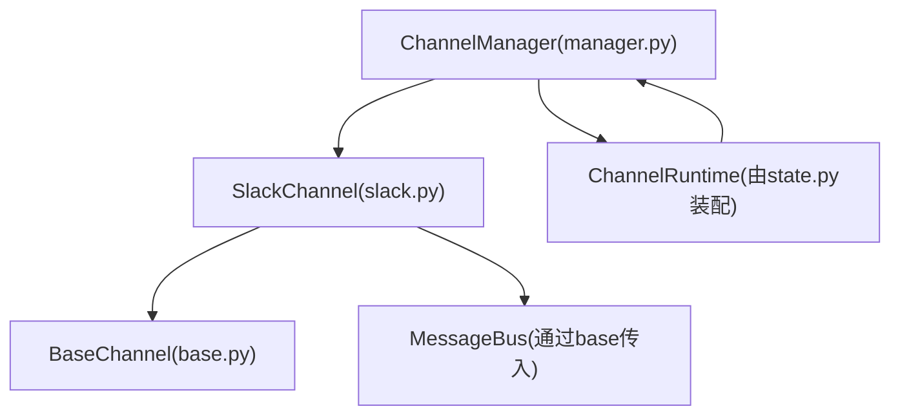
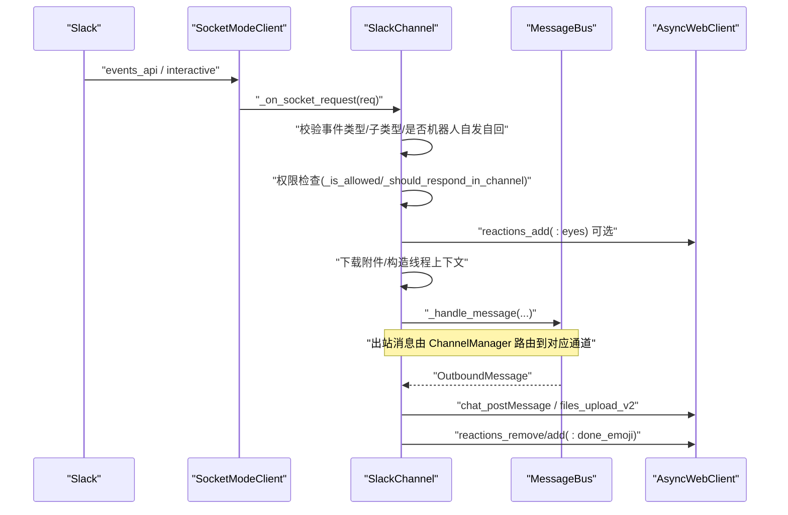
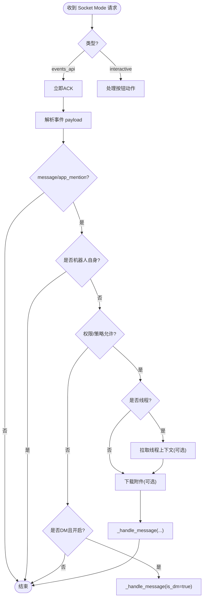
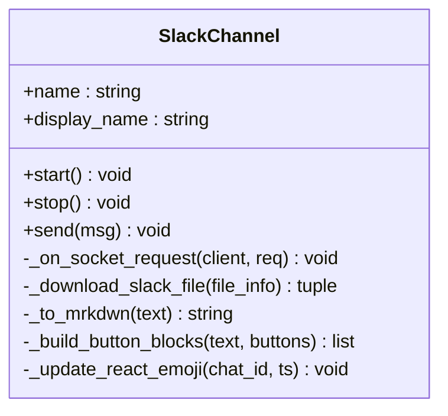
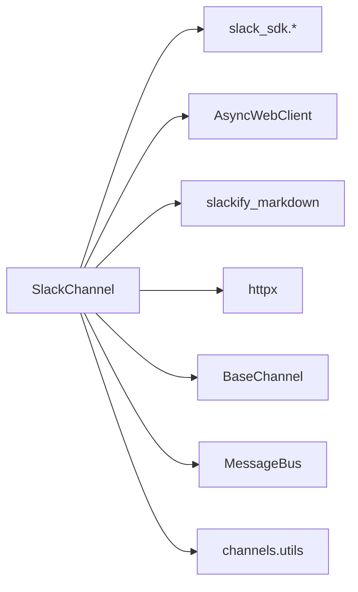

# Slack渠道实现

<cite>
**本文引用的文件**
- [agent/src/channels/slack.py](file://agent/src/channels/slack.py)
- [agent/src/channels/base.py](file://agent/src/channels/base.py)
- [agent/src/channels/config.py](file://agent/src/channels/config.py)
- [agent/src/channels/manager.py](file://agent/src/channels/manager.py)
- [agent/src/api/state.py](file://agent/src/api/state.py)
- [agent/tests/test_slack_table_edge_columns.py](file://agent/tests/test_slack_table_edge_columns.py)
- [README.md](file://README.md)
</cite>

## 目录
1. [简介](#简介)
2. [项目结构](#项目结构)
3. [核心组件](#核心组件)
4. [架构总览](#架构总览)
5. [详细组件分析](#详细组件分析)
6. [依赖关系分析](#依赖关系分析)
7. [性能与可靠性](#性能与可靠性)
8. [故障排除指南](#故障排除指南)
9. [结论](#结论)
10. [附录：配置与环境变量](#附录：配置与环境变量)

## 简介
本章节面向需要在 Vibe-Trading 中集成 Slack 渠道的开发者与运维人员，系统性说明基于 Socket Mode 的 Slack Bot 集成方案。内容涵盖：
- Slack App 创建、OAuth 权限与 Socket Mode 配置要点
- 事件监听与消息处理流程（普通消息、富文本、附件、卡片按钮）
- 频道与用户路由机制、DM 对话处理策略
- 完整的配置参数与环境变量说明、部署步骤
- 错误处理、重连策略与性能优化建议
- 实际集成示例与常见问题排查

## 项目结构
Slack 渠道的实现位于 channels 子系统内，采用统一通道抽象，便于扩展其他 IM 平台。关键文件职责如下：
- slack.py：Slack 渠道实现，Socket Mode 连接、事件处理、消息发送、线程上下文、附件下载、按钮交互等
- base.py：通道基类，定义统一的启动/停止、消息收发、权限校验、配对码等接口
- config.py：加载 channels 配置到运行时
- manager.py：通道管理器，负责启用/停止通道、出站消息路由与重试
- api/state.py：API 服务初始化时装配 ChannelManager、ChannelRuntime 与 MessageBus



图表来源
- [agent/src/channels/slack.py:66-140](file://agent/src/channels/slack.py#L66-L140)
- [agent/src/channels/base.py:22-81](file://agent/src/channels/base.py#L22-L81)
- [agent/src/channels/manager.py:36-43](file://agent/src/channels/manager.py#L36-L43)
- [agent/src/api/state.py:86-110](file://agent/src/api/state.py#L86-L110)

章节来源
- [agent/src/channels/slack.py:1-755](file://agent/src/channels/slack.py#L1-L755)
- [agent/src/channels/base.py:1-200](file://agent/src/channels/base.py#L1-L200)
- [agent/src/channels/config.py:1-22](file://agent/src/channels/config.py#L1-L22)
- [agent/src/channels/manager.py:1-43](file://agent/src/channels/manager.py#L1-L43)
- [agent/src/api/state.py:86-110](file://agent/src/api/state.py#L86-L110)

## 核心组件
- SlackChannel：基于 Socket Mode 的 Slack 通道实现，负责：
  - 建立 WebSocket 连接并监听事件
  - 解析消息、附件、线程上下文、按钮点击
  - 将入站消息标准化后发布到消息总线
  - 将出站消息转换为 Slack 格式并发送
- BaseChannel：定义所有通道的统一接口与默认行为（权限、配对码、流式回调等）
- ChannelManager：管理多个通道的生命周期与出站消息路由，含重试策略
- API 状态装配：在 API 服务启动时构建 ChannelRuntime、ChannelManager 与 MessageBus，使各通道可被统一管理

章节来源
- [agent/src/channels/slack.py:66-140](file://agent/src/channels/slack.py#L66-L140)
- [agent/src/channels/base.py:22-81](file://agent/src/channels/base.py#L22-L81)
- [agent/src/channels/manager.py:36-43](file://agent/src/channels/manager.py#L36-L43)
- [agent/src/api/state.py:86-110](file://agent/src/api/state.py#L86-L110)

## 架构总览
下图展示了从 Slack 事件到业务处理的端到端流程，包括 Socket Mode 连接、事件分发、权限校验、线程上下文、出站消息与反应表情更新。



图表来源
- [agent/src/channels/slack.py:92-140](file://agent/src/channels/slack.py#L92-L140)
- [agent/src/channels/slack.py:312-455](file://agent/src/channels/slack.py#L312-L455)
- [agent/src/channels/slack.py:151-199](file://agent/src/channels/slack.py#L151-L199)
- [agent/src/channels/slack.py:620-641](file://agent/src/channels/slack.py#L620-L641)

## 详细组件分析

### SlackChannel：Socket Mode 与事件处理
- 启动流程
  - 校验 bot_token 与 app_token 是否存在
  - 使用 AsyncWebClient 进行 auth_test，获取 bot user_id
  - 使用 SocketModeClient 以 app_token 建立 WebSocket 连接，设置请求监听器
  - 连接超时保护（默认约45秒），失败则关闭并抛出异常
- 事件处理
  - 仅处理 events_api 类型的消息，interactive 类型用于按钮点击
  - 过滤非 message/app_mention 事件、忽略 bot 自身消息、避免重复处理
  - DM 与群组策略：根据 dm.policy、group_policy、allow_from/group_allow_from 控制响应
  - 线程上下文：首次进入线程时拉取历史消息，限制条数，避免过长上下文
  - 附件下载：通过私有链接下载图片/文件，失败时返回友好提示标记
  - 按钮交互：解析 Block Kit actions，转发为消息内容
- 消息发送
  - 支持 mrkdwn 富文本、长消息分块、Block Kit 按钮、文件上传
  - 自动维护线程 thread_ts，跨频道转发时丢弃原线程以避免错位
  - 完成后移除“进行中”表情并添加“完成”表情



图表来源
- [agent/src/channels/slack.py:312-455](file://agent/src/channels/slack.py#L312-L455)
- [agent/src/channels/slack.py:536-600](file://agent/src/channels/slack.py#L536-L600)
- [agent/src/channels/slack.py:456-495](file://agent/src/channels/slack.py#L456-L495)

章节来源
- [agent/src/channels/slack.py:92-140](file://agent/src/channels/slack.py#L92-L140)
- [agent/src/channels/slack.py:312-455](file://agent/src/channels/slack.py#L312-L455)
- [agent/src/channels/slack.py:505-535](file://agent/src/channels/slack.py#L505-L535)
- [agent/src/channels/slack.py:536-600](file://agent/src/channels/slack.py#L536-L600)
- [agent/src/channels/slack.py:620-641](file://agent/src/channels/slack.py#L620-L641)

### 消息格式转换与富文本支持
- Markdown 转 Slack mrkdwn：使用第三方库进行基础转换，并对表格、代码块、标题、粗体等进行修复
- 表格处理：保留空列头与空单元格，确保对齐；测试覆盖边界情况
- 长消息分块：超过 Slack 限制时自动拆分，保证完整送达
- 按钮与卡片：支持 Block Kit 按钮，最多25个元素，文本长度限制
- 附件上传：支持图片与文件，失败时给出可读提示



图表来源
- [agent/src/channels/slack.py:66-78](file://agent/src/channels/slack.py#L66-L78)
- [agent/src/channels/slack.py:151-199](file://agent/src/channels/slack.py#L151-L199)
- [agent/src/channels/slack.py:698-755](file://agent/src/channels/slack.py#L698-L755)

章节来源
- [agent/src/channels/slack.py:698-755](file://agent/src/channels/slack.py#L698-L755)
- [agent/tests/test_slack_table_edge_columns.py:43-69](file://agent/tests/test_slack_table_edge_columns.py#L43-L69)

### 频道与用户路由机制
- 目标解析：支持 #频道名、@用户名、频道ID、用户ID、引用格式 <#...>/<@...>
- 名称解析：调用 conversations_list/users_list 分页查找，结果缓存
- DM 打开：对目标用户调用 conversations_open，返回 DM channel ID
- 会话键：线程内会话 key 包含 chat_id 与 thread_ts，避免上下文泄漏

```mermaid
flowchart TD
T["目标标识"] --> R{"是否ID或引用?"}
R --> |是| UseID["直接使用ID"]
R --> |否| Name{"是否#或@"}
Name --> |#频道| FindCh["conversations_list 查找"]
Name --> |@用户| FindU["users_list 查找"]
FindCh --> CacheC["缓存channel ID"]
FindU --> OpenDM["conversations_open 打开DM"]
OpenDM --> CacheU["缓存DM ID"]
CacheC --> Return["返回目标ID"]
CacheU --> Return
UseID --> Return
```

图表来源
- [agent/src/channels/slack.py:201-295](file://agent/src/channels/slack.py#L201-L295)

章节来源
- [agent/src/channels/slack.py:201-295](file://agent/src/channels/slack.py#L201-L295)

### DM 对话处理策略
- DM 开关与策略：dm.enabled、dm.policy（open/allowlist）、dm.allow_from
- 未授权 DM：若开启 allowlist，会生成配对码并通过 send 返回，引导用户完成配对
- 已授权 DM：直接转发到消息总线，保持会话隔离

章节来源
- [agent/src/channels/base.py:165-200](file://agent/src/channels/base.py#L165-L200)
- [agent/src/channels/slack.py:642-653](file://agent/src/channels/slack.py#L642-L653)

### 出站消息与重试
- ChannelManager 负责出站消息路由，具备指数退避重试（1s、2s、4s）
- SlackChannel.send 负责具体发送逻辑，异常向上抛出以便重试

章节来源
- [agent/src/channels/manager.py:26-43](file://agent/src/channels/manager.py#L26-L43)
- [agent/src/channels/slack.py:151-199](file://agent/src/channels/slack.py#L151-L199)

## 依赖关系分析
- SlackChannel 依赖：
  - slack_sdk.socket_mode.*：Socket Mode 客户端与请求/响应对象
  - slack_sdk.web.async_client.AsyncWebClient：REST API 调用（auth_test、conversations_*、files_upload_v2、reactions_*）
  - slackify_markdown：Markdown 转 mrkdwn
  - httpx：异步 HTTP 客户端，用于下载私有文件
  - pydantic：配置模型校验
- 内部依赖：
  - BaseChannel：统一通道接口
  - MessageBus：消息总线，解耦入站/出站
  - utils：媒体目录、文件名安全化、消息分割等工具



图表来源
- [agent/src/channels/slack.py:1-23](file://agent/src/channels/slack.py#L1-L23)

章节来源
- [agent/src/channels/slack.py:1-23](file://agent/src/channels/slack.py#L1-L23)

## 性能与可靠性
- 连接与超时
  - Socket Mode 握手超时保护（默认约45秒），避免长时间阻塞
  - 文件下载超时与重定向跟随，防止慢网络挂起
- 并发与资源
  - 使用异步客户端，减少阻塞
  - 线程上下文拉取限制条数，避免过大负载
  - 目标解析结果缓存，降低 API 调用频率
- 稳定性
  - 事件 ACK 快速响应，避免 Slack 侧超时
  - 表情反应失败降级记录日志，不影响主流程
  - 出站消息异常抛出，交由 ChannelManager 重试

章节来源
- [agent/src/channels/slack.py:120-135](file://agent/src/channels/slack.py#L120-L135)
- [agent/src/channels/slack.py:456-495](file://agent/src/channels/slack.py#L456-L495)
- [agent/src/channels/slack.py:536-600](file://agent/src/channels/slack.py#L536-L600)
- [agent/src/channels/manager.py:26-43](file://agent/src/channels/manager.py#L26-L43)

## 故障排除指南
- 无法建立 Socket Mode 连接
  - 检查 app_token 是否正确配置
  - 确认防火墙/代理允许 WebSocket 出站（slack-sdk 的 websockets.connect 不受 HTTP(S)_PROXY 影响）
  - 查看启动日志中的握手超时信息
- 无法下载私有文件
  - 确认 bot token 有效且具备 files:read 权限
  - 检查 Slack 应用安装时授予的权限范围
  - 关注下载失败的日志与提示标记
- 频道/用户解析失败
  - 确认频道已加入、用户存在
  - 检查名称规范化与缓存命中
- 消息未响应
  - 检查 group_policy 与 allow_from 配置
  - 确认是否在 DM 场景下开启了 dm.enabled
  - 查看事件日志与权限判断分支

章节来源
- [agent/src/channels/slack.py:120-135](file://agent/src/channels/slack.py#L120-L135)
- [agent/src/channels/slack.py:456-495](file://agent/src/channels/slack.py#L456-L495)
- [agent/src/channels/slack.py:201-295](file://agent/src/channels/slack.py#L201-L295)
- [agent/src/channels/slack.py:642-671](file://agent/src/channels/slack.py#L642-L671)

## 结论
Vibe-Trading 的 Slack 渠道通过 Socket Mode 实现了稳定可靠的事件驱动集成，支持丰富的消息类型与交互能力。其模块化设计使得配置、权限、路由与发送逻辑清晰可控，配合 ChannelManager 的重试机制与完善的错误处理，适合在生产环境部署。建议在部署前仔细核对权限与网络策略，并根据团队需求调整 DM 与群组策略。

## 附录：配置与环境变量

### Slack App 创建与权限
- 创建 Slack App 并启用 Socket Mode
- 配置 OAuth 权限（至少需要以下范围）：
  - channels:read、groups:read、im:read、mpim:read（读取频道/群组/DM）
  - users:read（读取用户列表）
  - files:read（下载私有文件）
  - chat:write（发送消息）
  - reactions:write（添加/删除表情）
- 安装应用到工作区并授予权限

### 环境变量与配置项
- 必需
  - SLACK_APP_TOKEN：Socket Mode 应用令牌（app-level token）
  - SLACK_BOT_TOKEN：机器人令牌（bot token）
- 可选
  - SLACK_WEBHOOK_PATH：HTTP 事件路径（当前实现主要使用 Socket Mode，此字段保留）
  - SLACK_REPLY_IN_THREAD：是否在群组中回复到线程
  - SLACK_REACT_EMOJI / SLACK_DONE_EMOJI：进行中与完成表情
  - SLACK_INCLUDE_THREAD_CONTEXT / SLACK_THREAD_CONTEXT_LIMIT：线程上下文拉取开关与限制
  - SLACK_GROUP_POLICY：群组响应策略（open/mention/allowlist）
  - SLACK_GROUP_ALLOW_FROM：允许的群组 ID 列表
  - SLACK_DM_ENABLED / SLACK_DM_POLICY / SLACK_DM_ALLOW_FROM：DM 策略
  - SLACK_USER_TOKEN_READ_ONLY：只读用户令牌开关（当前实现未直接使用）
- 环境变量加载位置
  - 参考 .env 搜索顺序：~/.vibe-trading/.env → agent/.env → $CWD/.env

章节来源
- [agent/src/channels/slack.py:33-55](file://agent/src/channels/slack.py#L33-L55)
- [agent/src/channels/slack.py:92-118](file://agent/src/channels/slack.py#L92-L118)
- [README.md:728-746](file://README.md#L728-L746)

### 部署步骤
- 准备 .env 文件，填入 SLACK_APP_TOKEN 与 SLACK_BOT_TOKEN
- 启动 API 服务，系统会自动装配 ChannelManager、ChannelRuntime 与 MessageBus
- 验证 Socket Mode 连接成功，观察日志输出
- 在 Slack 中测试 DM 与群组消息，确认权限与策略生效

章节来源
- [agent/src/api/state.py:86-110](file://agent/src/api/state.py#L86-L110)
- [agent/src/channels/config.py:11-22](file://agent/src/channels/config.py#L11-L22)