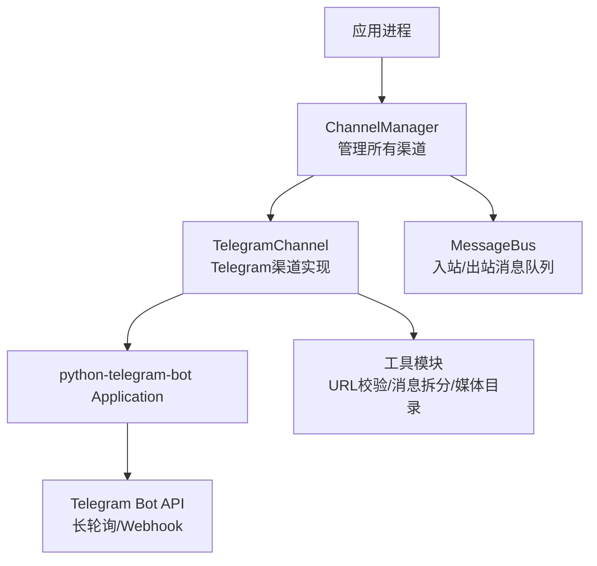
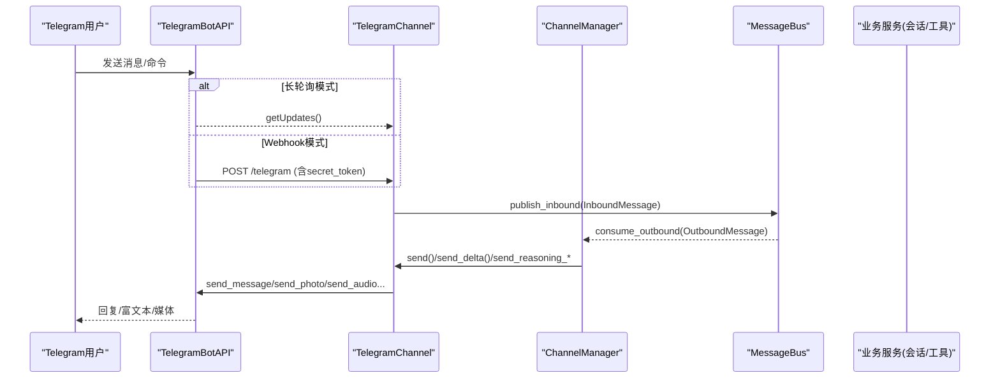
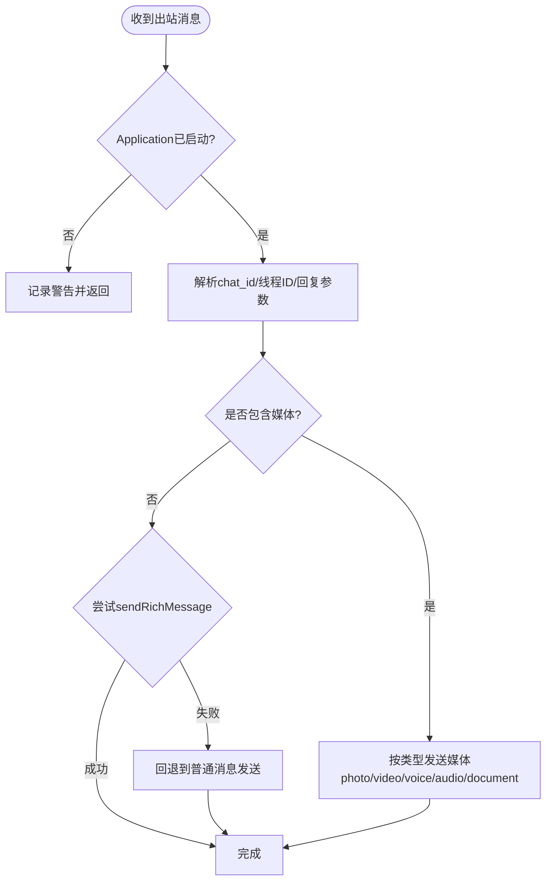
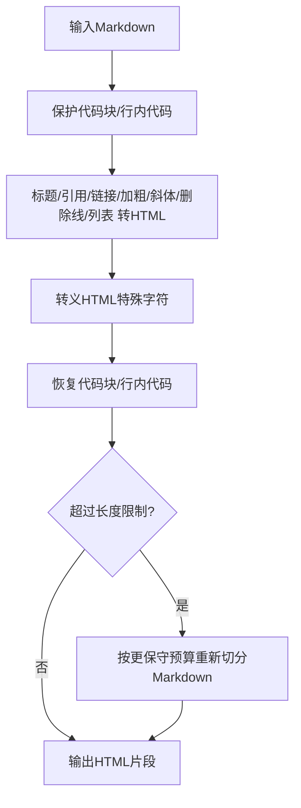
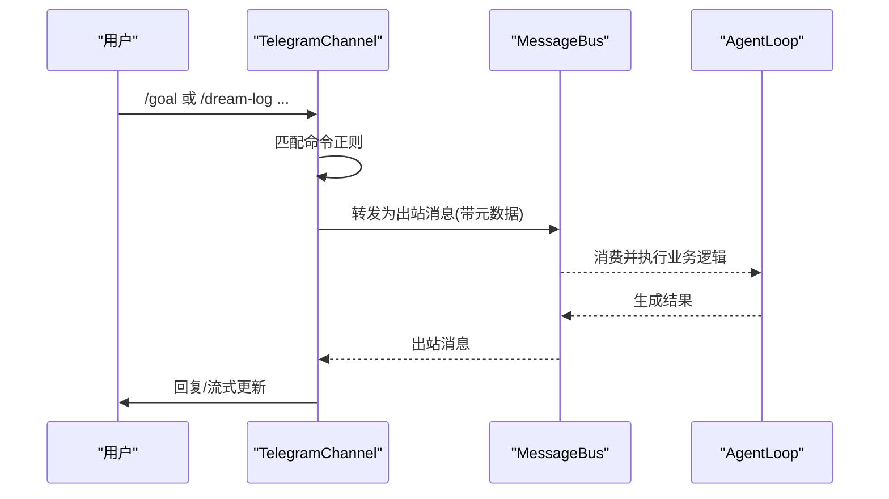
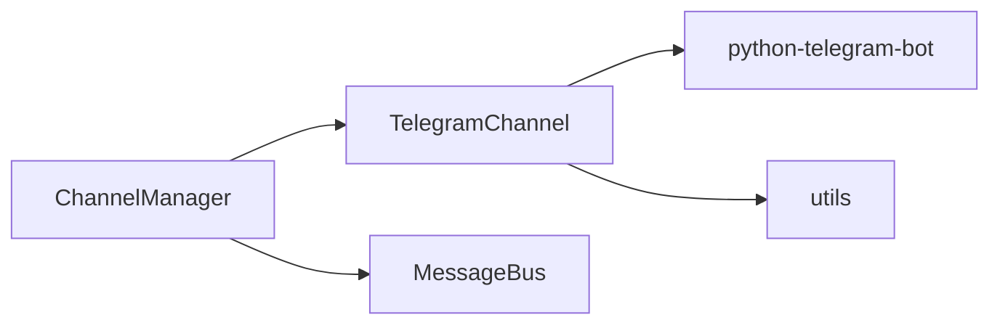

# Telegram渠道实现

<cite>
**本文引用的文件**
- [agent/src/channels/telegram.py](file://agent/src/channels/telegram.py)
- [agent/src/channels/base.py](file://agent/src/channels/base.py)
- [agent/src/channels/manager.py](file://agent/src/channels/manager.py)
- [agent/src/channels/utils.py](file://agent/src/channels/utils.py)
- [agent/src/config/env_schema.py](file://agent/src/config/env_schema.py)
- [README.md](file://README.md)
</cite>

## 目录
1. [简介](#简介)
2. [项目结构](#项目结构)
3. [核心组件](#核心组件)
4. [架构总览](#架构总览)
5. [详细组件分析](#详细组件分析)
6. [依赖关系分析](#依赖关系分析)
7. [性能与可靠性](#性能与可靠性)
8. [配置与环境变量](#配置与环境变量)
9. [部署指南](#部署指南)
10. [错误处理与故障排除](#错误处理与故障排除)
11. [结论](#结论)

## 简介
本章节面向希望在 Vibe-Trading 中接入 Telegram 渠道的开发者与运维人员，系统性说明：
- 如何通过 BotFather 创建机器人、获取 Token、设置 Webhook（或启用长轮询）
- Telegram 消息格式转换（文本、Markdown、HTML、图片、文件、音频、视频等）
- 用户与群组的消息路由机制、命令处理与功能扩展点
- 长轮询与 Webhook 两种接收方式的优缺点与配置方法
- 完整配置参数、环境变量、部署步骤
- 错误处理、重试策略与性能优化方案
- 集成示例与常见问题排查

## 项目结构
Vibe-Trading 将“聊天渠道”抽象为统一接口，Telegram 作为其中一个具体实现。关键路径如下：
- 渠道基类与通用能力：[base.py](file://agent/src/channels/base.py)
- Telegram 渠道实现：[telegram.py](file://agent/src/channels/telegram.py)
- 渠道管理器（启动/停止/出站分发/重试）：[manager.py](file://agent/src/channels/manager.py)
- 工具函数（URL安全校验、消息拆分、媒体目录等）：[utils.py](file://agent/src/channels/utils.py)
- 环境变量集中定义（LLM、数据源等；Telegram 相关字段由渠道配置承载）：[env_schema.py](file://agent/src/config/env_schema.py)
- 全局 README 的环境变量说明入口：[README.md](file://README.md)

图表来源
- [agent/src/channels/manager.py:213-252](file://agent/src/channels/manager.py#L213-L252)
- [agent/src/channels/telegram.py:510-623](file://agent/src/channels/telegram.py#L510-L623)
- [agent/src/channels/utils.py:53-89](file://agent/src/channels/utils.py#L53-L89)

章节来源
- [agent/src/channels/base.py:22-81](file://agent/src/channels/base.py#L22-L81)
- [agent/src/channels/manager.py:36-137](file://agent/src/channels/manager.py#L36-L137)
- [agent/src/channels/telegram.py:423-623](file://agent/src/channels/telegram.py#L423-L623)

## 核心组件
- TelegramChannel：基于 python-telegram-bot 的渠道实现，支持长轮询与 Webhook，提供消息收发、流式编辑、富文本渲染、内联键盘、媒体发送等能力。
- BaseChannel：抽象出各渠道的统一接口（start/stop/send/streaming hooks），并内置权限校验、配对码流程、入站转发到 MessageBus。
- ChannelManager：负责发现、初始化、启动/停止各渠道，统一出站消息分发与重试，屏蔽重复消息与流式合并。
- utils：提供 URL 安全校验、消息分块、媒体目录等通用能力。

章节来源
- [agent/src/channels/telegram.py:368-487](file://agent/src/channels/telegram.py#L368-L487)
- [agent/src/channels/base.py:22-177](file://agent/src/channels/base.py#L22-L177)
- [agent/src/channels/manager.py:36-137](file://agent/src/channels/manager.py#L36-L137)
- [agent/src/channels/utils.py:53-141](file://agent/src/channels/utils.py#L53-L141)

## 架构总览
下图展示从 Telegram 客户端到 Vibe-Trading 内部消息总线，再到出站回复的端到端流程。

图表来源
- [agent/src/channels/telegram.py:510-623](file://agent/src/channels/telegram.py#L510-L623)
- [agent/src/channels/manager.py:283-369](file://agent/src/channels/manager.py#L283-L369)

## 详细组件分析

### TelegramChannel 能力与数据流
- 配置模型 TelegramConfig：包含 enabled、token、mode(polling/webhook)、allow_from、proxy、reply_to_message、react_emoji、group_policy、连接池大小、超时、streaming、inline_keyboards、rich_messages、webhook_url/host/port/path/secret_token/max_connections 等。
- 启动流程 start：
  - 构建 HTTPXRequest 连接池（区分 API 请求与 getUpdates 请求，避免争用）。
  - 注册命令与消息处理器（/start、/help、/new、/goal、/dream-* 等）。
  - 根据 mode 选择 start_webhook 或 start_polling。
  - 获取 bot 信息并注册命令菜单。
- 消息处理：
  - 支持文本、图片、视频、语音、文档、位置等多类型入站消息。
  - 支持 Markdown/HTML 富文本转换与分段发送，保证不超过 Telegram 限制。
  - 支持流式编辑（edit_message_text）与进度指示。
  - 支持内联键盘回调（可选）。
- 出站发送 send：
  - 自动识别媒体类型（photo/video/voice/audio/document）。
  - 支持本地文件与远程 URL（需通过 URL 安全校验）。
  - 支持 reply_parameters、message_thread_id（群主题）、reaction 移除等。
  - 尝试 sendRichMessage（Bot API 10.1），失败则回退到传统方式。

图表来源
- [agent/src/channels/telegram.py:733-800](file://agent/src/channels/telegram.py#L733-L800)
- [agent/src/channels/telegram.py:678-732](file://agent/src/channels/telegram.py#L678-L732)

章节来源
- [agent/src/channels/telegram.py:368-487](file://agent/src/channels/telegram.py#L368-L487)
- [agent/src/channels/telegram.py:510-623](file://agent/src/channels/telegram.py#L510-L623)
- [agent/src/channels/telegram.py:650-800](file://agent/src/channels/telegram.py#L650-L800)

### 消息格式转换（Markdown/HTML）
- 将 Markdown 转换为 Telegram HTML，保留代码块、表格、链接、粗体、斜体、删除线、列表等。
- 对超长内容按 Telegram 限制进行智能切分，避免破坏 fenced code block 与表格结构。
- 流式编辑时提供纯文本预览，隐藏原始 Markdown 标记以提升可读性。

图表来源
- [agent/src/channels/telegram.py:228-341](file://agent/src/channels/telegram.py#L228-L341)

章节来源
- [agent/src/channels/telegram.py:228-341](file://agent/src/channels/telegram.py#L228-L341)

### 用户与群组路由、命令处理
- 权限控制：
  - allow_from 白名单（支持 id|username 形式兼容旧配置）。
  - 未授权 DM 会下发配对码，引导授权。
- 命令路由：
  - 内置 /start、/new、/stop、/restart、/status、/history、/goal、/pairing、/model、/skill、/dream、/dream-log、/dream-restore、/help 等。
  - 正则匹配支持 @botname 后缀，便于在群组中使用。
  - 部分命令通过 _forward_command 转发至 AgentLoop 处理。

图表来源
- [agent/src/channels/telegram.py:434-456](file://agent/src/channels/telegram.py#L434-L456)
- [agent/src/channels/telegram.py:544-558](file://agent/src/channels/telegram.py#L544-L558)
- [agent/src/channels/base.py:179-227](file://agent/src/channels/base.py#L179-L227)

章节来源
- [agent/src/channels/telegram.py:434-456](file://agent/src/channels/telegram.py#L434-L456)
- [agent/src/channels/base.py:165-227](file://agent/src/channels/base.py#L165-L227)

### 长轮询 vs Webhook
- 长轮询（polling）：
  - 优点：无需公网域名/HTTPS，开发调试方便。
  - 缺点：受限于网络质量，延迟略高，不适合高并发场景。
  - 配置：mode=polling，无需 webhook_url。
- Webhook：
  - 优点：低延迟、适合生产环境，可水平扩展。
  - 缺点：需要公网 HTTPS 域名、反向代理、secret_token 校验。
  - 配置：mode=webhook，必须提供 webhook_url（HTTPS）、webhook_secret_token、监听 host/port/path。

章节来源
- [agent/src/channels/telegram.py:368-420](file://agent/src/channels/telegram.py#L368-L420)
- [agent/src/channels/telegram.py:600-619](file://agent/src/channels/telegram.py#L600-L619)

## 依赖关系分析
- TelegramChannel 依赖 python-telegram-bot 的 Application、Handler、filters、HTTPXRequest 等。
- ChannelManager 负责发现并加载 channel 插件，统一调度出站消息与重试。
- utils 提供 URL 安全校验与消息分块，保障外部资源访问安全与消息合规。

图表来源
- [agent/src/channels/manager.py:64-137](file://agent/src/channels/manager.py#L64-L137)
- [agent/src/channels/telegram.py:15-35](file://agent/src/channels/telegram.py#L15-L35)
- [agent/src/channels/utils.py:97-141](file://agent/src/channels/utils.py#L97-L141)

章节来源
- [agent/src/channels/manager.py:64-137](file://agent/src/channels/manager.py#L64-L137)
- [agent/src/channels/telegram.py:15-35](file://agent/src/channels/telegram.py#L15-L35)

## 性能与可靠性
- 连接池隔离：API 请求与 getUpdates 使用独立连接池，避免互相阻塞。
- 流式合并：ChannelManager 对连续 _stream_delta 进行合并，减少 API 调用次数。
- 重试策略：出站消息发送采用指数退避重试（默认最多2次，间隔1s/2s/4s）。
- 富文本降级：若服务器不支持 sendRichMessage，自动降级为普通消息发送。
- URL 安全：对外部媒体 URL 进行严格校验，禁止私有/环回地址，防止 SSRF。

章节来源
- [agent/src/channels/telegram.py:520-539](file://agent/src/channels/telegram.py#L520-L539)
- [agent/src/channels/manager.py:371-419](file://agent/src/channels/manager.py#L371-L419)
- [agent/src/channels/manager.py:421-453](file://agent/src/channels/manager.py#L421-L453)
- [agent/src/channels/telegram.py:678-732](file://agent/src/channels/telegram.py#L678-L732)
- [agent/src/channels/utils.py:97-141](file://agent/src/channels/utils.py#L97-L141)

## 配置与环境变量
- Telegram 渠道配置项（位于 channels.telegram.TelegramConfig）：
  - enabled：是否启用
  - token：BotFather 提供的 Token
  - mode：polling 或 webhook
  - allow_from：允许的用户/群组白名单
  - proxy：代理字符串（可选）
  - reply_to_message：是否以回复形式发送
  - react_emoji：收到消息后的表情反应
  - group_policy：群组策略（open/mention）
  - connection_pool_size/pool_timeout：连接池大小与超时
  - streaming：是否启用流式编辑
  - inline_keyboards：是否启用内联键盘
  - rich_messages：是否尝试使用 sendRichMessage（Bot API 10.1）
  - stream_edit_interval：流式编辑最小间隔
  - webhook_url：Webhook 公网 HTTPS URL（webhook 模式必填）
  - webhook_listen_host/port/path：本地监听地址与路径
  - webhook_secret_token：Webhook 校验密钥（webhook 模式必填）
  - webhook_max_connections：Webhook 最大连接数
- 环境变量：
  - 本项目的环境变量集中在 env_schema.py 中定义（如 LLM、数据源等）。
  - Telegram 渠道的配置通过 channels 配置段传入，不直接映射为环境变量键名。
  - 全局 README 提供了环境变量概览与示例路径。

章节来源
- [agent/src/channels/telegram.py:368-420](file://agent/src/channels/telegram.py#L368-L420)
- [agent/src/config/env_schema.py:1-115](file://agent/src/config/env_schema.py#L1-L115)
- [README.md:728-746](file://README.md#L728-L746)

## 部署指南
- 创建机器人：
  - 在 Telegram 中与 BotFather 对话，创建新机器人并获取 Token。
- 配置渠道：
  - 在 channels.telegram 配置段中设置 enabled、token、mode 等。
  - 若使用 Webhook，设置 webhook_url（HTTPS）、webhook_secret_token、监听端口与路径。
- 启动服务：
  - 启动 Vibe-Trading 后端，ChannelManager 会自动发现并启动启用的渠道。
  - 确认 TelegramChannel.start 成功，日志显示 bot 已连接。
- 验证：
  - 向机器人发送 /start、/help 等命令，检查是否能正常响应。
  - 若启用 Webhook，确保反向代理将公网 HTTPS 流量转发到配置的本地端口与路径。

章节来源
- [agent/src/channels/telegram.py:510-623](file://agent/src/channels/telegram.py#L510-L623)
- [agent/src/channels/manager.py:213-252](file://agent/src/channels/manager.py#L213-L252)

## 错误处理与故障排除
- 常见错误：
  - Token 未配置：启动时记录错误并跳过。
  - Webhook URL 非 HTTPS 或缺失 secret_token：配置校验失败。
  - sendRichMessage 不可用：自动降级为普通消息发送。
  - URL 不安全：拒绝发送来自私有/环回地址的媒体。
- 重试与降级：
  - 出站消息发送失败时，ChannelManager 执行指数退避重试。
  - 富文本发送失败时，自动切换为传统发送路径。
- 诊断建议：
  - 检查日志中的错误堆栈与警告信息。
  - 确认网络连接、代理设置、防火墙规则。
  - 对于 Webhook，确认公网可达性与反向代理配置正确。

章节来源
- [agent/src/channels/telegram.py:510-519](file://agent/src/channels/telegram.py#L510-L519)
- [agent/src/channels/telegram.py:678-732](file://agent/src/channels/telegram.py#L678-L732)
- [agent/src/channels/utils.py:97-141](file://agent/src/channels/utils.py#L97-L141)
- [agent/src/channels/manager.py:421-453](file://agent/src/channels/manager.py#L421-L453)

## 结论
Vibe-Trading 的 Telegram 渠道实现了完整的消息收发、富文本渲染、流式编辑、权限控制与命令路由，并提供长轮询与 Webhook 两种模式以适应不同部署场景。通过统一的 ChannelManager 与 MessageBus，系统具备良好的可扩展性与可靠性。结合严格的 URL 安全校验与重试降级机制，可在生产环境中稳定运行。