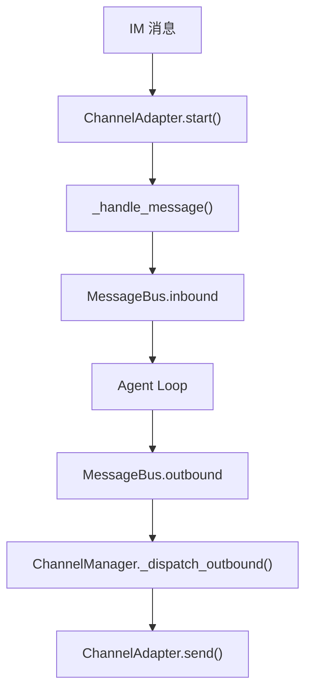
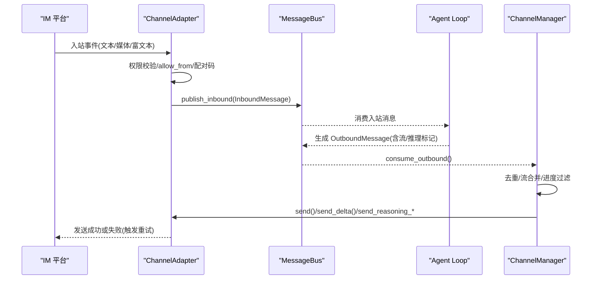
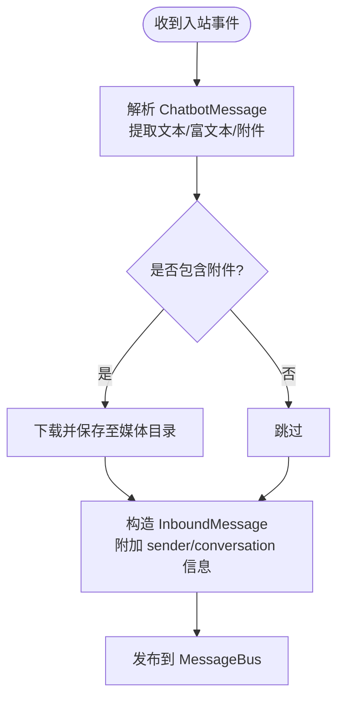
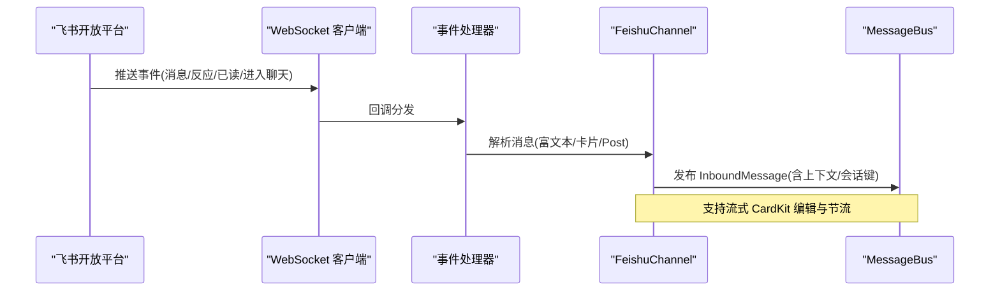
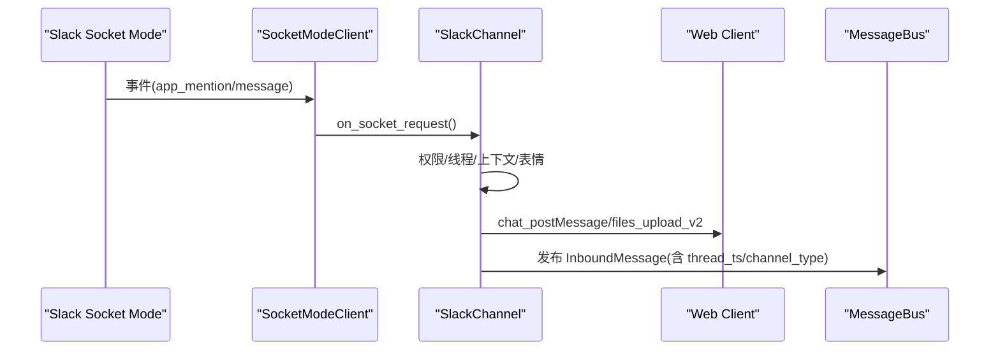
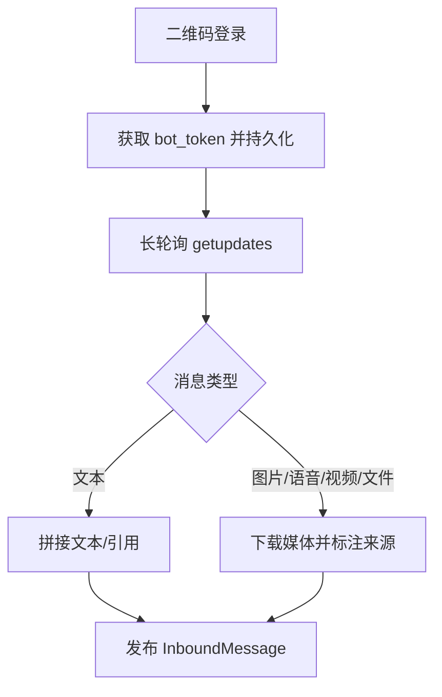
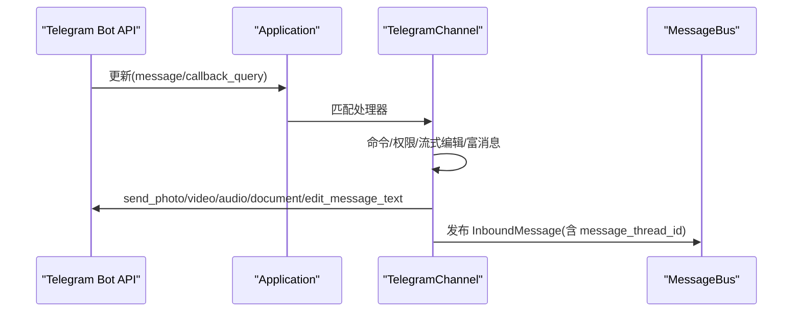
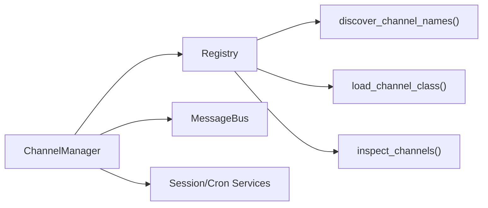

# 内置渠道实现

<cite>
**本文引用的文件**
- [agent/src/channels/__init__.py](file://agent/src/channels/__init__.py)
- [agent/src/channels/base.py](file://agent/src/channels/base.py)
- [agent/src/channels/config.py](file://agent/src/channels/config.py)
- [agent/src/channels/manager.py](file://agent/src/channels/manager.py)
- [agent/src/channels/registry.py](file://agent/src/channels/registry.py)
- [agent/src/channels/dingtalk.py](file://agent/src/channels/dingtalk.py)
- [agent/src/channels/feishu.py](file://agent/src/channels/feishu.py)
- [agent/src/channels/slack.py](file://agent/src/channels/slack.py)
- [agent/src/channels/weixin.py](file://agent/src/channels/weixin.py)
- [agent/src/channels/telegram.py](file://agent/src/channels/telegram.py)
</cite>

## 目录
1. [简介](#简介)
2. [项目结构](#项目结构)
3. [核心组件](#核心组件)
4. [架构总览](#架构总览)
5. [详细组件分析](#详细组件分析)
6. [依赖关系分析](#依赖关系分析)
7. [性能与限制](#性能与限制)
8. [故障排除指南](#故障排除指南)
9. [结论](#结论)
10. [附录：配置与环境变量](#附录配置与环境变量)

## 简介
本文件为 Vibe-Trading 内置消息渠道的权威技术文档，覆盖钉钉、飞书、Slack、微信、Telegram、Discord 等平台的接入方式、认证流程、API 调用限制、消息格式转换、消息队列与重试策略、错误恢复方案、配置参数与环境变量、部署注意事项以及企业级集成最佳实践。读者可据此完成多渠道接入、排障与优化。

## 项目结构
Vibe-Trading 的消息渠道采用插件化架构：统一的抽象基类定义入站/出站契约，管理器负责通道发现、启动、路由与重试；各平台通过独立模块实现具体协议细节。

图表来源
- [agent/src/channels/__init__.py:6-21](file://agent/src/channels/__init__.py#L6-L21)
- [agent/src/channels/base.py:179-227](file://agent/src/channels/base.py#L179-L227)
- [agent/src/channels/manager.py:283-341](file://agent/src/channels/manager.py#L283-L341)

章节来源
- [agent/src/channels/__init__.py:1-49](file://agent/src/channels/__init__.py#L1-L49)

## 核心组件
- BaseChannel：抽象接口，统一入站处理（权限校验、配对码）、出站发送、流式更新与推理内容推送钩子。
- ChannelManager：通道生命周期管理、出站分发、去重、流合并、指数退避重试、进度/工具提示过滤。
- Registry：自动发现内置与插件通道，检查可选依赖可用性，提供安装提示。
- Config：从结构化 Agent 配置加载 channels 配置段。

章节来源
- [agent/src/channels/base.py:22-238](file://agent/src/channels/base.py#L22-L238)
- [agent/src/channels/manager.py:36-253](file://agent/src/channels/manager.py#L36-L253)
- [agent/src/channels/registry.py:87-284](file://agent/src/channels/registry.py#L87-L284)
- [agent/src/channels/config.py:11-22](file://agent/src/channels/config.py#L11-L22)

## 架构总览
下图展示从 IM 平台到 Agent 再到出站的完整链路，包括权限校验、配对授权、流式聚合与重试。

图表来源
- [agent/src/channels/base.py:179-227](file://agent/src/channels/base.py#L179-L227)
- [agent/src/channels/manager.py:283-453](file://agent/src/channels/manager.py#L283-L453)

## 详细组件分析

### 通用通道基类与消息总线
- 入站处理：校验 allow_from，未授权 DM 返回配对码；支持将“希望流式”标记注入元数据。
- 出站分发：根据元数据路由到普通发送、流式增量、推理块、文件编辑事件等。
- 重试策略：默认最多尝试 2 次，按 1s/2s/4s 指数退避；可通过全局 send_max_retries 调整。
- 流合并：对同一目标与 stream_id 的连续 _stream_delta 进行合并，减少 API 调用。
- 去重：基于内容指纹与 origin/message_id 抑制重复回复。

章节来源
- [agent/src/channels/base.py:154-227](file://agent/src/channels/base.py#L154-L227)
- [agent/src/channels/manager.py:256-453](file://agent/src/channels/manager.py#L256-L453)

### 钉钉（DingTalk）
- 认证方式：Stream 模式，使用 client_id/client_secret 初始化 SDK；发送消息需获取 access_token（HTTP）。
- 连接与接收：通过 dingtalk-stream WebSocket 长连接接收事件；崩溃后自动重连。
- 消息格式：
  - 文本：Markdown 模板 sampleMarkdown。
  - 图片：优先 photoURL 直链，失败回退上传 media_id。
  - 文件/音视频：先识别类型，必要时将 HTML 压缩为 zip 再上传。
- 媒体安全：远程 URL 下载支持 SSRF 校验、跳转白名单、大小限制（20MB）。
- 群聊与会话：group: 前缀区分群会话；可选 group_user_isolation 按用户隔离会话。
- 配置要点：enabled, client_id, client_secret, allow_from, allow_remote_media_redirects, remote_media_redirect_allowed_hosts, group_user_isolation。

图表来源
- [agent/src/channels/dingtalk.py:46-164](file://agent/src/channels/dingtalk.py#L46-L164)
- [agent/src/channels/dingtalk.py:694-727](file://agent/src/channels/dingtalk.py#L694-L727)

章节来源
- [agent/src/channels/dingtalk.py:166-774](file://agent/src/channels/dingtalk.py#L166-L774)

### 飞书（Feishu/Lark）
- 认证方式：WebSocket 长连接；支持扫码创建应用并自动写入凭据（设备码流程），也可手动配置 app_id/app_secret。
- 连接与接收：lark-oapi WebSocket 客户端在独立线程运行，避免事件循环冲突；支持反应、已读等扩展事件。
- 消息格式：
  - 富文本/卡片：递归提取 user_dsl/elements/body/card/header 等，转换为可读文本。
  - Post（图文）：支持直接/本地化/包裹三种结构，提取标题与正文，收集图片 key。
  - 流式更新：CardKit streaming 以单条消息持续编辑，节流间隔 0.5s。
- 群策略：topic_isolation 控制话题级会话隔离；reply_to_message 控制引用回复。
- 配置要点：enabled, app_id, app_secret, encrypt_key, verification_token, allow_from, react_emoji, done_emoji, tool_hint_prefix, group_policy, reply_to_message, streaming, domain, topic_isolation。

图表来源
- [agent/src/channels/feishu.py:39-67](file://agent/src/channels/feishu.py#L39-L67)
- [agent/src/channels/feishu.py:667-785](file://agent/src/channels/feishu.py#L667-L785)

章节来源
- [agent/src/channels/feishu.py:341-800](file://agent/src/channels/feishu.py#L341-L800)

### Slack
- 认证方式：Socket Mode（app_token + bot_token），无需公网 Webhook。
- 连接与接收：SocketModeClient 建立 WSS；超时保护（握手 45s）；auth_test 获取 bot user id。
- 消息格式：
  - Markdown → mrkdwn 转换，表格转列表，代码块保护，链接修复。
  - 支持线程回复、按钮 Block Kit、表情反应（进行中/完成）。
  - 文件：files_upload_v2；私有文件通过 bot token 下载。
- 群组策略：open/mention/allowlist，支持 require_mention 强化仅响应被 @ 的消息。
- 配置要点：enabled, mode, webhook_path, bot_token, app_token, user_token_read_only, reply_in_thread, react_emoji, done_emoji, include_thread_context, thread_context_limit, allow_from, group_policy, group_allow_from, group_require_mention, dm.enabled/policy/allow_from。

图表来源
- [agent/src/channels/slack.py:92-140](file://agent/src/channels/slack.py#L92-L140)
- [agent/src/channels/slack.py:151-199](file://agent/src/channels/slack.py#L151-L199)
- [agent/src/channels/slack.py:312-454](file://agent/src/channels/slack.py#L312-L454)

章节来源
- [agent/src/channels/slack.py:25-755](file://agent/src/channels/slack.py#L25-L755)

### 微信（个人号 WeChat）
- 认证方式：二维码登录 ilinkai.weixin.qq.com，获得 bot_token；状态持久化到 account.json。
- 连接与接收：HTTP 长轮询 getupdates；服务器建议 poll_timeout 动态调整；会话过期自动暂停并重试。
- 消息格式：
  - 文本/引用：保留引用标题与内容；图片/语音/视频/文件分别下载并标注来源。
  - 语音：优先平台转写，否则尝试本地转录。
  - 媒体：CDN 地址与加密查询参数解析；失败时输出占位符。
- 配置要点：enabled, allow_from, base_url, cdn_base_url, route_tag, token, state_dir, poll_timeout。

图表来源
- [agent/src/channels/weixin.py:327-416](file://agent/src/channels/weixin.py#L327-L416)
- [agent/src/channels/weixin.py:538-593](file://agent/src/channels/weixin.py#L538-L593)
- [agent/src/channels/weixin.py:598-800](file://agent/src/channels/weixin.py#L598-L800)

章节来源
- [agent/src/channels/weixin.py:121-800](file://agent/src/channels/weixin.py#L121-L800)

### Telegram
- 认证方式：Bot Token；支持 polling 与 webhook 两种模式（webhook 需 HTTPS 公网 URL 与 secret token）。
- 连接与接收：python-telegram-bot Application；命令菜单注册；支持 inline keyboard 回调。
- 消息格式：
  - Markdown → HTML 转换，表格转为 box-drawing 文本，代码块/行内代码保护。
  - 流式编辑：edit_message_text 节流（默认 0.6s），按 HTML 长度切分不超过 4096。
  - 富消息：sendRichMessage（Bot API 10.1+），不可用时降级。
- 配置要点：enabled, token, mode, allow_from, proxy, reply_to_message, react_emoji, group_policy, connection_pool_size, pool_timeout, streaming, inline_keyboards, rich_messages, stream_edit_interval, webhook_url/path/port/secret/max_connections。

图表来源
- [agent/src/channels/telegram.py:510-623](file://agent/src/channels/telegram.py#L510-L623)
- [agent/src/channels/telegram.py:733-800](file://agent/src/channels/telegram.py#L733-L800)

章节来源
- [agent/src/channels/telegram.py:368-800](file://agent/src/channels/telegram.py#L368-L800)

### Discord
- 可用性与依赖：通过 registry 暴露 discord 通道名与安装提示；若启用但未安装依赖，状态会显示 unavailable 并提供 pip 安装命令。
- 说明：当前仓库未包含具体实现源码，启用时需安装对应可选依赖并按标准渠道配置。

章节来源
- [agent/src/channels/registry.py:33-50](file://agent/src/channels/registry.py#L33-L50)

## 依赖关系分析
- 通道发现：pkgutil 扫描内置模块；entry_points 加载外部插件；内置优先于插件。
- 可选依赖：部分通道使用懒加载或标志位检测（如 lark_oapi、dingtalk_stream、neonize），缺失时给出安装提示。
- 管理器依赖：需要 MessageBus、Session/Cron 服务（websocket/matrix 等特殊通道）。

图表来源
- [agent/src/channels/registry.py:87-284](file://agent/src/channels/registry.py#L87-L284)
- [agent/src/channels/manager.py:64-156](file://agent/src/channels/manager.py#L64-L156)

章节来源
- [agent/src/channels/registry.py:87-284](file://agent/src/channels/registry.py#L87-L284)
- [agent/src/channels/manager.py:64-156](file://agent/src/channels/manager.py#L64-L156)

## 性能与限制
- 出站重试：默认最大 2 次，退避 1s/2s/4s；可通过 send_max_retries 调整。
- 流式聚合：对同一目标的连续 _stream_delta 合并，降低 API 压力。
- 去重：基于内容指纹与 origin/message_id 抑制重复回复。
- 平台限制：
  - Slack：消息上限约 39k 字符；WSS 握手超时保护。
  - Telegram：HTML 渲染上限 4096；Markdown 切分保证不破坏代码块。
  - 钉钉：远程媒体最大 20MB；跳转次数限制。
  - 微信：长轮询超时由服务端建议；会话过期自动暂停。
  - 飞书：CardKit 流式编辑节流 0.5s。

章节来源
- [agent/src/channels/manager.py:26-28](file://agent/src/channels/manager.py#L26-L28)
- [agent/src/channels/manager.py:371-419](file://agent/src/channels/manager.py#L371-L419)
- [agent/src/channels/slack.py:57-63](file://agent/src/channels/slack.py#L57-L63)
- [agent/src/channels/telegram.py:37-43](file://agent/src/channels/telegram.py#L37-L43)
- [agent/src/channels/dingtalk.py:23-24](file://agent/src/channels/dingtalk.py#L23-L24)
- [agent/src/channels/weixin.py:78-101](file://agent/src/channels/weixin.py#L78-L101)
- [agent/src/channels/feishu.py:584](file://agent/src/channels/feishu.py#L584)

## 故障排除指南
- 通道不可用：
  - 检查依赖是否安装（registry 提供安装提示）。
  - 查看 status 中 available/error/install_hint。
- 无法登录/认证失败：
  - 钉钉：确认 client_id/client_secret 正确；access_token 刷新失败检查网络。
  - 飞书：使用 QR 登录或确保 app_id/app_secret/domain 正确。
  - Slack：确认 bot_token/app_token；WSS 握手超时检查防火墙/代理。
  - 微信：二维码登录成功后 token 持久化；若会话过期，等待自动恢复。
  - Telegram：token 正确；webhook 模式需 HTTPS 公网 URL 与 secret。
- 消息发送失败：
  - 观察 manager 的重试日志；必要时增大 send_max_retries。
  - 媒体上传失败：检查文件大小、类型、URL 安全性与平台限制。
- 权限与配对：
  - 未授权 DM 会返回配对码；将用户加入 allow_from 或通过 pairing store 批准。
  - Slack/飞书/钉钉群组策略：open/mention/allowlist 按需配置。

章节来源
- [agent/src/channels/registry.py:130-160](file://agent/src/channels/registry.py#L130-L160)
- [agent/src/channels/dingtalk.py:215-258](file://agent/src/channels/dingtalk.py#L215-L258)
- [agent/src/channels/feishu.py:609-659](file://agent/src/channels/feishu.py#L609-L659)
- [agent/src/channels/slack.py:92-139](file://agent/src/channels/slack.py#L92-L139)
- [agent/src/channels/weixin.py:443-483](file://agent/src/channels/weixin.py#L443-L483)
- [agent/src/channels/telegram.py:510-623](file://agent/src/channels/telegram.py#L510-L623)
- [agent/src/channels/base.py:165-211](file://agent/src/channels/base.py#L165-L211)

## 结论
Vibe-Trading 的内置渠道通过统一抽象与灵活管理器实现了多 IM 平台的一致接入体验。各平台在认证、消息格式、流式能力与限制方面各有特色，但均遵循相同的入站/出站契约与重试/去重机制。结合本文的配置与排障指南，可在企业环境中稳定部署与运维。

## 附录：配置与环境变量
- 全局通道开关与布尔覆盖：
  - send_progress、send_tool_hints、show_reasoning（支持 camelCase 别名）。
  - restrict_to_workspace（matrix 通道）。
- 各通道配置示例（字段含义见上文“配置要点”）：
  - 钉钉：enabled, client_id, client_secret, allow_from, allow_remote_media_redirects, remote_media_redirect_allowed_hosts, group_user_isolation。
  - 飞书：enabled, app_id, app_secret, encrypt_key, verification_token, allow_from, react_emoji, done_emoji, tool_hint_prefix, group_policy, reply_to_message, streaming, domain, topic_isolation。
  - Slack：enabled, mode, webhook_path, bot_token, app_token, user_token_read_only, reply_in_thread, react_emoji, done_emoji, include_thread_context, thread_context_limit, allow_from, group_policy, group_allow_from, group_require_mention, dm.enabled/policy/allow_from。
  - 微信：enabled, allow_from, base_url, cdn_base_url, route_tag, token, state_dir, poll_timeout。
  - Telegram：enabled, token, mode, allow_from, proxy, reply_to_message, react_emoji, group_policy, connection_pool_size, pool_timeout, streaming, inline_keyboards, rich_messages, stream_edit_interval, webhook_url/path/port/secret/max_connections。
- 环境变量/可选依赖：
  - 各通道通过 registry 的 _AVAILABILITY_FLAGS/_LAZY_IMPORT_PACKAGES 与 _INSTALL_HINTS 提示缺失依赖及安装命令。
  - 例如：dingtalk、discord、feishu、msteams、qq、wecom、slack、telegram、whatsapp、matrix、mochat、napcat、signal、weixin、websocket 等。

章节来源
- [agent/src/channels/manager.py:29-33](file://agent/src/channels/manager.py#L29-L33)
- [agent/src/channels/registry.py:33-63](file://agent/src/channels/registry.py#L33-L63)