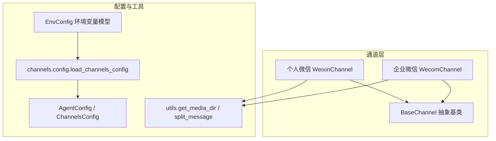
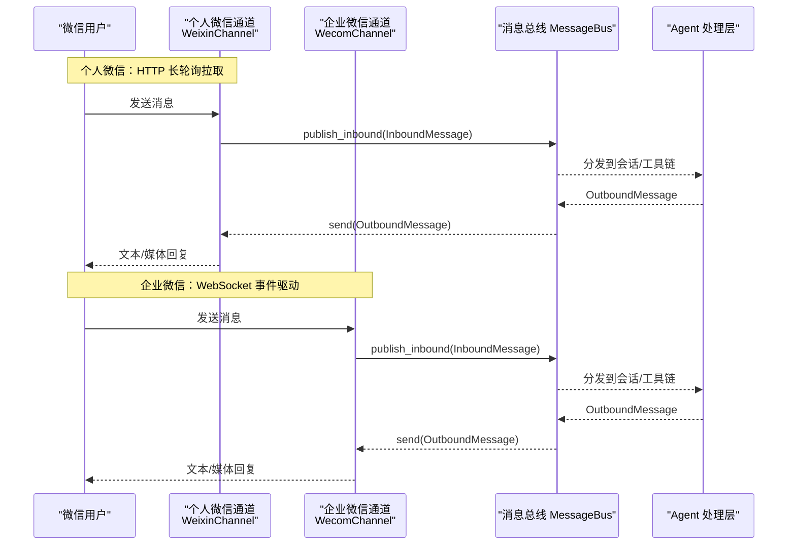
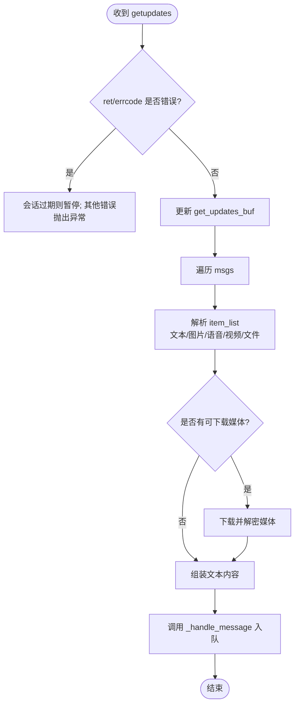
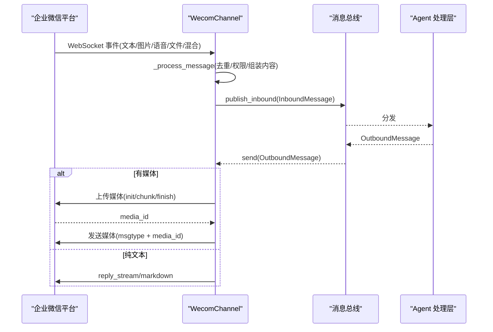
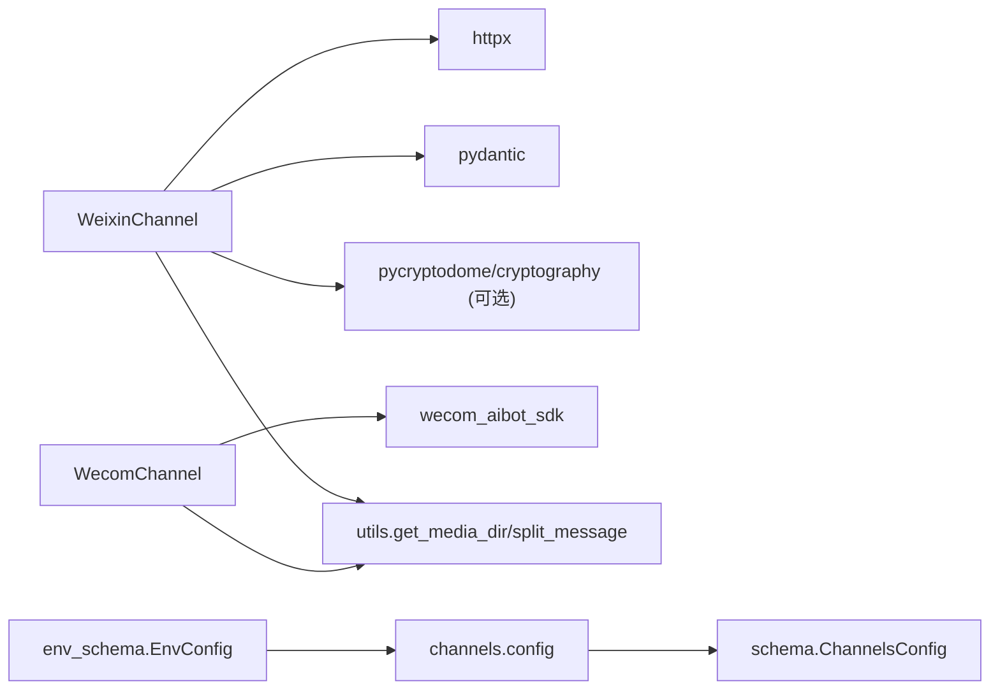

# 微信渠道实现

<cite>
**本文引用的文件**
- [weixin.py](file://agent/src/channels/weixin.py)
- [wecom.py](file://agent/src/channels/wecom.py)
- [base.py](file://agent/src/channels/base.py)
- [config.py](file://agent/src/channels/config.py)
- [schema.py](file://agent/src/config/schema.py)
- [env_schema.py](file://agent/src/config/env_schema.py)
- [utils.py](file://agent/src/channels/utils.py)
</cite>

## 目录
1. [简介](#简介)
2. [项目结构](#项目结构)
3. [核心组件](#核心组件)
4. [架构总览](#架构总览)
5. [详细组件分析](#详细组件分析)
6. [依赖关系分析](#依赖关系分析)
7. [性能与限制](#性能与限制)
8. [故障排查指南](#故障排查指南)
9. [结论](#结论)
10. [附录：配置与环境变量](#附录配置与环境变量)

## 简介
本章节面向 Vibe-Trading 的“微信渠道”集成，覆盖两类微信生态接入方式：
- 个人微信（WeChat）：通过 HTTP 长轮询接口与 ilinkai.weixin.qq.com 通信，使用二维码登录获取 bot token，支持文本、图片、语音、视频、文件等消息收发。
- 企业微信（WeCom）：基于 WebSocket 长连接（wecom_aibot_sdk），无需公网 Webhook，支持文本、图片、语音、文件、混合内容等消息收发。

文档将说明应用配置、消息回调/事件处理、认证机制、平台限制与安全验证、身份识别与会话管理、消息路由、错误处理策略、媒体加密解密、部署步骤以及常见问题解决方案。

## 项目结构
微信相关代码集中在 channels 子模块中，遵循统一的通道抽象基类，便于扩展与维护。

图表来源
- [weixin.py:121-169](file://agent/src/channels/weixin.py#L121-L169)
- [wecom.py:54-100](file://agent/src/channels/wecom.py#L54-L100)
- [base.py:22-82](file://agent/src/channels/base.py#L22-L82)
- [config.py:11-21](file://agent/src/channels/config.py#L11-L21)
- [schema.py:429-456](file://agent/src/config/schema.py#L429-L456)
- [env_schema.py:545-577](file://agent/src/config/env_schema.py#L545-L577)
- [utils.py:16-32](file://agent/src/channels/utils.py#L16-L32)

章节来源
- [weixin.py:121-169](file://agent/src/channels/weixin.py#L121-L169)
- [wecom.py:54-100](file://agent/src/channels/wecom.py#L54-L100)
- [base.py:22-82](file://agent/src/channels/base.py#L22-L82)
- [config.py:11-21](file://agent/src/channels/config.py#L11-L21)
- [schema.py:429-456](file://agent/src/config/schema.py#L429-L456)
- [env_schema.py:545-577](file://agent/src/config/env_schema.py#L545-L577)
- [utils.py:16-32](file://agent/src/channels/utils.py#L16-L32)

## 核心组件
- 个人微信通道 WeixinChannel
  - 使用 HTTP 长轮询从 ilinkai.weixin.qq.com 拉取消息，二维码登录获取并持久化 bot token。
  - 支持多类型消息解析与下载（文本、图片、语音、视频、文件），内置 AES 解密与分片发送。
  - 维护 context_token、typing_ticket、会话暂停与退避重试等状态。
- 企业微信通道 WecomChannel
  - 使用 wecom_aibot_sdk 建立 WebSocket 长连接，接收事件并转发到消息总线。
  - 支持图片/语音/文件下载与上传（分块 base64 上传协议），流式回复与欢迎消息。
- 通道基类 BaseChannel
  - 统一抽象 start/stop/send、权限校验 allow_from、配对码流程、消息入队发布。
- 配置加载与结构化
  - load_channels_config 读取 agent.json 中的 channels 配置；ChannelsConfig 定义全局通道开关与重试策略。
  - EnvConfig 集中管理环境变量，提供默认值与类型校验。

章节来源
- [weixin.py:121-169](file://agent/src/channels/weixin.py#L121-L169)
- [wecom.py:54-100](file://agent/src/channels/wecom.py#L54-L100)
- [base.py:22-82](file://agent/src/channels/base.py#L22-L82)
- [config.py:11-21](file://agent/src/channels/config.py#L11-L21)
- [schema.py:429-456](file://agent/src/config/schema.py#L429-L456)
- [env_schema.py:545-577](file://agent/src/config/env_schema.py#L545-L577)

## 架构总览
下图展示微信渠道在 Vibe-Trading 中的整体交互：客户端消息经通道适配器进入消息总线，再由上层 Agent 处理并回写至对应微信渠道。

图表来源
- [weixin.py:538-593](file://agent/src/channels/weixin.py#L538-L593)
- [wecom.py:102-148](file://agent/src/channels/wecom.py#L102-L148)
- [base.py:179-227](file://agent/src/channels/base.py#L179-L227)

## 详细组件分析

### 个人微信（WeixinChannel）
- 认证与登录
  - 二维码登录流程：获取二维码、轮询扫码状态、成功后保存 bot token、base_url 等状态。
  - 状态持久化：account.json 保存 token、get_updates_buf、context_tokens、typing_tickets、base_url。
- 消息接收
  - 长轮询 getupdates，按服务器建议调整超时；去重处理 message_id；上下文 token 缓存与刷新。
  - 解析 item_list，支持文本、图片、语音、视频、文件；引用消息合并；语音优先使用转写文本，否则尝试本地转录。
- 媒体下载与解密
  - 根据 media 字段选择 full_url 或 encrypt_query_param 下载；AES-128-ECB 解密；失败时回退策略。
- 消息发送
  - 文本分片发送（最大长度限制）；媒体先上传 CDN（AES 加密 + 分块），再发送媒体消息；打字指示器保活。
  - 工具提示缓冲合并，避免触发 iLink 频率限制。
- 会话与限流
  - 会话过期自动暂停一段时间；context_token 过期前主动刷新；typing_ticket 定期续期。

图表来源
- [weixin.py:538-593](file://agent/src/channels/weixin.py#L538-L593)
- [weixin.py:598-831](file://agent/src/channels/weixin.py#L598-L831)
- [weixin.py:837-928](file://agent/src/channels/weixin.py#L837-L928)

章节来源
- [weixin.py:327-415](file://agent/src/channels/weixin.py#L327-L415)
- [weixin.py:443-515](file://agent/src/channels/weixin.py#L443-L515)
- [weixin.py:538-593](file://agent/src/channels/weixin.py#L538-L593)
- [weixin.py:598-831](file://agent/src/channels/weixin.py#L598-L831)
- [weixin.py:837-928](file://agent/src/channels/weixin.py#L837-L928)
- [weixin.py:1088-1222](file://agent/src/channels/weixin.py#L1088-L1222)
- [weixin.py:1287-1474](file://agent/src/channels/weixin.py#L1287-L1474)
- [weixin.py:1477-1587](file://agent/src/channels/weixin.py#L1477-L1587)

### 企业微信（WecomChannel）
- 认证与连接
  - 使用 WSClient 建立 WebSocket 长连接，自动重连与心跳；需要 bot_id 与 secret。
- 事件处理
  - 注册多种消息事件处理器（text/image/voice/file/mixed），统一进入 _process_message。
  - 进入聊天事件 enter_chat 支持欢迎消息。
- 媒体处理
  - 下载：通过 SDK 提供的 download_file 获取并保存；大小限制与文件名安全处理。
  - 上传：三步协议（init → chunk × N → finish），分块 base64 传输，返回 media_id。
- 消息发送
  - 有 frame 时使用 reply_stream 进行流式回复；无 frame 时主动发送 markdown。
  - 媒体文件先上传，再发送对应 msgtype。

图表来源
- [wecom.py:102-148](file://agent/src/channels/wecom.py#L102-L148)
- [wecom.py:173-191](file://agent/src/channels/wecom.py#L173-L191)
- [wecom.py:217-355](file://agent/src/channels/wecom.py#L217-L355)
- [wecom.py:356-490](file://agent/src/channels/wecom.py#L356-L490)
- [wecom.py:492-555](file://agent/src/channels/wecom.py#L492-L555)

章节来源
- [wecom.py:54-100](file://agent/src/channels/wecom.py#L54-L100)
- [wecom.py:102-148](file://agent/src/channels/wecom.py#L102-L148)
- [wecom.py:173-191](file://agent/src/channels/wecom.py#L173-L191)
- [wecom.py:217-355](file://agent/src/channels/wecom.py#L217-L355)
- [wecom.py:356-490](file://agent/src/channels/wecom.py#L356-L490)
- [wecom.py:492-555](file://agent/src/channels/wecom.py#L492-L555)

### 通道基类与通用能力
- 权限控制：allow_from 白名单、配对码流程、跨通道 operator 授权。
- 消息入队：统一封装 InboundMessage，支持媒体路径与元数据。
- 流式能力：send_delta、send_reasoning_delta/end、send_file_edit_events 等钩子。

章节来源
- [base.py:22-82](file://agent/src/channels/base.py#L22-L82)
- [base.py:152-227](file://agent/src/channels/base.py#L152-L227)

## 依赖关系分析
- 通道对基础库的依赖
  - 个人微信：httpx、pydantic、可选 qrcode、可选 pycryptodome/cryptography（用于 AES）。
  - 企业微信：wecom_aibot_sdk（WSClient、generate_req_id、download_file）。
- 配置依赖
  - channels.config.load_channels_config 读取 agent.json 的 channels 部分。
  - schema.ChannelsConfig 定义全局通道开关、重试次数、回复超时、operators。
  - env_schema.EnvConfig 提供环境变量默认值与类型校验。
- 工具依赖
  - utils.get_media_dir 为各通道媒体文件提供统一存储根目录。
  - utils.split_message 用于文本分片发送。

图表来源
- [weixin.py:27-37](file://agent/src/channels/weixin.py#L27-L37)
- [wecom.py:1-21](file://agent/src/channels/wecom.py#L1-L21)
- [config.py:11-21](file://agent/src/channels/config.py#L11-L21)
- [schema.py:429-456](file://agent/src/config/schema.py#L429-L456)
- [env_schema.py:545-577](file://agent/src/config/env_schema.py#L545-L577)
- [utils.py:16-32](file://agent/src/channels/utils.py#L16-L32)

章节来源
- [weixin.py:27-37](file://agent/src/channels/weixin.py#L27-L37)
- [wecom.py:1-21](file://agent/src/channels/wecom.py#L1-L21)
- [config.py:11-21](file://agent/src/channels/config.py#L11-L21)
- [schema.py:429-456](file://agent/src/config/schema.py#L429-L456)
- [env_schema.py:545-577](file://agent/src/config/env_schema.py#L545-L577)
- [utils.py:16-32](file://agent/src/channels/utils.py#L16-L32)

## 性能与限制
- 个人微信
  - 消息长度限制：单条文本最大约 4000 字符，超出会分片发送。
  - iLink 频率限制：工具提示消息会被缓冲合并，避免频繁触发限流（约每 5 分钟 7 条）。
  - 会话过期：errcode 为特定值时会暂停会话一段时间，避免无效请求。
  - context_token 有效期较短，发送前会主动刷新以防丢失。
- 企业微信
  - 媒体上传大小限制：入站媒体限制 200MB；出站上传分块（每块 512KB raw，base64 编码）。
  - 流式回复：使用 reply_stream 提升用户体验；无 frame 时仅支持 markdown 主动推送。
- 通用
  - URL 安全校验：媒体下载目标需通过 validate_url_target，禁止私有/组播地址。
  - 文件路径安全：文件名清理与路径检查，防止越权访问。

章节来源
- [weixin.py:55-57](file://agent/src/channels/weixin.py#L55-L57)
- [weixin.py:1031-1064](file://agent/src/channels/weixin.py#L1031-L1064)
- [weixin.py:538-593](file://agent/src/channels/weixin.py#L538-L593)
- [weixin.py:972-1029](file://agent/src/channels/weixin.py#L972-L1029)
- [wecom.py:23-27](file://agent/src/channels/wecom.py#L23-L27)
- [wecom.py:356-490](file://agent/src/channels/wecom.py#L356-L490)
- [utils.py:97-180](file://agent/src/channels/utils.py#L97-L180)

## 故障排查指南
- 个人微信
  - 二维码登录失败：检查网络、二维码是否过期；日志会提示刷新次数上限。
  - 会话过期：出现 errcode 特定值时会自动暂停会话；等待恢复后继续轮询。
  - 媒体下载失败：优先尝试 full_url，失败回退 encrypt_query_param；若仍失败记录日志。
  - 发送失败：media 上传失败会降级为文本提示；网络/服务端错误会抛出以便重试。
- 企业微信
  - SDK 未安装：启动时打印安装提示；缺少 bot_id/secret 会直接报错。
  - 媒体下载失败：检查 aeskey 与 url；记录警告并跳过该媒体。
  - 上传失败：init/chunk/finish 任一阶段失败都会记录错误并返回 None。
  - 流式回复错误：确保使用 reply_stream；普通 reply 不支持 text msgtype。
- 通用
  - 权限拒绝：allow_from 未包含 sender_id 且非 DM；DM 会下发配对码。
  - 路径/URL 不安全：validate_url_target 拒绝私有/组播地址；文件名清理避免越权。

章节来源
- [weixin.py:327-415](file://agent/src/channels/weixin.py#L327-L415)
- [weixin.py:538-593](file://agent/src/channels/weixin.py#L538-L593)
- [weixin.py:837-928](file://agent/src/channels/weixin.py#L837-L928)
- [weixin.py:1155-1222](file://agent/src/channels/weixin.py#L1155-L1222)
- [wecom.py:102-148](file://agent/src/channels/wecom.py#L102-L148)
- [wecom.py:217-355](file://agent/src/channels/wecom.py#L217-L355)
- [wecom.py:356-490](file://agent/src/channels/wecom.py#L356-L490)
- [wecom.py:492-555](file://agent/src/channels/wecom.py#L492-L555)
- [base.py:165-227](file://agent/src/channels/base.py#L165-L227)
- [utils.py:97-180](file://agent/src/channels/utils.py#L97-L180)

## 结论
Vibe-Trading 的微信渠道提供了两套成熟方案：个人微信通过 HTTP 长轮询与企业微信通过 WebSocket 长连接，均具备完善的认证、消息解析、媒体处理、会话管理与错误恢复能力。结合统一的通道基类与结构化配置，可在不同场景下灵活启用与扩展。生产环境建议关注频率限制、会话过期、媒体大小与安全性校验，并结合日志与告警快速定位问题。

## 附录：配置与环境变量
- 个人微信（WeixinChannel）
  - enabled：是否启用
  - allow_from：允许的用户/群列表
  - base_url：iLink 服务地址
  - cdn_base_url：CDN 地址
  - route_tag：路由标签
  - token：手动设置的 bot token（或通过二维码登录获取）
  - state_dir：状态持久化目录（默认运行时子目录）
  - poll_timeout：长轮询超时秒数
- 企业微信（WecomChannel）
  - enabled：是否启用
  - bot_id：机器人 ID
  - secret：机器人密钥
  - allow_from：允许的用户/群列表
  - welcome_message：进入聊天时的欢迎消息
- 全局通道配置（ChannelsConfig）
  - send_progress：是否发送进度消息
  - send_tool_hints：是否发送工具提示
  - send_max_retries：发送最大重试次数
  - reply_timeout_s：回复超时时间
  - operators：跨通道操作员白名单
- 环境变量（EnvConfig）
  - 提供 LLM、数据源、API、Swarm、Agent 调优、路径、OCR、Memory 等分组的环境变量默认值与类型校验。
  - 可通过环境变量覆盖默认值，保证部署一致性。

章节来源
- [weixin.py:121-132](file://agent/src/channels/weixin.py#L121-L132)
- [wecom.py:54-62](file://agent/src/channels/wecom.py#L54-L62)
- [schema.py:429-456](file://agent/src/config/schema.py#L429-L456)
- [env_schema.py:545-577](file://agent/src/config/env_schema.py#L545-L577)