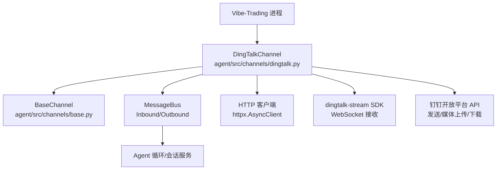
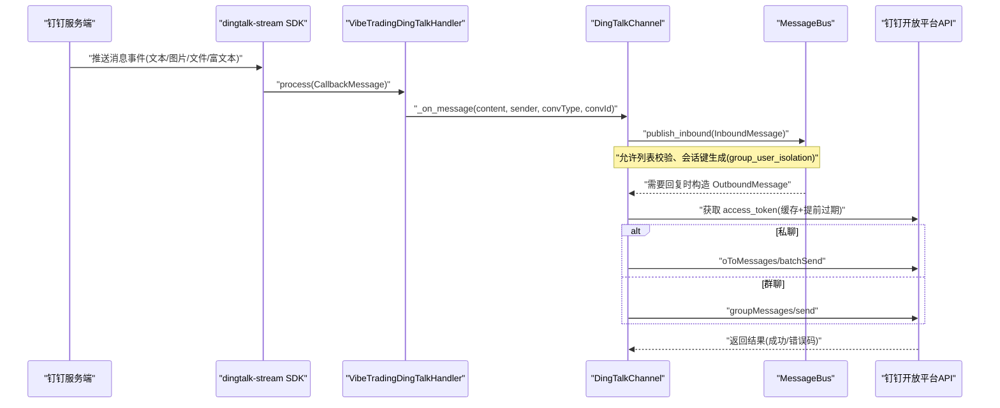
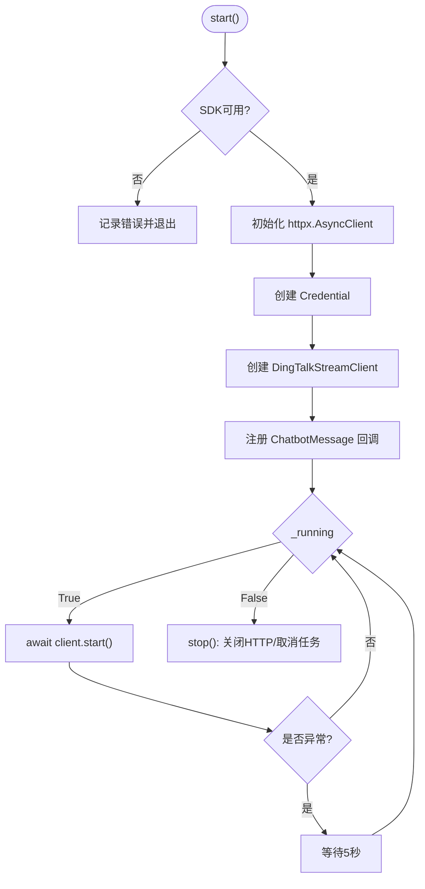
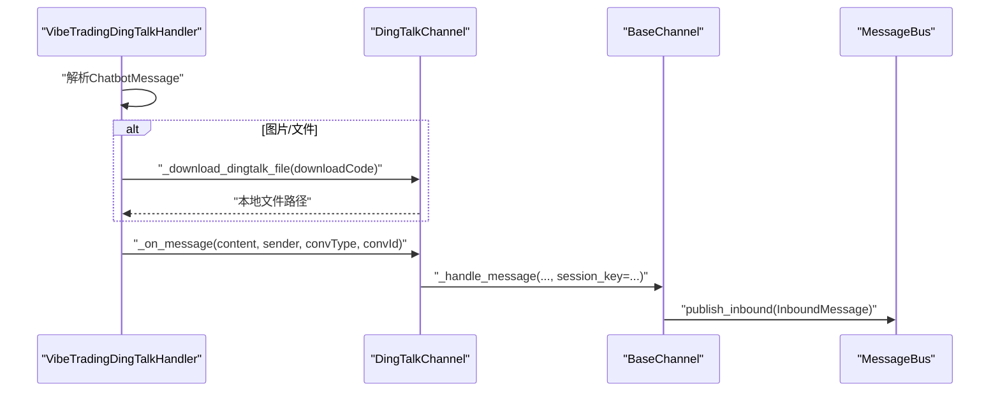
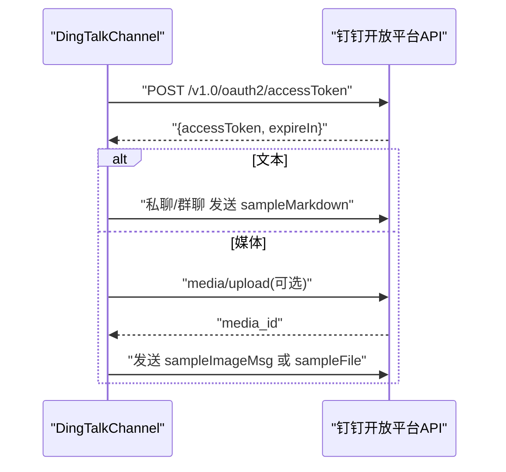
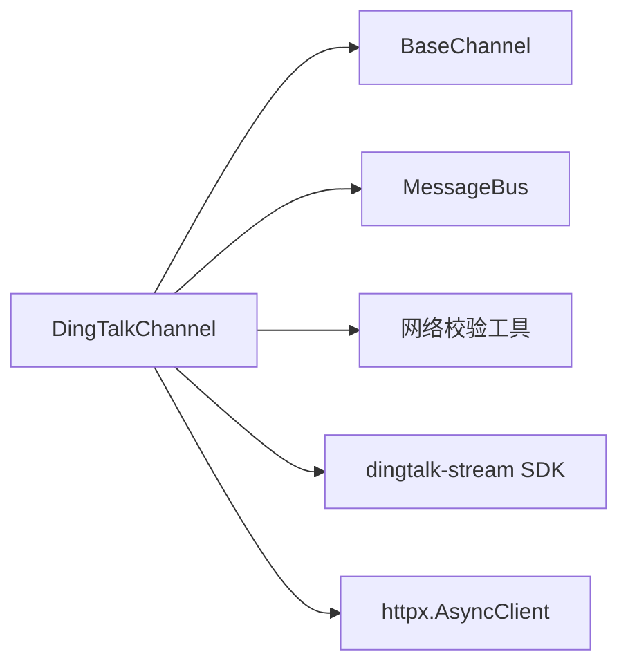

# 钉钉渠道实现

<cite>
**本文引用的文件**
- [agent/src/channels/dingtalk.py](file://agent/src/channels/dingtalk.py)
- [agent/src/channels/base.py](file://agent/src/channels/base.py)
- [agent/src/channels/bus/events.py](file://agent/src/channels/bus/events.py)
- [agent/src/channels/config.py](file://agent/src/channels/config.py)
- [agent/src/config/env_schema.py](file://agent/src/config/env_schema.py)
</cite>

## 目录
1. [简介](#简介)
2. [项目结构](#项目结构)
3. [核心组件](#核心组件)
4. [架构总览](#架构总览)
5. [详细组件分析](#详细组件分析)
6. [依赖关系分析](#依赖关系分析)
7. [性能与可靠性](#性能与可靠性)
8. [故障排查指南](#故障排查指南)
9. [结论](#结论)
10. [附录：配置与环境变量](#附录配置与环境变量)

## 简介
本章节面向 Vibe-Trading 的“钉钉渠道”实现，聚焦于基于 Stream Mode 的接入方式。文档覆盖以下要点：
- WebSocket 连接管理与自动重连机制
- 消息接收处理流程（文本、图片、文件、富文本）
- 消息发送流程（私聊与群聊差异）
- 认证方式（client_id/client_secret）、Access Token 获取与自动刷新
- group_user_isolation 配置对会话隔离的影响
- 错误处理、重试与故障恢复策略
- 部署注意事项与最佳实践

## 项目结构
钉钉渠道位于 channels 层，遵循统一的 BaseChannel 抽象，并通过消息总线与上层 Agent 循环交互。关键文件：
- 钉钉渠道实现：agent/src/channels/dingtalk.py
- 通道基类与权限控制：agent/src/channels/base.py
- 消息事件模型：agent/src/channels/bus/events.py
- 通道配置加载：agent/src/channels/config.py
- 环境变量统一 Schema：agent/src/config/env_schema.py

图表来源
- [agent/src/channels/dingtalk.py:178-258](file://agent/src/channels/dingtalk.py#L178-L258)
- [agent/src/channels/base.py:22-81](file://agent/src/channels/base.py#L22-L81)
- [agent/src/channels/bus/events.py:20-55](file://agent/src/channels/bus/events.py#L20-L55)

章节来源
- [agent/src/channels/dingtalk.py:178-258](file://agent/src/channels/dingtalk.py#L178-L258)
- [agent/src/channels/base.py:22-81](file://agent/src/channels/base.py#L22-L81)
- [agent/src/channels/bus/events.py:20-55](file://agent/src/channels/bus/events.py#L20-L55)

## 核心组件
- VibeTradingDingTalkHandler：基于 dingtalk-stream 的回调处理器，负责解析入站消息并转发到 channel。
- DingTalkConfig：钉钉渠道的配置模型，包含启用开关、凭证、白名单、媒体重定向策略、群组会话隔离等。
- DingTalkChannel：继承 BaseChannel，封装 Stream 模式启动、Token 管理、消息收发、媒体处理、错误处理等。

章节来源
- [agent/src/channels/dingtalk.py:46-176](file://agent/src/channels/dingtalk.py#L46-L176)
- [agent/src/channels/dingtalk.py:178-214](file://agent/src/channels/dingtalk.py#L178-L214)

## 架构总览
钉钉渠道采用“Stream Mode + HTTP 发送”的组合：
- 接收：通过 dingtalk-stream SDK 建立 WebSocket 长连接，订阅机器人消息事件；收到消息后解析为统一格式，经 BaseChannel._handle_message 发布到消息总线。
- 发送：使用 httpx 直接调用钉钉开放平台 REST API（私聊批量发送、群聊发送），必要时先上传媒体资源获取 media_id。

图表来源
- [agent/src/channels/dingtalk.py:56-163](file://agent/src/channels/dingtalk.py#L56-L163)
- [agent/src/channels/dingtalk.py:271-296](file://agent/src/channels/dingtalk.py#L271-L296)
- [agent/src/channels/dingtalk.py:550-602](file://agent/src/channels/dingtalk.py#L550-L602)
- [agent/src/channels/base.py:179-227](file://agent/src/channels/base.py#L179-L227)

## 详细组件分析

### WebSocket 连接管理与自动重连
- 启动流程：初始化 httpx.AsyncClient，创建 Credential 和 DingTalkStreamClient，注册 ChatbotMessage 回调处理器，进入 start() 循环。
- 异常恢复：若 SDK 抛出异常或退出，捕获后等待固定间隔重新拉起，保证服务高可用。
- 资源清理：stop() 关闭 HTTP 客户端并取消后台任务。

图表来源
- [agent/src/channels/dingtalk.py:215-258](file://agent/src/channels/dingtalk.py#L215-L258)

章节来源
- [agent/src/channels/dingtalk.py:215-258](file://agent/src/channels/dingtalk.py#L215-L258)

### 消息接收处理
- 解析：使用 ChatbotMessage.from_dict 解析消息体，兼容 text、extensions.recognition、richText 等字段。
- 附件处理：图片与文件通过 downloadCode 换取临时下载链接，下载后保存到媒体目录，并在内容中追加附件清单。
- 会话路由：根据 conversationType 判断私聊/群聊；群聊时使用 group: 前缀作为 chat_id；当开启 group_user_isolation 时，以 sender_id 区分不同用户的会话键。
- 权限控制：通过 BaseChannel.is_allowed 检查 allow_from 或配对授权，未授权私聊会下发配对码。

图表来源
- [agent/src/channels/dingtalk.py:56-163](file://agent/src/channels/dingtalk.py#L56-L163)
- [agent/src/channels/dingtalk.py:694-727](file://agent/src/channels/dingtalk.py#L694-L727)
- [agent/src/channels/base.py:179-227](file://agent/src/channels/base.py#L179-L227)

章节来源
- [agent/src/channels/dingtalk.py:56-163](file://agent/src/channels/dingtalk.py#L56-L163)
- [agent/src/channels/dingtalk.py:694-727](file://agent/src/channels/dingtalk.py#L694-L727)
- [agent/src/channels/base.py:179-227](file://agent/src/channels/base.py#L179-L227)

### 消息发送流程
- 文本：通过 sampleMarkdown 模板发送 Markdown 文本。
- 媒体：优先尝试图片 URL 直发；失败则下载/读取媒体字节，按类型推断扩展名，必要时将 HTML 压缩为 zip 再上传；上传成功后以 media_id 发送图片或转为文件发送。
- 私聊 vs 群聊：私聊使用 oToMessages/batchSend，群聊使用 groupMessages/send，chat_id 带 group: 前缀用于路由。

图表来源
- [agent/src/channels/dingtalk.py:271-296](file://agent/src/channels/dingtalk.py#L271-L296)
- [agent/src/channels/dingtalk.py:550-602](file://agent/src/channels/dingtalk.py#L550-L602)
- [agent/src/channels/dingtalk.py:612-670](file://agent/src/channels/dingtalk.py#L612-L670)

章节来源
- [agent/src/channels/dingtalk.py:550-602](file://agent/src/channels/dingtalk.py#L550-L602)
- [agent/src/channels/dingtalk.py:612-670](file://agent/src/channels/dingtalk.py#L612-L670)

### 认证与 Access Token 管理
- 认证凭据：使用 client_id 与 client_secret 构建 Credential，供 Stream SDK 鉴权。
- Token 获取：通过 HTTP POST 至 accessToken 接口获取 token，内部缓存并提前 60 秒过期，避免临界失效。
- 发送鉴权：在发送请求头携带 x-acs-dingtalk-access-token。

章节来源
- [agent/src/channels/dingtalk.py:224-238](file://agent/src/channels/dingtalk.py#L224-L238)
- [agent/src/channels/dingtalk.py:271-296](file://agent/src/channels/dingtalk.py#L271-L296)
- [agent/src/channels/dingtalk.py:561-562](file://agent/src/channels/dingtalk.py#L561-L562)

### 消息格式转换与多类型支持
- 文本：支持普通文本与富文本（粗体、斜体、行内代码、预格式化块）。
- 图片：支持图片消息与富文本中的图片附件；优先 URL 直发，失败回退到上传。
- 文件：支持文件消息与富文本中的文件附件；HTML 类型会被打包为 zip 后再上传。
- 音频/视频：通过扩展名推断媒体类型进行上传与发送。

章节来源
- [agent/src/channels/dingtalk.py:92-124](file://agent/src/channels/dingtalk.py#L92-L124)
- [agent/src/channels/dingtalk.py:302-339](file://agent/src/channels/dingtalk.py#L302-L339)
- [agent/src/channels/dingtalk.py:612-670](file://agent/src/channels/dingtalk.py#L612-L670)

### 群组聊天与私聊的差异及 group_user_isolation
- 私聊：chat_id 为用户 ID。
- 群聊：chat_id 使用 group:openConversationId 前缀，以便正确路由到群消息接口。
- group_user_isolation：开启后，群内每个用户拥有独立会话键，避免消息串扰。

章节来源
- [agent/src/channels/dingtalk.py:694-727](file://agent/src/channels/dingtalk.py#L694-L727)

### 媒体下载与安全控制
- 下载流程：通过 downloadCode 换取临时下载链接，再下载文件到媒体目录。
- 安全限制：远程媒体 URL 需通过目标校验；可配置是否允许重定向以及允许的域名白名单；限制最大文件大小与重定向次数。

章节来源
- [agent/src/channels/dingtalk.py:341-479](file://agent/src/channels/dingtalk.py#L341-L479)
- [agent/src/channels/dingtalk.py:728-773](file://agent/src/channels/dingtalk.py#L728-L773)

## 依赖关系分析
- 外部依赖：dingtalk-stream（可选，缺失时模块仍可定义类但无法运行）、httpx。
- 内部依赖：BaseChannel（权限与会话）、MessageBus（消息分发）、安全网络校验工具。

图表来源
- [agent/src/channels/dingtalk.py:17-21](file://agent/src/channels/dingtalk.py#L17-L21)
- [agent/src/channels/base.py:22-81](file://agent/src/channels/base.py#L22-L81)

章节来源
- [agent/src/channels/dingtalk.py:17-21](file://agent/src/channels/dingtalk.py#L17-L21)
- [agent/src/channels/base.py:22-81](file://agent/src/channels/base.py#L22-L81)

## 性能与可靠性
- 连接与超时：HTTP 客户端设置合理的连接/读写超时与连接池大小，避免阻塞。
- 流式下载：优先使用流式读取并累计字节数，超过阈值立即中止，防止内存膨胀。
- 重定向限制：最多允许有限次重定向，且仅允许同域或白名单域名跳转，降低 SSRF 风险。
- 自动重连：Stream 连接异常时指数外延的简单重连（固定间隔），保障可用性。
- Token 缓存：提前过期减少边界抖动导致的鉴权失败。

[本节提供通用指导，不直接分析具体文件]

## 故障排查指南
- 启动失败
  - 未安装 dingtalk-stream：日志提示需安装依赖。
  - 缺少 client_id/client_secret：日志提示未配置凭证。
- 接收不到消息
  - 检查 Stream 连接是否持续运行；关注异常日志与重连行为。
  - 确认回调已注册（ChatbotMessage.TOPIC）。
- 发送失败
  - 检查 access_token 获取是否成功；关注网络错误与 API 错误码。
  - 媒体发送失败时，会回退为可见文本提示，便于定位问题。
- 媒体下载失败
  - 检查远程 URL 是否被安全策略拦截（重定向/域名白名单/大小限制）。
  - 查看下载链接获取与文件保存阶段的错误日志。

章节来源
- [agent/src/channels/dingtalk.py:215-258](file://agent/src/channels/dingtalk.py#L215-L258)
- [agent/src/channels/dingtalk.py:550-602](file://agent/src/channels/dingtalk.py#L550-L602)
- [agent/src/channels/dingtalk.py:341-479](file://agent/src/channels/dingtalk.py#L341-L479)
- [agent/src/channels/dingtalk.py:728-773](file://agent/src/channels/dingtalk.py#L728-L773)

## 结论
Vibe-Trading 的钉钉渠道通过 Stream Mode 实现了稳定的消息接收与灵活的发送能力，涵盖文本、图片、文件与富文本等多类型消息。其设计强调安全性（URL 校验、重定向限制、大小限制）、可靠性（自动重连、Token 缓存）与可扩展性（统一 BaseChannel 与消息总线）。在生产环境中，建议合理配置 allow_from、group_user_isolation 与媒体重定向策略，并结合监控与日志快速定位问题。

[本节总结性内容，不直接分析具体文件]

## 附录：配置与环境变量

### 钉钉渠道配置参数（DingTalkConfig）
- enabled：是否启用钉钉渠道。
- client_id：应用标识（用于 Stream 鉴权与发送时的 robotCode）。
- client_secret：应用密钥（用于 Stream 鉴权与获取 access_token）。
- allow_from：允许访问的用户/会话 ID 列表；支持通配符。
- allow_remote_media_redirects：是否允许远程媒体下载时的重定向。
- remote_media_redirect_allowed_hosts：允许重定向的目标主机白名单。
- group_user_isolation：是否在群聊中按用户隔离会话。

章节来源
- [agent/src/channels/dingtalk.py:166-176](file://agent/src/channels/dingtalk.py#L166-L176)

### 环境变量说明
当前仓库的环境变量集中定义在 env_schema.py，但未发现针对钉钉渠道的专用环境变量别名。钉钉渠道的凭据与开关通过渠道配置对象传入（由配置加载器装配），而非直接读取环境变量。因此：
- 钉钉渠道的启用与凭据应通过 channels 配置项设置（enabled、client_id、client_secret 等）。
- 其他全局环境变量（如代理、超时、搜索后端等）可按需在 EnvConfig 中配置，但不直接影响钉钉渠道的核心行为。

章节来源
- [agent/src/config/env_schema.py:1-18](file://agent/src/config/env_schema.py#L1-L18)
- [agent/src/config/env_schema.py:545-577](file://agent/src/config/env_schema.py#L545-L577)

### 部署注意事项
- 依赖安装：确保安装 dingtalk-stream 与 httpx。
- 网络连通：确保能访问钉钉开放平台 API 与回调地址。
- 安全策略：谨慎开启远程媒体重定向，并配置白名单；限制媒体大小。
- 权限控制：合理配置 allow_from，避免未授权访问。
- 会话隔离：在群聊场景下，如需隔离用户会话，请开启 group_user_isolation。
- 日志与监控：关注 Stream 连接状态、Token 获取与发送结果日志。

[本节提供通用指导，不直接分析具体文件]