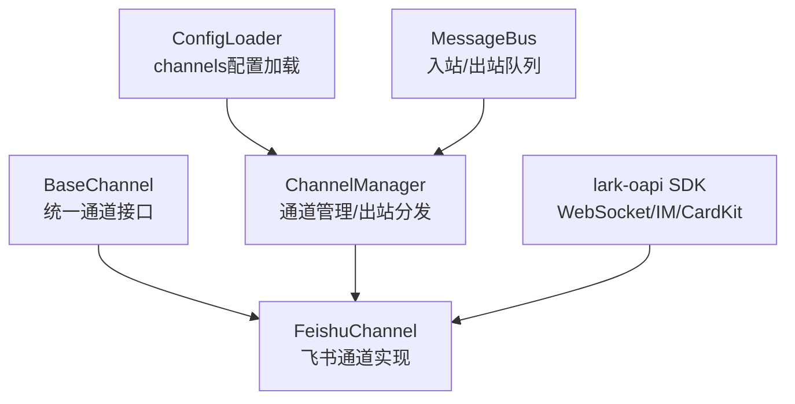
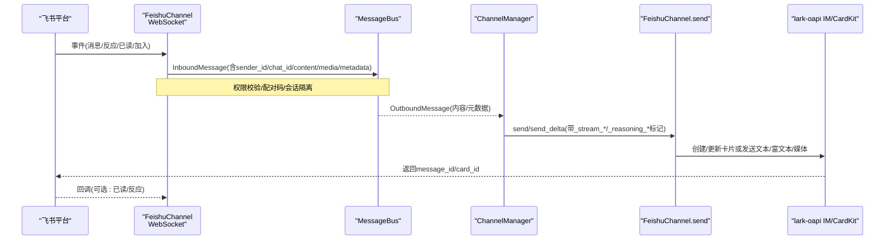
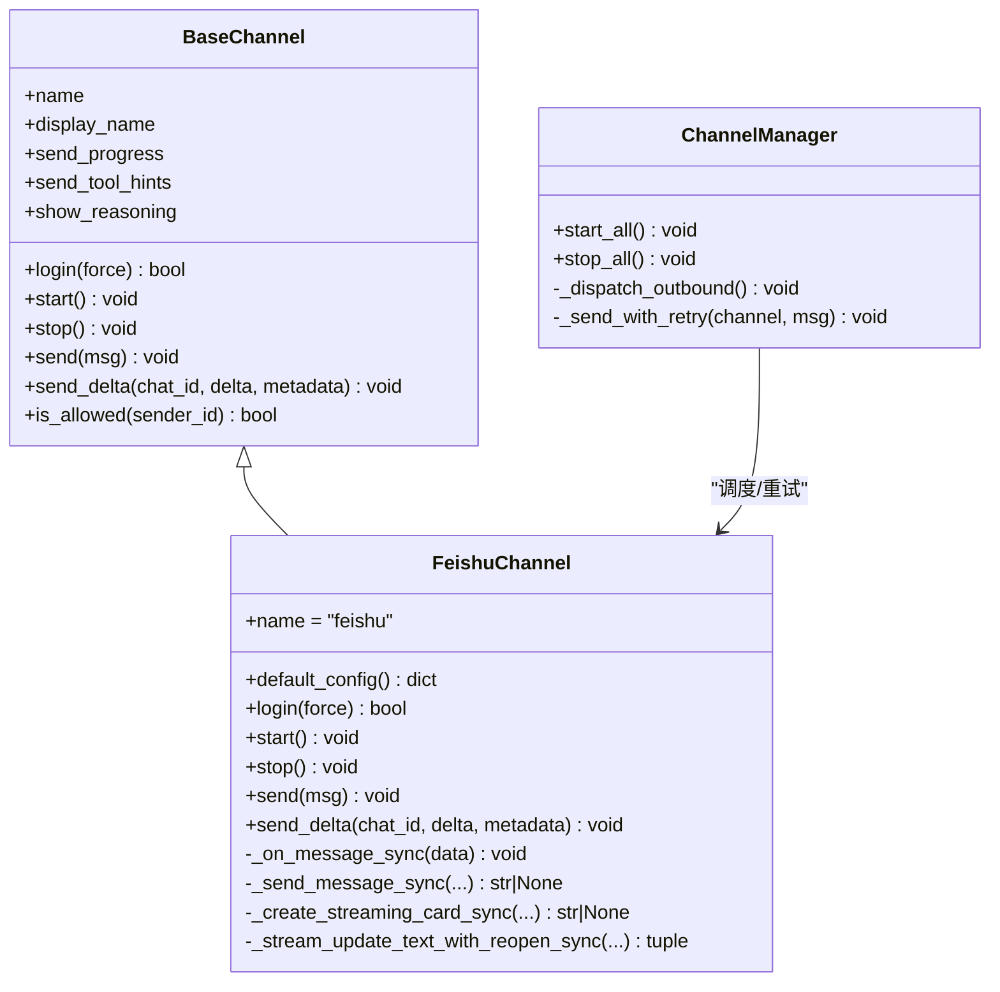

# 飞书渠道实现

<cite>
**本文引用的文件**
- [agent/src/channels/feishu.py](file://agent/src/channels/feishu.py)
- [agent/src/channels/base.py](file://agent/src/channels/base.py)
- [agent/src/channels/config.py](file://agent/src/channels/config.py)
- [agent/src/channels/manager.py](file://agent/src/channels/manager.py)
- [agent/tests/test_feishu_parse_md_table_edge_columns.py](file://agent/tests/test_feishu_parse_md_table_edge_columns.py)
</cite>

## 目录
1. [简介](#简介)
2. [项目结构](#项目结构)
3. [核心组件](#核心组件)
4. [架构总览](#架构总览)
5. [详细组件分析](#详细组件分析)
6. [依赖关系分析](#依赖关系分析)
7. [性能与可靠性](#性能与可靠性)
8. [故障排查指南](#故障排查指南)
9. [结论](#结论)
10. [附录：配置与环境变量](#附录配置与环境变量)

## 简介
本章节面向 Vibe-Trading 的“飞书渠道”实现，系统性说明如何通过飞书机器人 API 完成事件订阅、消息接收与发送、认证配置、权限与事件订阅设置、消息格式转换（文本、卡片、文件、图片等）、单聊与群聊路由、用户身份识别、错误处理与日志记录、以及部署步骤与常见问题。该实现基于 lark-oapi SDK 的 WebSocket 长连接模式，无需公网 IP 即可接收事件，并通过 CardKit 流式更新能力提供流畅的流式输出体验。

## 项目结构
围绕飞书渠道的关键代码位于 channels 子模块中：
- 通道基类与统一接口：base.py
- 飞书通道实现：feishu.py
- 通道配置加载：config.py
- 通道管理器（启动、停止、出站分发）：manager.py
- 针对飞书 Markdown 表格解析的测试用例：test_feishu_parse_md_table_edge_columns.py

图表来源
- [agent/src/channels/base.py:22-82](file://agent/src/channels/base.py#L22-L82)
- [agent/src/channels/feishu.py:569-786](file://agent/src/channels/feishu.py#L569-L786)
- [agent/src/channels/manager.py:36-226](file://agent/src/channels/manager.py#L36-L226)
- [agent/src/channels/config.py:11-22](file://agent/src/channels/config.py#L11-L22)

章节来源
- [agent/src/channels/base.py:22-82](file://agent/src/channels/base.py#L22-L82)
- [agent/src/channels/feishu.py:569-786](file://agent/src/channels/feishu.py#L569-L786)
- [agent/src/channels/manager.py:36-226](file://agent/src/channels/manager.py#L36-L226)
- [agent/src/channels/config.py:11-22](file://agent/src/channels/config.py#L11-L22)

## 核心组件
- FeishuChannel：继承 BaseChannel，封装飞书 WebSocket 长连接、事件注册、消息收发、流式卡片更新、媒体上传下载、回复与线程上下文、表情反应等。
- BaseChannel：定义所有通道的统一抽象（登录、启动、停止、发送、流式增量、权限校验、会话键注入等）。
- ChannelManager：发现并初始化启用的通道，启动/停止，负责出站消息的分发、重试与去重合并。
- Config：从结构化 agent 配置中加载 channels 部分，供 ChannelManager 使用。

章节来源
- [agent/src/channels/feishu.py:341-358](file://agent/src/channels/feishu.py#L341-L358)
- [agent/src/channels/base.py:22-82](file://agent/src/channels/base.py#L22-L82)
- [agent/src/channels/manager.py:36-137](file://agent/src/channels/manager.py#L36-L137)
- [agent/src/channels/config.py:11-22](file://agent/src/channels/config.py#L11-L22)

## 架构总览
下图展示了从飞书事件到业务处理的完整链路，以及出站消息如何经由 ChannelManager 路由到 FeishuChannel 并调用 lark-oapi 发送。

图表来源
- [agent/src/channels/feishu.py:667-786](file://agent/src/channels/feishu.py#L667-L786)
- [agent/src/channels/feishu.py:1958-2112](file://agent/src/channels/feishu.py#L1958-L2112)
- [agent/src/channels/manager.py:283-419](file://agent/src/channels/manager.py#L283-L419)

## 详细组件分析

### 认证与配置
- 支持通过二维码扫码自动创建飞书应用并完成授权，成功后写入 app_id、app_secret、domain 到内存配置，便于后续启动。
- 支持手动配置 domain（feishu/lark），以适配国际版 Lark。
- 支持 encrypt_key 与 verification_token 用于事件解密与验证（若使用 Webhook 场景；当前实现为 WebSocket 长连接，仍保留字段兼容）。

章节来源
- [agent/src/channels/feishu.py:341-358](file://agent/src/channels/feishu.py#L341-L358)
- [agent/src/channels/feishu.py:492-554](file://agent/src/channels/feishu.py#L492-L554)
- [agent/src/channels/feishu.py:609-659](file://agent/src/channels/feishu.py#L609-L659)

### 事件订阅与消息接收
- 使用 lark-oapi 的 EventDispatcherHandler 注册事件处理器，包括：
  - 消息接收：im.message.receive_v1
  - 可选：消息反应创建/删除、消息已读、机器人进入私聊等
- 通过 WebSocket 长连接接收事件，无需公网 IP。
- 对消息进行去重（按 message_id 维护有序缓存），避免重复处理。
- 群聊策略：
  - open：接受群内所有消息
  - mention：仅当 @机器人 时处理
- 私聊：未授权用户会收到配对码提示。

章节来源
- [agent/src/channels/feishu.py:697-727](file://agent/src/channels/feishu.py#L697-L727)
- [agent/src/channels/feishu.py:2114-2286](file://agent/src/channels/feishu.py#L2114-L2286)
- [agent/src/channels/base.py:165-227](file://agent/src/channels/base.py#L165-L227)

### 消息格式转换与发送
- 智能格式检测：
  - text：短纯文本
  - post：富文本（支持链接）
  - interactive：卡片（支持复杂 Markdown、表格、标题、列表等）
- 卡片构建：
  - 将 Markdown 表格解析为飞书 table 元素，支持空列头保留
  - 将标题转换为 div + lark_md 元素
  - 多表格内容自动拆分到多张卡片（飞书限制每张卡片最多一个 table）
- 流式输出：
  - 首次 delta 创建 CardKit 流式卡片，后续增量更新同一卡片
  - 支持节流更新（默认 0.5s）
  - 结束时关闭流式模式，必要时回退为普通卡片
- 工具提示：
  - 支持在流式卡片中内联显示工具执行提示，或在无流式卡片时作为独立卡片发送
- 媒体处理：
  - 发送：图片/音频/视频/文件分别映射到 image/audio/media/file 类型
  - 接收：下载图片/文件/音视频到本地媒体目录，音频可转写后附加转录文本

章节来源
- [agent/src/channels/feishu.py:1023-1247](file://agent/src/channels/feishu.py#L1023-L1247)
- [agent/src/channels/feishu.py:1294-1510](file://agent/src/channels/feishu.py#L1294-L1510)
- [agent/src/channels/feishu.py:1647-1957](file://agent/src/channels/feishu.py#L1647-L1957)
- [agent/src/channels/feishu.py:1958-2112](file://agent/src/channels/feishu.py#L1958-L2112)
- [agent/tests/test_feishu_parse_md_table_edge_columns.py:8-27](file://agent/tests/test_feishu_parse_md_table_edge_columns.py#L8-L27)

### 单聊与群聊路由及用户身份识别
- 单聊（p2p）：
  - 未授权用户会收到配对码提示
  - 会话键不覆盖（保持默认行为）
- 群聊（group）：
  - 根据 group_policy 决定是否处理
  - topic_isolation=True 时，每个主题（root_id/message_id）拥有独立会话键；否则整群共享会话
- 用户身份：
  - 使用 sender.sender_id.open_id 作为 sender_id
  - 支持 @提及替换与去除前导机器人 @mention，确保命令路由正确
- 回复与线程：
  - 支持 reply_to_message 开启时在群聊中以 Reply API 回复并可选择创建线程
  - 支持 thread_id 存在时始终回复到原主题

章节来源
- [agent/src/channels/feishu.py:823-915](file://agent/src/channels/feishu.py#L823-L915)
- [agent/src/channels/feishu.py:1596-1609](file://agent/src/channels/feishu.py#L1596-L1609)
- [agent/src/channels/feishu.py:2114-2286](file://agent/src/channels/feishu.py#L2114-L2286)

### 表情反应与状态指示
- 收到消息后异步添加表情反应（如 THUMPSUP），用于“处理中”提示
- 任务完成后移除中间表情，并可添加完成表情（done_emoji）
- 支持反应创建/删除事件监听（当前忽略以避免噪音）

章节来源
- [agent/src/channels/feishu.py:917-999](file://agent/src/channels/feishu.py#L917-L999)
- [agent/src/channels/feishu.py:2291-2306](file://agent/src/channels/feishu.py#L2291-L2306)

### 出站分发与重试
- ChannelManager 负责：
  - 出站消息的去重（基于内容指纹与 origin/message_id）
  - 流式增量合并（减少 API 调用）
  - 指数退避重试（默认最大尝试次数可配置）
- 支持过滤进度/工具提示消息，避免不必要的发送

章节来源
- [agent/src/channels/manager.py:254-419](file://agent/src/channels/manager.py#L254-L419)

## 依赖关系分析
- FeishuChannel 依赖 lark-oapi SDK（动态导入，避免启动开销）
- BaseChannel 提供统一接口，FeishuChannel 实现具体逻辑
- ChannelManager 协调多个通道实例，统一出站分发
- 配置通过 config.py 加载 channels 配置段

图表来源
- [agent/src/channels/base.py:22-163](file://agent/src/channels/base.py#L22-L163)
- [agent/src/channels/feishu.py:569-786](file://agent/src/channels/feishu.py#L569-L786)
- [agent/src/channels/manager.py:36-226](file://agent/src/channels/manager.py#L36-L226)

章节来源
- [agent/src/channels/base.py:22-163](file://agent/src/channels/base.py#L22-L163)
- [agent/src/channels/feishu.py:569-786](file://agent/src/channels/feishu.py#L569-L786)
- [agent/src/channels/manager.py:36-226](file://agent/src/channels/manager.py#L36-L226)

## 性能与可靠性
- 流式更新节流：默认 0.5s 一次更新，降低频繁 API 调用压力
- 多表卡拆分：自动将包含多个表格的内容拆分为多张卡片，规避飞书限制
- 出站合并：ChannelManager 合并连续 _stream_delta，减少网络开销
- 重试机制：指数退避重试，提高鲁棒性
- 资源清理：后台任务跟踪与异常捕获，表情反应缓存上限控制
- 懒加载 SDK：仅在需要时导入 lark-oapi，缩短启动时间

章节来源
- [agent/src/channels/feishu.py:556-567](file://agent/src/channels/feishu.py#L556-L567)
- [agent/src/channels/feishu.py:1110-1138](file://agent/src/channels/feishu.py#L1110-L1138)
- [agent/src/channels/manager.py:371-419](file://agent/src/channels/manager.py#L371-L419)
- [agent/src/channels/manager.py:421-453](file://agent/src/channels/manager.py#L421-L453)

## 故障排查指南
- 无法启动 WebSocket：
  - 检查是否安装 lark-oapi
  - 确认 app_id/app_secret 已配置
  - 查看日志中的 WebSocket 错误与重连信息
- 消息未送达：
  - 检查 ChannelManager 的重试日志
  - 确认目标 chat_id/open_id 是否正确
  - 对于群聊，确认 group_policy 与 @提及策略
- 流式卡片不更新：
  - 检查节流间隔与序列号递增
  - 关注流式模式关闭失败的回退逻辑
- 媒体下载失败：
  - 检查 file_key 与 message_id 是否存在
  - 查看下载日志与本地媒体目录权限
- 表情反应异常：
  - 检查反应添加/删除 API 返回码
  - 确认 reaction_id 缓存未溢出

章节来源
- [agent/src/channels/feishu.py:667-786](file://agent/src/channels/feishu.py#L667-L786)
- [agent/src/channels/feishu.py:1309-1435](file://agent/src/channels/feishu.py#L1309-L1435)
- [agent/src/channels/feishu.py:1712-1787](file://agent/src/channels/feishu.py#L1712-L1787)
- [agent/src/channels/manager.py:421-453](file://agent/src/channels/manager.py#L421-L453)

## 结论
Vibe-Trading 的飞书渠道实现了完整的飞书机器人集成，涵盖认证、事件订阅、消息收发、流式卡片、媒体处理、群聊/单聊路由、权限控制与错误恢复。通过 ChannelManager 的统一出站分发与重试机制，提升了系统的稳定性与可扩展性。建议在生产环境启用合适的群聊策略与主题隔离，并根据需求调整流式更新节流与重试参数。

## 附录：配置与环境变量
- 飞书通道配置项（FeishuConfig）：
  - enabled：是否启用
  - app_id / app_secret：应用凭证
  - encrypt_key / verification_token：事件加密与验证（兼容 Webhook 场景）
  - allow_from：允许的用户白名单
  - react_emoji：收到消息时的表情反应
  - done_emoji：任务完成后的表情反应
  - tool_hint_prefix：工具提示前缀
  - group_policy：群聊策略（open/mention）
  - reply_to_message：是否在群聊中以 Reply API 回复并可选择创建线程
  - streaming：是否启用流式输出
  - domain：飞书或 Lark 域名
  - topic_isolation：是否按主题隔离会话
- 环境变量：
  - 当前仓库未定义专门的飞书环境变量别名；飞书凭据通过通道配置传入（可通过 CLI 扫码登录或配置文件设置）
  - 通用通道开关：VIBE_TRADING_CHANNELS_AUTO_START（影响通道自动启动）
- 部署步骤（概览）：
  - 安装依赖：pip install lark-oapi
  - 运行登录：vibe-trading channels login feishu（扫码完成授权）
  - 启动服务：确保 channels.feishu.enabled=true 且配置了 app_id/app_secret
  - 观察日志：确认 WebSocket 连接成功与事件接收正常

章节来源
- [agent/src/channels/feishu.py:341-358](file://agent/src/channels/feishu.py#L341-L358)
- [agent/src/channels/feishu.py:492-554](file://agent/src/channels/feishu.py#L492-L554)
- [agent/src/channels/feishu.py:609-659](file://agent/src/channels/feishu.py#L609-L659)
- [agent/src/config/env_schema.py:363-365](file://agent/src/config/env_schema.py#L363-L365)