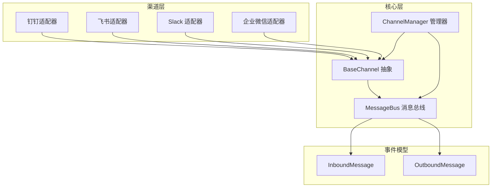
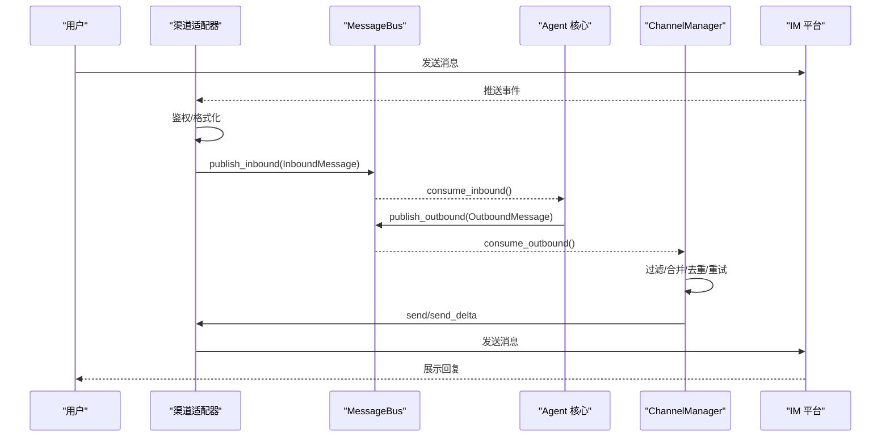
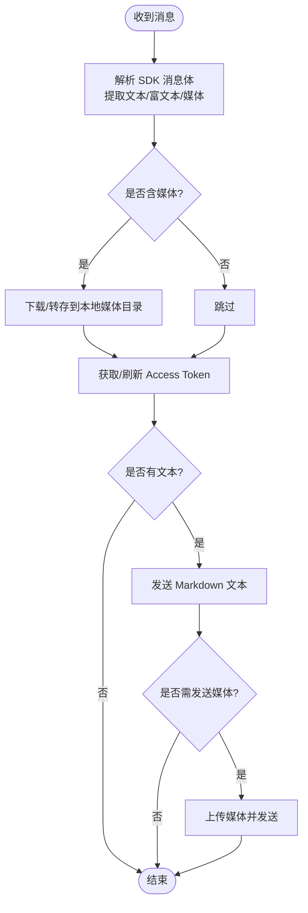
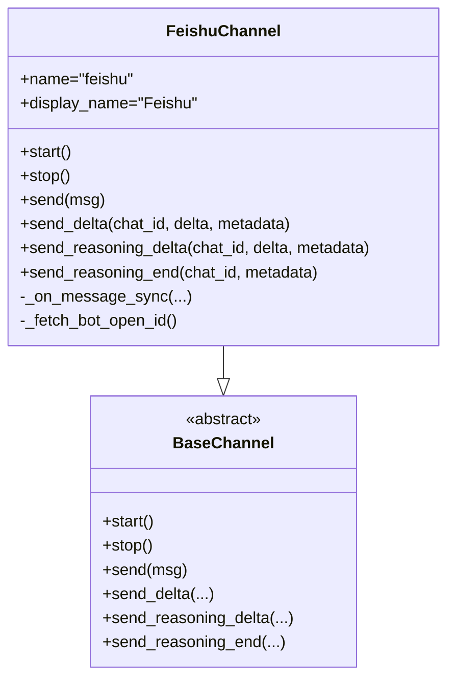
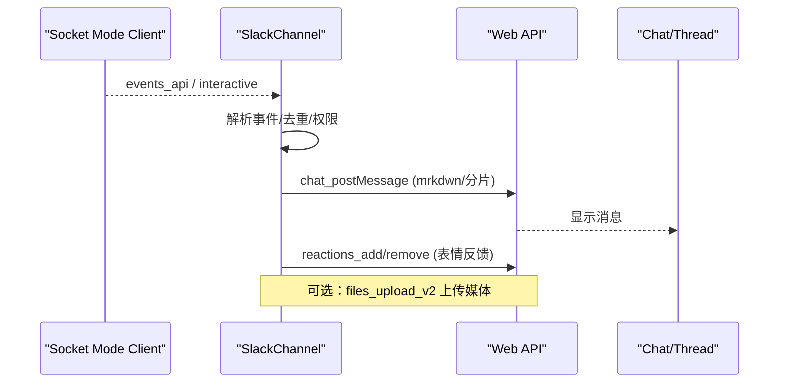
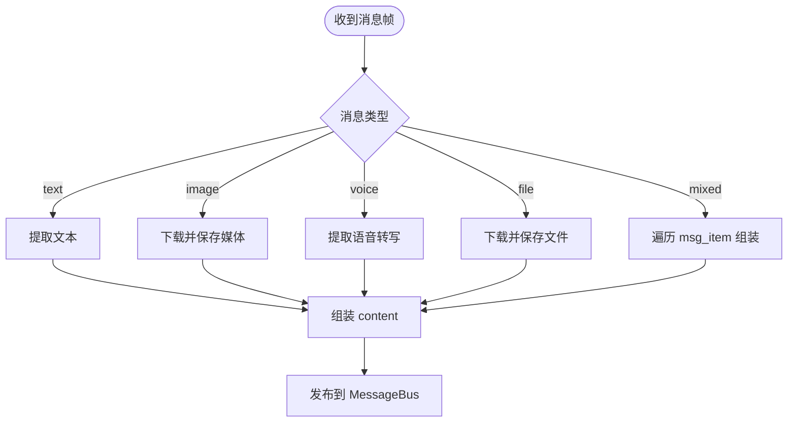
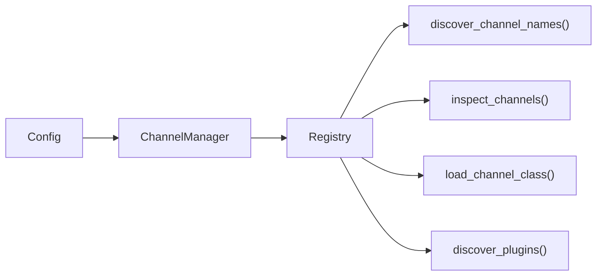

# 消息渠道集成

<cite>
**本文引用的文件**
- [agent/src/channels/__init__.py](file://agent/src/channels/__init__.py)
- [agent/src/channels/base.py](file://agent/src/channels/base.py)
- [agent/src/channels/manager.py](file://agent/src/channels/manager.py)
- [agent/src/channels/bus/events.py](file://agent/src/channels/bus/events.py)
- [agent/src/channels/bus/queue.py](file://agent/src/channels/bus/queue.py)
- [agent/src/channels/config.py](file://agent/src/channels/config.py)
- [agent/src/channels/registry.py](file://agent/src/channels/registry.py)
- [agent/src/channels/dingtalk.py](file://agent/src/channels/dingtalk.py)
- [agent/src/channels/feishu.py](file://agent/src/channels/feishu.py)
- [agent/src/channels/slack.py](file://agent/src/channels/slack.py)
- [agent/src/channels/wecom.py](file://agent/src/channels/wecom.py)
</cite>

## 目录
1. [简介](#简介)
2. [项目结构](#项目结构)
3. [核心组件](#核心组件)
4. [架构总览](#架构总览)
5. [详细组件分析](#详细组件分析)
6. [依赖关系分析](#依赖关系分析)
7. [性能与可靠性](#性能与可靠性)
8. [故障排除指南](#故障排除指南)
9. [结论](#结论)
10. [附录：自定义渠道开发指南](#附录自定义渠道开发指南)

## 简介
本文件面向 Vibe-Trading 的消息渠道子系统，系统性说明多渠道消息系统的架构设计、消息路由机制与统一消息接口；详述钉钉、飞书、Slack、企业微信等 IM 平台的集成实现、认证配置与消息格式转换；解释消息队列管理、重试机制与错误恢复策略；并提供自定义消息渠道的开发指南（协议适配、消息模板与安全性），以及企业级集成的最佳实践与故障排除方法。

## 项目结构
消息渠道子系统位于 agent/src/channels，采用“适配器 + 总线 + 管理器”的分层架构：
- 基础抽象：BaseChannel 定义统一的启动/停止/发送/流式回调接口与权限校验。
- 消息总线：MessageBus 提供异步入站/出站队列，解耦渠道与 Agent 核心。
- 通道管理器：ChannelManager 负责发现、初始化、启停各渠道，并编排出站消息分发、去重、合并与重试。
- 平台适配器：各 IM 平台的具体实现（钉钉、飞书、Slack、企业微信等）继承 BaseChannel，完成协议对接、鉴权、媒体处理与消息格式转换。
- 注册与配置：自动发现内置渠道与插件渠道，加载配置并暴露可用性状态。

图表来源
- [agent/src/channels/base.py:22-238](file://agent/src/channels/base.py#L22-L238)
- [agent/src/channels/manager.py:36-479](file://agent/src/channels/manager.py#L36-L479)
- [agent/src/channels/bus/queue.py:8-44](file://agent/src/channels/bus/queue.py#L8-L44)
- [agent/src/channels/bus/events.py:20-55](file://agent/src/channels/bus/events.py#L20-L55)

章节来源
- [agent/src/channels/__init__.py:1-49](file://agent/src/channels/__init__.py#L1-L49)
- [agent/src/channels/base.py:22-238](file://agent/src/channels/base.py#L22-L238)
- [agent/src/channels/manager.py:36-479](file://agent/src/channels/manager.py#L36-L479)
- [agent/src/channels/bus/queue.py:8-44](file://agent/src/channels/bus/queue.py#L8-L44)
- [agent/src/channels/bus/events.py:20-55](file://agent/src/channels/bus/events.py#L20-L55)

## 核心组件
- BaseChannel：定义所有渠道必须实现的 start/stop/send 生命周期与 send_delta/send_reasoning_* 流式扩展点；内置权限控制（allow_from、配对码）、会话键覆盖、是否支持流式输出等能力。
- MessageBus：基于 asyncio.Queue 的异步消息总线，提供 inbound/outbound 两个队列及发布/消费方法，屏蔽渠道与 Agent 之间的耦合。
- ChannelManager：集中管理渠道实例，负责：
  - 发现与加载渠道（内置模块扫描 + 外部插件 entry_points）。
  - 启动/停止所有渠道。
  - 出站消息分发：按 channel/chat_id 路由，过滤进度/工具提示，合并连续流式片段，重复内容抑制，指数退避重试。
  - 全局布尔开关与渠道级别覆盖（如 send_progress、send_tool_hints、show_reasoning）。
- 事件模型：InboundMessage/OutboundMessage 作为跨渠道的统一数据结构，承载 channel、sender_id、chat_id、content、media、metadata 等字段，支持线程/会话隔离与 UI 元数据。

章节来源
- [agent/src/channels/base.py:22-238](file://agent/src/channels/base.py#L22-L238)
- [agent/src/channels/bus/queue.py:8-44](file://agent/src/channels/bus/queue.py#L8-L44)
- [agent/src/channels/manager.py:36-479](file://agent/src/channels/manager.py#L36-L479)
- [agent/src/channels/bus/events.py:20-55](file://agent/src/channels/bus/events.py#L20-L55)

## 架构总览
整体消息流如下：
- 入站：IM 平台 → 渠道适配器解析/鉴权 → BaseChannel._handle_message → MessageBus.inbound → Agent 核心处理。
- 出站：Agent 核心 → MessageBus.outbound → ChannelManager._dispatch_outbound → 具体渠道 send/send_delta → IM 平台。

图表来源
- [agent/src/channels/base.py:179-227](file://agent/src/channels/base.py#L179-L227)
- [agent/src/channels/manager.py:283-453](file://agent/src/channels/manager.py#L283-L453)
- [agent/src/channels/bus/queue.py:19-33](file://agent/src/channels/bus/queue.py#L19-L33)

## 详细组件分析

### 钉钉（DingTalk）
- 连接方式：使用 Stream Mode（WebSocket）接收事件，HTTP API 发送消息。
- 认证：通过 client_id/client_secret 获取 Access Token，带过期时间缓存与刷新。
- 消息格式：
  - 文本：Markdown 样式通过 sampleMarkdown 消息类型发送。
  - 图片/文件：优先尝试图片 URL 直发，失败则下载后上传至钉钉并发送 mediaId；HTML 附件会被压缩为 zip 再上传。
  - 群聊：以 group:conversationId 作为 chat_id 前缀，支持按用户隔离会话。
- 安全：远程媒体下载限制大小与跳转次数，校验目标域名白名单，防止 SSRF。
- 流式：未实现 send_delta，默认走完整消息发送。

图表来源
- [agent/src/channels/dingtalk.py:46-164](file://agent/src/channels/dingtalk.py#L46-L164)
- [agent/src/channels/dingtalk.py:271-296](file://agent/src/channels/dingtalk.py#L271-L296)
- [agent/src/channels/dingtalk.py:341-479](file://agent/src/channels/dingtalk.py#L341-L479)
- [agent/src/channels/dingtalk.py:512-670](file://agent/src/channels/dingtalk.py#L512-L670)
- [agent/src/channels/dingtalk.py:672-774](file://agent/src/channels/dingtalk.py#L672-L774)

章节来源
- [agent/src/channels/dingtalk.py:166-774](file://agent/src/channels/dingtalk.py#L166-L774)

### 飞书（Feishu/Lark）
- 连接方式：WebSocket 长连接接收事件，无需公网 IP；发送使用官方 SDK 客户端。
- 认证：支持扫码创建应用并写入凭据；也可手动配置 app_id/app_secret/domain。
- 消息格式：
  - 文本：支持富文本卡片与流式更新（CardKit streaming），可节流更新频率。
  - 图片/文件：解析 post/rich text 中的 image_key，转换为本地文件路径或 key 进行发送。
  - 群聊：支持 topic_isolation 按主题隔离会话；支持 @机器人 匹配。
- 安全：懒加载重型 SDK，避免主循环阻塞；对事件处理器按需注册。
- 流式：实现 send_delta/send_reasoning_delta/send_reasoning_end，支持就地更新卡片。

图表来源
- [agent/src/channels/feishu.py:341-358](file://agent/src/channels/feishu.py#L341-L358)
- [agent/src/channels/feishu.py:569-786](file://agent/src/channels/feishu.py#L569-L786)
- [agent/src/channels/base.py:83-151](file://agent/src/channels/base.py#L83-L151)

章节来源
- [agent/src/channels/feishu.py:341-800](file://agent/src/channels/feishu.py#L341-L800)

### Slack
- 连接方式：Socket Mode（WebSocket）接收事件，REST API 发送消息。
- 认证：需要 bot_token 与 app_token；支持超时保护与代理限制提示。
- 消息格式：
  - 文本：Markdown 转 mrkdwn，支持表格转换与代码块保护；超长消息分片发送。
  - 文件：通过 files_upload_v2 上传本地媒体；私域文件需授权下载。
  - 线程：支持 reply_in_thread，首次进入线程时拉取上下文历史。
  - 按钮：支持 Block Kit 按钮，点击回传 action 值。
- 安全：下载 HTML 响应视为失败；限制 Socket Mode 握手超时。
- 流式：未实现 send_delta，默认整条消息发送。

图表来源
- [agent/src/channels/slack.py:92-140](file://agent/src/channels/slack.py#L92-L140)
- [agent/src/channels/slack.py:151-199](file://agent/src/channels/slack.py#L151-L199)
- [agent/src/channels/slack.py:312-455](file://agent/src/channels/slack.py#L312-L455)
- [agent/src/channels/slack.py:456-504](file://agent/src/channels/slack.py#L456-L504)
- [agent/src/channels/slack.py:698-755](file://agent/src/channels/slack.py#L698-L755)

章节来源
- [agent/src/channels/slack.py:25-755](file://agent/src/channels/slack.py#L25-L755)

### 企业微信（WeCom）
- 连接方式：WebSocket 长连接接收事件，SDK 封装了连接/心跳/重连。
- 认证：bot_id/secret 配置；支持欢迎语。
- 消息格式：
  - 文本：reply_stream 流式回复；无 frame 时使用 markdown 主动发送。
  - 媒体：通过 WebSocket 三步协议（init/chunk/finish）上传 base64 分块；支持图片/视频/语音/文件。
  - 混合消息：解析 mixed 中多个 msg_item 并组合。
- 安全：文件名清洗、大小限制、AES 解密下载。
- 流式：通过 reply_stream 实现增量更新。

图表来源
- [agent/src/channels/wecom.py:102-148](file://agent/src/channels/wecom.py#L102-L148)
- [agent/src/channels/wecom.py:173-355](file://agent/src/channels/wecom.py#L173-L355)
- [agent/src/channels/wecom.py:356-496](file://agent/src/channels/wecom.py#L356-L496)
- [agent/src/channels/wecom.py:492-555](file://agent/src/channels/wecom.py#L492-L555)

章节来源
- [agent/src/channels/wecom.py:54-555](file://agent/src/channels/wecom.py#L54-L555)

## 依赖关系分析
- 渠道发现：通过 pkgutil 扫描内置模块，并通过 entry_points 发现外部插件；支持 availability flags 与安装提示。
- 配置加载：从结构化 Agent 配置中读取 channels 部分，支持 camelCase 别名与全局布尔覆盖。
- 运行时服务注入：websocket/matrix 等特殊渠道在构造时注入 gateway_services/workspace 等依赖。

图表来源
- [agent/src/channels/registry.py:87-284](file://agent/src/channels/registry.py#L87-L284)
- [agent/src/channels/config.py:11-22](file://agent/src/channels/config.py#L11-L22)
- [agent/src/channels/manager.py:64-156](file://agent/src/channels/manager.py#L64-L156)

章节来源
- [agent/src/channels/registry.py:1-284](file://agent/src/channels/registry.py#L1-L284)
- [agent/src/channels/config.py:1-22](file://agent/src/channels/config.py#L1-L22)
- [agent/src/channels/manager.py:64-156](file://agent/src/channels/manager.py#L64-L156)

## 性能与可靠性
- 出站合并：对同一目标与 stream_id 的连续 _stream_delta 进行合并，减少 API 调用次数。
- 重复抑制：基于内容指纹与 origin_message_id/message_id 去重，避免重复推送。
- 重试策略：指数退避（1s、2s、4s），最大重试次数可配置（send_max_retries）。
- 超时与断开：Slack Socket Mode 握手超时保护；钉钉/飞书/企微均具备断线重连逻辑。
- 资源清理：stop_all 取消调度任务并关闭 HTTP/WebSocket 客户端，释放后台任务。

章节来源
- [agent/src/channels/manager.py:283-453](file://agent/src/channels/manager.py#L283-L453)
- [agent/src/channels/dingtalk.py:246-269](file://agent/src/channels/dingtalk.py#L246-L269)
- [agent/src/channels/feishu.py:738-786](file://agent/src/channels/feishu.py#L738-L786)
- [agent/src/channels/slack.py:120-140](file://agent/src/channels/slack.py#L120-L140)
- [agent/src/channels/wecom.py:102-148](file://agent/src/channels/wecom.py#L102-L148)

## 故障排除指南
- 渠道不可用：检查依赖是否安装（registry 提供安装提示），确认 enabled 与凭据配置正确。
- 无法接收事件：确认 WebSocket 已建立（日志中 “connected/authenticated”），防火墙是否放行相关端口/域名。
- 发送失败：查看重试日志与错误码；检查网络连通性与平台限频；媒体上传失败时查看文件大小与类型限制。
- 重复消息：检查 origin_message_id/message_id 是否正确传递；必要时调整去重策略。
- 流式不生效：确认渠道实现了 send_delta 且配置开启 streaming；注意 _stream_id 一致性。

章节来源
- [agent/src/channels/registry.py:33-63](file://agent/src/channels/registry.py#L33-L63)
- [agent/src/channels/manager.py:421-453](file://agent/src/channels/manager.py#L421-L453)
- [agent/src/channels/dingtalk.py:215-269](file://agent/src/channels/dingtalk.py#L215-L269)
- [agent/src/channels/feishu.py:667-786](file://agent/src/channels/feishu.py#L667-L786)
- [agent/src/channels/slack.py:92-140](file://agent/src/channels/slack.py#L92-L140)
- [agent/src/channels/wecom.py:102-148](file://agent/src/channels/wecom.py#L102-L148)

## 结论
Vibe-Trading 的消息渠道子系统通过清晰的抽象、异步总线与强大的管理器，实现了多 IM 平台的统一接入与可靠投递。各平台适配器在认证、媒体处理、消息格式转换与流式更新方面各有特色，同时共享一致的安全与容错机制。借助该架构，企业可以灵活扩展新的消息渠道，并在生产环境中获得高可用与高性能的消息处理能力。

## 附录：自定义渠道开发指南
- 实现步骤：
  - 新建模块并继承 BaseChannel，实现 start/stop/send 生命周期。
  - 如需流式更新，实现 send_delta/send_reasoning_delta/send_reasoning_end。
  - 在 __init__ 中解析配置，建立连接与事件监听。
  - 将入站消息经 BaseChannel._handle_message 发布到 MessageBus.inbound。
  - 出站消息通过 ChannelManager 路由，或直接调用 send。
- 配置与注册：
  - 在 channels 配置中添加对应 section，设置 enabled 与凭据。
  - 若为外部插件，可通过 entry_points 注册到 vibe_trading.channels 组。
- 安全性考虑：
  - 校验输入与 URL，防止 SSRF 与路径穿越。
  - 限制媒体大小与跳转次数，记录敏感信息脱敏。
  - 使用 allow_from 与 pairing 机制控制访问。
- 消息模板：
  - 根据平台特性进行格式转换（Markdown→mrkdwn、富文本→卡片等）。
  - 支持按钮、图片、文件等多模态内容。
- 最佳实践：
  - 使用异步 IO，避免阻塞事件循环。
  - 合理设置超时与重试，捕获并上报异常。
  - 利用流式更新提升用户体验，注意节流与状态管理。

章节来源
- [agent/src/channels/base.py:22-238](file://agent/src/channels/base.py#L22-L238)
- [agent/src/channels/registry.py:223-284](file://agent/src/channels/registry.py#L223-L284)
- [agent/src/channels/config.py:11-22](file://agent/src/channels/config.py#L11-L22)