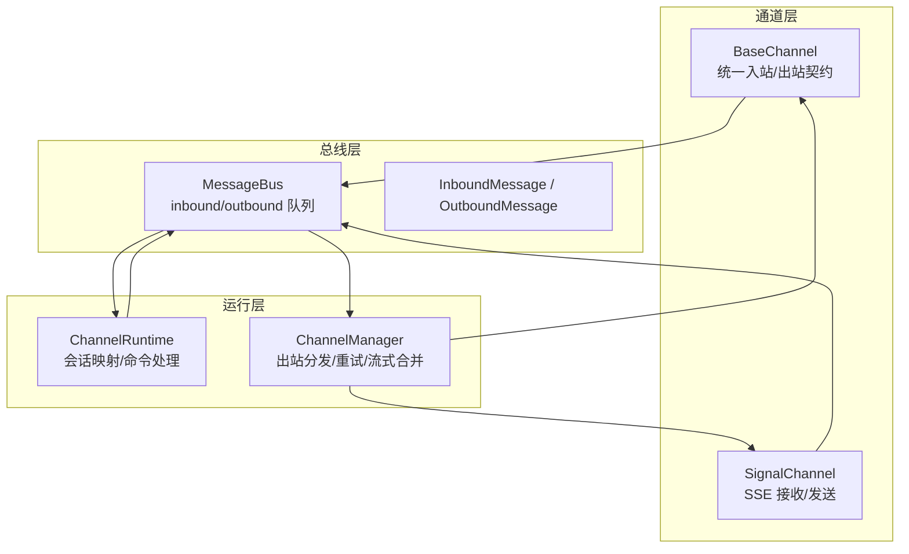
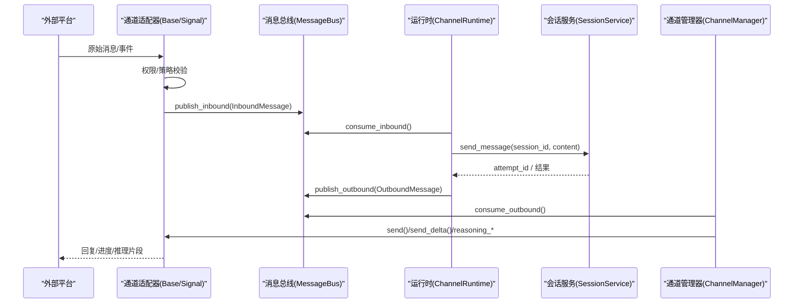
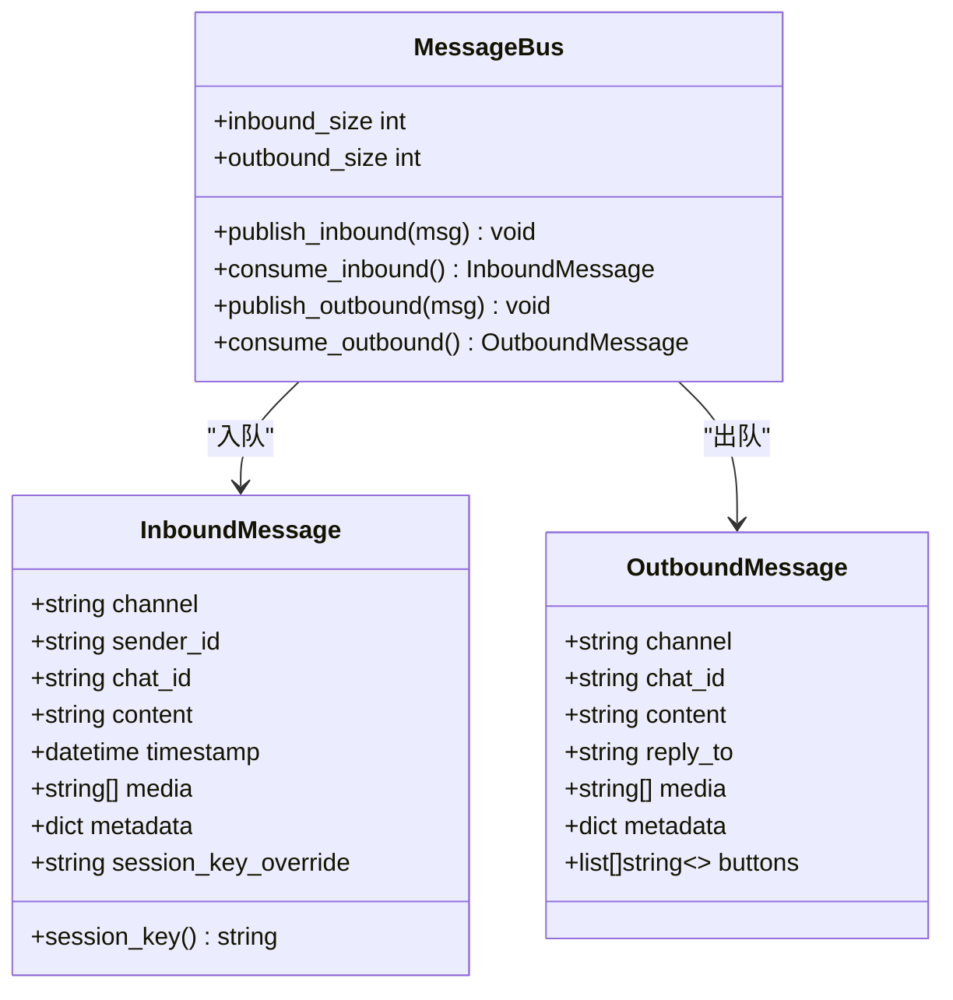
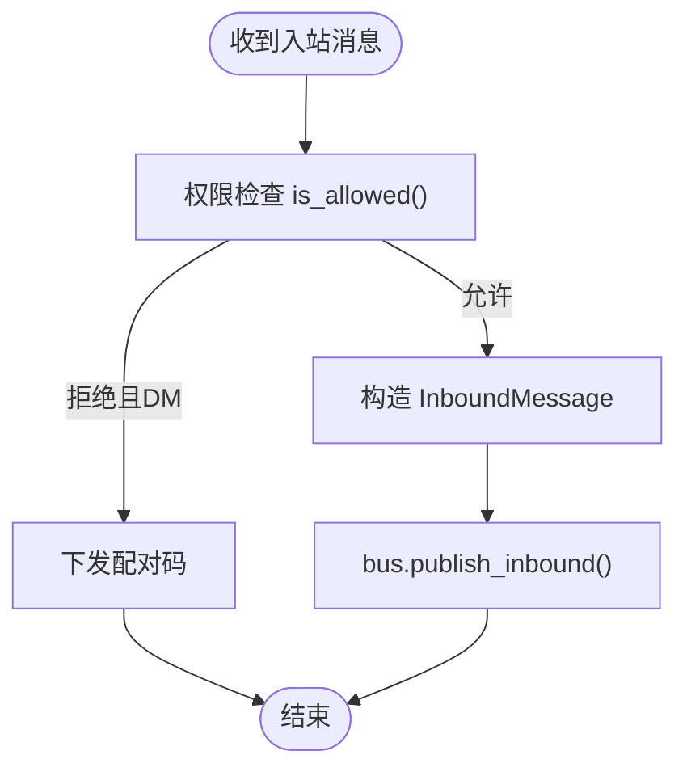
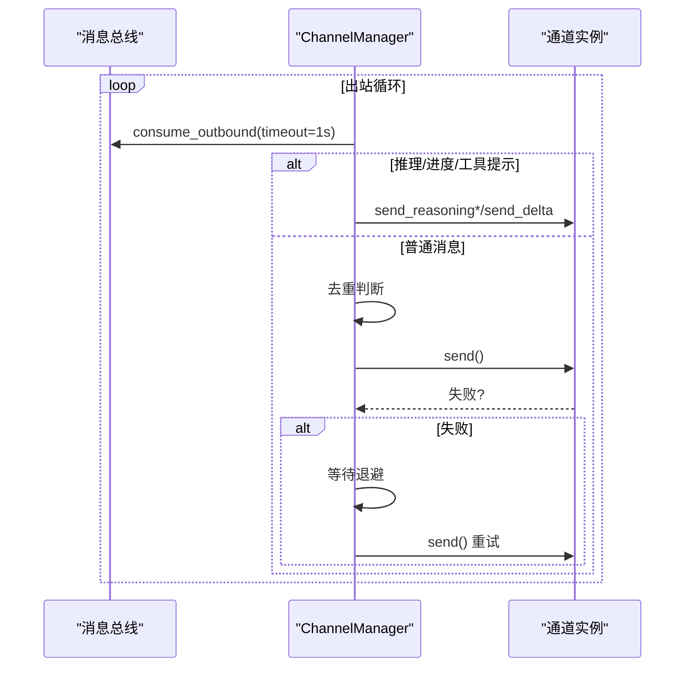
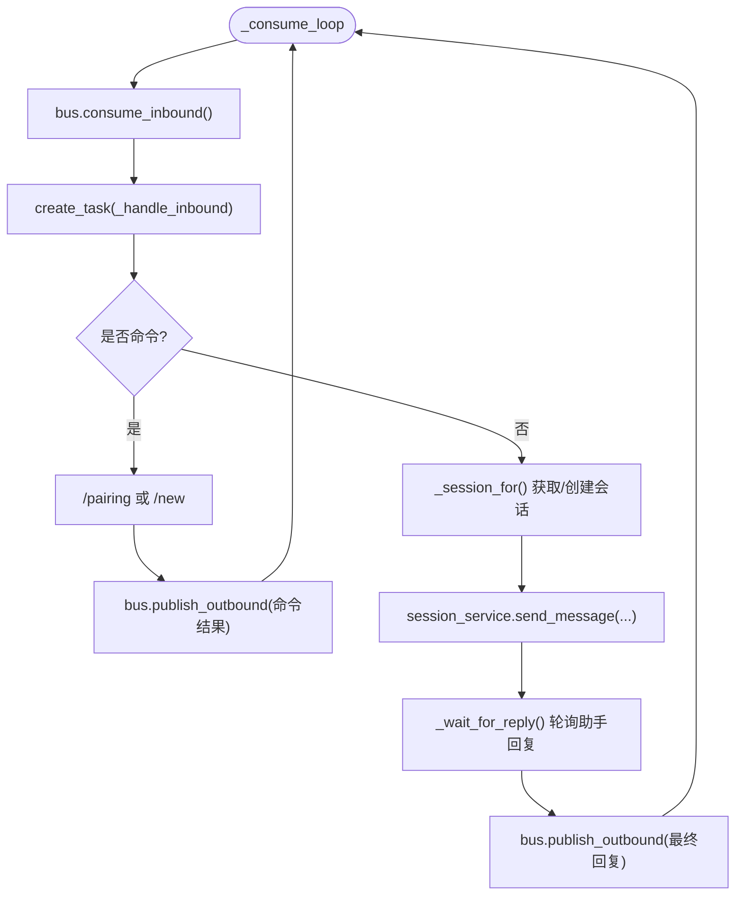
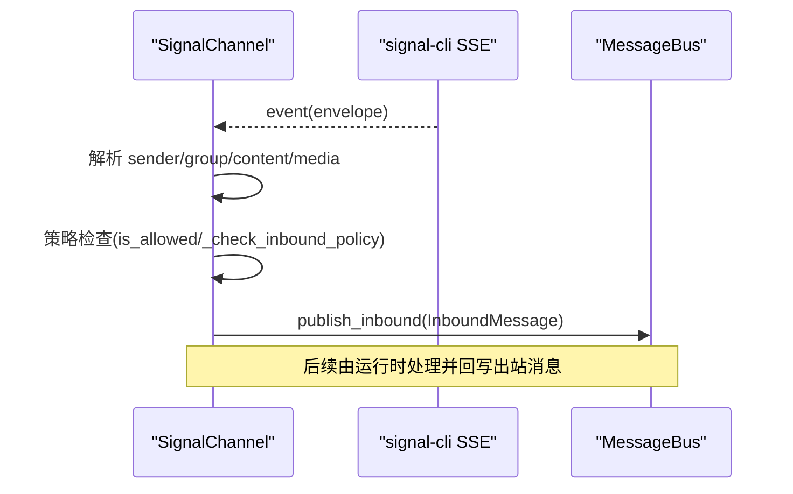
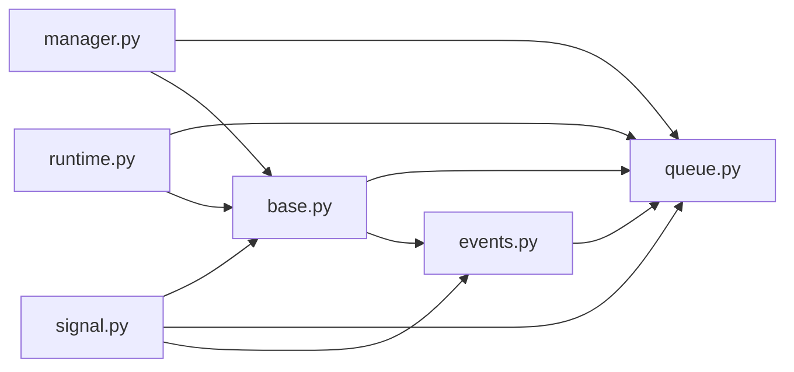

# 消息路由机制

<cite>
**本文引用的文件**
- [agent/src/channels/bus/__init__.py](file://agent/src/channels/bus/__init__.py)
- [agent/src/channels/bus/events.py](file://agent/src/channels/bus/events.py)
- [agent/src/channels/bus/queue.py](file://agent/src/channels/bus/queue.py)
- [agent/src/channels/base.py](file://agent/src/channels/base.py)
- [agent/src/channels/signal.py](file://agent/src/channels/signal.py)
- [agent/src/channels/manager.py](file://agent/src/channels/manager.py)
- [agent/src/channels/runtime.py](file://agent/src/channels/runtime.py)
- [agent/src/channels/config.py](file://agent/src/channels/config.py)
</cite>

## 目录
1. [简介](#简介)
2. [项目结构](#项目结构)
3. [核心组件](#核心组件)
4. [架构总览](#架构总览)
5. [详细组件分析](#详细组件分析)
6. [依赖关系分析](#依赖关系分析)
7. [性能与可扩展性](#性能与可扩展性)
8. [故障排查指南](#故障排查指南)
9. [结论](#结论)
10. [附录：消息格式与协议适配](#附录消息格式与协议适配)

## 简介
本文件聚焦 Vibe-Trading 的消息路由机制，围绕事件总线设计模式、消息分发策略、运行时处理流程（异步、并发、资源管理）、消息格式标准化与协议适配，以及高可用与可扩展性策略进行系统化说明。当前实现采用“通道适配器 + 内存消息总线 + 运行时编排”的分层架构：各聊天平台通过统一接口接入，入站消息经权限校验后进入总线，运行时将消息投递到会话服务并产出出站响应，再由通道管理器按目标通道派发。

## 项目结构
消息路由相关代码集中在 channels 包内，关键模块职责如下：
- bus：定义消息类型与内存队列，解耦通道与 Agent 核心
- base：抽象通道基类，统一入站处理、权限控制、出站发送契约
- manager：通道发现、启动、出站分发、重试与流式合并
- runtime：入站消费、会话映射、命令处理、错误回写
- signal：Signal 通道具体实现（SSE 接收、Markdown→Signal 文本样式转换）
- config：从结构化配置加载 channels 配置

**图表来源**
- [agent/src/channels/bus/queue.py:8-44](file://agent/src/channels/bus/queue.py#L8-L44)
- [agent/src/channels/bus/events.py:20-55](file://agent/src/channels/bus/events.py#L20-L55)
- [agent/src/channels/base.py:22-82](file://agent/src/channels/base.py#L22-L82)
- [agent/src/channels/signal.py:344-590](file://agent/src/channels/signal.py#L344-L590)
- [agent/src/channels/runtime.py:34-120](file://agent/src/channels/runtime.py#L34-L120)
- [agent/src/channels/manager.py:36-479](file://agent/src/channels/manager.py#L36-L479)

**章节来源**
- [agent/src/channels/bus/__init__.py:1-7](file://agent/src/channels/bus/__init__.py#L1-L7)
- [agent/src/channels/config.py:11-22](file://agent/src/channels/config.py#L11-L22)

## 核心组件
- 事件模型
  - InboundMessage：封装通道名、发送者、会话键、内容、媒体、元数据等
  - OutboundMessage：封装目标通道、会话、内容、回复引用、媒体、按钮、元数据
- 消息总线
  - MessageBus：基于 asyncio.Queue 的入站/出站双队列，提供发布/消费方法
- 通道基类
  - BaseChannel：统一入站处理（权限检查、配对码下发）、出站发送契约、流式能力钩子
- 通道管理器
  - ChannelManager：通道发现与生命周期管理；出站分发、去重、重试、流式分片合并
- 运行时
  - ChannelRuntime：入站消费循环、会话映射持久化、命令处理（/pairing、/new）、异常回写
- 通道实现
  - SignalChannel：SSE 接收、消息解析、Markdown→Signal 文本样式转换、发送分块

**章节来源**
- [agent/src/channels/bus/events.py:20-55](file://agent/src/channels/bus/events.py#L20-L55)
- [agent/src/channels/bus/queue.py:8-44](file://agent/src/channels/bus/queue.py#L8-L44)
- [agent/src/channels/base.py:22-238](file://agent/src/channels/base.py#L22-L238)
- [agent/src/channels/manager.py:36-479](file://agent/src/channels/manager.py#L36-L479)
- [agent/src/channels/runtime.py:34-375](file://agent/src/channels/runtime.py#L34-L375)
- [agent/src/channels/signal.py:344-590](file://agent/src/channels/signal.py#L344-L590)

## 架构总览
整体采用“事件总线 + 通道适配器 + 运行时编排”的解耦架构：
- 入站路径：平台 → 通道适配器 → 权限校验 → 总线入队 → 运行时消费 → 会话服务
- 出站路径：会话服务 → 总线出队 → 管理器分发 → 通道适配器发送

**图表来源**
- [agent/src/channels/base.py:179-228](file://agent/src/channels/base.py#L179-L228)
- [agent/src/channels/signal.py:414-445](file://agent/src/channels/signal.py#L414-L445)
- [agent/src/channels/runtime.py:114-245](file://agent/src/channels/runtime.py#L114-L245)
- [agent/src/channels/manager.py:283-453](file://agent/src/channels/manager.py#L283-L453)

## 详细组件分析

### 事件总线与消息模型
- 设计要点
  - 使用 dataclass 定义 InboundMessage/OutboundMessage，字段清晰、可扩展
  - 通过 metadata 承载通道无关的 UI 提示、追踪标记、运行时控制等
- 复杂度与特性
  - 入/出站均为 O(1) 入队/出队
  - 支持可选的 session_key_override，便于线程/会话隔离

**图表来源**
- [agent/src/channels/bus/events.py:20-55](file://agent/src/channels/bus/events.py#L20-L55)
- [agent/src/channels/bus/queue.py:8-44](file://agent/src/channels/bus/queue.py#L8-L44)

**章节来源**
- [agent/src/channels/bus/events.py:20-55](file://agent/src/channels/bus/events.py#L20-L55)
- [agent/src/channels/bus/queue.py:8-44](file://agent/src/channels/bus/queue.py#L8-L44)

### 通道基类与权限控制
- 入站处理
  - is_allowed：星号白名单 > 显式 allow_from > 配对存储 > 拒绝
  - _handle_message：未授权 DM 下发配对码；通过后构造 InboundMessage 入队
- 出站契约
  - send/send_delta/send_reasoning_*：统一出站接口，支持流式增量与推理片段
- 可插拔扩展
  - supports_streaming：根据配置与子类实现动态启用

**图表来源**
- [agent/src/channels/base.py:165-228](file://agent/src/channels/base.py#L165-L228)

**章节来源**
- [agent/src/channels/base.py:22-238](file://agent/src/channels/base.py#L22-L238)

### 通道管理器：出站分发与重试
- 功能要点
  - 启动所有已启用通道，维护状态
  - 出站分发：识别推理/进度/工具提示/流式片段，按需过滤或转发
  - 去重：基于内容指纹与 origin/message_id 抑制重复
  - 重试：指数退避（默认 1s/2s/4s），可配置最大尝试次数
  - 流式合并：对同一目标的连续 _stream_delta 进行合并，减少 API 调用
- 并发与资源
  - 单调度协程串行派发，避免竞争；通道各自独立任务

**图表来源**
- [agent/src/channels/manager.py:283-453](file://agent/src/channels/manager.py#L283-L453)

**章节来源**
- [agent/src/channels/manager.py:36-479](file://agent/src/channels/manager.py#L36-L479)

### 运行时：会话映射、命令与错误回写
- 入站消费
  - 持续从总线取消息，创建任务并行处理
- 命令处理
  - /pairing：仅操作者可执行，返回授权信息或错误
  - /new：重置会话映射，下次消息新建会话
- 会话映射
  - 按 channel:chat_id 映射到持久会话 ID，落盘 sessions.json
- 错误回写
  - 捕获 SessionBusyError/通用异常，向用户友好提示并标注元数据

**图表来源**
- [agent/src/channels/runtime.py:114-245](file://agent/src/channels/runtime.py#L114-L245)
- [agent/src/channels/runtime.py:247-310](file://agent/src/channels/runtime.py#L247-L310)

**章节来源**
- [agent/src/channels/runtime.py:34-375](file://agent/src/channels/runtime.py#L34-L375)

### Signal 通道：SSE 接收与 Markdown→Signal 样式转换
- 接收流程
  - 通过 HTTP SSE 订阅事件流，解析 envelope，提取 sender/group/内容/附件
  - 入站策略：DM/群组策略、提及要求、缓冲上下文
- 发送流程
  - Markdown 转 Signal 纯文本 + textStyle 范围，按平台限制分块发送
  - 支持进度消息与打字指示器

**图表来源**
- [agent/src/channels/signal.py:591-790](file://agent/src/channels/signal.py#L591-L790)

**章节来源**
- [agent/src/channels/signal.py:344-590](file://agent/src/channels/signal.py#L344-L590)

## 依赖关系分析
- 低耦合
  - 通道仅依赖总线与基类契约，不感知 Agent 内部细节
  - 运行时仅依赖总线与会话服务，屏蔽通道差异
- 直接依赖
  - bus.events ↔ bus.queue：消息类型与队列
  - base ↔ bus：入站/出站桥接
  - manager ↔ bus：出站消费与分发
  - runtime ↔ bus：入站消费与会话映射
  - signal ↔ base/bus：具体通道实现

**图表来源**
- [agent/src/channels/bus/events.py:20-55](file://agent/src/channels/bus/events.py#L20-L55)
- [agent/src/channels/bus/queue.py:8-44](file://agent/src/channels/bus/queue.py#L8-L44)
- [agent/src/channels/base.py:22-82](file://agent/src/channels/base.py#L22-L82)
- [agent/src/channels/manager.py:36-120](file://agent/src/channels/manager.py#L36-L120)
- [agent/src/channels/runtime.py:34-120](file://agent/src/channels/runtime.py#L34-L120)
- [agent/src/channels/signal.py:344-445](file://agent/src/channels/signal.py#L344-L445)

**章节来源**
- [agent/src/channels/manager.py:36-120](file://agent/src/channels/manager.py#L36-L120)
- [agent/src/channels/runtime.py:34-120](file://agent/src/channels/runtime.py#L34-L120)

## 性能与可扩展性
- 异步与并发
  - 全链路基于 asyncio：SSE 流、队列、任务并行处理入站消息
  - 出站单调度器串行派发，降低竞争与重复发送
- 背压与缓冲
  - 入/出站队列天然限流；Telegram 侧有 per-session 有序缓冲窗口
- 重试与退避
  - 指数退避重试，避免雪崩；可配置最大重试次数
- 流式优化
  - 流式分片合并，减少 API 调用次数；推理/进度消息单独路由
- 可扩展性
  - 新增通道只需实现 BaseChannel 契约并通过注册机制启用
  - 配置驱动：channels.config 集中加载，支持全局与通道级布尔覆盖

[本节为通用指导，无需特定文件来源]

## 故障排查指南
- 常见问题定位
  - 通道无法连接：检查 daemon/SSE 端点可达性与认证
  - 出站重复：确认 origin_message_id/message_id 与内容指纹去重逻辑
  - 超时未回复：检查会话服务响应与轮询间隔
  - 权限被拒：核对 allow_from/pairing 存储与通配符配置
- 日志与诊断
  - 通道与运行时均记录关键路径日志，包含 payload 摘要与异常堆栈
  - 运行时状态接口可查询 inbound/outbound 队列长度与通道状态

**章节来源**
- [agent/src/channels/signal.py:447-550](file://agent/src/channels/signal.py#L447-L550)
- [agent/src/channels/manager.py:283-453](file://agent/src/channels/manager.py#L283-L453)
- [agent/src/channels/runtime.py:114-245](file://agent/src/channels/runtime.py#L114-L245)

## 结论
Vibe-Trading 的消息路由以事件总线为核心，通过统一的通道抽象与运行时编排，实现了高内聚、低耦合的可扩展架构。其优势在于：
- 清晰的入/出站边界与幂等分发
- 灵活的权限与策略控制
- 可靠的异步处理与重试机制
- 易于扩展新通道与新协议

未来可在以下方面进一步增强：
- 引入优先级队列与死信队列以提升可靠性与可观测性
- 增加消息持久化与回放能力
- 完善跨通道的一致性协议与数据转换层

[本节为总结性内容，无需特定文件来源]

## 附录：消息格式与协议适配
- 消息格式标准化
  - 入站：channel/sender_id/chat_id/content/media/metadata/session_key_override
  - 出站：channel/chat_id/content/reply_to/media/metadata/buttons
  - 元数据约定：_progress/_tool_hint/_reasoning_delta/_reasoning_end/_stream_delta/_stream_end/_stream_id/_retry_wait 等
- 协议适配
  - Signal：Markdown→纯文本+textStyle 范围，UTF-16 偏移计算，分块发送
  - Telegram：有序更新缓冲，按 message_id/update_id 排序
  - 其他通道：遵循 BaseChannel 契约，按需实现 send/send_delta 等
- 数据转换
  - 媒体链接规范化与安全校验
  - 会话键派生与跨平台一致性

**章节来源**
- [agent/src/channels/bus/events.py:20-55](file://agent/src/channels/bus/events.py#L20-L55)
- [agent/src/channels/signal.py:121-290](file://agent/src/channels/signal.py#L121-L290)
- [agent/src/channels/base.py:83-163](file://agent/src/channels/base.py#L83-L163)