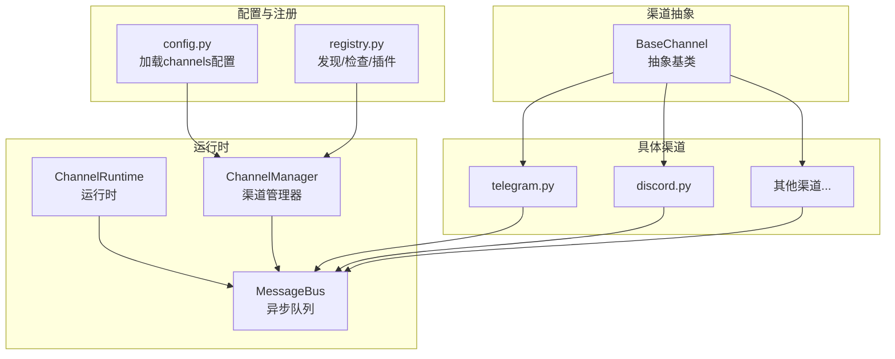
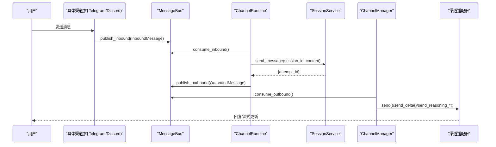
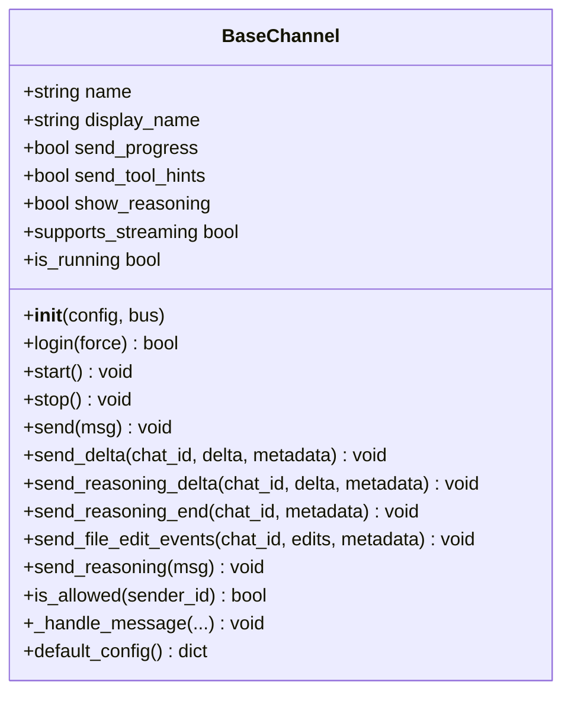
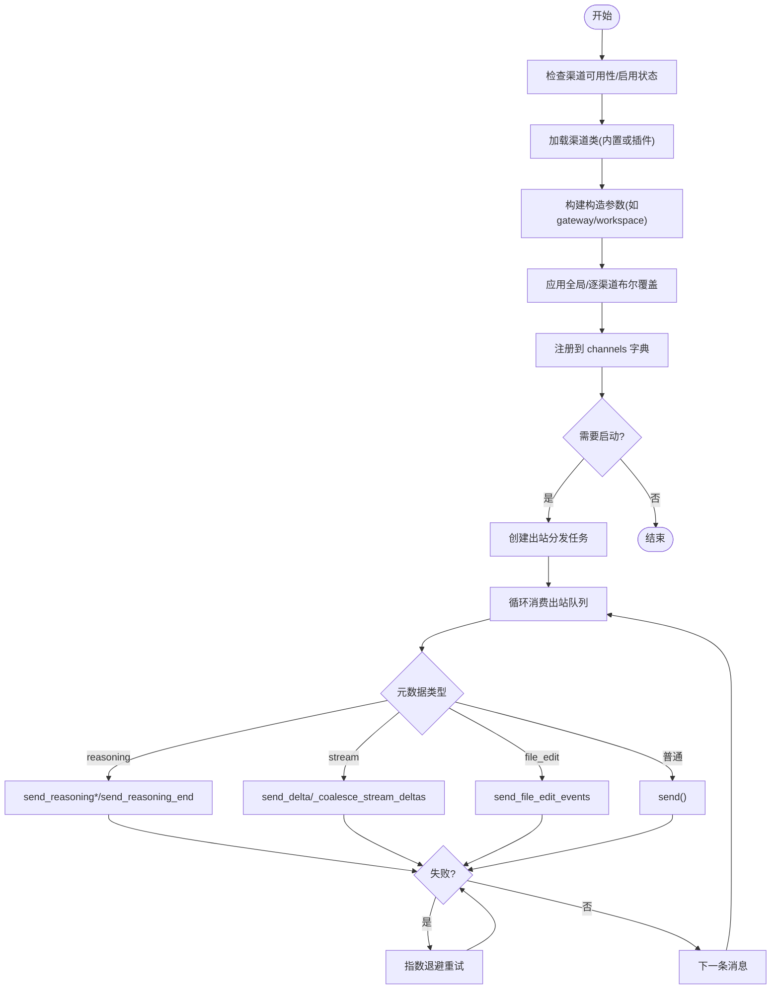
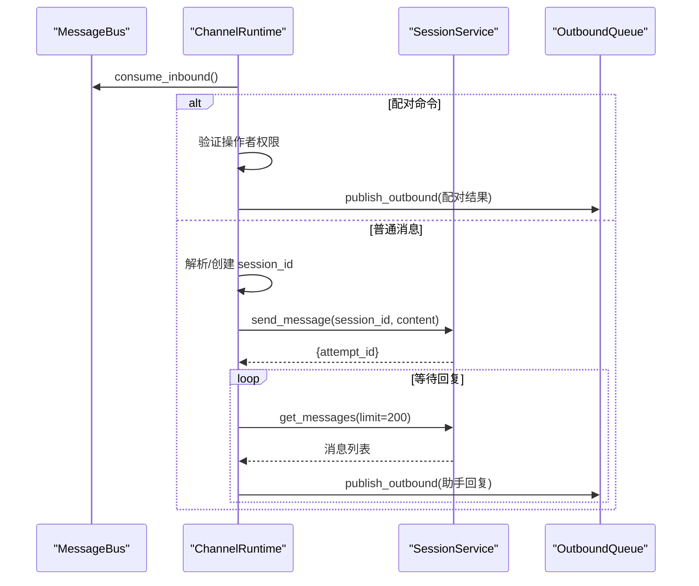
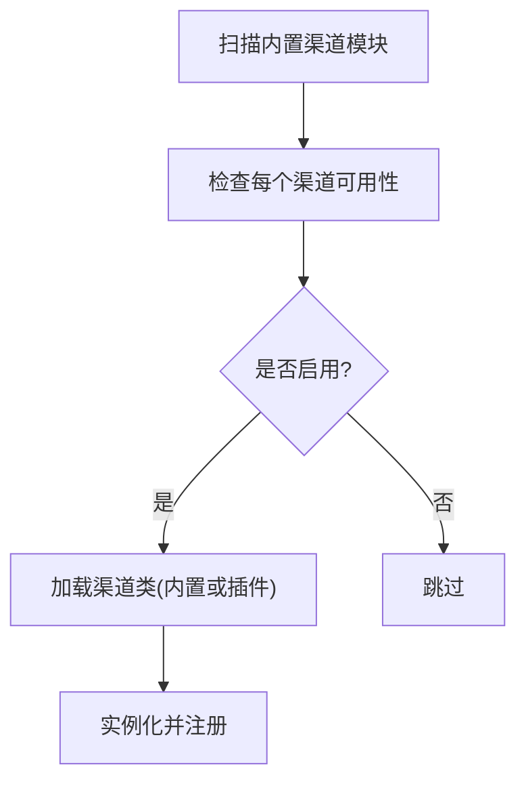
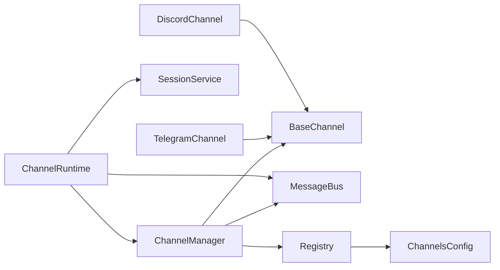

# 渠道架构设计

<cite>
**本文引用的文件**
- [agent/src/channels/base.py](file://agent/src/channels/base.py)
- [agent/src/channels/manager.py](file://agent/src/channels/manager.py)
- [agent/src/channels/config.py](file://agent/src/channels/config.py)
- [agent/src/channels/registry.py](file://agent/src/channels/registry.py)
- [agent/src/channels/runtime.py](file://agent/src/channels/runtime.py)
- [agent/src/channels/bus/events.py](file://agent/src/channels/bus/events.py)
- [agent/src/channels/bus/queue.py](file://agent/src/channels/bus/queue.py)
- [agent/src/channels/telegram.py](file://agent/src/channels/telegram.py)
- [agent/src/channels/discord.py](file://agent/src/channels/discord.py)
- [agent/src/config/schema.py](file://agent/src/config/schema.py)
- [agent/tests/test_channels_runtime.py](file://agent/tests/test_channels_runtime.py)
- [agent/tests/test_channels_api.py](file://agent/tests/test_channels_api.py)
</cite>

## 目录
1. [简介](#简介)
2. [项目结构](#项目结构)
3. [核心组件](#核心组件)
4. [架构总览](#架构总览)
5. [详细组件分析](#详细组件分析)
6. [依赖关系分析](#依赖关系分析)
7. [性能考量](#性能考量)
8. [故障排查指南](#故障排查指南)
9. [结论](#结论)
10. [附录](#附录)

## 简介
本文件系统性阐述 Vibe-Trading 的消息渠道架构，重点包括：
- 统一渠道抽象层的设计原理与 BaseChannel 基类的核心接口、扩展机制
- 渠道管理器 ChannelManager 的工作流程：渠道发现、注册、生命周期管理、错误处理
- 配置系统如何支持多渠道动态配置与热重载
- 渠道插件化架构：外部插件的发现与加载机制
- 自定义渠道开发的最佳实践与集成模式

该架构通过消息总线将各聊天平台（Telegram、Discord、Slack、WhatsApp、企业微信等）与 Agent 核心解耦，提供统一的入站/出站消息模型、流式输出、重试与合并、权限校验与会话映射能力。

## 项目结构
渠道子系统位于 agent/src/channels 下，围绕“抽象基类 + 管理器 + 运行时 + 消息总线 + 注册表”的层次组织：
- base.py：定义 BaseChannel 抽象基类，统一发送、流式、权限、配对码等能力
- manager.py：ChannelManager，负责启用、启动、停止、路由、去重、重试
- runtime.py：ChannelRuntime，连接 MessageBus 与 SessionService，处理 /pairing、会话映射、超时等待回复
- bus/events.py、bus/queue.py：InboundMessage/OutboundMessage 数据模型与异步队列
- registry.py：内置渠道扫描、可用性检查、外部插件发现（entry_points）
- config.py：从结构化配置中加载 channels 配置段
- 具体渠道实现：如 telegram.py、discord.py 等，继承 BaseChannel 并实现 start/stop/send 等

图表来源
- [agent/src/channels/base.py:22-238](file://agent/src/channels/base.py#L22-L238)
- [agent/src/channels/manager.py:36-253](file://agent/src/channels/manager.py#L36-L253)
- [agent/src/channels/runtime.py:34-112](file://agent/src/channels/runtime.py#L34-L112)
- [agent/src/channels/bus/queue.py:8-44](file://agent/src/channels/bus/queue.py#L8-L44)
- [agent/src/channels/config.py:11-22](file://agent/src/channels/config.py#L11-L22)
- [agent/src/channels/registry.py:87-284](file://agent/src/channels/registry.py#L87-L284)

章节来源
- [agent/src/channels/base.py:22-238](file://agent/src/channels/base.py#L22-L238)
- [agent/src/channels/manager.py:36-253](file://agent/src/channels/manager.py#L36-L253)
- [agent/src/channels/runtime.py:34-112](file://agent/src/channels/runtime.py#L34-L112)
- [agent/src/channels/bus/events.py:20-55](file://agent/src/channels/bus/events.py#L20-L55)
- [agent/src/channels/bus/queue.py:8-44](file://agent/src/channels/bus/queue.py#L8-L44)
- [agent/src/channels/config.py:11-22](file://agent/src/channels/config.py#L11-L22)
- [agent/src/channels/registry.py:87-284](file://agent/src/channels/registry.py#L87-L284)

## 核心组件
- BaseChannel：统一抽象，定义登录、启动/停止、发送、流式发送、推理内容发送、权限控制、默认配置等接口
- ChannelManager：渠道发现与注册、全局/逐渠道布尔覆盖、出站分发、去重、重试、状态上报
- ChannelRuntime：入站消费、会话映射、/pairing 命令、超时等待助手回复、错误回显
- MessageBus：入站/出站异步队列，解耦渠道与 Agent
- Registry：内置渠道扫描、可用性检查、外部插件发现（entry_points），避免不必要的第三方 SDK 导入
- Config：从结构化配置读取 channels 段，供 Manager/Runtime 使用

章节来源
- [agent/src/channels/base.py:22-238](file://agent/src/channels/base.py#L22-L238)
- [agent/src/channels/manager.py:36-253](file://agent/src/channels/manager.py#L36-L253)
- [agent/src/channels/runtime.py:34-112](file://agent/src/channels/runtime.py#L34-L112)
- [agent/src/channels/bus/queue.py:8-44](file://agent/src/channels/bus/queue.py#L8-L44)
- [agent/src/channels/registry.py:87-284](file://agent/src/channels/registry.py#L87-L284)
- [agent/src/channels/config.py:11-22](file://agent/src/channels/config.py#L11-L22)

## 架构总览
下图展示从用户消息到渠道回复的整体流程，以及关键组件间的交互：

图表来源
- [agent/src/channels/runtime.py:114-245](file://agent/src/channels/runtime.py#L114-L245)
- [agent/src/channels/manager.py:283-369](file://agent/src/channels/manager.py#L283-L369)
- [agent/src/channels/bus/queue.py:19-33](file://agent/src/channels/bus/queue.py#L19-L33)
- [agent/src/channels/bus/events.py:20-55](file://agent/src/channels/bus/events.py#L20-L55)

## 详细组件分析

### BaseChannel 抽象基类
- 职责
  - 统一入口：start/stop/send 必须实现；login 可选实现用于交互式认证
  - 流式协议：send_delta/send_reasoning_delta/send_reasoning_end/send_file_edit_events
  - 权限控制：is_allowed 支持 allow_from、* 通配、配对批准列表
  - 入站处理：_handle_message 自动注入 _wants_stream、DM 未授权时返回配对码
  - 默认行为：supports_streaming 根据配置与子类是否重写 send_delta 判断
  - 默认配置：default_config 便于引导生成配置片段

- 扩展点
  - 子类只需实现 start/stop/send，并可选择性实现流式方法以适配平台特性
  - 可通过覆盖 send_reasoning_* 实现“思考过程”的专属渲染（如 Slack context block、Telegram expandable blockquote 等）

图表来源
- [agent/src/channels/base.py:22-238](file://agent/src/channels/base.py#L22-L238)

章节来源
- [agent/src/channels/base.py:22-238](file://agent/src/channels/base.py#L22-L238)

### ChannelManager 渠道管理器
- 职责
  - 初始化：基于配置启用渠道，构建实例，应用全局/逐渠道布尔覆盖
  - 启动/停止：并发启动所有渠道，维护出站分发任务
  - 出站分发：过滤进度/工具提示、合并连续流式块、去重重复消息、按元数据路由到不同发送路径
  - 重试策略：指数退避重试，可配置最大尝试次数
  - 状态上报：available/loaded/running/display_name/error 等

- 关键流程
  - 发现与注册：inspect_channels 获取可用性与启用状态；discover_plugins 加载外部插件；load_channel_class 导入内置模块
  - 构建参数：为特定渠道注入服务（如 websocket 的 gateway_services、matrix 的工作区限制）
  - 出站路由：根据元数据区分 reasoning/stream/file_edit_events/delta/end/普通消息

图表来源
- [agent/src/channels/manager.py:64-137](file://agent/src/channels/manager.py#L64-L137)
- [agent/src/channels/manager.py:213-253](file://agent/src/channels/manager.py#L213-L253)
- [agent/src/channels/manager.py:283-453](file://agent/src/channels/manager.py#L283-L453)
- [agent/src/channels/registry.py:193-284](file://agent/src/channels/registry.py#L193-L284)

章节来源
- [agent/src/channels/manager.py:64-137](file://agent/src/channels/manager.py#L64-L137)
- [agent/src/channels/manager.py:213-253](file://agent/src/channels/manager.py#L213-L253)
- [agent/src/channels/manager.py:283-453](file://agent/src/channels/manager.py#L283-L453)
- [agent/src/channels/registry.py:193-284](file://agent/src/channels/registry.py#L193-L284)

### ChannelRuntime 运行时
- 职责
  - 消费入站消息，解析 /pairing 和会话重置命令
  - 维护 channel:chat_id -> session_id 的映射，持久化到 sessions.json
  - 调用 SessionService 发送消息并等待助手回复（带超时与轮询）
  - 将回复封装为 OutboundMessage 发布到总线

- 关键流程
  - 启动：加载会话映射，可选启动 ChannelManager.start_all，启动消费者循环
  - 处理：识别配对命令与操作者权限；否则创建/复用会话并发送消息
  - 等待：按 attempt_id 匹配最新助手消息，超时则回显错误

图表来源
- [agent/src/channels/runtime.py:72-112](file://agent/src/channels/runtime.py#L72-L112)
- [agent/src/channels/runtime.py:114-245](file://agent/src/channels/runtime.py#L114-L245)
- [agent/src/channels/runtime.py:247-310](file://agent/src/channels/runtime.py#L247-L310)

章节来源
- [agent/src/channels/runtime.py:72-112](file://agent/src/channels/runtime.py#L72-L112)
- [agent/src/channels/runtime.py:114-245](file://agent/src/channels/runtime.py#L114-L245)
- [agent/src/channels/runtime.py:247-310](file://agent/src/channels/runtime.py#L247-L310)

### 消息总线与事件模型
- InboundMessage：包含 channel、sender_id、chat_id、content、media、metadata、session_key_override
- OutboundMessage：包含 channel、chat_id、content、reply_to、media、metadata、buttons
- MessageBus：inbound/outbound 两个异步队列，提供 publish/consume 接口与队列大小查询

章节来源
- [agent/src/channels/bus/events.py:20-55](file://agent/src/channels/bus/events.py#L20-L55)
- [agent/src/channels/bus/queue.py:8-44](file://agent/src/channels/bus/queue.py#L8-L44)

### 配置系统与热重载
- 配置加载：config.load_channels_config 从结构化配置中取出 channels 段，转为字典供 Manager/Runtime 使用
- 全局与逐渠道覆盖：Manager 支持顶层 send_max_retries、send_progress、send_tool_hints、show_reasoning 等全局开关，也可在渠道段内覆盖
- 热重载建议：由于 Manager/Runtime 在启动时读取配置，若需热重载，应重新构建实例或暴露 reload 接口以重新 inspect_channels 并重启渠道

章节来源
- [agent/src/channels/config.py:11-22](file://agent/src/channels/config.py#L11-L22)
- [agent/src/channels/manager.py:139-204](file://agent/src/channels/manager.py#L139-L204)
- [agent/src/config/schema.py:1-200](file://agent/src/config/schema.py#L1-L200)

### 插件化架构与外部插件发现
- 内置渠道发现：registry.discover_channel_names 通过 pkgutil 扫描 src.channels 下的模块名，排除内部模块
- 可用性检查：inspect_channel 尝试导入并查找 BaseChannel 子类，检测可选依赖缺失，返回安装提示
- 外部插件发现：discover_plugins 通过 importlib.metadata.entry_points(group="vibe_trading.channels") 加载外部插件类
- 优先级：内置渠道优先于同名外部插件，避免被覆盖

图表来源
- [agent/src/channels/registry.py:87-160](file://agent/src/channels/registry.py#L87-L160)
- [agent/src/channels/registry.py:223-284](file://agent/src/channels/registry.py#L223-L284)
- [agent/src/channels/manager.py:64-137](file://agent/src/channels/manager.py#L64-L137)

章节来源
- [agent/src/channels/registry.py:87-160](file://agent/src/channels/registry.py#L87-L160)
- [agent/src/channels/registry.py:223-284](file://agent/src/channels/registry.py#L223-L284)
- [agent/src/channels/manager.py:64-137](file://agent/src/channels/manager.py#L64-L137)

### 具体渠道实现示例
- Telegram：实现长消息分割、HTML/Markdown 转义、工具提示折叠块、流式编辑等
- Discord：客户端事件转发、线程/频道白名单、应用命令、流式缓冲区等

章节来源
- [agent/src/channels/telegram.py:1-200](file://agent/src/channels/telegram.py#L1-L200)
- [agent/src/channels/discord.py:1-200](file://agent/src/channels/discord.py#L1-L200)

## 依赖关系分析
- ChannelManager 依赖：
  - BaseChannel（抽象）、MessageBus（队列）、Registry（发现/加载）、ConfigPaths（工作区路径）
- ChannelRuntime 依赖：
  - MessageBus、ChannelManager、SessionService、Pairing 工具、配置路径
- Registry 依赖：
  - ChannelsConfig（全局键集合）、importlib/pkgutil/importlib.metadata
- 具体渠道依赖：
  - BaseChannel、OutboundMessage、utils（媒体/分割/校验）

图表来源
- [agent/src/channels/manager.py:13-23](file://agent/src/channels/manager.py#L13-L23)
- [agent/src/channels/runtime.py:15-22](file://agent/src/channels/runtime.py#L15-L22)
- [agent/src/channels/registry.py:15-31](file://agent/src/channels/registry.py#L15-L31)
- [agent/src/channels/telegram.py:28-35](file://agent/src/channels/telegram.py#L28-L35)
- [agent/src/channels/discord.py:15-22](file://agent/src/channels/discord.py#L15-L22)

章节来源
- [agent/src/channels/manager.py:13-23](file://agent/src/channels/manager.py#L13-L23)
- [agent/src/channels/runtime.py:15-22](file://agent/src/channels/runtime.py#L15-L22)
- [agent/src/channels/registry.py:15-31](file://agent/src/channels/registry.py#L15-L31)

## 性能考量
- 出站合并：对同一目标与 stream_id 的连续 _stream_delta 进行合并，减少 API 调用
- 去重：基于内容指纹与 origin/message_id 抑制重复出站
- 重试退避：指数退避（1s、2s、4s）降低瞬时失败影响
- 懒加载：仅启用渠道才导入其模块，避免第三方 SDK 的昂贵导入开销
- 流式缓冲：Discord 等渠道使用 per-chat 缓冲区，减少频繁编辑

章节来源
- [agent/src/channels/manager.py:371-419](file://agent/src/channels/manager.py#L371-L419)
- [agent/src/channels/manager.py:256-281](file://agent/src/channels/manager.py#L256-L281)
- [agent/src/channels/manager.py:421-453](file://agent/src/channels/manager.py#L421-L453)
- [agent/src/channels/registry.py:241-274](file://agent/src/channels/registry.py#L241-L274)
- [agent/src/channels/discord.py:40-48](file://agent/src/channels/discord.py#L40-L48)

## 故障排查指南
- 渠道不可用：查看 status 中的 available 与 error、install_hint，按提示安装可选依赖
- 启动失败：检查日志中 Failed to start channel 异常，确认凭据与网络可达
- 重复消息：检查 _should_suppress_outbound 的去重逻辑，确认 message_id/origin_message_id 是否正确传递
- 流式卡顿：确认 _stream_id 一致且 _stream_end 正确标记，避免缓冲区不释放
- 会话忙：当 SessionBusyError 发生时，会返回友好提示，建议稍后重试或使用 /new 重置会话
- 权限拒绝：未授权用户在 DM 中将收到配对码；如需允许，加入 allow_from 或通过 /pairing 批准

章节来源
- [agent/src/channels/manager.py:79-99](file://agent/src/channels/manager.py#L79-L99)
- [agent/src/channels/manager.py:206-212](file://agent/src/channels/manager.py#L206-L212)
- [agent/src/channels/manager.py:261-281](file://agent/src/channels/manager.py#L261-L281)
- [agent/src/channels/runtime.py:121-245](file://agent/src/channels/runtime.py#L121-L245)
- [agent/src/channels/base.py:165-211](file://agent/src/channels/base.py#L165-L211)

## 结论
Vibe-Trading 的渠道架构通过清晰的抽象层、强大的管理器与灵活的运行时，实现了多平台消息的统一接入与可靠路由。其插件化设计与懒加载机制保证了可扩展性与性能，配合完善的错误处理与状态上报，为运维与开发者提供了良好的可观测性与可维护性。

## 附录

### 自定义渠道开发最佳实践
- 继承 BaseChannel，实现 start/stop/send；如需流式，实现 send_delta 与 send_reasoning_*
- 在 is_allowed 中遵循 allow_from 与配对批准策略；必要时在 _handle_message 前做额外校验
- 合理设置 metadata：如 _stream_id、_stream_delta、_stream_end、message_id、origin_message_id
- 遵循平台限制：如消息长度、HTML/Markdown 转义、附件大小等
- 通过 entry_points 注册外部插件，或在 src.channels 下新增模块作为内置渠道

章节来源
- [agent/src/channels/base.py:22-238](file://agent/src/channels/base.py#L22-L238)
- [agent/src/channels/registry.py:223-284](file://agent/src/channels/registry.py#L223-L284)
- [agent/src/channels/telegram.py:1-200](file://agent/src/channels/telegram.py#L1-L200)
- [agent/src/channels/discord.py:1-200](file://agent/src/channels/discord.py#L1-L200)

### 集成模式与测试参考
- 使用 MessageBus 与 ChannelManager 组合，快速搭建最小运行环境
- 通过 inspect_channels/discover_channel_names 验证渠道可用性与启用状态
- 使用测试夹具模拟 SessionService，验证运行时行为与超时处理

章节来源
- [agent/tests/test_channels_runtime.py:75-193](file://agent/tests/test_channels_runtime.py#L75-L193)
- [agent/tests/test_channels_api.py:49-102](file://agent/tests/test_channels_api.py#L49-L102)