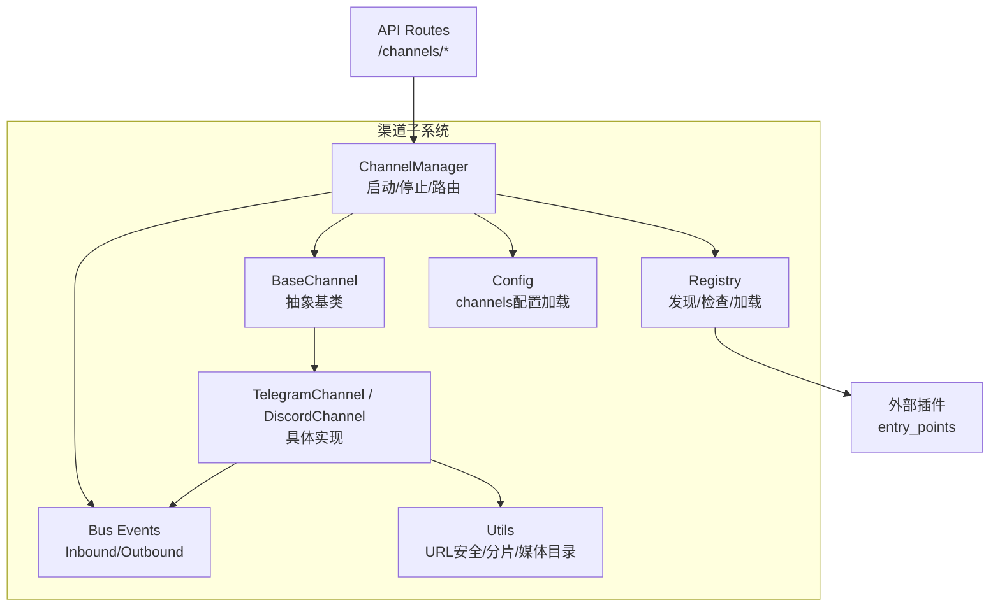
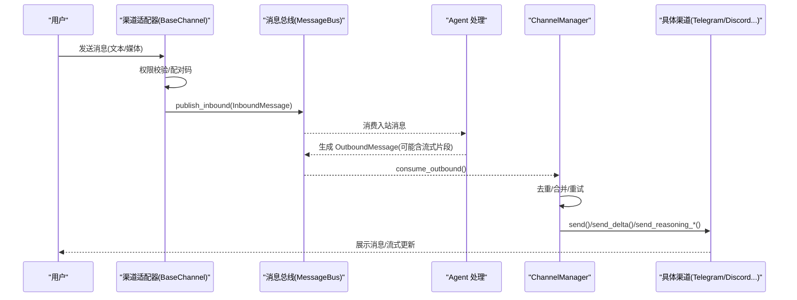
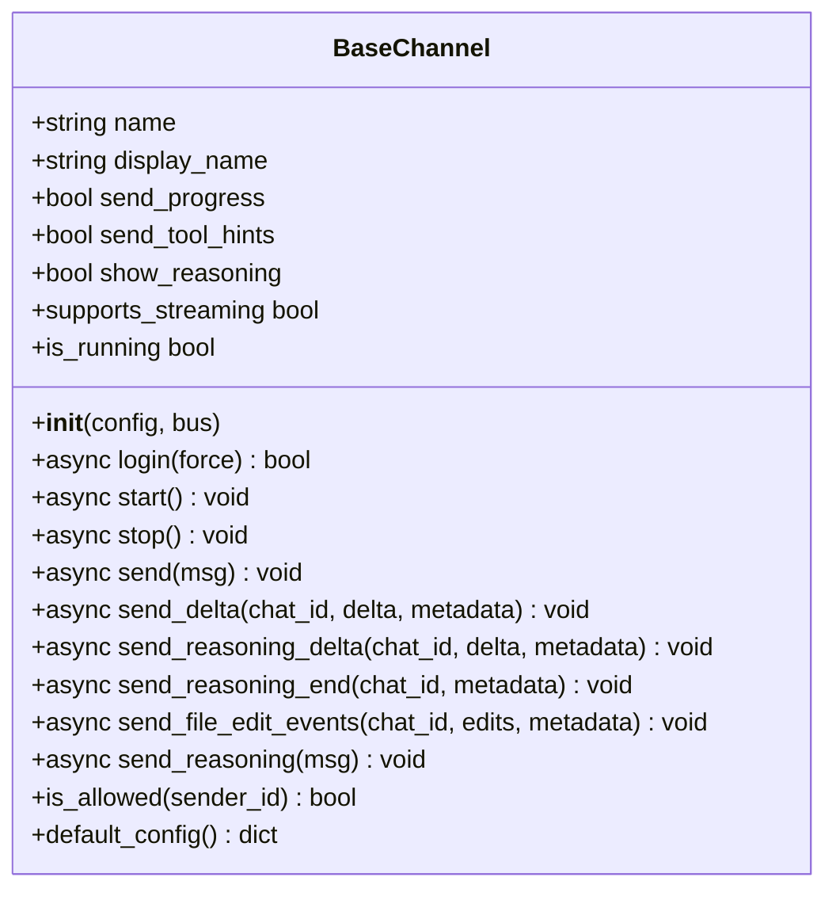
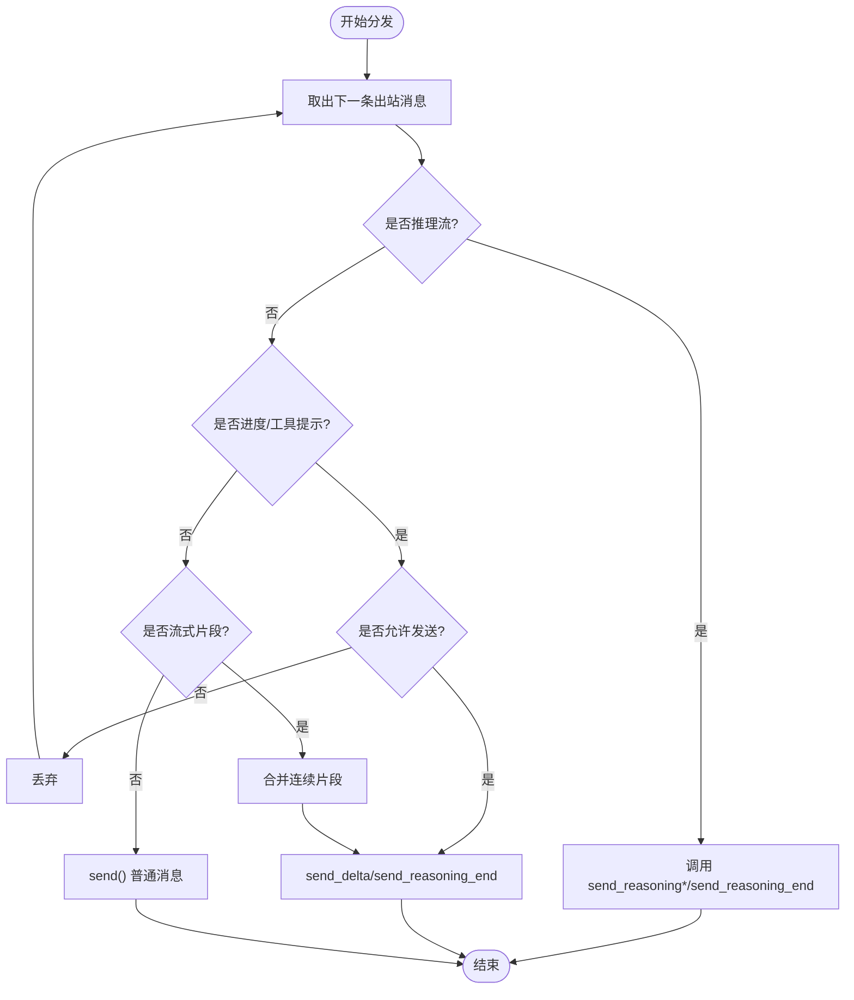
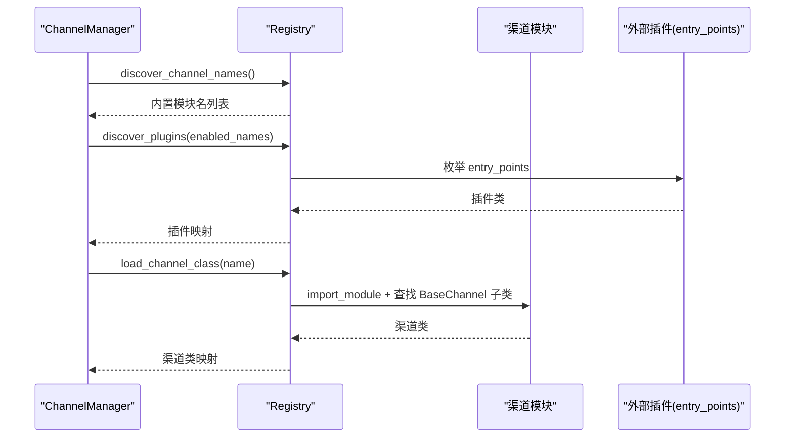
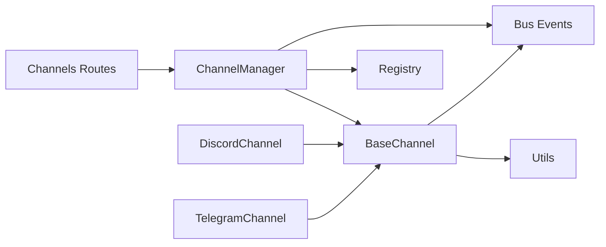

# 自定义渠道开发

<cite>
**本文引用的文件**
- [base.py](file://agent/src/channels/base.py)
- [registry.py](file://agent/src/channels/registry.py)
- [manager.py](file://agent/src/channels/manager.py)
- [config.py](file://agent/src/channels/config.py)
- [events.py](file://agent/src/channels/bus/events.py)
- [telegram.py](file://agent/src/channels/telegram.py)
- [discord.py](file://agent/src/channels/discord.py)
- [channels_routes.py](file://agent/src/api/channels_routes.py)
- [utils.py](file://agent/src/channels/utils.py)
- [test_channels_runtime.py](file://agent/tests/test_channels_runtime.py)
</cite>

## 目录
1. [简介](#简介)
2. [项目结构](#项目结构)
3. [核心组件](#核心组件)
4. [架构总览](#架构总览)
5. [详细组件分析](#详细组件分析)
6. [依赖关系分析](#依赖关系分析)
7. [性能考虑](#性能考虑)
8. [故障排查指南](#故障排查指南)
9. [结论](#结论)
10. [附录：开发示例与最佳实践](#附录：开发示例与最佳实践)

## 简介
本指南面向希望为 Vibe-Trading 扩展“自定义渠道”的开发者。你将学习如何继承 BaseChannel 基类、实现必要接口、遵循消息总线契约，并通过注册机制将内置或外部插件接入系统。文档还涵盖消息模板与变量替换、安全性（敏感信息处理、输入校验、访问控制）、测试策略、调试技巧与性能优化，并给出完整示例与最佳实践。

## 项目结构
Vibe-Trading 的渠道子系统位于 agent/src/channels，采用“抽象基类 + 具体实现 + 管理器 + 注册发现 + 消息总线”的分层设计：
- 抽象基类：定义统一接口与通用能力（权限、配对码、流式发送等）
- 具体实现：Telegram、Discord 等平台的适配
- 管理器：启动/停止、出站路由、重试与合并
- 注册器：扫描内置模块与外部插件（entry_points），提供可用性检查
- 配置加载：从结构化 Agent 配置中读取 channels 部分
- 消息事件：InboundMessage/OutboundMessage 作为跨通道统一数据模型
- API 路由：对外暴露渠道状态、启停、配对命令等 HTTP 接口

图表来源
- [base.py:22-238](file://agent/src/channels/base.py#L22-L238)
- [manager.py:36-479](file://agent/src/channels/manager.py#L36-L479)
- [registry.py:87-284](file://agent/src/channels/registry.py#L87-L284)
- [config.py:11-22](file://agent/src/channels/config.py#L11-L22)
- [events.py:20-55](file://agent/src/channels/bus/events.py#L20-L55)
- [utils.py:16-180](file://agent/src/channels/utils.py#L16-L180)
- [channels_routes.py:57-116](file://agent/src/api/channels_routes.py#L57-L116)

章节来源
- [base.py:22-238](file://agent/src/channels/base.py#L22-L238)
- [manager.py:36-479](file://agent/src/channels/manager.py#L36-L479)
- [registry.py:87-284](file://agent/src/channels/registry.py#L87-L284)
- [config.py:11-22](file://agent/src/channels/config.py#L11-L22)
- [events.py:20-55](file://agent/src/channels/bus/events.py#L20-L55)
- [utils.py:16-180](file://agent/src/channels/utils.py#L16-L180)
- [channels_routes.py:57-116](file://agent/src/api/channels_routes.py#L57-L116)

## 核心组件
- BaseChannel：定义 name、display_name、send_progress/show_reasoning 等开关；提供 is_allowed 权限判断、_handle_message 入站封装、默认流式发送钩子 send_delta/send_reasoning_delta/send_reasoning_end、以及 default_config 用于引导配置。
- ChannelManager：负责初始化启用渠道、启动/停止、出站消息分发、去重与合并、重试退避、进度/工具提示过滤、流式片段聚合。
- Registry：扫描内置渠道模块与外部插件（entry_points），提供 inspect/discover/load 能力，并维护可选依赖标志与安装提示。
- Config：从 Agent 配置中解析 channels 段，返回字典供 Manager 使用。
- Bus Events：InboundMessage/OutboundMessage 是跨渠道统一的消息载体，metadata 携带路由、追踪、流式标记等。
- Utils：URL 安全校验、消息分片、媒体目录管理、文件名安全化等。

章节来源
- [base.py:22-238](file://agent/src/channels/base.py#L22-L238)
- [manager.py:36-479](file://agent/src/channels/manager.py#L36-L479)
- [registry.py:87-284](file://agent/src/channels/registry.py#L87-L284)
- [config.py:11-22](file://agent/src/channels/config.py#L11-L22)
- [events.py:20-55](file://agent/src/channels/bus/events.py#L20-L55)
- [utils.py:16-180](file://agent/src/channels/utils.py#L16-L180)

## 架构总览
下图展示了从入站到出站的端到端流程：渠道适配器接收用户消息，通过 BaseChannel._handle_message 进行权限校验与配对码处理，发布到 MessageBus；Agent 处理后生成 OutboundMessage，由 ChannelManager 路由到对应渠道，必要时走流式发送路径，最终调用具体渠道的 send/send_delta 等方法。

图表来源
- [base.py:179-227](file://agent/src/channels/base.py#L179-L227)
- [manager.py:283-419](file://agent/src/channels/manager.py#L283-L419)
- [events.py:20-55](file://agent/src/channels/bus/events.py#L20-L55)

## 详细组件分析

### BaseChannel：抽象基类与通用能力
- 生命周期：start/stop 必须实现；login 可覆盖以支持交互式登录（如扫码）。
- 入站处理：_handle_message 统一做权限校验、DM 配对码下发、注入 _wants_stream 标记后发布 InboundMessage。
- 出站与流式：send 必须实现；send_delta/send_reasoning_delta/send_reasoning_end 用于流式增量推送；send_reasoning 默认基于 delta/end 组合。
- 权限：is_allowed 支持 allow_from 白名单、* 通配、配对批准存储。
- 配置：default_config 用于自动填充引导配置。

图表来源
- [base.py:22-238](file://agent/src/channels/base.py#L22-L238)

章节来源
- [base.py:22-238](file://agent/src/channels/base.py#L22-L238)

### ChannelManager：出站路由、重试与合并
- 启动/停止：start_all/stop_all 并发启动各渠道，维护 _dispatch_task 持续消费出站队列。
- 出站分发：_dispatch_outbound 根据 metadata 区分推理流、进度/工具提示、普通消息；对 _stream_delta 进行同目标合并以减少 API 调用。
- 重试退避：_send_with_retry 指数退避，失败记录日志。
- 去重：基于内容指纹与 message_id/origin_message_id 抑制重复回复。
- 布尔覆盖：支持全局与渠道级 send_progress/send_tool_hints/show_reasoning 覆盖。

图表来源
- [manager.py:283-419](file://agent/src/channels/manager.py#L283-L419)

章节来源
- [manager.py:283-419](file://agent/src/channels/manager.py#L283-L419)

### Registry：内置与外部插件发现
- discover_channel_names：扫描 src.channels 包下非内部模块名。
- load_channel_class：动态导入模块并查找 BaseChannel 子类。
- inspect_channel：不抛出依赖错误地检查可用性与安装提示。
- discover_plugins：通过 entry_points(group="vibe_trading.channels") 加载外部插件。
- discover_enabled/discover_all：按 enabled 集合筛选并合并内置与外部插件（内置优先）。

图表来源
- [registry.py:87-284](file://agent/src/channels/registry.py#L87-L284)
- [manager.py:64-137](file://agent/src/channels/manager.py#L64-L137)

章节来源
- [registry.py:87-284](file://agent/src/channels/registry.py#L87-L284)
- [manager.py:64-137](file://agent/src/channels/manager.py#L64-L137)

### 具体渠道实现要点（Telegram/Discord）
- TelegramChannel：
  - 支持 polling/webhook 两种模式，webhook 需 HTTPS URL 与 secret token。
  - Markdown→HTML 转换、长消息分片、富消息 sendRichMessage 降级回退。
  - 流式编辑：按 chat_id/stream_id 维护缓冲区，限制 edit 频率。
  - 命令菜单与斜杠命令转发至 Agent。
- DiscordChannel：
  - 使用 discord.py，支持 intents、代理认证、群组策略（@提及才响应）。
  - 附件下载与大小限制，失败时输出占位文本。
  - 流式编辑：首条发送，后续 edit 直至 _stream_end。

章节来源
- [telegram.py:368-800](file://agent/src/channels/telegram.py#L368-L800)
- [discord.py:50-800](file://agent/src/channels/discord.py#L50-L800)

### 消息事件与模板/变量替换
- InboundMessage/OutboundMessage：统一承载 channel、chat_id、content、media、metadata。
- 元数据约定：
  - _progress/_tool_hint：进度/工具提示过滤
  - _reasoning_delta/_reasoning_end/_reasoning：推理流
  - _stream_delta/_stream_end/_streamed/_stream_id：流式片段与合并
  - origin_message_id/message_id：去重依据
  - OUTBOUND_META_AGENT_UI：UI 专用结构化负载键
- 模板与变量替换：
  - 当前代码库未提供统一的模板引擎；建议在渠道实现中基于 Python f-string/format 或 Jinja2 在 send/send_delta 前对 content 进行格式化，并在 metadata 中保留原始模板以便审计。
  - 对于平台特定格式（如 Telegram HTML），可在渠道内完成转换后再发送。

章节来源
- [events.py:20-55](file://agent/src/channels/bus/events.py#L20-L55)
- [telegram.py:228-341](file://agent/src/channels/telegram.py#L228-L341)

### 安全性考虑
- 访问控制：
  - BaseChannel.is_allowed：allow_from 白名单、* 通配、配对批准存储。
  - DM 场景：未授权用户会收到配对码，管理员可通过 pairing 命令审批。
- 输入验证：
  - URL 安全：validate_url_target 仅允许 http/https，禁止私有/环回/多播地址（除非显式允许）。
  - 文件名安全：safe_filename 去除危险字符。
  - 媒体目录：get_media_dir 限定上传到 ~/.vibe-trading/uploads/<channel>。
- 敏感信息处理：
  - 避免在日志中打印 token、secret、私钥等；渠道实现应使用 logger 而非 print。
  - 配置项建议通过环境变量或受保护的配置文件注入，不在代码中硬编码。
- 访问控制（API）：
  - channels_routes 中的 /channels/* 均挂载 require_auth 依赖，确保鉴权。

章节来源
- [base.py:165-211](file://agent/src/channels/base.py#L165-L211)
- [utils.py:97-180](file://agent/src/channels/utils.py#L97-L180)
- [channels_routes.py:57-116](file://agent/src/api/channels_routes.py#L57-L116)

### 测试策略与调试技巧
- 单元测试：
  - 使用 pytest 构造 MessageBus 与 ChannelManager，验证渠道发现、状态、启停行为。
  - 模拟 SessionService 以验证 Websocket 渠道的会话交互。
- 断言要点：
  - 渠道名称与显示名、enabled/configured/available/loaded/running 状态。
  - 缺失可选依赖时的 install_hint 提示。
- 调试技巧：
  - 开启渠道日志（logger），关注 start/stop、错误堆栈、重试延迟。
  - 利用 manager.get_status() 快速定位 unavailable/error 的渠道。
  - 对出站消息添加 _progress 标记观察进度流；对 _stream_delta 观察合并效果。

章节来源
- [test_channels_runtime.py:75-192](file://agent/tests/test_channels_runtime.py#L75-L192)
- [manager.py:460-479](file://agent/src/channels/manager.py#L460-L479)

## 依赖关系分析
- 耦合与内聚：
  - BaseChannel 高内聚于消息协议与权限逻辑；具体渠道低耦合于平台 SDK。
  - ChannelManager 解耦了路由与重试策略，便于横向扩展新渠道。
- 直接/间接依赖：
  - Manager 依赖 Registry、Config、Events；渠道依赖 Events、Utils。
  - API Routes 依赖 Manager 运行时（通过 host 模块获取）。
- 外部依赖：
  - 各渠道 SDK（telegram、discord 等）通过可选依赖与 availability flags 控制加载。
- 循环依赖：
  - 未发现明显循环；入口点集中在 Manager 与 Registry。

图表来源
- [base.py:22-238](file://agent/src/channels/base.py#L22-L238)
- [manager.py:36-479](file://agent/src/channels/manager.py#L36-L479)
- [registry.py:87-284](file://agent/src/channels/registry.py#L87-L284)
- [events.py:20-55](file://agent/src/channels/bus/events.py#L20-L55)
- [utils.py:16-180](file://agent/src/channels/utils.py#L16-L180)
- [channels_routes.py:57-116](file://agent/src/api/channels_routes.py#L57-L116)

章节来源
- [manager.py:36-479](file://agent/src/channels/manager.py#L36-L479)
- [registry.py:87-284](file://agent/src/channels/registry.py#L87-L284)

## 性能考虑
- 出站合并：对同一 chat_id 与 stream_id 的连续 _stream_delta 进行合并，减少 API 调用次数。
- 重试退避：指数退避降低瞬时拥塞导致的失败放大。
- 流式节流：Telegram/Discord 实现中对 edit 频率进行限流，避免触发平台速率限制。
- 连接池：Telegram 分离 getUpdates 与 API 请求的连接池，防止轮询饥饿。
- 去重：基于内容指纹与 message_id 抑制重复回复，减轻下游压力。

[本节为通用指导，无需特定文件引用]

## 故障排查指南
- 渠道不可用：
  - 检查 inspect_channels 返回的 available/error/install_hint，确认是否缺少可选依赖。
  - 查看 Manager 初始化日志，定位加载失败原因。
- 无法接收消息：
  - 确认 is_allowed 与 allow_from 配置；DM 场景检查配对码流程。
  - 检查渠道 start 是否成功（token、webhook URL、intents 等）。
- 出站失败：
  - 观察 _send_with_retry 日志，确认重试次数与延迟。
  - 检查 _should_suppress_outbound 是否误判重复。
- URL/媒体问题：
  - 使用 validate_url_target 校验目标地址；确认媒体文件在允许的 uploads 目录下。

章节来源
- [registry.py:130-160](file://agent/src/channels/registry.py#L130-L160)
- [manager.py:256-341](file://agent/src/channels/manager.py#L256-L341)
- [utils.py:97-180](file://agent/src/channels/utils.py#L97-L180)

## 结论
通过 BaseChannel 抽象、ChannelManager 路由与 Registry 发现机制，Vibe-Trading 提供了稳定可扩展的渠道体系。开发者只需实现最小接口、遵循消息元数据约定与安全规范，即可快速集成新渠道。结合测试与调试手段，可高效定位问题并优化性能。

[本节为总结性内容，无需特定文件引用]

## 附录：开发示例与最佳实践

### 自定义渠道开发步骤
1. 新建渠道模块：在 src.channels 下创建 your_channel.py，定义 YourChannelConfig（Pydantic BaseModel）与 YourChannel(BaseChannel)。
2. 实现必需方法：
   - __init__：解析配置，初始化客户端/连接
   - start：建立连接并开始监听
   - stop：清理资源
   - send：发送 OutboundMessage 到平台
   - 可选：send_delta/send_reasoning_delta/send_reasoning_end 实现流式
3. 入站处理：
   - 在平台回调中调用 self._handle_message(sender_id, chat_id, content, media, metadata, session_key, is_dm)
4. 配置与启用：
   - 在 Agent 配置的 channels.your_channel.enabled = True
   - 如需外部插件，通过 entry_points(group="vibe_trading.channels") 注册
5. 安全与校验：
   - 使用 validate_url_target 校验 URL
   - 使用 safe_filename 处理文件名
   - 避免在日志中输出敏感信息
6. 测试：
   - 参考 test_channels_runtime.py 构造 MessageBus 与 ChannelManager 进行断言
   - 验证 status、available、loaded、running 字段

章节来源
- [base.py:22-238](file://agent/src/channels/base.py#L22-L238)
- [registry.py:223-284](file://agent/src/channels/registry.py#L223-L284)
- [utils.py:16-180](file://agent/src/channels/utils.py#L16-L180)
- [test_channels_runtime.py:75-192](file://agent/tests/test_channels_runtime.py#L75-L192)

### 消息模板与变量替换最佳实践
- 在渠道 send/send_delta 前对 content 进行格式化（f-string/Jinja2），并将原始模板写入 metadata 以便审计。
- 平台特定格式（如 Telegram HTML）应在渠道内转换，避免污染上游。
- 对长消息使用 split_message 分片，保证不超过平台限制。

章节来源
- [events.py:20-55](file://agent/src/channels/bus/events.py#L20-L55)
- [telegram.py:228-341](file://agent/src/channels/telegram.py#L228-L341)
- [utils.py:53-89](file://agent/src/channels/utils.py#L53-L89)

### 插件打包与分发
- 内置渠道：直接放入 src.channels 包，命名与模块名一致，将被自动发现。
- 外部插件：
  - 在包的 setup/pyproject 中声明 entry_points(group="vibe_trading.channels", your_channel="your_pkg.channel:YourChannel")
  - 通过 pip 安装后，Registry 会自动加载
  - 若依赖可选 SDK，需在 inspect_channel 中设置 DISCORD_AVAILABLE 等标志或使用 _LAZY_IMPORT_PACKAGES

章节来源
- [registry.py:22-63](file://agent/src/channels/registry.py#L22-L63)
- [registry.py:223-284](file://agent/src/channels/registry.py#L223-L284)

### 调试与性能调优清单
- 启用渠道日志，关注 start/stop、错误堆栈、重试延迟
- 使用 manager.get_status() 快速诊断
- 对高频流式消息开启合并与节流
- 合理设置连接池与超时参数（如 Telegram 的 connection_pool_size/pool_timeout）
- 避免在 send 中执行阻塞 IO，保持异步非阻塞

章节来源
- [manager.py:206-253](file://agent/src/channels/manager.py#L206-L253)
- [telegram.py:520-541](file://agent/src/channels/telegram.py#L520-L541)