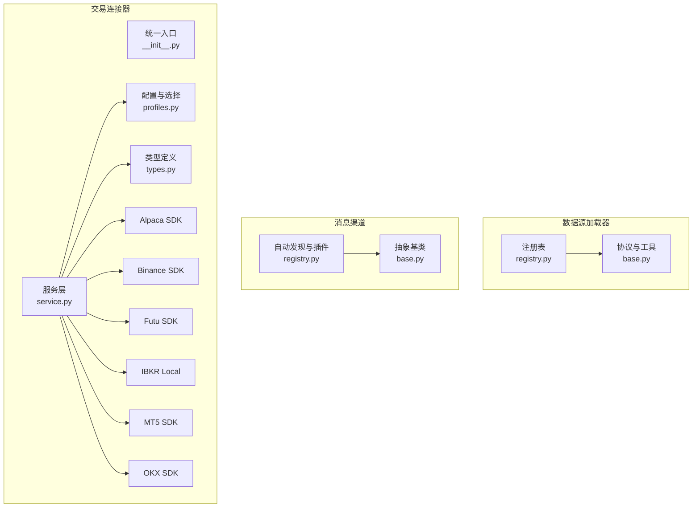
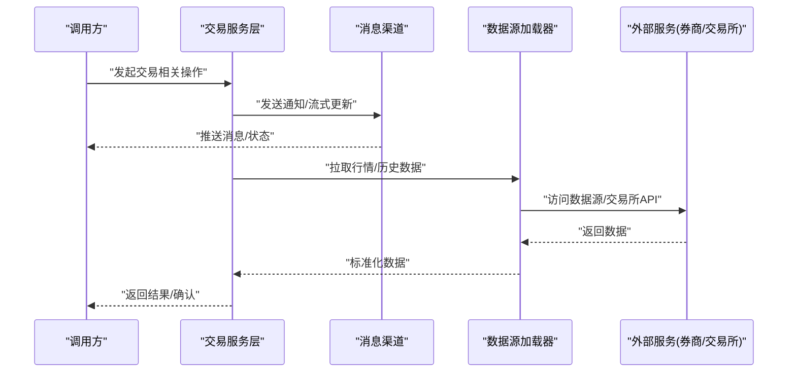
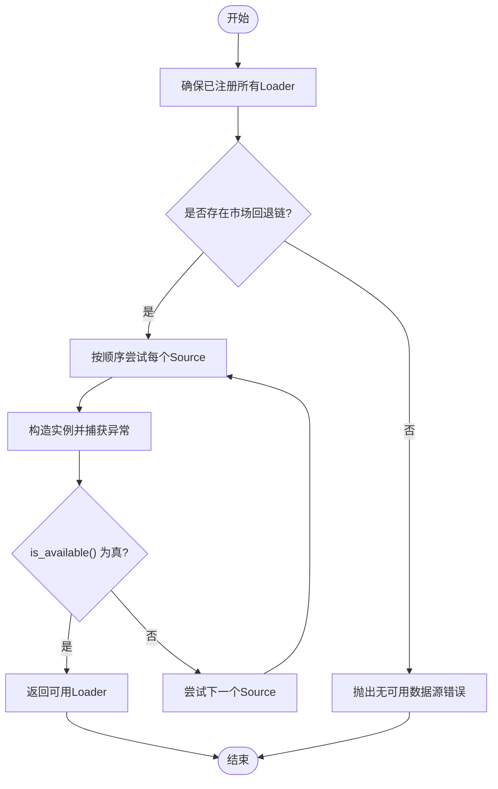
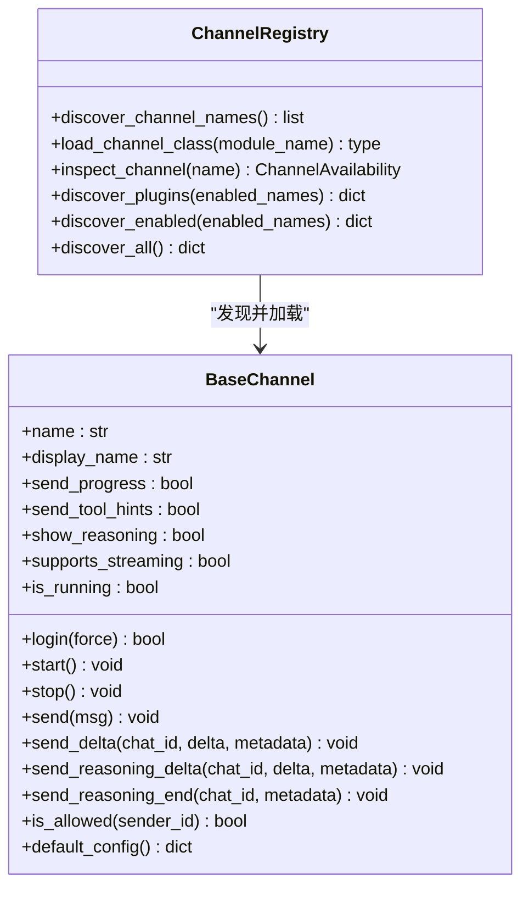
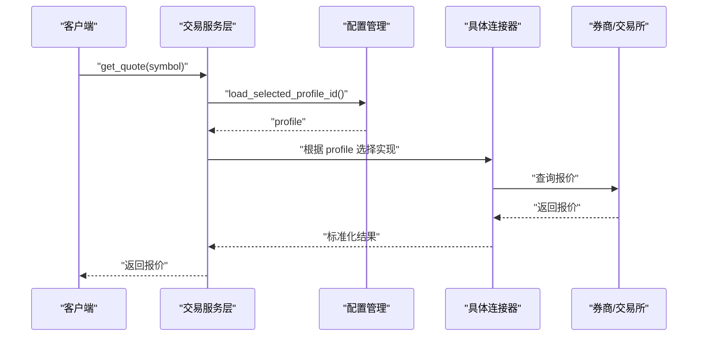
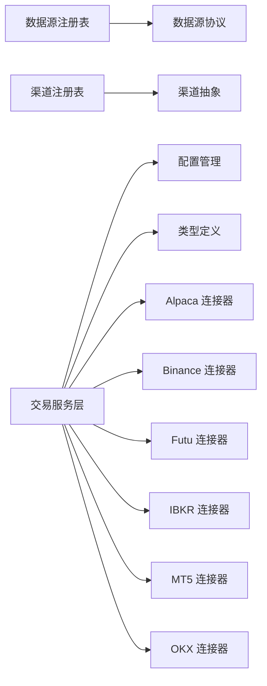

# 集成模式

<cite>
**本文引用的文件**
- [agent/backtest/loaders/registry.py](file://agent/backtest/loaders/registry.py)
- [agent/backtest/loaders/base.py](file://agent/backtest/loaders/base.py)
- [agent/src/channels/registry.py](file://agent/src/channels/registry.py)
- [agent/src/channels/base.py](file://agent/src/channels/base.py)
- [agent/src/trading/__init__.py](file://agent/src/trading/__init__.py)
- [agent/src/trading/service.py](file://agent/src/trading/service.py)
- [agent/src/trading/profiles.py](file://agent/src/trading/profiles.py)
- [agent/src/trading/types.py](file://agent/src/trading/types.py)
- [agent/src/trading/connectors/alpaca/sdk.py](file://agent/src/trading/connectors/alpaca/sdk.py)
- [agent/src/trading/connectors/binance/sdk.py](file://agent/src/trading/connectors/binance/sdk.py)
- [agent/src/trading/connectors/futu/sdk.py](file://agent/src/trading/connectors/futu/sdk.py)
- [agent/src/trading/connectors/ibkr/local.py](file://agent/src/trading/connectors/ibkr/local.py)
- [agent/src/trading/connectors/mt5/sdk.py](file://agent/src/trading/connectors/mt5/sdk.py)
- [agent/src/trading/connectors/okx/sdk.py](file://agent/src/trading/connectors/okx/sdk.py)
</cite>

## 目录
1. [简介](#简介)
2. [项目结构](#项目结构)
3. [核心组件](#核心组件)
4. [架构总览](#架构总览)
5. [详细组件分析](#详细组件分析)
6. [依赖关系分析](#依赖关系分析)
7. [性能考量](#性能考量)
8. [故障排查指南](#故障排查指南)
9. [结论](#结论)
10. [附录：自定义集成开发指南与最佳实践](#附录自定义集成开发指南与最佳实践)

## 简介
本架构文档面向 Vibe-Trading 的“集成模式”，聚焦插件化架构、适配器模式与扩展点设计，覆盖数据源连接器、交易接口、消息渠道与外部服务的集成策略。文档解释统一接口抽象、协议适配、错误处理机制，以及动态加载、热插拔与服务发现机制；并提供自定义集成开发指南、接口规范与质量保证措施，辅以典型外部系统集成场景和最佳实践。

## 项目结构
Vibe-Trading 在以下三个关键子系统实现了可扩展的集成能力：
- 数据源加载器（Data Loaders）：通过注册表与回退链实现多市场、多来源的市场数据接入。
- 消息渠道（Channels）：基于抽象基类与自动发现机制，支持内置与外部插件的消息通道。
- 交易连接器（Trading Connectors）：以服务层统一暴露账户、行情、订单等能力，内部按券商/交易所分模块实现。

**图示来源**
- [agent/backtest/loaders/registry.py:1-249](file://agent/backtest/loaders/registry.py#L1-L249)
- [agent/backtest/loaders/base.py:1-645](file://agent/backtest/loaders/base.py#L1-L645)
- [agent/src/channels/registry.py:1-284](file://agent/src/channels/registry.py#L1-L284)
- [agent/src/channels/base.py:1-238](file://agent/src/channels/base.py#L1-L238)
- [agent/src/trading/__init__.py:1-32](file://agent/src/trading/__init__.py#L1-L32)
- [agent/src/trading/service.py](file://agent/src/trading/service.py)
- [agent/src/trading/profiles.py](file://agent/src/trading/profiles.py)
- [agent/src/trading/types.py](file://agent/src/trading/types.py)

**章节来源**
- [agent/backtest/loaders/registry.py:1-249](file://agent/backtest/loaders/registry.py#L1-L249)
- [agent/src/channels/registry.py:1-284](file://agent/src/channels/registry.py#L1-L284)
- [agent/src/trading/__init__.py:1-32](file://agent/src/trading/__init__.py#L1-L32)

## 核心组件
- 数据源加载器注册表与回退链：集中管理各数据源的可发现性、可用性判定与市场级回退顺序，确保在部分不可用时仍能获取数据。
- 消息渠道抽象与插件发现：提供统一的发送/接收/流式接口，并通过包扫描与 entry_points 发现内置与外部渠道插件。
- 交易服务层与连接器：对外暴露统一 API（连接检查、账户查询、历史行情、订单与持仓），内部按券商/交易所模块化实现，便于替换与扩展。

**章节来源**
- [agent/backtest/loaders/registry.py:1-249](file://agent/backtest/loaders/registry.py#L1-L249)
- [agent/src/channels/registry.py:1-284](file://agent/src/channels/registry.py#L1-L284)
- [agent/src/trading/__init__.py:1-32](file://agent/src/trading/__init__.py#L1-L32)

## 架构总览
下图展示了“请求—适配—执行—反馈”的端到端流程，涵盖数据源、消息渠道与交易接口的协作方式。

**图示来源**
- [agent/src/trading/service.py](file://agent/src/trading/service.py)
- [agent/src/channels/base.py:1-238](file://agent/src/channels/base.py#L1-L238)
- [agent/backtest/loaders/registry.py:1-249](file://agent/backtest/loaders/registry.py#L1-L249)

## 详细组件分析

### 数据源加载器：注册表与回退链
- 统一协议：所有数据源需实现 DataLoaderProtocol，包含 name、markets、requires_auth、is_available、fetch 等契约。
- 动态注册：各 loader 模块通过装饰器自注册到全局 LOADER_REGISTRY，首次使用时由 _ensure_registered 批量导入并注册。
- 市场级回退：为不同市场（如 A 股、美股、加密货币等）维护有序的回退链，优先尝试更稳定或低限流的来源，失败时自动降级。
- 本地缓存：可选的本地 Parquet 缓存，基于内容寻址键避免重复网络请求，读写失败不影响主流程。
- 重试与预算：提供带超时预算的重试工具，仅对声明的瞬态异常进行有限次重试，防止无限等待。

**图示来源**
- [agent/backtest/loaders/registry.py:158-193](file://agent/backtest/loaders/registry.py#L158-L193)
- [agent/backtest/loaders/base.py:184-236](file://agent/backtest/loaders/base.py#L184-L236)

**章节来源**
- [agent/backtest/loaders/base.py:1-645](file://agent/backtest/loaders/base.py#L1-L645)
- [agent/backtest/loaders/registry.py:1-249](file://agent/backtest/loaders/registry.py#L1-L249)

### 消息渠道：抽象基类与插件发现
- 统一接口：BaseChannel 定义了 start/stop/send 及流式发送方法，屏蔽底层平台差异。
- 权限与配对：内置允许列表与配对码流程，保障 DM 安全授权。
- 自动发现：通过 pkgutil 扫描内置渠道模块，并通过 importlib.metadata.entry_points 发现外部插件，支持按需启用与状态检查。
- 可观测性：inspect_channels 输出每个渠道的可用性与配置状态，便于运维与诊断。

**图示来源**
- [agent/src/channels/base.py:22-238](file://agent/src/channels/base.py#L22-L238)
- [agent/src/channels/registry.py:87-284](file://agent/src/channels/registry.py#L87-L284)

**章节来源**
- [agent/src/channels/base.py:1-238](file://agent/src/channels/base.py#L1-L238)
- [agent/src/channels/registry.py:1-284](file://agent/src/channels/registry.py#L1-L284)

### 交易接口：服务层与连接器
- 统一入口：src.trading.__init__ 暴露 list_profiles、check_connection、get_account、get_history、get_open_orders、get_positions、get_quote 等能力。
- 服务层：service.py 作为对外 API，负责路由到具体连接器实现。
- 配置与类型：profiles.py 管理连接器配置与选择；types.py 定义 TradingProfile 等数据结构。
- 连接器实现：alpaca、binance、futu、ibkr、mt5、okx 等各自封装 SDK/协议细节，遵循统一的服务层契约。

**图示来源**
- [agent/src/trading/__init__.py:1-32](file://agent/src/trading/__init__.py#L1-L32)
- [agent/src/trading/service.py](file://agent/src/trading/service.py)
- [agent/src/trading/profiles.py](file://agent/src/trading/profiles.py)
- [agent/src/trading/types.py](file://agent/src/trading/types.py)
- [agent/src/trading/connectors/alpaca/sdk.py](file://agent/src/trading/connectors/alpaca/sdk.py)
- [agent/src/trading/connectors/binance/sdk.py](file://agent/src/trading/connectors/binance/sdk.py)
- [agent/src/trading/connectors/futu/sdk.py](file://agent/src/trading/connectors/futu/sdk.py)
- [agent/src/trading/connectors/ibkr/local.py](file://agent/src/trading/connectors/ibkr/local.py)
- [agent/src/trading/connectors/mt5/sdk.py](file://agent/src/trading/connectors/mt5/sdk.py)
- [agent/src/trading/connectors/okx/sdk.py](file://agent/src/trading/connectors/okx/sdk.py)

**章节来源**
- [agent/src/trading/__init__.py:1-32](file://agent/src/trading/__init__.py#L1-L32)
- [agent/src/trading/service.py](file://agent/src/trading/service.py)
- [agent/src/trading/profiles.py](file://agent/src/trading/profiles.py)
- [agent/src/trading/types.py](file://agent/src/trading/types.py)

## 依赖关系分析
- 数据源加载器依赖：
  - registry.py 依赖 base.py 中的 DataLoaderProtocol 与异常类型，并通过 _ensure_registered 动态导入各 loader 模块。
  - 回退链 FALLBACK_CHAINS 决定市场级优先级与降级路径。
- 消息渠道依赖：
  - registry.py 依赖 base.py 的 BaseChannel 抽象，并通过 pkgutil 与 entry_points 发现插件。
  - 支持可选依赖检测与安装提示，提升可维护性。
- 交易连接器依赖：
  - service.py 依赖 profiles.py 与 types.py，并按配置路由到具体 connector 的 SDK 实现。
  - 各 connector 独立封装第三方 SDK，降低耦合度。

**图示来源**
- [agent/backtest/loaders/registry.py:1-249](file://agent/backtest/loaders/registry.py#L1-L249)
- [agent/backtest/loaders/base.py:618-645](file://agent/backtest/loaders/base.py#L618-L645)
- [agent/src/channels/registry.py:1-284](file://agent/src/channels/registry.py#L1-L284)
- [agent/src/channels/base.py:1-238](file://agent/src/channels/base.py#L1-L238)
- [agent/src/trading/__init__.py:1-32](file://agent/src/trading/__init__.py#L1-L32)
- [agent/src/trading/service.py](file://agent/src/trading/service.py)
- [agent/src/trading/profiles.py](file://agent/src/trading/profiles.py)
- [agent/src/trading/types.py](file://agent/src/trading/types.py)

**章节来源**
- [agent/backtest/loaders/registry.py:1-249](file://agent/backtest/loaders/registry.py#L1-L249)
- [agent/src/channels/registry.py:1-284](file://agent/src/channels/registry.py#L1-L284)
- [agent/src/trading/__init__.py:1-32](file://agent/src/trading/__init__.py#L1-L32)

## 性能考量
- 数据源回退链优化：将低限流、高可用的公开源置于前端，减少 IP 封禁风险与延迟。
- 本地缓存：使用内容寻址键与原子写入，避免重复网络请求；读/写失败不阻塞主流程。
- 重试与预算：对瞬态异常进行有界重试，结合超时预算快速失败，避免长时间占用资源。
- 渠道懒加载：仅启用配置的渠道，减少不必要的 SDK 导入与初始化开销。
- 流式消息：支持增量推送与推理过程流式显示，降低用户感知延迟。

[本节为通用指导，无需特定文件引用]

## 故障排查指南
- 数据源不可用：
  - 检查对应市场的回退链是否全部不可用；查看 NoAvailableSourceError 的具体信息。
  - 确认必要的环境变量与凭据是否正确配置。
- 渠道未启用或缺少依赖：
  - 使用 inspect_channels 查看每个渠道的 available/enabled/configured 状态。
  - 根据 install_hint 安装可选依赖。
- 交易连接失败：
  - 通过 check_connection 验证连接器连通性。
  - 检查 profiles 配置与所选连接器的凭据。
- 缓存问题：
  - 若缓存读取失败，系统会回退到在线获取；检查缓存目录权限与磁盘空间。

**章节来源**
- [agent/backtest/loaders/base.py:27-48](file://agent/backtest/loaders/base.py#L27-L48)
- [agent/backtest/loaders/base.py:184-236](file://agent/backtest/loaders/base.py#L184-L236)
- [agent/src/channels/registry.py:130-160](file://agent/src/channels/registry.py#L130-L160)
- [agent/src/trading/__init__.py:1-32](file://agent/src/trading/__init__.py#L1-L32)

## 结论
Vibe-Trading 的集成模式通过清晰的抽象与注册机制，实现了数据源、消息渠道与交易连接器的松耦合与高扩展性。回退链、缓存与重试机制提升了鲁棒性与性能；插件化与自动发现简化了新增集成的成本。建议在新增集成时严格遵循协议与接口规范，完善错误处理与测试覆盖，确保系统的稳定性与可维护性。

[本节为总结，无需特定文件引用]

## 附录：自定义集成开发指南与最佳实践

### 数据源加载器（Data Loader）
- 实现 DataLoaderProtocol：
  - 定义 name、markets、requires_auth。
  - 实现 is_available 与 fetch，返回标准化的 OHLCV DataFrame。
- 注册与回退：
  - 使用 @register 装饰器自注册。
  - 将 markets 加入回退链，确保自动降级。
- 缓存与重试：
  - 使用 cached_loader_fetch 包装 fetch，利用本地缓存。
  - 使用 retry_with_budget 处理瞬态异常与超时。

**章节来源**
- [agent/backtest/loaders/base.py:618-645](file://agent/backtest/loaders/base.py#L618-L645)
- [agent/backtest/loaders/registry.py:62-115](file://agent/backtest/loaders/registry.py#L62-L115)
- [agent/backtest/loaders/base.py:184-236](file://agent/backtest/loaders/base.py#L184-L236)
- [agent/backtest/loaders/base.py:401-439](file://agent/backtest/loaders/base.py#L401-L439)

### 消息渠道（Channel）
- 继承 BaseChannel：
  - 实现 start/stop/send 与可选的 send_delta/sent_reasoning_delta。
  - 在 default_config 中提供默认配置项。
- 插件发布：
  - 通过 entry_points 注册外部插件，名称不得与内置冲突。
- 权限与安全：
  - 使用 allow_from 与配对码控制访问。
  - 流式消息需按 stream_id 管理状态。

**章节来源**
- [agent/src/channels/base.py:22-238](file://agent/src/channels/base.py#L22-L238)
- [agent/src/channels/registry.py:223-284](file://agent/src/channels/registry.py#L223-L284)

### 交易连接器（Trading Connector）
- 遵循服务层契约：
  - 实现 check_connection、get_account、get_history、get_open_orders、get_positions、get_quote。
- 配置管理：
  - 在 profiles.py 中定义连接器配置结构与选择逻辑。
- 类型安全：
  - 使用 types.py 中的 TradingProfile 等类型约束输入输出。

**章节来源**
- [agent/src/trading/__init__.py:1-32](file://agent/src/trading/__init__.py#L1-L32)
- [agent/src/trading/service.py](file://agent/src/trading/service.py)
- [agent/src/trading/profiles.py](file://agent/src/trading/profiles.py)
- [agent/src/trading/types.py](file://agent/src/trading/types.py)

### 典型集成场景与最佳实践
- 多市场数据聚合：
  - 为每个市场定义回退链，优先使用低限流源，必要时降级到付费源。
  - 使用 validate_ohlc 保证数据质量。
- 多渠道通知：
  - 为不同渠道配置 enabled/streaming 选项，按需启用。
  - 使用 send_reasoning_delta 展示模型思考过程。
- 多券商交易：
  - 通过 profiles 切换不同券商配置，统一调用服务层 API。
  - 对连接失败实施重试与告警。

**章节来源**
- [agent/backtest/loaders/base.py:50-119](file://agent/backtest/loaders/base.py#L50-L119)
- [agent/src/channels/base.py:85-150](file://agent/src/channels/base.py#L85-L150)
- [agent/src/trading/__init__.py:1-32](file://agent/src/trading/__init__.py#L1-L32)