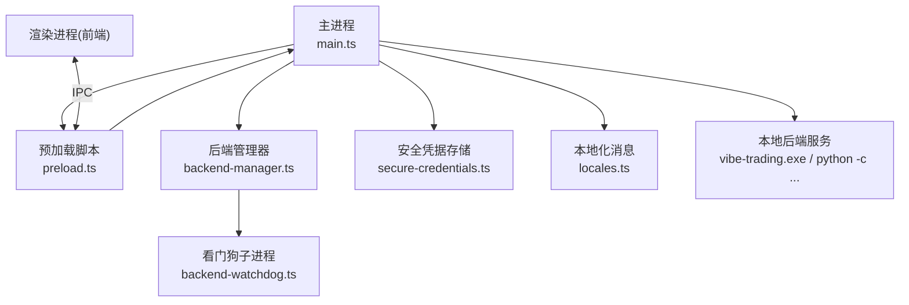
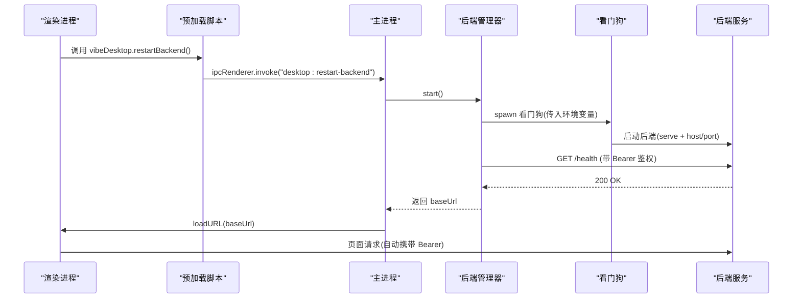
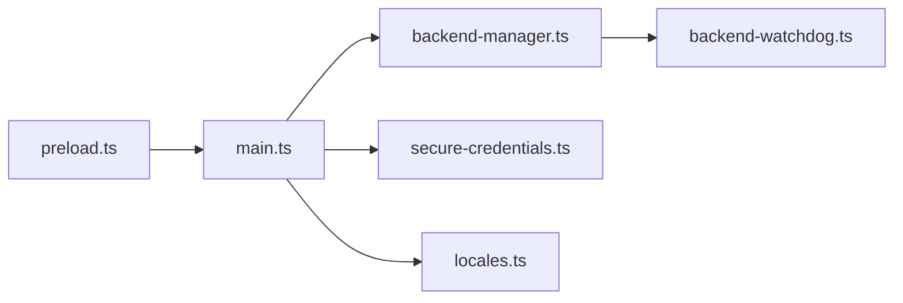

# Electron架构设计

<cite>
**本文引用的文件**
- [main.ts](file://desktop/electron/src/main.ts)
- [preload.ts](file://desktop/electron/src/preload.ts)
- [backend-manager.ts](file://desktop/electron/src/backend-manager.ts)
- [backend-watchdog.ts](file://desktop/electron/src/backend-watchdog.ts)
- [secure-credentials.ts](file://desktop/electron/src/secure-credentials.ts)
- [locales.ts](file://desktop/electron/src/locales.ts)
- [package.json](file://desktop/electron/package.json)
- [README.md](file://desktop/electron/README.md)
</cite>

## 目录
1. [简介](#简介)
2. [项目结构](#项目结构)
3. [核心组件](#核心组件)
4. [架构总览](#架构总览)
5. [详细组件分析](#详细组件分析)
6. [依赖关系分析](#依赖关系分析)
7. [性能考虑](#性能考虑)
8. [故障排查指南](#故障排查指南)
9. [结论](#结论)
10. [附录](#附录)

## 简介
本文件面向 Vibe-Trading 桌面应用的 Electron 层，系统性说明主进程与渲染进程的分离设计、IPC 通信机制、安全上下文隔离与预加载脚本的作用；阐述 BackendManager 如何管理后端服务生命周期，SecureCredentialStore 如何实现安全的凭据存储；并给出窗口创建、事件处理、权限控制与错误处理的具体实现路径。同时记录配置选项、参数与返回值，解释与后端服务的通信协议与安全机制，覆盖跨平台兼容性与性能优化策略。

## 项目结构
Electron 桌面壳位于 desktop/electron 目录，采用 TypeScript 编写，构建产物为 dist/*，入口 main 指向 dist/main.js。打包使用 electron-builder，支持多语言本地化与 Windows NSIS 安装器。

图表来源
- [main.ts:1-285](file://desktop/electron/src/main.ts#L1-L285)
- [preload.ts:1-18](file://desktop/electron/src/preload.ts#L1-L18)
- [backend-manager.ts:1-426](file://desktop/electron/src/backend-manager.ts#L1-L426)
- [backend-watchdog.ts:1-167](file://desktop/electron/src/backend-watchdog.ts#L1-L167)
- [secure-credentials.ts:1-240](file://desktop/electron/src/secure-credentials.ts#L1-L240)
- [locales.ts:1-279](file://desktop/electron/src/locales.ts#L1-L279)

章节来源
- [package.json:1-86](file://desktop/electron/package.json#L1-L86)
- [README.md:1-93](file://desktop/electron/README.md#L1-L93)

## 核心组件
- 主进程（main.ts）：负责应用生命周期、单实例锁、窗口创建、菜单、IPC 注册、后端启动与关闭、错误上报、本地化加载等。
- 预加载脚本（preload.ts）：通过 contextBridge 暴露最小 API 到渲染进程，屏蔽底层 IPC 细节。
- 后端管理器（backend-manager.ts）：解析可执行、分配端口、启动看门狗、健康检查、日志采集、优雅关闭与强制终止。
- 看门狗（backend-watchdog.ts）：独立子进程守护后端，监控父进程存活、转发输出、响应终止指令、清理进程树。
- 安全凭据存储（secure-credentials.ts）：基于 safeStorage 加密持久化受支持的密钥，提供迁移与环境注入能力。
- 本地化（locales.ts）：集中管理多语言消息与格式化模板。

章节来源
- [main.ts:1-285](file://desktop/electron/src/main.ts#L1-L285)
- [preload.ts:1-18](file://desktop/electron/src/preload.ts#L1-L18)
- [backend-manager.ts:1-426](file://desktop/electron/src/backend-manager.ts#L1-L426)
- [backend-watchdog.ts:1-167](file://desktop/electron/src/backend-watchdog.ts#L1-L167)
- [secure-credentials.ts:1-240](file://desktop/electron/src/secure-credentials.ts#L1-L240)
- [locales.ts:1-279](file://desktop/electron/src/locales.ts#L1-L279)

## 架构总览
Vibe-Trading Desktop 将 UI（渲染进程）与业务逻辑（Python 后端）解耦，通过主进程作为可信桥接层：
- 渲染进程仅通过预加载脚本暴露的受限 API 与主进程通信。
- 主进程负责启动本地后端服务，绑定 127.0.0.1 与随机端口，并通过 Bearer Token 鉴权。
- 所有对后端的 HTTP 请求由主进程在发送前自动注入 Authorization 头，渲染进程不持有密钥。
- 看门狗确保后端进程随主进程退出而清理，避免僵尸进程。

图表来源
- [main.ts:65-117](file://desktop/electron/src/main.ts#L65-L117)
- [main.ts:119-146](file://desktop/electron/src/main.ts#L119-L146)
- [main.ts:159-192](file://desktop/electron/src/main.ts#L159-L192)
- [backend-manager.ts:63-146](file://desktop/electron/src/backend-manager.ts#L63-L146)
- [backend-manager.ts:221-246](file://desktop/electron/src/backend-manager.ts#L221-L246)
- [backend-watchdog.ts:31-68](file://desktop/electron/src/backend-watchdog.ts#L31-L68)

## 详细组件分析

### 主进程（main.ts）
- 单实例锁：防止重复启动，重复实例聚焦已有窗口。
- 窗口创建：启用 contextIsolation、sandbox、禁用 nodeIntegration，设置 partition 隔离存储；默认隐藏菜单栏；仅在开发环境开启 DevTools。
- 权限控制：拒绝所有系统权限请求；限制导航至本地后端同源 URL；外部链接通过 shell.openExternal 打开。
- IPC 注册：
  - desktop:retry：重试启动后端。
  - desktop:open-logs：打开日志目录。
  - desktop:restart-backend：重启后端并返回布尔结果。
  - desktop:get-credential-status / desktop:set-credential：查询或设置受支持的凭据键。
- 启动流程：初始化本地化与凭据存储 -> 创建窗口 -> 显示加载页 -> 启动后端 -> 加载 UI。
- 错误处理：捕获未捕获异常并弹窗；启动失败时推送错误消息到渲染进程。

章节来源
- [main.ts:22-63](file://desktop/electron/src/main.ts#L22-L63)
- [main.ts:65-117](file://desktop/electron/src/main.ts#L65-L117)
- [main.ts:119-146](file://desktop/electron/src/main.ts#L119-L146)
- [main.ts:148-192](file://desktop/electron/src/main.ts#L148-L192)
- [main.ts:206-285](file://desktop/electron/src/main.ts#L206-L285)

### 预加载脚本（preload.ts）
- 通过 contextBridge.exposeInMainWorld 暴露 vibeDesktop 对象，包含：
  - isDesktop：标识当前运行于桌面环境。
  - onStatus/onError：订阅主进程推送的状态与错误消息。
  - retry/openLogs/restartBackend：触发主进程动作。
  - getCredentialStatus/setCredential：访问安全凭据存储状态与写入。
- 所有方法均通过 ipcRenderer 与主进程通信，渲染进程无法直接访问 Node/Electron API。

章节来源
- [preload.ts:1-18](file://desktop/electron/src/preload.ts#L1-L18)

### 后端管理器（backend-manager.ts）
职责：
- 解析后端可执行：优先环境变量覆盖，其次打包资源路径，再源码模式探测，最后 PATH 查找。
- 端口分配：绑定 127.0.0.1 的随机端口，避免冲突。
- 启动看门狗：以子进程方式运行 backend-watchdog，传递必要的环境变量（含 API_AUTH_KEY、凭据环境、工作目录、参数等）。
- 健康检查：轮询 /health，超时抛出错误并附带最近日志片段。
- 日志采集：捕获 stdout/stderr 并落盘到用户日志目录，保留最近若干行用于错误上下文。
- 优雅关闭：先 POST system/shutdown 并等待退出，必要时向看门狗发送 terminate-backend，最终按平台强制终止进程树。

关键类型与返回值：
- ResolvedBackend：{ executable, prefixArguments, includeServeCommand }
- BackendManager.start(): Promise<string> 返回 baseUrl
- BackendManager.stop(): Promise<void>
- BackendManager.url/processId：只读属性

章节来源
- [backend-manager.ts:16-41](file://desktop/electron/src/backend-manager.ts#L16-L41)
- [backend-manager.ts:52-146](file://desktop/electron/src/backend-manager.ts#L52-L146)
- [backend-manager.ts:148-195](file://desktop/electron/src/backend-manager.ts#L148-L195)
- [backend-manager.ts:221-264](file://desktop/electron/src/backend-manager.ts#L221-L264)
- [backend-manager.ts:270-371](file://desktop/electron/src/backend-manager.ts#L270-L371)
- [backend-manager.ts:373-426](file://desktop/electron/src/backend-manager.ts#L373-L426)

### 看门狗（backend-watchdog.ts）
职责：
- 从环境变量读取后端可执行、工作目录与参数，启动后端进程。
- 定期检测父进程（Electron 主进程）是否存活，若失联则终止后端。
- 监听后端进程事件：spawn、error、exit，并向主进程发送消息。
- 接收主进程 IPC 消息 terminate-backend，统一走终止流程。
- 跨平台清理：Windows 使用 taskkill /T /F，Unix 使用 SIGKILL。

章节来源
- [backend-watchdog.ts:1-167](file://desktop/electron/src/backend-watchdog.ts#L1-L167)

### 安全凭据存储（secure-credentials.ts）
职责：
- 初始化：校验 safeStorage 可用性，加载持久化文件，迁移旧格式（dotenv、JSON 字段）。
- 存储：仅允许白名单中的键名（如 OPENAI_API_KEY、GEMINI_API_KEY 等），值经 safeStorage.encryptString 加密并以 base64 持久化。
- 读取：environment() 解密并生成进程级环境变量供后端使用。
- 迁移：将 .env 与 qveris.json 中的敏感字段迁移至安全存储，并在原文件中注释或删除。
- 原子写入：临时文件 + rename 保证一致性。

数据类型：
- CredentialStatus：{ available, configured, migrated }
- SecureCredentialStoreOptions：userDataDirectory、homeDirectory、messages

章节来源
- [secure-credentials.ts:7-67](file://desktop/electron/src/secure-credentials.ts#L7-L67)
- [secure-credentials.ts:69-138](file://desktop/electron/src/secure-credentials.ts#L69-L138)
- [secure-credentials.ts:140-221](file://desktop/electron/src/secure-credentials.ts#L140-L221)
- [secure-credentials.ts:223-240](file://desktop/electron/src/secure-credentials.ts#L223-L240)

### 本地化（locales.ts）
- 支持 en、zh-CN、ja、ko、ar，自动识别 zh/hans 变体。
- 提供 getDesktopMessages、getRendererLocale、formatDesktopMessage 工具。
- 渲染端加载页通过 query locale 获取本地化消息，阿拉伯语自动切换 RTL。

章节来源
- [locales.ts:1-51](file://desktop/electron/src/locales.ts#L1-L51)
- [locales.ts:61-237](file://desktop/electron/src/locales.ts#L61-L237)
- [locales.ts:239-279](file://desktop/electron/src/locales.ts#L239-L279)

## 依赖关系分析
- main.ts 依赖：BackendManager、SecureCredentialStore、locales。
- backend-manager.ts 依赖：child_process、fs、net、path、locales。
- backend-watchdog.ts 依赖：child_process（无其他模块）。
- secure-credentials.ts 依赖：electron.safeStorage、node:fs、os、path、locales。
- preload.ts 依赖：electron.contextBridge、electron.ipcRenderer。

图表来源
- [main.ts:1-21](file://desktop/electron/src/main.ts#L1-L21)
- [backend-manager.ts:1-15](file://desktop/electron/src/backend-manager.ts#L1-L15)
- [backend-watchdog.ts:1-12](file://desktop/electron/src/backend-watchdog.ts#L1-L12)
- [secure-credentials.ts:1-5](file://desktop/electron/src/secure-credentials.ts#L1-L5)
- [preload.ts:1-2](file://desktop/electron/src/preload.ts#L1-L2)

章节来源
- [main.ts:1-21](file://desktop/electron/src/main.ts#L1-L21)
- [backend-manager.ts:1-15](file://desktop/electron/src/backend-manager.ts#L1-L15)
- [backend-watchdog.ts:1-12](file://desktop/electron/src/backend-watchdog.ts#L1-L12)
- [secure-credentials.ts:1-5](file://desktop/electron/src/secure-credentials.ts#L1-L5)
- [preload.ts:1-2](file://desktop/electron/src/preload.ts#L1-L2)

## 性能考虑
- 端口与健康检查：使用 127.0.0.1 绑定与随机端口减少冲突；健康检查间隔短、超时合理，避免阻塞 UI。
- 日志写入：异步追加写，限制最近输出行数，降低 I/O 压力。
- 子进程隔离：看门狗与后端进程独立，崩溃不影响主进程稳定性。
- 资源路径：打包后 __dirname 在 ASAR 内，通过 resourcesPath 设置 cwd 避免 Windows 路径问题。
- 权限最小化：渲染进程禁用 Node 集成与系统权限，减少攻击面与开销。

[本节为通用指导，无需具体文件引用]

## 故障排查指南
常见错误与定位：
- 后端未找到：检查 VIBE_TRADING_EXECUTABLE 或打包资源路径是否正确。
- 端口不可用：确认本机未被占用，或尝试重启。
- 健康检查超时：查看最近日志片段，确认后端是否正常启动。
- 凭据加密不可用：Windows 用户会话不支持 safeStorage 时，需调整环境或账户权限。
- 意外退出：根据退出码与信号定位后端崩溃原因。

操作建议：
- 使用“打开日志文件夹”快速定位日志。
- 使用“重启本地服务”触发重新引导流程。
- 在开发模式下启用开发者工具辅助调试。

章节来源
- [main.ts:119-146](file://desktop/electron/src/main.ts#L119-L146)
- [main.ts:206-285](file://desktop/electron/src/main.ts#L206-L285)
- [backend-manager.ts:221-246](file://desktop/electron/src/backend-manager.ts#L221-L246)
- [secure-credentials.ts:85-89](file://desktop/electron/src/secure-credentials.ts#L85-L89)

## 结论
该 Electron 架构通过严格的主/渲染进程隔离、最小化的预加载 API、安全的凭据存储与健壮的看门狗机制，实现了本地后端服务的可靠管理与安全通信。主进程集中处理生命周期、权限与 IPC，渲染进程专注 UI 交互，后端服务通过本地回环与 Bearer Token 保护。整体设计兼顾安全性、可维护性与跨平台兼容性。

[本节为总结性内容，无需具体文件引用]

## 附录

### 配置选项与参数
- 主进程窗口 webPreferences：
  - preload：预加载脚本路径
  - contextIsolation：true
  - nodeIntegration：false
  - sandbox：true
  - devTools：非打包模式启用
  - partition：persist:vibe-trading-desktop
- 后端管理器选项：
  - appPath、resourcesPath、allowSourceDiscovery、logDirectory、apiAuthKey、messages、credentialEnvironment、onStatus、onUnexpectedExit
- 看门狗环境变量：
  - VIBE_TRADING_DESKTOP_PARENT_PID、VIBE_TRADING_DESKTOP_BACKEND_EXECUTABLE、VIBE_TRADING_DESKTOP_BACKEND_ARGUMENTS、VIBE_TRADING_DESKTOP_BACKEND_CWD
- 安全凭据存储：
  - userDataDirectory、homeDirectory、messages
  - 支持的键：OPENROUTER_API_KEY、REQUESTY_API_KEY、OPENAI_API_KEY、ANTHROPIC_API_KEY、DEEPSEEK_API_KEY、SILICONFLOW_API_KEY、SILICONFLOW_GLOBAL_API_KEY、NVIDIA_API_KEY、GEMINI_API_KEY、GROQ_API_KEY、DASHSCOPE_API_KEY、ZHIPU_API_KEY、MOONSHOT_API_KEY、KIMI_CODING_API_KEY、MINIMAX_API_KEY、MIMO_API_KEY、MODELSCOPE_API_KEY、SPARK_API_KEY、ZAI_API_KEY、TUSHARE_TOKEN、QVERIS_API_KEY

章节来源
- [main.ts:65-84](file://desktop/electron/src/main.ts#L65-L84)
- [backend-manager.ts:16-41](file://desktop/electron/src/backend-manager.ts#L16-L41)
- [backend-watchdog.ts:7-12](file://desktop/electron/src/backend-watchdog.ts#L7-L12)
- [secure-credentials.ts:12-34](file://desktop/electron/src/secure-credentials.ts#L12-L34)
- [secure-credentials.ts:52-61](file://desktop/electron/src/secure-credentials.ts#L52-L61)

### IPC 接口定义
- 渲染进程调用（invoke）：
  - desktop:restart-backend -> boolean
  - desktop:get-credential-status -> CredentialStatus
  - desktop:set-credential(name: string, value: string | null) -> CredentialStatus
- 渲染进程调用（send）：
  - desktop:retry
  - desktop:open-logs
- 主进程推送（事件）：
  - desktop:status(message: string)
  - desktop:error(message: string)

章节来源
- [preload.ts:3-17](file://desktop/electron/src/preload.ts#L3-L17)
- [main.ts:119-146](file://desktop/electron/src/main.ts#L119-L146)

### 与后端服务的通信协议与安全机制
- 地址与端口：127.0.0.1 + 随机端口，仅本地可达。
- 鉴权：每个主进程生成 256-bit 随机密钥，作为 Bearer Token；主进程在发送请求前自动注入 Authorization 头。
- 健康检查：GET /health，成功后加载 UI。
- 优雅关闭：POST system/shutdown，超时或失败则通过看门狗终止进程树。

章节来源
- [main.ts:28-29](file://desktop/electron/src/main.ts#L28-L29)
- [main.ts:88-98](file://desktop/electron/src/main.ts#L88-L98)
- [backend-manager.ts:77-91](file://desktop/electron/src/backend-manager.ts#L77-L91)
- [backend-manager.ts:148-187](file://desktop/electron/src/backend-manager.ts#L148-L187)
- [backend-manager.ts:221-246](file://desktop/electron/src/backend-manager.ts#L221-L246)

### 跨平台兼容性
- Windows：taskkill 终止进程树；NSIS 安装器；ASAR 路径处理。
- macOS/Linux：SIGKILL 终止进程树；原生主题与菜单行为差异。
- 本地化：支持多种语言与 RTL 布局。

章节来源
- [backend-manager.ts:404-421](file://desktop/electron/src/backend-manager.ts#L404-L421)
- [backend-watchdog.ts:103-117](file://desktop/electron/src/backend-watchdog.ts#L103-L117)
- [locales.ts:53-59](file://desktop/electron/src/locales.ts#L53-L59)
- [package.json:30-84](file://desktop/electron/package.json#L30-L84)

### 窗口创建与事件处理示例路径
- 窗口创建与权限控制：[main.ts:65-117](file://desktop/electron/src/main.ts#L65-L117)
- IPC 注册与处理：[main.ts:119-146](file://desktop/electron/src/main.ts#L119-L146)
- 启动流程与错误上报：[main.ts:148-192](file://desktop/electron/src/main.ts#L148-L192)
- 菜单与视图控制：[main.ts:212-238](file://desktop/electron/src/main.ts#L212-L238)

### 错误处理机制
- 未捕获异常：弹窗展示堆栈或消息。
- 启动失败：推送错误消息到渲染进程，显示加载页并提供重试与日志入口。
- 后端异常退出：记录退出码/信号，提示用户并附带最近日志。

章节来源
- [main.ts:278-285](file://desktop/electron/src/main.ts#L278-L285)
- [main.ts:206-210](file://desktop/electron/src/main.ts#L206-L210)
- [backend-manager.ts:131-145](file://desktop/electron/src/backend-manager.ts#L131-L145)
- [backend-manager.ts:221-246](file://desktop/electron/src/backend-manager.ts#L221-L246)