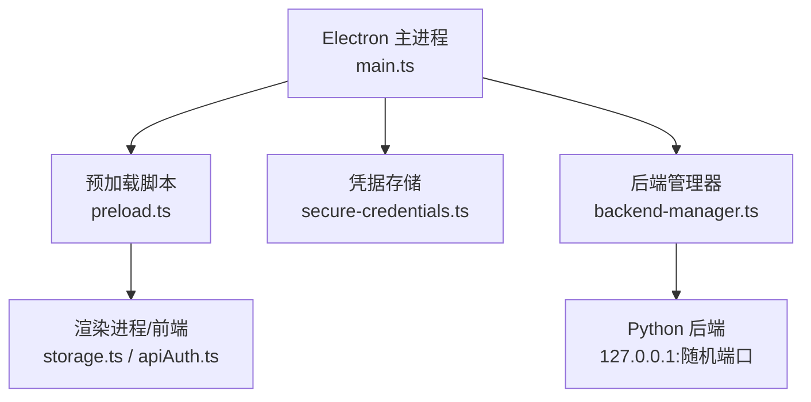
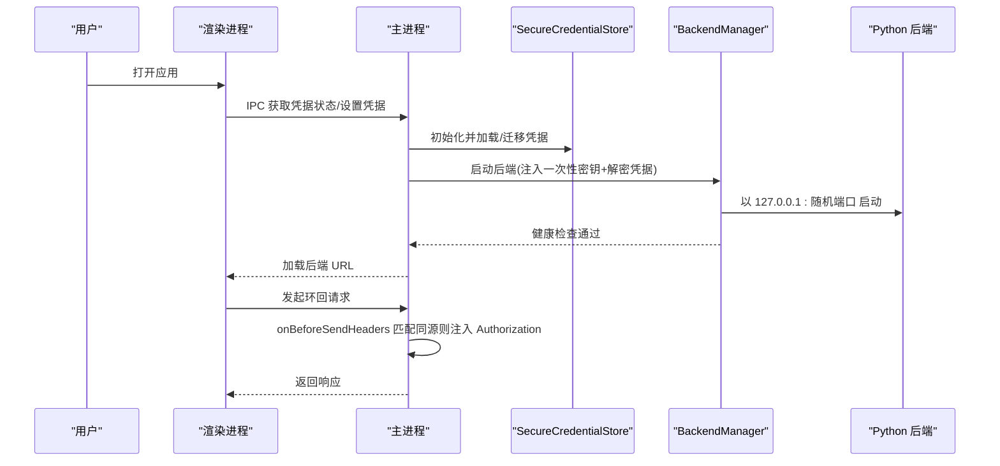
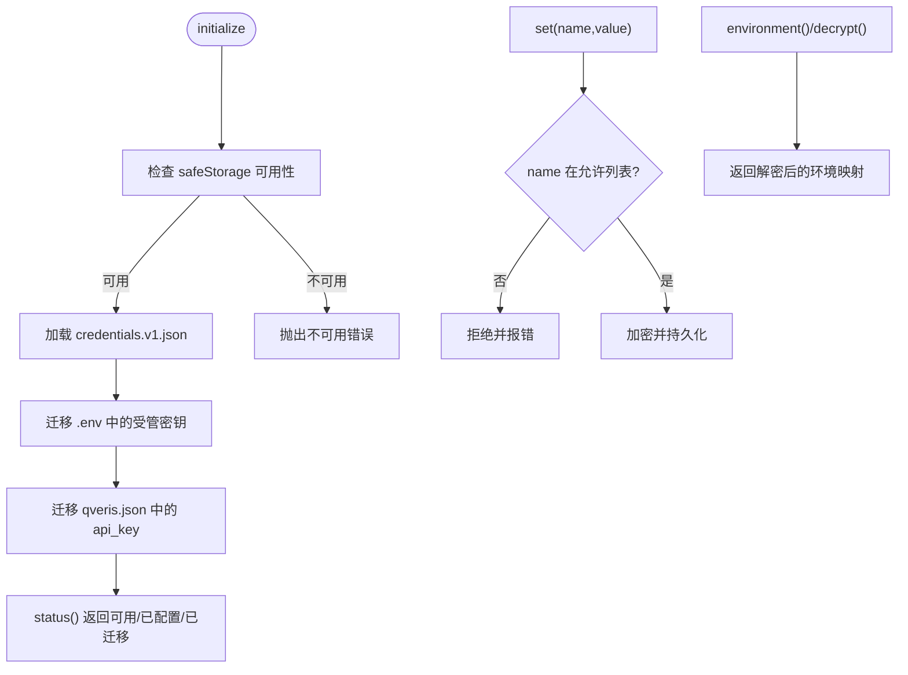
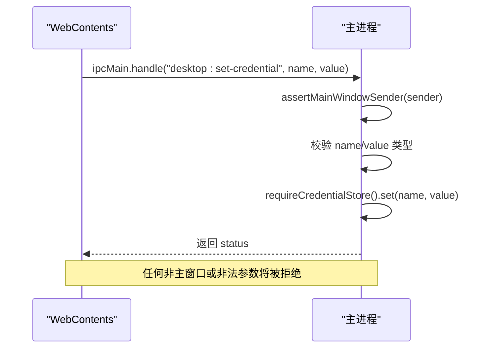
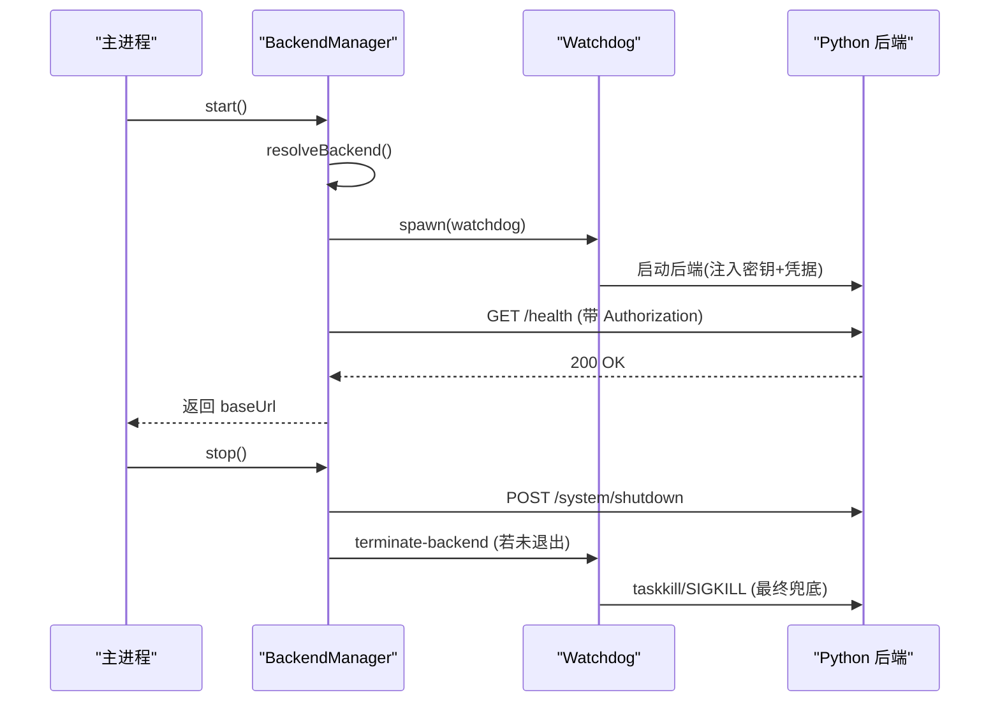
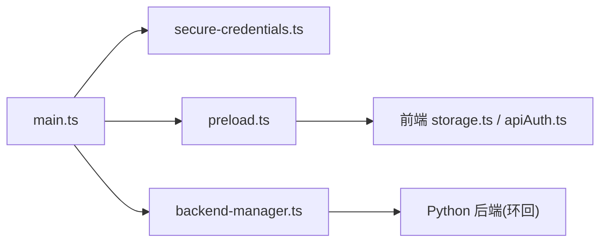

# 安全实现

<cite>
**本文引用的文件**
- [secure-credentials.ts](file://desktop/electron/src/secure-credentials.ts)
- [main.ts](file://desktop/electron/src/main.ts)
- [preload.ts](file://desktop/electron/src/preload.ts)
- [backend-manager.ts](file://desktop/electron/src/backend-manager.ts)
- [THREAT_MODEL.md](file://desktop/electron/THREAT_MODEL.md)
- [storage.ts](file://frontend/src/lib/storage.ts)
- [apiAuth.ts](file://frontend/src/lib/apiAuth.ts)
- [test_mcp_oauth_schema.py](file://agent/tests/test_mcp_oauth_schema.py)
- [test_openbb_bridge/test_cors_opt_in.py](file://agent/tests/test_openbb_bridge/test_cors_opt_in.py)
- [loader.py](file://agent/src/config/loader.py)
</cite>

## 目录
1. [简介](#简介)
2. [项目结构](#项目结构)
3. [核心组件](#核心组件)
4. [架构总览](#架构总览)
5. [详细组件分析](#详细组件分析)
6. [依赖关系分析](#依赖关系分析)
7. [性能与安全权衡](#性能与安全权衡)
8. [故障排查指南](#故障排查指南)
9. [结论](#结论)
10. [附录：关键流程与示例路径](#附录关键流程与示例路径)

## 简介
本文件聚焦 Vibe-Trading 桌面应用的安全实现，围绕以下目标展开：
- SecureCredentialStore 的加密存储机制、API 密钥管理与访问控制策略
- 主进程安全边界、IPC 消息验证与外部 URL 过滤
- 威胁模型中的风险与缓解措施
- 凭据加密、会话管理、权限检查的实际代码路径
- 跨域请求控制、沙箱环境与资源访问限制
- 输入验证、输出编码、本地数据存储安全、内存清理与资源释放

## 项目结构
桌面端安全相关的关键位置：
- Electron 主进程：负责窗口创建、IPC 路由、后端生命周期、网络请求头注入、外部链接放行
- 预加载脚本：向渲染进程暴露最小能力集（状态订阅、错误事件、重试、日志、重启后端、凭据写入）
- 凭据存储：基于 Electron safeStorage 的加密持久化，支持从 .env 与 JSON 配置迁移
- 后端管理器：启动受控 Python 后端、注入一次性 API 密钥与解密后的凭据、健康检查、优雅关闭
- 前端：安全的 localStorage 封装与 API 认证头注入

**图示来源**
- [main.ts:65-117](file://desktop/electron/src/main.ts#L65-L117)
- [preload.ts:1-18](file://desktop/electron/src/preload.ts#L1-L18)
- [secure-credentials.ts:69-165](file://desktop/electron/src/secure-credentials.ts#L69-L165)
- [backend-manager.ts:63-145](file://desktop/electron/src/backend-manager.ts#L63-L145)

**章节来源**
- [main.ts:65-117](file://desktop/electron/src/main.ts#L65-L117)
- [preload.ts:1-18](file://desktop/electron/src/preload.ts#L1-L18)
- [secure-credentials.ts:69-165](file://desktop/electron/src/secure-credentials.ts#L69-L165)
- [backend-manager.ts:63-145](file://desktop/electron/src/backend-manager.ts#L63-L145)

## 核心组件
- SecureCredentialStore：维护允许列表内的凭据键，使用 safeStorage 加密/解密，持久化为 Base64 密文 JSON；提供环境导出用于注入子进程。
- 主进程安全边界：仅对当前后端同源请求自动附加 Authorization 头；拦截新窗口打开并仅放行 http/https；限制页面导航到当前后端源。
- IPC 白名单与校验：所有敏感操作均通过 preload 暴露的最小 API，主进程严格校验发送者为主窗口 WebContents，并对参数类型进行强校验。
- 后端生命周期：每次启动生成一次性 API_AUTH_KEY，绑定 127.0.0.1 随机端口，注入环境变量后由 watchdog 守护，健康检查通过后才加载 UI。
- 前端安全存储：safeGet/safeSet/safeRemove 包装 localStorage，避免受限环境下崩溃；authHeaders 将令牌注入后续请求头。

**章节来源**
- [secure-credentials.ts:12-34](file://desktop/electron/src/secure-credentials.ts#L12-L34)
- [secure-credentials.ts:69-165](file://desktop/electron/src/secure-credentials.ts#L69-L165)
- [main.ts:28-28](file://desktop/electron/src/main.ts#L28-L28)
- [main.ts:85-116](file://desktop/electron/src/main.ts#L85-L116)
- [main.ts:119-145](file://desktop/electron/src/main.ts#L119-L145)
- [backend-manager.ts:63-145](file://desktop/electron/src/backend-manager.ts#L63-L145)
- [storage.ts:1-29](file://frontend/src/lib/storage.ts#L1-L29)
- [apiAuth.ts:1-21](file://frontend/src/lib/apiAuth.ts#L1-L21)

## 架构总览
下图展示了桌面端安全边界与数据流：主进程持有一次性密钥与加密凭据，仅对同源环回请求注入鉴权；渲染进程在沙箱中运行，无法直接读取密钥；后端仅在本地环回监听并通过健康检查确认可用。

**图示来源**
- [main.ts:85-116](file://desktop/electron/src/main.ts#L85-L116)
- [main.ts:119-145](file://desktop/electron/src/main.ts#L119-L145)
- [backend-manager.ts:63-145](file://desktop/electron/src/backend-manager.ts#L63-L145)
- [secure-credentials.ts:85-124](file://desktop/electron/src/secure-credentials.ts#L85-L124)

## 详细组件分析

### SecureCredentialStore 加密存储与访问控制
- 允许列表：仅允许一组明确的凭据键名，防止任意键写入或泄露。
- 加密存储：使用 Electron safeStorage 加密字符串并以 Base64 持久化；读取时再解密。
- 迁移机制：首次启动扫描 ~/.vibe-trading/.env 与 qveris.json，将符合条件的明文值迁移至加密存储，并注释或删除原明文字段。
- 原子写入：临时文件 + rename 保证幂等与一致性；文件权限设置为 0o600。
- 环境导出：environment() 仅返回已配置的解密值，供后端子进程继承。

**图示来源**
- [secure-credentials.ts:85-165](file://desktop/electron/src/secure-credentials.ts#L85-L165)
- [secure-credentials.ts:167-220](file://desktop/electron/src/secure-credentials.ts#L167-L220)
- [secure-credentials.ts:126-138](file://desktop/electron/src/secure-credentials.ts#L126-L138)

**章节来源**
- [secure-credentials.ts:12-34](file://desktop/electron/src/secure-credentials.ts#L12-L34)
- [secure-credentials.ts:69-165](file://desktop/electron/src/secure-credentials.ts#L69-L165)
- [secure-credentials.ts:167-220](file://desktop/electron/src/secure-credentials.ts#L167-L220)

### 主进程安全边界、IPC 验证与外部 URL 过滤
- 窗口沙箱：禁用 Node 集成、启用上下文隔离与沙箱；使用独立 partition 隔离存储与会话。
- 权限默认拒绝：浏览器权限检查与请求一律拒绝。
- 同源鉴权注入：仅当请求 origin 与当前后端 origin 完全一致时才注入 Authorization 头。
- 外部链接放行：新窗口打开被拒绝，但 http/https 会交由系统浏览器打开。
- 页面导航限制：仅允许在当前后端同源内导航，否则阻止并在必要时转系统浏览器。
- IPC 白名单：仅暴露必要方法；所有处理前断言 sender 为主窗口 WebContents；参数类型严格校验。

**图示来源**
- [main.ts:119-145](file://desktop/electron/src/main.ts#L119-L145)
- [main.ts:240-247](file://desktop/electron/src/main.ts#L240-L247)

**章节来源**
- [main.ts:65-117](file://desktop/electron/src/main.ts#L65-L117)
- [main.ts:119-145](file://desktop/electron/src/main.ts#L119-L145)
- [main.ts:240-247](file://desktop/electron/src/main.ts#L240-L247)

### 后端生命周期与进程边界
- 可执行解析：优先使用显式覆盖，其次按可信根目录查找，最后 PATH 兜底；开发模式需标记项目根。
- 环回绑定：强制 --host 127.0.0.1 与随机端口，避免暴露到其他接口。
- 一次性密钥：每次启动生成随机 API_AUTH_KEY，仅存在于主进程与子进程环境，不写盘。
- 健康检查：轮询 /health，超时失败则报告最近日志片段。
- 优雅关闭：先调用 /system/shutdown，再尝试通过 watchdog 终止，最终 fallback 到进程树终止。

**图示来源**
- [backend-manager.ts:63-145](file://desktop/electron/src/backend-manager.ts#L63-L145)
- [backend-manager.ts:148-187](file://desktop/electron/src/backend-manager.ts#L148-L187)
- [backend-manager.ts:221-246](file://desktop/electron/src/backend-manager.ts#L221-L246)
- [backend-manager.ts:270-371](file://desktop/electron/src/backend-manager.ts#L270-L371)

**章节来源**
- [backend-manager.ts:63-145](file://desktop/electron/src/backend-manager.ts#L63-L145)
- [backend-manager.ts:148-187](file://desktop/electron/src/backend-manager.ts#L148-L187)
- [backend-manager.ts:221-246](file://desktop/electron/src/backend-manager.ts#L221-L246)
- [backend-manager.ts:270-371](file://desktop/electron/src/backend-manager.ts#L270-L371)

### 前端凭据与存储安全
- 安全存储封装：safeGet/safeSet/safeRemove 捕获异常，避免受限环境导致白屏。
- 认证头注入：get/set 本地存储的 API 密钥，并在请求时统一添加 Authorization 头。
- 注意：该前端密钥为 Web UI 与后端交互的本地令牌，不同于主进程的一次性 API_AUTH_KEY。

**章节来源**
- [storage.ts:1-29](file://frontend/src/lib/storage.ts#L1-L29)
- [apiAuth.ts:1-21](file://frontend/src/lib/apiAuth.ts#L1-L21)

### 跨域请求控制与沙箱
- CORS 扩展：默认信任环回与内置 Web UI 源；可通过环境变量追加额外可信源，且不允许带凭证的通配符。
- 渲染进程沙箱：contextIsolation、sandbox、nodeIntegration=false，权限默认拒绝。
- 会话隔离：使用独立 partition 避免与全局浏览器状态共享。

**章节来源**
- [test_openbb_bridge/test_cors_opt_in.py:1-51](file://agent/tests/test_openbb_bridge/test_cors_opt_in.py#L1-L51)
- [main.ts:65-88](file://desktop/electron/src/main.ts#L65-L88)

### 输入验证与输出编码
- IPC 参数校验：名称必须为字符串，值可为字符串或 null；其他类型立即拒绝。
- 凭据键白名单：不在允许列表的键直接拒绝。
- 外部 URL 过滤：仅允许 http/https；其他协议一律拒绝。
- 输出编码：日志与错误信息统一格式化，避免原始对象泄漏。

**章节来源**
- [main.ts:137-145](file://desktop/electron/src/main.ts#L137-L145)
- [secure-credentials.ts:134-138](file://desktop/electron/src/secure-credentials.ts#L134-L138)
- [main.ts:257-272](file://desktop/electron/src/main.ts#L257-L272)

### 会话管理与权限检查
- MCP OAuth 配置校验：强制 https、禁止同时设置静态头与 OAuth、stdio 模式不接受 auth。
- 工具授权：通过 Grounding Ledger 对工具调用进行身份与范围校验，防止越权访问。
- 会话覆盖清洗：禁止 API 调用者注入 mcpServers/mcp_servers 等高风险键，除非显式开启。

**章节来源**
- [test_mcp_oauth_schema.py:138-229](file://agent/tests/test_mcp_oauth_schema.py#L138-L229)
- [loader.py:102-117](file://agent/src/config/loader.py#L102-L117)

## 依赖关系分析
- 主进程依赖 secure-credentials 提供凭据环境，依赖 backend-manager 管理后端生命周期。
- 预加载脚本仅暴露最小 IPC 能力，避免渲染进程直接访问主进程 API。
- 前端通过 storage 与 apiAuth 管理本地令牌与请求头。
- 后端通过环境变量接收一次性密钥与解密凭据，仅监听环回地址。

**图示来源**
- [main.ts:20-21](file://desktop/electron/src/main.ts#L20-L21)
- [main.ts:65-117](file://desktop/electron/src/main.ts#L65-L117)
- [backend-manager.ts:63-145](file://desktop/electron/src/backend-manager.ts#L63-L145)
- [preload.ts:1-18](file://desktop/electron/src/preload.ts#L1-L18)

**章节来源**
- [main.ts:20-21](file://desktop/electron/src/main.ts#L20-L21)
- [main.ts:65-117](file://desktop/electron/src/main.ts#L65-L117)
- [backend-manager.ts:63-145](file://desktop/electron/src/backend-manager.ts#L63-L145)
- [preload.ts:1-18](file://desktop/electron/src/preload.ts#L1-L18)

## 性能与安全权衡
- 健康检查轮询：短间隔轮询 /health 提升启动体验，但需设置合理超时与退避，避免阻塞 UI。
- 凭据迁移：首次启动扫描 .env 与 JSON 可能带来 I/O 开销，应仅在 initialize 阶段执行一次。
- 原子写入：临时文件 + rename 增加一次磁盘操作，但显著提升可靠性与安全性。
- 同源注入：onBeforeSendHeaders 对所有环回请求生效，建议尽量缩小匹配范围以减少开销。

[本节为通用指导，不直接分析具体文件]

## 故障排查指南
- 凭据加密不可用：检查 safeStorage 是否可用；若不可用，initialize 会抛出错误。
- 后端未启动或早退：查看最近日志片段，确认 /health 是否成功；必要时重启后端。
- IPC 被拒绝：确认发送者是否为主窗口 WebContents；检查参数类型是否符合预期。
- 外部链接被拦截：确保 URL 为 http/https；其他协议会被拒绝。
- 跨域问题：检查是否配置了额外的可信源；避免带凭证的通配符。

**章节来源**
- [secure-credentials.ts:85-88](file://desktop/electron/src/secure-credentials.ts#L85-L88)
- [backend-manager.ts:221-246](file://desktop/electron/src/backend-manager.ts#L221-L246)
- [main.ts:119-145](file://desktop/electron/src/main.ts#L119-L145)
- [main.ts:257-272](file://desktop/electron/src/main.ts#L257-L272)
- [test_openbb_bridge/test_cors_opt_in.py:1-51](file://agent/tests/test_openbb_bridge/test_cors_opt_in.py#L1-L51)

## 结论
Vibe-Trading 桌面端通过多层安全边界保障凭据与运行时安全：
- 凭据加密与迁移：集中化、白名单化、原子化持久化，避免明文残留
- 主进程边界：同源鉴权注入、外部链接过滤、IPC 白名单与强校验
- 后端生命周期：环回绑定、一次性密钥、健康检查与优雅关闭
- 前端安全：受限存储封装与认证头注入
- 跨域与沙箱：默认拒绝权限、独立分区、CORS 可控扩展
这些措施共同降低了凭据泄露、越权访问与恶意导航等风险。

[本节为总结，不直接分析具体文件]

## 附录：关键流程与示例路径
- 凭据加密与迁移
  - 初始化与迁移：[secure-credentials.ts:85-96](file://desktop/electron/src/secure-credentials.ts#L85-L96)
  - 迁移 .env：[secure-credentials.ts:167-197](file://desktop/electron/src/secure-credentials.ts#L167-L197)
  - 迁移 JSON 字段：[secure-credentials.ts:199-220](file://desktop/electron/src/secure-credentials.ts#L199-L220)
- 主进程 IPC 与 URL 过滤
  - IPC 注册与校验：[main.ts:119-145](file://desktop/electron/src/main.ts#L119-L145)
  - 同源鉴权注入：[main.ts:85-98](file://desktop/electron/src/main.ts#L85-L98)
  - 外部链接放行：[main.ts:107-116](file://desktop/electron/src/main.ts#L107-L116)
- 后端生命周期
  - 启动与健康检查：[backend-manager.ts:63-145](file://desktop/electron/src/backend-manager.ts#L63-L145)
  - 优雅关闭：[backend-manager.ts:148-187](file://desktop/electron/src/backend-manager.ts#L148-L187)
  - 可执行解析：[backend-manager.ts:270-371](file://desktop/electron/src/backend-manager.ts#L270-L371)
- 前端存储与认证
  - 安全存储封装：[storage.ts:1-29](file://frontend/src/lib/storage.ts#L1-L29)
  - 认证头注入：[apiAuth.ts:1-21](file://frontend/src/lib/apiAuth.ts#L1-L21)
- 跨域与沙箱
  - CORS 扩展测试：[test_openbb_bridge/test_cors_opt_in.py:1-51](file://agent/tests/test_openbb_bridge/test_cors_opt_in.py#L1-L51)
  - 渲染进程沙箱配置：[main.ts:65-88](file://desktop/electron/src/main.ts#L65-L88)
- 输入验证与权限检查
  - MCP OAuth 校验：[test_mcp_oauth_schema.py:138-229](file://agent/tests/test_mcp_oauth_schema.py#L138-L229)
  - 会话覆盖清洗：[loader.py:102-117](file://agent/src/config/loader.py#L102-L117)