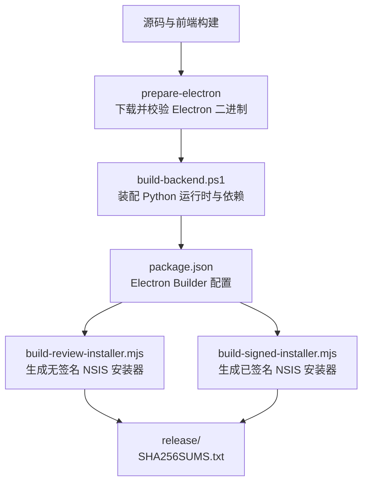
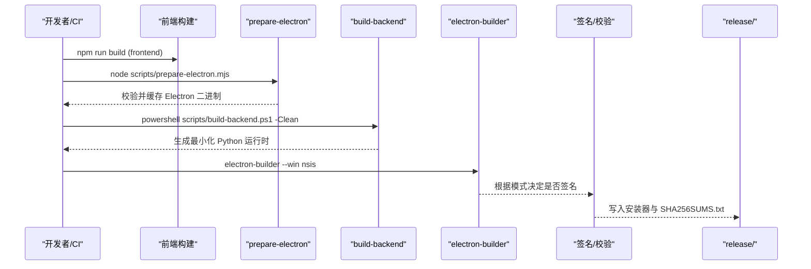
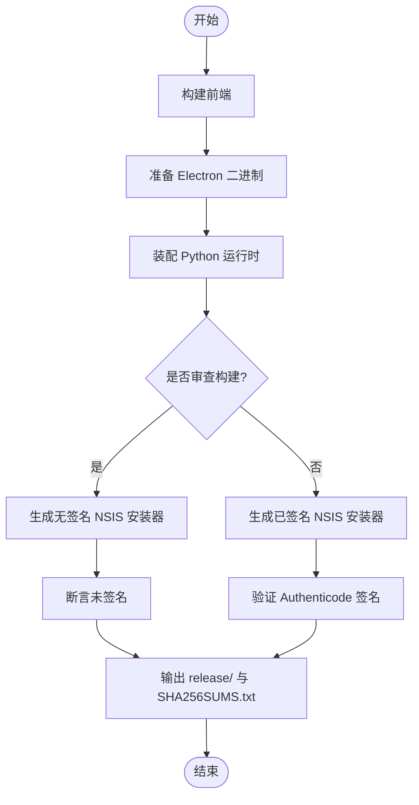
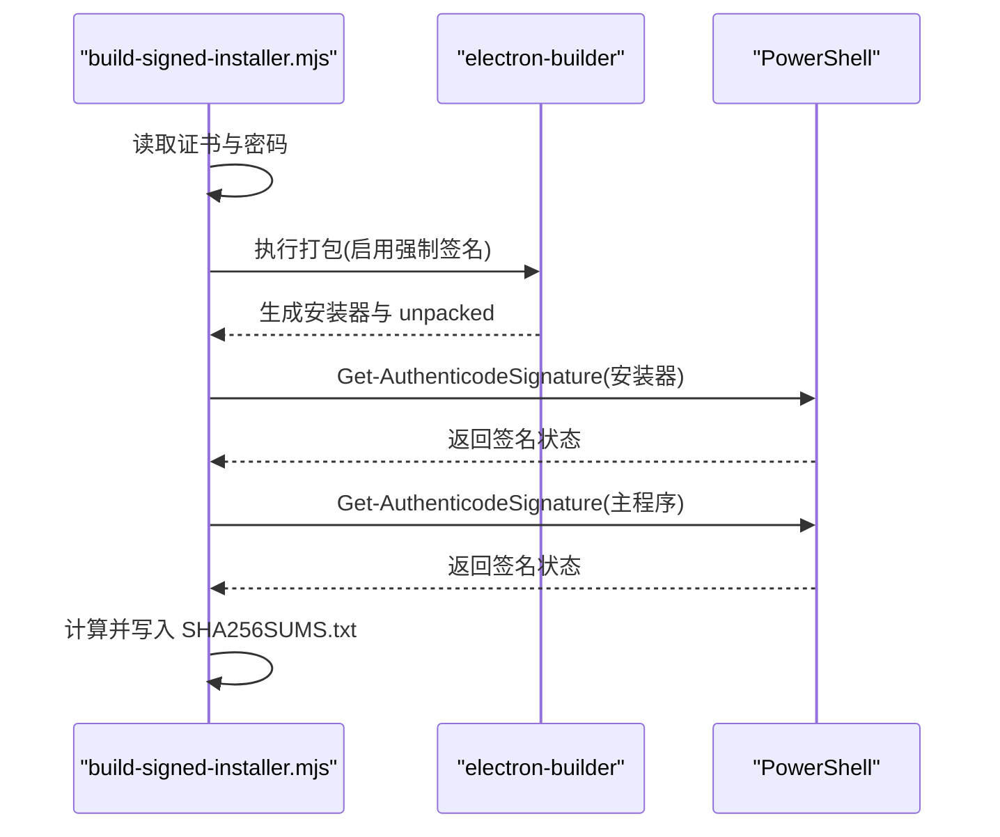
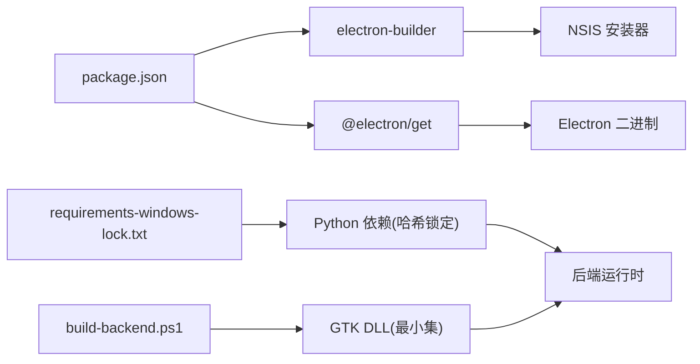

# 构建与打包

<cite>
**本文引用的文件**
- [desktop/electron/scripts/build-signed-installer.mjs](file://desktop/electron/scripts/build-signed-installer.mjs)
- [desktop/electron/scripts/build-review-installer.mjs](file://desktop/electron/scripts/build-review-installer.mjs)
- [desktop/electron/package.json](file://desktop/electron/package.json)
- [desktop/electron/README.md](file://desktop/electron/README.md)
- [desktop/electron/WINDOWS_PACKAGING.md](file://desktop/electron/WINDOWS_PACKAGING.md)
- [desktop/electron/scripts/prepare-electron.mjs](file://desktop/electron/scripts/prepare-electron.mjs)
- [desktop/electron/scripts/copy-static.mjs](file://desktop/electron/scripts/copy-static.mjs)
- [desktop/electron/scripts/build-backend.ps1](file://desktop/electron/scripts/build-backend.ps1)
- [.github/workflows/desktop-windows.yml](file://.github/workflows/desktop-windows.yml)
</cite>

## 目录
1. [简介](#简介)
2. [项目结构](#项目结构)
3. [核心组件](#核心组件)
4. [架构总览](#架构总览)
5. [详细组件分析](#详细组件分析)
6. [依赖分析](#依赖分析)
7. [性能考虑](#性能考虑)
8. [故障排查指南](#故障排查指南)
9. [结论](#结论)
10. [附录](#附录)

## 简介
本文件面向 Vibe-Trading 桌面应用的构建与打包系统，重点说明多阶段构建流程、代码签名与安全验证、安装包生成与分发策略，以及自动更新机制的现状与配置方法。文档基于仓库中的实际脚本与配置，提供可操作的命令与环境变量示例，并给出常见问题定位与调试技巧。

## 项目结构
桌面端 Electron 应用位于 desktop/electron，包含：
- 构建与打包脚本（Node.js）：负责 Electron 资源准备、NSIS 安装器构建、签名校验与产物校验。
- 后端运行时装配脚本（PowerShell）：下载并校验 Python 嵌入版、安装锁定依赖、拷贝前端产物与必要 DLL，生成最小化运行环境。
- package.json：定义 Electron Builder 配置、平台目标、产物命名、语言包与额外资源等。
- CI 工作流：在 Windows 环境中执行完整构建与冒烟测试，产出无签名的审查用安装包。

图表来源
- [desktop/electron/scripts/prepare-electron.mjs:1-75](file://desktop/electron/scripts/prepare-electron.mjs#L1-L75)
- [desktop/electron/scripts/build-backend.ps1:1-320](file://desktop/electron/scripts/build-backend.ps1#L1-L320)
- [desktop/electron/package.json:1-86](file://desktop/electron/package.json#L1-L86)
- [desktop/electron/scripts/build-review-installer.mjs:1-143](file://desktop/electron/scripts/build-review-installer.mjs#L1-L143)
- [desktop/electron/scripts/build-signed-installer.mjs:1-154](file://desktop/electron/scripts/build-signed-installer.mjs#L1-L154)

章节来源
- [desktop/electron/README.md:1-93](file://desktop/electron/README.md#L1-L93)
- [desktop/electron/WINDOWS_PACKAGING.md:1-153](file://desktop/electron/WINDOWS_PACKAGING.md#L1-L153)

## 核心组件
- prepare-electron.mjs：下载指定版本的 Electron 二进制，按 checksums.json 校验 SHA-256，缓存至 .cache/electron-dist，供 electron-builder 使用。
- build-backend.ps1：下载并校验 Python 3.12.10 嵌入版，安装 requirements-windows-lock.txt 中哈希锁定的依赖，复制前端 dist 与 WeasyPrint 所需 GTK DLL，生成最小化后端运行时。
- build-review-installer.mjs：强制移除所有签名相关环境变量，禁用证书自动发现，调用 electron-builder 生成无签名 NSIS 安装器，并断言产物未签名。
- build-signed-installer.mjs：要求提供证书与密码，启用 forceCodeSigning，调用 electron-builder 生成已签名 NSIS 安装器，并使用 PowerShell 的 Get-AuthenticodeSignature 验证签名有效性，输出 SHA256SUMS.txt。
- package.json：定义 Electron Builder 的应用 ID、产品名称、产物命名规则、asar、语言包、输出目录、Windows 目标（NSIS x64）、NSIS 行为（非一键安装、允许选择安装路径、创建快捷方式等）。

章节来源
- [desktop/electron/scripts/prepare-electron.mjs:1-75](file://desktop/electron/scripts/prepare-electron.mjs#L1-L75)
- [desktop/electron/scripts/build-backend.ps1:1-320](file://desktop/electron/scripts/build-backend.ps1#L1-L320)
- [desktop/electron/scripts/build-review-installer.mjs:1-143](file://desktop/electron/scripts/build-review-installer.mjs#L1-L143)
- [desktop/electron/scripts/build-signed-installer.mjs:1-154](file://desktop/electron/scripts/build-signed-installer.mjs#L1-L154)
- [desktop/electron/package.json:1-86](file://desktop/electron/package.json#L1-L86)

## 架构总览
构建流水线分为“前端构建”、“Electron 资源准备”、“后端运行时装配”、“打包与签名”四个阶段。CI 仅执行无签名审查构建；生产发布需通过带证书的签名构建。

图表来源
- [desktop/electron/scripts/prepare-electron.mjs:1-75](file://desktop/electron/scripts/prepare-electron.mjs#L1-L75)
- [desktop/electron/scripts/build-backend.ps1:1-320](file://desktop/electron/scripts/build-backend.ps1#L1-L320)
- [desktop/electron/scripts/build-review-installer.mjs:1-143](file://desktop/electron/scripts/build-review-installer.mjs#L1-L143)
- [desktop/electron/scripts/build-signed-installer.mjs:1-154](file://desktop/electron/scripts/build-signed-installer.mjs#L1-L154)

## 详细组件分析

### 多阶段构建流程
- 前端构建：在 frontend 目录执行构建，产物复制到后端运行时或作为额外资源打包。
- Electron 资源准备：下载并校验 Electron 二进制，确保离线可重复构建。
- 后端运行时装配：
  - 下载并校验 Python 嵌入版压缩包。
  - 安装 requirements-windows-lock.txt 中哈希锁定的依赖。
  - 复制前端 dist 到运行时目录。
  - 提取并校验 GTK 运行时，仅拷贝 WeasyPrint 所需的 DLL。
  - 清理测试文件以减少体积。
- 打包与签名：
  - 审查构建：强制无签名，断言产物未签名。
  - 签名构建：要求证书与密码，启用强制签名，验证签名有效后输出 SHA256SUMS.txt。

图表来源
- [desktop/electron/scripts/build-review-installer.mjs:1-143](file://desktop/electron/scripts/build-review-installer.mjs#L1-L143)
- [desktop/electron/scripts/build-signed-installer.mjs:1-154](file://desktop/electron/scripts/build-signed-installer.mjs#L1-L154)
- [desktop/electron/scripts/build-backend.ps1:1-320](file://desktop/electron/scripts/build-backend.ps1#L1-L320)

章节来源
- [desktop/electron/WINDOWS_PACKAGING.md:23-60](file://desktop/electron/WINDOWS_PACKAGING.md#L23-L60)
- [desktop/electron/README.md:37-75](file://desktop/electron/README.md#L37-L75)

### 签名验证机制
- 审查构建：
  - 删除 CSC_*、WIN_CSC_*、AZURE_* 等签名相关环境变量。
  - 设置 CSC_IDENTITY_AUTO_DISCOVERY=false。
  - 调用 electron-builder 生成 NSIS 安装器。
  - 使用 PowerShell 的 Get-AuthenticodeSignature 检查状态为 NotSigned，否则失败。
- 签名构建：
  - 要求 WIN_CSC_LINK/WIN_CSC_KEY_PASSWORD（或回退到 CSC_LINK/CSC_KEY_PASSWORD）。
  - 设置 CSC_IDENTITY_AUTO_DISCOVERY=true 与 ELECTRON_BUILDER_COMPRESSION_LEVEL=7。
  - 启用 forceCodeSigning。
  - 对安装器与 unpacked 目录下的主程序执行签名验证，必须为 Valid。
  - 计算并输出 SHA256SUMS.txt。

图表来源
- [desktop/electron/scripts/build-signed-installer.mjs:1-154](file://desktop/electron/scripts/build-signed-installer.mjs#L1-L154)

章节来源
- [desktop/electron/scripts/build-signed-installer.mjs:10-24](file://desktop/electron/scripts/build-signed-installer.mjs#L10-L24)
- [desktop/electron/scripts/build-signed-installer.mjs:27-44](file://desktop/electron/scripts/build-signed-installer.mjs#L27-L44)
- [desktop/electron/scripts/build-signed-installer.mjs:69-80](file://desktop/electron/scripts/build-signed-installer.mjs#L69-L80)
- [desktop/electron/scripts/build-signed-installer.mjs:93-121](file://desktop/electron/scripts/build-signed-installer.mjs#L93-L121)
- [desktop/electron/WINDOWS_PACKAGING.md:82-98](file://desktop/electron/WINDOWS_PACKAGING.md#L82-L98)

### 安装包生成与分发策略
- 产物位置：desktop/electron/release/
- 产物命名：Vibe-Trading-Desktop-Unofficial-${version}-${arch}.exe
- 目标平台：Windows x64，NSIS 安装器
- 审查构建：用于本地或 PR 验证，不得发布给用户；SmartScreen 可能警告。
- 签名构建：需要外部密钥库或 CI Secrets；证书与密码不得提交到仓库。
- 分发：当前仓库不包含自动更新或发布流水线；签名构建仅生成产物，不上传。

章节来源
- [desktop/electron/package.json:30-84](file://desktop/electron/package.json#L30-L84)
- [desktop/electron/WINDOWS_PACKAGING.md:23-46](file://desktop/electron/WINDOWS_PACKAGING.md#L23-L46)
- [desktop/electron/WINDOWS_PACKAGING.md:76-98](file://desktop/electron/WINDOWS_PACKAGING.md#L76-L98)

### build-signed-installer.mjs 与 build-review-installer.mjs 的区别与场景
- build-review-installer.mjs：
  - 用途：本地开发、PR 审查、CI 验证。
  - 行为：清除签名环境变量，禁用证书自动发现，生成无签名安装器，断言未签名。
  - 适用场景：快速迭代、安全审查、避免泄露证书。
- build-signed-installer.mjs：
  - 用途：生产发布前最终产物。
  - 行为：要求证书与密码，启用强制签名，验证签名有效，输出 SHA256SUMS.txt。
  - 适用场景：正式发布、用户分发。

章节来源
- [desktop/electron/scripts/build-review-installer.mjs:10-35](file://desktop/electron/scripts/build-review-installer.mjs#L10-L35)
- [desktop/electron/scripts/build-review-installer.mjs:57-74](file://desktop/electron/scripts/build-review-installer.mjs#L57-L74)
- [desktop/electron/scripts/build-signed-installer.mjs:10-24](file://desktop/electron/scripts/build-signed-installer.mjs#L10-L24)
- [desktop/electron/scripts/build-signed-installer.mjs:27-44](file://desktop/electron/scripts/build-signed-installer.mjs#L27-L44)
- [desktop/electron/WINDOWS_PACKAGING.md:82-98](file://desktop/electron/WINDOWS_PACKAGING.md#L82-L98)

### package.json 构建配置、依赖管理与平台特定设置
- 应用标识与名称：appId、productName。
- 产物命名：artifactName 包含版本与架构。
- 资源打包：asar=true；extraResources 包含 backend、LICENSE、NOTICE。
- 语言支持：electronLanguages 包含多种语言。
- 平台目标：win.target 为 nsis，arch 为 x64。
- NSIS 行为：非一键安装、允许选择安装路径、创建桌面与开始菜单快捷方式。
- 压缩级别：通过环境变量 ELECTRON_BUILDER_COMPRESSION_LEVEL=7 控制构建时间。

章节来源
- [desktop/electron/package.json:1-86](file://desktop/electron/package.json#L1-L86)

### 不同平台的构建命令、环境变量与自定义步骤
- 前置条件：
  - 前端构建：npm ci && npm run build（在 frontend 目录）。
  - 桌面依赖：npm ci（在 desktop/electron 目录）。
- 审查构建（无签名）：
  - 命令：npm run installer:win:review
  - 环境变量：CSC_IDENTITY_AUTO_DISCOVERY=false（由脚本设置），ELECTRON_BUILDER_COMPRESSION_LEVEL=7。
- 签名构建（生产）：
  - 命令：npm run installer:win:signed
  - 环境变量：WIN_CSC_LINK、WIN_CSC_KEY_PASSWORD（或 CSC_LINK、CSC_KEY_PASSWORD）。
- 后端运行时装配：
  - 命令：powershell.exe -NoProfile -ExecutionPolicy Bypass -File scripts/build-backend.ps1 -Clean
  - 作用：下载并校验 Python 嵌入版、安装锁定依赖、复制前端与 GTK DLL。
- CI 流程：
  - 在 windows-2022 镜像上执行前端构建、桌面依赖安装、后端运行时装配、生命周期冒烟测试、审查构建与产物校验。

章节来源
- [desktop/electron/README.md:37-75](file://desktop/electron/README.md#L37-L75)
- [desktop/electron/WINDOWS_PACKAGING.md:23-60](file://desktop/electron/WINDOWS_PACKAGING.md#L23-L60)
- [desktop/electron/package.json:9-23](file://desktop/electron/package.json#L9-L23)
- [.github/workflows/desktop-windows.yml:1-95](file://.github/workflows/desktop-windows.yml#L1-L95)

### 自动更新机制的实现原理与配置方法
- 现状：当前 Electron 层不包含自动更新检查或发布源配置；审查与签名构建均不启用更新功能。
- 原因：桌面层明确排除了更新检查与发布源配置，以避免在未受控环境下自动拉取更新。
- 建议：如需启用自动更新，应在 Electron 主进程集成官方 updater 方案，并在服务端维护签名一致的更新包与清单；同时确保更新通道与签名验证与现有安全边界一致。

章节来源
- [desktop/electron/README.md:77-89](file://desktop/electron/README.md#L77-L89)
- [desktop/electron/WINDOWS_PACKAGING.md:12-18](file://desktop/electron/WINDOWS_PACKAGING.md#L12-L18)

## 依赖分析
- Node.js 依赖：
  - electron、electron-builder、typescript 为开发依赖。
  - @electron/get 用于下载并校验 Electron 二进制。
- Python 依赖：
  - 通过 requirements-windows-lock.txt 以哈希锁定方式安装，确保可重复构建。
  - 项目本身以 --no-deps 安装，防止解析出锁定范围外的依赖。
- 原生依赖：
  - GTK 运行时用于 WeasyPrint PDF 渲染，仅拷贝必要的 DLL，避免引入 UI 或开发负载。

图表来源
- [desktop/electron/package.json:24-29](file://desktop/electron/package.json#L24-L29)
- [desktop/electron/scripts/prepare-electron.mjs:1-75](file://desktop/electron/scripts/prepare-electron.mjs#L1-L75)
- [desktop/electron/scripts/build-backend.ps1:122-237](file://desktop/electron/scripts/build-backend.ps1#L122-L237)

章节来源
- [desktop/electron/WINDOWS_PACKAGING.md:47-60](file://desktop/electron/WINDOWS_PACKAGING.md#L47-L60)
- [desktop/electron/WINDOWS_PACKAGING.md:100-117](file://desktop/electron/WINDOWS_PACKAGING.md#L100-L117)

## 性能考虑
- 压缩级别：通过 ELECTRON_BUILDER_COMPRESSION_LEVEL=7 平衡构建时间与产物大小。
- 依赖裁剪：移除测试目录以减少运行时体积。
- 资源最小化：仅拷贝 WeasyPrint 所需的 GTK DLL，避免引入不必要的 UI 或开发工具。
- 缓存策略：Electron 二进制与 GTK 安装器缓存于 .cache 目录，提升重复构建速度。

章节来源
- [desktop/electron/WINDOWS_PACKAGING.md:44-46](file://desktop/electron/WINDOWS_PACKAGING.md#L44-L46)
- [desktop/electron/scripts/build-backend.ps1:157-190](file://desktop/electron/scripts/build-backend.ps1#L157-L190)
- [desktop/electron/scripts/prepare-electron.mjs:19-65](file://desktop/electron/scripts/prepare-electron.mjs#L19-L65)

## 故障排查指南
- 缺少签名凭据：
  - 现象：签名构建失败，提示需要 WIN_CSC_LINK/WIN_CSC_KEY_PASSWORD。
  - 处理：从 CI Secrets 或外部密钥库注入证书与密码，不要提交到仓库。
- PowerShell 无法加载签名模块：
  - 现象：找不到 pwsh.exe 或 powershell.exe，或 Get-AuthenticodeSignature 不可用。
  - 处理：安装 PowerShell 7 并确保 PATH 正确，或在系统中启用相应模块。
- Electron 二进制校验失败：
  - 现象：checksums.json 缺失或不匹配。
  - 处理：确认网络可达、重试下载，或更新 checksums.json 与版本号。
- Python 嵌入版或 GTK 安装器校验失败：
  - 现象：SHA-256 不匹配或下载失败。
  - 处理：清理 .cache 目录重试，检查网络与镜像可用性。
- 依赖安装失败：
  - 现象：requirements-windows-lock.txt 安装报错。
  - 处理：确认 Python 版本为 3.12，重新生成锁定文件（仅在 Windows 上）。
- SmartScreen 警告：
  - 现象：无签名安装器被 SmartScreen 拦截。
  - 处理：使用签名构建；或引导用户信任发布者。

章节来源
- [desktop/electron/scripts/build-signed-installer.mjs:10-24](file://desktop/electron/scripts/build-signed-installer.mjs#L10-L24)
- [desktop/electron/scripts/build-signed-installer.mjs:123-147](file://desktop/electron/scripts/build-signed-installer.mjs#L123-L147)
- [desktop/electron/scripts/prepare-electron.mjs:11-65](file://desktop/electron/scripts/prepare-electron.mjs#L11-L65)
- [desktop/electron/scripts/build-backend.ps1:51-65](file://desktop/electron/scripts/build-backend.ps1#L51-L65)
- [desktop/electron/scripts/build-backend.ps1:195-212](file://desktop/electron/scripts/build-backend.ps1#L195-L212)
- [desktop/electron/WINDOWS_PACKAGING.md:76-81](file://desktop/electron/WINDOWS_PACKAGING.md#L76-L81)

## 结论
Vibe-Trading 桌面端的构建与打包系统采用多阶段流水线，严格区分审查构建与签名构建，确保产物可重复、可验证且安全。通过哈希锁定的 Python 依赖、校验过的 Electron 与 GTK 运行时，以及严格的签名验证流程，系统在安全性与可维护性之间取得良好平衡。当前不包含自动更新机制，未来如需启用，应结合现有安全边界进行设计与实现。

## 附录
- 常用命令速查：
  - 审查构建：npm run installer:win:review
  - 签名构建：设置 WIN_CSC_LINK 与 WIN_CSC_KEY_PASSWORD 后执行 npm run installer:win:signed
  - 后端运行时装配：powershell.exe -NoProfile -ExecutionPolicy Bypass -File scripts/build-backend.ps1 -Clean
  - 前端构建：cd frontend && npm ci && npm run build
- 关键环境变量：
  - ELECTRON_BUILDER_COMPRESSION_LEVEL=7
  - CSC_IDENTITY_AUTO_DISCOVERY=false（审查）/ true（签名）
  - WIN_CSC_LINK、WIN_CSC_KEY_PASSWORD（签名）
- 产物位置：desktop/electron/release/
- 校验文件：release/SHA256SUMS.txt

章节来源
- [desktop/electron/package.json:9-23](file://desktop/electron/package.json#L9-L23)
- [desktop/electron/WINDOWS_PACKAGING.md:23-60](file://desktop/electron/WINDOWS_PACKAGING.md#L23-L60)
- [desktop/electron/WINDOWS_PACKAGING.md:82-98](file://desktop/electron/WINDOWS_PACKAGING.md#L82-L98)