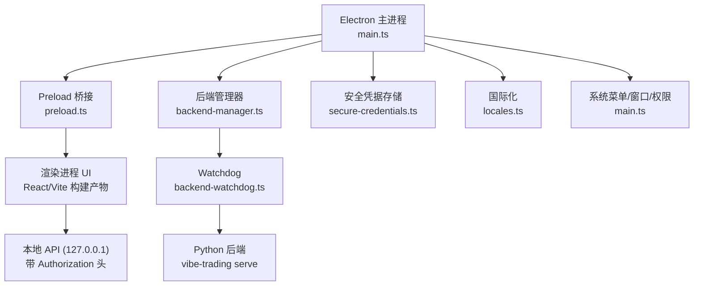
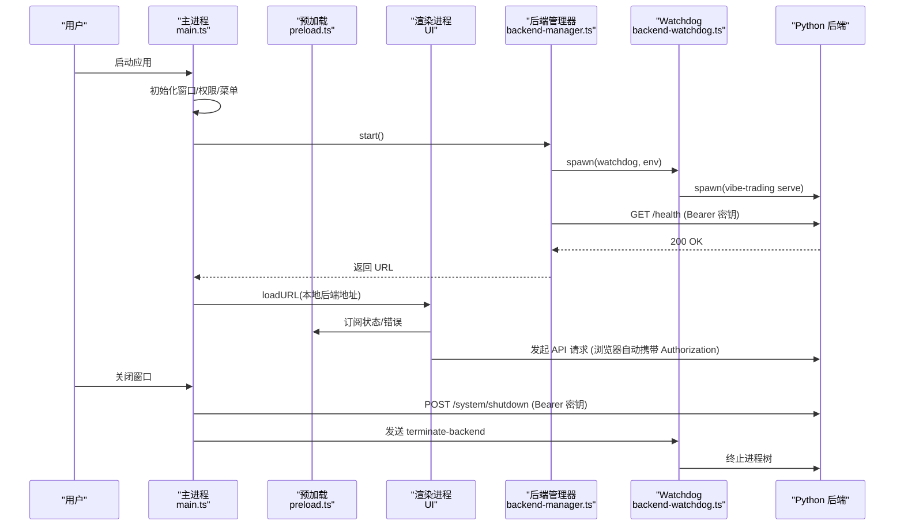
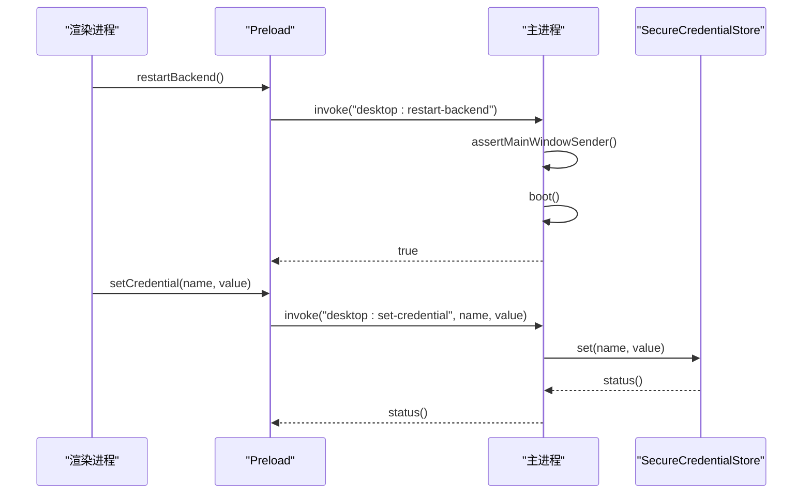
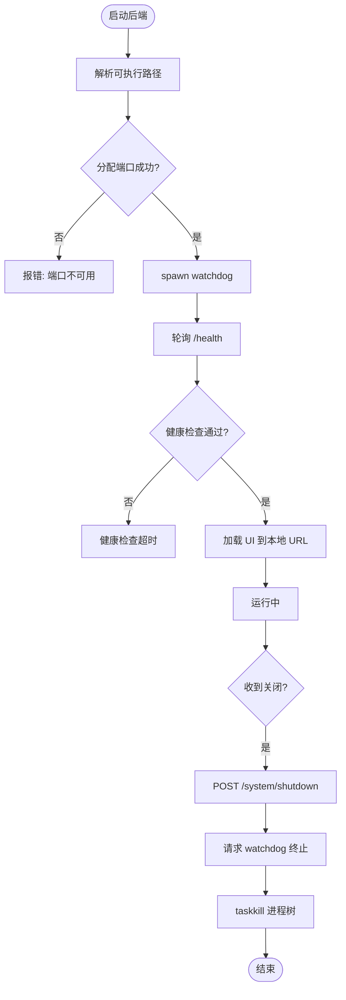
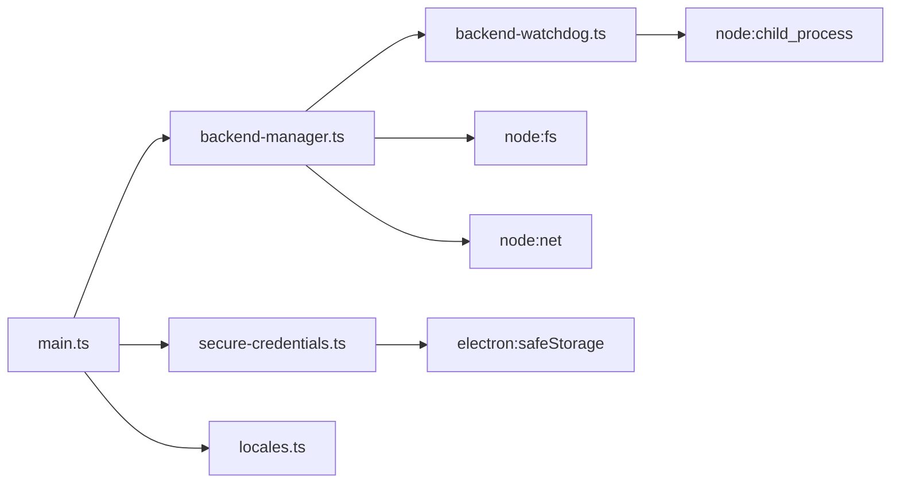

# 桌面应用

<cite>
**本文引用的文件**
- [desktop/electron/package.json](file://desktop/electron/package.json)
- [desktop/electron/src/main.ts](file://desktop/electron/src/main.ts)
- [desktop/electron/src/preload.ts](file://desktop/electron/src/preload.ts)
- [desktop/electron/src/backend-manager.ts](file://desktop/electron/src/backend-manager.ts)
- [desktop/electron/src/backend-watchdog.ts](file://desktop/electron/src/backend-watchdog.ts)
- [desktop/electron/src/secure-credentials.ts](file://desktop/electron/src/secure-credentials.ts)
- [desktop/electron/src/locales.ts](file://desktop/electron/src/locales.ts)
- [desktop/electron/README.md](file://desktop/electron/README.md)
- [desktop/electron/THREAT_MODEL.md](file://desktop/electron/THREAT_MODEL.md)
- [desktop/electron/scripts/prepare-electron.mjs](file://desktop/electron/scripts/prepare-electron.mjs)
- [desktop/electron/scripts/build-signed-installer.mjs](file://desktop/electron/scripts/build-signed-installer.mjs)
- [frontend/package.json](file://frontend/package.json)
</cite>

## 目录
1. [简介](#简介)
2. [项目结构](#项目结构)
3. [核心组件](#核心组件)
4. [架构总览](#架构总览)
5. [详细组件分析](#详细组件分析)
6. [依赖关系分析](#依赖关系分析)
7. [性能与可靠性](#性能与可靠性)
8. [故障排查指南](#故障排查指南)
9. [结论](#结论)
10. [附录：配置、参数与返回值](#附录配置参数与返回值)

## 简介
本仓库包含 Vibe-Trading 的 Electron 桌面宿主层，负责启动并管理本地 Python 后端服务、渲染安全隔离的 UI、处理 IPC、凭据加密存储、日志收集、菜单与国际化，以及 Windows 打包与签名流程。该层不内置自动更新、IM 适配器或代理行为修改，重点在于进程边界安全、本地回环通信与跨平台构建产物。

## 项目结构
桌面端由以下关键部分组成：
- Electron 主进程：生命周期、窗口、菜单、IPC、后端管理、安全策略
- Preload 脚本：向渲染进程暴露最小能力（状态、错误、重试、日志、重启后端、凭据写入）
- 后端管理器：发现可执行、分配端口、启动子进程、健康检查、日志捕获、优雅关闭
- Watchdog：守护 Python 后端进程，监控父进程存活与 IPC 断开，必要时强制终止进程树
- 安全凭据存储：使用 safeStorage 加密保存允许列表中的密钥，支持迁移与注入到子进程环境
- 国际化：多语言消息与加载页方向控制
- 构建与打包：准备 Electron 运行时、校验校验和、生成 NSIS 安装包、可选 Authenticode 签名与验证

图表来源
- [desktop/electron/src/main.ts:65-117](file://desktop/electron/src/main.ts#L65-L117)
- [desktop/electron/src/preload.ts:3-17](file://desktop/electron/src/preload.ts#L3-L17)
- [desktop/electron/src/backend-manager.ts:63-146](file://desktop/electron/src/backend-manager.ts#L63-L146)
- [desktop/electron/src/backend-watchdog.ts:31-68](file://desktop/electron/src/backend-watchdog.ts#L31-L68)
- [desktop/electron/src/secure-credentials.ts:69-124](file://desktop/electron/src/secure-credentials.ts#L69-L124)
- [desktop/electron/src/locales.ts:53-60](file://desktop/electron/src/locales.ts#L53-L60)

章节来源
- [desktop/electron/README.md:11-35](file://desktop/electron/README.md#L11-L35)
- [desktop/electron/package.json:9-22](file://desktop/electron/package.json#L9-L22)

## 核心组件
- 主进程 main.ts：创建窗口、设置安全偏好、注册 IPC、显示加载页、启动后端、处理关闭与异常
- 预加载 preload.ts：通过 contextBridge 暴露受限 API 给渲染进程
- 后端管理器 backend-manager.ts：解析后端可执行、分配端口、启动 watchdog、等待健康、记录日志、优雅停止
- Watchdog backend-watchdog.ts：启动 Python 后端、监控父进程、处理终止信号、清理进程树
- 安全凭据 secure-credentials.ts：加密存储、迁移、注入环境变量到后端
- 国际化 locales.ts：多语言消息、加载页方向、格式化模板

章节来源
- [desktop/electron/src/main.ts:49-63](file://desktop/electron/src/main.ts#L49-L63)
- [desktop/electron/src/preload.ts:3-17](file://desktop/electron/src/preload.ts#L3-L17)
- [desktop/electron/src/backend-manager.ts:52-146](file://desktop/electron/src/backend-manager.ts#L52-L146)
- [desktop/electron/src/backend-watchdog.ts:43-86](file://desktop/electron/src/backend-watchdog.ts#L43-L86)
- [desktop/electron/src/secure-credentials.ts:69-124](file://desktop/electron/src/secure-credentials.ts#L69-L124)
- [desktop/electron/src/locales.ts:61-96](file://desktop/electron/src/locales.ts#L61-L96)

## 架构总览
Electron 主进程作为受信任边界，持有每启动一次的随机 API 密钥，仅对同源本地请求注入 Authorization 头；渲染进程在沙箱中运行，无法直接访问 Node 与敏感 API；后端以 loopback 绑定且需认证；watchdog 确保进程生命周期一致性与健壮性。

图表来源
- [desktop/electron/src/main.ts:165-192](file://desktop/electron/src/main.ts#L165-L192)
- [desktop/electron/src/backend-manager.ts:63-146](file://desktop/electron/src/backend-manager.ts#L63-L146)
- [desktop/electron/src/backend-watchdog.ts:31-68](file://desktop/electron/src/backend-watchdog.ts#L31-L68)
- [desktop/electron/src/main.ts:88-98](file://desktop/electron/src/main.ts#L88-L98)

## 详细组件分析

### 主进程与窗口安全
- 窗口安全偏好：禁用 nodeIntegration、启用 contextIsolation 与 sandbox、限制 devTools、使用独立 partition
- 权限默认拒绝：所有权限检查与请求均返回 false
- 导航与外链：仅允许安全协议外链，阻止离开本地后端原点的页面内导航
- 单实例：防止重复启动，聚焦已有窗口

章节来源
- [desktop/electron/src/main.ts:65-117](file://desktop/electron/src/main.ts#L65-L117)
- [desktop/electron/src/main.ts:212-238](file://desktop/electron/src/main.ts#L212-L238)

### IPC 通信模型
- 渲染进程通过 preload 暴露方法：onStatus、onError、retry、openLogs、restartBackend、get/set 凭据
- 主进程接收并校验 sender，仅允许来自主窗口的请求
- 凭据写入走白名单校验与加密存储，不返回明文值

图表来源
- [desktop/electron/src/preload.ts:3-17](file://desktop/electron/src/preload.ts#L3-L17)
- [desktop/electron/src/main.ts:119-146](file://desktop/electron/src/main.ts#L119-L146)
- [desktop/electron/src/secure-credentials.ts:106-124](file://desktop/electron/src/secure-credentials.ts#L106-L124)

章节来源
- [desktop/electron/src/main.ts:119-146](file://desktop/electron/src/main.ts#L119-L146)
- [desktop/electron/src/preload.ts:3-17](file://desktop/electron/src/preload.ts#L3-L17)

### 文件系统访问与日志
- 日志目录：按日期写入 per-user 日志文件，捕获 stdout/stderr
- 凭据文件：原子写入（临时文件 + rename），权限 0o600
- 打开日志文件夹：通过 shell.openPath(app.getPath("logs"))

章节来源
- [desktop/electron/src/backend-manager.ts:79-85](file://desktop/electron/src/backend-manager.ts#L79-L85)
- [desktop/electron/src/secure-credentials.ts:156-165](file://desktop/electron/src/secure-credentials.ts#L156-L165)
- [desktop/electron/src/main.ts:124-127](file://desktop/electron/src/main.ts#L124-L127)

### 系统托盘与菜单
- 应用菜单提供“重启本地服务”、“打开日志文件夹”、“退出”等选项
- 视图菜单包含刷新、开发者工具（开发模式）、缩放、全屏

章节来源
- [desktop/electron/src/main.ts:212-238](file://desktop/electron/src/main.ts#L212-L238)

### 后端管理与进程生命周期
- 后端可执行解析优先级：环境变量覆盖 > 打包路径 > 源码标记根 > PATH
- 端口分配：动态选择空闲端口，绑定 127.0.0.1
- 健康检查：轮询 /health，超时失败
- 优雅关闭：先调用 /system/shutdown，再请求 watchdog 终止，最后 taskkill 进程树

图表来源
- [desktop/electron/src/backend-manager.ts:63-146](file://desktop/electron/src/backend-manager.ts#L63-L146)
- [desktop/electron/src/backend-manager.ts:221-246](file://desktop/electron/src/backend-manager.ts#L221-L246)
- [desktop/electron/src/backend-manager.ts:148-187](file://desktop/electron/src/backend-manager.ts#L148-L187)

章节来源
- [desktop/electron/src/backend-manager.ts:270-371](file://desktop/electron/src/backend-manager.ts#L270-L371)
- [desktop/electron/src/backend-manager.ts:373-421](file://desktop/electron/src/backend-manager.ts#L373-L421)

### 安全机制与威胁模型
- 信任边界：主进程持有密钥与 safeStorage；渲染进程无密钥但可发起同源认证请求
- 网络防护：仅对匹配后端 origin 的请求注入 Authorization；禁止危险协议外链；默认拒绝权限
- 进程保护：watchdog 监控父进程与 IPC，异常时终止后端进程树
- 凭据安全：仅允许白名单键，加密存储，注入到子进程环境，不返回明文

章节来源
- [desktop/electron/THREAT_MODEL.md:22-79](file://desktop/electron/THREAT_MODEL.md#L22-L79)
- [desktop/electron/THREAT_MODEL.md:81-160](file://desktop/electron/THREAT_MODEL.md#L81-L160)

### 构建、打包与签名
- 准备 Electron 运行时：下载官方二进制并校验 SHA-256
- 打包：electron-builder 生成 NSIS 安装包，输出至 release 目录
- 签名：通过 PowerShell 调用 Get-AuthenticodeSignature 验证签名，生成 SHA256SUMS.txt
- 环境变量：WIN_CSC_LINK/WIN_CSC_KEY_PASSWORD 用于签名；CSC_* 别名兼容

章节来源
- [desktop/electron/scripts/prepare-electron.mjs:1-75](file://desktop/electron/scripts/prepare-electron.mjs#L1-L75)
- [desktop/electron/scripts/build-signed-installer.mjs:1-79](file://desktop/electron/scripts/build-signed-installer.mjs#L1-L79)
- [desktop/electron/scripts/build-signed-installer.mjs:93-121](file://desktop/electron/scripts/build-signed-installer.mjs#L93-L121)
- [desktop/electron/package.json:30-84](file://desktop/electron/package.json#L30-L84)

### 前端与构建
- 前端基于 React + Vite，Node 版本要求 >= 22.22.0
- 构建命令：tsc -b && vite build
- 测试：vitest 运行与覆盖率

章节来源
- [frontend/package.json:1-58](file://frontend/package.json#L1-L58)

## 依赖关系分析
- 主进程依赖：Electron API、Node fs/path/crypto、内部模块（backend-manager、locales、secure-credentials）
- 后端管理器依赖：child_process、fs、net、path、locales
- Watchdog 依赖：child_process、process 信号与 IPC
- 安全凭据依赖：electron safeStorage、fs/promises、os、path
- 构建脚本依赖：@electron/get、electron-builder、PowerShell 签名工具

图表来源
- [desktop/electron/src/main.ts:1-21](file://desktop/electron/src/main.ts#L1-L21)
- [desktop/electron/src/backend-manager.ts:1-14](file://desktop/electron/src/backend-manager.ts#L1-L14)
- [desktop/electron/src/backend-watchdog.ts:1-12](file://desktop/electron/src/backend-watchdog.ts#L1-L12)
- [desktop/electron/src/secure-credentials.ts:1-5](file://desktop/electron/src/secure-credentials.ts#L1-L5)

章节来源
- [desktop/electron/src/main.ts:1-21](file://desktop/electron/src/main.ts#L1-L21)
- [desktop/electron/src/backend-manager.ts:1-14](file://desktop/electron/src/backend-manager.ts#L1-L14)
- [desktop/electron/src/backend-watchdog.ts:1-12](file://desktop/electron/src/backend-watchdog.ts#L1-L12)
- [desktop/electron/src/secure-credentials.ts:1-5](file://desktop/electron/src/secure-credentials.ts#L1-L5)

## 性能与可靠性
- 健康检查轮询间隔短（100ms），超时时间合理（180s），避免长时间阻塞
- 日志追加写入，保留最近 80 行用于错误上下文
- 端口分配使用临时服务器快速探测，减少冲突
- Watchdog 定时检查父进程存活（250ms），及时清理僵尸进程
- 关闭流程分阶段：HTTP 优雅关闭 -> IPC 终止 -> 强制 kill，保证资源释放

[本节为通用指导，无需具体文件引用]

## 故障排查指南
- 启动失败：查看 loading 页错误提示与日志文件夹；确认后端可执行存在与 PATH 正确
- 后端意外退出：检查健康检查超时与最近日志尾部；尝试重启本地服务
- 凭据问题：确认 safeStorage 可用；检查允许列表键名；验证迁移是否完成
- 端口占用：重新分配端口；若失败则检查系统防火墙或占用进程
- 签名与打包：确保签名证书与环境变量正确；验证签名与哈希

章节来源
- [desktop/electron/src/main.ts:206-210](file://desktop/electron/src/main.ts#L206-L210)
- [desktop/electron/src/backend-manager.ts:221-246](file://desktop/electron/src/backend-manager.ts#L221-L246)
- [desktop/electron/src/secure-credentials.ts:85-96](file://desktop/electron/src/secure-credentials.ts#L85-L96)
- [desktop/electron/scripts/build-signed-installer.mjs:13-24](file://desktop/electron/scripts/build-signed-installer.mjs#L13-L24)

## 结论
Vibe-Trading 桌面层通过严格的进程边界、安全的 IPC 与凭据管理、健壮的后端生命周期控制，提供了可靠的本地化部署体验。其构建与签名流程确保了分发产物的完整性与可信度。尽管不包含自动更新与 IM 集成，但其设计为后续扩展预留了清晰的安全边界与模块化接口。

[本节为总结，无需具体文件引用]

## 附录：配置、参数与返回值
- 环境变量
  - VIBE_TRADING_EXECUTABLE：指定后端可执行路径（优先）
  - VIBE_TRADING_DESKTOP_LOCALE：桌面语言（en/zh-CN/ja/ko/ar）
  - VIBE_TRADING_DESKTOP_TEST_USER_DATA：测试用户数据目录
  - WIN_CSC_LINK/WIN_CSC_KEY_PASSWORD：Windows 签名证书与密码
- 构建脚本
  - prepare:electron：下载并校验 Electron 运行时
  - installer:win:signed：构建并签名 NSIS 安装包
- 主进程 IPC
  - desktop:retry：重试启动
  - desktop:open-logs：打开日志文件夹
  - desktop:restart-backend：重启后端，返回 boolean
  - desktop:get-credential-status：返回 {available, configured, migrated}
  - desktop:set-credential：写入凭据，返回 {available, configured, migrated}
- 后端管理器
  - start()：返回本地 URL（http://127.0.0.1:<port>/）
  - stop()：优雅关闭并清理进程
- Watchdog
  - 监听父进程 PID 与 IPC 断开，触发终止后端进程树
- 安全凭据
  - set(name, value)：name 必须在允许列表，value 为空则清除
  - environment()：返回解密后的环境变量对象，注入到后端子进程

章节来源
- [desktop/electron/src/main.ts:119-146](file://desktop/electron/src/main.ts#L119-L146)
- [desktop/electron/src/backend-manager.ts:63-146](file://desktop/electron/src/backend-manager.ts#L63-L146)
- [desktop/electron/src/backend-watchdog.ts:7-12](file://desktop/electron/src/backend-watchdog.ts#L7-L12)
- [desktop/electron/src/secure-credentials.ts:12-34](file://desktop/electron/src/secure-credentials.ts#L12-L34)
- [desktop/electron/src/secure-credentials.ts:117-124](file://desktop/electron/src/secure-credentials.ts#L117-L124)