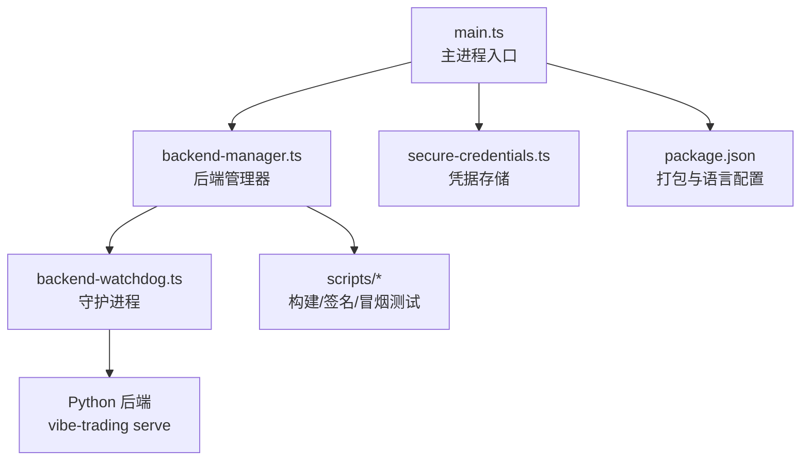
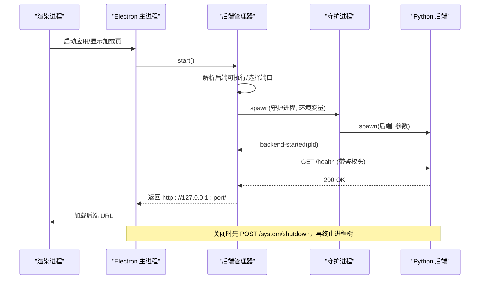
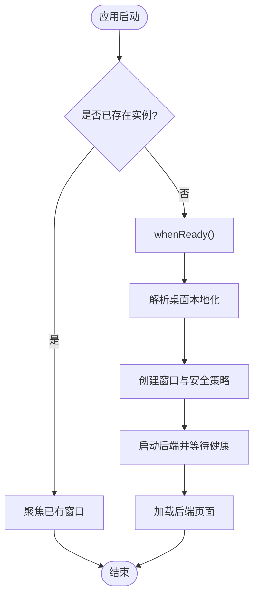
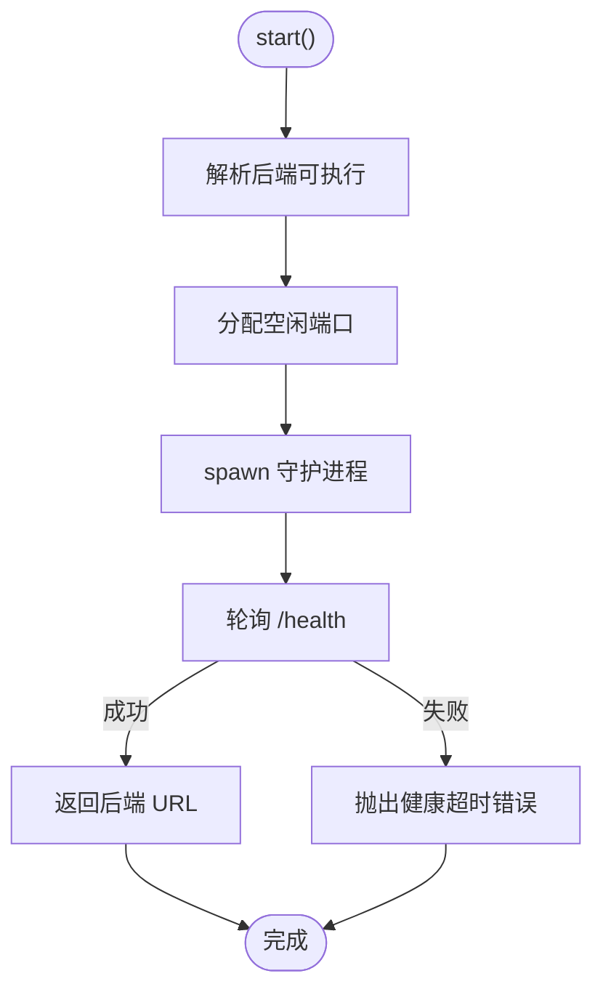
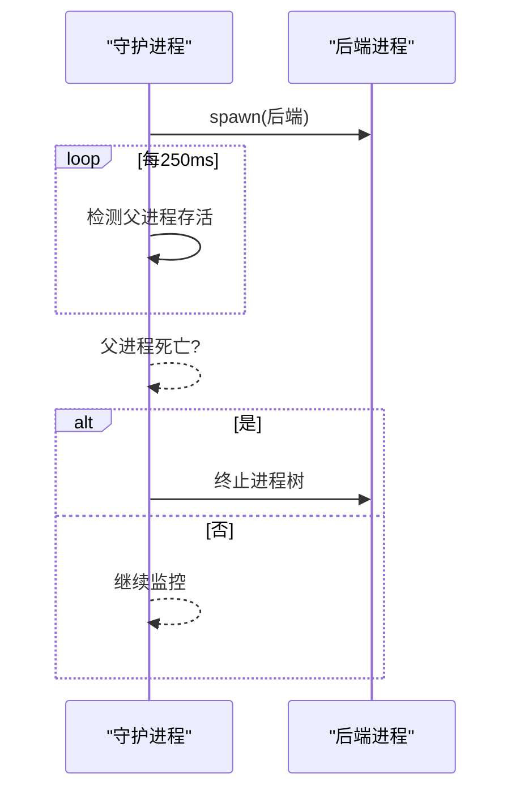
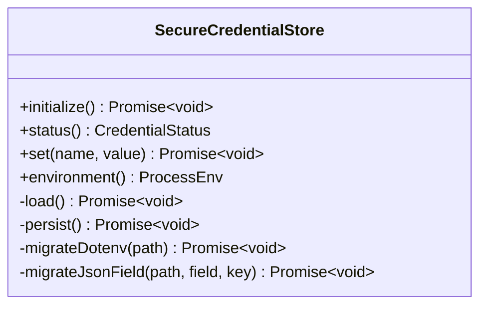
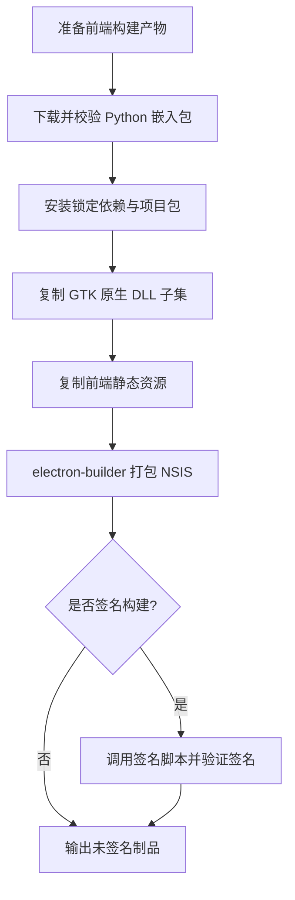

# 跨平台支持

<cite>
**本文引用的文件**
- [desktop/electron/package.json](file://desktop/electron/package.json)
- [desktop/electron/README.md](file://desktop/electron/README.md)
- [desktop/electron/WINDOWS_PACKAGING.md](file://desktop/electron/WINDOWS_PACKAGING.md)
- [desktop/electron/src/main.ts](file://desktop/electron/src/main.ts)
- [desktop/electron/src/backend-manager.ts](file://desktop/electron/src/backend-manager.ts)
- [desktop/electron/src/backend-watchdog.ts](file://desktop/electron/src/backend-watchdog.ts)
- [desktop/electron/src/secure-credentials.ts](file://desktop/electron/src/secure-credentials.ts)
- [desktop/electron/scripts/build-backend.ps1](file://desktop/electron/scripts/build-backend.ps1)
- [desktop/electron/scripts/build-signed-installer.mjs](file://desktop/electron/scripts/build-signed-installer.mjs)
- [desktop/electron/scripts/smoke-lifecycle.mjs](file://desktop/electron/scripts/smoke-lifecycle.mjs)
- [desktop/electron/scripts/smoke-credentials.cjs](file://desktop/electron/scripts/smoke-credentials.cjs)
</cite>

## 目录
1. [简介](#简介)
2. [项目结构](#项目结构)
3. [核心组件](#核心组件)
4. [架构总览](#架构总览)
5. [详细组件分析](#详细组件分析)
6. [依赖与构建](#依赖与构建)
7. [性能与用户体验](#性能与用户体验)
8. [故障排除指南](#故障排除指南)
9. [结论](#结论)
10. [附录：平台差异对照](#附录：平台差异对照)

## 简介
本文件聚焦 Vibe-Trading 桌面应用（Electron 宿主）在 Windows、macOS、Linux 上的跨平台实现与适配策略，覆盖平台检测、路径解析、系统 API 调用、安全凭据存储、后端进程生命周期管理、构建打包与发布流程，以及测试与冒烟用例。文档同时给出可操作的排障建议与性能优化要点，确保在不同操作系统上保持一致的文件权限、网络访问与系统集成行为。

## 项目结构
桌面层位于 desktop/electron，采用 Electron 主进程 + 渲染进程模式，通过子进程启动并守护 Python 后端服务。关键目录与职责：
- src/main.ts：应用入口、窗口、菜单、本地化、IPC、安全头注入、单实例锁、关闭流程。
- src/backend-manager.ts：后端可执行文件解析、端口分配、健康检查、日志采集、优雅关闭与强制终止。
- src/backend-watchdog.ts：独立守护进程，负责监控父进程存活、启动/终止后端进程树、跨平台信号处理。
- src/secure-credentials.ts：基于 Electron safeStorage 的凭据加密存储与迁移（从 .env 与 qveris.json）。
- scripts/*：Windows 专用构建脚本、签名校验、冒烟测试等。
- package.json：Electron 与 electron-builder 配置、多语言资源、打包产物命名、NSIS 安装器选项。

图表来源
- [desktop/electron/src/main.ts:1-285](file://desktop/electron/src/main.ts#L1-L285)
- [desktop/electron/src/backend-manager.ts:1-426](file://desktop/electron/src/backend-manager.ts#L1-L426)
- [desktop/electron/src/backend-watchdog.ts:1-167](file://desktop/electron/src/backend-watchdog.ts#L1-L167)
- [desktop/electron/src/secure-credentials.ts:1-240](file://desktop/electron/src/secure-credentials.ts#L1-L240)
- [desktop/electron/package.json:1-86](file://desktop/electron/package.json#L1-L86)

章节来源
- [desktop/electron/README.md:1-93](file://desktop/electron/README.md#L1-L93)
- [desktop/electron/package.json:1-86](file://desktop/electron/package.json#L1-L86)

## 核心组件
- 主进程与窗口：单实例锁、暗黑主题、本地化加载、预加载脚本、严格的安全策略（禁用 Node 集成、沙箱、同源限制、外部链接白名单）。
- 后端管理器：解析可执行文件、绑定回环地址、健康轮询、日志落盘、优雅关闭（HTTP 通知）、超时与异常上报。
- 守护进程：周期性检测父进程存活、清理进程树、跨平台信号处理、IPC 消息协议。
- 凭据存储：仅允许白名单键名，使用 safeStorage 加密持久化，首次启动迁移明文配置并删除明文字段。
- 构建与打包：Windows 嵌入 Python 运行时、锁定依赖、最小化依赖集、可选 GTK 原生 DLL 子集、NSIS 安装器、代码签名验证。

章节来源
- [desktop/electron/src/main.ts:1-285](file://desktop/electron/src/main.ts#L1-L285)
- [desktop/electron/src/backend-manager.ts:1-426](file://desktop/electron/src/backend-manager.ts#L1-L426)
- [desktop/electron/src/backend-watchdog.ts:1-167](file://desktop/electron/src/backend-watchdog.ts#L1-L167)
- [desktop/electron/src/secure-credentials.ts:1-240](file://desktop/electron/src/secure-credentials.ts#L1-L240)
- [desktop/electron/scripts/build-backend.ps1:1-320](file://desktop/electron/scripts/build-backend.ps1#L1-L320)
- [desktop/electron/scripts/build-signed-installer.mjs:1-154](file://desktop/electron/scripts/build-signed-installer.mjs#L1-L154)

## 架构总览
下图展示从 Electron 主进程到 Python 后端的完整启动与健康检查流程，以及跨平台守护与关闭路径。

图表来源
- [desktop/electron/src/main.ts:148-192](file://desktop/electron/src/main.ts#L148-L192)
- [desktop/electron/src/backend-manager.ts:63-146](file://desktop/electron/src/backend-manager.ts#L63-L146)
- [desktop/electron/src/backend-manager.ts:148-187](file://desktop/electron/src/backend-manager.ts#L148-L187)
- [desktop/electron/src/backend-watchdog.ts:31-68](file://desktop/electron/src/backend-watchdog.ts#L31-L68)

## 详细组件分析

### 主进程与平台检测
- 单实例锁：防止重复启动；二次实例聚焦已有窗口。
- 本地化：根据环境或系统语言选择桌面文案，支持 RTL 布局。
- 安全策略：禁用 Node 集成、启用沙箱、仅允许同源请求注入 Authorization 头、拦截危险导航。
- 平台差异：macOS 下“全部窗口关闭”不直接退出，遵循系统行为；其他平台统一退出。

图表来源
- [desktop/electron/src/main.ts:33-63](file://desktop/electron/src/main.ts#L33-L63)
- [desktop/electron/src/main.ts:65-117](file://desktop/electron/src/main.ts#L65-L117)
- [desktop/electron/src/main.ts:278-280](file://desktop/electron/src/main.ts#L278-L280)

章节来源
- [desktop/electron/src/main.ts:1-285](file://desktop/electron/src/main.ts#L1-L285)

### 后端管理器与路径解析
- 可执行文件解析优先级：显式覆盖 > 打包资源精确路径 > 标记源码根下的虚拟环境 > PATH。
- 运行参数：固定 host=127.0.0.1，随机端口，附加必要环境变量（如 PYTHONUTF8、PYTHONUNBUFFERED、ELECTRON_RUN_AS_NODE 等）。
- 健康检查：轮询 /health，超时失败并输出最近日志片段。
- 关闭流程：先尝试 HTTP 优雅关闭，再 IPC 通知守护进程终止后端，最后必要时 taskkill/SIGKILL。

图表来源
- [desktop/electron/src/backend-manager.ts:63-146](file://desktop/electron/src/backend-manager.ts#L63-L146)
- [desktop/electron/src/backend-manager.ts:270-371](file://desktop/electron/src/backend-manager.ts#L270-L371)
- [desktop/electron/src/backend-manager.ts:373-421](file://desktop/electron/src/backend-manager.ts#L373-L421)

章节来源
- [desktop/electron/src/backend-manager.ts:1-426](file://desktop/electron/src/backend-manager.ts#L1-L426)

### 守护进程与进程树管理
- 父进程监控：每 250ms 检测主进程存活，异常则终止后端。
- 跨平台终止：Windows 使用 taskkill /T /F；类 Unix 使用 SIGKILL。
- 信号处理：SIGTERM/SIGINT 触发有序终止；IPC 接收 terminate-backend。
- 环境变量隔离：剔除桌面相关内部变量，避免泄露给后端。

图表来源
- [desktop/electron/src/backend-watchdog.ts:14-48](file://desktop/electron/src/backend-watchdog.ts#L14-L48)
- [desktop/electron/src/backend-watchdog.ts:88-117](file://desktop/electron/src/backend-watchdog.ts#L88-L117)

章节来源
- [desktop/electron/src/backend-watchdog.ts:1-167](file://desktop/electron/src/backend-watchdog.ts#L1-L167)

### 凭据存储与安全边界
- 白名单机制：仅允许受控密钥写入/读取。
- 加密存储：使用 Electron safeStorage 加密保存至 userData 目录；首次启动迁移 .env 与 qveris.json 中的敏感字段，并移除明文。
- 注入方式：解密后的值以环境变量形式注入后端进程，不返回渲染进程。
- 权限控制：文件写入使用临时文件+原子重命名，权限 0o600。

图表来源
- [desktop/electron/src/secure-credentials.ts:69-124](file://desktop/electron/src/secure-credentials.ts#L69-L124)
- [desktop/electron/src/secure-credentials.ts:140-220](file://desktop/electron/src/secure-credentials.ts#L140-L220)

章节来源
- [desktop/electron/src/secure-credentials.ts:1-240](file://desktop/electron/src/secure-credentials.ts#L1-L240)

### 构建、打包与发布（Windows 为重点）
- 嵌入式 Python 运行时：下载并校验 SHA-256，配置 site-packages，安装锁定依赖，安装当前仓库包（无依赖解析）。
- 原生依赖：按需复制 WeasyPrint 所需的 GTK/Pango/Cairo/GLib 等 DLL 子集，设置 WEASYPRINT_DLL_DIRECTORIES。
- 前端资源：将生产构建产物复制到 runtime/Lib/frontend/dist。
- 安装器：electron-builder 生成 NSIS x64 安装包；提供“审查用未签名”和“签名发布”两种流程。
- 签名验证：自动查找 PowerShell 主机，验证 Authenticode 签名状态为 Valid，并生成 SHA256SUMS.txt。

图表来源
- [desktop/electron/scripts/build-backend.ps1:1-320](file://desktop/electron/scripts/build-backend.ps1#L1-L320)
- [desktop/electron/scripts/build-signed-installer.mjs:1-154](file://desktop/electron/scripts/build-signed-installer.mjs#L1-L154)
- [desktop/electron/package.json:30-84](file://desktop/electron/package.json#L30-L84)

章节来源
- [desktop/electron/WINDOWS_PACKAGING.md:1-153](file://desktop/electron/WINDOWS_PACKAGING.md#L1-L153)
- [desktop/electron/scripts/build-backend.ps1:1-320](file://desktop/electron/scripts/build-backend.ps1#L1-L320)
- [desktop/electron/scripts/build-signed-installer.mjs:1-154](file://desktop/electron/scripts/build-signed-installer.mjs#L1-L154)
- [desktop/electron/package.json:1-86](file://desktop/electron/package.json#L1-L86)

## 依赖与构建
- 开发运行：需先构建前端，再进入 desktop/electron 安装依赖并启动。
- Windows 构建要求：
  - 需要 Python 3.12 工具链与 curl；依赖锁定文件 requirements-windows-lock.txt。
  - 构建过程会清理中间产物，避免重入冲突。
  - 可选 GTK 运行时用于 PDF 导出；若缺失将影响 PDF 功能。
- 多平台注意事项：
  - macOS/Linux 可通过系统 Python 或 venv 运行后端；Electron 侧同样通过守护进程管理生命周期。
  - 路径分隔符与命令差异由 Node/Electron 抽象；仅在进程终止时使用 platform 分支调用 taskkill 或 kill。
- 发布流程：
  - 未签名制品用于本地审查；发布必须使用签名脚本并提供证书与密码。
  - 产物包含应用可执行与安装器，附带哈希校验文件。

章节来源
- [desktop/electron/README.md:37-75](file://desktop/electron/README.md#L37-L75)
- [desktop/electron/WINDOWS_PACKAGING.md:23-60](file://desktop/electron/WINDOWS_PACKAGING.md#L23-L60)
- [desktop/electron/WINDOWS_PACKAGING.md:76-98](file://desktop/electron/WINDOWS_PACKAGING.md#L76-L98)
- [desktop/electron/package.json:9-22](file://desktop/electron/package.json#L9-L22)

## 性能与用户体验
- 启动体验：
  - 先显示本地化加载页，等待后端健康后再切换页面，避免空白闪烁。
  - 日志按日滚动写入用户日志目录，便于定位问题。
- 资源占用：
  - 构建阶段裁剪测试目录，减少体积。
  - 仅复制必要的 GTK 原生 DLL，降低安装包大小。
- 交互一致性：
  - 所有网络请求限定同源，自动注入鉴权头，避免页面暴露密钥。
  - 外部链接仅允许 https/http，并通过系统浏览器打开。
- 平台差异：
  - macOS 遵循系统窗口关闭语义；Windows 提供一键重启服务、打开日志等菜单项。
  - 进程终止策略跨平台一致：优先优雅关闭，再强制回收。

[本节为通用指导，无需特定文件引用]

## 故障排除指南
- 后端无法启动：
  - 检查可执行文件解析结果与 PATH；确认打包资源路径正确。
  - 查看当日日志文件，关注健康检查超时与最近输出片段。
- 端口占用：
  - 管理器会自动寻找空闲端口；若失败，检查防火墙或残留监听。
- 凭据问题：
  - 确认 safeStorage 可用；检查 credentials.v1.json 是否存在且格式正确。
  - 首次启动会迁移 .env 与 qveris.json 中的敏感字段，确保目标目录可写。
- 关闭不彻底：
  - 观察守护进程是否收到 terminate-backend 消息；必要时检查 taskkill/SIGKILL 是否生效。
- 构建失败：
  - 确认 Python 版本与依赖锁定文件匹配；检查 GTK 运行时下载与校验。
  - 签名构建需设置证书与密码环境变量，否则失败。

章节来源
- [desktop/electron/src/backend-manager.ts:221-246](file://desktop/electron/src/backend-manager.ts#L221-L246)
- [desktop/electron/src/backend-manager.ts:148-187](file://desktop/electron/src/backend-manager.ts#L148-L187)
- [desktop/electron/src/secure-credentials.ts:85-96](file://desktop/electron/src/secure-credentials.ts#L85-L96)
- [desktop/electron/scripts/build-backend.ps1:122-155](file://desktop/electron/scripts/build-backend.ps1#L122-L155)
- [desktop/electron/scripts/build-signed-installer.mjs:13-24](file://desktop/electron/scripts/build-signed-installer.mjs#L13-L24)

## 结论
Vibe-Trading 桌面层通过 Electron 主进程与独立的守护进程协同，实现了跨平台的后端生命周期管理、安全凭据存储与一致的启动/关闭体验。Windows 平台具备完整的嵌入式运行时构建、依赖锁定、原生 DLL 子集与签名发布能力；macOS/Linux 可复用相同的主进程逻辑与守护策略。通过严格的同源网络策略、白名单凭据与原子文件写入，系统在安全性与可靠性方面达到生产可用水平。建议在 CI 中持续运行冒烟测试与签名验证，确保各平台构建与发布质量稳定。

[本节为总结性内容，无需特定文件引用]

## 附录：平台差异对照
- 进程终止：
  - Windows：taskkill /T /F 终止进程树。
  - macOS/Linux：process.kill(pid, "SIGKILL")。
- 窗口关闭：
  - macOS：遵循系统默认行为（不立即退出）。
  - 其他平台：全部窗口关闭即退出。
- 路径与命令：
  - 路径分隔符与可执行后缀由 Node 与 OS 决定；脚本中通过 path 模块与条件判断兼容。
- 原生依赖：
  - Windows 需额外复制 GTK/Pango/Cairo/GLib 等 DLL；其他平台通常由系统或包管理器提供。
- 构建与发布：
  - Windows 提供 NSIS 安装器与签名流程；其他平台可使用 electron-builder 对应目标（如 dmg、AppImage），但本项目当前重点在 Windows。

章节来源
- [desktop/electron/src/backend-manager.ts:404-421](file://desktop/electron/src/backend-manager.ts#L404-L421)
- [desktop/electron/src/backend-watchdog.ts:103-117](file://desktop/electron/src/backend-watchdog.ts#L103-L117)
- [desktop/electron/src/main.ts:278-280](file://desktop/electron/src/main.ts#L278-L280)
- [desktop/electron/scripts/build-backend.ps1:192-237](file://desktop/electron/scripts/build-backend.ps1#L192-L237)

## 测试策略与冒烟用例
- 生命周期冒烟：
  - 验证后端绑定回环地址、健康端点鉴权、非授权请求返回 401、关闭后不再接受连接。
- 凭据迁移冒烟：
  - 验证首次启动迁移 .env 与 qveris.json 中的敏感字段到加密存储，明文被注释或删除，重新加载可恢复。
- 后端解析测试：
  - 验证显式覆盖优先、打包资源精确匹配、标记源码根下的虚拟环境选择、PATH 回退、错误项目根忽略。
- 本地化与语言：
  - 构建后运行本地化测试，确保加载页与菜单文案在多语言下一致。

章节来源
- [desktop/electron/scripts/smoke-lifecycle.mjs:1-71](file://desktop/electron/scripts/smoke-lifecycle.mjs#L1-L71)
- [desktop/electron/scripts/smoke-credentials.cjs:1-133](file://desktop/electron/scripts/smoke-credentials.cjs#L1-L133)
- [desktop/electron/scripts/test-backend-resolution.mjs:1-132](file://desktop/electron/scripts/test-backend-resolution.mjs#L1-L132)
- [desktop/electron/package.json:10-18](file://desktop/electron/package.json#L10-L18)