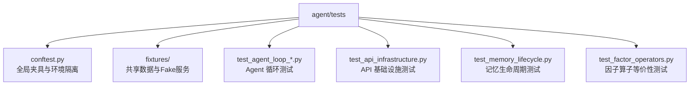
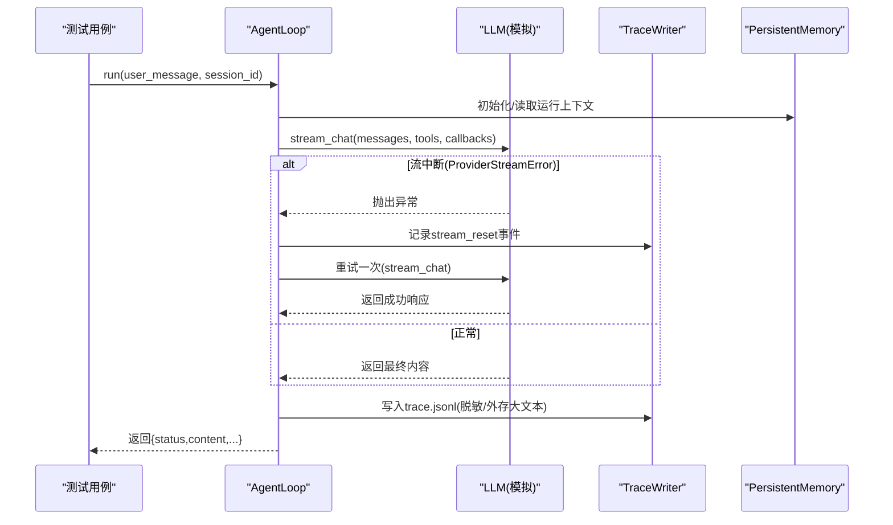
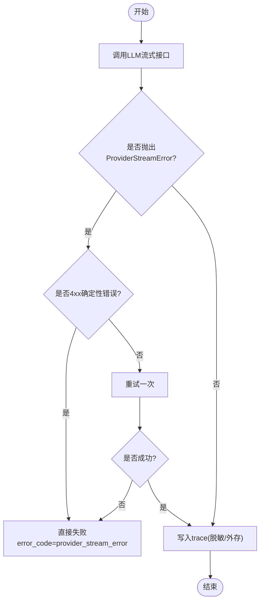
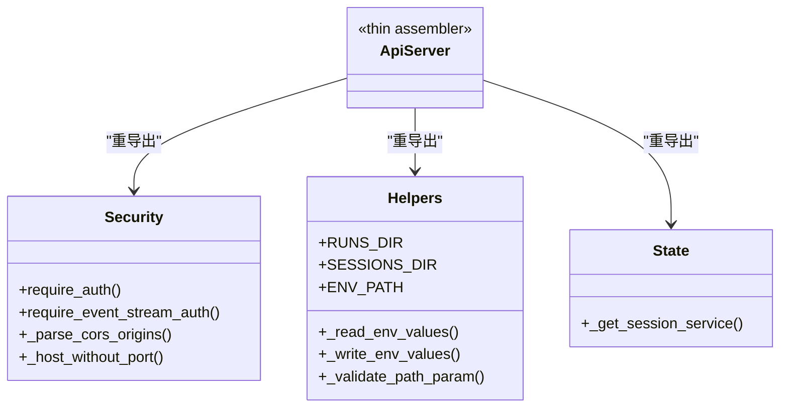
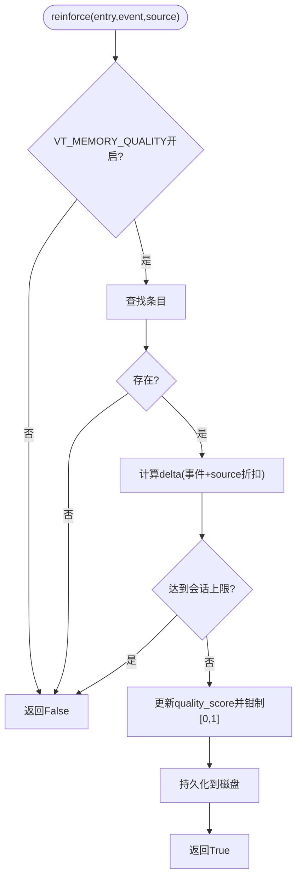
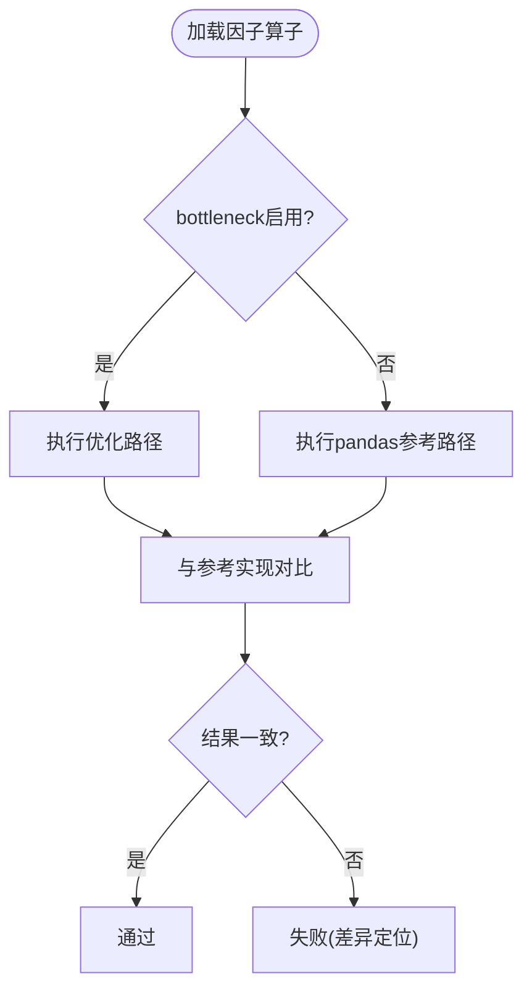
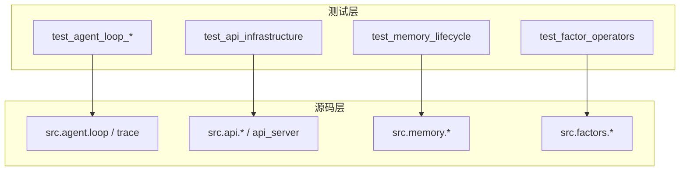

# 单元测试

<cite>
**本文引用的文件**
- [agent/tests/conftest.py](file://agent/tests/conftest.py)
- [agent/tests/test_agent_loop_trace.py](file://agent/tests/test_agent_loop_trace.py)
- [agent/tests/test_agent_loop_stream_retry.py](file://agent/tests/test_agent_loop_stream_retry.py)
- [agent/tests/test_api_infrastructure.py](file://agent/tests/test_api_infrastructure.py)
- [agent/tests/test_memory_lifecycle.py](file://agent/tests/test_memory_lifecycle.py)
- [agent/tests/test_factor_operators.py](file://agent/tests/test_factor_operators.py)
- [agent/tests/fixtures/fake_mcp_server.py](file://agent/tests/fixtures/fake_mcp_server.py)
- [pyproject.toml](file://pyproject.toml)
</cite>

## 目录
1. [简介](#简介)
2. [项目结构](#项目结构)
3. [核心组件](#核心组件)
4. [架构总览](#架构总览)
5. [详细组件分析](#详细组件分析)
6. [依赖关系分析](#依赖关系分析)
7. [性能考量](#性能考量)
8. [故障排查指南](#故障排查指南)
9. [结论](#结论)
10. [附录](#附录)

## 简介
本文件面向 Vibe-Trading 的单元测试体系，聚焦 pytest 框架配置、测试夹具设计、Mock 策略与断言方法，系统说明测试用例组织模式、命名约定与测试数据管理。文档结合仓库中的实际测试样例，覆盖 Agent 循环、API 基础设施、因子计算与记忆系统等关键模块，并给出覆盖率要求、性能基准与并行执行配置建议，以及与其他组件的隔离测试策略和常见问题解决方案。最后总结 TDD 实践与持续集成中的单元测试流程。

## 项目结构
Vibe-Trading 的后端测试集中在 agent/tests 目录下，采用“按功能/模块划分”的组织方式：
- conftest.py：全局 pytest 配置与环境隔离夹具，确保每个测试在干净的环境变量与配置缓存中运行。
- fixtures：共享测试数据与轻量 Mock 服务（如 fake MCP 服务器）。
- 各 test_*.py：围绕具体子系统或功能的测试集，命名遵循 test_<模块或能力>.py。

**图表来源**
- [agent/tests/conftest.py:1-46](file://agent/tests/conftest.py#L1-L46)
- [agent/tests/fixtures/fake_mcp_server.py:1-48](file://agent/tests/fixtures/fake_mcp_server.py#L1-L48)

**章节来源**
- [agent/tests/conftest.py:1-46](file://agent/tests/conftest.py#L1-L46)

## 核心组件
- pytest 配置与环境隔离
  - 通过 autouse 夹具在每个测试前后清理并恢复环境变量，同时重置配置单例，避免跨测试污染。
- 测试夹具与数据管理
  - 使用临时目录 tmp_path 隔离文件系统写入；构造最小化内存/持久化对象；提供 helper 函数生成带 frontmatter 的记忆条目。
- Mock 策略
  - 对 LLM、工具注册表、外部服务（MCP）进行最小实现或进程内 Fake 服务，保证可重复、快速且无网络依赖。
- 断言方法
  - 广泛使用 pytest.approx、pd.testing.assert_frame_equal、assert 状态码/错误码等结构化断言，确保数值与行为一致性。

**章节来源**
- [agent/tests/conftest.py:16-46](file://agent/tests/conftest.py#L16-L46)
- [agent/tests/test_memory_lifecycle.py:34-72](file://agent/tests/test_memory_lifecycle.py#L34-L72)
- [agent/tests/test_agent_loop_stream_retry.py:21-68](file://agent/tests/test_agent_loop_stream_retry.py#L21-L68)
- [agent/tests/test_factor_operators.py:89-105](file://agent/tests/test_factor_operators.py#L89-L105)

## 架构总览
下图展示 Agent 循环在测试环境中的调用链与重试策略，体现流式响应中断后的重试、事件上报与结果聚合。

**图表来源**
- [agent/tests/test_agent_loop_stream_retry.py:107-144](file://agent/tests/test_agent_loop_stream_retry.py#L107-L144)
- [agent/tests/test_agent_loop_stream_retry.py:147-194](file://agent/tests/test_agent_loop_stream_retry.py#L147-L194)
- [agent/tests/test_agent_loop_trace.py:44-83](file://agent/tests/test_agent_loop_trace.py#L44-L83)
- [agent/tests/test_agent_loop_trace.py:112-149](file://agent/tests/test_agent_loop_trace.py#L112-L149)

## 详细组件分析

### Agent 循环测试：流重试与追踪
- 流重试策略
  - 针对 ProviderStreamError 的一次重试机制，区分瞬态错误与确定性 4xx 错误，失败时设置 error_code 并终止。
  - 通过自定义 _FlakyLoopLLM 注入错误队列，验证回调 on_text_chunk 的中间片段被丢弃，避免 trace 中出现重复思考文本。
- 追踪与脱敏
  - TraceWriter 将工具调用参数与结构化结果中的敏感字段脱敏后落盘；长回答内容外存以避免阻塞。
  - 会话模式下 trace 存储于 sessions/<id>/trace.jsonl，支持延迟解析与字段回填。

**图表来源**
- [agent/tests/test_agent_loop_stream_retry.py:81-104](file://agent/tests/test_agent_loop_stream_retry.py#L81-L104)
- [agent/tests/test_agent_loop_stream_retry.py:147-194](file://agent/tests/test_agent_loop_stream_retry.py#L147-L194)
- [agent/tests/test_agent_loop_trace.py:44-83](file://agent/tests/test_agent_loop_trace.py#L44-L83)
- [agent/tests/test_agent_loop_trace.py:112-149](file://agent/tests/test_agent_loop_trace.py#L112-L149)

**章节来源**
- [agent/tests/test_agent_loop_stream_retry.py:21-68](file://agent/tests/test_agent_loop_stream_retry.py#L21-L68)
- [agent/tests/test_agent_loop_stream_retry.py:107-144](file://agent/tests/test_agent_loop_stream_retry.py#L107-L144)
- [agent/tests/test_agent_loop_stream_retry.py:147-194](file://agent/tests/test_agent_loop_stream_retry.py#L147-L194)
- [agent/tests/test_agent_loop_trace.py:44-83](file://agent/tests/test_agent_loop_trace.py#L44-L83)
- [agent/tests/test_agent_loop_trace.py:112-149](file://agent/tests/test_agent_loop_trace.py#L112-L149)

### API 基础设施测试：安全与配置
- 重导出一致性校验
  - 验证 api_server 对 security/models/helpers/state 的重导出一致，确保入口稳定。
- CORS 与路径参数校验
  - 测试 _parse_cors_origins 的默认值、空串处理、自定义源与通配符拒绝；_validate_path_param 防止路径穿越与非法字符。
- .env 读写与权限
  - 验证 dotenv 解析与写入的往返一致性、注释行处理、export 前缀兼容、父目录权限设置为私有。
- 会话服务写回兼容性
  - 通过 _compat 将会话服务写回 host 模块，便于 monkeypatch 兼容。

**图表来源**
- [agent/tests/test_api_infrastructure.py:17-47](file://agent/tests/test_api_infrastructure.py#L17-L47)
- [agent/tests/test_api_infrastructure.py:101-125](file://agent/tests/test_api_infrastructure.py#L101-L125)
- [agent/tests/test_api_infrastructure.py:157-183](file://agent/tests/test_api_infrastructure.py#L157-L183)
- [agent/tests/test_api_infrastructure.py:217-339](file://agent/tests/test_api_infrastructure.py#L217-L339)
- [agent/tests/test_api_infrastructure.py:347-356](file://agent/tests/test_api_infrastructure.py#L347-L356)

**章节来源**
- [agent/tests/test_api_infrastructure.py:17-47](file://agent/tests/test_api_infrastructure.py#L17-L47)
- [agent/tests/test_api_infrastructure.py:101-125](file://agent/tests/test_api_infrastructure.py#L101-L125)
- [agent/tests/test_api_infrastructure.py:157-183](file://agent/tests/test_api_infrastructure.py#L157-L183)
- [agent/tests/test_api_infrastructure.py:217-339](file://agent/tests/test_api_infrastructure.py#L217-L339)
- [agent/tests/test_api_infrastructure.py:347-356](file://agent/tests/test_api_infrastructure.py#L347-L356)

### 记忆系统测试：生命周期与质量评分
- 记忆条目字段兼容性与边界
  - 旧格式缺失新字段时使用安全默认值；quality_score 越界钳制；access_count 非整数重置；keywords 截断至五个；related_memories 过滤无效 ID；id 缺失时自动生成。
- 重要性计算与衰减
  - compute_importance 综合 quality_score、访问次数与时间衰减；VT_MEMORY_DECAY 控制开关；访问奖励上限 0.3；输出上限 1.0。
- 强化机制
  - reinforce 根据事件类型调整 quality_score，支持 source 折扣与每会话增量上限；关闭标志时返回 False；不存在或未知事件返回 False。
- 特性开关与锁
  - VT_MEMORY_QUALITY/GC/DECAY 三个开关默认关闭；memory_lock 创建 .lock 文件用于并发保护。

**图表来源**
- [agent/tests/test_memory_lifecycle.py:182-221](file://agent/tests/test_memory_lifecycle.py#L182-L221)
- [agent/tests/test_memory_lifecycle.py:228-305](file://agent/tests/test_memory_lifecycle.py#L228-L305)
- [agent/tests/test_memory_lifecycle.py:313-330](file://agent/tests/test_memory_lifecycle.py#L313-L330)
- [agent/tests/test_memory_lifecycle.py:338-348](file://agent/tests/test_memory_lifecycle.py#L338-L348)

**章节来源**
- [agent/tests/test_memory_lifecycle.py:80-175](file://agent/tests/test_memory_lifecycle.py#L80-L175)
- [agent/tests/test_memory_lifecycle.py:182-221](file://agent/tests/test_memory_lifecycle.py#L182-L221)
- [agent/tests/test_memory_lifecycle.py:228-305](file://agent/tests/test_memory_lifecycle.py#L228-L305)
- [agent/tests/test_memory_lifecycle.py:313-348](file://agent/tests/test_memory_lifecycle.py#L313-L348)

### 因子计算测试：等价性与性能路径
- 目标
  - 验证优化路径（bottleneck/numpy stride）与原始 pandas rolling().apply() 参考实现结果一致。
- 方法
  - 通过环境变量切换后端，动态重载模块以启用/禁用 bottleneck；构造随机 DataFrame 与含 NaN 的数据集；检查预热窗口为 NaN、常数窗口秩期望、无前瞻泄露等。
- 断言
  - 使用 pd.testing.assert_frame_equal 与 np.allclose 进行数值级比对；捕获 RuntimeWarning 确保全 NaN 窗口不产生噪声。

**图表来源**
- [agent/tests/test_factor_operators.py:21-30](file://agent/tests/test_factor_operators.py#L21-L30)
- [agent/tests/test_factor_operators.py:36-84](file://agent/tests/test_factor_operators.py#L36-L84)
- [agent/tests/test_factor_operators.py:111-165](file://agent/tests/test_factor_operators.py#L111-L165)
- [agent/tests/test_factor_operators.py:235-299](file://agent/tests/test_factor_operators.py#L235-L299)

**章节来源**
- [agent/tests/test_factor_operators.py:21-30](file://agent/tests/test_factor_operators.py#L21-L30)
- [agent/tests/test_factor_operators.py:89-105](file://agent/tests/test_factor_operators.py#L89-L105)
- [agent/tests/test_factor_operators.py:111-165](file://agent/tests/test_factor_operators.py#L111-L165)
- [agent/tests/test_factor_operators.py:235-299](file://agent/tests/test_factor_operators.py#L235-L299)

### 概念性总览
以下图示为概念性测试工作流，不直接映射到具体代码文件：

## 依赖关系分析
- 测试对源码模块的依赖
  - Agent 循环测试依赖 src.agent.loop、src.agent.trace、src.providers.chat 等；API 基础设施测试依赖 api_server 及 src.api.*；记忆测试依赖 src.memory.lifecycle/persistent；因子测试依赖 src.factors.base/_backend。
- 外部依赖与隔离
  - 通过 fixtures/fake_mcp_server.py 提供进程内 MCP 服务，避免真实网络依赖；所有 IO 操作指向 tmp_path，避免污染宿主文件系统。

**图表来源**
- [agent/tests/test_agent_loop_stream_retry.py:107-144](file://agent/tests/test_agent_loop_stream_retry.py#L107-L144)
- [agent/tests/test_api_infrastructure.py:17-47](file://agent/tests/test_api_infrastructure.py#L17-L47)
- [agent/tests/test_memory_lifecycle.py:10-18](file://agent/tests/test_memory_lifecycle.py#L10-L18)
- [agent/tests/test_factor_operators.py:21-30](file://agent/tests/test_factor_operators.py#L21-L30)

**章节来源**
- [agent/tests/test_agent_loop_stream_retry.py:107-144](file://agent/tests/test_agent_loop_stream_retry.py#L107-L144)
- [agent/tests/test_api_infrastructure.py:17-47](file://agent/tests/test_api_infrastructure.py#L17-L47)
- [agent/tests/test_memory_lifecycle.py:10-18](file://agent/tests/test_memory_lifecycle.py#L10-L18)
- [agent/tests/test_factor_operators.py:21-30](file://agent/tests/test_factor_operators.py#L21-L30)

## 性能考量
- 因子算子性能回归
  - 通过等价性测试确保优化路径不引入精度损失；使用固定随机种子保证可重复性；对全 NaN 窗口抑制警告，避免误报。
- 流重试与 I/O
  - 流重试仅一次，避免无限重试导致超时；长回答内容外存减少内存占用；trace 写入采用追加模式，降低单次写入开销。
- 并行执行建议
  - 使用 pytest-xdist 并行执行测试；通过 autouse 夹具隔离环境与配置，确保测试间无副作用；对涉及文件系统的测试使用 tmp_path 避免竞争条件。

[本节为通用指导，不直接分析具体文件]

## 故障排查指南
- 环境变量泄漏
  - 现象：后续测试读取到之前测试设置的 token 或 provider。
  - 解决：确认 autouse 夹具已生效；必要时在测试中显式 reset_env_config；避免在测试中直接修改 os.environ 而不恢复。
- 流重试未触发
  - 现象：瞬态错误未重试直接失败。
  - 解决：检查 ProviderStreamError 是否携带 status_code；确认 STREAM_RETRY_DELAY_S 被置零；验证 on_text_chunk 回调是否被调用。
- 因子结果不一致
  - 现象：优化路径与参考实现结果不同。
  - 解决：检查窗口参数合法性；确认 NaN 处理逻辑；使用 pd.testing.assert_frame_equal 的 atol 容忍度；核对预热窗口是否为 NaN。
- 记忆强化无效
  - 现象：reinforce 未改变 quality_score。
  - 解决：确认 VT_MEMORY_QUALITY=1；条目存在；事件类型合法；未达到会话上限；source 折扣符合预期。

**章节来源**
- [agent/tests/conftest.py:16-46](file://agent/tests/conftest.py#L16-L46)
- [agent/tests/test_agent_loop_stream_retry.py:81-104](file://agent/tests/test_agent_loop_stream_retry.py#L81-L104)
- [agent/tests/test_factor_operators.py:142-150](file://agent/tests/test_factor_operators.py#L142-L150)
- [agent/tests/test_memory_lifecycle.py:228-305](file://agent/tests/test_memory_lifecycle.py#L228-L305)

## 结论
Vibe-Trading 的单元测试体系以 pytest 为核心，通过严格的环境隔离、清晰的夹具设计与稳健的 Mock 策略，覆盖了 Agent 循环、API 基础设施、因子计算与记忆系统等关键模块。测试用例采用模块化组织与一致的命名约定，配合等价性断言与数值容差，确保优化路径的正确性与稳定性。建议在 CI 中启用并行执行与覆盖率收集，持续保障代码质量与回归防护。

[本节为总结性内容，不直接分析具体文件]

## 附录

### pytest 配置与并行执行
- 推荐配置
  - 安装 pytest、pytest-xdist、coverage；在 pyproject.toml 中配置并行与覆盖率阈值。
- 示例要点
  - 使用 -n auto 并行执行；--cov 收集覆盖率；--cov-fail-under 设置最低阈值。

**章节来源**
- [pyproject.toml:1-200](file://pyproject.toml#L1-L200)

### 测试数据与 Mock 服务
- 共享数据
  - fixtures 目录提供 JSON/CSV 等静态数据，供测试复用。
- Fake MCP 服务器
  - 进程内启动 fastmcp 服务，暴露 echo/add 工具，用于集成测试验证 stdio/SSE/HTTP 传输。

**章节来源**
- [agent/tests/fixtures/fake_mcp_server.py:1-48](file://agent/tests/fixtures/fake_mcp_server.py#L1-L48)

### TDD 实践与 CI 流程
- TDD 实践
  - 先写失败测试，再实现最小可用代码，最后重构优化；保持测试小而专注，断言明确。
- CI 流程
  - 在 PR 触发 pytest 并行执行；收集覆盖率并生成报告；失败则阻断合并；定期回归因子等价性测试。

[本节为通用指导，不直接分析具体文件]