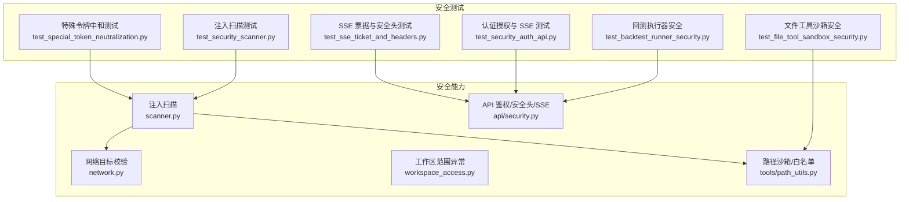
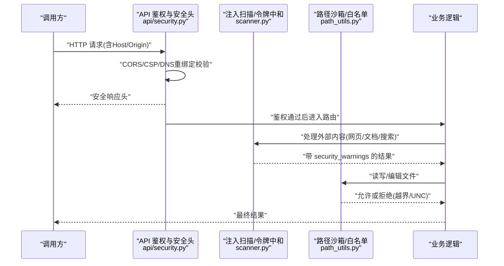
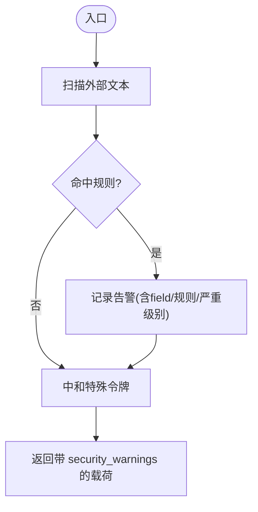
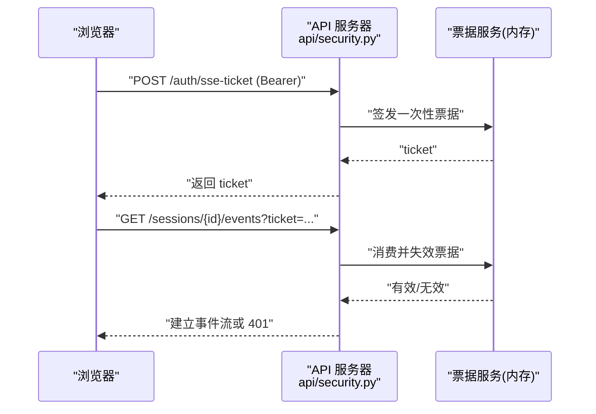
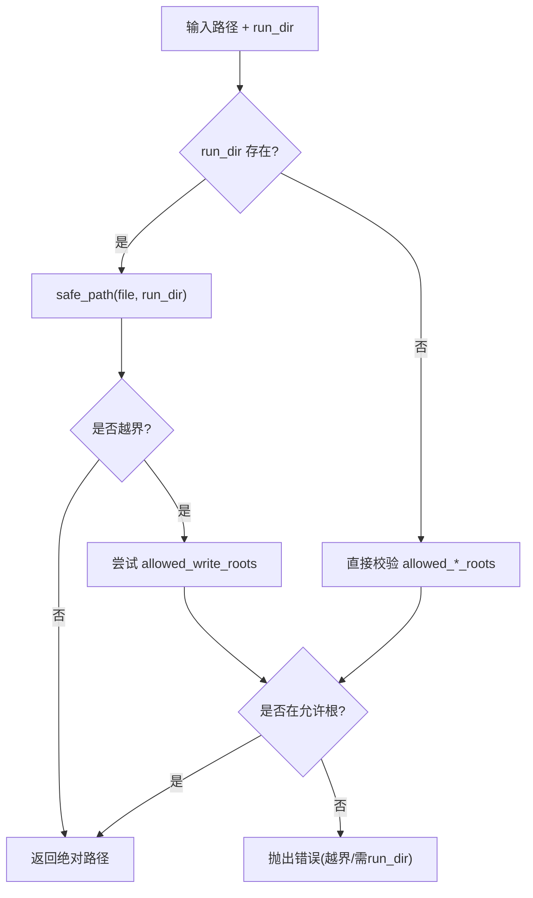
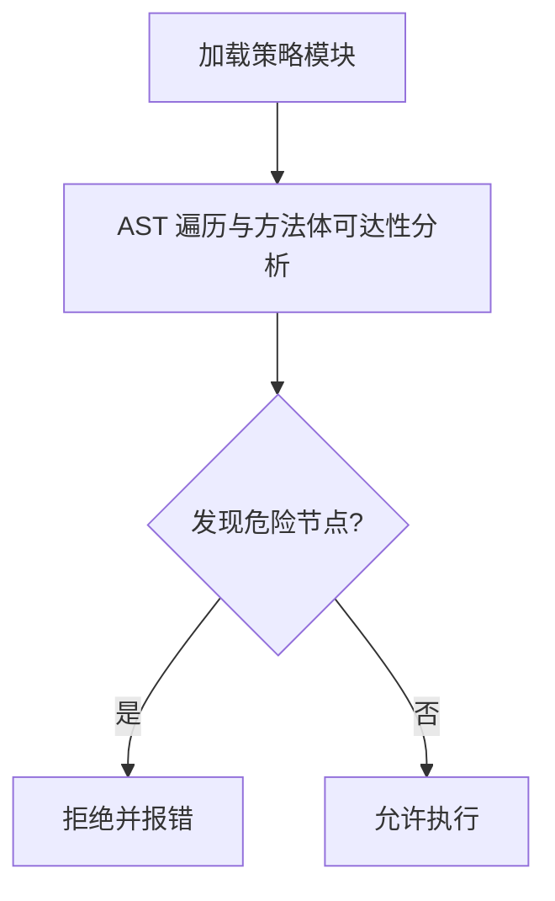
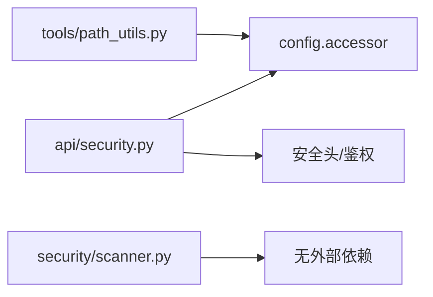

# 安全测试

<cite>
**本文引用的文件**
- [agent/src/security/scanner.py](file://agent/src/security/scanner.py)
- [agent/src/security/network.py](file://agent/src/security/network.py)
- [agent/src/security/workspace_access.py](file://agent/src/security/workspace_access.py)
- [agent/src/api/security.py](file://agent/src/api/security.py)
- [agent/src/tools/path_utils.py](file://agent/src/tools/path_utils.py)
- [agent/tests/test_backtest_runner_security.py](file://agent/tests/test_backtest_runner_security.py)
- [agent/tests/test_file_tool_sandbox_security.py](file://agent/tests/test_file_tool_sandbox_security.py)
- [agent/tests/test_security_scanner.py](file://agent/tests/test_security_scanner.py)
- [agent/tests/test_security_auth_api.py](file://agent/tests/test_security_auth_api.py)
- [agent/tests/test_special_token_neutralization.py](file://agent/tests/test_special_token_neutralization.py)
- [agent/tests/test_sse_ticket_and_headers.py](file://agent/tests/test_sse_ticket_and_headers.py)
</cite>

## 目录
1. [简介](#简介)
2. [项目结构](#项目结构)
3. [核心组件](#核心组件)
4. [架构总览](#架构总览)
5. [详细组件分析](#详细组件分析)
6. [依赖关系分析](#依赖关系分析)
7. [性能与安全特性](#性能与安全特性)
8. [故障排查指南](#故障排查指南)
9. [结论](#结论)
10. [附录：合规与自动化](#附录合规与自动化)

## 简介
本文件面向 Vibe-Trading 的安全测试，覆盖以下关键主题：
- 安全漏洞扫描：外部内容注入检测、特殊控制令牌中和、敏感信息泄露提示。
- 权限验证测试：API 鉴权、回环/跨站请求防护、SSE 票据机制。
- 输入验证测试：路径沙箱、运行目录白名单、参数校验。
- 沙箱执行测试：回测执行器代码注入防护、工具沙箱边界。
- 数据泄露防护：日志脱敏、CORS/CSP 策略、网络目标校验。
- 认证授权与会话安全：Bearer 鉴权、单票票据、跨站浏览器请求拒绝。
- 自动化与审计：回归测试、报告生成、合规检查建议。

## 项目结构
围绕安全能力，仓库在 agent 层提供了安全模块与大量安全回归测试：
- 安全能力
  - 注入扫描与内容中和：scanner.py
  - 网络目标校验桥接：network.py
  - 工作区范围异常定义：workspace_access.py
  - API 鉴权、CORS/CSP、DNS 重绑定防护、SSE 票据：api/security.py
  - 文件路径沙箱与白名单：tools/path_utils.py
- 安全测试
  - 回测执行器安全：test_backtest_runner_security.py
  - 文件工具沙箱安全：test_file_tool_sandbox_security.py
  - 注入扫描与内容过滤：test_security_scanner.py、test_special_token_neutralization.py
  - 认证授权与 SSE：test_security_auth_api.py、test_sse_ticket_and_headers.py

**图示来源**
- [agent/src/security/scanner.py:1-264](file://agent/src/security/scanner.py#L1-L264)
- [agent/src/security/network.py:1-11](file://agent/src/security/network.py#L1-L11)
- [agent/src/security/workspace_access.py:1-15](file://agent/src/security/workspace_access.py#L1-L15)
- [agent/src/api/security.py:1-670](file://agent/src/api/security.py#L1-L670)
- [agent/src/tools/path_utils.py:1-404](file://agent/src/tools/path_utils.py#L1-L404)

**章节来源**
- [agent/src/security/scanner.py:1-264](file://agent/src/security/scanner.py#L1-L264)
- [agent/src/security/network.py:1-11](file://agent/src/security/network.py#L1-L11)
- [agent/src/security/workspace_access.py:1-15](file://agent/src/security/workspace_access.py#L1-L15)
- [agent/src/api/security.py:1-670](file://agent/src/api/security.py#L1-L670)
- [agent/src/tools/path_utils.py:1-404](file://agent/src/tools/path_utils.py#L1-L404)

## 核心组件
- 注入扫描与内容中和
  - 对外部文本进行模式匹配，标注“prompt_injection”类型告警，并对聊天模板控制令牌插入零宽空格以破坏角色伪造。
  - 提供字段选择器遍历，对嵌套 JSON 中的多个字符串字段进行扫描与中和。
- API 鉴权与安全头
  - 统一鉴权依赖：支持 Bearer Token、本地回环信任、Docker 网关白名单；禁止凭据型 CORS 通配符。
  - 响应头：CSP（区分文档页与应用页）、X-Content-Type-Options、X-Frame-Options、Permissions-Policy、Referrer-Policy。
  - DNS 重绑定防护：拒绝不可信 Host 的本地请求。
  - SSE 票据：短生命周期、一次性票据，避免长密钥落入 URL。
  - 访问日志脱敏：对查询串中的敏感键值进行遮蔽。
- 路径沙箱与白名单
  - 三类路径安全：工具沙箱 safe_path、用户导入路径 safe_user_path/safe_document_path、运行目录 safe_run_dir。
  - 通过环境变量配置允许写入/读取/运行根目录，拒绝 UNC 路径与越界路径。
  - resolve_safe_path 支持 run_dir 优先解析，失败时回退到允许根集合。

**章节来源**
- [agent/src/security/scanner.py:16-220](file://agent/src/security/scanner.py#L16-L220)
- [agent/src/api/security.py:69-253](file://agent/src/api/security.py#L69-L253)
- [agent/src/api/security.py:300-622](file://agent/src/api/security.py#L300-L622)
- [agent/src/tools/path_utils.py:46-240](file://agent/src/tools/path_utils.py#L46-L240)

## 架构总览
下图展示了从外部输入到安全边界的处理流程：外部内容经注入扫描与令牌中和后进入下游；API 请求先经过 DNS 重绑定与 CORS/CSP 校验，再进行鉴权；文件操作走路径沙箱与白名单校验。

**图示来源**
- [agent/src/api/security.py:166-253](file://agent/src/api/security.py#L166-L253)
- [agent/src/security/scanner.py:145-220](file://agent/src/security/scanner.py#L145-L220)
- [agent/src/tools/path_utils.py:185-240](file://agent/src/tools/path_utils.py#L185-L240)

## 详细组件分析

### 组件A：注入扫描与内容过滤
- 设计要点
  - 规则集：指令覆盖、系统提示泄露、角色冒充、密钥泄露、工具滥用等模式。
  - 特殊令牌中和：识别 ChatML/Llama/Gemma 等控制标记并插入零宽空格，使其无法被分词器识别为角色边界。
  - 字段选择器：支持 results.*.snippet 等路径，批量扫描与原地中和。
- 测试覆盖
  - 指令覆盖与系统提示泄露检测。
  - 普通金融文本不被误报。
  - web_reader/web_search/doc_reader 返回体中注入 security_warnings。
  - 特殊令牌中和前后对比，确保原 token 不再可被识别。

**图示来源**
- [agent/src/security/scanner.py:145-220](file://agent/src/security/scanner.py#L145-L220)

**章节来源**
- [agent/src/security/scanner.py:16-220](file://agent/src/security/scanner.py#L16-L220)
- [agent/tests/test_security_scanner.py:17-108](file://agent/tests/test_security_scanner.py#L17-L108)
- [agent/tests/test_special_token_neutralization.py:20-38](file://agent/tests/test_special_token_neutralization.py#L20-L38)

### 组件B：API 鉴权、CORS/CSP 与 SSE 票据
- 设计要点
  - 鉴权优先级：已配置 API_KEY 时所有客户端均需 Bearer；未配置时仅信任本地回环（含受信任 Docker 网关）。
  - 跨站浏览器请求拒绝：基于 sec-fetch-site 与 Origin 校验。
  - CSP：应用页严格限制，文档页放宽至 CDN；支持 Report-Only 开关。
  - SSE 票据：一次一签、短时有效，避免长密钥出现在 URL。
  - 访问日志脱敏：遮蔽 api_key/ticket 等查询参数值。
- 测试覆盖
  - 远程写操作在无 Key 时拒绝；本地开发模式允许。
  - 配置 Key 后，本地/远程均需 Bearer。
  - DNS 重绑定 Host 被拒绝，阻止敏感写操作。
  - SSE 事件流不接受长密钥查询串，但接受票据。
  - 关闭/开启 CSP Report-Only 的行为差异。

**图示来源**
- [agent/src/api/security.py:300-340](file://agent/src/api/security.py#L300-L340)
- [agent/src/api/security.py:591-622](file://agent/src/api/security.py#L591-L622)

**章节来源**
- [agent/src/api/security.py:69-253](file://agent/src/api/security.py#L69-L253)
- [agent/src/api/security.py:300-622](file://agent/src/api/security.py#L300-L622)
- [agent/tests/test_security_auth_api.py:43-224](file://agent/tests/test_security_auth_api.py#L43-L224)
- [agent/tests/test_security_auth_api.py:414-449](file://agent/tests/test_security_auth_api.py#L414-L449)
- [agent/tests/test_sse_ticket_and_headers.py:161-194](file://agent/tests/test_sse_ticket_and_headers.py#L161-L194)

### 组件C：路径沙箱与文件工具安全
- 设计要点
  - 三类路径校验：safe_path（工具沙箱）、safe_user_path/safe_document_path（导入/文档）、safe_run_dir（运行目录）。
  - 白名单：通过环境变量配置允许的读/写/运行根目录，默认包含 uploads/runs/import 等。
  - resolve_safe_path：优先按 run_dir 解析，失败则回退到允许根集合；拒绝 UNC 与越界路径。
- 测试覆盖
  - 未配置 run_dir 时写操作拒绝。
  - read/write/edit 在允许根内成功，越界拒绝。
  - 读写隔离：只读根不能写，写根可写。
  - tilde 展开与相对路径正确解析。

**图示来源**
- [agent/src/tools/path_utils.py:185-240](file://agent/src/tools/path_utils.py#L185-L240)
- [agent/src/tools/path_utils.py:243-404](file://agent/src/tools/path_utils.py#L243-L404)

**章节来源**
- [agent/src/tools/path_utils.py:46-240](file://agent/src/tools/path_utils.py#L46-L240)
- [agent/tests/test_file_tool_sandbox_security.py:21-165](file://agent/tests/test_file_tool_sandbox_security.py#L21-L165)

### 组件D：回测执行器安全性（代码注入防护）
- 设计要点
  - 对生成的策略代码进行 AST 级扫描：拒绝顶层/类级可执行语句、危险函数调用、动态导入、对象图遍历、文件系统写入等。
  - 保留合法数学/量化库导入与只读文件访问。
  - 针对绕过手段（别名、importlib、sys.modules、pickle/marshal、shutil、webbrowser、gc）进行阻断。
- 测试覆盖
  - 顶层/类级执行、方法体内危险操作、动态模块可达性、Pathlib 写、os 文件系统变更、对象图遍历均被拒绝。
  - 正常策略（pandas/numpy 计算、只读文件、纯辅助函数）可通过。

**图示来源**
- [agent/tests/test_backtest_runner_security.py:17-725](file://agent/tests/test_backtest_runner_security.py#L17-L725)

**章节来源**
- [agent/tests/test_backtest_runner_security.py:17-725](file://agent/tests/test_backtest_runner_security.py#L17-L725)

### 组件E：网络通信安全与 SSRF 防护
- 设计要点
  - network.py 暴露 validate_url_target / validate_resolved_url，用于通道适配器的目标校验。
  - API 层设置严格的 CSP/Permissions-Policy，限制资源加载与功能使用。
  - 拒绝跨站浏览器请求，防止 CSRF 与同源策略绕过。
- 测试覆盖
  - 文档页与应用页 CSP 差异。
  - Report-Only 模式切换。
  - 跨站请求被拒。

**章节来源**
- [agent/src/security/network.py:1-11](file://agent/src/security/network.py#L1-L11)
- [agent/src/api/security.py:180-253](file://agent/src/api/security.py#L180-L253)
- [agent/tests/test_sse_ticket_and_headers.py:161-194](file://agent/tests/test_sse_ticket_and_headers.py#L161-L194)

## 依赖关系分析
- 低耦合高内聚
  - scanner.py 不依赖网络与文件系统，专注文本扫描与中和。
  - path_utils.py 封装路径安全，供各工具复用。
  - api/security.py 集中鉴权与安全头，作为网关式中间件。
- 外部依赖
  - FastAPI/HTTP 框架用于鉴权与中间件。
  - 标准库 re/ipaddress/secrets/time 用于正则、IP 判断、票据生成与过期。
- 潜在循环依赖
  - 通过延迟导入（如 get_env_config）避免启动期循环。

**图示来源**
- [agent/src/api/security.py:1-670](file://agent/src/api/security.py#L1-L670)
- [agent/src/tools/path_utils.py:1-404](file://agent/src/tools/path_utils.py#L1-L404)
- [agent/src/security/scanner.py:1-264](file://agent/src/security/scanner.py#L1-L264)

**章节来源**
- [agent/src/api/security.py:1-670](file://agent/src/api/security.py#L1-L670)
- [agent/src/tools/path_utils.py:1-404](file://agent/src/tools/path_utils.py#L1-L404)
- [agent/src/security/scanner.py:1-264](file://agent/src/security/scanner.py#L1-L264)

## 性能与安全特性
- 注入扫描
  - 正则匹配与零宽空格插入均为 O(n)，对大文本影响有限；字段选择器按需遍历，避免全量扫描。
- 鉴权与票据
  - 票据内存存储+单调时钟过期，清理与消费加锁，避免竞争；HMAC 比较常量时间。
- 路径校验
  - 基于 pathlib.resolve 与 is_relative_to，开销小且准确；默认根集合固定，查找线性。
- 安全头
  - 每次响应设置必要头部，开销极低；Report-Only 便于灰度。

[本节为通用指导，无需特定文件引用]

## 故障排查指南
- 常见问题
  - 401/403：检查是否配置 API_AUTH_KEY；本地/远程来源是否符合预期；Host/Origin 是否可信。
  - 路径越界：确认 run_dir 或 allowed_*_roots 配置；检查 UNC 路径与 ~ 展开。
  - 注入告警：查看 security_warnings 的 rule_id 与 field，定位外部内容来源。
  - SSE 连接失败：确认已通过 /auth/sse-ticket 获取票据；票据是否已过期或被重复使用。
- 修复验证
  - 使用对应测试用例复现并验证修复：例如 test_security_auth_api.py 中的 DNS 重绑定与 SSE 票据用例；test_file_tool_sandbox_security.py 的路径越界用例；test_security_scanner.py 的注入扫描用例。

**章节来源**
- [agent/tests/test_security_auth_api.py:237-340](file://agent/tests/test_security_auth_api.py#L237-L340)
- [agent/tests/test_file_tool_sandbox_security.py:46-165](file://agent/tests/test_file_tool_sandbox_security.py#L46-L165)
- [agent/tests/test_security_scanner.py:17-108](file://agent/tests/test_security_scanner.py#L17-L108)

## 结论
Vibe-Trading 在安全方面形成了“扫描—鉴权—沙箱—审计”的闭环：
- 外部内容注入通过模式扫描与令牌中和降低风险。
- API 层通过严格鉴权、CORS/CSP、DNS 重绑定防护与 SSE 票据保障通信安全。
- 文件与运行目录通过白名单与路径沙箱限制执行面。
- 回测执行器采用 AST 级静态分析与可达性检查，阻断代码注入。
- 丰富的回归测试覆盖常见攻击面，便于持续集成与快速修复。

[本节为总结性内容，无需特定文件引用]

## 附录：合规与自动化
- 安全测试自动化
  - 将安全相关测试纳入 CI：pytest 运行全部安全用例，失败即阻断合并。
  - 新增规则/路径白名单时，同步补充对应测试用例。
- 安全审计报告
  - 利用 with_security_warnings 输出结构化告警，便于审计与溯源。
  - 结合访问日志脱敏，避免密钥泄漏。
- 合规性检查建议
  - 强制启用 CSP 严格模式（非 Report-Only），仅在灰度阶段临时开启。
  - 生产环境必须配置 API_AUTH_KEY，禁用无 Key 的远程访问。
  - 定期审查 allowed_*_roots 与环境变量，最小化权限面。

[本节为通用指导，无需特定文件引用]