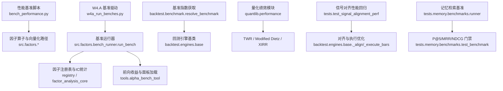
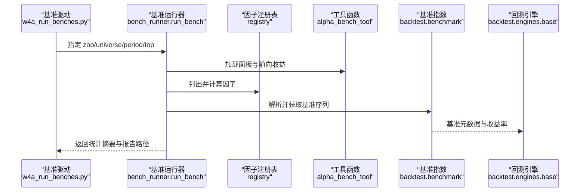
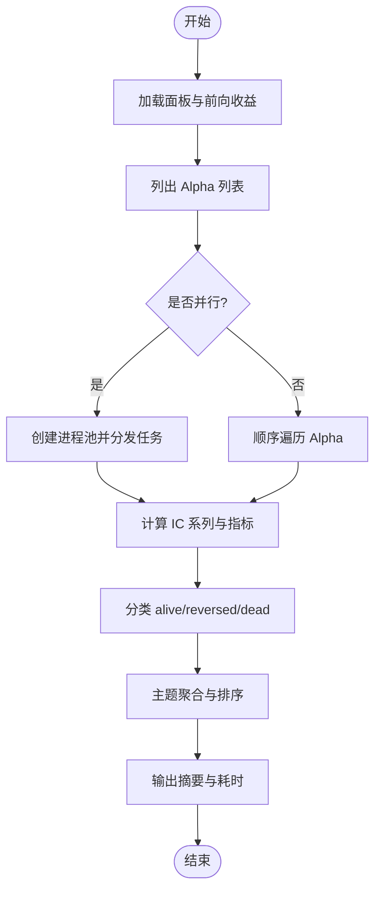
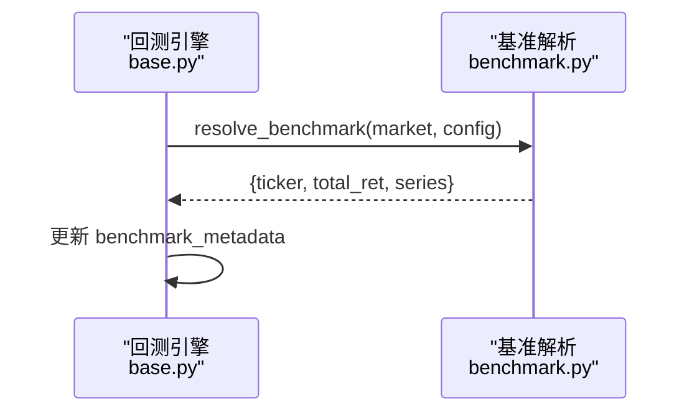
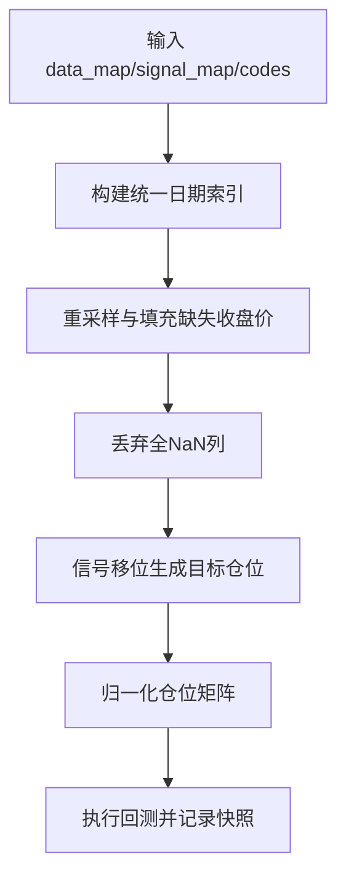
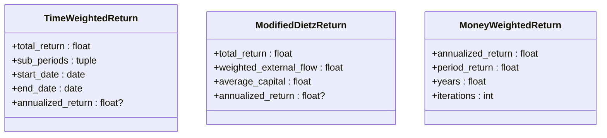
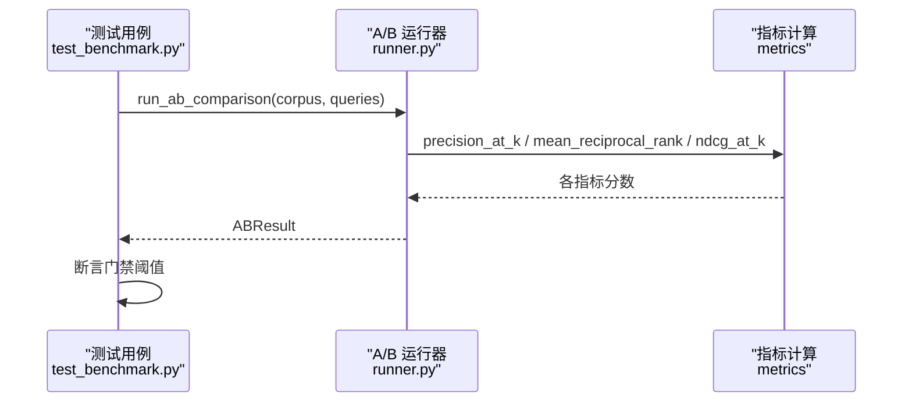
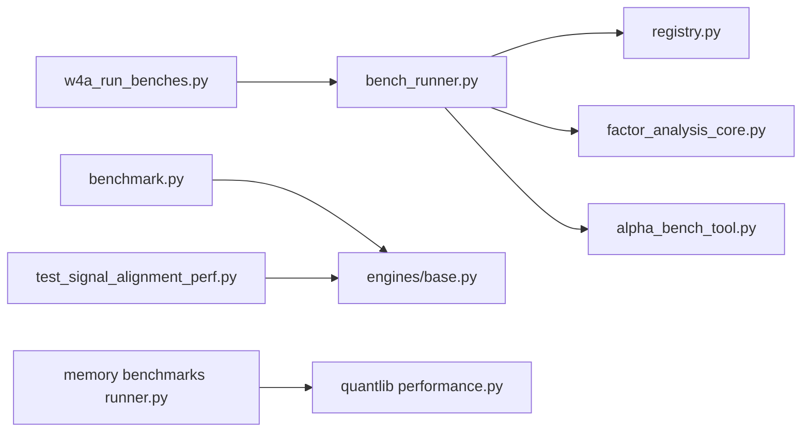

# 性能测试

<cite>
**本文引用的文件**
- [bench_performance.py](file://agent/scripts/bench_performance.py)
- [w4a_run_benches.py](file://agent/scripts/w4a_run_benches.py)
- [bench_runner.py](file://agent/src/factors/bench_runner.py)
- [benchmark.py](file://agent/backtest/benchmark.py)
- [base.py](file://agent/backtest/engines/base.py)
- [performance.py](file://agent/src/quantlib/performance.py)
- [test_signal_alignment_perf.py](file://agent/tests/test_signal_alignment_perf.py)
- [runner.py](file://agent/tests/memory/benchmarks/runner.py)
- [test_benchmark.py](file://agent/tests/memory/benchmarks/test_benchmark.py)
- [test_upload_api.py](file://agent/tests/test_upload_api.py)
</cite>

## 目录
1. [简介](#简介)
2. [项目结构](#项目结构)
3. [核心组件](#核心组件)
4. [架构总览](#架构总览)
5. [详细组件分析](#详细组件分析)
6. [依赖关系分析](#依赖关系分析)
7. [性能考量](#性能考量)
8. [故障排查指南](#故障排查指南)
9. [结论](#结论)
10. [附录](#附录)

## 简介
本文件为 Vibe-Trading 的性能测试文档，聚焦以下目标：
- 建立可复用的性能基准框架，覆盖因子计算、回测引擎、记忆检索与数据处理等关键路径。
- 定义明确的性能指标、基线与回归检测机制，支持自动化执行与报告生成。
- 提供负载测试、压力测试与容量规划测试方法，并给出分布式与并发场景的测试策略。
- 识别常见瓶颈并提供优化建议，同时说明如何集成监控与持续改进。

## 项目结构
仓库中与性能测试相关的代码主要分布在以下位置：
- 脚本层：用于驱动端到端基准与汇总报告
- 因子与回测：包含并行化基准运行、基准数据获取与引擎内部对齐/执行优化
- 量化绩效：时间加权收益、修正 Dietz、XIRR 等指标实现
- 记忆系统基准：A/B 对比、检索质量指标与门禁断言
- 信号对齐与回测性能回归：严格等价性与耗时门限

图表来源
- [bench_performance.py:1-134](file://agent/scripts/bench_performance.py#L1-L134)
- [w4a_run_benches.py:1-172](file://agent/scripts/w4a_run_benches.py#L1-L172)
- [bench_runner.py:1-409](file://agent/src/factors/bench_runner.py#L1-L409)
- [benchmark.py:1-162](file://agent/backtest/benchmark.py#L1-L162)
- [base.py:726-766](file://agent/backtest/engines/base.py#L726-L766)
- [performance.py:1-800](file://agent/src/quantlib/performance.py#L1-L800)
- [test_signal_alignment_perf.py:1-836](file://agent/tests/test_signal_alignment_perf.py#L1-L836)
- [runner.py:1-480](file://agent/tests/memory/benchmarks/runner.py#L1-L480)
- [test_benchmark.py:1-215](file://agent/tests/memory/benchmarks/test_benchmark.py#L1-L215)

章节来源
- [bench_performance.py:1-134](file://agent/scripts/bench_performance.py#L1-L134)
- [w4a_run_benches.py:1-172](file://agent/scripts/w4a_run_benches.py#L1-L172)
- [bench_runner.py:1-409](file://agent/src/factors/bench_runner.py#L1-L409)
- [benchmark.py:1-162](file://agent/backtest/benchmark.py#L1-L162)
- [base.py:726-766](file://agent/backtest/engines/base.py#L726-L766)
- [performance.py:1-800](file://agent/src/quantlib/performance.py#L1-L800)
- [test_signal_alignment_perf.py:1-836](file://agent/tests/test_signal_alignment_perf.py#L1-L836)
- [runner.py:1-480](file://agent/tests/memory/benchmarks/runner.py#L1-L80)
- [test_benchmark.py:1-215](file://agent/tests/memory/benchmarks/test_benchmark.py#L1-L215)

## 核心组件
- 因子基准运行器：按 zoo/universe/period 批量计算 IC 系列，统计 IR、分类（alive/reversed/dead），支持多进程并行与进度回调。
- 基准指数解析：根据市场选择合适基准并拉取收益率序列，供回测比较使用。
- 回测引擎对齐与执行：对 OHLCV 与信号进行对齐、填充缺失值、归一化仓位，并进行高效执行；提供严格的等价性回归与性能门限。
- 量化绩效：时间加权收益（TWR）、修正 Dietz、XIRR，处理外部现金流与估值序列，保证指标严谨性。
- 记忆检索基准：A/B 对比（BM25+重要性权重 vs 纯词频），以 P@5、MRR、NDCG@5 评估检索质量，设置门禁阈值。
- 上传流控与内存保护：通过流式上传与大小限制防止内存溢出，保障服务稳定性。

章节来源
- [bench_runner.py:1-409](file://agent/src/factors/bench_runner.py#L1-L409)
- [benchmark.py:1-162](file://agent/backtest/benchmark.py#L1-L162)
- [test_signal_alignment_perf.py:1-836](file://agent/tests/test_signal_alignment_perf.py#L1-L836)
- [performance.py:1-800](file://agent/src/quantlib/performance.py#L1-L800)
- [runner.py:1-480](file://agent/tests/memory/benchmarks/runner.py#L1-L480)
- [test_upload_api.py:1-37](file://agent/tests/test_upload_api.py#L1-L37)

## 架构总览
下图展示从基准驱动到具体计算的调用链路与数据流转：

图表来源
- [w4a_run_benches.py:1-172](file://agent/scripts/w4a_run_benches.py#L1-L172)
- [bench_runner.py:137-409](file://agent/src/factors/bench_runner.py#L137-L409)
- [benchmark.py:40-162](file://agent/backtest/benchmark.py#L40-L162)
- [base.py:726-766](file://agent/backtest/engines/base.py#L726-L766)

## 详细组件分析

### 因子基准运行器（bench_runner）
- 功能要点：
  - 按 zoo 列出 alpha 列表，加载 universe 面板并计算前向收益。
  - 对每个 alpha 计算 IC 系列，得到 ic_mean、ic_std、IR、正比等指标。
  - 分类 alive/reversed/dead，并按主题聚合统计。
  - 支持多进程并行（ProcessPoolExecutor），通过初始化参数将大型面板与收益矩阵缓存至工作进程，减少复制开销。
  - 输出 wall_seconds 作为整体耗时，便于回归检测。
- 复杂度与优化：
  - 并行度由配置或 CPU 数决定，避免过度并行导致上下文切换成本上升。
  - 跳过异常与 SkipAlpha，确保单点失败不影响整体流程。
- 回归检测：
  - 基于 multiple_testing 校正（期望最大 IR、deflated probability）评估最佳 IR 的显著性。

图表来源
- [bench_runner.py:137-409](file://agent/src/factors/bench_runner.py#L137-L409)

章节来源
- [bench_runner.py:1-409](file://agent/src/factors/bench_runner.py#L1-L409)

### 基准指数与回测引擎集成
- 基准指数解析：
  - 根据市场类型选择合适基准 ticker，并通过 yfinance 等通用源拉取收益率序列。
  - 若无法获取则关闭基准以避免错误传播。
- 回测引擎集成：
  - 在引擎中注入基准元数据（ticker、总收益等），参与后续指标计算与比较。

图表来源
- [benchmark.py:40-162](file://agent/backtest/benchmark.py#L40-L162)
- [base.py:726-766](file://agent/backtest/engines/base.py#L726-L766)

章节来源
- [benchmark.py:1-162](file://agent/backtest/benchmark.py#L1-L162)
- [base.py:726-766](file://agent/backtest/engines/base.py#L726-L766)

### 信号对齐与回测执行优化
- 对齐逻辑：
  - 统一时间索引，前向填充缺失收盘价（ffill limit），丢弃全 NaN 列。
  - 信号移位后生成目标仓位矩阵，并进行归一化。
  - 跨市场场景自动调整 ffill_limit。
- 性能目标：
  - 5000 bars × 50 symbols 的中位数耗时 < 50ms（CI 安全门限）。
  - 与参考 pandas 路径结果完全一致（元素级相等），保证优化不改变业务语义。
- 执行优化：
  - _execute_bars 快速路径与慢速路径等价性验证。
  - 实例属性清理，避免内存泄漏。

图表来源
- [test_signal_alignment_perf.py:86-137](file://agent/tests/test_signal_alignment_perf.py#L86-L137)
- [test_signal_alignment_perf.py:431-463](file://agent/tests/test_signal_alignment_perf.py#L431-L463)

章节来源
- [test_signal_alignment_perf.py:1-836](file://agent/tests/test_signal_alignment_perf.py#L1-L836)

### 量化绩效指标（TWR / Modified Dietz / XIRR）
- 时间加权收益（TWR）：
  - 对每段区间去除外部现金流后计算区间收益，再几何连乘得到总收益。
  - 支持 flow_timing 控制边界归属，严格校验投资基数为正。
- 修正 Dietz：
  - 日加权近似资金加权收益，适用于仅有首尾估值与现金流的情况。
- XIRR：
  - 二分法求解内部收益率，处理溢出与不可解情况，暴露迭代次数以便审计。

图表来源
- [performance.py:155-269](file://agent/src/quantlib/performance.py#L155-L269)

章节来源
- [performance.py:1-800](file://agent/src/quantlib/performance.py#L1-L800)

### 记忆检索基准（A/B 对比）
- 模式对比：
  - Baseline：纯词频重叠评分。
  - Treatment：BM25 风格相关性评分 + 重要性权重（质量分、衰减、访问频率）。
- 指标：
  - P@5、MRR、NDCG@5，按难度分层统计。
- 门禁：
  - Treatment 相对 Baseline 的 P@5 提升需 ≥10%，MRR/NDCG@5 不得退化超过 5%。
- 报告：
  - 生成 bench_report.json，包含时间戳、规模、指标与门禁结果。

图表来源
- [runner.py:318-413](file://agent/tests/memory/benchmarks/runner.py#L318-L413)
- [test_benchmark.py:61-90](file://agent/tests/memory/benchmarks/test_benchmark.py#L61-L90)

章节来源
- [runner.py:1-480](file://agent/tests/memory/benchmarks/runner.py#L1-L480)
- [test_benchmark.py:1-215](file://agent/tests/memory/benchmarks/test_benchmark.py#L1-L215)

### 操作符与权益计算基准
- 因子操作符基准：
  - 对比旧 pandas 路径与新向量化路径，测量 ts_rank、ts_argmax、ts_argmin、decay_linear 等算子的耗时。
- 权益计算基准：
  - 对比向量化与循环路径的 _calc_equity 耗时，衡量速度提升倍数。

章节来源
- [bench_performance.py:19-116](file://agent/scripts/bench_performance.py#L19-L116)

## 依赖关系分析
- 基准驱动依赖基准运行器与工具函数，后者依赖因子注册表与量化统计模块。
- 回测引擎依赖基准指数解析，以获得可比基准。
- 信号对齐与执行优化位于回测引擎内部，受测试严格约束。
- 记忆检索基准独立于交易路径，但可作为系统检索能力的性能与质量门禁。

图表来源
- [w4a_run_benches.py:1-172](file://agent/scripts/w4a_run_benches.py#L1-L172)
- [bench_runner.py:1-409](file://agent/src/factors/bench_runner.py#L1-L409)
- [benchmark.py:1-162](file://agent/backtest/benchmark.py#L1-L162)
- [base.py:726-766](file://agent/backtest/engines/base.py#L726-L766)
- [test_signal_alignment_perf.py:1-836](file://agent/tests/test_signal_alignment_perf.py#L1-L836)
- [runner.py:1-480](file://agent/tests/memory/benchmarks/runner.py#L1-L480)
- [performance.py:1-800](file://agent/src/quantlib/performance.py#L1-L800)

章节来源
- [w4a_run_benches.py:1-172](file://agent/scripts/w4a_run_benches.py#L1-L172)
- [bench_runner.py:1-409](file://agent/src/factors/bench_runner.py#L1-L409)
- [benchmark.py:1-162](file://agent/backtest/benchmark.py#L1-L162)
- [base.py:726-766](file://agent/backtest/engines/base.py#L726-L766)
- [test_signal_alignment_perf.py:1-836](file://agent/tests/test_signal_alignment_perf.py#L1-L836)
- [runner.py:1-480](file://agent/tests/memory/benchmarks/runner.py#L1-L480)
- [performance.py:1-800](file://agent/src/quantlib/performance.py#L1-L800)

## 性能考量
- 并发与并行：
  - 因子基准使用 ProcessPoolExecutor，合理设置 workers 数量，避免过多上下文切换。
  - 大对象（面板、收益矩阵）在工作进程内缓存，降低序列化与传输成本。
- 向量化与算法优化：
  - 信号对齐采用向量化与 numpy 前向填充，显著提升大规模数据下的性能。
  - 操作符路径对比显示向量化带来的数量级加速。
- 内存与资源管理：
  - 上传接口流式处理并限制大小，防止内存耗尽。
  - 回测执行后清理临时数组与映射，避免长期驻留。
- 指标与基线：
  - 因子基准：IR、IC 均值与正比、t 统计、multiple testing 校正。
  - 对齐性能：中位数耗时门限（<50ms）。
  - 记忆检索：P@5 提升≥10%，MRR/NDCG@5 退化≤5%。
  - 量化绩效：TWR、Modified Dietz、XIRR 的年化与区间收益。
- 回归检测：
  - 对齐结果与参考路径元素级相等。
  - 权益曲线一致性（容差 1e-6）。
  - 门禁断言在测试中强制通过。

[本节为通用指导，无需特定文件引用]

## 故障排查指南
- 基准运行失败：
  - 检查 universe 加载与前向收益计算是否抛出异常，定位数据源问题。
  - 查看 skipped 列表中的 reason 与 kind，区分 typed 与 unexpected。
- 对齐性能退化：
  - 确认 ffill_limit 与市场检测是否正确，检查是否存在大量全 NaN 列。
  - 比对参考路径结果，定位差异来源。
- 记忆检索门禁失败：
  - 检查 corpus 与 queries 规模与难度分布，确认 BM25 参数与重要性权重配置。
  - 查看 by_difficulty 指标，定位困难查询是否受益。
- 上传内存溢出：
  - 调整 MAX_UPLOAD_SIZE 与 chunk size，确保流式处理生效。
  - 验证清理路径是否被正确触发。

章节来源
- [bench_runner.py:195-210](file://agent/src/factors/bench_runner.py#L195-L210)
- [test_signal_alignment_perf.py:431-463](file://agent/tests/test_signal_alignment_perf.py#L431-L463)
- [test_benchmark.py:61-90](file://agent/tests/memory/benchmarks/test_benchmark.py#L61-L90)
- [test_upload_api.py:1-37](file://agent/tests/test_upload_api.py#L1-L37)

## 结论
Vibe-Trading 提供了完善的性能测试体系，覆盖因子计算、回测引擎、记忆检索与量化绩效等关键路径。通过明确的指标定义、基线与门禁断言，结合并行化与向量化优化，实现了高吞吐与低延迟的目标。建议在 CI 中持续运行这些基准，结合报告与监控，及时发现性能回归并推动优化。

[本节为总结，无需特定文件引用]

## 附录
- 负载测试建议：
  - 增加 n_workers 与 n_total，观察基准运行时间与吞吐变化。
  - 模拟不同 universe 与 period，评估数据规模对性能的影响。
- 压力测试建议：
  - 在高并发下运行基准驱动，观察进程池与内存占用。
  - 针对上传接口进行大文件与高频请求压测。
- 容量规划建议：
  - 基于对齐性能门限与基准耗时，估算可支撑的最大符号数与时间跨度。
  - 结合量化绩效计算的资源消耗，规划服务器规格。
- 自动化与报告：
  - 使用 w4a_run_benches.py 生成 HTML 与 JSON 报告，纳入版本管理与发布流程。
  - 将门禁断言集成到 CI，失败时阻断合并。
- 监控集成：
  - 在基准运行中埋点关键指标（wall_seconds、skipped、by_theme），接入监控系统。
  - 对回测引擎与对齐路径添加性能探针，持续跟踪趋势。

[本节为通用指导，无需特定文件引用]