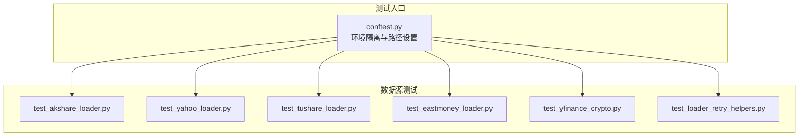
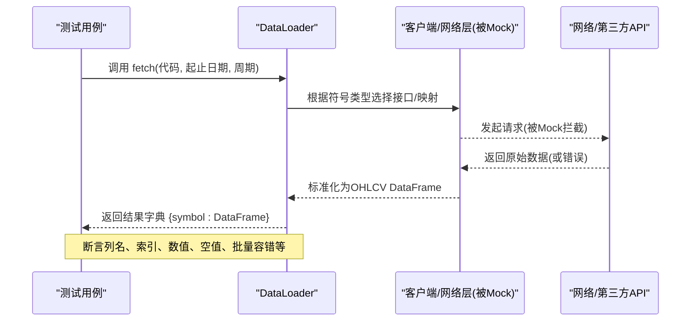
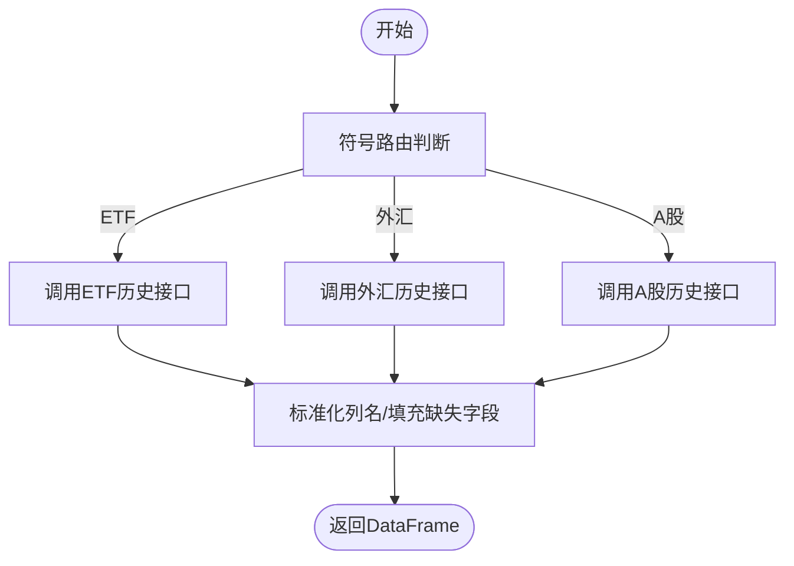
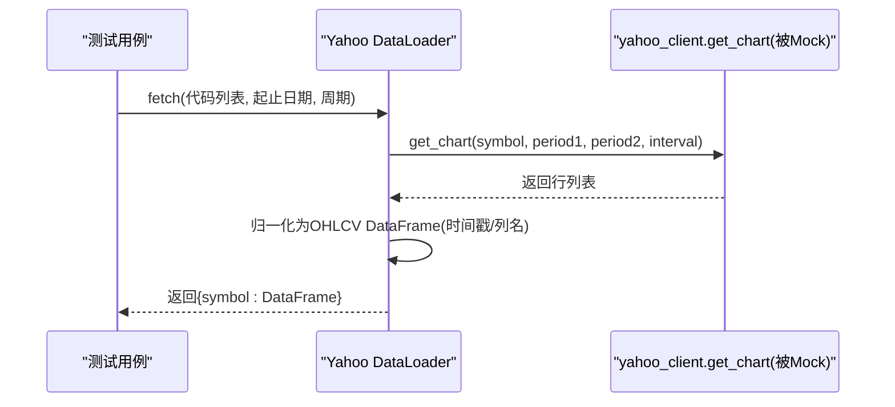
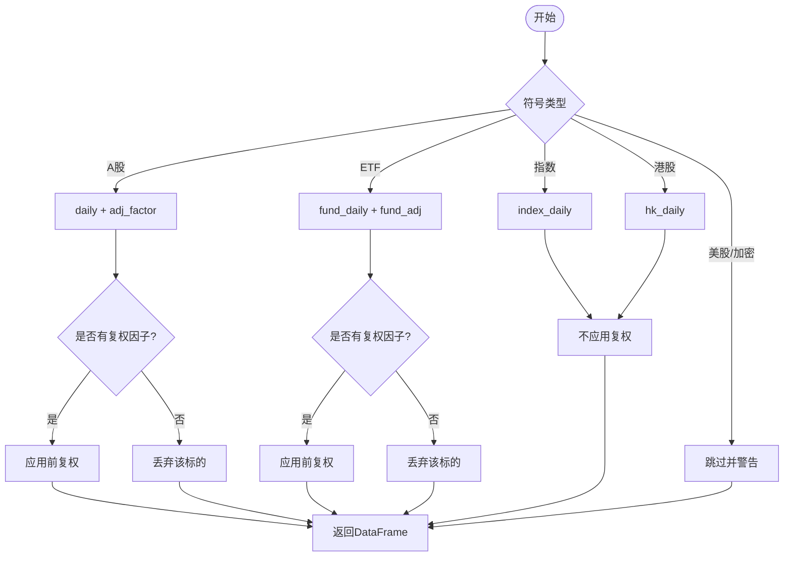
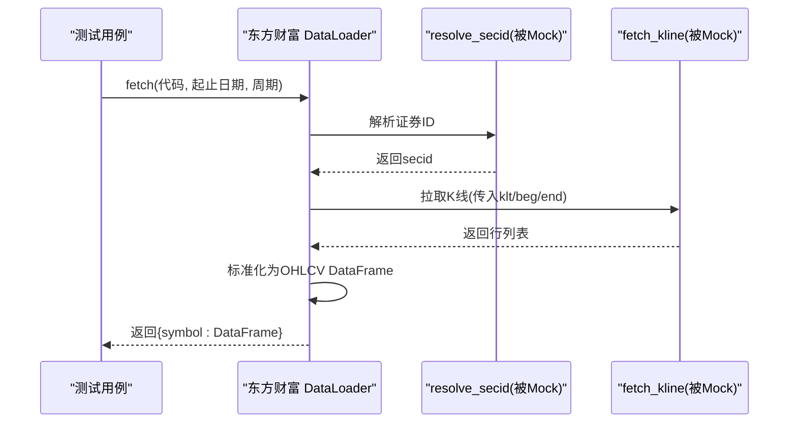
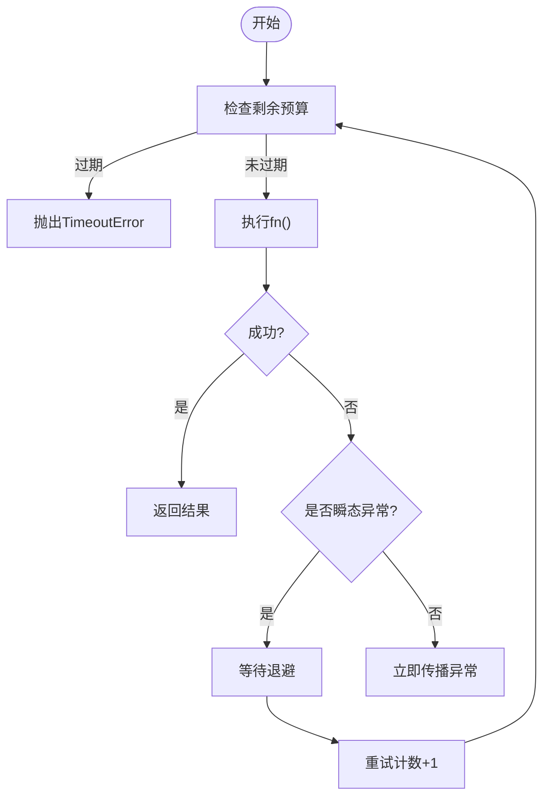
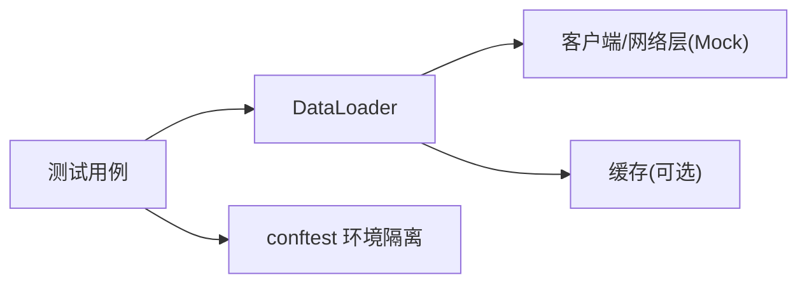

# 数据源测试

<cite>
**本文引用的文件**
- [agent/tests/test_akshare_loader.py](file://agent/tests/test_akshare_loader.py)
- [agent/tests/test_yahoo_loader.py](file://agent/tests/test_yahoo_loader.py)
- [agent/tests/test_tushare_loader.py](file://agent/tests/test_tushare_loader.py)
- [agent/tests/test_loader_retry_helpers.py](file://agent/tests/test_loader_retry_helpers.py)
- [agent/tests/test_eastmoney_loader.py](file://agent/tests/test_eastmoney_loader.py)
- [agent/tests/test_yfinance_crypto.py](file://agent/tests/test_yfinance_crypto.py)
- [agent/tests/conftest.py](file://agent/tests/conftest.py)
</cite>

## 目录
1. [简介](#简介)
2. [项目结构](#项目结构)
3. [核心组件](#核心组件)
4. [架构总览](#架构总览)
5. [详细组件分析](#详细组件分析)
6. [依赖关系分析](#依赖关系分析)
7. [性能考量](#性能考量)
8. [故障排查指南](#故障排查指南)
9. [结论](#结论)
10. [附录](#附录)

## 简介
本文件面向 Vibe-Trading 的数据源测试，系统化说明数据加载器测试框架、数据验证规则与异常处理测试。文档覆盖多数据源（AkShare、Yahoo Finance、Tushare、东方财富等）的兼容性测试、数据格式转换测试与性能基准测试思路；并给出来自实际代码库的测试示例路径，展示如何验证各数据源的正确性与稳定性。同时记录测试数据管理、Mock 数据生成、真实数据验证策略，以及网络异常处理、重试机制与超时处理的测试方法。最后总结数据源测试自动化、数据质量监控与测试数据版本管理的最佳实践。

## 项目结构
仓库在 agent/tests 下按“数据源/功能”组织大量测试用例，围绕 backtest.loaders.* 模块进行隔离化、可重复的单元测试与端到端测试。关键要点：
- 每个数据源通常有独立的测试文件，聚焦路由、映射、归一化、批量容错等特性。
- 通过 pytest fixture 与环境隔离，避免测试间污染。
- 使用 monkeypatch/patch 对第三方客户端或网络层进行 Mock，确保测试不依赖外部网络。
- 提供可选的真实 API 集成测试（如 Tushare E2E），通过环境变量开关控制。

图表来源
- [agent/tests/conftest.py:1-46](file://agent/tests/conftest.py#L1-L46)

章节来源
- [agent/tests/conftest.py:1-46](file://agent/tests/conftest.py#L1-L46)

## 核心组件
- 数据加载器测试基座
  - 环境隔离：自动保存/恢复进程环境与配置缓存，避免测试间泄漏。
  - 时间/重试加速：通过 monkeypatch 将 sleep 替换为无操作，保证重试测试快速且确定。
- 通用重试与预算工具
  - 支持瞬态异常重试、非瞬态异常立即传播、截止时间提前中止、预算检查。
  - 提供缓存键生成、读写与范围有效性判断，用于减少重复网络请求。
- 数据源专用测试
  - AkShare：符号路由（ETF/外汇/A股）、列名标准化、缺失字段填充。
  - Yahoo/YFinance：符号门控、区间映射、日内/日级时间戳归一化、批量容错。
  - Tushare：A股/指数/ETF/HK 路由、复权处理、分钟线限制、限流退避。
  - 东方财富：日期压缩、区间校验、HTTP 边界 Mock、解析链路验证。
  - YFinance Crypto：加密货币符号转换、市场注册、下载参数传递。

章节来源
- [agent/tests/conftest.py:16-46](file://agent/tests/conftest.py#L16-L46)
- [agent/tests/test_loader_retry_helpers.py:1-16](file://agent/tests/test_loader_retry_helpers.py#L1-L16)

## 架构总览
下图展示了数据源测试的整体流程：测试通过 fixture 注入 Mock，调用 DataLoader.fetch 或内部方法，断言输出 DataFrame 的结构、索引、数值与行为（如批量容错、归一化、路由）。

图表来源
- [agent/tests/test_yahoo_loader.py:229-306](file://agent/tests/test_yahoo_loader.py#L229-L306)
- [agent/tests/test_eastmoney_loader.py:75-159](file://agent/tests/test_eastmoney_loader.py#L75-L159)
- [agent/tests/test_tushare_loader.py:151-255](file://agent/tests/test_tushare_loader.py#L151-L255)

## 详细组件分析

### AkShare 数据源测试
- 符号路由与识别
  - 验证 ETF、外汇、A股的识别谓词是否正确匹配不同后缀与形式。
  - 确保 ETF 与外汇不会误路由到 A 股接口。
- 数据格式转换
  - 将不同来源的列名统一为标准 OHLCV 列名。
  - 对外汇等无成交量字段进行零填充，保证下游一致性。
- 批量与容错
  - 通过 Mock akshare 模块，验证 _fetch_one 的分发逻辑而不触发真实网络。

图表来源
- [agent/tests/test_akshare_loader.py:33-76](file://agent/tests/test_akshare_loader.py#L33-L76)
- [agent/tests/test_akshare_loader.py:119-177](file://agent/tests/test_akshare_loader.py#L119-L177)

章节来源
- [agent/tests/test_akshare_loader.py:1-177](file://agent/tests/test_akshare_loader.py#L1-L177)

### Yahoo/YFinance 数据源测试
- 符号门控与区间映射
  - 仅接受支持的权益后缀（美股、港股、印度、加拿大等），拒绝不支持的代码。
  - 将项目内周期映射为 Yahoo 字符串，处理特殊周期（如 4H 映射为 1h）。
- 时间戳归一化
  - 日线及以上统一为午夜索引；日内保留原始时间戳，保证与其他数据源对齐。
- 批量容错与失败隔离
  - 单个符号失败不影响其他符号的成功返回；空结果会被省略。
- YFinance 加密资产支持
  - 加密货币符号转换（USDT/USDC→USD）、大小写规范化、后缀处理。
  - 市场注册包含 crypto，且无需认证。

图表来源
- [agent/tests/test_yahoo_loader.py:56-128](file://agent/tests/test_yahoo_loader.py#L56-L128)
- [agent/tests/test_yahoo_loader.py:130-227](file://agent/tests/test_yahoo_loader.py#L130-L227)
- [agent/tests/test_yahoo_loader.py:229-306](file://agent/tests/test_yahoo_loader.py#L229-L306)
- [agent/tests/test_yfinance_crypto.py:16-71](file://agent/tests/test_yfinance_crypto.py#L16-L71)
- [agent/tests/test_yfinance_crypto.py:86-148](file://agent/tests/test_yfinance_crypto.py#L86-L148)

章节来源
- [agent/tests/test_yahoo_loader.py:1-320](file://agent/tests/test_yahoo_loader.py#L1-L320)
- [agent/tests/test_yfinance_crypto.py:1-148](file://agent/tests/test_yfinance_crypto.py#L1-L148)

### Tushare 数据源测试
- 符号类型路由
  - A股股票、ETF/LOF、指数、港股分别路由到对应接口；美股/加密货币不支持时发出警告并跳过。
- 复权处理
  - 股票与ETF价格需结合复权因子进行前复权；若无可用因子则直接丢弃该标的，避免回落到未复权数据。
  - 指数不进行复权。
- 分钟线限制
  - 分钟线仅支持A股股票；其他类型会跳过并提示。
- 限流退避
  - 针对配额拒绝进行指数退避重试；非限流错误立即抛出。
  - 退避计划需跨越配额窗口，耗尽后最终传播错误。

图表来源
- [agent/tests/test_tushare_loader.py:31-117](file://agent/tests/test_tushare_loader.py#L31-L117)
- [agent/tests/test_tushare_loader.py:151-255](file://agent/tests/test_tushare_loader.py#L151-L255)
- [agent/tests/test_tushare_loader.py:273-330](file://agent/tests/test_tushare_loader.py#L273-L330)
- [agent/tests/test_tushare_loader.py:409-474](file://agent/tests/test_tushare_loader.py#L409-L474)

章节来源
- [agent/tests/test_tushare_loader.py:1-474](file://agent/tests/test_tushare_loader.py#L1-L474)

### 东方财富数据源测试
- 日期压缩与区间校验
  - 将标准日期转换为紧凑格式；无效日期范围抛出异常。
- 客户端 Mock 与 HTTP 边界 Mock
  - 单元测试通过 Mock resolve_secid 与 fetch_kline 验证调用参数与输出形状。
  - 端到端测试仅 Mock HTTP 层，运行真实客户端解析逻辑，确保解析正确性。
- 批量容错
  - 单个标的解析失败不影响其他标的成功返回；空 K 线会被省略。

图表来源
- [agent/tests/test_eastmoney_loader.py:75-159](file://agent/tests/test_eastmoney_loader.py#L75-L159)
- [agent/tests/test_eastmoney_loader.py:166-192](file://agent/tests/test_eastmoney_loader.py#L166-L192)

章节来源
- [agent/tests/test_eastmoney_loader.py:1-192](file://agent/tests/test_eastmoney_loader.py#L1-L192)

### 通用重试与缓存测试
- 重试语义
  - 瞬态异常重试至最大次数；超过截止时间提前中止；非瞬态异常立即传播。
  - 支持多个瞬态异常类型元组；退避序列长度必须满足重试次数。
- 缓存机制
  - 默认关闭；可通过环境变量启用；根路径受配置保护，防止写入工作区。
  - 缓存键由 source/symbol/timeframe/start_date/end_date/fields 组成。
  - 当日结束范围不缓存（最后一根仍在形成）；损坏条目回退到在线获取。
  - 对批量加载器（如 yfinance）也适用，命中缓存时跳过批量下载。

图表来源
- [agent/tests/test_loader_retry_helpers.py:74-166](file://agent/tests/test_loader_retry_helpers.py#L74-L166)
- [agent/tests/test_loader_retry_helpers.py:228-343](file://agent/tests/test_loader_retry_helpers.py#L228-L343)
- [agent/tests/test_loader_retry_helpers.py:380-431](file://agent/tests/test_loader_retry_helpers.py#L380-L431)
- [agent/tests/test_loader_retry_helpers.py:433-521](file://agent/tests/test_loader_retry_helpers.py#L433-L521)

章节来源
- [agent/tests/test_loader_retry_helpers.py:1-521](file://agent/tests/test_loader_retry_helpers.py#L1-L521)

## 依赖关系分析
- 测试与实现耦合点
  - 通过 patch/monkeypatch 将网络层或第三方客户端替换为 Mock，降低外部依赖。
  - 对 DataLoader 的内部方法（如 _rows_to_frame、_to_yahoo_interval）进行细粒度断言，确保数据转换稳定。
- 外部依赖
  - Tushare E2E 需要环境变量 TUSHARE_TOKEN；未设置时跳过。
  - DuckDB 用于缓存持久化测试，可在 CI 中按需安装或使用 Mock。
- 循环依赖与隔离
  - conftest 在每个测试前后重置配置与环境，避免共享状态导致的隐式依赖。

图表来源
- [agent/tests/conftest.py:16-46](file://agent/tests/conftest.py#L16-L46)
- [agent/tests/test_loader_retry_helpers.py:228-343](file://agent/tests/test_loader_retry_helpers.py#L228-L343)

章节来源
- [agent/tests/conftest.py:16-46](file://agent/tests/conftest.py#L16-L46)
- [agent/tests/test_loader_retry_helpers.py:228-343](file://agent/tests/test_loader_retry_helpers.py#L228-L343)

## 性能考量
- 重试与退避
  - 使用固定退避序列并在超时时提前中止，避免长时间阻塞。
  - 对限流场景采用分类判断，仅对配额拒绝进行重试。
- 缓存命中
  - 通过缓存键精确分区，避免不必要的重复下载；当日范围不缓存，保证数据新鲜度。
- 批量容错
  - 单个标的失败不影响整体批次，提升端到端吞吐与鲁棒性。
- 时间戳归一化
  - 统一时间分辨率可减少后续合并/去重成本，提高计算效率。

[本节为一般性指导，不直接分析具体文件]

## 故障排查指南
- 网络异常与限流
  - 区分瞬态与非瞬态异常；限流信息匹配后进行退避重试。
  - 若连续失败，检查代理、证书、速率限制策略与配额窗口。
- 数据质量问题
  - 校验 OHLC 非正数、无穷大、缺失值；必要时丢弃坏条。
  - 对无复权因子的标的直接丢弃，避免回落到未复权数据。
- 连接问题
  - 确认代理与域名白名单；检查超时与重试上限；必要时切换到备用数据源。
- 测试定位
  - 使用 conftest 的环境隔离能力，确保测试独立。
  - 通过 Mock 缩小问题范围，逐步放开到 HTTP 边界或客户端层。

章节来源
- [agent/tests/test_tushare_loader.py:409-474](file://agent/tests/test_tushare_loader.py#L409-L474)
- [agent/tests/test_yahoo_loader.py:229-306](file://agent/tests/test_yahoo_loader.py#L229-L306)
- [agent/tests/test_eastmoney_loader.py:125-159](file://agent/tests/test_eastmoney_loader.py#L125-L159)

## 结论
Vibe-Trading 的数据源测试体系以模块化、可隔离、可重复为核心，覆盖路由、映射、归一化、批量容错、重试与缓存等关键环节。通过对 AkShare、Yahoo/YFinance、Tushare、东方财富等数据源的细致断言，确保了多市场、多周期的数据一致性与稳定性。建议在生产环境中延续这些测试模式，并结合数据质量监控与测试数据版本管理，持续保障数据管道的可靠性。

[本节为总结性内容，不直接分析具体文件]

## 附录
- 测试数据管理
  - 使用 fixtures 与临时目录存放测试数据；对敏感凭据通过环境变量注入。
  - 对 CSV/JSON 等静态数据进行快照比对，确保解析稳定。
- Mock 数据生成
  - 构造最小 OHLCV DataFrame，覆盖边界条件（空、缺失、非法值）。
  - 模拟第三方客户端返回值与异常，覆盖正常与失败路径。
- 真实数据验证
  - 通过环境变量开关启用 E2E 测试（如 Tushare），仅在具备凭据时运行。
  - 对关键指标进行回归断言，确保上游变更不影响下游。
- 自动化与监控
  - 在 CI 中并行执行单元测试，慢速 E2E 单独队列。
  - 记录重试次数、超时率、缓存命中率等指标，纳入质量看板。
- 测试数据版本管理
  - 将静态 fixtures 纳入版本控制；对动态生成的数据进行哈希校验。
  - 当上游接口变更时，更新 Mock 与断言，保持测试与实现同步。

[本节为一般性指导，不直接分析具体文件]