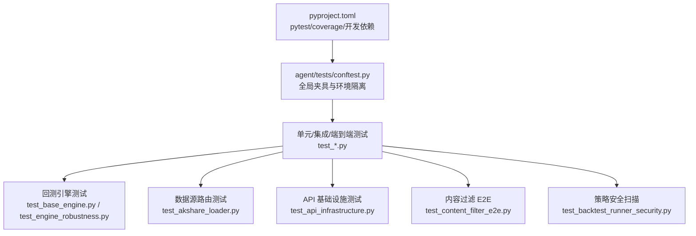
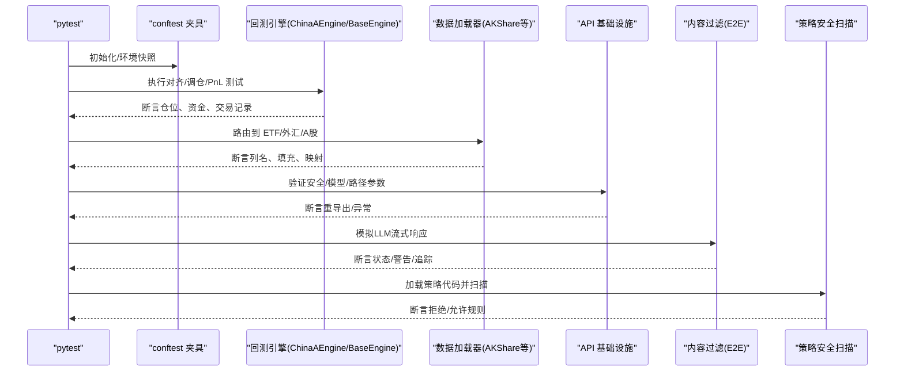
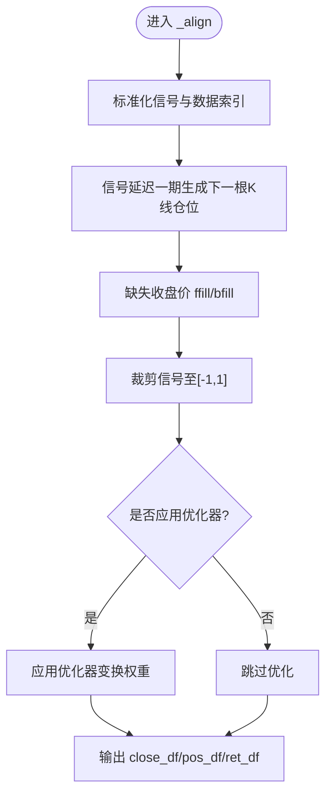
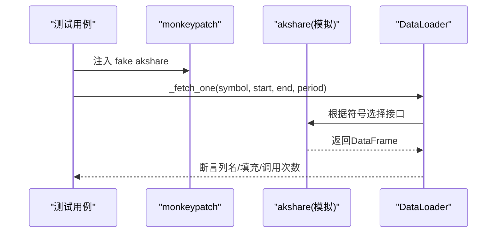
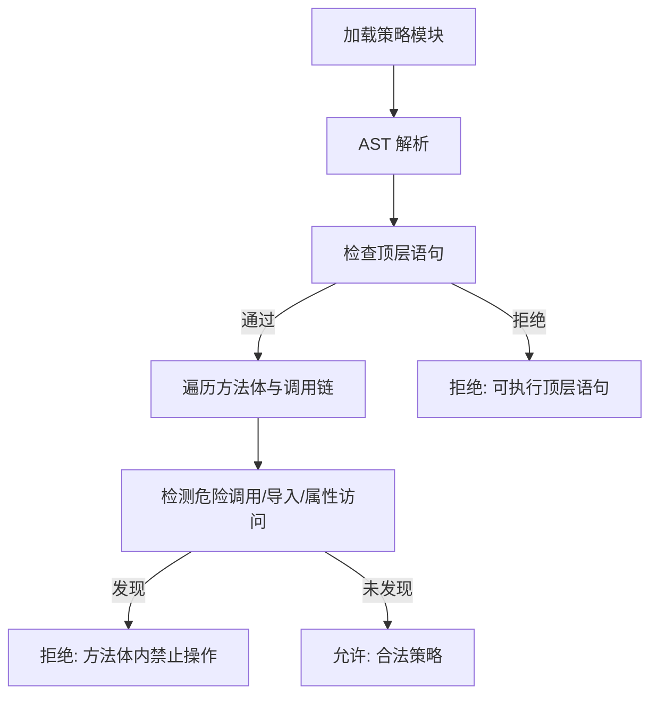
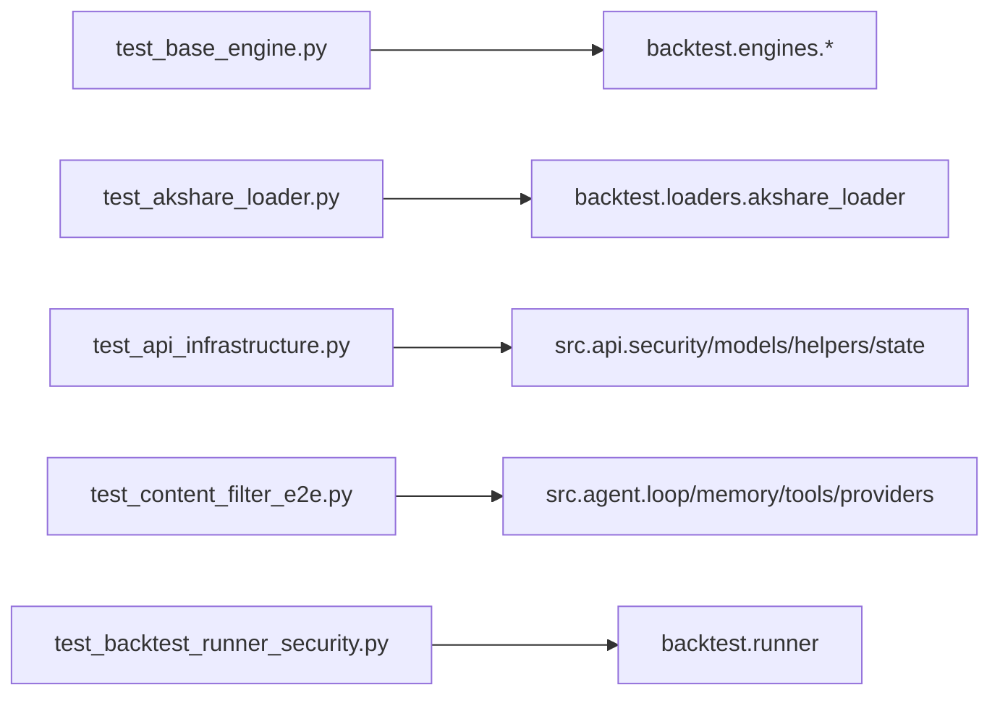

# 测试策略

<cite>
**本文引用的文件**
- [pyproject.toml](file://pyproject.toml)
- [conftest.py](file://agent/tests/conftest.py)
- [test_base_engine.py](file://agent/tests/test_base_engine.py)
- [test_backtest_runner_security.py](file://agent/tests/test_backtest_runner_security.py)
- [test_akshare_loader.py](file://agent/tests/test_akshare_loader.py)
- [test_api_infrastructure.py](file://agent/tests/test_api_infrastructure.py)
- [test_content_filter_e2e.py](file://agent/tests/test_content_filter_e2e.py)
- [test_engine_robustness.py](file://agent/tests/test_engine_robustness.py)
</cite>

## 目录
1. [简介](#简介)
2. [项目结构](#项目结构)
3. [核心组件](#核心组件)
4. [架构总览](#架构总览)
5. [详细组件分析](#详细组件分析)
6. [依赖关系分析](#依赖关系分析)
7. [性能考量](#性能考量)
8. [故障排查指南](#故障排查指南)
9. [结论](#结论)
10. [附录](#附录)

## 简介
本测试策略面向 Vibe-Trading 的量化回测与交易智能体，覆盖单元测试、集成测试、端到端测试、数据源测试、性能与安全测试。文档基于仓库中的实际测试代码与配置，说明测试框架配置、用例组织、Mock 策略、覆盖率要求、与其他组件的集成方式，以及常见问题的处理方案。重点强调：
- 测试架构设计：以 pytest 为核心，通过 conftest 统一环境隔离与路径设置。
- 测试数据管理：使用 fixtures、临时目录与最小化构造数据，避免网络与外部依赖。
- 自动化流程：通过 pyproject 中 pytest 与 coverage 的配置，支持快速本地运行与 CI 集成。
- 安全与健壮性：对动态加载的策略代码进行严格的安全扫描与白名单控制；对引擎异常进行隔离与容错。

## 项目结构
测试位于 agent/tests 下，按功能域划分（如 factors、memory、quantlib、openbb_bridge），并包含大量针对数据源、引擎、API、CLI 等的回归测试。根级 pyproject.toml 集中定义测试入口、标记、覆盖率与开发依赖。



**图表来源**
- [pyproject.toml:232-256](file://pyproject.toml#L232-L256)
- [conftest.py:1-46](file://agent/tests/conftest.py#L1-L46)

**章节来源**
- [pyproject.toml:224-256](file://pyproject.toml#L224-L256)
- [conftest.py:1-46](file://agent/tests/conftest.py#L1-L46)

## 核心组件
- 测试框架与配置
  - 使用 pytest 作为测试执行器，并通过 markers 区分 unit 与 integration。
  - 通过 testpaths 指定测试目录为 agent/tests，pythonpath 指向 agent 以便导入 backtest.* 与 src.*。
  - coverage 收集 agent 源码覆盖率，排除 tests 与 __init__.py，报告时显示缺失行并跳过空文件。
- 全局夹具与环境隔离
  - conftest.py 在每个测试前后快照并恢复 os.environ，同时重置 EnvConfig 缓存，避免环境变量与配置单例泄漏导致测试间干扰。
- 典型测试类型
  - 单元测试：验证引擎对齐、仓位调整、PnL 计算等核心逻辑。
  - 数据源测试：校验不同市场（ETF、外汇、A股）的路由与数据映射。
  - API 基础设施测试：验证安全模块、模型重导出、路径参数校验等。
  - 端到端测试：模拟 LLM 调用流与内容过滤管线，断言结果、警告与追踪记录。
  - 安全测试：对动态加载的策略代码进行 AST 扫描，拒绝危险操作与非法模块访问。

**章节来源**
- [pyproject.toml:232-256](file://pyproject.toml#L232-L256)
- [conftest.py:16-46](file://agent/tests/conftest.py#L16-L46)

## 架构总览
下图展示测试在系统中的位置与交互：测试通过 pytest 启动，利用 conftest 提供的环境隔离，驱动回测引擎、数据加载器、API 层与内容过滤管线，并以断言验证行为与输出。



**图表来源**
- [test_base_engine.py:1-120](file://agent/tests/test_base_engine.py#L1-L120)
- [test_akshare_loader.py:119-177](file://agent/tests/test_akshare_loader.py#L119-L177)
- [test_api_infrastructure.py:17-71](file://agent/tests/test_api_infrastructure.py#L17-L71)
- [test_content_filter_e2e.py:156-193](file://agent/tests/test_content_filter_e2e.py#L156-L193)
- [test_backtest_runner_security.py:17-85](file://agent/tests/test_backtest_runner_security.py#L17-L85)

## 详细组件分析

### 回测引擎测试（对齐、调仓、PnL、生命周期）
- 目标：验证 BaseEngine 的核心能力（信号对齐、仓位调整、平仓 PnL、资金计算）及具体引擎（ChinaAEngine）的生命周期钩子。
- 关键点：
  - 信号对齐保留时区、裁剪信号范围、前向/后向填充缺失收盘价。
  - 调仓模式（hold/rebalance）在不同价格与杠杆变化下的原子性与费用分摊。
  - 平仓函数正确计算持仓天数、PnL 与资金返还。
  - 生命周期钩子在预填单阶段可中止执行。
- 示例断言：
  - 对齐输出形状与时区一致性。
  - 调仓后 fill_records 的 action、signed_quantity、notional、margin、execution_price 与 holding_bars。
  - 部分减仓时 entry/exit 费用的分配与资本更新。
  - 多标的调仓顺序无关性。



**图表来源**
- [test_base_engine.py:442-520](file://agent/tests/test_base_engine.py#L442-L520)

**章节来源**
- [test_base_engine.py:119-368](file://agent/tests/test_base_engine.py#L119-L368)
- [test_base_engine.py:370-413](file://agent/tests/test_base_engine.py#L370-L413)
- [test_base_engine.py:547-617](file://agent/tests/test_base_engine.py#L547-L617)

### 数据源测试（AKShare 路由与映射）
- 目标：确保不同市场符号（ETF、外汇、A股）被正确路由到对应接口，并规范化列名与缺失值。
- 关键点：
  - 使用 monkeypatch 将 akshare 替换为 SimpleNamespace 与 MagicMock，避免真实网络请求。
  - 断言各接口调用次数与参数（如 symbol 前缀）。
  - 外汇无成交量字段时应填充为零，最新价映射到 close。
- 示例断言：
  - ETF 路由到 fund_etf_hist_sina，且不使用 stock_zh_a_hist。
  - 外汇路由到 forex_hist_em，并检查列名与零填充。
  - A股仍路由到 stock_zh_a_hist。



**图表来源**
- [test_akshare_loader.py:119-177](file://agent/tests/test_akshare_loader.py#L119-L177)

**章节来源**
- [test_akshare_loader.py:33-76](file://agent/tests/test_akshare_loader.py#L33-L76)
- [test_akshare_loader.py:119-177](file://agent/tests/test_akshare_loader.py#L119-L177)

### API 基础设施测试（安全、模型、路径参数）
- 目标：验证 api_server 作为薄装配层的重导出一致性，以及安全模块与辅助函数的边界行为。
- 关键点：
  - 重导出 identity 测试确保 api_server 与 src.api.* 模块引用一致。
  - CORS 解析拒绝通配符，默认值不可变。
  - 路径参数校验拒绝路径穿越、空串与特殊字符。
- 示例断言：
  - require_auth、require_event_stream_auth 等重导出一致。
  - _parse_cors_origins 对 None/空/自定义输入的处理。
  - _validate_path_param 对非法参数的 HTTPException。

**章节来源**
- [test_api_infrastructure.py:17-71](file://agent/tests/test_api_infrastructure.py#L17-L71)
- [test_api_infrastructure.py:101-183](file://agent/tests/test_api_infrastructure.py#L101-L183)

### 端到端内容过滤测试（LLM 流式调用与告警）
- 目标：模拟完整 AgentLoop 运行，当 LLM 返回 content_filter_triggered=True 时，验证管线能正确处理跳过、比例阈值、警告与追踪记录。
- 关键点：
  - 使用自定义 LLM stub 控制调用序列，产生特定比例的过滤命中。
  - 断言运行成功、content_filter_warnings 存在、trace 中包含预期条目。
  - 警告信息包含比例、关键词与提供者建议。
- 示例断言：
  - result["status"] == "success"，最终内容与调用次数符合预期。
  - trace 中 type="content_filter_skipped" 的条目数量与 iter 键。
  - 警告字符串包含百分比与“content moderation”、“provider”。

```mermaid
sequenceDiagram
participant Test as "测试用例"
participant LLM as "LLM Stub"
participant Loop as "AgentLoop"
participant Trace as "TraceWriter"
Test->>Loop : run(user_message)
Loop->>LLM : stream_chat(...)
LLM-->>Loop : content_filter_triggered=True/False
Loop->>Trace : 写入 content_filter_skipped
Loop-->>Test : 返回结果(含 warnings)
Test->>Trace : 读取 trace.jsonl 并断言
```

**图表来源**
- [test_content_filter_e2e.py:29-74](file://agent/tests/test_content_filter_e2e.py#L29-L74)
- [test_content_filter_e2e.py:120-148](file://agent/tests/test_content_filter_e2e.py#L120-L148)
- [test_content_filter_e2e.py:156-193](file://agent/tests/test_content_filter_e2e.py#L156-L193)

**章节来源**
- [test_content_filter_e2e.py:156-193](file://agent/tests/test_content_filter_e2e.py#L156-L193)

### 策略安全扫描测试（AST 扫描与白名单）
- 目标：对动态加载的策略代码进行严格审查，阻止顶层或方法体内执行危险操作，并防止通过别名或动态导入绕过限制。
- 关键点：
  - 拒绝顶层执行语句与类级别执行语句。
  - 拒绝方法体内的 import socket/subprocess/os.system/eval/exec/open 等危险调用。
  - 拒绝通过 importlib/pkgutil/runpy/pickle/marshal/shutil/webbrowser/gc 等间接方式访问受限模块。
  - 允许合法的数学与 pandas/numpy 操作，以及只读的文件访问。
- 示例断言：
  - 抛出 ValueError 并匹配特定错误消息。
  - 正常策略可通过扫描并被实例化。



**图表来源**
- [test_backtest_runner_security.py:17-85](file://agent/tests/test_backtest_runner_security.py#L17-L85)
- [test_backtest_runner_security.py:97-169](file://agent/tests/test_backtest_runner_security.py#L97-L169)
- [test_backtest_runner_security.py:302-364](file://agent/tests/test_backtest_runner_security.py#L302-L364)
- [test_backtest_runner_security.py:428-456](file://agent/tests/test_backtest_runner_security.py#L428-L456)

**章节来源**
- [test_backtest_runner_security.py:17-85](file://agent/tests/test_backtest_runner_security.py#L17-L85)
- [test_backtest_runner_security.py:97-169](file://agent/tests/test_backtest_runner_security.py#L97-L169)
- [test_backtest_runner_security.py:302-364](file://agent/tests/test_backtest_runner_security.py#L302-L364)
- [test_backtest_runner_security.py:428-456](file://agent/tests/test_backtest_runner_security.py#L428-L456)

### 引擎健壮性测试（ffill 限制、全 NaN 符号、异常隔离）
- 目标：验证对齐过程中的长间隔不掩盖 stale 价格、全 NaN 符号被丢弃、单一标的异常不影响其他标的执行。
- 关键点：
  - ffill(limit=5) 使短间隔填充，长间隔保持 NaN。
  - 所有符号均为 NaN 时抛出明确错误。
  - 单个标的计划下单失败时，捕获异常并继续执行其他标的。
- 示例断言：
  - 长间隔后 NaN 计数符合预期。
  - 仅 GOOD 标的产生交易记录。

**章节来源**
- [test_engine_robustness.py:34-89](file://agent/tests/test_engine_robustness.py#L34-L89)
- [test_engine_robustness.py:96-137](file://agent/tests/test_engine_robustness.py#L96-L137)

## 依赖关系分析
- 测试与源码耦合点：
  - 回测引擎测试直接依赖 backtest.engines.base 与 backtest.engines.china_a。
  - 数据源测试依赖 backtest.loaders.akshare_loader。
  - API 测试依赖 src.api 的子模块（security、models、helpers、state）。
  - 内容过滤 E2E 依赖 src.agent.loop、src.memory.persistent、src.tools.build_registry、src.providers.chat。
  - 安全测试依赖 backtest.runner._load_module_from_file。
- 外部依赖 Mock：
  - 通过 monkeypatch 与 unittest.mock 替换 akshare、FastAPI 异常等，避免网络与第三方服务影响。



**图表来源**
- [test_base_engine.py:1-17](file://agent/tests/test_base_engine.py#L1-L17)
- [test_akshare_loader.py:18-25](file://agent/tests/test_akshare_loader.py#L18-L25)
- [test_api_infrastructure.py:8-10](file://agent/tests/test_api_infrastructure.py#L8-L10)
- [test_content_filter_e2e.py:21-22](file://agent/tests/test_content_filter_e2e.py#L21-L22)
- [test_backtest_runner_security.py:9-10](file://agent/tests/test_backtest_runner_security.py#L9-L10)

**章节来源**
- [test_base_engine.py:1-17](file://agent/tests/test_base_engine.py#L1-L17)
- [test_akshare_loader.py:18-25](file://agent/tests/test_akshare_loader.py#L18-L25)
- [test_api_infrastructure.py:8-10](file://agent/tests/test_api_infrastructure.py#L8-L10)
- [test_content_filter_e2e.py:21-22](file://agent/tests/test_content_filter_e2e.py#L21-L22)
- [test_backtest_runner_security.py:9-10](file://agent/tests/test_backtest_runner_security.py#L9-L10)

## 性能考量
- 测试数据构造尽量轻量：使用小尺寸 DataFrame/Series，减少内存与 CPU 占用。
- 避免网络 I/O：通过 monkeypatch 与 mock 替代外部依赖，提升测试稳定性与速度。
- 并行与隔离：每个测试独立环境与配置，便于并行执行与并发调试。
- 覆盖率报告：启用 show_missing 与 skip_empty，便于识别未覆盖分支与空白文件。

[本节为通用指导，无需具体文件分析]

## 故障排查指南
- 环境变量泄漏导致测试失败
  - 现象：某些测试在隔离运行时通过，但在套件中失败，提示 token 错误或配置不一致。
  - 原因：EnvConfig 缓存与 os.environ 在测试间共享。
  - 解决：使用 conftest 的全局夹具在每次测试前后快照并恢复环境变量，同时重置配置缓存。
- 数据源路由错误
  - 现象：ETF 或外汇被错误路由到 A 股接口，导致列名不匹配或数据为空。
  - 解决：通过谓词函数与 monkeypatch 验证路由逻辑，断言接口调用与列映射。
- 内容过滤误报或漏报
  - 现象：E2E 运行中内容过滤触发但未记录警告或追踪。
  - 解决：使用 LLM stub 控制调用序列，断言 status、warnings 与 trace 条目数量与格式。
- 策略安全绕过
  - 现象：通过别名或动态导入绕过限制，执行危险操作。
  - 解决：扩展 AST 扫描规则，覆盖 getattr/setattr/delattr、importlib、pickle/marshal 等路径，并验证白名单。

**章节来源**
- [conftest.py:16-46](file://agent/tests/conftest.py#L16-L46)
- [test_akshare_loader.py:119-177](file://agent/tests/test_akshare_loader.py#L119-L177)
- [test_content_filter_e2e.py:156-193](file://agent/tests/test_content_filter_e2e.py#L156-L193)
- [test_backtest_runner_security.py:302-364](file://agent/tests/test_backtest_runner_security.py#L302-L364)

## 结论
Vibe-Trading 的测试体系以 pytest 为核心，结合严格的 fixture 隔离与广泛的 Mock 策略，覆盖了从底层引擎到上层 API 与内容过滤的关键路径。通过系统化的安全扫描与健壮性测试，确保了策略代码的动态加载安全与回测过程的容错能力。建议在后续迭代中持续完善：
- 增加更多端到端场景（多市场、多数据源组合）。
- 引入性能基准测试与回归监控。
- 扩展安全白名单与黑名单，定期审计新风险面。
- 提高覆盖率门槛并在 CI 中强制执行。

[本节为总结性内容，无需具体文件分析]

## 附录
- 测试运行命令（参考 pyproject 配置）
  - 运行全部测试：pytest
  - 仅运行单元/集成标记：pytest -m unit / pytest -m integration
  - 生成覆盖率报告：pytest --cov=agent --cov-report=term-missing
- 关键配置项
  - testpaths: agent/tests
  - pythonpath: agent
  - markers: unit, integration
  - coverage.run.source: agent
  - coverage.report.fail_under: 0（可按需提高）

**章节来源**
- [pyproject.toml:232-256](file://pyproject.toml#L232-L256)