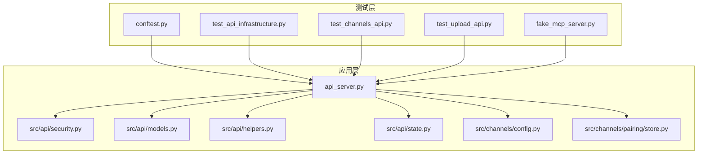
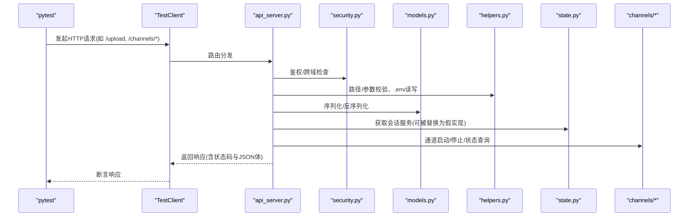
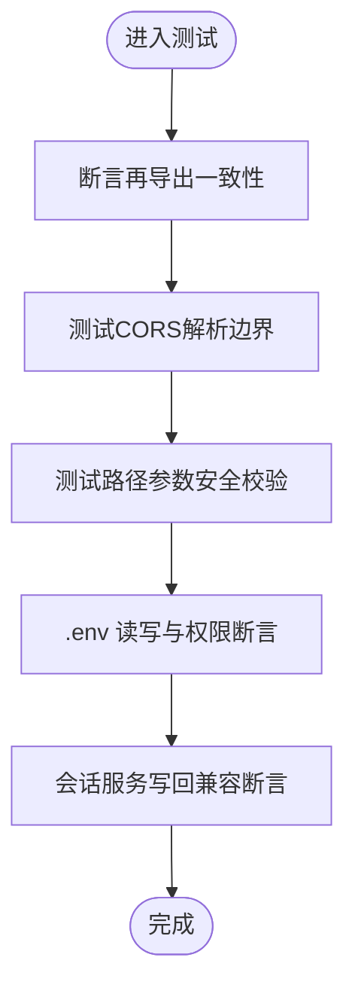
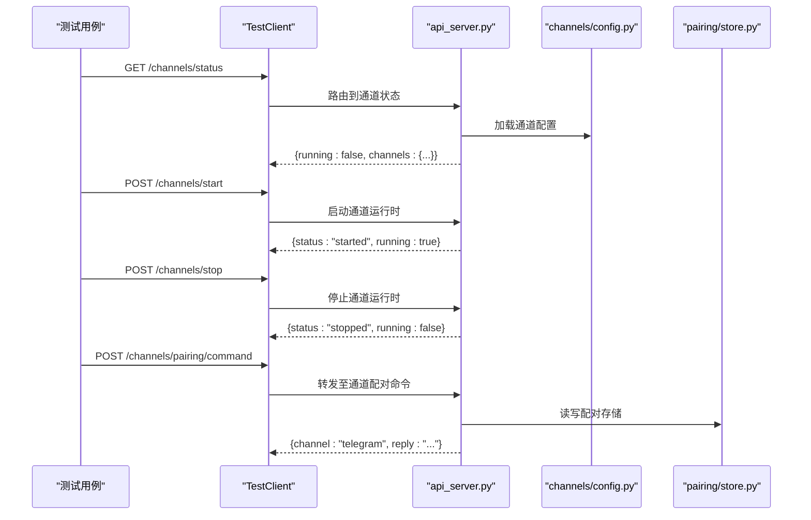
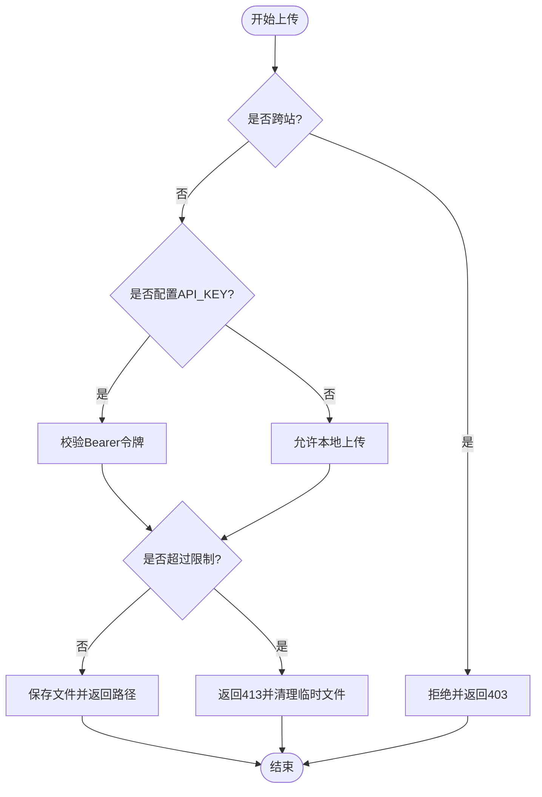
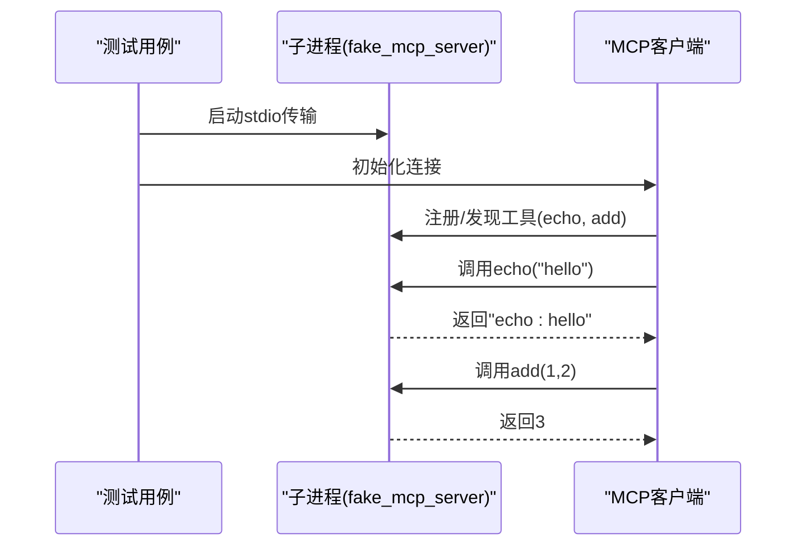
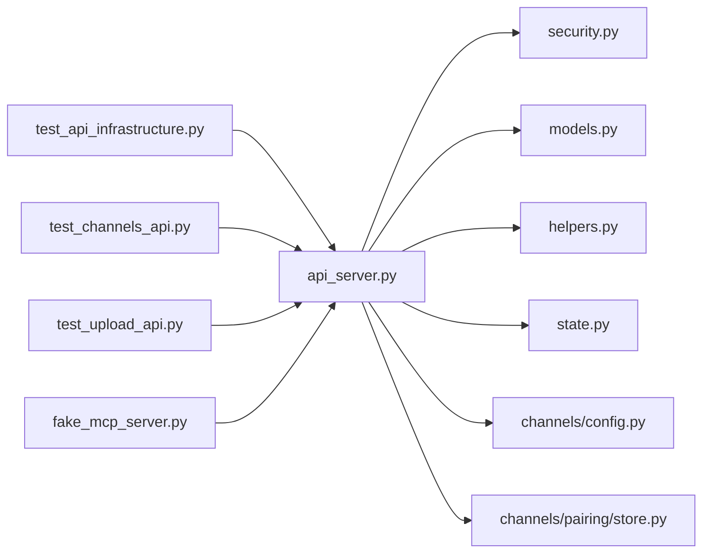

# 集成测试

<cite>
**本文引用的文件**
- [agent/tests/conftest.py](file://agent/tests/conftest.py)
- [agent/tests/test_api_infrastructure.py](file://agent/tests/test_api_infrastructure.py)
- [agent/tests/test_channels_api.py](file://agent/tests/test_channels_api.py)
- [agent/tests/test_upload_api.py](file://agent/tests/test_upload_api.py)
- [agent/tests/fixtures/fake_mcp_server.py](file://agent/tests/fixtures/fake_mcp_server.py)
- [agent/api_server.py](file://agent/api_server.py)
- [agent/src/api/security.py](file://agent/src/api/security.py)
- [agent/src/api/models.py](file://agent/src/api/models.py)
- [agent/src/api/helpers.py](file://agent/src/api/helpers.py)
- [agent/src/api/state.py](file://agent/src/api/state.py)
- [agent/src/channels/config.py](file://agent/src/channels/config.py)
- [agent/src/channels/pairing/store.py](file://agent/src/channels/pairing/store.py)
</cite>

## 目录
1. [简介](#简介)
2. [项目结构](#项目结构)
3. [核心组件](#核心组件)
4. [架构总览](#架构总览)
5. [详细组件分析](#详细组件分析)
6. [依赖关系分析](#依赖关系分析)
7. [性能考量](#性能考量)
8. [故障排查指南](#故障排查指南)
9. [结论](#结论)
10. [附录](#附录)

## 简介
本文件面向 Vibe-Trading 的集成测试，聚焦端到端测试架构、外部服务模拟与数据库/存储测试策略。内容覆盖 API 集成测试、消息通道（类消息队列）集成测试、文件上传与存储测试、第三方服务（MCP）集成测试；并给出测试环境配置、测试数据准备与清理策略、异步与并发测试要点、分布式系统测试注意事项，以及常见问题与解决方案。所有示例均基于仓库中的实际测试用例与基础设施代码进行说明。

## 项目结构
Vibe-Trading 的集成测试主要位于 agent/tests 目录，围绕 FastAPI 应用 api_server 构建：
- 共享夹具与环境隔离：conftest.py 负责进程级环境变量与配置缓存隔离，避免测试间相互污染。
- API 基础设施回归测试：test_api_infrastructure.py 验证安全、模型、助手函数、状态模块的导出一致性与边界行为。
- 通道（IM/消息）API 测试：test_channels_api.py 通过 TestClient 驱动 /channels/* 接口，校验通道启动/停止、配对命令与运行时配置。
- 文件上传与存储测试：test_upload_api.py 针对 /upload 流式上传、大小限制、跨站请求防护、权限控制与错误清理路径。
- 第三方服务模拟：fixtures/fake_mcp_server.py 提供最小 MCP 服务器，用于端到端调用链路的集成测试。

图表来源
- [agent/tests/test_api_infrastructure.py:1-356](file://agent/tests/test_api_infrastructure.py#L1-L356)
- [agent/tests/test_channels_api.py:1-102](file://agent/tests/test_channels_api.py#L1-L102)
- [agent/tests/test_upload_api.py:1-200](file://agent/tests/test_upload_api.py#L1-L200)
- [agent/tests/fixtures/fake_mcp_server.py:1-48](file://agent/tests/fixtures/fake_mcp_server.py#L1-L48)
- [agent/tests/conftest.py:1-46](file://agent/tests/conftest.py#L1-L46)

章节来源
- [agent/tests/conftest.py:1-46](file://agent/tests/conftest.py#L1-L46)
- [agent/tests/test_api_infrastructure.py:1-356](file://agent/tests/test_api_infrastructure.py#L1-L356)
- [agent/tests/test_channels_api.py:1-102](file://agent/tests/test_channels_api.py#L1-L102)
- [agent/tests/test_upload_api.py:1-200](file://agent/tests/test_upload_api.py#L1-L200)
- [agent/tests/fixtures/fake_mcp_server.py:1-48](file://agent/tests/fixtures/fake_mcp_server.py#L1-L48)

## 核心组件
- 测试夹具与环境隔离
  - conftest.py 在每个测试前后快照并恢复 os.environ，同时重置配置缓存，确保测试之间互不干扰。
- API 基础设施断言
  - test_api_infrastructure.py 验证 api_server 对 security、models、helpers、state 的再导出一致性，并覆盖 CORS、路径参数校验、.env 读写等关键逻辑。
- 通道（消息）API
  - test_channels_api.py 使用 TestClient 驱动 /channels/status、/channels/start、/channels/stop、/channels/pairing/command，验证通道运行态与配置生效。
- 文件上传与存储
  - test_upload_api.py 覆盖跨站请求拒绝、本地回环鉴权、同源远程允许、大小限制、扩展名拦截、异常时清理等场景。
- 第三方服务模拟
  - fake_mcp_server.py 暴露 echo/add 工具，供集成测试以 stdio 方式启动并验证端到端调用链路。

章节来源
- [agent/tests/conftest.py:16-46](file://agent/tests/conftest.py#L16-L46)
- [agent/tests/test_api_infrastructure.py:17-71](file://agent/tests/test_api_infrastructure.py#L17-L71)
- [agent/tests/test_channels_api.py:17-46](file://agent/tests/test_channels_api.py#L17-L46)
- [agent/tests/test_upload_api.py:19-24](file://agent/tests/test_upload_api.py#L19-L24)
- [agent/tests/fixtures/fake_mcp_server.py:14-48](file://agent/tests/fixtures/fake_mcp_server.py#L14-L48)

## 架构总览
下图展示集成测试如何驱动 FastAPI 应用，并通过 TestClient 与内部模块交互，形成端到端验证闭环。

图表来源
- [agent/tests/test_api_infrastructure.py:17-71](file://agent/tests/test_api_infrastructure.py#L17-L71)
- [agent/tests/test_channels_api.py:17-46](file://agent/tests/test_channels_api.py#L17-L46)
- [agent/tests/test_upload_api.py:19-24](file://agent/tests/test_upload_api.py#L19-L24)
- [agent/src/api/security.py](file://agent/src/api/security.py)
- [agent/src/api/models.py](file://agent/src/api/models.py)
- [agent/src/api/helpers.py](file://agent/src/api/helpers.py)
- [agent/src/api/state.py](file://agent/src/api/state.py)

## 详细组件分析

### API 基础设施集成测试
- 目标
  - 验证 api_server 作为薄装配层，正确再导出 security、models、helpers、state 的关键符号。
  - 覆盖安全相关边界：CORS 解析、主机头处理、路径参数校验、.env 读写与权限。
- 关键断言
  - 再导出一致性：require_auth、Artifacts、RUNS_DIR、_get_session_service 等。
  - CORS：空/默认值返回默认白名单，禁止通配符。
  - 路径参数：拒绝路径穿越、空串、特殊字符。
  - .env 读写：支持注释、export 前缀、重复键、引号内 # 保留、写入权限位设置。
  - 会话服务写回：在禁用会话运行时下，仍能通过兼容层读取到宿主属性。
- 典型流程（示意）

图表来源
- [agent/tests/test_api_infrastructure.py:17-71](file://agent/tests/test_api_infrastructure.py#L17-L71)
- [agent/tests/test_api_infrastructure.py:101-125](file://agent/tests/test_api_infrastructure.py#L101-L125)
- [agent/tests/test_api_infrastructure.py:157-183](file://agent/tests/test_api_infrastructure.py#L157-L183)
- [agent/tests/test_api_infrastructure.py:217-339](file://agent/tests/test_api_infrastructure.py#L217-L339)
- [agent/tests/test_api_infrastructure.py:347-356](file://agent/tests/test_api_infrastructure.py#L347-L356)

章节来源
- [agent/tests/test_api_infrastructure.py:17-71](file://agent/tests/test_api_infrastructure.py#L17-L71)
- [agent/tests/test_api_infrastructure.py:101-125](file://agent/tests/test_api_infrastructure.py#L101-L125)
- [agent/tests/test_api_infrastructure.py:157-183](file://agent/tests/test_api_infrastructure.py#L157-L183)
- [agent/tests/test_api_infrastructure.py:217-339](file://agent/tests/test_api_infrastructure.py#L217-L339)
- [agent/tests/test_api_infrastructure.py:347-356](file://agent/tests/test_api_infrastructure.py#L347-L356)

### 消息通道（类消息队列）集成测试
- 目标
  - 验证通道运行时配置加载、状态查询、启停控制、配对命令执行。
- 关键断言
  - /channels/status 返回 configured/enabled/available 等字段，且运行时 reply_timeout_s 来自配置。
  - /channels/start 与 /channels/stop 改变 running 状态。
  - /channels/pairing/command 通过共享 store 持久化配对信息。
- 典型调用序列（示意）

图表来源
- [agent/tests/test_channels_api.py:17-46](file://agent/tests/test_channels_api.py#L17-L46)
- [agent/tests/test_channels_api.py:49-102](file://agent/tests/test_channels_api.py#L49-L102)
- [agent/src/channels/config.py](file://agent/src/channels/config.py)
- [agent/src/channels/pairing/store.py](file://agent/src/channels/pairing/store.py)

章节来源
- [agent/tests/test_channels_api.py:17-46](file://agent/tests/test_channels_api.py#L17-L46)
- [agent/tests/test_channels_api.py:49-102](file://agent/tests/test_channels_api.py#L49-L102)

### 文件存储与上传集成测试
- 目标
  - 验证流式上传、大小限制、跨站请求防护、鉴权、扩展名黑名单、异常清理。
- 关键断言
  - 跨站请求即使来自回环也被拒绝。
  - 启用 API_KEY 后，回环上传需 Bearer 鉴权。
  - 同源远程上传在携带 API_KEY 时允许。
  - 超过限制返回 413 并清理部分写入的文件。
  - 危险扩展名直接拒绝。
  - 存储错误不泄露服务器路径。
- 典型流程（示意）

图表来源
- [agent/tests/test_upload_api.py:19-24](file://agent/tests/test_upload_api.py#L19-L24)
- [agent/tests/test_upload_api.py:31-140](file://agent/tests/test_upload_api.py#L31-L140)
- [agent/tests/test_upload_api.py:143-200](file://agent/tests/test_upload_api.py#L143-L200)

章节来源
- [agent/tests/test_upload_api.py:19-24](file://agent/tests/test_upload_api.py#L19-L24)
- [agent/tests/test_upload_api.py:31-140](file://agent/tests/test_upload_api.py#L31-L140)
- [agent/tests/test_upload_api.py:143-200](file://agent/tests/test_upload_api.py#L143-L200)

### 第三方服务集成测试（MCP）
- 目标
  - 通过最小 MCP 服务器验证端到端工具调用链路（stdio 传输）。
- 关键点
  - fake_mcp_server.py 暴露 echo/add 两个工具，测试侧以子进程方式启动并通信。
  - 适用于验证 MCP 客户端适配层、协议握手、工具发现与调用结果。
- 典型调用序列（示意）

图表来源
- [agent/tests/fixtures/fake_mcp_server.py:14-48](file://agent/tests/fixtures/fake_mcp_server.py#L14-L48)

章节来源
- [agent/tests/fixtures/fake_mcp_server.py:14-48](file://agent/tests/fixtures/fake_mcp_server.py#L14-L48)

## 依赖关系分析
- 耦合度
  - 测试对 api_server 的强依赖（通过 TestClient），但通过 monkeypatch 注入假实现（如 _channel_runtime、_session_service）降低对外部运行时依赖。
  - 通道测试依赖 channels/config 与 pairing/store，通过临时路径与配置注入实现隔离。
  - 上传测试通过修改 UPLOADS_DIR、MAX_UPLOAD_SIZE、_UPLOAD_CHUNK_SIZE 控制行为，避免真实磁盘压力。
- 外部依赖
  - FastAPI/TestClient 用于 HTTP 集成测试。
  - fastmcp 用于 MCP 服务端模拟。
- 潜在循环依赖
  - test_api_infrastructure.py 显式检测无循环导入，保障模块化健康。

图表来源
- [agent/tests/test_api_infrastructure.py:17-71](file://agent/tests/test_api_infrastructure.py#L17-L71)
- [agent/tests/test_channels_api.py:17-46](file://agent/tests/test_channels_api.py#L17-L46)
- [agent/tests/test_upload_api.py:19-24](file://agent/tests/test_upload_api.py#L19-L24)
- [agent/tests/fixtures/fake_mcp_server.py:14-48](file://agent/tests/fixtures/fake_mcp_server.py#L14-L48)

章节来源
- [agent/tests/test_api_infrastructure.py:55-71](file://agent/tests/test_api_infrastructure.py#L55-L71)
- [agent/tests/test_channels_api.py:17-46](file://agent/tests/test_channels_api.py#L17-L46)
- [agent/tests/test_upload_api.py:19-24](file://agent/tests/test_upload_api.py#L19-L24)

## 性能考量
- 流式上传与内存占用
  - 上传测试将 MAX_UPLOAD_SIZE 缩小至 4KB，_UPLOAD_CHUNK_SIZE 设为 1KB，避免大文件导致内存峰值，同时覆盖流式路径与清理逻辑。
- 测试隔离与开销
  - conftest.py 的环境快照与配置缓存重置保证测试稳定性，代价是少量额外开销，但显著减少偶发失败。
- I/O 与文件系统
  - 上传测试使用 tmp_path 作为存储根，确保每次测试独立且快速清理。

[本节为通用指导，不直接分析具体文件]

## 故障排查指南
- 现象：测试间环境变量泄漏导致“token 不正确”
  - 原因：配置缓存与 os.environ 未隔离
  - 解决：使用 conftest.py 的自动夹具进行环境与配置缓存快照/恢复
- 现象：上传超大文件导致内存耗尽
  - 原因：非流式读取或限制过大
  - 解决：采用流式上传并在测试中调小限制，验证 413 与清理路径
- 现象：跨站请求被误放行
  - 原因：未检查 Origin/Sec-Fetch-Site
  - 解决：参考上传测试断言，确保跨站一律拒绝
- 现象：通道状态不一致
  - 原因：配置未正确加载或运行时未重启
  - 解决：通过 /channels/status 校验配置项，必要时调用 /channels/start/stop 重置

章节来源
- [agent/tests/conftest.py:16-46](file://agent/tests/conftest.py#L16-L46)
- [agent/tests/test_upload_api.py:143-186](file://agent/tests/test_upload_api.py#L143-L186)
- [agent/tests/test_channels_api.py:49-102](file://agent/tests/test_channels_api.py#L49-L102)

## 结论
本项目的集成测试围绕 FastAPI 应用构建了稳定的端到端验证体系：通过 TestClient 驱动 API、通过夹具与 monkeypatch 隔离外部依赖、通过最小化 MCP 服务器验证第三方集成。测试覆盖了安全、配置、I/O、通道生命周期与第三方协议等关键路径，具备良好的可维护性与可扩展性。建议持续保持：
- 严格的环境与配置隔离
- 对关键路径（鉴权、大小限制、跨站、清理）的完备断言
- 对第三方服务的轻量模拟与契约测试

[本节为总结性内容，不直接分析具体文件]

## 附录
- 测试环境配置要点
  - 使用 tmp_path 作为临时存储根，避免污染真实文件系统。
  - 通过 monkeypatch 注入假实现（如 _channel_runtime、_session_service）以解耦运行时。
  - 调整上传限制与分块大小，以在 CI 中快速验证流式路径。
- 测试数据准备与清理
  - 上传测试在失败分支确保删除部分写入文件。
  - 通道配对数据写入临时 store 路径，测试结束后由 pytest 自动清理。
- 异步与并发测试
  - 当前测试以同步 TestClient 为主，若引入异步任务，建议使用事件循环与超时控制，并在夹具中管理资源生命周期。
- 分布式系统测试
  - 对于多进程/多节点场景，建议引入容器化服务（如消息代理、对象存储）并使用固定端口与网络命名空间，确保可重现。

[本节为通用指导，不直接分析具体文件]