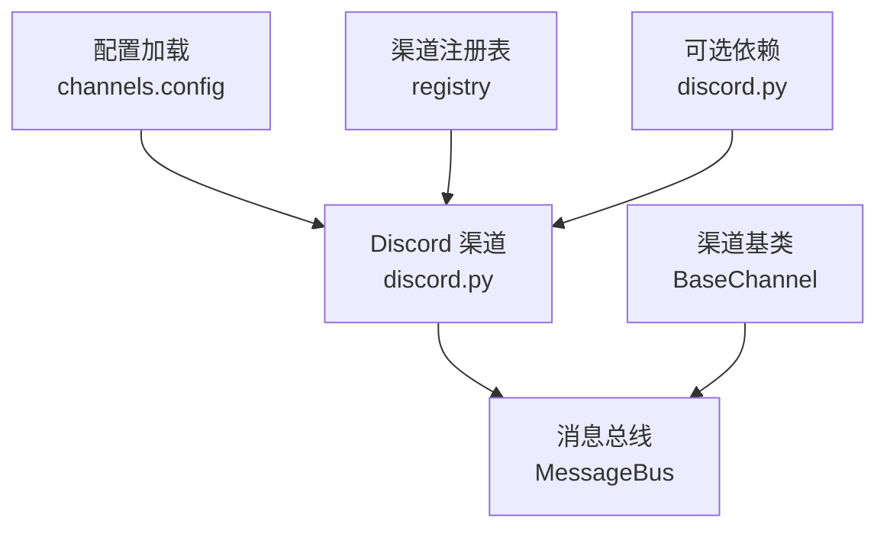
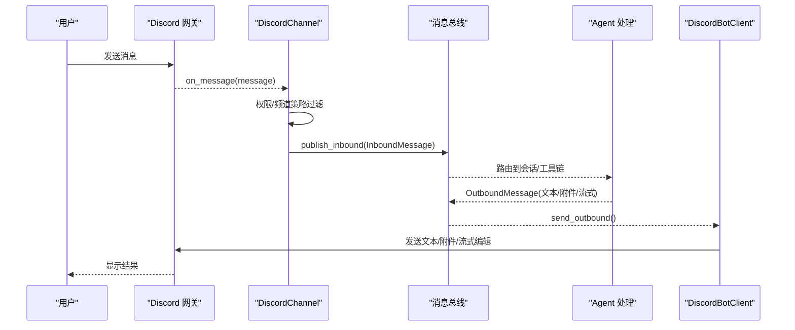
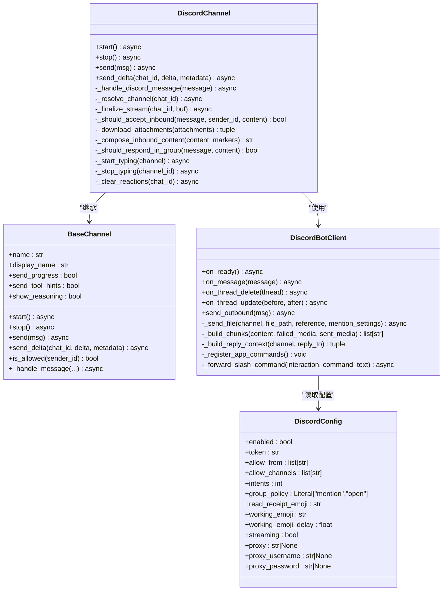
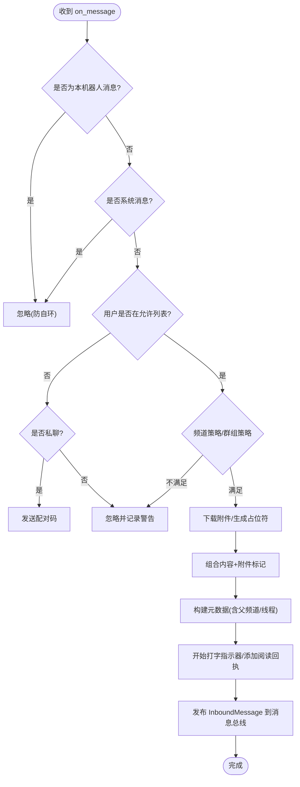
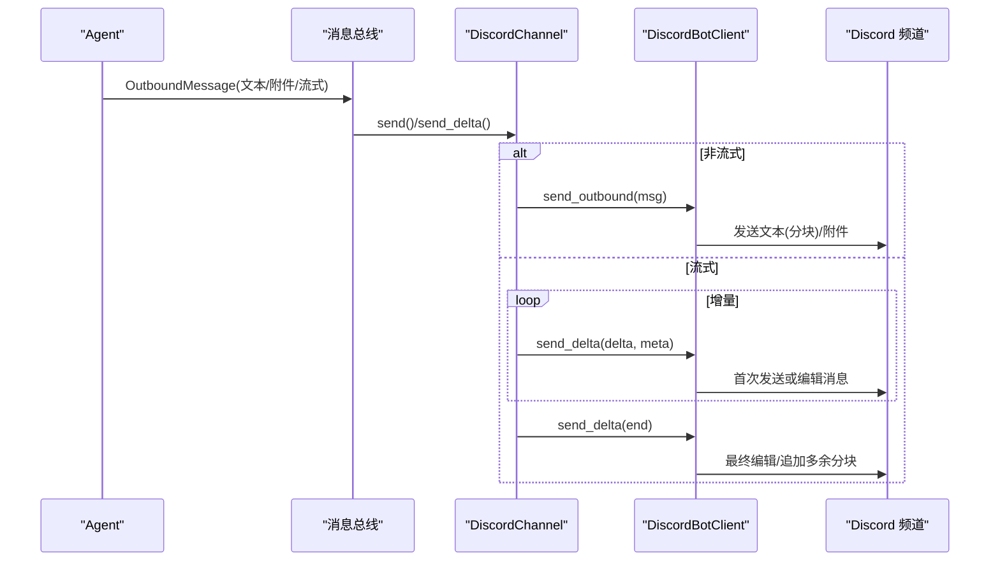
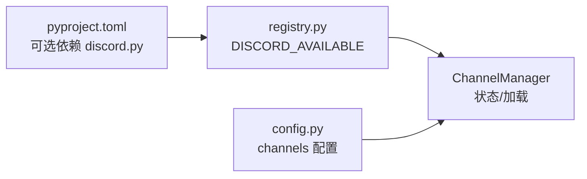

# Discord 渠道

<cite>
**本文引用的文件**
- [agent/src/channels/discord.py](file://agent/src/channels/discord.py)
- [agent/src/channels/base.py](file://agent/src/channels/base.py)
- [agent/src/channels/config.py](file://agent/src/channels/config.py)
- [agent/src/channels/registry.py](file://agent/src/channels/registry.py)
- [pyproject.toml](file://pyproject.toml)
- [agent/tests/test_channels_runtime.py](file://agent/tests/test_channels_runtime.py)
</cite>

## 目录
1. [简介](#简介)
2. [项目结构](#项目结构)
3. [核心组件](#核心组件)
4. [架构总览](#架构总览)
5. [详细组件分析](#详细组件分析)
6. [依赖关系分析](#依赖关系分析)
7. [性能与速率限制](#性能与速率限制)
8. [故障排查指南](#故障排查指南)
9. [结论](#结论)
10. [附录：配置与部署清单](#附录配置与部署清单)

## 简介
本章节面向需要在 Vibe-Trading 中集成 Discord 渠道的开发者与运维人员，系统性说明如何使用 Discord Bot API、如何配置 Bot Token、事件监听、消息处理、服务器（Guild）与频道（Channel）管理、用户权限检查、角色系统、消息类型支持（文本、嵌入、附件、文件）、Webhook 使用、REST API 调用、异步事件处理、速率限制、错误重试机制，以及调试与监控方法。文档同时给出具体创建步骤、权限配置与事件订阅设置建议，并基于仓库代码提供可追溯的实现细节。

## 项目结构
Vibe-Trading 将 Discord 作为“渠道”之一接入统一的消息总线。关键文件与职责如下：
- agent/src/channels/discord.py：Discord 渠道实现，封装 discord.py 客户端、事件转发、消息发送、流式更新、附件处理等。
- agent/src/channels/base.py：渠道抽象基类，定义 start/stop/send、消息入站处理、权限校验、流式接口等通用契约。
- agent/src/channels/config.py：从 Agent 配置加载 channels 子配置。
- agent/src/channels/registry.py：渠道发现、可用性检测、安装提示。
- pyproject.toml：可选依赖声明，包含 discord.py 可选包。
- agent/tests/test_channels_runtime.py：渠道运行时与注册表测试，覆盖可用性与安装提示。

图表来源
- [agent/src/channels/discord.py:339-447](file://agent/src/channels/discord.py#L339-L447)
- [agent/src/channels/base.py:22-178](file://agent/src/channels/base.py#L22-L178)
- [agent/src/channels/config.py:11-22](file://agent/src/channels/config.py#L11-L22)
- [agent/src/channels/registry.py:33-63](file://agent/src/channels/registry.py#L33-L63)
- [pyproject.toml:158-160](file://pyproject.toml#L158-L160)

章节来源
- [agent/src/channels/discord.py:1-819](file://agent/src/channels/discord.py#L1-L819)
- [agent/src/channels/base.py:1-238](file://agent/src/channels/base.py#L1-L238)
- [agent/src/channels/config.py:1-22](file://agent/src/channels/config.py#L1-L22)
- [agent/src/channels/registry.py:33-63](file://agent/src/channels/registry.py#L33-L63)
- [pyproject.toml:158-160](file://pyproject.toml#L158-L160)

## 核心组件
- DiscordConfig：Discord 渠道的配置模型，包括 enabled、token、allow_from、allow_channels、intents、group_policy、read_receipt_emoji、working_emoji、streaming、proxy 等。
- DiscordBotClient：继承自 discord.Client，负责事件回调（on_ready、on_message、on_thread_delete/update）、应用命令注册、出站消息发送、文件上传、回复上下文构建等。
- DiscordChannel：实现 BaseChannel，负责启动/停止、入站消息过滤与转发、流式输出、打字指示器、反应标记清理、会话/线程上下文维护等。

章节来源
- [agent/src/channels/discord.py:50-66](file://agent/src/channels/discord.py#L50-L66)
- [agent/src/channels/discord.py:70-337](file://agent/src/channels/discord.py#L70-L337)
- [agent/src/channels/discord.py:339-819](file://agent/src/channels/discord.py#L339-L819)
- [agent/src/channels/base.py:22-178](file://agent/src/channels/base.py#L22-L178)

## 架构总览
下图展示 Discord 渠道在 Vibe-Trading 中的整体交互：用户消息经 Discord 网关到达 bot，DiscordChannel 接收并过滤后通过消息总线进入 Agent；Agent 处理后通过 OutboundMessage 由 DiscordBotClient 发回 Discord 频道，支持文本分块、附件、流式编辑等。

图表来源
- [agent/src/channels/discord.py:95-106](file://agent/src/channels/discord.py#L95-L106)
- [agent/src/channels/discord.py:246-337](file://agent/src/channels/discord.py#L246-L337)
- [agent/src/channels/base.py:179-227](file://agent/src/channels/base.py#L179-L227)

## 详细组件分析

### Discord 渠道类图

图表来源
- [agent/src/channels/base.py:22-178](file://agent/src/channels/base.py#L22-L178)
- [agent/src/channels/discord.py:50-66](file://agent/src/channels/discord.py#L50-L66)
- [agent/src/channels/discord.py:70-337](file://agent/src/channels/discord.py#L70-L337)
- [agent/src/channels/discord.py:339-819](file://agent/src/channels/discord.py#L339-L819)

章节来源
- [agent/src/channels/discord.py:50-819](file://agent/src/channels/discord.py#L50-L819)
- [agent/src/channels/base.py:22-178](file://agent/src/channels/base.py#L22-L178)

### 入站消息处理流程

图表来源
- [agent/src/channels/discord.py:532-595](file://agent/src/channels/discord.py#L532-L595)
- [agent/src/channels/base.py:179-227](file://agent/src/channels/base.py#L179-L227)

章节来源
- [agent/src/channels/discord.py:532-595](file://agent/src/channels/discord.py#L532-L595)
- [agent/src/channels/base.py:179-227](file://agent/src/channels/base.py#L179-L227)

### 出站消息与流式更新

图表来源
- [agent/src/channels/discord.py:246-337](file://agent/src/channels/discord.py#L246-L337)
- [agent/src/channels/discord.py:473-531](file://agent/src/channels/discord.py#L473-L531)
- [agent/src/channels/discord.py:619-643](file://agent/src/channels/discord.py#L619-L643)

章节来源
- [agent/src/channels/discord.py:246-337](file://agent/src/channels/discord.py#L246-L337)
- [agent/src/channels/discord.py:473-531](file://agent/src/channels/discord.py#L473-L531)
- [agent/src/channels/discord.py:619-643](file://agent/src/channels/discord.py#L619-L643)

### 应用命令（斜杠命令）
- 内置命令：/new、/stop、/restart、/status、/history、/model、/help。
- 行为：权限校验、频道白名单校验、临时响应提示“处理中”，随后转发至 _handle_message。
- 错误处理：app_commands.error 钩子记录失败信息。

章节来源
- [agent/src/channels/discord.py:192-245](file://agent/src/channels/discord.py#L192-L245)

### 权限与访问控制
- 用户级：allow_from 支持通配符“*”或指定用户 ID；未授权用户在私聊会收到配对码。
- 频道级：allow_channels 支持精确匹配或父频道匹配（线程场景）。
- 群组策略：group_policy 可为 "mention"（仅 @提及/回复）或 "open"（全部消息）。

章节来源
- [agent/src/channels/base.py:165-177](file://agent/src/channels/base.py#L165-L177)
- [agent/src/channels/discord.py:645-662](file://agent/src/channels/discord.py#L645-L662)
- [agent/src/channels/discord.py:718-745](file://agent/src/channels/discord.py#L718-L745)

### 消息类型与附件
- 文本：自动按 Discord 字符上限分块发送。
- 附件：支持本地文件路径上传，超过大小限制或下载失败时以文本占位符提示。
- 嵌入：当前实现未直接构造 Embed，可通过富文本/Markdown 呈现结构化信息。
- Webhook：当前实现未使用 Discord Webhook，所有出站均通过 discord.py 通道对象。
- REST API：当前实现未直接调用 REST，如需自定义可复用 aiohttp 并在 channel 内扩展。

章节来源
- [agent/src/channels/discord.py:262-319](file://agent/src/channels/discord.py#L262-L319)
- [agent/src/channels/discord.py:664-696](file://agent/src/channels/discord.py#L664-L696)

### 线程与上下文
- 线程识别：当消息来自线程时，记录 parent_channel_id、thread_id，并据此建立 session_key，保证上下文连贯。
- 生命周期：on_thread_delete/on_thread_update 用于清理或缓存线程对象。

章节来源
- [agent/src/channels/discord.py:98-105](file://agent/src/channels/discord.py#L98-L105)
- [agent/src/channels/discord.py:557-563](file://agent/src/channels/discord.py#L557-L563)

### 打字指示器与反应标记
- 入站即加“阅读回执”表情，延迟添加“工作中”表情。
- 处理完成后清理表情并停止打字指示器任务。

章节来源
- [agent/src/channels/discord.py:565-580](file://agent/src/channels/discord.py#L565-L580)
- [agent/src/channels/discord.py:759-800](file://agent/src/channels/discord.py#L759-L800)

## 依赖关系分析
- 可选依赖：discord.py 为可选包，通过 extras 安装。
- 可用性检测：模块导入时设置 DISCORD_AVAILABLE，注册表据此报告可用性与安装提示。
- 配置加载：channels 配置从 Agent 配置中解析，供 ChannelManager 使用。

图表来源
- [pyproject.toml:158-160](file://pyproject.toml#L158-L160)
- [agent/src/channels/registry.py:33-63](file://agent/src/channels/registry.py#L33-L63)
- [agent/src/channels/config.py:11-22](file://agent/src/channels/config.py#L11-L22)

章节来源
- [pyproject.toml:158-160](file://pyproject.toml#L158-L160)
- [agent/src/channels/registry.py:33-63](file://agent/src/channels/registry.py#L33-L63)
- [agent/src/channels/config.py:11-22](file://agent/src/channels/config.py#L11-L22)
- [agent/tests/test_channels_runtime.py:167-192](file://agent/tests/test_channels_runtime.py#L167-L192)

## 性能与速率限制
- 流式编辑节流：对同一消息的编辑间隔默认约 0.8 秒，避免频繁 edit 触发限流。
- 消息分块：文本按 Discord 最大长度切分，减少单次请求体积。
- 附件大小限制：单文件超过 20MB 将被跳过，防止超时与限流。
- 打字指示器：周期性 typing 任务，异常时安全退出，避免资源泄漏。
- 速率限制建议：
  - 合理设置 intents 值，仅启用必要事件以减少负载。
  - 在高并发群聊中谨慎开启 streaming，必要时增大编辑间隔。
  - 批量附件发送应错开时间，避免瞬时峰值。

章节来源
- [agent/src/channels/discord.py:33-38](file://agent/src/channels/discord.py#L33-L38)
- [agent/src/channels/discord.py:313-319](file://agent/src/channels/discord.py#L313-L319)
- [agent/src/channels/discord.py:494-531](file://agent/src/channels/discord.py#L494-L531)
- [agent/src/channels/discord.py:664-689](file://agent/src/channels/discord.py#L664-L689)
- [agent/src/channels/discord.py:759-784](file://agent/src/channels/discord.py#L759-L784)

## 故障排查指南
- 权限不足
  - 现象：私聊无响应或提示不允许使用。
  - 排查：检查 allow_from 是否包含该用户或设为“*”；群组模式下确认 group_policy 与 @提及/回复逻辑。
  - 参考：[agent/src/channels/base.py:165-177](file://agent/src/channels/base.py#L165-L177)、[agent/src/channels/discord.py:645-662](file://agent/src/channels/discord.py#L645-L662)、[agent/src/channels/discord.py:718-745](file://agent/src/channels/discord.py#L718-L745)
- 网络超时/连接失败
  - 现象：启动失败或发送失败。
  - 排查：确认 token 已配置；检查代理配置 proxy/proxy_username/proxy_password；查看日志中的 client startup 异常。
  - 参考：[agent/src/channels/discord.py:400-447](file://agent/src/channels/discord.py#L400-L447)
- API 限流
  - 现象：edit/send 失败或间歇性失败。
  - 排查：降低 streaming 频率；拆分大消息；避免短时间内大量附件上传。
  - 参考：[agent/src/channels/discord.py:313-319](file://agent/src/channels/discord.py#L313-L319)、[agent/src/channels/discord.py:494-531](file://agent/src/channels/discord.py#L494-L531)
- 依赖缺失
  - 现象：渠道不可用或无法加载。
  - 排查：安装可选依赖；通过注册表 inspect 查看 install_hint。
  - 参考：[agent/src/channels/registry.py:33-63](file://agent/src/channels/registry.py#L33-L63)、[agent/tests/test_channels_runtime.py:167-192](file://agent/tests/test_channels_runtime.py#L167-L192)
- 频道不可用
  - 现象：发送消息失败或目标频道不存在。
  - 排查：确认 chat_id 正确；检查频道权限；查看 fetch_channel 异常日志。
  - 参考：[agent/src/channels/discord.py:246-256](file://agent/src/channels/discord.py#L246-L256)、[agent/src/channels/discord.py:601-617](file://agent/src/channels/discord.py#L601-L617)

## 结论
Vibe-Trading 的 Discord 渠道通过统一的 BaseChannel 契约与消息总线解耦平台差异，利用 discord.py 实现稳定的事件监听、消息收发、流式更新与附件处理。其权限控制、群组策略、线程上下文、打字指示器等特性覆盖了常见协作场景。结合合理的速率限制与错误处理策略，可在生产环境中稳定运行。

## 附录：配置与部署清单
- 创建 Discord Bot
  - 在 Discord Developer Portal 创建应用与 Bot，获取 Bot Token。
  - 邀请 Bot 加入目标服务器，并确保具备所需权限（如发送消息、上传文件、读取消息、管理线程等）。
- 配置渠道
  - 在 Agent 配置的 channels.discord 中设置 enabled、token、allow_from、allow_channels、intents、group_policy、streaming、proxy 等。
  - 若需代理，填写 proxy/proxy_username/proxy_password。
- 事件订阅（Intents）
  - 根据需求调整 intents 值，确保启用必要的 Gateway Intents（如消息、线程等）。
- 启动与验证
  - 启动服务后，观察日志确认客户端连接成功与应用命令同步。
  - 在目标频道发送消息或执行 /help 验证功能。
- 监控与调试
  - 关注日志中的权限拒绝、网络异常、API 限流等信息。
  - 使用注册表 inspect 检查渠道可用性与安装提示。
  - 针对高频场景调优 streaming 编辑间隔与消息分块策略。

章节来源
- [agent/src/channels/discord.py:50-66](file://agent/src/channels/discord.py#L50-L66)
- [agent/src/channels/discord.py:400-447](file://agent/src/channels/discord.py#L400-L447)
- [agent/src/channels/registry.py:33-63](file://agent/src/channels/registry.py#L33-L63)
- [agent/tests/test_channels_runtime.py:167-192](file://agent/tests/test_channels_runtime.py#L167-L192)
- [pyproject.toml:158-160](file://pyproject.toml#L158-L160)