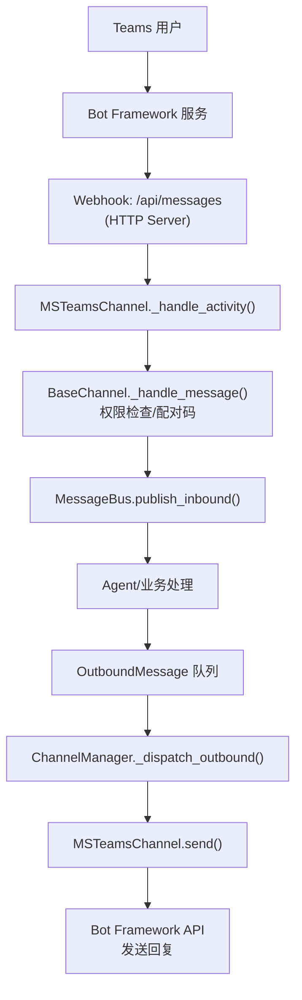
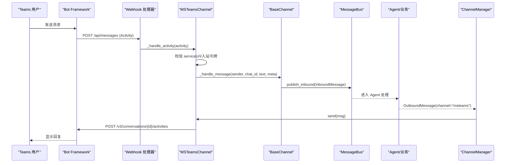
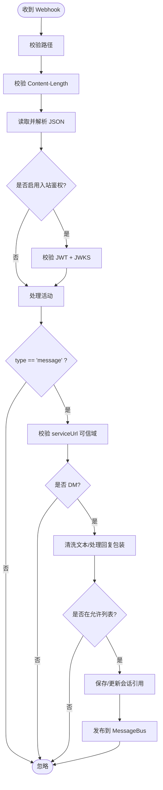
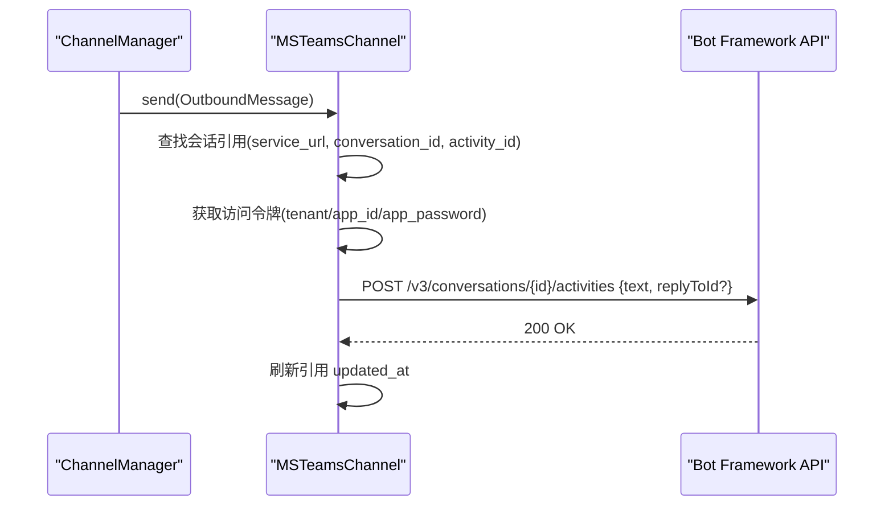
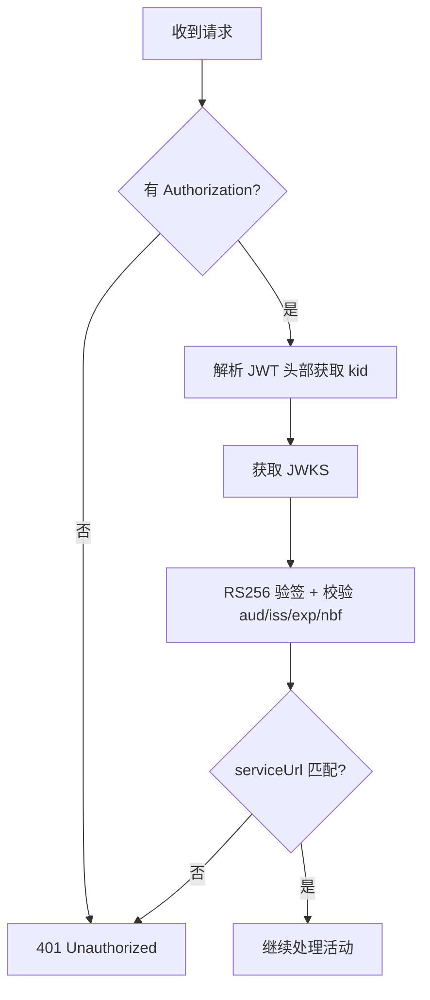
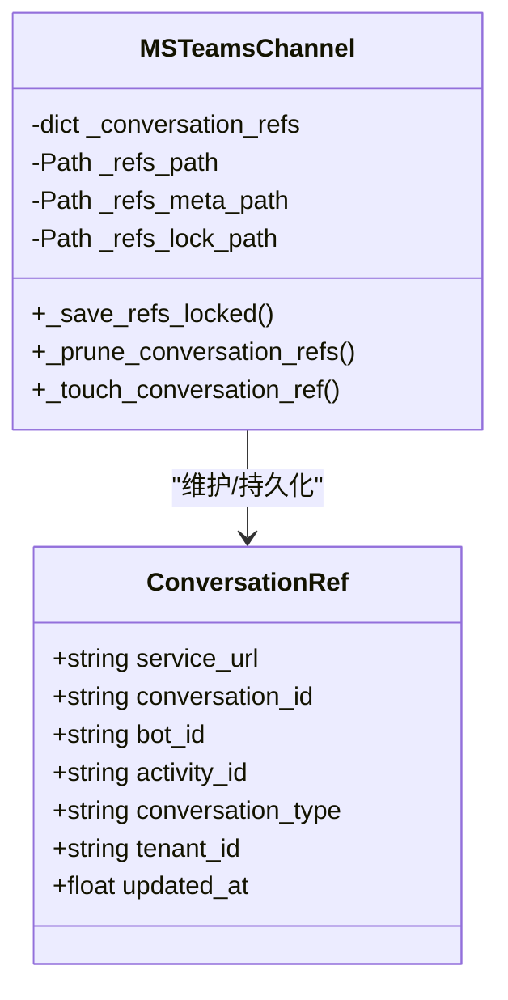
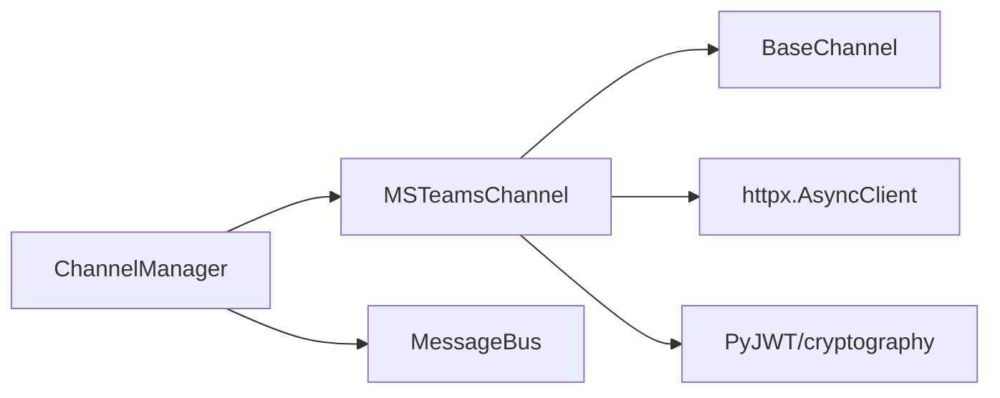

# Microsoft Teams 渠道

<cite>
**本文引用的文件**
- [agent/src/channels/msteams.py](file://agent/src/channels/msteams.py)
- [agent/src/channels/base.py](file://agent/src/channels/base.py)
- [agent/src/channels/manager.py](file://agent/src/channels/manager.py)
- [agent/tests/test_msteams_inbound_body_limit.py](file://agent/tests/test_msteams_inbound_body_limit.py)
</cite>

## 目录
1. [简介](#简介)
2. [项目结构](#项目结构)
3. [核心组件](#核心组件)
4. [架构总览](#架构总览)
5. [详细组件分析](#详细组件分析)
6. [依赖关系分析](#依赖关系分析)
7. [性能与可靠性](#性能与可靠性)
8. [故障排查指南](#故障排查指南)
9. [结论](#结论)
10. [附录：部署与配置要点](#附录：部署与配置要点)

## 简介
本章节面向在 Vibe-Trading 中启用 Microsoft Teams 渠道的读者，说明当前代码库中的 Teams 集成实现、消息处理流程、安全校验、会话引用持久化以及与企业环境相关的注意事项。需要特别说明的是：当前实现为“DM 优先”的最小可用版本（MVP），主要支持文本消息收发、Bot Framework Webhook 接收、入站令牌校验、会话引用持久化与清理；尚未内置 Adaptive Cards、富文本、附件等高级能力。

## 项目结构
Vibe-Trading 将多通道统一抽象为 Channel 接口，Teams 作为其中一个具体实现，通过内置 HTTP 服务器暴露 Bot Framework Webhook 端点，接收活动并转发到内部消息总线，再由出站分发器路由回 Teams。

图表来源
- [agent/src/channels/msteams.py:172-277](file://agent/src/channels/msteams.py#L172-L277)
- [agent/src/channels/base.py:179-227](file://agent/src/channels/base.py#L179-L227)
- [agent/src/channels/manager.py:283-369](file://agent/src/channels/manager.py#L283-L369)

章节来源
- [agent/src/channels/msteams.py:1-120](file://agent/src/channels/msteams.py#L1-L120)
- [agent/src/channels/base.py:1-82](file://agent/src/channels/base.py#L1-L82)
- [agent/src/channels/manager.py:36-137](file://agent/src/channels/manager.py#L36-L137)

## 核心组件
- MSTeamsChannel：Teams 渠道的具体实现，负责启动内置 HTTP 服务器、接收 Webhook、解析活动、校验入站令牌、维护会话引用、发送回复。
- BaseChannel：所有渠道的抽象基类，定义 start/stop/send、消息处理钩子、权限检查、配对码流程等通用行为。
- ChannelManager：发现并初始化启用的渠道，管理生命周期，协调出站消息的分发与重试。

章节来源
- [agent/src/channels/msteams.py:134-171](file://agent/src/channels/msteams.py#L134-L171)
- [agent/src/channels/base.py:22-82](file://agent/src/channels/base.py#L22-L82)
- [agent/src/channels/manager.py:36-137](file://agent/src/channels/manager.py#L36-L137)

## 架构总览
下图展示从 Teams 用户发消息到 Agent 处理再返回回复的完整链路，包括安全校验与会话引用管理。

图表来源
- [agent/src/channels/msteams.py:195-256](file://agent/src/channels/msteams.py#L195-L256)
- [agent/src/channels/msteams.py:330-403](file://agent/src/channels/msteams.py#L330-L403)
- [agent/src/channels/base.py:179-227](file://agent/src/channels/base.py#L179-L227)
- [agent/src/channels/manager.py:283-369](file://agent/src/channels/manager.py#L283-L369)
- [agent/src/channels/msteams.py:293-328](file://agent/src/channels/msteams.py#L293-L328)

## 详细组件分析

### MSTeamsChannel：Webhook 接收与活动处理
- 内置 HTTP 服务器监听配置的 host/port/path，默认路径为 /api/messages。
- 对入站请求进行 Content-Length 限制，防止恶意分配内存。
- 可选开启入站 Bot Framework bearer token 校验，使用 JWKS 验证签名与受众。
- 仅处理 message 类型活动，过滤非 DM（团队/频道）场景，保留 personal 或空 conversationType。
- 提取并清洗文本，处理 Teams 回复包装与提及标记，避免噪声。
- 维护会话引用（service_url、conversation_id、activity_id、tenant_id 等），落盘持久化并定期清理过期引用。
- 发送回复时获取访问令牌，构造 Activity 并通过 Bot Framework API 发送，支持线程内回复。

图表来源
- [agent/src/channels/msteams.py:195-256](file://agent/src/channels/msteams.py#L195-L256)
- [agent/src/channels/msteams.py:330-403](file://agent/src/channels/msteams.py#L330-L403)
- [agent/src/channels/msteams.py:505-546](file://agent/src/channels/msteams.py#L505-L546)
- [agent/src/channels/msteams.py:698-719](file://agent/src/channels/msteams.py#L698-L719)

章节来源
- [agent/src/channels/msteams.py:172-277](file://agent/src/channels/msteams.py#L172-L277)
- [agent/src/channels/msteams.py:330-403](file://agent/src/channels/msteams.py#L330-L403)
- [agent/src/channels/msteams.py:505-546](file://agent/src/channels/msteams.py#L505-L546)
- [agent/src/channels/msteams.py:688-719](file://agent/src/channels/msteams.py#L688-L719)

### 出站消息发送与线程回复
- 根据会话引用构建目标 URL，携带 Authorization 头调用 Bot Framework API。
- 若启用 reply_in_thread 且存在 activity_id，则通过 replyToId 实现线程内回复。
- 发送成功后刷新会话引用更新时间，必要时落盘。

图表来源
- [agent/src/channels/msteams.py:293-328](file://agent/src/channels/msteams.py#L293-L328)
- [agent/src/channels/msteams.py:846-869](file://agent/src/channels/msteams.py#L846-L869)

章节来源
- [agent/src/channels/msteams.py:293-328](file://agent/src/channels/msteams.py#L293-L328)
- [agent/src/channels/msteams.py:846-869](file://agent/src/channels/msteams.py#L846-L869)

### 入站令牌校验与安全
- 当 validate_inbound_auth 为真时，解析 Authorization Bearer Token，获取 kid 并从 Bot Framework JWKS 拉取公钥，校验 RS256 签名、受众（app_id）、签发者（api.botframework.com）。
- 校验 serviceUrl 声明与活动中的 serviceUrl 一致，确保来源可信。
- 同时限制入站 Body 大小，拒绝异常 Content-Length，防止资源耗尽攻击。

图表来源
- [agent/src/channels/msteams.py:505-546](file://agent/src/channels/msteams.py#L505-L546)
- [agent/src/channels/msteams.py:547-582](file://agent/src/channels/msteams.py#L547-L582)
- [agent/src/channels/msteams.py:71-90](file://agent/src/channels/msteams.py#L71-L90)

章节来源
- [agent/src/channels/msteams.py:505-546](file://agent/src/channels/msteams.py#L505-L546)
- [agent/src/channels/msteams.py:547-582](file://agent/src/channels/msteams.py#L547-L582)
- [agent/tests/test_msteams_inbound_body_limit.py:1-56](file://agent/tests/test_msteams_inbound_body_limit.py#L1-L56)

### 会话引用持久化与清理
- 会话引用包含 service_url、conversation_id、bot_id、activity_id、conversation_type、tenant_id、updated_at。
- 使用原子写入与跨进程锁保护，降低崩溃或并发写导致的损坏风险。
- 支持按 TTL 清理过期引用，并可剔除不支持的 Web Chat 或非个人对话引用。

图表来源
- [agent/src/channels/msteams.py:121-132](file://agent/src/channels/msteams.py#L121-L132)
- [agent/src/channels/msteams.py:612-670](file://agent/src/channels/msteams.py#L612-L670)
- [agent/src/channels/msteams.py:721-762](file://agent/src/channels/msteams.py#L721-L762)
- [agent/src/channels/msteams.py:777-844](file://agent/src/channels/msteams.py#L777-L844)

章节来源
- [agent/src/channels/msteams.py:612-670](file://agent/src/channels/msteams.py#L612-L670)
- [agent/src/channels/msteams.py:721-762](file://agent/src/channels/msteams.py#L721-L762)
- [agent/src/channels/msteams.py:777-844](file://agent/src/channels/msteams.py#L777-L844)

### 权限控制与配对码
- 基于 allow_from 白名单或全局星号允许策略；未授权用户在 DM 中会收到配对码提示，引导完成配对流程。
- 该逻辑由 BaseChannel 提供，MSTeamsChannel 复用。

章节来源
- [agent/src/channels/base.py:165-227](file://agent/src/channels/base.py#L165-L227)

### 出站分发与重试
- ChannelManager 负责消费出站队列，去重、合并流式片段、按 channel 路由到对应 Channel 实例。
- 发送失败采用指数退避重试，记录日志便于定位问题。

章节来源
- [agent/src/channels/manager.py:283-453](file://agent/src/channels/manager.py#L283-L453)

## 依赖关系分析
- MSTeamsChannel 依赖 BaseChannel 提供的通用能力（权限、配对码、消息封装）。
- ChannelManager 通过注册机制发现并加载各 Channel，统一管理生命周期与出站分发。
- MSTeamsChannel 依赖 httpx 进行异步 HTTP 通信，依赖 PyJWT 与 cryptography 进行令牌校验（可选）。

图表来源
- [agent/src/channels/msteams.py:34-53](file://agent/src/channels/msteams.py#L34-L53)
- [agent/src/channels/base.py:1-18](file://agent/src/channels/base.py#L1-L18)
- [agent/src/channels/manager.py:13-21](file://agent/src/channels/manager.py#L13-L21)

章节来源
- [agent/src/channels/msteams.py:34-53](file://agent/src/channels/msteams.py#L34-L53)
- [agent/src/channels/base.py:1-18](file://agent/src/channels/base.py#L1-L18)
- [agent/src/channels/manager.py:13-21](file://agent/src/channels/manager.py#L13-L21)

## 性能与可靠性
- 入站请求体大小限制：防止恶意 Content-Length 导致内存膨胀，测试覆盖边界与非法值。
- 会话引用持久化：原子写入与跨进程锁减少数据损坏风险；TTL 清理避免内存泄漏。
- 出站重试：指数退避提升网络抖动下的稳定性。
- 建议：在生产环境中启用入站鉴权、严格限定 trusted_service_url_hosts、合理设置 ref_ttl_days 与 ref_touch_interval_s。

章节来源
- [agent/tests/test_msteams_inbound_body_limit.py:1-56](file://agent/tests/test_msteams_inbound_body_limit.py#L1-L56)
- [agent/src/channels/msteams.py:71-90](file://agent/src/channels/msteams.py#L71-L90)
- [agent/src/channels/msteams.py:721-762](file://agent/src/channels/msteams.py#L721-L762)
- [agent/src/channels/manager.py:421-453](file://agent/src/channels/manager.py#L421-L453)

## 故障排查指南
- 无法启动 Teams 渠道：
  - 检查是否安装可选依赖（jwt、cryptography），否则会在启动时输出错误日志。
  - 确认 app_id/app_password 已配置，否则跳过启动。
- 入站被拒绝：
  - 检查 validate_inbound_auth 是否启用；如启用需确保 Bot Framework 正确签名且 audience/issuer 匹配。
  - 检查 serviceUrl 是否在 trusted_service_url_hosts 白名单内。
- 无法发送回复：
  - 检查是否存在有效的会话引用（conversation_id/service_url/activity_id）。
  - 检查访问令牌获取是否成功（tenant_id、app_id、app_password）。
- 会话引用丢失或过期：
  - 检查 TTL 配置与清理策略；查看 state 目录下 msteams_conversations.json 与元数据文件。
- 性能问题：
  - 关注入站请求体大小限制与出站重试次数；调整 ref_touch_interval_s 减少频繁落盘。

章节来源
- [agent/src/channels/msteams.py:172-187](file://agent/src/channels/msteams.py#L172-L187)
- [agent/src/channels/msteams.py:293-328](file://agent/src/channels/msteams.py#L293-L328)
- [agent/src/channels/msteams.py:505-546](file://agent/src/channels/msteams.py#L505-L546)
- [agent/src/channels/msteams.py:721-762](file://agent/src/channels/msteams.py#L721-L762)

## 结论
当前 Vibe-Trading 的 Microsoft Teams 渠道实现了最小可用的 DM 场景：安全的 Webhook 接收、入站令牌校验、会话引用持久化、出站消息发送与线程回复。对于企业级生产环境，建议启用入站鉴权、严格限制可信域名、合理配置 TTL 与清理策略，并结合监控告警关注启动失败、入站拒绝、发送失败等关键指标。如需卡片、富文本、附件等企业协作能力，可在现有基础上扩展 MSTeamsChannel 的消息格式与附件处理逻辑。

## 附录：部署与配置要点
- 环境变量与配置项（来自 MSTeamsConfig）：
  - enabled：是否启用 Teams 渠道
  - app_id / app_password：Bot Framework 应用标识与密钥
  - tenant_id：Microsoft Entra ID 租户（用于获取访问令牌）
  - host / port / path：Webhook 监听地址与路径
  - allow_from：允许的用户 ID 白名单
  - reply_in_thread：是否以线程方式回复
  - mention_only_response：无正文时的默认提示
  - validate_inbound_auth：是否校验入站令牌
  - ref_ttl_days / prune_web_chat_refs / prune_non_personal_refs / ref_touch_interval_s：会话引用 TTL 与清理策略
  - trusted_service_url_hosts：允许的 Bot Framework 服务域名集合
- 安全与合规建议：
  - 始终启用 validate_inbound_auth，避免任意主体伪造消息。
  - 严格限定 trusted_service_url_hosts，仅允许官方 Bot Framework 域名。
  - 限制入站请求体大小，防止资源耗尽攻击。
  - 在容器或反向代理后运行，确保 HTTPS 终止与访问控制。
- 监控与告警：
  - 关注渠道启动失败、入站鉴权失败、发送失败等日志。
  - 统计会话引用数量与清理频率，评估 TTL 配置合理性。
  - 对出站重试次数与延迟进行度量，识别网络或服务端异常。

章节来源
- [agent/src/channels/msteams.py:98-118](file://agent/src/channels/msteams.py#L98-L118)
- [agent/src/channels/msteams.py:172-187](file://agent/src/channels/msteams.py#L172-L187)
- [agent/src/channels/msteams.py:698-719](file://agent/src/channels/msteams.py#L698-L719)
- [agent/src/channels/msteams.py:721-762](file://agent/src/channels/msteams.py#L721-L762)