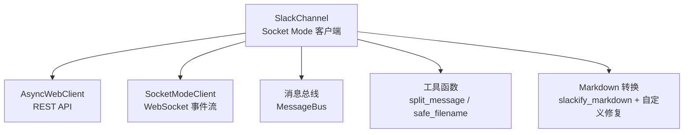
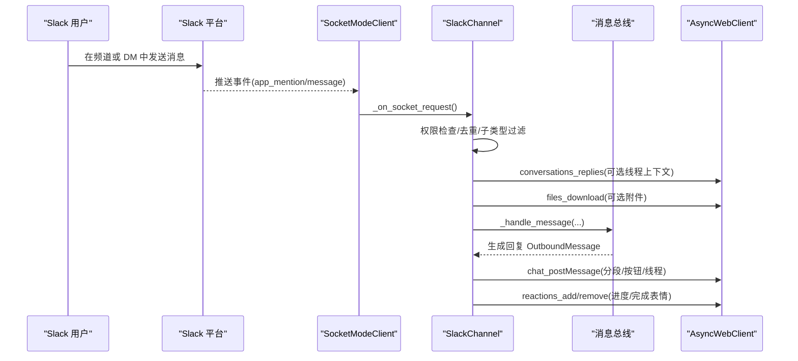
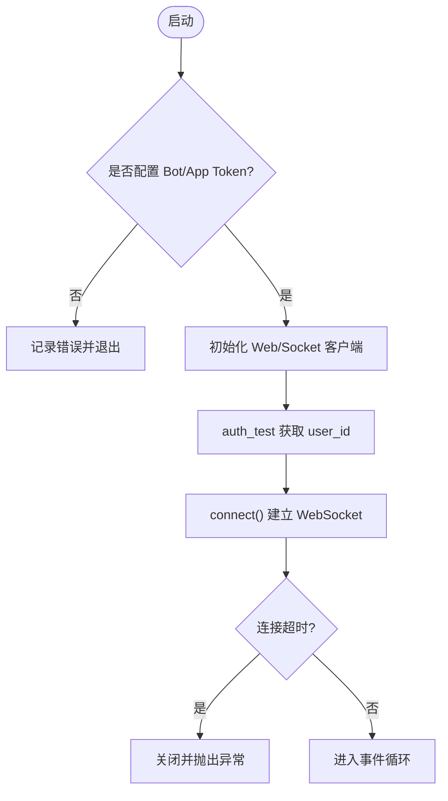
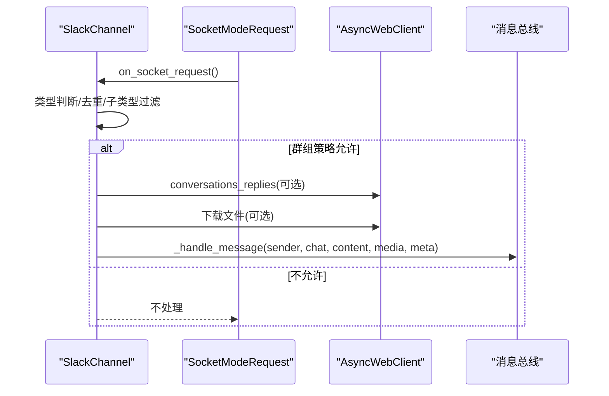
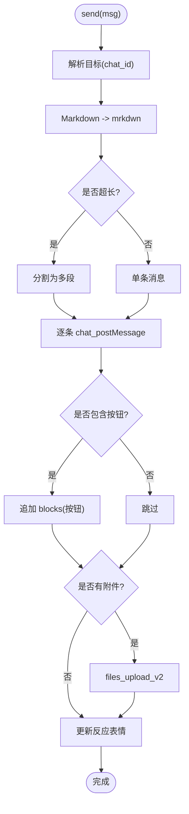
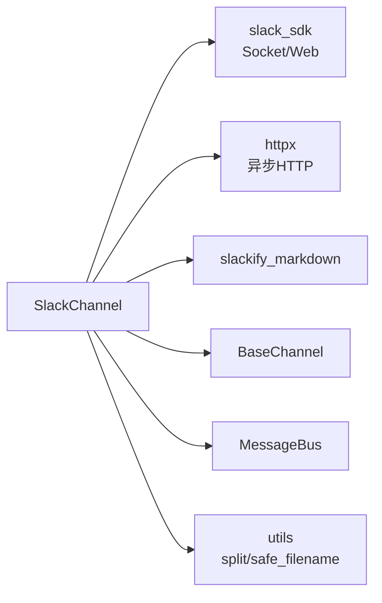

# Slack 渠道

<cite>
**本文引用的文件**
- [agent/src/channels/slack.py](file://agent/src/channels/slack.py)
- [agent/src/channels/base.py](file://agent/src/channels/base.py)
- [agent/src/channels/utils.py](file://agent/src/channels/utils.py)
- [agent/tests/test_slack_table_edge_columns.py](file://agent/tests/test_slack_table_edge_columns.py)
</cite>

## 目录
1. [简介](#简介)
2. [项目结构](#项目结构)
3. [核心组件](#核心组件)
4. [架构总览](#架构总览)
5. [详细组件分析](#详细组件分析)
6. [依赖关系分析](#依赖关系分析)
7. [性能与可靠性](#性能与可靠性)
8. [故障排查指南](#故障排查指南)
9. [结论](#结论)
10. [附录：安装与配置步骤](#附录安装与配置步骤)

## 简介
本章节面向 Vibe-Trading 的 Slack 渠道集成，系统性说明如何通过 Socket Mode 接入 Slack Bot API，完成 OAuth 认证、事件订阅、消息收发、富文本与附件处理、频道与用户解析、线程上下文、权限策略、错误处理与调试方法。文档以仓库内实际实现为依据，提供可操作的配置与排障建议。

## 项目结构
Slack 渠道位于 channels 子系统下，遵循统一的 BaseChannel 抽象，通过消息总线与系统其他模块交互。关键文件：
- 渠道实现：agent/src/channels/slack.py
- 基类接口：agent/src/channels/base.py
- 通用工具：agent/src/channels/utils.py
- 单元测试（Markdown 表格兼容）：agent/tests/test_slack_table_edge_columns.py

图表来源
- [agent/src/channels/slack.py:66-136](file://agent/src/channels/slack.py#L66-L136)
- [agent/src/channels/utils.py:53-94](file://agent/src/channels/utils.py#L53-L94)

章节来源
- [agent/src/channels/slack.py:66-136](file://agent/src/channels/slack.py#L66-L136)
- [agent/src/channels/base.py:22-81](file://agent/src/channels/base.py#L22-L81)
- [agent/src/channels/utils.py:53-94](file://agent/src/channels/utils.py#L53-L94)

## 核心组件
- SlackChannel：基于 Socket Mode 的 Slack 通道实现，负责连接、事件监听、消息发送、附件下载、Markdown 到 mrkdwn 转换、线程上下文获取、按钮交互等。
- BaseChannel：定义所有渠道的统一接口（start/stop/send/_handle_message），SlackChannel 继承并实现具体逻辑。
- 工具函数：消息分片、安全文件名、媒体目录管理等。

章节来源
- [agent/src/channels/slack.py:66-136](file://agent/src/channels/slack.py#L66-L136)
- [agent/src/channels/base.py:22-81](file://agent/src/channels/base.py#L22-L81)
- [agent/src/channels/utils.py:16-25](file://agent/src/channels/utils.py#L16-L25)

## 架构总览
Slack 渠道使用 Socket Mode 建立 WebSocket 长连接接收事件，同时使用 AsyncWebClient 调用 REST API 进行消息发送、文件上传、频道/用户查询等操作。事件进入后经过权限校验、内容预处理（Markdown→mrkdwn）、线程上下文注入、附件下载，再交由上层业务处理；回复时支持分段发送、按钮块、反应表情更新。

图表来源
- [agent/src/channels/slack.py:312-454](file://agent/src/channels/slack.py#L312-L454)
- [agent/src/channels/slack.py:151-199](file://agent/src/channels/slack.py#L151-L199)
- [agent/src/channels/slack.py:536-599](file://agent/src/channels/slack.py#L536-L599)
- [agent/src/channels/slack.py:456-495](file://agent/src/channels/slack.py#L456-L495)

## 详细组件分析

### SlackChannel 启动与连接
- 初始化：创建 AsyncWebClient（Bot Token）和 SocketModeClient（App Token），注册事件监听器。
- 认证测试：调用 auth_test 获取 bot_user_id，用于 @提及 识别与去重。
- 连接：通过 connect() 建立 WebSocket，设置超时保护，失败时记录日志并停止。
- 运行循环：保持进程存活，等待事件。

图表来源
- [agent/src/channels/slack.py:92-136](file://agent/src/channels/slack.py#L92-L136)

章节来源
- [agent/src/channels/slack.py:92-136](file://agent/src/channels/slack.py#L92-L136)

### 事件处理流程（接收消息）
- 仅处理 interactive 与 events_api 类型；对 events_api 立即响应 envelope 确认。
- 过滤非 message/app_mention、忽略 bot 自身消息、避免重复处理。
- 根据 channel_type 与策略决定是否响应（DM/群组）。
- 可选获取线程上下文（conversations_replies），附加到当前消息前。
- 下载私有文件（files_upload_v2 需要相应权限），将文件路径与标记注入内容。
- 调用 _handle_message 将入站消息推送到消息总线。

图表来源
- [agent/src/channels/slack.py:312-454](file://agent/src/channels/slack.py#L312-L454)

章节来源
- [agent/src/channels/slack.py:312-454](file://agent/src/channels/slack.py#L312-L454)

### 消息发送与格式转换
- 目标解析：支持 #频道名/@用户名、ID 引用、DM 自动打开。
- 内容转换：Markdown → Slack mrkdwn，保留代码块、表格、链接；超长消息按长度切分。
- 按钮支持：末尾追加 Block Kit 按钮，点击后作为 action value 回传。
- 线程与进度：支持 thread_ts 回复；进度消息跳过空内容；完成后更新反应表情。
- 附件上传：files_upload_v2 支持图片/文件，失败时记录异常。

图表来源
- [agent/src/channels/slack.py:151-199](file://agent/src/channels/slack.py#L151-L199)
- [agent/src/channels/slack.py:201-294](file://agent/src/channels/slack.py#L201-L294)
- [agent/src/channels/slack.py:698-755](file://agent/src/channels/slack.py#L698-L755)
- [agent/src/channels/utils.py:53-94](file://agent/src/channels/utils.py#L53-L94)

章节来源
- [agent/src/channels/slack.py:151-199](file://agent/src/channels/slack.py#L151-L199)
- [agent/src/channels/slack.py:201-294](file://agent/src/channels/slack.py#L201-L294)
- [agent/src/channels/slack.py:698-755](file://agent/src/channels/slack.py#L698-L755)

### 频道与用户解析
- 名称解析：conversations_list 分页查找公开/私有频道，缓存结果。
- 用户解析：users_list 分页匹配 handle/display name，自动打开 DM 并缓存。
- ID 正则：支持 Slack 标准 ID 前缀（C/G/U/W/D）及引用格式 <#...>/<@...>。

章节来源
- [agent/src/channels/slack.py:201-294](file://agent/src/channels/slack.py#L201-L294)

### 线程上下文与附件下载
- 线程上下文：首次进入线程时拉取历史消息，限制条数，格式化后拼接至当前消息前。
- 附件下载：通过私有 URL 下载文件到本地媒体目录，检测 HTML 误返回，失败时输出提示标记。

章节来源
- [agent/src/channels/slack.py:536-599](file://agent/src/channels/slack.py#L536-L599)
- [agent/src/channels/slack.py:456-495](file://agent/src/channels/slack.py#L456-L495)

### 按钮交互（Block Actions）
- 拦截 interactive 请求，立即响应 envelope。
- 提取 actions 值、用户与频道信息，构造会话键，转发到 _handle_message。

章节来源
- [agent/src/channels/slack.py:505-534](file://agent/src/channels/slack.py#L505-L534)

### Markdown 与富文本兼容
- 使用 slackify_markdown 做基础转换，并通过正则修复遗漏的粗体、标题、代码块、URL 转义等问题。
- 表格转换：将 Markdown 表格转为 Slack 可读列表，保留空列头与空单元格。

章节来源
- [agent/src/channels/slack.py:698-755](file://agent/src/channels/slack.py#L698-L755)
- [agent/tests/test_slack_table_edge_columns.py:43-68](file://agent/tests/test_slack_table_edge_columns.py#L43-L68)

## 依赖关系分析
- 外部库：slack_sdk（Socket Mode、Web Client）、httpx（文件下载）、slackify_markdown（Markdown 转换）。
- 内部依赖：BaseChannel 抽象、消息总线、配对与权限模块、工具函数。

图表来源
- [agent/src/channels/slack.py:8-22](file://agent/src/channels/slack.py#L8-L22)
- [agent/src/channels/base.py:10-17](file://agent/src/channels/base.py#L10-L17)
- [agent/src/channels/utils.py:16-25](file://agent/src/channels/utils.py#L16-L25)

章节来源
- [agent/src/channels/slack.py:8-22](file://agent/src/channels/slack.py#L8-L22)
- [agent/src/channels/base.py:10-17](file://agent/src/channels/base.py#L10-L17)

## 性能与可靠性
- 连接超时：WebSocket 握手设置超时，避免长时间阻塞。
- 消息分片：超过 Slack 限制的消息自动分段发送，保证完整性。
- 线程上下文缓存：限制尝试次数，防止无限增长。
- 文件下载：带超时与重定向跟随，检测 HTML 误返回，失败时降级为提示标记。
- 错误处理：发送与下载均捕获异常并记录日志，确保主流程稳定。

章节来源
- [agent/src/channels/slack.py:57-63](file://agent/src/channels/slack.py#L57-L63)
- [agent/src/channels/slack.py:120-136](file://agent/src/channels/slack.py#L120-L136)
- [agent/src/channels/slack.py:171-180](file://agent/src/channels/slack.py#L171-L180)
- [agent/src/channels/slack.py:536-599](file://agent/src/channels/slack.py#L536-L599)
- [agent/src/channels/slack.py:456-495](file://agent/src/channels/slack.py#L456-L495)

## 故障排查指南
- 权限问题
  - 现象：无法下载文件或收到 HTML 响应。
  - 原因：缺少 files:read 权限或 App Token 未正确传递。
  - 处理：检查 Slack App 权限范围，重新安装应用并确保 Bot Token 具备所需 scope。
  - 参考：[agent/src/channels/slack.py:456-495](file://agent/src/channels/slack.py#L456-L495)

- 网络连接
  - 现象：WebSocket 握手超时。
  - 原因：出站防火墙阻止 Slack WebSocket 或代理未生效。
  - 处理：确认网络可达性；注意 slack-sdk 的 WebSocket 连接不使用 HTTP(S)_PROXY。
  - 参考：[agent/src/channels/slack.py:120-136](file://agent/src/channels/slack.py#L120-L136)

- 消息格式兼容性
  - 现象：Markdown 表格显示异常或空列丢失。
  - 原因：转换过程中边界单元格处理不当。
  - 处理：使用内置表格转换逻辑，验证空列保留；必要时调整输入格式。
  - 参考：[agent/src/channels/slack.py:698-755](file://agent/src/channels/slack.py#L698-L755), [agent/tests/test_slack_table_edge_columns.py:43-68](file://agent/tests/test_slack_table_edge_columns.py#L43-L68)

- 权限策略
  - 现象：DM 或群组消息未被处理。
  - 原因：DM/群组策略限制或白名单未包含目标。
  - 处理：检查 dm.enabled/policy/allow_from 与 group_policy/group_allow_from。
  - 参考：[agent/src/channels/slack.py:642-671](file://agent/src/channels/slack.py#L642-L671)

- 线程上下文
  - 现象：线程内对话缺乏上下文。
  - 原因：include_thread_context 关闭或上下文获取失败。
  - 处理：开启 include_thread_context，检查 conversations_replies 权限与速率限制。
  - 参考：[agent/src/channels/slack.py:536-599](file://agent/src/channels/slack.py#L536-L599)

章节来源
- [agent/src/channels/slack.py:456-495](file://agent/src/channels/slack.py#L456-L495)
- [agent/src/channels/slack.py:120-136](file://agent/src/channels/slack.py#L120-L136)
- [agent/src/channels/slack.py:698-755](file://agent/src/channels/slack.py#L698-L755)
- [agent/src/channels/slack.py:642-671](file://agent/src/channels/slack.py#L642-L671)
- [agent/src/channels/slack.py:536-599](file://agent/src/channels/slack.py#L536-L599)
- [agent/tests/test_slack_table_edge_columns.py:43-68](file://agent/tests/test_slack_table_edge_columns.py#L43-L68)

## 结论
Vibe-Trading 的 Slack 渠道通过 Socket Mode 实现了高可靠的事件驱动通信，结合 REST API 完成消息发送、文件处理与频道/用户管理。其设计注重权限控制、消息格式兼容性与错误恢复，适合在生产环境中稳定运行。配合合理的权限配置与网络策略，可实现高效的 Slack 机器人集成。

## 附录：安装与配置步骤
- 创建 Slack App
  - 启用 Socket Mode，生成 App Token。
  - 添加 Bot Token，并授予必要权限（如 messages:read、files:read、channels:read、groups:read、im:read）。
  - 订阅事件：app_mention、message。
- 配置环境变量
  - 设置 Bot Token 与 App Token 供 SlackChannel 使用。
  - 根据需要配置 DM/群组策略、线程上下文、表情反应等选项。
- 启动与验证
  - 启动服务后观察日志：auth_test 成功、WebSocket 连接成功。
  - 在频道或 DM 中 @提及 机器人，验证消息接收与回复。
  - 发送附件与 Markdown 表格，验证下载与渲染。
- 常见问题
  - 若 WebSocket 握手超时，检查防火墙与代理设置。
  - 若文件下载失败，确认 files:read 权限与 App Token 有效性。
  - 若消息未处理，检查 DM/群组策略与白名单配置。

章节来源
- [agent/src/channels/slack.py:92-136](file://agent/src/channels/slack.py#L92-L136)
- [agent/src/channels/slack.py:642-671](file://agent/src/channels/slack.py#L642-L671)
- [agent/src/channels/slack.py:456-495](file://agent/src/channels/slack.py#L456-L495)