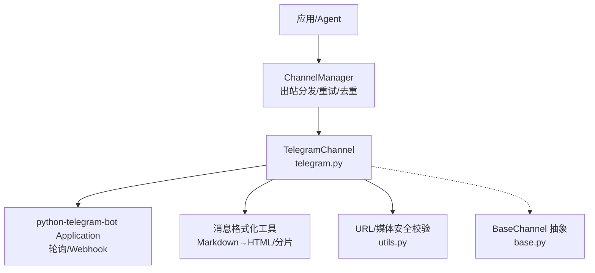
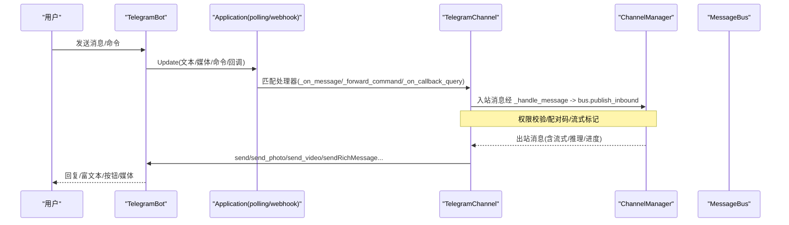
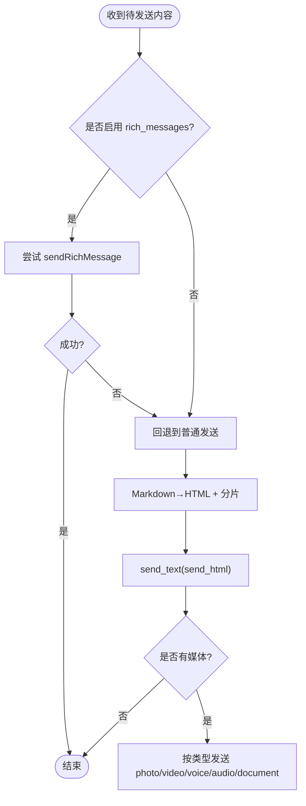
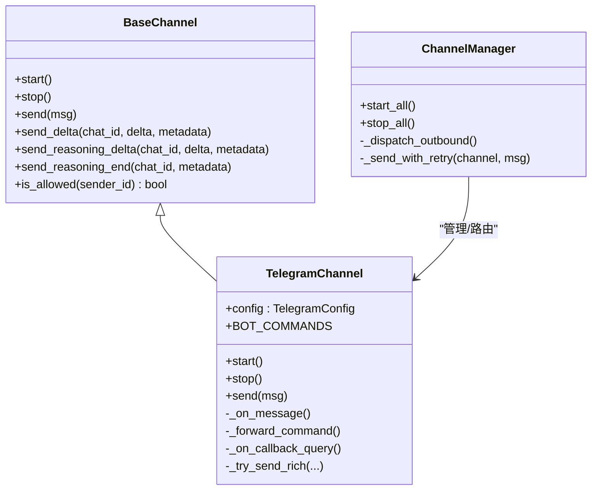

# Telegram 渠道

<cite>
**本文引用的文件**
- [agent/src/channels/telegram.py](file://agent/src/channels/telegram.py)
- [agent/src/channels/base.py](file://agent/src/channels/base.py)
- [agent/src/channels/config.py](file://agent/src/channels/config.py)
- [agent/src/channels/manager.py](file://agent/src/channels/manager.py)
- [agent/src/channels/utils.py](file://agent/src/channels/utils.py)
- [agent/tests/test_telegram_split_fence_hang.py](file://agent/tests/test_telegram_split_fence_hang.py)
- [agent/tests/test_telegram_table_edge_columns.py](file://agent/tests/test_telegram_table_edge_columns.py)
</cite>

## 目录
1. [简介](#简介)
2. [项目结构](#项目结构)
3. [核心组件](#核心组件)
4. [架构总览](#架构总览)
5. [详细组件分析](#详细组件分析)
6. [依赖关系分析](#依赖关系分析)
7. [性能与可靠性](#性能与可靠性)
8. [故障排查指南](#故障排查指南)
9. [结论](#结论)
10. [附录：部署与运维最佳实践](#附录部署与运维最佳实践)

## 简介
本章节面向 Vibe-Trading 的 Telegram 渠道集成，系统性说明如何基于 python-telegram-bot 实现长轮询或 Webhook 模式的消息收发、命令处理、内联键盘回调、媒体发送、消息分片与流式更新、群组/私聊/频道路由与权限控制，以及生产环境的部署与运维要点。文档严格依据仓库源码进行分析与总结，不引入外部假设。

## 项目结构
Telegram 渠道的实现位于 channels 子系统，围绕统一通道抽象（BaseChannel）进行扩展，并通过 ChannelManager 启动、协调与路由消息。关键文件职责如下：
- telegram.py：Telegram 渠道的具体实现，包含配置、消息收发、Markdown/HTML 转换、流式编辑、命令与回调处理、Webhook/轮询模式切换等。
- base.py：所有渠道的抽象基类，定义 start/stop/send、流式接口、权限校验与入站消息转发流程。
- manager.py：通道管理器，负责发现、初始化、启停各通道，以及出站消息分发与去重、重试、流合并。
- config.py：从结构化 Agent 配置中加载 channels 配置。
- utils.py：通用工具，如 URL 安全校验、消息分片、媒体目录等。

图表来源
- [agent/src/channels/manager.py:213-252](file://agent/src/channels/manager.py#L213-L252)
- [agent/src/channels/telegram.py:510-623](file://agent/src/channels/telegram.py#L510-L623)
- [agent/src/channels/base.py:58-81](file://agent/src/channels/base.py#L58-L81)

章节来源
- [agent/src/channels/telegram.py:1-120](file://agent/src/channels/telegram.py#L1-L120)
- [agent/src/channels/base.py:1-81](file://agent/src/channels/base.py#L1-L81)
- [agent/src/channels/manager.py:36-137](file://agent/src/channels/manager.py#L36-L137)
- [agent/src/channels/config.py:11-21](file://agent/src/channels/config.py#L11-L21)
- [agent/src/channels/utils.py:53-89](file://agent/src/channels/utils.py#L53-L89)

## 核心组件
- TelegramConfig：Pydantic 模型，描述 enabled、token、mode（polling/webhook）、allow_from、proxy、reply_to_message、react_emoji、group_policy、connection_pool_size、pool_timeout、streaming、inline_keyboards、rich_messages、stream_edit_interval、webhook_url、webhook_listen_host/port/path/secret_token/max_connections 等。
- TelegramChannel：继承 BaseChannel，实现 Telegram 的启动、停止、消息发送、流式编辑、命令与回调处理、Markdown/HTML 转换与分片、媒体发送、错误处理等。
- ChannelManager：统一生命周期管理，自动发现并启用通道，维护状态，负责出站消息分发、重试、去重与流合并。
- BaseChannel：抽象接口，定义 send/start/stop、流式接口、权限校验与入站消息转发。

章节来源
- [agent/src/channels/telegram.py:368-420](file://agent/src/channels/telegram.py#L368-L420)
- [agent/src/channels/telegram.py:423-623](file://agent/src/channels/telegram.py#L423-L623)
- [agent/src/channels/base.py:22-177](file://agent/src/channels/base.py#L22-L177)
- [agent/src/channels/manager.py:36-137](file://agent/src/channels/manager.py#L36-L137)

## 架构总览
Telegram 渠道通过 python-telegram-bot 的 Application 接入 Bot API，支持两种接收模式：
- 长轮询（polling）：默认模式，Application 持续调用 getUpdates。
- Webhook：将公网 HTTPS 地址注册为 Webhook，Telegram 推送更新到指定路径，本地监听端口接收。

出站消息由 ChannelManager 统一调度，按 channel/chat_id 路由至对应通道，并进行重试与去重。

图表来源
- [agent/src/channels/telegram.py:510-623](file://agent/src/channels/telegram.py#L510-L623)
- [agent/src/channels/base.py:179-227](file://agent/src/channels/base.py#L179-L227)
- [agent/src/channels/manager.py:283-369](file://agent/src/channels/manager.py#L283-L369)

## 详细组件分析

### Telegram 配置与模式
- 模式选择：polling（默认）或 webhook。当 mode=webhook 时，必须提供公网 HTTPS 的 webhook_url 与 secret_token，且 path 必须以 / 开头。
- 连接池：为 API 请求与 getUpdates 分别创建 HTTPXRequest，避免轮询占用发送带宽。
- 其他选项：allow_from 白名单、reply_to_message 是否携带 ReplyParameters、inline_keyboards 是否启用内联键盘回调、rich_messages 是否尝试 sendRichMessage、stream_edit_interval 流式编辑间隔、webhook_* 系列参数。

章节来源
- [agent/src/channels/telegram.py:368-420](file://agent/src/channels/telegram.py#L368-L420)
- [agent/src/channels/telegram.py:518-541](file://agent/src/channels/telegram.py#L518-L541)
- [agent/src/channels/telegram.py:579-623](file://agent/src/channels/telegram.py#L579-L623)

### 消息处理（文本、Markdown、HTML、文件）
- Markdown→HTML：将 Markdown 转换为 Telegram HTML，保留代码块、表格、链接、粗体、斜体、删除线、列表等；对特殊字符进行转义。
- 分片策略：
  - 原始 Markdown 按 4000 字符切分，保证 fenced code block 不被截断。
  - 渲染后的 HTML 按 4096 字符限制再次切分，避免最终渲染溢出。
  - 流式中间编辑使用纯文本预览，屏蔽 Markdown 语法干扰阅读。
- 媒体发送：根据扩展名推断类型（photo/video/voice/audio/document），支持本地路径与远程 URL（需通过 URL 安全校验）。视频附加 supports_streaming。
- 富消息：优先尝试 sendRichMessage（Bot API 10.1+），失败则回退到普通 send 路径。

图表来源
- [agent/src/channels/telegram.py:228-341](file://agent/src/channels/telegram.py#L228-L341)
- [agent/src/channels/telegram.py:678-731](file://agent/src/channels/telegram.py#L678-L731)
- [agent/src/channels/telegram.py:767-800](file://agent/src/channels/telegram.py#L767-L800)

章节来源
- [agent/src/channels/telegram.py:228-341](file://agent/src/channels/telegram.py#L228-L341)
- [agent/src/channels/telegram.py:678-731](file://agent/src/channels/telegram.py#L678-L731)
- [agent/src/channels/telegram.py:767-800](file://agent/src/channels/telegram.py#L767-L800)
- [agent/src/channels/utils.py:97-141](file://agent/src/channels/utils.py#L97-L141)

### 命令处理与内联查询
- 内置命令菜单：start、new、stop、restart、status、history、goal、pairing、model、skill、dream、dream_log、dream_restore、help。
- 命令路由：正则匹配 /start、/help 及一组“总线命令”（如 /new、/stop、/restart、/status、/dream、/history、/goal、/pairing、/model、/skill），并支持 @username 后缀。
- 内联键盘：若启用 inline_keyboards，注册 CallbackQueryHandler 处理按钮回调。

章节来源
- [agent/src/channels/telegram.py:434-456](file://agent/src/channels/telegram.py#L434-L456)
- [agent/src/channels/telegram.py:544-578](file://agent/src/channels/telegram.py#L544-L578)

### 群组聊天、私聊、频道的消息路由与用户管理
- 权限控制：
  - allow_from 白名单支持 * 通配或具体 ID/用户名。
  - 未授权用户在私聊中将收到配对码提示，引导完成配对。
  - 群组策略 group_policy 可配置为 open 或 mention（仅提及时响应）。
- 会话与线程：
  - 支持 reply_to_message 与 message_thread_id，便于在群组主题中回复。
  - 记录 bot 自身 ID/用户名，用于上下文判断。
- 反应与输入指示：
  - 可选 react_emoji 对用户消息添加表情反应。
  - 流式输出期间显示 typing 指示，结束时停止。

章节来源
- [agent/src/channels/base.py:165-227](file://agent/src/channels/base.py#L165-L227)
- [agent/src/channels/telegram.py:480-498](file://agent/src/channels/telegram.py#L480-L498)
- [agent/src/channels/telegram.py:733-766](file://agent/src/channels/telegram.py#L733-L766)

### 消息格式化、键盘按钮、内联键盘
- 格式化：Markdown→HTML 转换，支持代码块、表格、链接、粗体、斜体、删除线、列表等；HTML 特殊字符转义。
- 内联键盘：启用后通过 CallbackQueryHandler 处理按钮点击事件，可在业务逻辑中动态构建 InlineKeyboardMarkup。
- 富消息：优先使用 sendRichMessage 以获得更好的 Markdown 渲染体验，不可用时自动降级。

章节来源
- [agent/src/channels/telegram.py:228-341](file://agent/src/channels/telegram.py#L228-L341)
- [agent/src/channels/telegram.py:571-578](file://agent/src/channels/telegram.py#L571-L578)
- [agent/src/channels/telegram.py:678-731](file://agent/src/channels/telegram.py#L678-L731)

### Webhook 设置与长轮询
- 长轮询：Application.start_polling，适合单机或无公网域名场景。
- Webhook：Application.updater.start_webhook 绑定本地 host/port/path，并向 Telegram 注册 webhook_url（HTTPS）与 secret_token；支持 max_connections 限制并发。
- 安全：webhook_secret_token 长度与字符集校验，确保仅允许 A-Z、a-z、0-9、_、-。

章节来源
- [agent/src/channels/telegram.py:579-623](file://agent/src/channels/telegram.py#L579-L623)
- [agent/src/channels/telegram.py:394-420](file://agent/src/channels/telegram.py#L394-L420)

### 流式输出与编辑
- 流式缓冲：按 chat_id 维护 _StreamBuf，累积文本与上次编辑时间戳，控制 edit_message_text 频率。
- 分片与渲染：流式中间编辑使用纯文本预览，最终输出按 HTML 长度分片，避免超限。
- 合并优化：ChannelManager 会合并同一目标与 stream_id 的连续 _stream_delta 消息，减少 API 调用。

章节来源
- [agent/src/channels/telegram.py:349-366](file://agent/src/channels/telegram.py#L349-L366)
- [agent/src/channels/telegram.py:967-1073](file://agent/src/channels/telegram.py#L967-L1073)
- [agent/src/channels/manager.py:371-419](file://agent/src/channels/manager.py#L371-L419)

### 错误处理与重试
- 发送重试：ChannelManager._send_with_retry 指数退避重试（默认最多 2 次）。
- 网络异常：捕获 BadRequest、NetworkError、TimedOut 等，区分能力不足（如 sendRichMessage 不可用）与超时，必要时降级。
- 日志与诊断：记录错误信息，便于定位问题。

章节来源
- [agent/src/channels/manager.py:421-453](file://agent/src/channels/manager.py#L421-L453)
- [agent/src/channels/telegram.py:669-731](file://agent/src/channels/telegram.py#L669-L731)

## 依赖关系分析
- TelegramChannel 依赖：
  - python-telegram-bot：Application、MessageHandler、CallbackQueryHandler、filters、InlineKeyboardMarkup 等。
  - 内部模块：bus.events.OutboundMessage、bus.queue.MessageBus、base.BaseChannel、utils 工具函数。
- ChannelManager 依赖：
  - registry/discover：发现并加载通道插件。
  - config.paths：工作区路径解析（部分通道需要）。
- 安全与健壮性：
  - URL 安全校验防止 SSRF/内网访问。
  - 分片算法保障 Markdown/HTML 边界正确。

图表来源
- [agent/src/channels/base.py:22-177](file://agent/src/channels/base.py#L22-L177)
- [agent/src/channels/telegram.py:423-623](file://agent/src/channels/telegram.py#L423-L623)
- [agent/src/channels/manager.py:36-137](file://agent/src/channels/manager.py#L36-L137)

章节来源
- [agent/src/channels/telegram.py:1-36](file://agent/src/channels/telegram.py#L1-L36)
- [agent/src/channels/manager.py:1-24](file://agent/src/channels/manager.py#L1-L24)

## 性能与可靠性
- 连接池隔离：API 请求与 getUpdates 使用独立连接池，避免互相阻塞。
- 流式合并：ChannelManager 合并同目标的连续流式片段，降低 API 调用次数。
- 分片策略：Markdown 与 HTML 双阶段分片，兼顾可读性与平台限制。
- 重试机制：指数退避重试，提高弱网环境下的稳定性。
- 富消息降级：自动检测 sendRichMessage 可用性，失败时回退，保证兼容性。

章节来源
- [agent/src/channels/telegram.py:518-541](file://agent/src/channels/telegram.py#L518-L541)
- [agent/src/channels/manager.py:371-419](file://agent/src/channels/manager.py#L371-L419)
- [agent/src/channels/manager.py:421-453](file://agent/src/channels/manager.py#L421-L453)
- [agent/src/channels/telegram.py:678-731](file://agent/src/channels/telegram.py#L678-L731)

## 故障排查指南
- 无法启动：检查 token 是否配置；若 mode=webhook，确认 webhook_url 为公网 HTTPS 且 webhook_secret_token 合法。
- 消息未送达：查看 ChannelManager 重试日志；确认 allow_from 白名单与 pairing 流程。
- 富消息失败：若出现方法不存在或参数无效，系统会自动禁用 sendRichMessage 并回退。
- 媒体发送失败：确认 URL 安全校验通过；本地路径需位于 uploads 目录。
- 流式卡顿：调整 stream_edit_interval；检查网络延迟与 Telegram API 限流。

章节来源
- [agent/src/channels/telegram.py:510-515](file://agent/src/channels/telegram.py#L510-L515)
- [agent/src/channels/telegram.py:394-420](file://agent/src/channels/telegram.py#L394-L420)
- [agent/src/channels/telegram.py:678-731](file://agent/src/channels/telegram.py#L678-L731)
- [agent/src/channels/utils.py:97-141](file://agent/src/channels/utils.py#L97-L141)

## 结论
Vibe-Trading 的 Telegram 渠道以统一的通道抽象为基础，提供了完善的消息收发、格式化、流式输出、命令与内联键盘支持，并具备生产级的高可用特性（重试、降级、分片、连接池隔离）。通过灵活的配置项，可适配不同部署场景（长轮询或 Webhook），满足企业级需求。

## 附录：部署与运维最佳实践
- BotFather 配置
  - 获取 Bot Token：通过 @BotFather 创建新 Bot 并复制 Token。
  - 设置命令菜单：可通过 set_my_commands 注册命令（代码已内置常用命令）。
  - 内联键盘：按需启用 inline_keyboards，并在业务中构造 InlineKeyboardMarkup。
- Webhook 模式
  - 公网 HTTPS：使用反向代理（如 Nginx/Traefik）暴露 /telegram 路径，证书由代理管理。
  - Secret Token：设置强随机字符串，长度 1-256，仅允许字母数字下划线连字符。
  - 监听参数：webhook_listen_host/port 决定本地监听地址与端口；webhook_path 必须以 / 开头。
- 权限管理
  - allow_from：支持 * 或具体 ID/用户名；未授权用户在私聊中触发配对流程。
  - group_policy：open 或 mention，控制群组中的响应策略。
- 服务器与负载均衡
  - 多实例：每个实例独立运行 Application；Webhook 模式下由负载均衡器将请求分发到多个实例。
  - 连接池：合理设置 connection_pool_size 与 pool_timeout，避免资源耗尽。
  - 监控与日志：关注 ChannelManager 重试与错误日志，及时扩容或调优。
- SSL 证书
  - 建议由反向代理终止 TLS，后端仅处理 HTTP；如需直连 Telegram，请确保 webhook_url 为有效 HTTPS。
- 生产建议
  - 启用 streaming 与 inline_keyboards 按需开启。
  - 使用 rich_messages 提升渲染体验，但保持降级兼容。
  - 定期轮换 webhook_secret_token，加强安全性。

章节来源
- [agent/src/channels/telegram.py:368-420](file://agent/src/channels/telegram.py#L368-L420)
- [agent/src/channels/telegram.py:579-623](file://agent/src/channels/telegram.py#L579-L623)
- [agent/src/channels/base.py:165-227](file://agent/src/channels/base.py#L165-L227)
- [agent/src/channels/manager.py:213-252](file://agent/src/channels/manager.py#L213-L252)