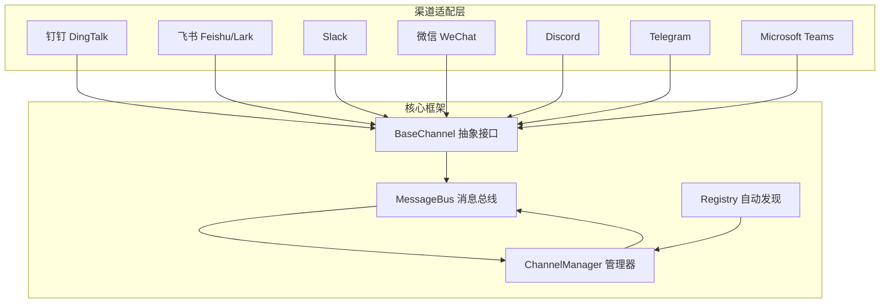
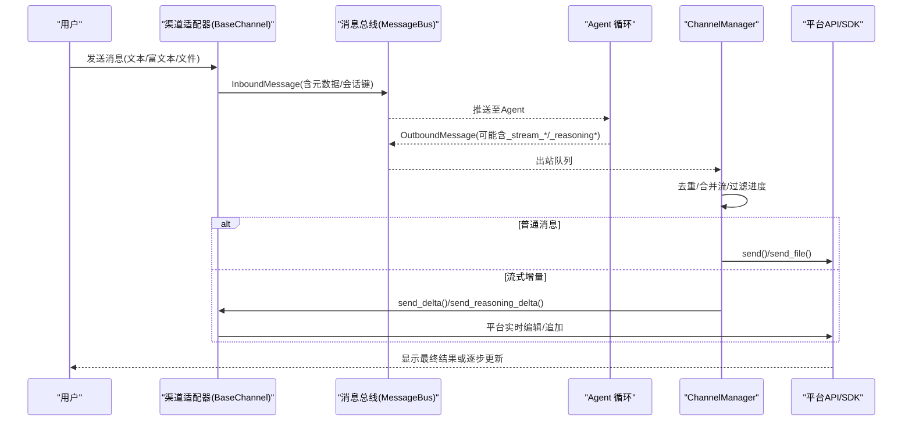
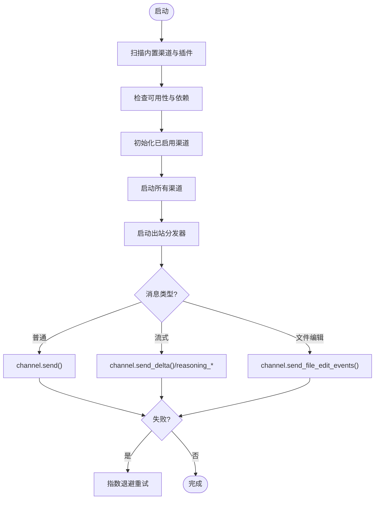

# 内置渠道集成

<cite>
**本文引用的文件**
- [agent/src/channels/__init__.py](file://agent/src/channels/__init__.py)
- [agent/src/channels/base.py](file://agent/src/channels/base.py)
- [agent/src/channels/config.py](file://agent/src/channels/config.py)
- [agent/src/channels/manager.py](file://agent/src/channels/manager.py)
- [agent/src/channels/registry.py](file://agent/src/channels/registry.py)
- [agent/src/channels/dingtalk.py](file://agent/src/channels/dingtalk.py)
- [agent/src/channels/feishu.py](file://agent/src/channels/feishu.py)
- [agent/src/channels/slack.py](file://agent/src/channels/slack.py)
- [agent/src/channels/weixin.py](file://agent/src/channels/weixin.py)
- [agent/src/channels/discord.py](file://agent/src/channels/discord.py)
</cite>

## 目录
1. [简介](#简介)
2. [项目结构](#项目结构)
3. [核心组件](#核心组件)
4. [架构总览](#架构总览)
5. [详细组件分析](#详细组件分析)
6. [依赖关系分析](#依赖关系分析)
7. [性能与限流](#性能与限流)
8. [故障排除指南](#故障排除指南)
9. [结论](#结论)
10. [附录：配置与环境变量速查](#附录：配置与环境变量速查)

## 简介
本章节面向 Vibe-Trading 的“内置渠道集成”，系统性地说明如何接入钉钉（DingTalk）、飞书（Feishu/Lark）、Slack、微信（WeChat）、Discord、Telegram、Microsoft Teams 等聊天平台。文档覆盖认证方式、API 调用、消息格式转换、文件传输、流式输出差异、跨平台统一处理、配置项与环境变量、限流策略与错误处理，并提供可操作的配置示例与排障指引。

## 项目结构
Vibe-Trading 通过 channels 模块提供插件化的多 IM 适配器层，将各平台的入站消息统一投递到消息总线，再由 ChannelManager 负责出站路由与重试、去重、流合并等通用逻辑。

图表来源
- [agent/src/channels/base.py:22-151](file://agent/src/channels/base.py#L22-L151)
- [agent/src/channels/manager.py:36-137](file://agent/src/channels/manager.py#L36-L137)
- [agent/src/channels/registry.py:87-127](file://agent/src/channels/registry.py#L87-L127)

章节来源
- [agent/src/channels/__init__.py:1-49](file://agent/src/channels/__init__.py#L1-L49)
- [agent/src/channels/base.py:22-151](file://agent/src/channels/base.py#L22-L151)
- [agent/src/channels/manager.py:36-137](file://agent/src/channels/manager.py#L36-L137)
- [agent/src/channels/registry.py:87-127](file://agent/src/channels/registry.py#L87-L127)

## 核心组件
- BaseChannel：定义所有渠道必须实现的 start/stop/send 以及可选的 send_delta/send_reasoning_* 等流式钩子；内置权限校验、配对码流程、流式能力探测。
- ChannelManager：启动/停止渠道、出站分发、重试退避、重复抑制、流片段合并、进度/工具提示过滤。
- Registry：扫描内置渠道与外部插件，检查可用性与安装提示，按需加载。
- Config：从结构化 agent 配置中加载 channels 配置段。

章节来源
- [agent/src/channels/base.py:22-151](file://agent/src/channels/base.py#L22-L151)
- [agent/src/channels/manager.py:36-137](file://agent/src/channels/manager.py#L36-L137)
- [agent/src/channels/registry.py:87-127](file://agent/src/channels/registry.py#L87-L127)
- [agent/src/channels/config.py:11-22](file://agent/src/channels/config.py#L11-L22)

## 架构总览
下图展示从用户消息到 Agent 循环再到渠道回复的端到端流程，并体现流式输出的分支路径。

图表来源
- [agent/src/channels/base.py:85-151](file://agent/src/channels/base.py#L85-L151)
- [agent/src/channels/manager.py:283-419](file://agent/src/channels/manager.py#L283-L419)

## 详细组件分析

### 钉钉（DingTalk）
- 认证方式
  - Stream Mode：使用 dingtalk-stream SDK 建立 WebSocket 接收事件；发送消息通过 HTTP API 获取 access_token。
  - 配置项：client_id、client_secret、allow_from、group_user_isolation、远程媒体重定向白名单等。
- 入站消息
  - 解析 ChatbotMessage，支持文本、图片、文件、富文本（粗体/斜体/行内代码/代码块），附件下载后以本地路径回传。
- 出站消息
  - 文本：Markdown 消息；图片：优先 photoURL，失败则上传 mediaId；文件：上传后以 mediaId 发送。
  - HTML 附件会被打包为 zip 再上传。
- 流式输出
  - 未实现 send_delta，走普通 send 路径。
- 安全与限流
  - 远程媒体下载限制大小与跳转次数，支持按主机白名单放行；网络异常记录日志。
- 典型配置要点
  - 启用 enabled、填写 client_id/client_secret；如需群聊隔离开启 group_user_isolation。

章节来源
- [agent/src/channels/dingtalk.py:166-198](file://agent/src/channels/dingtalk.py#L166-L198)
- [agent/src/channels/dingtalk.py:215-258](file://agent/src/channels/dingtalk.py#L215-L258)
- [agent/src/channels/dingtalk.py:271-296](file://agent/src/channels/dingtalk.py#L271-L296)
- [agent/src/channels/dingtalk.py:302-339](file://agent/src/channels/dingtalk.py#L302-L339)
- [agent/src/channels/dingtalk.py:341-479](file://agent/src/channels/dingtalk.py#L341-L479)
- [agent/src/channels/dingtalk.py:512-670](file://agent/src/channels/dingtalk.py#L512-L670)
- [agent/src/channels/dingtalk.py:672-774](file://agent/src/channels/dingtalk.py#L672-L774)

### 飞书（Feishu/Lark）
- 认证方式
  - WebSocket 长连接：lark-oapi SDK；支持扫码创建应用并自动写入凭据；支持 feishu/lark 双域名。
  - 配置项：app_id/app_secret、encrypt_key/verification_token、react_emoji、done_emoji、streaming、domain、topic_isolation 等。
- 入站消息
  - 解析多种卡片与富文本结构，提取标题、段落、链接、表格、图片 key 等；支持分享卡片、交互卡片、日历事件等语义化占位。
- 出站消息
  - 文本：Markdown；支持 CardKit 流式更新，按 chat_id/stream_id 维护缓冲区，节流编辑。
- 流式输出
  - 实现 send_delta 与 reasoning 流；使用 _STREAM_EDIT_INTERVAL 控制编辑频率，避免频繁刷新。
- 安全与限流
  - 懒加载重型 SDK，避免启动时导入开销；WebSocket 线程隔离事件循环，避免主循环冲突。
- 典型配置要点
  - 首次运行可通过 login 扫码完成 app_id/app_secret 配置；domain 选择 feishu 或 lark。

章节来源
- [agent/src/channels/feishu.py:341-358](file://agent/src/channels/feishu.py#L341-L358)
- [agent/src/channels/feishu.py:379-554](file://agent/src/channels/feishu.py#L379-L554)
- [agent/src/channels/feishu.py:559-604](file://agent/src/channels/feishu.py#L559-L604)
- [agent/src/channels/feishu.py:667-785](file://agent/src/channels/feishu.py#L667-L785)

### Slack
- 认证方式
  - Socket Mode：使用 app_token 与 bot_token 建立 WebSocket 接收事件；REST 用于发消息与文件上传。
  - 配置项：mode=socket、webhook_path（仅兼容字段）、reply_in_thread、include_thread_context、group_policy、dm.policy 等。
- 入站消息
  - 处理 message/app_mention 事件，支持引用上下文、线程历史抓取、按钮交互；私聊与群组策略分离。
- 出站消息
  - Markdown -> mrkdwn 转换，超长拆分；支持 Block Kit 按钮；文件通过 files_upload_v2 上传；完成后更新表情反应。
- 流式输出
  - 未实现 send_delta，走普通 send；通过 split_message 分片发送。
- 安全与限流
  - Socket 握手超时保护；下载私有文件需授权 scope；HTML 响应拦截。
- 典型配置要点
  - 启用 dm.enabled 与 group_policy；必要时设置 group_require_mention 提高安全性。

章节来源
- [agent/src/channels/slack.py:25-63](file://agent/src/channels/slack.py#L25-L63)
- [agent/src/channels/slack.py:92-140](file://agent/src/channels/slack.py#L92-L140)
- [agent/src/channels/slack.py:151-199](file://agent/src/channels/slack.py#L151-L199)
- [agent/src/channels/slack.py:312-455](file://agent/src/channels/slack.py#L312-L455)
- [agent/src/channels/slack.py:456-504](file://agent/src/channels/slack.py#L456-L504)
- [agent/src/channels/slack.py:698-755](file://agent/src/channels/slack.py#L698-L755)

### 微信（WeChat，个人号）
- 认证方式
  - HTTP 长轮询：ilinkai.weixin.qq.com；二维码登录获取 token；支持 base_url/cdn_base_url/route_tag 等。
  - 配置项：token、base_url、poll_timeout、state_dir、allow_from 等；状态持久化到 account.json。
- 入站消息
  - 解析 item_list（文本/图片/语音/文件/视频），支持引用消息、语音转写、媒体下载；上下文 token 缓存用于回复。
- 出站消息
  - 文本长度限制；文件上传与类型推断；支持 typing 指示器与 ticket 保活。
- 流式输出
  - 未实现 send_delta，走普通 send；通过分片与重试提升稳定性。
- 安全与限流
  - 会话过期暂停机制；连续失败退避；QR 过期自动刷新；请求头携带随机 UIN 与版本信息。
- 典型配置要点
  - 首次运行执行 login 扫码；若 token 失效会自动进入暂停恢复流程。

章节来源
- [agent/src/channels/weixin.py:121-133](file://agent/src/channels/weixin.py#L121-L133)
- [agent/src/channels/weixin.py:175-232](file://agent/src/channels/weixin.py#L175-L232)
- [agent/src/channels/weixin.py:247-321](file://agent/src/channels/weixin.py#L247-L321)
- [agent/src/channels/weixin.py:327-416](file://agent/src/channels/weixin.py#L327-L416)
- [agent/src/channels/weixin.py:443-515](file://agent/src/channels/weixin.py#L443-L515)
- [agent/src/channels/weixin.py:538-593](file://agent/src/channels/weixin.py#L538-L593)
- [agent/src/channels/weixin.py:598-800](file://agent/src/channels/weixin.py#L598-L800)

### Discord
- 认证方式
  - discord.py：使用 token 与 intents 连接；支持代理与代理认证。
  - 配置项：token、intents、allow_channels、group_policy、read_receipt_emoji、working_emoji、streaming 等。
- 入站消息
  - 处理消息与线程事件；支持 Slash 命令转发；自动识别父频道与线程上下文；支持附件下载与大小限制。
- 出站消息
  - 文本按 2000 字符拆分；支持引用回复与 mention 设置；文件上传限制 20MB；失败时生成回退文本。
- 流式输出
  - 实现 send_delta：首条发送，后续 edit 渐进更新；按 stream_id 区分多路流；结束清理缓冲区与反应。
- 安全与限流
  - 群组策略支持 open/mention；系统消息过滤；typing 指示器周期性上报。
- 典型配置要点
  - 在服务器启用 intents 并配置 allow_channels 精确控制可用频道。

章节来源
- [agent/src/channels/discord.py:40-66](file://agent/src/channels/discord.py#L40-L66)
- [agent/src/channels/discord.py:70-245](file://agent/src/channels/discord.py#L70-L245)
- [agent/src/channels/discord.py:339-447](file://agent/src/channels/discord.py#L339-L447)
- [agent/src/channels/discord.py:454-530](file://agent/src/channels/discord.py#L454-L530)
- [agent/src/channels/discord.py:532-643](file://agent/src/channels/discord.py#L532-L643)
- [agent/src/channels/discord.py:645-800](file://agent/src/channels/discord.py#L645-L800)

### Telegram、Microsoft Teams
- 现状说明
  - 仓库中存在 telegram.py 与 msteams.py 文件，但当前文档未深入展开其实现细节。建议参考同目录下其他渠道的实现模式（BaseChannel 接口、注册表、配置模型）进行扩展。
- 建议实践
  - 遵循 BaseChannel 的 send_delta/send_reasoning_* 契约；在 registry 中声明可选依赖与安装提示；在 manager 中复用重试与流合并逻辑。

章节来源
- [agent/src/channels/registry.py:33-63](file://agent/src/channels/registry.py#L33-L63)

## 依赖关系分析
- 渠道发现与加载
  - 通过 pkgutil 扫描内置模块，结合 entry_points 发现外部插件；对每个渠道检测可选依赖是否满足，否则返回安装提示。
- 管理器职责
  - 初始化 enabled 渠道、构建构造参数（如 websocket/matrix 的特殊服务注入）、全局布尔覆盖（send_progress/show_reasoning 等）。
- 出站分发
  - 根据 metadata 路由到 send/send_delta/send_reasoning_*；对 _stream_delta 做目标级合并以减少 API 调用；对重复内容指纹去重。

图表来源
- [agent/src/channels/registry.py:193-220](file://agent/src/channels/registry.py#L193-L220)
- [agent/src/channels/manager.py:64-137](file://agent/src/channels/manager.py#L64-L137)
- [agent/src/channels/manager.py:283-419](file://agent/src/channels/manager.py#L283-L419)

章节来源
- [agent/src/channels/registry.py:87-127](file://agent/src/channels/registry.py#L87-L127)
- [agent/src/channels/manager.py:64-137](file://agent/src/channels/manager.py#L64-L137)
- [agent/src/channels/manager.py:283-419](file://agent/src/channels/manager.py#L283-L419)

## 性能与限流
- 出站重试与退避
  - 默认最多 2 次尝试，间隔 1s/2s/4s；可通过 send_max_retries 调整。
- 流式合并
  - 对同一目标与 stream_id 的连续 _stream_delta 进行合并，减少 API 调用次数。
- 平台特定限制
  - Slack：Socket Mode 握手超时保护；消息长度上限约 40k，实际按 39k 切分。
  - Discord：消息长度 2000 字符；附件最大 20MB；编辑节流 _STREAM_EDIT_INTERVAL。
  - 飞书：CardKit 流式编辑节流 _STREAM_EDIT_INTERVAL。
  - 钉钉：远程媒体下载大小与跳转限制；HTML 附件压缩为 zip。
  - 微信：会话过期暂停、连续失败退避、QR 自动刷新。
- 进度与工具提示过滤
  - 根据 channel 的 send_progress/send_tool_hints 开关过滤非关键消息，降低噪音。

章节来源
- [agent/src/channels/manager.py:26-33](file://agent/src/channels/manager.py#L26-L33)
- [agent/src/channels/manager.py:421-453](file://agent/src/channels/manager.py#L421-L453)
- [agent/src/channels/manager.py:371-419](file://agent/src/channels/manager.py#L371-L419)
- [agent/src/channels/slack.py:57-63](file://agent/src/channels/slack.py#L57-L63)
- [agent/src/channels/discord.py:35-38](file://agent/src/channels/discord.py#L35-L38)
- [agent/src/channels/discord.py:344-345](file://agent/src/channels/discord.py#L344-L345)
- [agent/src/channels/feishu.py:584-585](file://agent/src/channels/feishu.py#L584-L585)
- [agent/src/channels/dingtalk.py:23-24](file://agent/src/channels/dingtalk.py#L23-L24)
- [agent/src/channels/weixin.py:78-99](file://agent/src/channels/weixin.py#L78-L99)

## 故障排除指南
- 渠道不可用或未安装依赖
  - 现象：status 中 available=false，error 提示缺少可选依赖。
  - 处理：按 install_hint 安装对应 extras（如 dingtalk、discord、feishu、slack、msteams、wecom、whatsapp、telegram、matrix、websocket）。
- 认证失败
  - 钉钉：未配置 client_id/client_secret 或 access_token 获取失败。
  - 飞书：未配置 app_id/app_secret；可通过 login 扫码重新绑定。
  - Slack：未配置 bot_token/app_token；Socket Mode 握手超时检查防火墙/代理。
  - 微信：未登录或 token 过期；执行 login 扫码；关注会话暂停提示。
  - Discord：未配置 token；检查 intents 与服务器权限。
- 出站失败
  - 重试：观察日志中的 attempt 计数与延迟；确认平台限流与配额。
  - 流式：确认 channel 实现了 send_delta；检查 _stream_id 一致性。
- 权限与准入
  - 基础：allow_from 白名单或 pairing 码流程；DM 场景下会发送配对码。
  - Slack/Discord：群组策略（open/mention/allowlist）与 require_mention 组合。
- 常见问题定位
  - 查看 ChannelManager 的 get_status 输出；核对 enabled/loaded/running/error 字段。
  - 检查渠道日志中的具体错误堆栈与平台返回码。

章节来源
- [agent/src/channels/registry.py:33-63](file://agent/src/channels/registry.py#L33-L63)
- [agent/src/channels/base.py:165-227](file://agent/src/channels/base.py#L165-L227)
- [agent/src/channels/manager.py:460-473](file://agent/src/channels/manager.py#L460-L473)
- [agent/src/channels/slack.py:92-140](file://agent/src/channels/slack.py#L92-L140)
- [agent/src/channels/weixin.py:443-515](file://agent/src/channels/weixin.py#L443-L515)
- [agent/src/channels/discord.py:394-447](file://agent/src/channels/discord.py#L394-L447)

## 结论
Vibe-Trading 的渠道集成采用统一的 BaseChannel 抽象与 ChannelManager 编排，屏蔽了各平台协议差异，提供一致的入站/出站、流式输出、权限控制与重试机制。对于不同平台，重点在于：
- 认证与连接方式（WebSocket/HTTP 长轮询/SDK）
- 消息与富文本映射（Markdown -> 平台格式）
- 文件传输与安全校验（SSRF/大小/重定向）
- 流式输出策略（edit 更新 vs 追加发送）
- 群组/DM 策略与权限控制
- 限流与错误恢复（重试、退避、会话暂停）

## 附录：配置与环境变量速查
- 通用
  - channels.*.enabled：启用渠道
  - channels.allow_from：允许列表
  - channels.send_progress / show_reasoning：全局开关
  - channels.send_max_retries：出站重试次数
- 钉钉
  - client_id、client_secret、group_user_isolation、remote_media_redirect_allowed_hosts
- 飞书
  - app_id、app_secret、encrypt_key、verification_token、domain(feishu|lark)、streaming、topic_isolation
- Slack
  - mode=socket、bot_token、app_token、reply_in_thread、include_thread_context、group_policy、dm.policy
- 微信
  - token、base_url、cdn_base_url、route_tag、poll_timeout、state_dir
- Discord
  - token、intents、allow_channels、group_policy、streaming、proxy/proxy_username/proxy_password

章节来源
- [agent/src/channels/config.py:11-22](file://agent/src/channels/config.py#L11-L22)
- [agent/src/channels/registry.py:33-63](file://agent/src/channels/registry.py#L33-L63)
- [agent/src/channels/dingtalk.py:166-198](file://agent/src/channels/dingtalk.py#L166-L198)
- [agent/src/channels/feishu.py:341-358](file://agent/src/channels/feishu.py#L341-L358)
- [agent/src/channels/slack.py:25-63](file://agent/src/channels/slack.py#L25-L63)
- [agent/src/channels/weixin.py:121-133](file://agent/src/channels/weixin.py#L121-L133)
- [agent/src/channels/discord.py:40-66](file://agent/src/channels/discord.py#L40-L66)