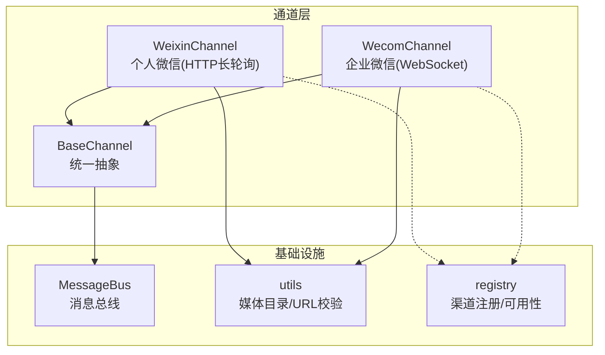
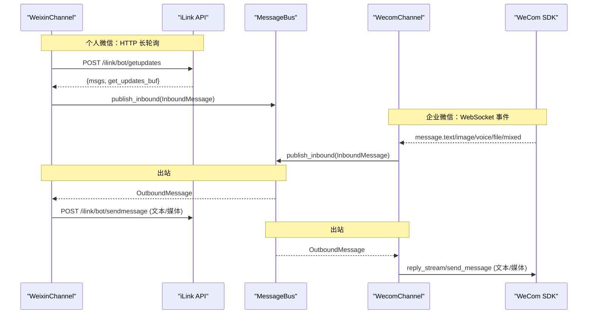
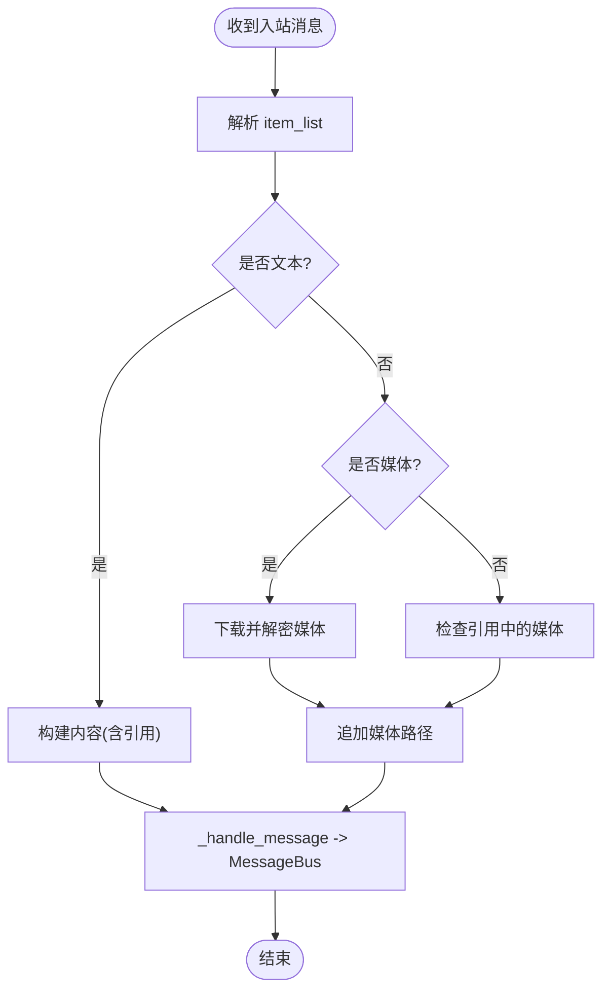
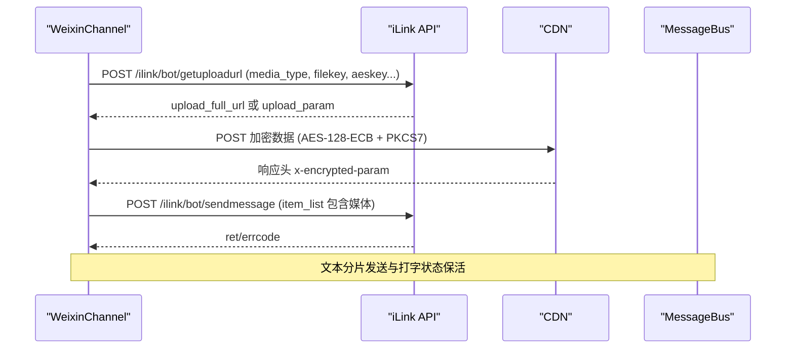
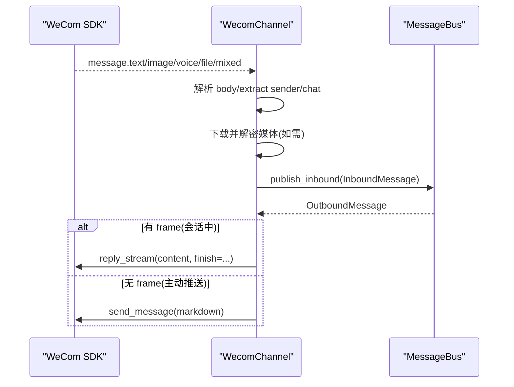
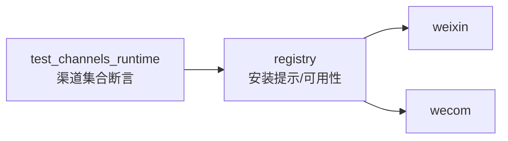

# 微信（WeChat）渠道

<cite>
**本文引用的文件**
- [weixin.py](file://agent/src/channels/weixin.py)
- [wecom.py](file://agent/src/channels/wecom.py)
- [base.py](file://agent/src/channels/base.py)
- [utils.py](file://agent/src/channels/utils.py)
- [registry.py](file://agent/src/channels/registry.py)
- [test_channels_runtime.py](file://agent/tests/test_channels_runtime.py)
</cite>

## 目录
1. [简介](#简介)
2. [项目结构](#项目结构)
3. [核心组件](#核心组件)
4. [架构总览](#架构总览)
5. [详细组件分析](#详细组件分析)
6. [依赖关系分析](#依赖关系分析)
7. [性能与限制](#性能与限制)
8. [故障排除指南](#故障排除指南)
9. [结论](#结论)
10. [附录：配置与接口速查](#附录：配置与接口速查)

## 简介
本章节面向 Vibe-Trading 的“微信渠道”集成，覆盖两类场景：
- 个人微信（Weixin）：通过 HTTP 长轮询与 iLink API 收发消息，支持二维码登录、会话上下文管理、媒体下载与 AES 解密、文本/图片/语音/视频发送。
- 企业微信（WeCom）：基于 WebSocket 长连接与 SDK，无需公网 Webhook，支持文本、图片、语音、文件、混合消息收发与流式回复。

文档将详细说明服务器配置、消息加解密、接口调用、用户身份识别与会话管理、消息路由、安全传输、常见问题排查等。

## 项目结构
微信相关能力集中在 channels 层，提供统一抽象与具体实现：
- 基础抽象：BaseChannel 定义统一的启动、停止、发送、权限校验、入站消息转发等接口。
- 个人微信：WeixinChannel 使用 HTTP 长轮询与 iLink API，负责登录、消息拉取、媒体下载解密、出站发送。
- 企业微信：WecomChannel 使用 WebSocket 长连接与 SDK，负责事件接收、媒体下载、出站发送与流式回复。
- 工具与路径：utils 提供媒体目录、运行时目录、URL 安全校验等通用能力。
- 注册表：registry 声明各渠道可用性与安装提示。

图表来源
- [base.py:22-238](file://agent/src/channels/base.py#L22-L238)
- [weixin.py:121-169](file://agent/src/channels/weixin.py#L121-L169)
- [wecom.py:54-101](file://agent/src/channels/wecom.py#L54-L101)
- [utils.py:16-32](file://agent/src/channels/utils.py#L16-L32)
- [registry.py:33-63](file://agent/src/channels/registry.py#L33-L63)

章节来源
- [base.py:22-238](file://agent/src/channels/base.py#L22-L238)
- [weixin.py:121-169](file://agent/src/channels/weixin.py#L121-L169)
- [wecom.py:54-101](file://agent/src/channels/wecom.py#L54-L101)
- [utils.py:16-32](file://agent/src/channels/utils.py#L16-L32)
- [registry.py:33-63](file://agent/src/channels/registry.py#L33-L63)

## 核心组件
- WeixinChannel（个人微信）
  - 认证：二维码登录流程，获取并持久化 token；支持 base_url 动态重定向。
  - 消息拉取：HTTP POST 到 getupdates 进行长轮询，维护 get_updates_buf 游标。
  - 入站处理：解析 item_list（文本、图片、语音、文件、视频），引用消息合并，媒体下载与 AES 解密。
  - 出站发送：文本分片发送；媒体上传至 CDN（AES-128-ECB + PKCS7），再 sendmessage。
  - 会话上下文：context_token 缓存与刷新；打字状态指示器（typing ticket）。
  - 状态持久化：account.json 保存 token、context_tokens、typing_tickets、base_url。
- WecomChannel（企业微信）
  - 认证：通过 bot_id 与 secret 建立 WebSocket 长连接。
  - 事件处理：文本、图片、语音、文件、混合消息进入统一处理；enter_chat 欢迎语。
  - 媒体处理：SDK 下载并解密媒体，落盘到 uploads/wecom。
  - 出站发送：媒体通过三步上传协议（init/chunk/finish）返回 media_id；文本使用 reply_stream 或主动 markdown 推送。
- BaseChannel（基类）
  - 统一生命周期：start/stop/send。
  - 权限控制：allow_from、配对码机制。
  - 入站转发：_handle_message 封装 InboundMessage 并发布到 MessageBus。
- utils
  - get_media_dir：为每个渠道创建独立的 uploads 子目录。
  - split_message：按最大长度拆分文本，优先在换行处切分。
  - URL 安全校验：仅允许 http/https，阻止内网/多播等不安全目标。

章节来源
- [weixin.py:121-169](file://agent/src/channels/weixin.py#L121-L169)
- [weixin.py:327-416](file://agent/src/channels/weixin.py#L327-L416)
- [weixin.py:538-593](file://agent/src/channels/weixin.py#L538-L593)
- [weixin.py:598-831](file://agent/src/channels/weixin.py#L598-L831)
- [weixin.py:837-928](file://agent/src/channels/weixin.py#L837-L928)
- [weixin.py:1088-1222](file://agent/src/channels/weixin.py#L1088-L1222)
- [weixin.py:1287-1474](file://agent/src/channels/weixin.py#L1287-L1474)
- [weixin.py:1477-1587](file://agent/src/channels/weixin.py#L1477-L1587)
- [wecom.py:73-148](file://agent/src/channels/wecom.py#L73-L148)
- [wecom.py:217-355](file://agent/src/channels/wecom.py#L217-L355)
- [wecom.py:356-490](file://agent/src/channels/wecom.py#L356-L490)
- [wecom.py:492-555](file://agent/src/channels/wecom.py#L492-L555)
- [base.py:22-238](file://agent/src/channels/base.py#L22-L238)
- [utils.py:16-32](file://agent/src/channels/utils.py#L16-L32)
- [utils.py:53-89](file://agent/src/channels/utils.py#L53-L89)

## 架构总览
个人微信与企业微信两条通道均遵循统一抽象，接入消息总线，完成入站与出站的消息流转。

图表来源
- [weixin.py:538-593](file://agent/src/channels/weixin.py#L538-L593)
- [weixin.py:1088-1222](file://agent/src/channels/weixin.py#L1088-L1222)
- [wecom.py:102-148](file://agent/src/channels/wecom.py#L102-L148)
- [wecom.py:492-555](file://agent/src/channels/wecom.py#L492-L555)
- [base.py:179-227](file://agent/src/channels/base.py#L179-L227)

## 详细组件分析

### 个人微信（WeixinChannel）
- 登录与鉴权
  - 二维码登录：获取 qrcode_id 与扫描链接，轮询状态直至 confirmed，获得 bot_token、baseurl、user_id 并持久化。
  - 请求头：X-WECHAT-UIN、AuthorizationType、iLink-App-Id、iLink-App-ClientVersion、Authorization（Bearer token）、SKRouteTag（可选）。
- 消息拉取与去重
  - 长轮询 getupdates，维护 get_updates_buf 游标；服务端可建议 longpolling_timeout_ms。
  - 去重：基于 message_id 或 seq，保留最近 1000 条。
- 入站消息解析
  - 文本：支持引用消息拼接。
  - 图片/语音/文件/视频：尝试下载媒体，语音优先使用平台转写文本，否则本地转录。
  - 引用中的媒体：若主 item_list 无媒体，回退检查 ref_msg.message_item。
- 媒体下载与解密
  - 支持 full_url 与 encrypt_query_param 两种下载源；非图片类型需 aes_key。
  - AES-128-ECB 解密，PKCS7 去填充；失败时记录日志并降级。
- 出站发送
  - 文本：按最大长度分片发送。
  - 媒体：先 getuploadurl，AES-128-ECB 加密后上传 CDN，读取 x-encrypted-param 作为下载参数，再 sendmessage。
  - 打字状态：getconfig 获取 typing_ticket，定时保活，发送完成后取消。
  - context_token：缓存并按时间阈值刷新，避免静默丢失。
- 状态持久化
  - account.json：token、get_updates_buf、context_tokens、typing_tickets、base_url。

图表来源
- [weixin.py:598-831](file://agent/src/channels/weixin.py#L598-L831)
- [weixin.py:837-928](file://agent/src/channels/weixin.py#L837-L928)

图表来源
- [weixin.py:1325-1474](file://agent/src/channels/weixin.py#L1325-L1474)
- [weixin.py:1088-1222](file://agent/src/channels/weixin.py#L1088-L1222)

章节来源
- [weixin.py:327-416](file://agent/src/channels/weixin.py#L327-L416)
- [weixin.py:538-593](file://agent/src/channels/weixin.py#L538-L593)
- [weixin.py:598-831](file://agent/src/channels/weixin.py#L598-L831)
- [weixin.py:837-928](file://agent/src/channels/weixin.py#L837-L928)
- [weixin.py:1088-1222](file://agent/src/channels/weixin.py#L1088-L1222)
- [weixin.py:1287-1474](file://agent/src/channels/weixin.py#L1287-L1474)
- [weixin.py:1477-1587](file://agent/src/channels/weixin.py#L1477-L1587)

### 企业微信（WecomChannel）
- 连接与事件
  - 使用 WSClient 建立长连接，自动重连与心跳。
  - 事件：connected/authenticated/disconnected/error；message.text/image/voice/file/mixed；event.enter_chat。
- 入站处理
  - 统一 _process_message：提取 msgid、from.userid、chattype/chatid；去重；媒体下载与落盘。
  - 语音：优先使用平台转写内容；文件/图片：下载并保存。
- 出站发送
  - 媒体：三步上传协议（aibot_upload_media_init/chunk/finish），返回 media_id。
  - 文本：reply_stream（带 finish 标志）或 send_message（markdown 主动推送）。
- 安全与限制
  - 入站媒体大小限制（200MB）。
  - 文件名清洗，防止路径穿越与非法字符。

图表来源
- [wecom.py:102-148](file://agent/src/channels/wecom.py#L102-L148)
- [wecom.py:217-355](file://agent/src/channels/wecom.py#L217-L355)
- [wecom.py:492-555](file://agent/src/channels/wecom.py#L492-L555)

章节来源
- [wecom.py:73-148](file://agent/src/channels/wecom.py#L73-L148)
- [wecom.py:217-355](file://agent/src/channels/wecom.py#L217-L355)
- [wecom.py:356-490](file://agent/src/channels/wecom.py#L356-L490)
- [wecom.py:492-555](file://agent/src/channels/wecom.py#L492-L555)

### 基础通道与工具
- BaseChannel
  - 统一生命周期与发送契约；权限校验 allow_from；DM 配对码；_handle_message 发布 InboundMessage。
- utils
  - get_media_dir：为 each channel 创建 uploads 子目录，便于 agent 读取。
  - split_message：按最大长度拆分文本，优先换行切分。
  - URL 安全校验：仅允许 http/https，阻止内网/多播等不安全目标。

章节来源
- [base.py:22-238](file://agent/src/channels/base.py#L22-L238)
- [utils.py:16-32](file://agent/src/channels/utils.py#L16-L32)
- [utils.py:53-89](file://agent/src/channels/utils.py#L53-L89)
- [utils.py:97-180](file://agent/src/channels/utils.py#L97-L180)

## 依赖关系分析
- 渠道注册与可用性
  - registry 声明 weixin 与 wecom 的安装提示与可用性标志。
  - 测试用例验证内置渠道集合包含 weixin、wecom。
- 运行时状态
  - ChannelManager 根据配置加载渠道；未安装依赖时标记不可用并提供安装提示。

图表来源
- [registry.py:33-63](file://agent/src/channels/registry.py#L33-L63)
- [test_channels_runtime.py:86-107](file://agent/tests/test_channels_runtime.py#L86-L107)

章节来源
- [registry.py:33-63](file://agent/src/channels/registry.py#L33-L63)
- [test_channels_runtime.py:86-107](file://agent/tests/test_channels_runtime.py#L86-L107)

## 性能与限制
- 个人微信
  - 长轮询超时：默认 35s，可被服务端 longpolling_timeout_ms 调整。
  - 消息分片：文本按最大长度（4000 字符）分片发送。
  - 速率限制：工具提示合并缓冲，避免频繁触发 iLink 限频（约 7 条/5 分钟）。
  - 上下文令牌：超过阈值（约 60s）主动刷新，降低静默丢失风险。
- 企业微信
  - 媒体上传：分块上传（每块 ≤512KB raw），总大小限制 200MB。
  - 流式回复：reply_stream 支持进度与最终消息，减少无效文本。
- 通用
  - URL 安全：仅允许 http/https，阻止私有/多播地址。
  - 媒体目录：统一落在 ~/.vibe-trading/uploads/<channel>，便于后续工具访问。

章节来源
- [weixin.py:538-593](file://agent/src/channels/weixin.py#L538-L593)
- [weixin.py:1088-1222](file://agent/src/channels/weixin.py#L1088-L1222)
- [wecom.py:356-490](file://agent/src/channels/wecom.py#L356-L490)
- [utils.py:97-180](file://agent/src/channels/utils.py#L97-L180)

## 故障排除指南
- 服务器配置错误
  - 现象：无法拉取消息或发送失败。
  - 排查：
    - 确认渠道 enabled 与必要字段已配置（weixin: base_url/token；wecom: bot_id/secret）。
    - 检查网络连通性与时区；确保域名解析正常。
    - 查看日志中的错误码与 errmsg。
- 消息解密失败（个人微信）
  - 现象：图片/语音/文件/视频无法打开或内容为乱码。
  - 排查：
    - 确认 aes_key 存在且格式正确（图片可能为 hex 字符串，其他类型需 base64）。
    - 检查依赖库（pycryptodome 或 cryptography）是否安装。
    - 观察日志中 AES 解析与解密失败的警告。
- 接口调用限制
  - 现象：频繁发送导致限流或失败。
  - 排查：
    - 合并工具提示，避免短时间大量消息。
    - 合理设置长轮询超时与重试退避。
    - 关注服务端返回的 errcode/ret 与 errmsg。
- 会话过期或暂停
  - 现象：getupdates 返回会话过期错误码。
  - 处理：系统会自动暂停一段时间；必要时重新扫码登录。
- 企业微信媒体上传失败
  - 现象：上传 init/chunk/finish 任一阶段失败。
  - 排查：
    - 检查文件大小是否超限。
    - 确认 chunk 顺序与 base64 编码正确。
    - 查看 errcode/errmsg 定位问题。

章节来源
- [weixin.py:538-593](file://agent/src/channels/weixin.py#L538-L593)
- [weixin.py:837-928](file://agent/src/channels/weixin.py#L837-L928)
- [weixin.py:1088-1222](file://agent/src/channels/weixin.py#L1088-L1222)
- [wecom.py:356-490](file://agent/src/channels/wecom.py#L356-L490)

## 结论
Vibe-Trading 的微信渠道提供了完整的双通道支持：个人微信通过 iLink HTTP 长轮询与企业微信通过 WebSocket 长连接，分别适配不同部署与安全需求。两者均实现了严格的权限控制、会话上下文管理、媒体下载与加密、出站发送与流式回复，并通过统一抽象接入消息总线，便于扩展与维护。

## 附录：配置与接口速查
- 个人微信（Weixin）
  - 关键配置项：enabled、base_url、cdn_base_url、token、state_dir、poll_timeout、route_tag。
  - 主要接口：
    - 登录：获取二维码并轮询状态，成功后保存 token 与 base_url。
    - 拉取：POST /ilink/bot/getupdates，维护 get_updates_buf。
    - 发送：POST /ilink/bot/sendmessage（文本/媒体）。
    - 媒体上传：POST /ilink/bot/getuploadurl → CDN 上传 → 读取 x-encrypted-param → sendmessage。
    - 打字状态：POST /ilink/bot/getconfig 获取 ticket → POST /ilink/bot/sendtyping 保活。
- 企业微信（WeCom）
  - 关键配置项：enabled、bot_id、secret、welcome_message、allow_from。
  - 主要接口：
    - 连接：WSClient.connect_async()，自动重连与心跳。
    - 事件：message.* 与 event.enter_chat。
    - 媒体上传：aibot_upload_media_init → aibot_upload_media_chunk × N → aibot_upload_media_finish。
    - 发送：reply_stream（会话内）或 send_message（主动推送 markdown）。

章节来源
- [weixin.py:121-169](file://agent/src/channels/weixin.py#L121-L169)
- [weixin.py:327-416](file://agent/src/channels/weixin.py#L327-L416)
- [weixin.py:538-593](file://agent/src/channels/weixin.py#L538-L593)
- [weixin.py:1088-1222](file://agent/src/channels/weixin.py#L1088-L1222)
- [weixin.py:1287-1474](file://agent/src/channels/weixin.py#L1287-L1474)
- [wecom.py:54-101](file://agent/src/channels/wecom.py#L54-L101)
- [wecom.py:102-148](file://agent/src/channels/wecom.py#L102-L148)
- [wecom.py:398-490](file://agent/src/channels/wecom.py#L398-L490)
- [wecom.py:492-555](file://agent/src/channels/wecom.py#L492-L555)