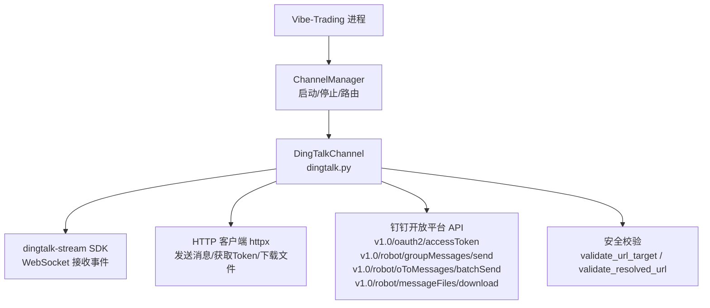
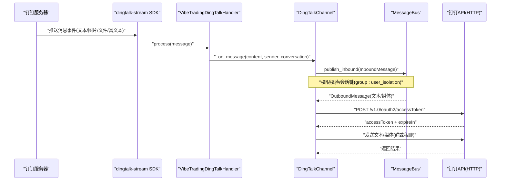
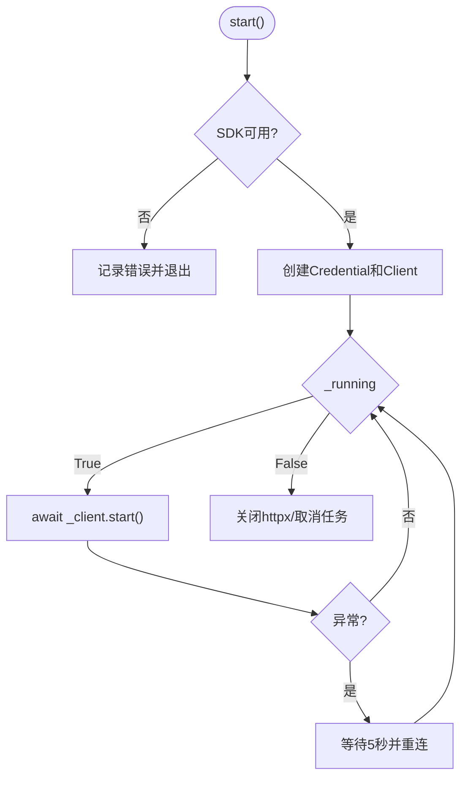
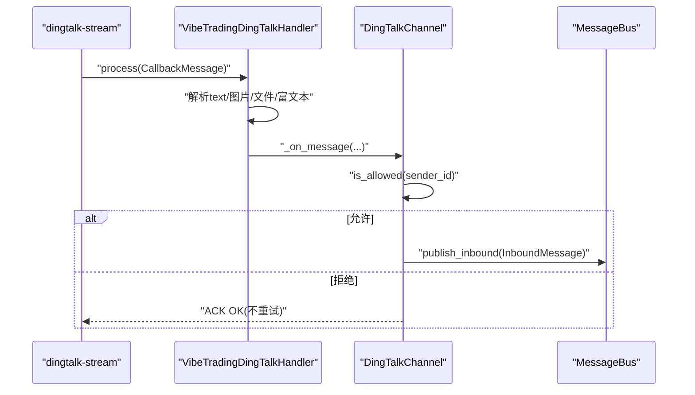
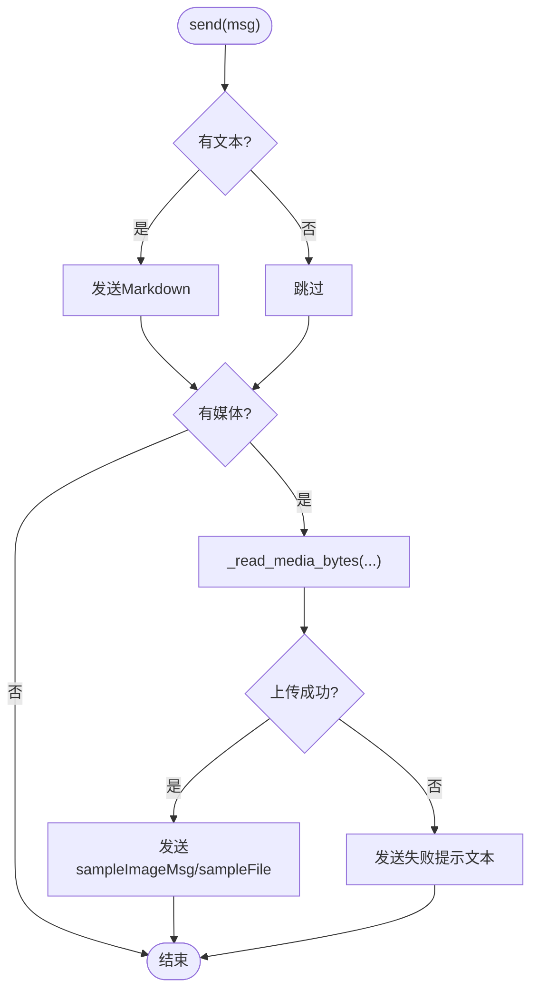
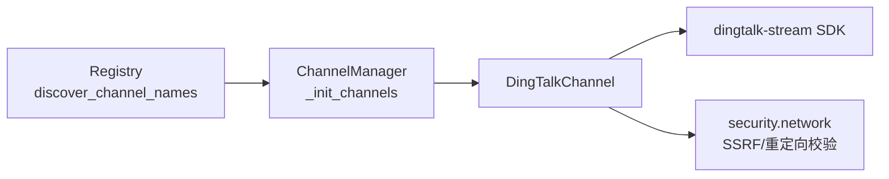

# 钉钉（DingTalk）渠道

<cite>
**本文引用的文件**
- [agent/src/channels/dingtalk.py](file://agent/src/channels/dingtalk.py)
- [agent/src/channels/base.py](file://agent/src/channels/base.py)
- [agent/src/channels/manager.py](file://agent/src/channels/manager.py)
- [agent/src/channels/registry.py](file://agent/src/channels/registry.py)
- [agent/src/security/network.py](file://agent/src/security/network.py)
</cite>

## 目录
1. [简介](#简介)
2. [项目结构](#项目结构)
3. [核心组件](#核心组件)
4. [架构总览](#架构总览)
5. [详细组件分析](#详细组件分析)
6. [依赖关系分析](#依赖关系分析)
7. [性能与限制](#性能与限制)
8. [故障排除指南](#故障排除指南)
9. [结论](#结论)
10. [附录：配置与环境变量](#附录配置与环境变量)

## 简介
本章节面向 Vibe-Trading 的钉钉渠道集成，重点说明基于 Stream Mode 的实现机制，包括 WebSocket 连接管理、消息接收处理、文件下载与上传、认证流程（client_id/client_secret）、Access Token 管理、消息格式转换（文本、图片、文件、富文本）、群聊与私聊差异、会话隔离选项、自动重连、错误处理与日志记录，以及安全限制（SSRF 防护、文件大小限制、重定向控制）。同时提供配置示例、环境变量设置与常见问题的排查方法。

## 项目结构
钉钉渠道位于 channels 子系统内，遵循统一的通道抽象与消息总线协议：
- 通道实现：dingtalk.py
- 基类与权限校验：base.py
- 通道管理器与启动/停止：manager.py
- 通道发现与可用性检查：registry.py
- 网络安全校验：security/network.py

图表来源
- [agent/src/channels/dingtalk.py:178-258](file://agent/src/channels/dingtalk.py#L178-L258)
- [agent/src/channels/manager.py:206-252](file://agent/src/channels/manager.py#L206-L252)
- [agent/src/security/network.py](file://agent/src/security/network.py)

章节来源
- [agent/src/channels/dingtalk.py:178-258](file://agent/src/channels/dingtalk.py#L178-L258)
- [agent/src/channels/manager.py:206-252](file://agent/src/channels/manager.py#L206-L252)
- [agent/src/channels/registry.py:33-59](file://agent/src/channels/registry.py#L33-L59)

## 核心组件
- VibeTradingDingTalkHandler：SDK 回调处理器，负责解析钉钉消息并转发到通道层。
- DingTalkConfig：通道配置模型，包含启用开关、凭证、白名单、媒体重定向策略、群聊会话隔离等。
- DingTalkChannel：通道实现，封装 Stream 模式连接、消息收发、文件下载/上传、Token 管理等。
- BaseChannel：统一抽象，提供权限校验、消息入队、流式扩展点等。
- ChannelManager：通道生命周期管理与出站消息分发。
- Registry：通道发现与可选依赖检测。

章节来源
- [agent/src/channels/dingtalk.py:46-176](file://agent/src/channels/dingtalk.py#L46-L176)
- [agent/src/channels/base.py:22-238](file://agent/src/channels/base.py#L22-L238)
- [agent/src/channels/manager.py:36-252](file://agent/src/channels/manager.py#L36-L252)
- [agent/src/channels/registry.py:33-59](file://agent/src/channels/registry.py#L33-L59)

## 架构总览
钉钉渠道采用“接收走 Stream（WebSocket），发送走 HTTP”的混合模式：
- 接收：通过 dingtalk-stream SDK 建立 WebSocket 长连接，订阅机器人消息主题，回调中解析消息并异步投递到消息总线。
- 发送：使用 httpx 调用钉钉 v1.0 接口发送文本与媒体；媒体先上传至钉钉获取 media_id，再发送。
- 认证：通过 client_id/client_secret 换取 Access Token，缓存并在过期前刷新。
- 安全：对远程媒体 URL 进行 SSRF 防护、重定向白名单与大小限制。

图表来源
- [agent/src/channels/dingtalk.py:56-163](file://agent/src/channels/dingtalk.py#L56-L163)
- [agent/src/channels/dingtalk.py:271-296](file://agent/src/channels/dingtalk.py#L271-L296)
- [agent/src/channels/dingtalk.py:550-602](file://agent/src/channels/dingtalk.py#L550-L602)

## 详细组件分析

### 认证与 Access Token 管理
- 凭据：使用配置中的 client_id 与 client_secret。
- 获取 Token：调用 https://api.dingtalk.com/v1.0/oauth2/accessToken，传入 appKey/appSecret。
- 缓存与刷新：本地缓存 accessToken，并在过期时间前 60 秒主动刷新，避免临界失效。
- 失败处理：网络异常或接口错误时记录日志并返回 None，上层发送逻辑会跳过或重试。

章节来源
- [agent/src/channels/dingtalk.py:271-296](file://agent/src/channels/dingtalk.py#L271-L296)

### WebSocket 连接管理与自动重连
- 初始化：创建 Credential 与 DingTalkStreamClient，注册 ChatbotMessage 主题回调。
- 运行循环：在 start() 中持续调用 _client.start()，捕获异常后等待 5 秒重连，直到 stop() 被调用。
- 资源清理：stop() 关闭 httpx 客户端并取消后台任务。

图表来源
- [agent/src/channels/dingtalk.py:215-269](file://agent/src/channels/dingtalk.py#L215-L269)

章节来源
- [agent/src/channels/dingtalk.py:215-269](file://agent/src/channels/dingtalk.py#L215-L269)

### 消息接收与处理
- 解析：使用 ChatbotMessage.from_dict 解析消息体，兼容 text、语音转文字（extensions.recognition）、图片、文件、富文本。
- 附件下载：图片与文件通过 downloadCode 调用下载接口，保存至工作区媒体目录并按发送者隔离。
- 会话标识：根据 conversationType 与 conversationId 判断群聊/私聊；群聊支持按用户隔离会话（group_user_isolation）。
- 权限校验：继承 BaseChannel.is_allowed，支持 allow_from 白名单与配对码流程。
- 入队：构造 InboundMessage 并通过 bus.publish_inbound 投递。

图表来源
- [agent/src/channels/dingtalk.py:56-163](file://agent/src/channels/dingtalk.py#L56-L163)
- [agent/src/channels/base.py:165-227](file://agent/src/channels/base.py#L165-L227)

章节来源
- [agent/src/channels/dingtalk.py:56-163](file://agent/src/channels/dingtalk.py#L56-L163)
- [agent/src/channels/base.py:165-227](file://agent/src/channels/base.py#L165-L227)

### 消息格式转换与发送
- 文本：以 Markdown 形式通过 sampleMarkdown 发送。
- 图片：优先尝试 photoURL 直链发送；失败则上传至钉钉获取 media_id，再以 sampleImageMsg 发送。
- 文件：读取本地或远程媒体，必要时将 HTML 打包为 zip 后再上传；通过 sampleFile 发送。
- 群聊/私聊：根据 chat_id 前缀 group: 选择不同 API（群消息 vs 私聊批量发送）。

图表来源
- [agent/src/channels/dingtalk.py:604-692](file://agent/src/channels/dingtalk.py#L604-L692)

章节来源
- [agent/src/channels/dingtalk.py:604-692](file://agent/src/channels/dingtalk.py#L604-L692)

### 文件下载与上传
- 下载：通过 downloadCode 获取临时下载 URL，再下载文件内容保存到 workspace/media/dingtalk/{sender_id}。
- 上传：根据扩展名推断类型（image/voice/video/file），必要时将 HTML 压缩为 zip；调用 media/upload 接口获取 media_id。
- 安全：远程媒体下载执行 SSRF 防护、重定向白名单与大小限制。

章节来源
- [agent/src/channels/dingtalk.py:728-773](file://agent/src/channels/dingtalk.py#L728-L773)
- [agent/src/channels/dingtalk.py:377-479](file://agent/src/channels/dingtalk.py#L377-L479)
- [agent/src/channels/dingtalk.py:512-548](file://agent/src/channels/dingtalk.py#L512-L548)

### 群聊与私聊的差异与会话隔离
- 私聊：chat_id 为用户 ID，使用 oToMessages/batchSend。
- 群聊：chat_id 带 group: 前缀，使用 groupMessages/send，openConversationId 去除前缀。
- 会话隔离：当 group_user_isolation=True 时，群内每个用户拥有独立 session_key，避免消息串扰。

章节来源
- [agent/src/channels/dingtalk.py:550-602](file://agent/src/channels/dingtalk.py#L550-L602)
- [agent/src/channels/dingtalk.py:694-727](file://agent/src/channels/dingtalk.py#L694-L727)

### 错误处理与日志记录
- 回调异常：捕获并记录异常，返回 ACK_OK 避免钉钉侧重试风暴。
- 网络异常：httpx.TransportError 记录并抛出，由上层重试策略处理。
- 业务错误：errcode 非 0 时记录错误详情，便于定位。
- 重连：Stream 连接异常后等待 5 秒自动重连。

章节来源
- [agent/src/channels/dingtalk.py:160-163](file://agent/src/channels/dingtalk.py#L160-L163)
- [agent/src/channels/dingtalk.py:246-258](file://agent/src/channels/dingtalk.py#L246-L258)
- [agent/src/channels/dingtalk.py:581-602](file://agent/src/channels/dingtalk.py#L581-L602)

## 依赖关系分析
- 可选依赖：dingtalk-stream SDK；若未安装，模块级降级以避免导入崩溃，并在运行时给出安装提示。
- 通道发现：registry.py 通过 pkgutil 扫描内置通道，并提供安装提示与可用性标志。
- 管理器：manager.py 负责实例化、启动、停止通道，并协调出站消息分发。

图表来源
- [agent/src/channels/registry.py:87-95](file://agent/src/channels/registry.py#L87-L95)
- [agent/src/channels/manager.py:64-137](file://agent/src/channels/manager.py#L64-L137)
- [agent/src/channels/dingtalk.py:26-44](file://agent/src/channels/dingtalk.py#L26-L44)

章节来源
- [agent/src/channels/registry.py:33-59](file://agent/src/channels/registry.py#L33-L59)
- [agent/src/channels/manager.py:64-137](file://agent/src/channels/manager.py#L64-L137)

## 性能与限制
- 远程媒体大小限制：最大 20MB，防止内存耗尽。
- 重定向次数限制：最多 3 次，避免无限跳转。
- HTML 附件：上传前自动压缩为 zip，减少安全风险与兼容性问题。
- 并发与队列：出站消息经 ChannelManager 合并与去重，降低重复发送。
- 超时与池：httpx 连接池与超时参数合理设置，提高稳定性。

章节来源
- [agent/src/channels/dingtalk.py:23-24](file://agent/src/channels/dingtalk.py#L23-L24)
- [agent/src/channels/dingtalk.py:377-479](file://agent/src/channels/dingtalk.py#L377-L479)
- [agent/src/channels/dingtalk.py:316-339](file://agent/src/channels/dingtalk.py#L316-L339)
- [agent/src/channels/manager.py:283-419](file://agent/src/channels/manager.py#L283-L419)

## 故障排除指南
- 无法启动 Stream 连接
  - 检查是否安装了 dingtalk-stream 依赖；未安装时会记录错误并提示安装命令。
  - 确认已配置 client_id 与 client_secret；缺失将直接退出。
- 无法获取 Access Token
  - 检查网络连通性与钉钉 API 可达性；查看日志中的 errcode 与响应体。
  - 确认应用权限与密钥正确。
- 消息发送失败
  - 群聊/私聊 chat_id 是否正确（群聊需带 group: 前缀）。
  - 媒体上传失败时，查看 content-type 与文件名后缀；HTML 会被自动压缩。
- 文件下载失败
  - 检查 downloadCode 是否有效；确认临时下载 URL 可访问。
  - 关注 SSRF 防护与重定向白名单配置，确保目标域名允许。
- 权限问题
  - 未在白名单的用户会在私聊收到配对码；群聊将被拒绝并记录警告。
- 网络异常
  - 观察 httpx.TransportError 日志；ChannelManager 会对发送失败进行指数退避重试。

章节来源
- [agent/src/channels/dingtalk.py:215-269](file://agent/src/channels/dingtalk.py#L215-L269)
- [agent/src/channels/dingtalk.py:271-296](file://agent/src/channels/dingtalk.py#L271-L296)
- [agent/src/channels/dingtalk.py:550-602](file://agent/src/channels/dingtalk.py#L550-L602)
- [agent/src/channels/base.py:165-227](file://agent/src/channels/base.py#L165-L227)
- [agent/src/channels/manager.py:421-452](file://agent/src/channels/manager.py#L421-L452)

## 结论
钉钉渠道通过 Stream Mode 实现了高可靠的接收链路，结合 HTTP API 完成发送与媒体处理。其设计兼顾了安全性（SSRF、重定向控制、大小限制）、可扩展性（群聊/私聊、会话隔离）与可维护性（自动重连、错误处理、日志记录）。在生产环境中，建议严格配置白名单与重定向策略，监控 Token 获取与媒体上传状态，及时处理网络异常与权限问题。

## 附录：配置与环境变量
- 通道配置字段（DingTalkConfig）
  - enabled：是否启用该通道
  - client_id：钉钉应用 Client ID
  - client_secret：钉钉应用 Client Secret
  - allow_from：允许发送消息的用户/会话列表，支持通配符
  - allow_remote_media_redirects：是否允许远程媒体重定向
  - remote_media_redirect_allowed_hosts：允许重定向的目标主机白名单
  - group_user_isolation：群聊中按用户隔离会话

- 环境变量
  - 当前代码库未在 env_schema.py 中定义钉钉专用环境变量；钉钉凭据通过通道配置注入（如 channels.dingtalk.client_id 与 client_secret）。
  - 通用通道开关可通过全局 channels 配置启用 dingtalk。

- 安全限制
  - 远程媒体最大字节数：20MB
  - 重定向次数上限：3 次
  - HTML 附件上传前自动压缩为 zip
  - 所有外部 URL 均经过 validate_url_target 与 validate_resolved_url 校验

章节来源
- [agent/src/channels/dingtalk.py:166-176](file://agent/src/channels/dingtalk.py#L166-L176)
- [agent/src/channels/dingtalk.py:377-479](file://agent/src/channels/dingtalk.py#L377-L479)
- [agent/src/channels/dingtalk.py:316-339](file://agent/src/channels/dingtalk.py#L316-L339)
- [agent/src/config/env_schema.py:1-577](file://agent/src/config/env_schema.py#L1-L577)