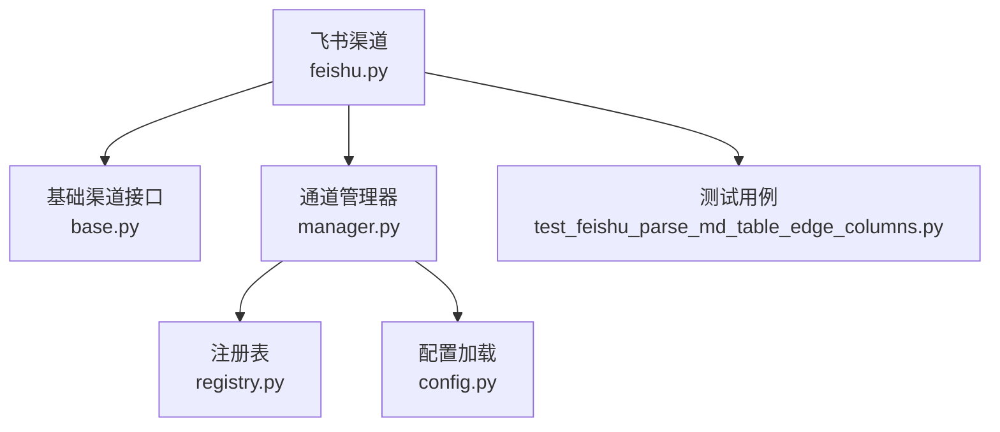
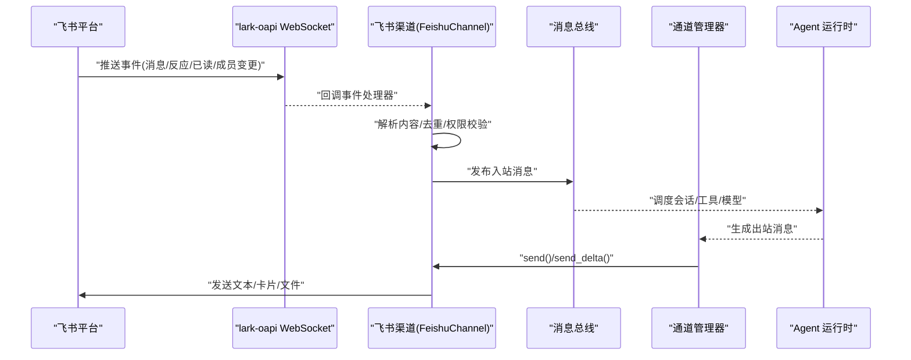
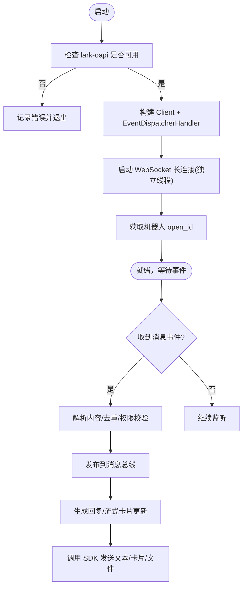

# 飞书（Feishu/Lark）渠道

<cite>
**本文引用的文件**
- [agent/src/channels/feishu.py](file://agent/src/channels/feishu.py)
- [agent/src/channels/base.py](file://agent/src/channels/base.py)
- [agent/src/channels/manager.py](file://agent/src/channels/manager.py)
- [agent/src/channels/registry.py](file://agent/src/channels/registry.py)
- [agent/src/channels/config.py](file://agent/src/channels/config.py)
- [agent/tests/test_feishu_parse_md_table_edge_columns.py](file://agent/tests/test_feishu_parse_md_table_edge_columns.py)
</cite>

## 目录
1. [简介](#简介)
2. [项目结构](#项目结构)
3. [核心组件](#核心组件)
4. [架构总览](#架构总览)
5. [详细组件分析](#详细组件分析)
6. [依赖关系分析](#依赖关系分析)
7. [性能与限流](#性能与限流)
8. [故障排查指南](#故障排查指南)
9. [结论](#结论)
10. [附录：配置与模板示例](#附录：配置与模板示例)

## 简介
本章节面向 Vibe-Trading 的飞书（Feishu/Lark）渠道集成，系统性说明如何通过 WebSocket 长连接接入飞书机器人 API，实现事件订阅、消息接收与处理、卡片流式更新、文件下载与发送、单聊/群聊路由、用户身份识别与权限控制，以及异步消息处理、错误重试与限流策略。文档同时提供配置要点、事件订阅设置、消息模板使用建议、调试方法与常见问题解决方案。

## 项目结构
Vibe-Trading 将“渠道”抽象为统一接口，飞书作为内置渠道之一，通过通道管理器发现并启动，借助消息总线与 Agent 运行时对接。关键文件职责如下：
- 飞书渠道实现：封装 SDK 调用、WebSocket 长连接、事件解析、卡片流式编辑、文件操作等
- 基础渠道接口：定义登录、启动、停止、发送、流式发送、权限校验等通用能力
- 通道管理器：负责启用、初始化、状态管理与出站消息重试
- 注册表：自动发现内置渠道、可选依赖检测与安装提示
- 配置加载：从结构化 Agent 配置中读取 channels 部分

**图表来源**
- [agent/src/channels/feishu.py:569-781](file://agent/src/channels/feishu.py#L569-L781)
- [agent/src/channels/base.py:22-81](file://agent/src/channels/base.py#L22-L81)
- [agent/src/channels/manager.py:36-137](file://agent/src/channels/manager.py#L36-L137)
- [agent/src/channels/registry.py:87-160](file://agent/src/channels/registry.py#L87-L160)
- [agent/src/channels/config.py:11-21](file://agent/src/channels/config.py#L11-L21)

**章节来源**
- [agent/src/channels/feishu.py:569-781](file://agent/src/channels/feishu.py#L569-L781)
- [agent/src/channels/base.py:22-81](file://agent/src/channels/base.py#L22-L81)
- [agent/src/channels/manager.py:36-137](file://agent/src/channels/manager.py#L36-L137)
- [agent/src/channels/registry.py:87-160](file://agent/src/channels/registry.py#L87-L160)
- [agent/src/channels/config.py:11-21](file://agent/src/channels/config.py#L11-L21)

## 核心组件
- 飞书渠道类：基于 lark-oapi SDK，采用 WebSocket 长连接接收事件，无需公网 Webhook；支持消息类型解析（文本、图片、文件、富文本、卡片）、卡片流式编辑、表情反应、已读回执、机器人加入/移出群事件等；支持扫码创建应用并写入凭证；支持流式输出与节流更新。
- 基础渠道接口：统一登录、启动、停止、发送、流式发送、权限校验（allow_from、配对码流程）。
- 通道管理器：启用/加载渠道、构建参数、全局布尔覆盖、出站消息指数退避重试。
- 注册表：扫描内置渠道、检测可选依赖（如 lark_oapi），给出安装提示。
- 配置加载：从 Agent 配置中读取 channels.feishu 配置段。

**章节来源**
- [agent/src/channels/feishu.py:341-358](file://agent/src/channels/feishu.py#L341-L358)
- [agent/src/channels/feishu.py:569-781](file://agent/src/channels/feishu.py#L569-L781)
- [agent/src/channels/base.py:22-81](file://agent/src/channels/base.py#L22-L81)
- [agent/src/channels/manager.py:26-27](file://agent/src/channels/manager.py#L26-L27)
- [agent/src/channels/registry.py:33-59](file://agent/src/channels/registry.py#L33-L59)
- [agent/src/channels/config.py:11-21](file://agent/src/channels/config.py#L11-L21)

## 架构总览
下图展示从飞书事件到 Agent 运行时的整体数据流：SDK 通过 WebSocket 推送事件，飞书渠道解析后发布到消息总线，再由通道管理器协调出站消息与重试。

**图表来源**
- [agent/src/channels/feishu.py:667-781](file://agent/src/channels/feishu.py#L667-L781)
- [agent/src/channels/manager.py:36-137](file://agent/src/channels/manager.py#L36-L137)

## 详细组件分析

### 飞书渠道（FeishuChannel）
- 启动与连接
  - 检查 SDK 可用性、App ID/Secret、Domain（feishu/lark）
  - 构造 lark.Client（用于发送消息）与 EventDispatcherHandler（绑定事件处理器）
  - 在独立线程创建新事件循环，启动 lark.ws.Client 长连接，异常时休眠并重连
  - 获取机器人 open_id，提升 @提及匹配准确性
- 事件订阅与处理
  - 订阅消息接收、表情反应创建/删除、消息已读、机器人进入/离开群等事件
  - 对富文本/卡片/分享/合并转发等进行内容提取，保留图片 key 以便后续下载或回发
  - 使用有序去重缓存避免重复处理同一消息
- 流式输出与卡片编辑
  - 维护每聊天室的流式缓冲区，按 CardKit 流式 API 增量更新卡片内容
  - 节流更新间隔，避免频繁编辑触发限流
- 文件操作
  - 支持从飞书下载媒体文件至本地媒体目录，再交由上层工具处理
- 登录与凭证
  - 支持扫码设备码流程创建飞书应用，自动返回 app_id/app_secret/domain，并写入配置
- 配置项
  - enabled、app_id、app_secret、encrypt_key、verification_token、allow_from、react_emoji、done_emoji、tool_hint_prefix、group_policy、reply_to_message、streaming、domain、topic_isolation

**图表来源**
- [agent/src/channels/feishu.py:667-781](file://agent/src/channels/feishu.py#L667-L781)
- [agent/src/channels/feishu.py:341-358](file://agent/src/channels/feishu.py#L341-L358)

**章节来源**
- [agent/src/channels/feishu.py:341-358](file://agent/src/channels/feishu.py#L341-L358)
- [agent/src/channels/feishu.py:559-567](file://agent/src/channels/feishu.py#L559-L567)
- [agent/src/channels/feishu.py:609-659](file://agent/src/channels/feishu.py#L609-L659)
- [agent/src/channels/feishu.py:667-781](file://agent/src/channels/feishu.py#L667-L781)

### 基础渠道接口（BaseChannel）
- 统一生命周期：login/start/stop/send
- 流式发送钩子：send_delta/send_reasoning_delta/send_reasoning_end/send_file_edit_events
- 权限控制：is_allowed 支持 allow_from 白名单与配对码流程
- 入站消息处理：_handle_message 负责权限检查、DM 配对码下发、转发到总线

**章节来源**
- [agent/src/channels/base.py:22-81](file://agent/src/channels/base.py#L22-L81)
- [agent/src/channels/base.py:152-200](file://agent/src/channels/base.py#L152-L200)

### 通道管理器（ChannelManager）
- 渠道发现与初始化：根据配置启用渠道，加载类，注入服务参数
- 全局布尔覆盖：send_progress/send_tool_hints/show_reasoning
- 出站消息重试：指数退避（1s, 2s, 4s）
- 状态管理：available/loaded/running/error 等元信息

**章节来源**
- [agent/src/channels/manager.py:26-27](file://agent/src/channels/manager.py#L26-L27)
- [agent/src/channels/manager.py:36-137](file://agent/src/channels/manager.py#L36-L137)

### 注册表（Registry）
- 内置渠道扫描：pkgutil 列出模块名，跳过内部模块
- 可选依赖检测：标记 feishu 需要 lark-oapi，并提供安装提示
- 插件发现：entry_points 扩展外部渠道

**章节来源**
- [agent/src/channels/registry.py:33-59](file://agent/src/channels/registry.py#L33-L59)
- [agent/src/channels/registry.py:87-160](file://agent/src/channels/registry.py#L87-L160)

### 配置加载（Config）
- 从 Agent 配置中读取 channels 部分，供 ChannelManager 使用

**章节来源**
- [agent/src/channels/config.py:11-21](file://agent/src/channels/config.py#L11-L21)

## 依赖关系分析
- 飞书渠道强依赖 lark-oapi SDK（WebSocket/事件/消息 API）
- 基础渠道接口被所有渠道复用，保证一致的生命周期与权限模型
- 通道管理器统一管理多通道，屏蔽差异并集中重试
- 注册表解耦依赖检测与安装指引

**图表来源**
- [agent/src/channels/registry.py:87-160](file://agent/src/channels/registry.py#L87-L160)
- [agent/src/channels/manager.py:36-137](file://agent/src/channels/manager.py#L36-L137)
- [agent/src/channels/base.py:22-81](file://agent/src/channels/base.py#L22-L81)
- [agent/src/channels/feishu.py:667-781](file://agent/src/channels/feishu.py#L667-L781)

**章节来源**
- [agent/src/channels/registry.py:87-160](file://agent/src/channels/registry.py#L87-L160)
- [agent/src/channels/manager.py:36-137](file://agent/src/channels/manager.py#L36-L137)
- [agent/src/channels/base.py:22-81](file://agent/src/channels/base.py#L22-L81)
- [agent/src/channels/feishu.py:667-781](file://agent/src/channels/feishu.py#L667-L781)

## 性能与限流
- 流式卡片更新节流：CardKit 流式编辑默认节流间隔，避免频繁编辑触发平台限流
- 出站消息重试：通道管理器对发送失败进行指数退避重试（1s, 2s, 4s）
- 事件处理去重：使用有序字典缓存已处理消息 ID，防止重复消费
- 独立事件循环：WebSocket 客户端在独立线程中使用新事件循环，避免主循环冲突
- 懒加载 SDK：仅在需要时导入 lark-oapi，降低启动开销

**章节来源**
- [agent/src/channels/feishu.py:559-567](file://agent/src/channels/feishu.py#L559-L567)
- [agent/src/channels/feishu.py:598-603](file://agent/src/channels/feishu.py#L598-L603)
- [agent/src/channels/feishu.py:743-769](file://agent/src/channels/feishu.py#L743-L769)
- [agent/src/channels/manager.py:26-27](file://agent/src/channels/manager.py#L26-L27)

## 故障排查指南
- 事件推送失败
  - 现象：WebSocket 断开或事件未到达
  - 排查：查看日志中的 WebSocket 错误；确认 App ID/Secret/Domain 正确；检查网络与防火墙
  - 参考：启动与重连逻辑
- 权限不足
  - 现象：无法发送消息或无法访问资源
  - 排查：确认飞书应用已开启机器人能力与必要权限；检查 allow_from 白名单；必要时使用配对码流程授权
  - 参考：权限校验与配对码
- 网络超时/限流
  - 现象：发送失败或卡片编辑频繁报错
  - 排查：利用通道管理器重试机制；降低流式更新频率；检查平台限流策略
  - 参考：重试策略与流式节流
- 二维码登录失败
  - 现象：扫码无响应或超时
  - 排查：检查设备码流程是否支持 client_secret；确认域名（feishu/lark）；重试登录
  - 参考：扫码创建应用流程

**章节来源**
- [agent/src/channels/feishu.py:609-659](file://agent/src/channels/feishu.py#L609-L659)
- [agent/src/channels/feishu.py:667-781](file://agent/src/channels/feishu.py#L667-L781)
- [agent/src/channels/base.py:152-200](file://agent/src/channels/base.py#L152-L200)
- [agent/src/channels/manager.py:26-27](file://agent/src/channels/manager.py#L26-L27)

## 结论
Vibe-Trading 的飞书渠道通过 WebSocket 长连接实现了稳定、低耦合的事件驱动集成，支持丰富的消息类型与卡片流式更新，具备完善的权限控制与重试机制。配合通道管理器与注册表，可快速启用、监控与维护多渠道通信。生产部署建议关注凭证书写安全、事件订阅权限、流式节流与重试策略，并结合日志与测试用例持续优化稳定性。

## 附录：配置与模板示例
- 配置字段说明（节选）
  - enabled：是否启用飞书渠道
  - app_id / app_secret：飞书应用凭证
  - encrypt_key / verification_token：事件验证相关
  - allow_from：允许的用户/群组白名单
  - react_emoji / done_emoji：表情反馈
  - tool_hint_prefix：工具提示前缀
  - group_policy：群聊策略（open/mention）
  - reply_to_message：是否引用回复
  - streaming：是否启用流式输出
  - domain：feishu 或 lark
  - topic_isolation：群聊话题隔离会话
- 事件订阅设置
  - 启用机器人能力与事件订阅（如 im.message.receive_v1）
  - 在飞书开放平台配置事件回调地址（若使用 Webhook 模式；本项目使用 WebSocket 长连接）
- 消息模板使用
  - 文本消息：直接发送纯文本
  - 图片/文件：先下载媒体至本地，再通过 SDK 发送
  - 卡片消息：使用 CardKit 流式 API 逐步更新内容
- 调试方法
  - 启用日志级别 INFO，观察 WebSocket 连接与事件处理
  - 使用测试用例验证 Markdown 表格解析边界情况
  - 通过 CLI/WebUI 查看渠道状态与错误信息

**章节来源**
- [agent/src/channels/feishu.py:341-358](file://agent/src/channels/feishu.py#L341-L358)
- [agent/src/channels/feishu.py:667-781](file://agent/src/channels/feishu.py#L667-L781)
- [agent/tests/test_feishu_parse_md_table_edge_columns.py:8-27](file://agent/tests/test_feishu_parse_md_table_edge_columns.py#L8-L27)