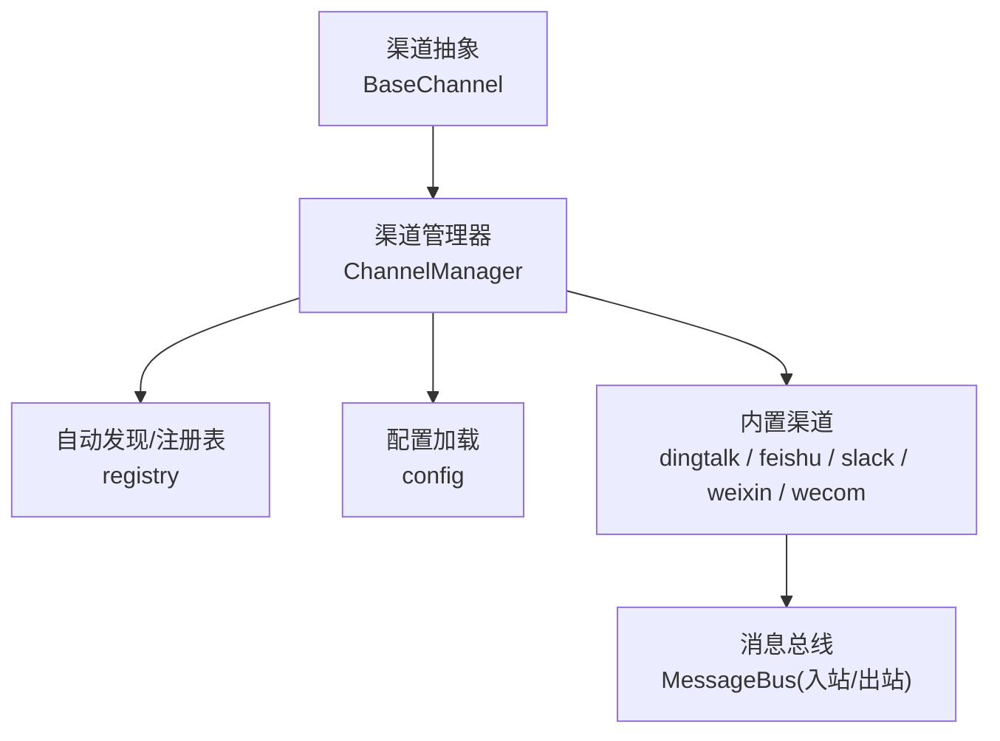
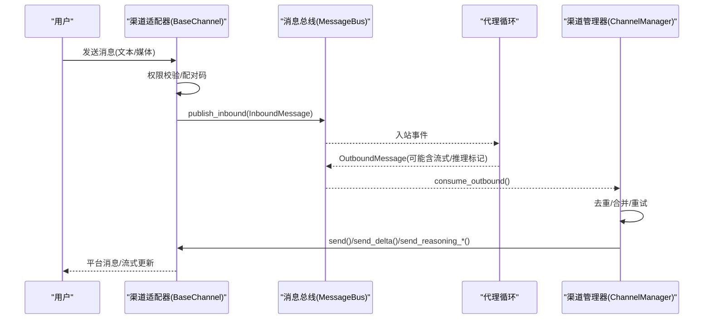
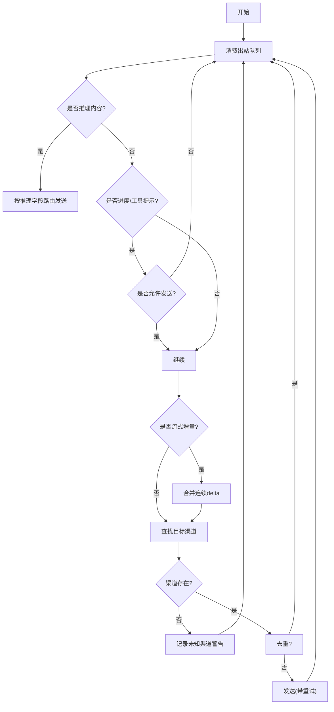
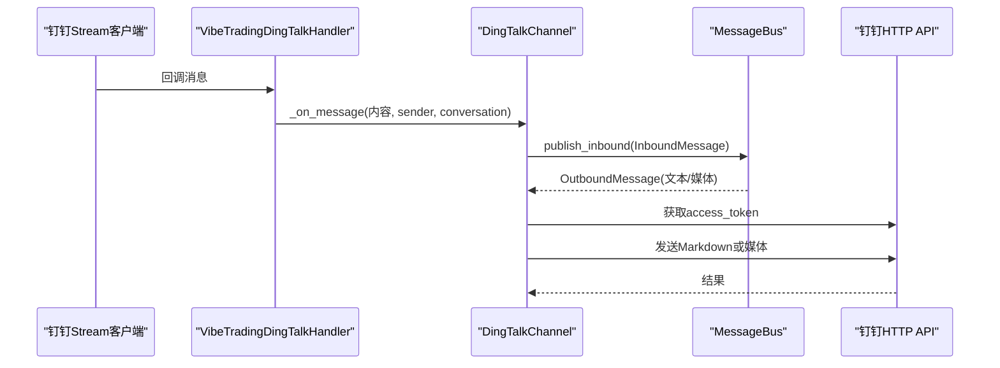
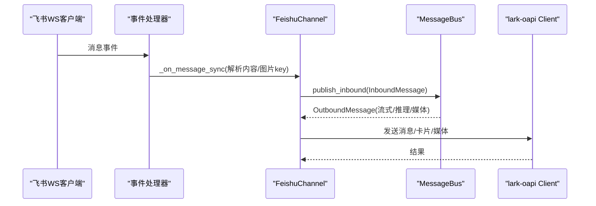
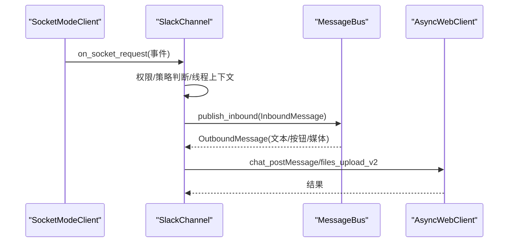
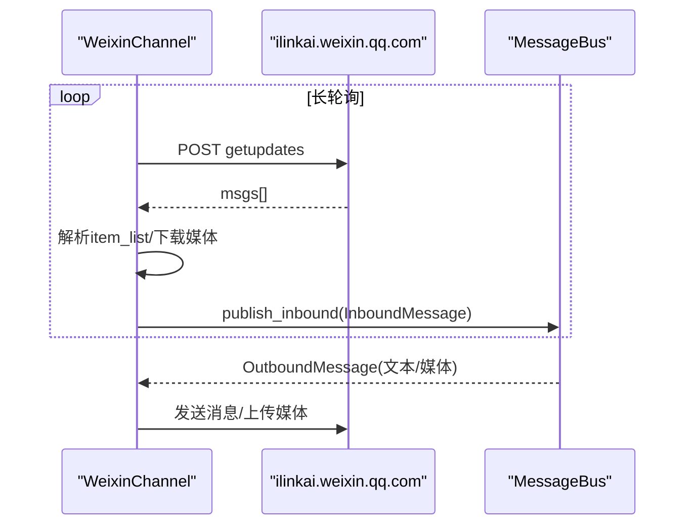
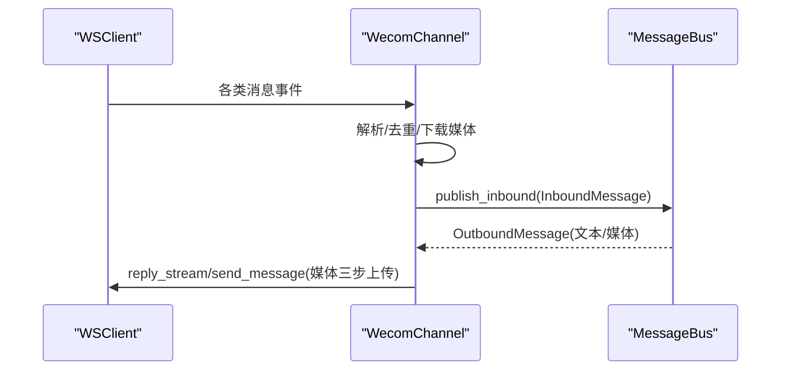
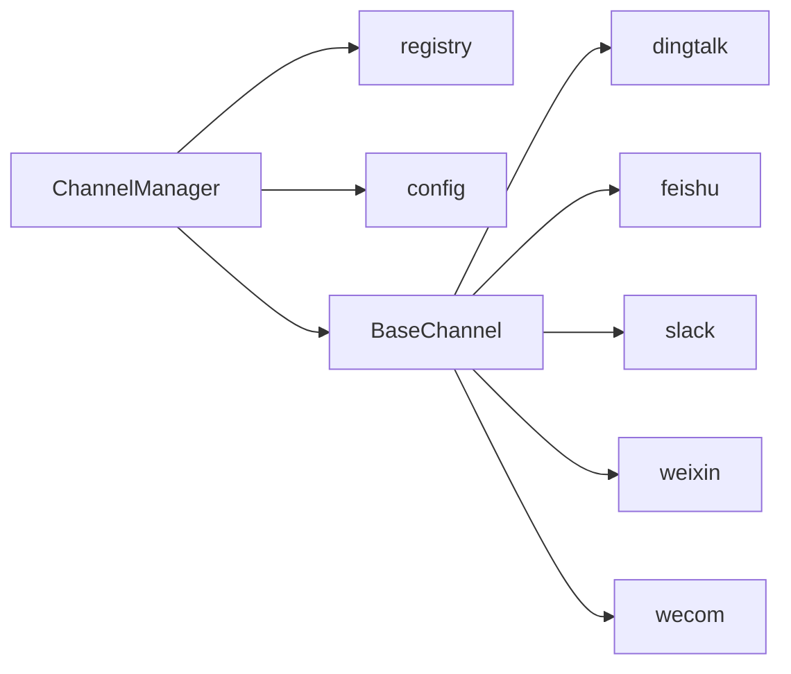

# 消息渠道系统

<cite>
**本文引用的文件**
- [agent/src/channels/__init__.py](file://agent/src/channels/__init__.py)
- [agent/src/channels/base.py](file://agent/src/channels/base.py)
- [agent/src/channels/manager.py](file://agent/src/channels/manager.py)
- [agent/src/channels/config.py](file://agent/src/channels/config.py)
- [agent/src/channels/registry.py](file://agent/src/channels/registry.py)
- [agent/src/channels/dingtalk.py](file://agent/src/channels/dingtalk.py)
- [agent/src/channels/feishu.py](file://agent/src/channels/feishu.py)
- [agent/src/channels/slack.py](file://agent/src/channels/slack.py)
- [agent/src/channels/weixin.py](file://agent/src/channels/weixin.py)
- [agent/src/channels/wecom.py](file://agent/src/channels/wecom.py)
</cite>

## 目录
1. [简介](#简介)
2. [项目结构](#项目结构)
3. [核心组件](#核心组件)
4. [架构总览](#架构总览)
5. [详细组件分析](#详细组件分析)
6. [依赖关系分析](#依赖关系分析)
7. [性能考量](#性能考量)
8. [故障排查指南](#故障排查指南)
9. [结论](#结论)
10. [附录：配置与参数](#附录：配置与参数)

## 简介
本文件面向 Vibe-Trading 的消息渠道子系统，系统性说明渠道抽象层、内置渠道、自定义渠道开发方式、消息路由机制，以及钉钉、飞书、Slack、微信（个人号）等具体渠道的实现要点。文档重点覆盖：
- 多渠道接入的统一抽象与消息格式
- 出站消息分发、重试与流式合并
- 权限控制与会话隔离
- 各渠道的认证、收发流程与媒体处理
- 常见问题定位与排错建议

## 项目结构
消息渠道子系统位于 agent/src/channels 目录，采用“插件化 + 自动发现”的架构：
- 抽象接口：BaseChannel 定义统一生命周期与发送/流式能力
- 管理器：ChannelManager 负责启用、启动、停止通道及出站分发
- 注册表：自动扫描内置模块与外部插件，提供可用性检查
- 配置加载：从结构化 Agent 配置中读取 channels 段
- 具体渠道：dingtalk、feishu、slack、weixin、wecom 等实现

**图示来源**
- [agent/src/channels/base.py:22-238](file://agent/src/channels/base.py#L22-L238)
- [agent/src/channels/manager.py:36-229](file://agent/src/channels/manager.py#L36-L229)
- [agent/src/channels/registry.py:87-220](file://agent/src/channels/registry.py#L87-L220)
- [agent/src/channels/config.py:11-22](file://agent/src/channels/config.py#L11-L22)

**章节来源**
- [agent/src/channels/__init__.py:1-49](file://agent/src/channels/__init__.py#L1-L49)
- [agent/src/channels/base.py:22-238](file://agent/src/channels/base.py#L22-L238)
- [agent/src/channels/manager.py:36-229](file://agent/src/channels/manager.py#L36-L229)
- [agent/src/channels/registry.py:87-220](file://agent/src/channels/registry.py#L87-L220)
- [agent/src/channels/config.py:11-22](file://agent/src/channels/config.py#L11-L22)

## 核心组件
- BaseChannel：定义 start/stop/send、流式发送、推理内容发送、权限校验、默认配置等统一接口
- ChannelManager：初始化已启用渠道、启动/停止、出站消息分发、去重与重试、流式合并
- Registry：自动发现内置渠道与外部插件、检查可选依赖、暴露可用性与安装提示
- Config：从 Agent 配置中加载 channels 段为字典供管理器使用

关键职责边界：
- 渠道实现只关注平台协议细节（鉴权、收发消息、媒体上传下载）
- 管理器负责跨渠道一致的重试、过滤、合并、状态管理
- 注册表负责可插拔扩展与依赖检测

**章节来源**
- [agent/src/channels/base.py:22-238](file://agent/src/channels/base.py#L22-L238)
- [agent/src/channels/manager.py:36-479](file://agent/src/channels/manager.py#L36-L479)
- [agent/src/channels/registry.py:87-284](file://agent/src/channels/registry.py#L87-L284)
- [agent/src/channels/config.py:11-22](file://agent/src/channels/config.py#L11-L22)

## 架构总览
下图展示从入站到出站的完整链路：渠道适配器接收消息 → 权限校验 → 入站总线 → 代理循环处理 → 出站总线 → 管理器分发 → 渠道适配器发送。

**图示来源**
- [agent/src/channels/base.py:179-227](file://agent/src/channels/base.py#L179-L227)
- [agent/src/channels/manager.py:283-419](file://agent/src/channels/manager.py#L283-L419)

## 详细组件分析

### 渠道抽象层（BaseChannel）
- 生命周期：start/stop/is_running
- 发送能力：send、send_delta、send_reasoning、send_reasoning_delta/end、send_file_edit_events
- 权限控制：allow_from、配对码流程、is_allowed
- 默认配置：default_config 用于引导配置生成

设计要点：
- 所有渠道必须实现 start/stop/send；流式能力可选
- 入站统一通过 _handle_message 进行权限校验后发布到总线
- 支持全局布尔开关（如 show_reasoning、send_progress）由管理器注入

**章节来源**
- [agent/src/channels/base.py:22-238](file://agent/src/channels/base.py#L22-L238)

### 渠道管理器（ChannelManager）
- 初始化：扫描 enabled 渠道、加载类、应用布尔覆盖
- 启动/停止：并行启动各渠道，维护出站分发任务
- 出站分发：
  - 推理内容路由（_reasoning_delta/_reasoning_end/_reasoning）
  - 进度/工具提示过滤
  - 流式增量合并（同目标同 stream_id 的连续 delta 合并）
  - 重复抑制（基于内容指纹与 origin/message_id）
  - 指数退避重试（可配置最大尝试次数）

**图示来源**
- [agent/src/channels/manager.py:256-419](file://agent/src/channels/manager.py#L256-L419)

**章节来源**
- [agent/src/channels/manager.py:36-479](file://agent/src/channels/manager.py#L36-L479)

### 自动发现与注册表（Registry）
- 内置渠道扫描：pkgutil.iter_modules 列出模块名
- 插件发现：entry_points 组 vibe_trading.channels
- 可用性检查：检测可选依赖缺失并给出安装提示
- 配置解析：区分全局键与渠道段键，避免误判

**章节来源**
- [agent/src/channels/registry.py:87-284](file://agent/src/channels/registry.py#L87-L284)

### 配置加载（Config）
- 从 Agent 配置中读取 channels 段，转换为字典供管理器使用
- 支持 Pydantic 模型转 JSON 的 by_alias=False 输出

**章节来源**
- [agent/src/channels/config.py:11-22](file://agent/src/channels/config.py#L11-L22)

### 钉钉集成（DingTalk）
- 通信模式：Stream Mode 接收事件；HTTP API 发送消息
- 认证：Access Token 获取与缓存
- 会话：私聊 chat_id 为用户 ID；群聊以 group:openConversationId 标识；支持 group_user_isolation 隔离会话
- 媒体：图片/语音/视频/文件下载与上传；HTML 附件自动压缩为 zip；远程媒体 SSRF/重定向/大小限制
- 入站：解析文本、富文本、图片、文件；转发至总线
- 出站：Markdown 文本与媒体发送，失败时回退可见提示

**图示来源**
- [agent/src/channels/dingtalk.py:46-163](file://agent/src/channels/dingtalk.py#L46-L163)
- [agent/src/channels/dingtalk.py:215-258](file://agent/src/channels/dingtalk.py#L215-L258)
- [agent/src/channels/dingtalk.py:672-693](file://agent/src/channels/dingtalk.py#L672-L693)

**章节来源**
- [agent/src/channels/dingtalk.py:166-774](file://agent/src/channels/dingtalk.py#L166-L774)

### 飞书集成（Feishu/Lark）
- 通信模式：WebSocket 长连接接收事件；SDK Client 发送消息
- 认证：App ID/Secret；支持 QR 扫码创建应用并写入配置
- 会话：topic_isolation 控制群组内 topic 级会话隔离；reply_to_message 支持引用回复
- 流式：CardKit 流式卡片更新，节流间隔控制
- 入站：复杂卡片/分享/表格等多类型内容提取为文本与图片 key
- 出站：Markdown/卡片/媒体发送；反应表情与阅读事件处理

**图示来源**
- [agent/src/channels/feishu.py:39-67](file://agent/src/channels/feishu.py#L39-L67)
- [agent/src/channels/feishu.py:667-785](file://agent/src/channels/feishu.py#L667-L785)

**章节来源**
- [agent/src/channels/feishu.py:341-800](file://agent/src/channels/feishu.py#L341-L800)

### Slack 集成
- 通信模式：Socket Mode WebSocket 接收事件；Web API 发送消息
- 会话：支持线程上下文拉取；DM/频道策略（open/mention/allowlist）
- 入站：app_mention 与 message 去重；文件下载与 HTML 防护；按钮交互
- 出站：Markdown→mrkdwn 转换；消息分片；Block Kit 按钮；反应表情更新

**图示来源**
- [agent/src/channels/slack.py:92-140](file://agent/src/channels/slack.py#L92-L140)
- [agent/src/channels/slack.py:151-199](file://agent/src/channels/slack.py#L151-L199)
- [agent/src/channels/slack.py:312-455](file://agent/src/channels/slack.py#L312-L455)

**章节来源**
- [agent/src/channels/slack.py:25-755](file://agent/src/channels/slack.py#L25-L755)

### 微信集成（个人号 WeChat）
- 通信模式：HTTP 长轮询（getupdates）；QR 登录获取 token
- 会话：context_token 缓存与刷新；会话暂停与恢复
- 入站：文本/图片/语音/文件/视频；引用消息处理；媒体下载与可选语音转文本
- 出站：文本分片；媒体上传；typing 状态保持

**图示来源**
- [agent/src/channels/weixin.py:468-515](file://agent/src/channels/weixin.py#L468-L515)
- [agent/src/channels/weixin.py:538-593](file://agent/src/channels/weixin.py#L538-L593)
- [agent/src/channels/weixin.py:598-800](file://agent/src/channels/weixin.py#L598-L800)

**章节来源**
- [agent/src/channels/weixin.py:121-800](file://agent/src/channels/weixin.py#L121-L800)

### 企业微信集成（WeCom）
- 通信模式：WebSocket 长连接；SDK WSClient 收发
- 会话：单聊/群聊 chatid；enter_chat 欢迎语
- 入站：文本/图片/语音/文件/混合内容；媒体下载保存
- 出站：媒体三步上传（init/chunk/finish）；流式回复；无 frame 时主动发送 Markdown

**图示来源**
- [agent/src/channels/wecom.py:102-147](file://agent/src/channels/wecom.py#L102-L147)
- [agent/src/channels/wecom.py:217-355](file://agent/src/channels/wecom.py#L217-L355)
- [agent/src/channels/wecom.py:398-555](file://agent/src/channels/wecom.py#L398-L555)

**章节来源**
- [agent/src/channels/wecom.py:54-555](file://agent/src/channels/wecom.py#L54-L555)

## 依赖关系分析
- 管理器依赖注册表与配置加载器
- 各渠道依赖各自第三方 SDK（钉钉 Stream、飞书 lark-oapi、Slack socket_mode/web、微信 ilink HTTP）
- 管理器对渠道解耦，仅通过 BaseChannel 接口交互
- 插件可通过 entry_points 扩展新渠道，不修改核心逻辑

**图示来源**
- [agent/src/channels/manager.py:13-21](file://agent/src/channels/manager.py#L13-L21)
- [agent/src/channels/registry.py:87-220](file://agent/src/channels/registry.py#L87-L220)
- [agent/src/channels/base.py:22-238](file://agent/src/channels/base.py#L22-L238)

**章节来源**
- [agent/src/channels/manager.py:36-229](file://agent/src/channels/manager.py#L36-L229)
- [agent/src/channels/registry.py:87-284](file://agent/src/channels/registry.py#L87-L284)

## 性能考量
- 出站流式增量合并：减少同一目标的频繁 API 调用
- 重复抑制：基于内容指纹与消息 ID，避免重复推送
- 重试与退避：指数退避降低瞬时失败影响
- 媒体安全与限流：SSRF/重定向/大小限制，避免资源滥用
- 线程/事件循环隔离：飞书在独立线程运行 WS 客户端，避免主循环冲突

[本节为通用指导，不直接分析具体文件]

## 故障排查指南
- 渠道不可用/未安装依赖：查看注册表返回的 error 与 install_hint，按提示安装可选依赖
- 无法接收消息：确认渠道已启用且凭据正确；检查 WebSocket/HTTP 连通性
- 出站失败：查看管理器日志中的重试与错误信息；确认渠道 send 实现抛出异常以便重试
- 媒体上传失败：检查文件大小、类型、网络与权限；注意 HTML 防护与重定向限制
- 会话问题：检查 allow_from、group_policy、topic_isolation 等配置；必要时重置凭据或重新登录

**章节来源**
- [agent/src/channels/registry.py:130-160](file://agent/src/channels/registry.py#L130-L160)
- [agent/src/channels/manager.py:421-452](file://agent/src/channels/manager.py#L421-L452)
- [agent/src/channels/dingtalk.py:341-479](file://agent/src/channels/dingtalk.py#L341-L479)
- [agent/src/channels/slack.py:120-135](file://agent/src/channels/slack.py#L120-L135)
- [agent/src/channels/weixin.py:538-593](file://agent/src/channels/weixin.py#L538-L593)
- [agent/src/channels/wecom.py:102-147](file://agent/src/channels/wecom.py#L102-L147)

## 结论
Vibe-Trading 的消息渠道系统通过统一的抽象层与管理器实现了多渠道接入、统一消息格式与一致的出站行为。各渠道专注于平台协议细节，管理器负责可靠性与一致性（重试、合并、去重）。借助自动发现与插件机制，系统具备良好的可扩展性。实际使用中应重点关注渠道配置、权限策略、媒体安全与网络连通性。

[本节为总结性内容，不直接分析具体文件]

## 附录：配置与参数
以下为各渠道的关键配置项与作用说明（节选）：

- 通用
  - enabled：是否启用该渠道
  - allow_from：允许访问的用户/会话白名单
  - show_reasoning：是否向渠道发送推理内容
  - send_progress/send_tool_hints：是否发送进度/工具提示

- 钉钉（DingTalk）
  - client_id/client_secret：Stream 模式凭证
  - allow_remote_media_redirects/remote_media_redirect_allowed_hosts：远程媒体重定向策略
  - group_user_isolation：群组内用户会话隔离

- 飞书（Feishu/Lark）
  - app_id/app_secret：应用凭证
  - encrypt_key/verification_token：事件加密与验证
  - react_emoji/done_emoji：处理中/完成表情
  - tool_hint_prefix：工具提示前缀
  - group_policy：群组响应策略（open/mention）
  - reply_to_message：是否引用回复
  - streaming：是否启用流式卡片
  - domain：feishu/lark 域名选择
  - topic_isolation：群组 topic 级会话隔离

- Slack
  - mode：socket（当前仅支持）
  - webhook_path：Webhook 路径（未使用于 Socket Mode）
  - bot_token/app_token：Bot 与应用令牌
  - user_token_read_only：只读用户令牌
  - reply_in_thread：是否在线程中回复
  - react_emoji/done_emoji：表情
  - include_thread_context/thread_context_limit：线程上下文拉取
  - allow_from/group_policy/group_allow_from/group_require_mention：群组策略
  - dm.enabled/policy/allow_from：DM 策略

- 微信（个人号 WeChat）
  - base_url/cdn_base_url：服务地址
  - route_tag：路由标签
  - token：登录获得的 token
  - state_dir：状态持久化目录
  - poll_timeout：长轮询超时

- 企业微信（WeCom）
  - bot_id/secret：AI Bot 凭证
  - allow_from：允许访问列表
  - welcome_message：进入聊天欢迎语

**章节来源**
- [agent/src/channels/dingtalk.py:166-176](file://agent/src/channels/dingtalk.py#L166-L176)
- [agent/src/channels/feishu.py:341-358](file://agent/src/channels/feishu.py#L341-L358)
- [agent/src/channels/slack.py:25-57](file://agent/src/channels/slack.py#L25-L57)
- [agent/src/channels/weixin.py:121-132](file://agent/src/channels/weixin.py#L121-L132)
- [agent/src/channels/wecom.py:54-62](file://agent/src/channels/wecom.py#L54-L62)