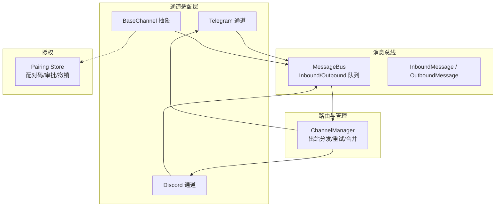
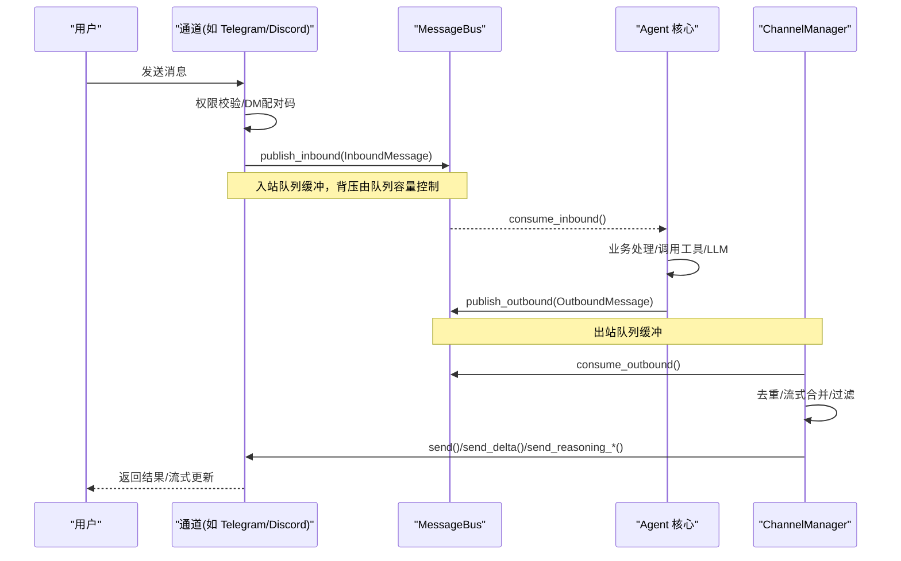
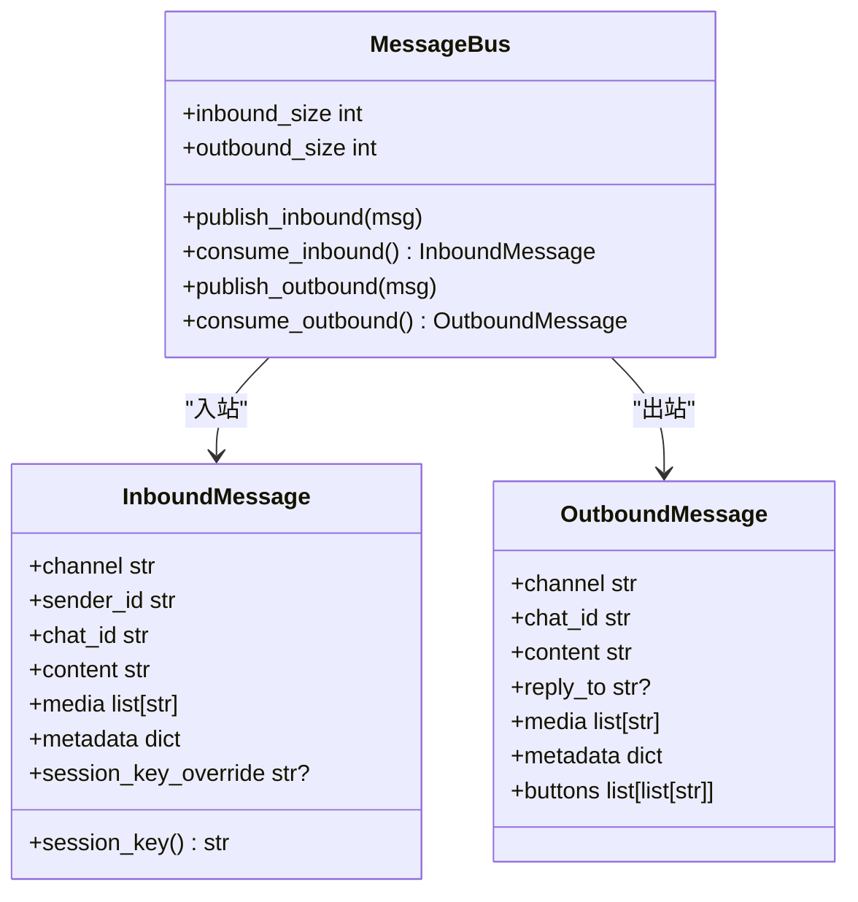
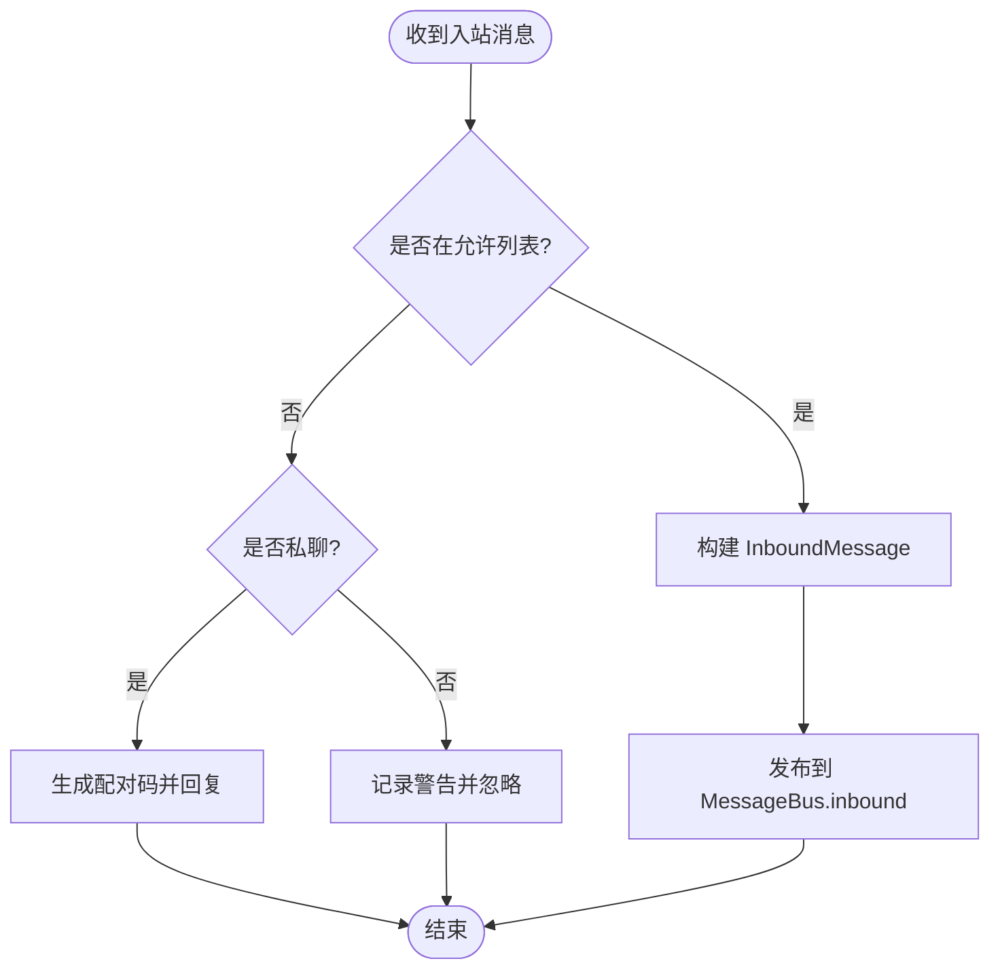
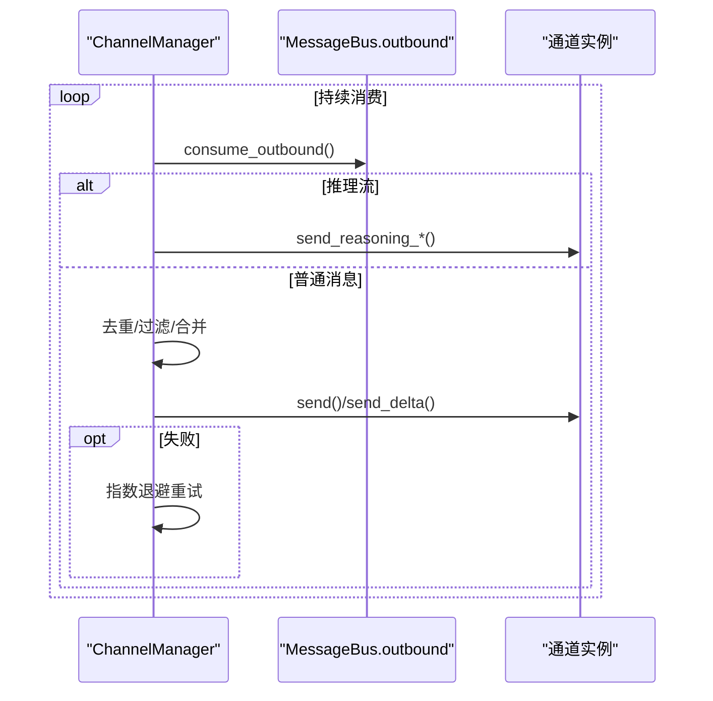
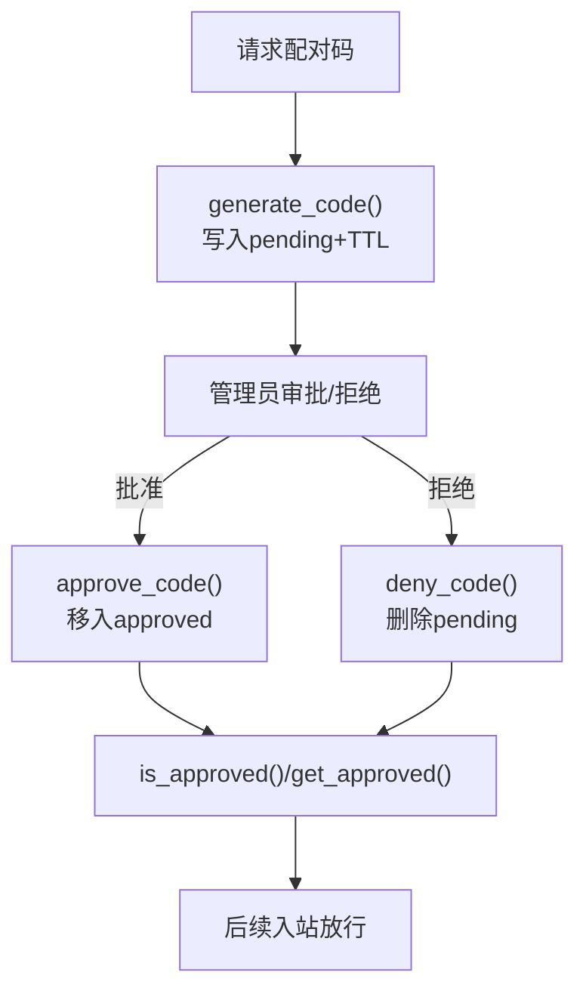
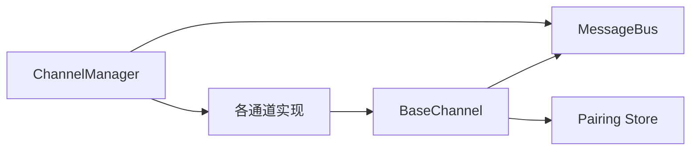

# 消息路由系统

<cite>
**本文引用的文件**
- [agent/src/channels/bus/events.py](file://agent/src/channels/bus/events.py)
- [agent/src/channels/bus/queue.py](file://agent/src/channels/bus/queue.py)
- [agent/src/channels/base.py](file://agent/src/channels/base.py)
- [agent/src/channels/manager.py](file://agent/src/channels/manager.py)
- [agent/src/channels/pairing/store.py](file://agent/src/channels/pairing/store.py)
- [agent/src/channels/pairing/__init__.py](file://agent/src/channels/pairing/__init__.py)
- [agent/src/channels/__init__.py](file://agent/src/channels/__init__.py)
- [agent/src/channels/telegram.py](file://agent/src/channels/telegram.py)
- [agent/src/channels/discord.py](file://agent/src/channels/discord.py)
</cite>

## 目录
1. [简介](#简介)
2. [项目结构](#项目结构)
3. [核心组件](#核心组件)
4. [架构总览](#架构总览)
5. [详细组件分析](#详细组件分析)
6. [依赖关系分析](#依赖关系分析)
7. [性能与高并发优化](#性能与高并发优化)
8. [故障排查指南](#故障排查指南)
9. [结论](#结论)
10. [附录：消息格式与平台映射](#附录：消息格式与平台映射)

## 简介
本文件面向 Vibe-Trading 的消息路由系统，围绕事件驱动的消息总线（MessageBus）、入站/出站消息处理流程、消息队列的异步机制与背压控制、错误重试策略、配对码（Pairing Code）授权体系、消息格式标准化与多平台映射、运行时路由策略（去重、流式合并、进度/工具提示过滤）、以及监控指标与高并发场景下的可靠性保障进行系统化说明。文档同时提供关键流程图与时序图，帮助读者快速理解数据在通道适配器、消息总线、通道管理器与具体平台之间的流转路径。

## 项目结构
消息路由系统位于 agent/src/channels 下，采用“插件化通道 + 统一消息总线”的分层设计：
- 抽象接口与基类：BaseChannel 定义统一的接入与发送契约，屏蔽平台差异。
- 消息总线：MessageBus 提供 InboundMessage/OutboundMessage 的异步队列，解耦通道与 Agent 核心。
- 通道管理：ChannelManager 负责通道发现、启动、出站分发、重试与流式合并等。
- 配对授权：pairing 模块通过本地 JSON 存储实现 DM 发件人临时授权与审批工作流。
- 平台实现：如 Telegram、Discord 等具体通道实现，遵循 BaseChannel 契约并对接各自 SDK。

图表来源
- [agent/src/channels/base.py:22-81](file://agent/src/channels/base.py#L22-L81)
- [agent/src/channels/bus/queue.py:8-44](file://agent/src/channels/bus/queue.py#L8-L44)
- [agent/src/channels/manager.py:36-63](file://agent/src/channels/manager.py#L36-L63)
- [agent/src/channels/pairing/store.py:80-135](file://agent/src/channels/pairing/store.py#L80-L135)

章节来源
- [agent/src/channels/__init__.py:1-35](file://agent/src/channels/__init__.py#L1-L35)

## 核心组件
- 消息事件模型
  - InboundMessage：封装来自通道的入站消息（频道、发送者、会话键、内容、媒体、元数据等）。
  - OutboundMessage：封装要发送到通道的出站消息（目标频道、聊天ID、内容、回复引用、媒体、按钮、元数据等）。
- 消息总线 MessageBus
  - 使用 asyncio.Queue 维护 inbound/outbound 两个队列，提供 publish/consume 方法，暴露队列长度用于监控。
- 通道基类 BaseChannel
  - 定义 start/stop/send 等抽象方法；内置权限校验与 DM 配对码发放逻辑；支持流式增量推送与推理过程展示。
- 通道管理器 ChannelManager
  - 负责通道初始化、启动、出站分发、重复抑制、流式合并、进度/工具提示过滤、指数退避重试等。
- 配对码 Pairing Store
  - 基于本地 JSON 的轻量持久化，提供生成、批准、拒绝、撤销、过期清理、命令处理等能力。

章节来源
- [agent/src/channels/bus/events.py:20-55](file://agent/src/channels/bus/events.py#L20-L55)
- [agent/src/channels/bus/queue.py:8-44](file://agent/src/channels/bus/queue.py#L8-L44)
- [agent/src/channels/base.py:22-177](file://agent/src/channels/base.py#L22-L177)
- [agent/src/channels/manager.py:36-479](file://agent/src/channels/manager.py#L36-L479)
- [agent/src/channels/pairing/store.py:80-319](file://agent/src/channels/pairing/store.py#L80-L319)

## 架构总览
事件驱动的消息路由由“通道适配器 → 消息总线 → Agent 核心 → 通道管理器 → 通道适配器”构成闭环。入站消息经 BaseChannel 权限校验后进入 MessageBus.inbound；Agent 处理后产出 OutboundMessage 进入 MessageBus.outbound；ChannelManager 消费出站队列，按目标通道派发，并执行去重、流式合并、重试等策略。

图表来源
- [agent/src/channels/base.py:179-227](file://agent/src/channels/base.py#L179-L227)
- [agent/src/channels/bus/queue.py:19-33](file://agent/src/channels/bus/queue.py#L19-L33)
- [agent/src/channels/manager.py:283-419](file://agent/src/channels/manager.py#L283-L419)

## 详细组件分析

### 消息总线与队列（MessageBus）
- 职责：为通道与 Agent 提供无锁、异步、有界或无界的消息队列，解耦生产与消费。
- 数据结构：asyncio.Queue[InboundMessage] 与 asyncio.Queue[OutboundMessage]。
- 背压控制：当生产者快于消费者时，队列增长会阻塞 put，从而形成天然背压，避免内存无限膨胀。
- 监控指标：inbound_size/outbound_size 可用于告警与调优。

图表来源
- [agent/src/channels/bus/queue.py:8-44](file://agent/src/channels/bus/queue.py#L8-L44)
- [agent/src/channels/bus/events.py:20-55](file://agent/src/channels/bus/events.py#L20-L55)

章节来源
- [agent/src/channels/bus/queue.py:8-44](file://agent/src/channels/bus/queue.py#L8-L44)
- [agent/src/channels/bus/events.py:20-55](file://agent/src/channels/bus/events.py#L20-L55)

### 入站消息处理流程（权限与配对码）
- 权限优先级：允许列表（allow_from/allowFrom）→ 配对码已批准 → 拒绝。
- DM 未授权：自动生成配对码并通过 OutboundMessage 返回给用户，附带 _pairing_code 元数据以便上层识别。
- 已授权：构造 InboundMessage 并发布到 MessageBus.inbound。

图表来源
- [agent/src/channels/base.py:165-227](file://agent/src/channels/base.py#L165-L227)
- [agent/src/channels/pairing/store.py:80-103](file://agent/src/channels/pairing/store.py#L80-L103)

章节来源
- [agent/src/channels/base.py:165-227](file://agent/src/channels/base.py#L165-L227)
- [agent/src/channels/pairing/store.py:80-103](file://agent/src/channels/pairing/store.py#L80-L103)

### 出站消息分发与重试（ChannelManager）
- 出站循环：从 MessageBus.outbound 消费消息，按 channel 路由到对应通道实例。
- 流式合并：对同一目标的连续 _stream_delta 进行聚合，减少 API 调用次数。
- 重复抑制：基于内容指纹与 message_id/origin_message_id 去重，避免重复推送。
- 重试策略：指数退避（1s, 2s, 4s），最大尝试次数可配置。
- 进度/工具提示过滤：根据通道配置决定是否发送进度与工具提示。

图表来源
- [agent/src/channels/manager.py:283-419](file://agent/src/channels/manager.py#L283-L419)
- [agent/src/channels/manager.py:421-453](file://agent/src/channels/manager.py#L421-L453)

章节来源
- [agent/src/channels/manager.py:283-453](file://agent/src/channels/manager.py#L283-L453)

### 配对码系统（Pairing Code）
- 生成：generate_code(channel, sender_id, ttl) 产生 8 位代码（形如 ABCD-EFGH），写入 pending 表并设置过期时间。
- 审批：approve_code(code, restrict_channel) 将 sender 加入 approved 集合，支持跨通道范围限制。
- 拒绝：deny_code(code, restrict_channel) 删除 pending 条目。
- 撤销：revoke(channel, sender_id) 移除已批准用户。
- 查询：is_approved/get_approved/list_pending/format_expiry/handle_pairing_command 等辅助能力。
- 安全特性：线程锁保护并发读写；原子写入避免损坏；过期自动清理；可选 restrict_channel 隔离不同通道操作视图。

图表来源
- [agent/src/channels/pairing/store.py:80-135](file://agent/src/channels/pairing/store.py#L80-L135)
- [agent/src/channels/pairing/store.py:164-215](file://agent/src/channels/pairing/store.py#L164-L215)
- [agent/src/channels/pairing/store.py:233-319](file://agent/src/channels/pairing/store.py#L233-L319)

章节来源
- [agent/src/channels/pairing/store.py:80-319](file://agent/src/channels/pairing/store.py#L80-L319)
- [agent/src/channels/pairing/__init__.py:1-34](file://agent/src/channels/pairing/__init__.py#L1-L34)

### 平台消息格式标准化与转换
- 统一模型：所有平台消息最终被转换为 InboundMessage/OutboundMessage，屏蔽平台差异。
- 平台适配：
  - Telegram：处理 Markdown/HTML 长度限制、表格渲染、工具提示块、流式编辑等。
  - Discord：处理消息长度限制、附件大小、应用命令、线程上下文等。
- 元数据约定：
  - _reasoning_delta/_reasoning_end/_reasoning：推理过程流式标记。
  - _stream_delta/_stream_end/_streamed：通用流式标记。
  - _progress/_tool_hint：进度与工具提示标记。
  - _pairing_code/_pairing_command：配对码相关标记。
  - origin_message_id/message_id：用于去重与追踪。

章节来源
- [agent/src/channels/telegram.py:1-200](file://agent/src/channels/telegram.py#L1-L200)
- [agent/src/channels/discord.py:1-200](file://agent/src/channels/discord.py#L1-L200)
- [agent/src/channels/bus/events.py:8-55](file://agent/src/channels/bus/events.py#L8-L55)
- [agent/src/channels/pairing/__init__.py:16-18](file://agent/src/channels/pairing/__init__.py#L16-L18)

### 运行时路由策略
- 负载均衡：当前实现为单实例内按通道名路由，未实现多实例间负载分配；可通过部署多个进程/实例配合外部网关实现。
- 故障转移：通道启动失败会被记录并跳过；出站发送失败采用指数退避重试，达到上限后记录日志。
- 监控指标：
  - 队列长度：inbound_size/outbound_size。
  - 通道状态：enabled/loaded/running/display_name/error。
  - 重试计数与延迟：可在日志中统计。
  - 去重命中：可结合日志计数。

章节来源
- [agent/src/channels/manager.py:64-137](file://agent/src/channels/manager.py#L64-L137)
- [agent/src/channels/manager.py:421-453](file://agent/src/channels/manager.py#L421-L453)
- [agent/src/channels/manager.py:460-479](file://agent/src/channels/manager.py#L460-L479)

## 依赖关系分析
- BaseChannel 依赖 MessageBus 与 pairing 模块，完成入站转发与授权检查。
- ChannelManager 依赖 MessageBus 与各通道实例，负责出站分发与策略执行。
- 各平台通道（Telegram/Discord）继承 BaseChannel，复用统一协议。
- pairing store 独立于通道，仅通过函数接口被调用，保证低耦合。

图表来源
- [agent/src/channels/base.py:10-17](file://agent/src/channels/base.py#L10-L17)
- [agent/src/channels/manager.py:13-22](file://agent/src/channels/manager.py#L13-L22)

章节来源
- [agent/src/channels/base.py:10-17](file://agent/src/channels/base.py#L10-L17)
- [agent/src/channels/manager.py:13-22](file://agent/src/channels/manager.py#L13-L22)

## 性能与高并发优化
- 背压与限流
  - 使用 asyncio.Queue 作为天然背压点，避免内存暴涨；建议在生产环境设置合理的队列上限并结合监控告警。
  - 出站流式合并：对同一目标的连续 _stream_delta 进行聚合，显著降低下游 API 调用频率。
- 重试与退避
  - 指数退避（1s, 2s, 4s）缓解瞬时抖动；可配置最大重试次数以平衡可靠性与时延。
- 去重与抑制
  - 基于内容指纹与 message_id/origin_message_id 的去重，避免重复推送造成资源浪费。
- 通道级开关
  - send_progress/send_tool_hints/show_reasoning 可按通道精细化控制，减少不必要流量。
- 高并发建议
  - 合理拆分通道实例（例如按群组/频道分片），避免单实例成为瓶颈。
  - 对长耗时任务（如 LLM 调用）采用异步与流式输出，缩短端到端时延。
  - 监控 inbound/outbound 队列长度与重试次数，动态调整并发度与超时策略。

[本节为通用指导，不直接分析具体文件]

## 故障排查指南
- 通道无法启动
  - 检查 inspect_channels 返回的 available/loaded/running/error 字段，定位加载失败原因。
- 出站发送失败
  - 查看 ChannelManager._send_with_retry 的重试日志，确认网络/认证问题；必要时增大 send_max_retries。
- 重复消息
  - 检查 metadata 中的 message_id/origin_message_id 是否正确传递；确认去重逻辑未被绕过。
- 流式消息卡顿
  - 确认 _stream_delta/_stream_end 成对出现；检查 ChannelManager._coalesce_stream_deltas 的合并行为是否符合预期。
- 配对码无效
  - 检查 pairing store 的 pending 是否过期；确认 restrict_channel 是否限制了跨通道操作。

章节来源
- [agent/src/channels/manager.py:64-137](file://agent/src/channels/manager.py#L64-L137)
- [agent/src/channels/manager.py:421-453](file://agent/src/channels/manager.py#L421-L453)
- [agent/src/channels/pairing/store.py:71-78](file://agent/src/channels/pairing/store.py#L71-L78)

## 结论
Vibe-Trading 的消息路由系统通过“抽象通道 + 统一消息总线 + 集中式出站管理”的设计，实现了高内聚、低耦合的事件驱动架构。其优势包括：
- 清晰的入站/出站边界与标准化的消息模型。
- 可靠的异步队列与背压控制，适合高并发场景。
- 完善的授权与安全机制（配对码、允许列表）。
- 灵活的出站策略（去重、流式合并、重试、过滤）。
- 可扩展的平台适配层，便于新增渠道。

在生产环境中，建议结合队列监控、重试策略与通道开关，持续优化吞吐与稳定性。

[本节为总结性内容，不直接分析具体文件]

## 附录：消息格式与平台映射
- 入站消息（InboundMessage）关键字段
  - channel：来源平台名称（如 telegram、discord）。
  - sender_id/chat_id：用户与聊天标识。
  - content/media：文本与媒体。
  - metadata：平台特定扩展（如 interaction_id、parent_channel_id、thread_id 等）。
  - session_key_override：会话键覆盖，用于线程/子会话隔离。
- 出站消息（OutboundMessage）关键字段
  - channel/chat_id/content：目标与内容。
  - reply_to：回复引用。
  - media/buttons：媒体与交互按钮。
  - metadata：流式/推理/进度/工具提示/去重等标记。
- 平台差异要点
  - Telegram：Markdown/HTML 长度限制、表格渲染、工具提示块、流式编辑。
  - Discord：消息长度限制、附件大小、应用命令、线程上下文。

章节来源
- [agent/src/channels/bus/events.py:20-55](file://agent/src/channels/bus/events.py#L20-L55)
- [agent/src/channels/telegram.py:1-200](file://agent/src/channels/telegram.py#L1-L200)
- [agent/src/channels/discord.py:1-200](file://agent/src/channels/discord.py#L1-L200)